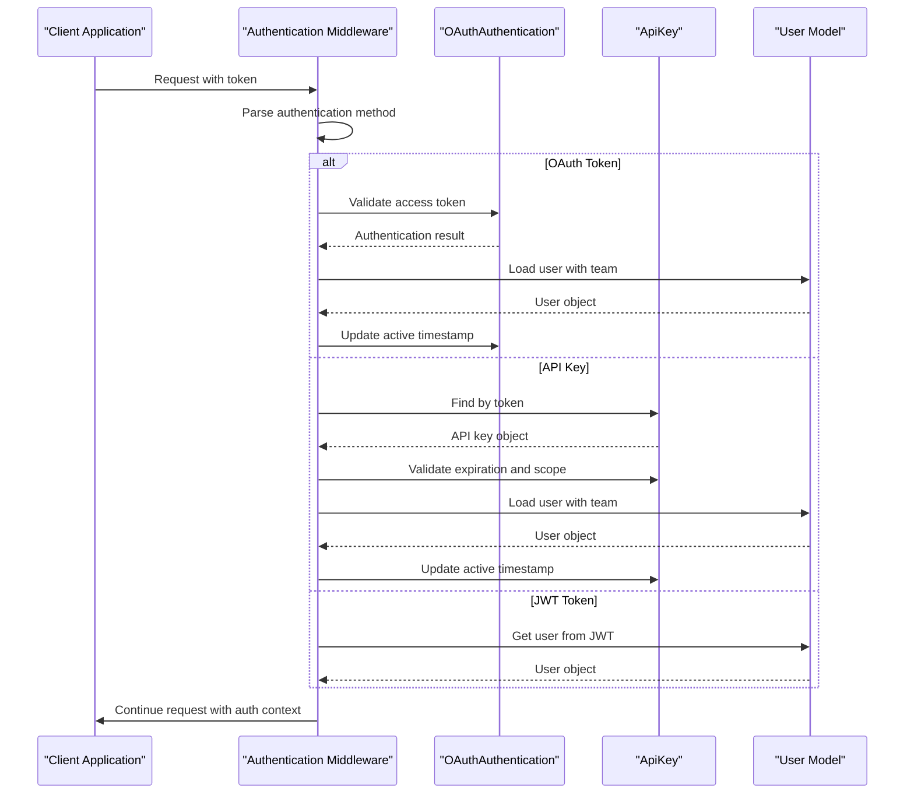
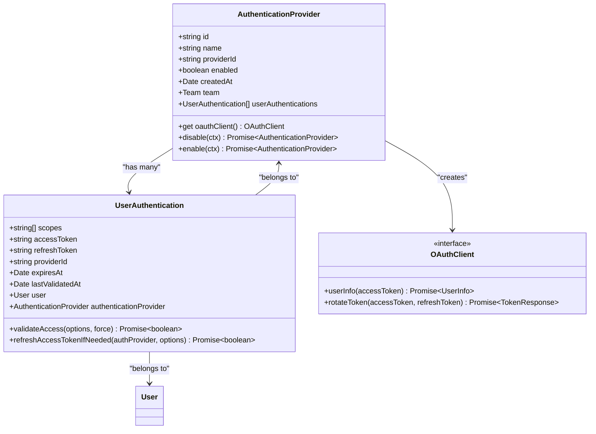
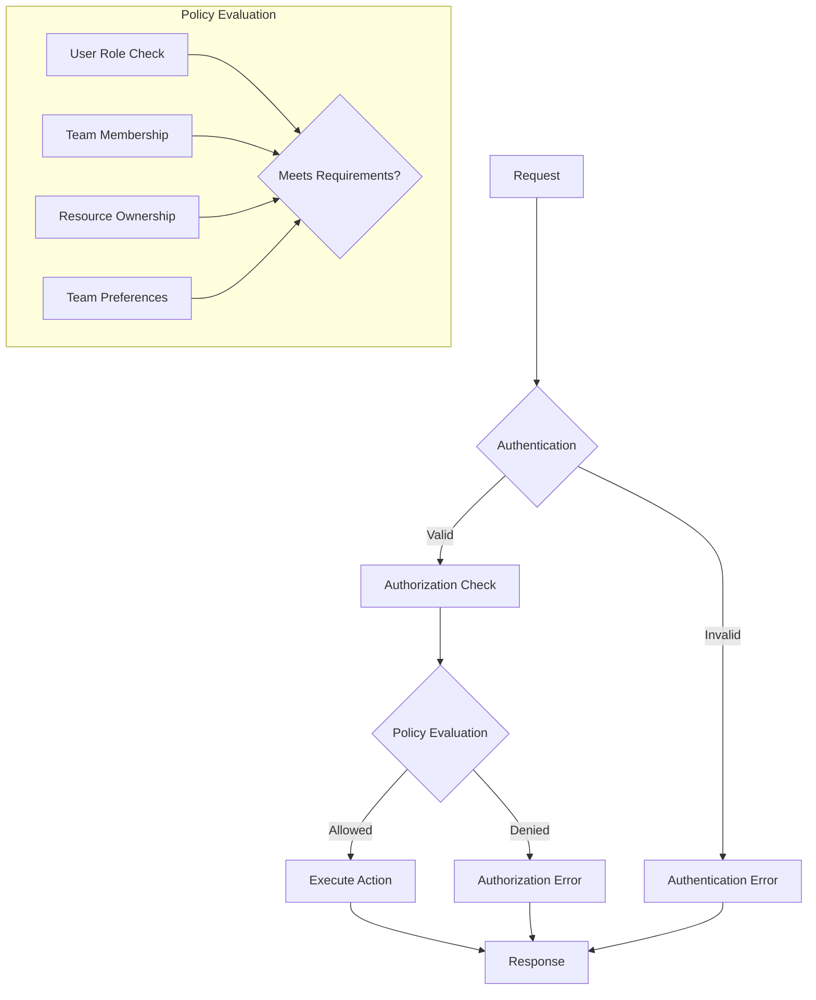

# Authentication & Authorization

<cite>
**Referenced Files in This Document**   
- [authentication.ts](file://server/middlewares/authentication.ts)
- [AuthenticationProvider.ts](file://app/models/AuthenticationProvider.ts)
- [AuthenticationProvider.ts](file://server/models/AuthenticationProvider.ts)
- [UserAuthentication.ts](file://server/models/UserAuthentication.ts)
- [ApiKey.ts](file://server/models/ApiKey.ts)
- [jwt.ts](file://server/utils/jwt.ts)
- [authenticationProvider.ts](file://server/policies/authenticationProvider.ts)
- [user.ts](file://server/policies/user.ts)
- [apiKey.ts](file://server/policies/apiKey.ts)
- [AuthenticationProvidersStore.ts](file://app/stores/AuthenticationProvidersStore.ts)
</cite>

## Table of Contents
1. [Introduction](#introduction)
2. [Authentication Methods](#authentication-methods)
3. [Authentication Flow](#authentication-flow)
4. [Authentication Provider Model](#authentication-provider-model)
5. [Authorization and Policies](#authorization-and-policies)
6. [Role-Based Access Control](#role-based-access-control)
7. [Team-Level Permissions](#team-level-permissions)
8. [Token Management and Security](#token-management-and-security)
9. [Practical Examples](#practical-examples)
10. [Conclusion](#conclusion)

## Introduction

The baozi application implements a comprehensive security system that manages user identity, access control, and resource protection through a robust authentication and authorization framework. This system supports multiple authentication methods including OAuth, API keys, and traditional email/password authentication, providing flexible access options while maintaining strict security standards. The authorization system is built around role-based access control (RBAC) with fine-grained policies that determine user permissions across different models and actions within the application. This documentation provides a detailed overview of the security architecture, explaining how users securely access the system, how permissions are enforced, and how developers can implement custom authorization rules.

## Authentication Methods

The baozi application supports multiple authentication methods to accommodate different use cases and integration scenarios. The primary authentication methods include OAuth for third-party identity providers, API keys for programmatic access, and traditional email/password authentication for direct user login. OAuth integration allows users to authenticate through external identity providers such as Google, Azure, and OIDC-compliant services, leveraging industry-standard protocols for secure identity verification. API keys provide a mechanism for applications and services to authenticate programmatically, with support for expiration dates and scoped access to specific resources. Traditional email/password authentication remains available for direct user login, with additional security features such as email verification codes and transfer tokens for cross-domain authentication. Each authentication method is designed to be secure, with tokens properly validated and access controlled according to the principle of least privilege.

**Section sources**
- [authentication.ts](file://server/middlewares/authentication.ts#L1-L280)
- [AuthenticationProvider.ts](file://server/models/AuthenticationProvider.ts#L27-L140)
- [UserAuthentication.ts](file://server/models/UserAuthentication.ts#L1-L207)

## Authentication Flow

The authentication flow in the baozi application is implemented through a middleware system that processes incoming requests and validates authentication credentials. The primary authentication middleware, located in `authentication.ts`, parses authentication tokens from various sources including headers, cookies, request bodies, and query parameters. The middleware first attempts to identify the authentication method by examining the token format, distinguishing between OAuth access tokens, API keys, and JWT session tokens. For OAuth tokens, the system verifies the token's validity, checks expiration, and ensures the token has access to the requested resource. API key authentication involves hashing the provided key and comparing it against stored hashes, while also validating expiration and access scope. JWT-based authentication decodes and verifies the token signature against the user's secret key, ensuring the token has not been tampered with. Once authenticated, the user's active status is updated, and contextual information is attached to the request for subsequent authorization checks.



**Diagram sources **
- [authentication.ts](file://server/middlewares/authentication.ts#L144-L278)

**Section sources**
- [authentication.ts](file://server/middlewares/authentication.ts#L1-L280)
- [jwt.ts](file://server/utils/jwt.ts#L1-L143)

## Authentication Provider Model

The AuthenticationProvider model serves as the foundation for managing different identity providers within the baozi application. This model exists in both the frontend and backend codebases, with the frontend implementation providing observable properties for UI state management and the backend implementation handling database persistence and business logic. The model tracks essential information such as the provider name, display name, connection status, and enabled state. In the backend, the AuthenticationProvider model includes database fields for the provider ID, creation timestamp, and team association, enabling multi-tenancy support. The model also implements methods for enabling and disabling providers, with validation to ensure that at least one authentication provider remains active for each team. The OAuth client integration is handled through a factory pattern that returns appropriate client instances based on the provider name, currently supporting Google, Azure, and OIDC providers. This design allows for easy extension to support additional identity providers in the future.



**Diagram sources **
- [AuthenticationProvider.ts](file://server/models/AuthenticationProvider.ts#L27-L140)
- [UserAuthentication.ts](file://server/models/UserAuthentication.ts#L1-L207)

**Section sources**
- [AuthenticationProvider.ts](file://app/models/AuthenticationProvider.ts#L1-L26)
- [AuthenticationProvider.ts](file://server/models/AuthenticationProvider.ts#L1-L144)
- [UserAuthentication.ts](file://server/models/UserAuthentication.ts#L1-L207)

## Authorization and Policies

The authorization system in the baozi application is implemented through a policy-based approach that defines access rules for different user roles and actions. Policies are defined in the `server/policies/` directory and use a cancan-style permission system to determine whether a user can perform specific actions on resources. Each policy file corresponds to a model or resource type and defines rules for actions such as create, read, update, and delete. The policy system evaluates these rules based on the user's role, team membership, and ownership of resources. For example, the authentication provider policy allows team administrators to create, update, and delete providers, while all team members can read provider information. Similarly, the API key policy enables users to create keys based on team preferences and allows administrators to manage all keys within their team. The policy system is extensible, allowing new policies to be defined for additional models and actions as the application evolves.



**Diagram sources **
- [authenticationProvider.ts](file://server/policies/authenticationProvider.ts#L1-L10)
- [user.ts](file://server/policies/user.ts#L1-L90)
- [apiKey.ts](file://server/policies/apiKey.ts#L1-L46)

**Section sources**
- [authenticationProvider.ts](file://server/policies/authenticationProvider.ts#L1-L10)
- [user.ts](file://server/policies/user.ts#L1-L90)
- [apiKey.ts](file://server/policies/apiKey.ts#L1-L46)

## Role-Based Access Control

The baozi application implements a role-based access control (RBAC) system that defines user permissions based on their assigned roles within a team. The system supports multiple user roles including Admin, Member, Viewer, and Guest, each with progressively limited permissions. Administrators have full control over team settings, user management, and authentication providers, while members can create and edit content but cannot modify team-wide settings. Viewers have read-only access to content, and guests have the most restricted access, typically limited to specific shared resources. The RBAC system is enforced through policy checks that validate a user's role before allowing access to sensitive operations. For example, only administrators can suspend other users or modify team preferences that affect member capabilities. The system also supports dynamic role evaluation through helper methods that compare role hierarchies, ensuring that users cannot perform actions that exceed their privilege level. This approach provides a clear and predictable access control model that scales well across different team sizes and organizational structures.

**Section sources**
- [user.ts](file://server/models/User.ts#L81-L856)
- [user.ts](file://server/policies/user.ts#L1-L90)
- [UserRoleHelper.ts](file://shared/utils/UserRoleHelper.ts#L1-L50)

## Team-Level Permissions

Team-level permissions in the baozi application provide an additional layer of access control that governs how users interact with team resources and settings. These permissions are implemented through team preferences that can be configured by administrators to customize behavior for all team members. For example, the `MembersCanInvite` preference determines whether regular team members can invite new users, while `MembersCanCreateApiKey` controls whether members can generate API keys for programmatic access. The system also supports document sharing controls that allow users to share content with specific individuals or teams, with options to control whether viewers can download or print shared documents. Team domains provide another layer of access control, allowing organizations to restrict authentication to specific email domains. These team-level permissions are evaluated in conjunction with user roles to determine the final access rights, creating a flexible and granular authorization system that accommodates different organizational requirements.

**Section sources**
- [user.ts](file://server/policies/user.ts#L1-L90)
- [team.ts](file://server/policies/team.ts#L1-L100)
- [Team.ts](file://server/models/Team.ts#L1-L500)

## Token Management and Security

The baozi application implements robust token management and security practices to protect user sessions and API access. Different types of tokens are used for various purposes, each with appropriate expiration and validation mechanisms. Session tokens are implemented as JWTs with configurable expiration times and are stored in secure, HTTP-only cookies to prevent cross-site scripting attacks. Collaboration tokens have a shorter lifespan of 24 hours and are stored in memory rather than persistent storage. Transfer tokens are used for cross-domain authentication and have a very short expiration of one minute, ensuring they can only be used once. API keys are stored in hashed form using cryptographic hashing, with the original value only available during creation. The system also implements token rotation for OAuth access tokens, automatically refreshing expired tokens using refresh tokens when possible. Security best practices include validating token signatures, checking expiration times, and ensuring tokens are transmitted over secure channels.

**Section sources**
- [jwt.ts](file://server/utils/jwt.ts#L1-L143)
- [ApiKey.ts](file://server/models/ApiKey.ts#L1-L183)
- [User.ts](file://server/models/User.ts#L81-L856)

## Practical Examples

Implementing custom authorization rules in the baozi application involves defining policies that evaluate user permissions based on specific criteria. For example, to check if a user can create an authentication provider, the policy system evaluates whether the user is a team administrator. This check is implemented using the `allow` function with the `isTeamAdmin` helper:

```typescript
allow(User, "createAuthenticationProvider", Team, isTeamAdmin);
```

To implement a custom rule that allows members to create API keys only if the team preference is enabled, the policy combines multiple conditions:

```typescript
allow(User, "createApiKey", Team, (actor, team) =>
  and(
    isTeamModel(actor, team),
    isTeamMutable(actor),
    !actor.isViewer,
    !actor.isGuest,
    actor.isAdmin ||
      !!team?.getPreference(TeamPreference.MembersCanCreateApiKey)
  )
);
```

Checking permissions in application code typically involves using the policy system to evaluate whether the current user can perform a specific action on a resource. For example, to check if a user can update an API key:

```typescript
if (policy.allowed("update", apiKey)) {
  // Allow the update operation
} else {
  // Return authorization error
}
```

These examples demonstrate how the policy system provides a flexible and readable way to define complex authorization rules while maintaining security and consistency across the application.

**Section sources**
- [cancan.ts](file://server/policies/cancan.ts#L1-L200)
- [utils.ts](file://server/policies/utils.ts#L1-L150)
- [apiKey.ts](file://server/policies/apiKey.ts#L1-L46)

## Conclusion

The authentication and authorization system in the baozi application provides a comprehensive security framework that balances flexibility with robust protection. By supporting multiple authentication methods, implementing fine-grained authorization policies, and enforcing role-based access control, the system accommodates diverse use cases while maintaining strict security standards. The modular design of the authentication providers allows for easy integration with external identity services, while the policy-based authorization system enables granular control over resource access. Developers can extend the system by defining custom policies and leveraging the existing security infrastructure to implement new features securely. The combination of secure token management, team-level permissions, and comprehensive access controls creates a robust foundation for building secure collaborative applications.