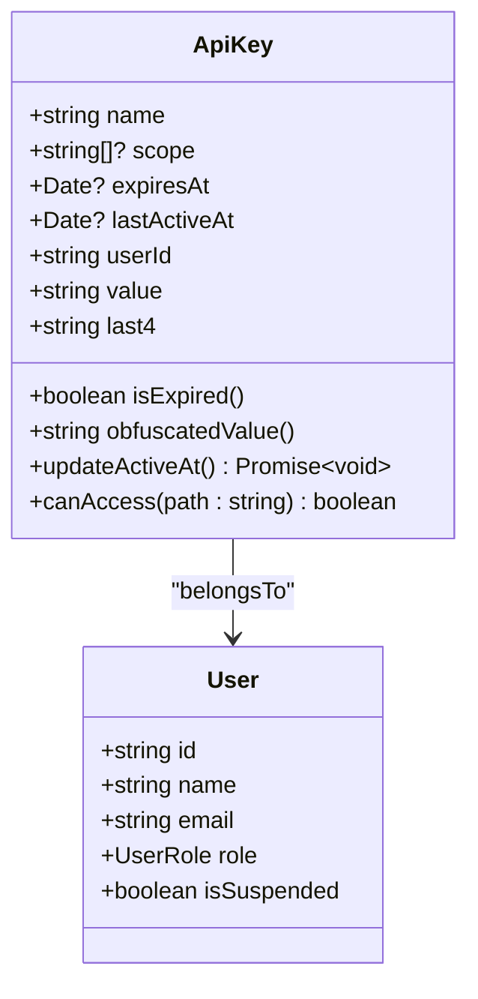
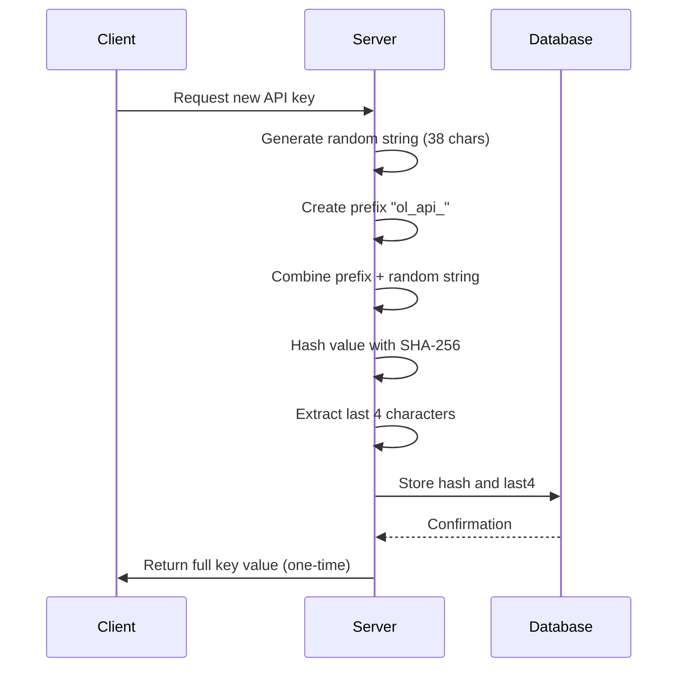
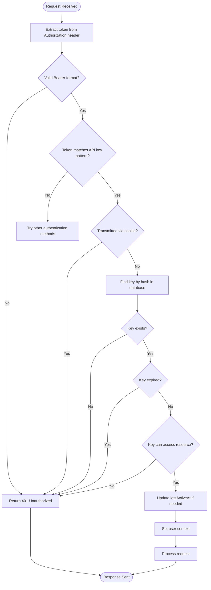
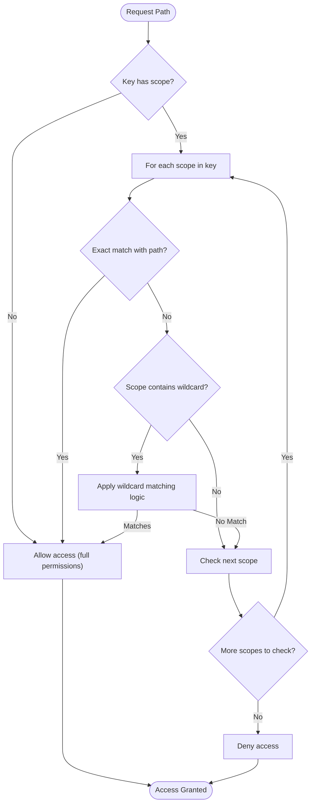

# API Key Authentication

<cite>
**Referenced Files in This Document**   
- [ApiKey.ts](file://app/models/ApiKey.ts)
- [ApiKey.ts](file://server/models/ApiKey.ts)
- [authentication.ts](file://server/middlewares/authentication.ts)
- [20240929194201-add-hash-to-api-key.js](file://server/migrations/20240929194201-add-hash-to-api-key.js)
- [20240930113921-hash-api-keys.ts](file://server/scripts/20240930113921-hash-api-keys.ts)
- [apiKey.ts](file://server/presenters/apiKey.ts)
</cite>

## Table of Contents
1. [Introduction](#introduction)
2. [API Key Model](#api-key-model)
3. [Key Generation and Storage](#key-generation-and-storage)
4. [Authentication Middleware](#authentication-middleware)
5. [Scoped Access Control](#scoped-access-control)
6. [Key Rotation and Identification](#key-rotation-and-identification)
7. [Security Considerations](#security-considerations)
8. [Conclusion](#conclusion)

## Introduction
The API key authentication system in the baozi application provides a secure mechanism for programmatic access to the platform's API. This system enables users to create, manage, and use API keys for automated interactions with the application, supporting both full-access and scoped access patterns. The implementation focuses on security through cryptographic hashing, expiration management, and comprehensive access controls. This documentation details the architecture and functionality of the API key system, providing insights for both beginners and experienced developers implementing API key management in client applications.

## API Key Model
The ApiKey model serves as the foundation for the API key authentication system, managing key metadata and relationships. This model extends the ParanoidModel class, inheriting soft-delete capabilities and timestamp tracking. Key attributes include the human-readable name, optional expiration timestamp, last active timestamp, and user association. The model also tracks the last four characters of the key for user identification without exposing the full secret.

**Diagram sources**
- [ApiKey.ts](file://app/models/ApiKey.ts#L7-L55)
- [User.ts](file://app/models/User.ts#L22-L245)

**Section sources**
- [ApiKey.ts](file://app/models/ApiKey.ts#L7-L55)
- [ApiKey.ts](file://server/models/ApiKey.ts#L27-L179)

## Key Generation and Storage
The API key generation process creates cryptographically secure keys with a standardized prefix "ol_api_" followed by 38 random characters. During creation, the system generates both a plain text value (available only during creation) and a SHA-256 hash for secure storage. The original plain text secret field has been deprecated in favor of the hash-based approach, enhancing security by ensuring that even database administrators cannot access the actual key values.

The migration to hashed storage was implemented through a database migration that added hash and last4 columns while making the secret column nullable. A backfill script processes existing keys by hashing their secrets and nullifying the original values. This transition ensures backward compatibility while improving security across the entire system.

**Diagram sources**
- [ApiKey.ts](file://server/models/ApiKey.ts#L104-L111)
- [20240929194201-add-hash-to-api-key.js](file://server/migrations/20240929194201-add-hash-to-api-key.js#L1-L55)
- [20240930113921-hash-api-keys.ts](file://server/scripts/20240930113921-hash-api-keys.ts#L1-L55)

**Section sources**
- [ApiKey.ts](file://server/models/ApiKey.ts#L104-L111)
- [20240929194201-add-hash-to-api-key.js](file://server/migrations/20240929194201-add-hash-to-api-key.js#L1-L55)
- [20240930113921-hash-api-keys.ts](file://server/scripts/20240930113921-hash-api-keys.ts#L1-L55)

## Authentication Middleware
The authentication middleware processes incoming requests to validate API keys and establish user context. The system extracts authentication tokens from multiple sources including the Authorization header, request body, query parameters, and cookies, with specific restrictions for API keys (prohibiting cookie-based transmission). When an API key is detected in the Authorization header with the Bearer scheme, the middleware validates its format, checks for expiration, and verifies access permissions.

The validation process first confirms the token could be a valid API key using pattern matching, then queries the database for a matching hash. Upon successful validation, the middleware updates the key's last active timestamp (throttled to once every five minutes to reduce database load) and establishes the user context for the request. This comprehensive approach ensures secure, efficient authentication while maintaining detailed audit trails.

**Diagram sources**
- [authentication.ts](file://server/middlewares/authentication.ts#L144-L278)
- [ApiKey.ts](file://server/models/ApiKey.ts#L128-L131)

**Section sources**
- [authentication.ts](file://server/middlewares/authentication.ts#L144-L278)

## Scoped Access Control
The API key system implements granular access control through scoped permissions, allowing keys to be restricted to specific API endpoints. When a key is created without a scope, it has full access to all API endpoints. Scoped keys contain an array of permission strings that define exactly which endpoints they can access, supporting wildcard patterns for flexible permission management.

The canAccess method evaluates whether a key can access a specific path by comparing it against the key's scope array. This method supports two types of wildcards: namespace wildcards (e.g., "/api/*.info" matches any .info endpoint) and method wildcards (e.g., "/api/documents.*" matches any documents endpoint). The system also accounts for query strings when evaluating access, ensuring that parameters don't affect permission checks. This flexible scoping system enables fine-grained security policies while maintaining usability.

**Diagram sources**
- [ApiKey.ts](file://server/models/ApiKey.ts#L172-L179)
- [authentication.ts](file://server/middlewares/authentication.ts#L223-L226)

**Section sources**
- [ApiKey.ts](file://server/models/ApiKey.ts#L172-L179)

## Key Rotation and Identification
The system incorporates several features to support secure key management and user experience. The last4 field stores the final four characters of each API key, allowing users to identify their keys in lists without exposing the full secret. This feature is particularly useful when managing multiple keys, as users can distinguish between keys by their unique endings.

The obfuscatedValue computed property provides a masked representation of the key (e.g., "ol...abcd") that can be safely displayed in user interfaces. For keys created before December 3, 2022, the system uses a legacy format without the "ol_" prefix. The lastActiveAt timestamp is updated only when at least five minutes have passed since the previous update, reducing database write frequency while still providing meaningful usage information for monitoring and security audits.

**Section sources**
- [ApiKey.ts](file://app/models/ApiKey.ts#L43-L55)
- [ApiKey.ts](file://server/models/ApiKey.ts#L160-L169)

## Security Considerations
The API key system implements multiple security measures to protect against common threats. The hashing mechanism ensures that even if the database is compromised, attackers cannot retrieve the actual key values, only their hashes. Rate limiting is enforced through the lastActiveAt update throttling, which limits database writes to once every five minutes per key, indirectly mitigating brute force attacks.

Expired keys are automatically deactivated and rejected during authentication, preventing continued use of outdated credentials. The system prohibits passing API keys in cookies, reducing the risk of cross-site request forgery (CSRF) attacks. Additionally, all key creation and validation operations are logged, providing an audit trail for security monitoring. The separation between the one-time plaintext value (available only during creation) and the stored hash further enhances security by minimizing exposure of sensitive data.

**Section sources**
- [ApiKey.ts](file://server/models/ApiKey.ts#L71-L75)
- [authentication.ts](file://server/middlewares/authentication.ts#L219-L221)
- [ApiKey.ts](file://server/models/ApiKey.ts#L160-L169)

## Conclusion
The API key authentication system in the baozi application provides a robust, secure foundation for programmatic access to the platform's functionality. By combining cryptographic hashing, granular scoped permissions, and comprehensive audit trails, the system balances security with usability. The implementation supports both simple full-access keys for development purposes and finely-grained scoped keys for production integrations. Developers can leverage this system to build secure client applications with confidence, knowing that the underlying authentication mechanism protects against common security threats while providing the flexibility needed for diverse use cases.