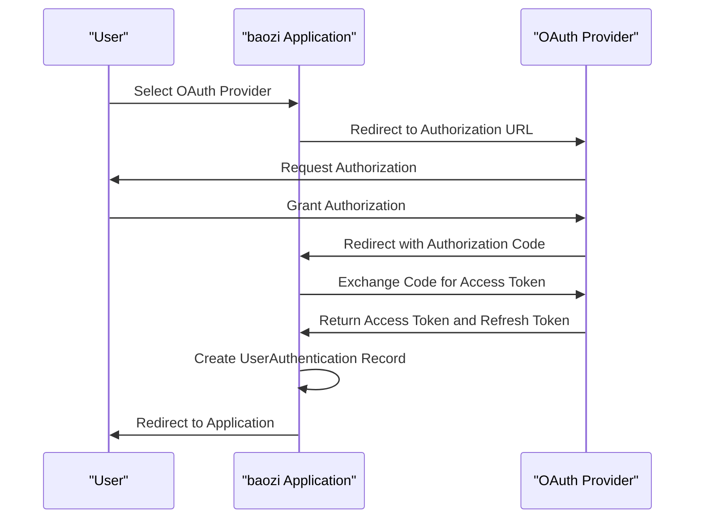
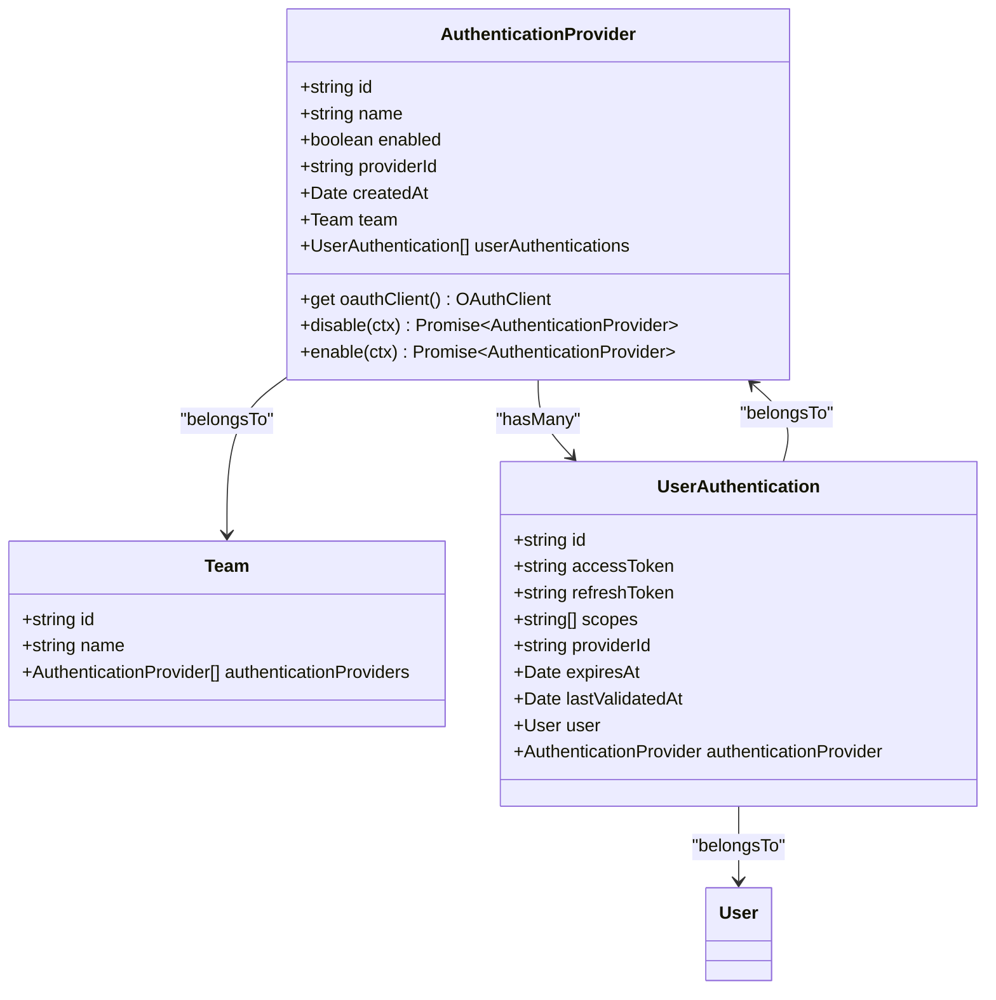
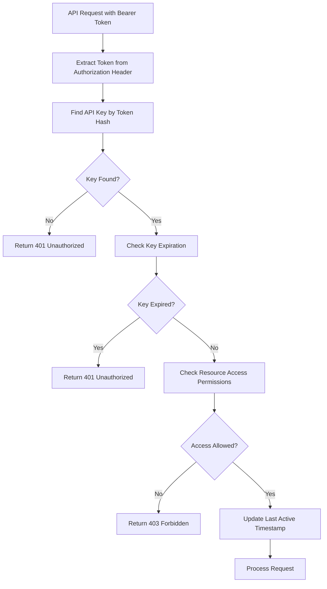

# Authentication Methods

<cite>
**Referenced Files in This Document**   
- [authentication.ts](file://server/middlewares/authentication.ts)
- [AuthenticationProvider.ts](file://app/models/AuthenticationProvider.ts)
- [AuthenticationProvider.ts](file://server/models/AuthenticationProvider.ts)
- [UserAuthentication.ts](file://server/models/UserAuthentication.ts)
- [ApiKey.ts](file://app/models/ApiKey.ts)
- [ApiKey.ts](file://server/models/ApiKey.ts)
- [passport.ts](file://server/utils/passport.ts)
- [authenticationProviders.ts](file://server/routes/api/authenticationProviders/authenticationProviders.ts)
- [oidcRouter.ts](file://plugins/oidc/server/auth/oidcRouter.ts)
</cite>

## Table of Contents
1. [Introduction](#introduction)
2. [OAuth Integration](#oauth-integration)
3. [Authentication Provider Model](#authentication-provider-model)
4. [API Key Authentication](#api-key-authentication)
5. [Email/Password Authentication](#emailpassword-authentication)
6. [Passport.js Orchestration](#passportjs-orchestration)
7. [Security Considerations](#security-considerations)

## Introduction
The baozi application implements a comprehensive multi-method authentication system that supports various authentication strategies including OAuth providers (GitHub, Google, OIDC), API keys for programmatic access, and traditional email/password authentication. The system is designed to be flexible, secure, and extensible, allowing organizations to configure their preferred authentication methods based on their security requirements and infrastructure. This document provides a detailed analysis of the authentication architecture, focusing on the implementation of different authentication methods, the underlying data models, and the security mechanisms in place.

## OAuth Integration
The baozi application supports OAuth integration with providers such as GitHub, Google, and OIDC through a modular plugin architecture. The authentication flow begins when a user selects an OAuth provider from the login interface, which redirects them to the provider's authorization endpoint. The system uses Passport.js as the authentication middleware to handle the OAuth 2.0 flow, managing the authorization code exchange for access tokens. The `authenticationProviders.ts` file in the server routes directory defines the API endpoints for handling authentication provider operations, including enabling and disabling providers. When a user authenticates through an OAuth provider, the system creates a UserAuthentication record that stores the access token, refresh token, and associated scopes, encrypted for security. The authentication flow is stateful, using a state parameter to prevent CSRF attacks, with the state stored in cookies and validated upon callback.

**Diagram sources**
- [authenticationProviders.ts](file://server/routes/api/authenticationProviders/authenticationProviders.ts#L18-L103)
- [oidcRouter.ts](file://plugins/oidc/server/auth/oidcRouter.ts#L40-L224)

**Section sources**
- [authenticationProviders.ts](file://server/routes/api/authenticationProviders/authenticationProviders.ts#L1-L103)
- [oidcRouter.ts](file://plugins/oidc/server/auth/oidcRouter.ts#L1-L226)

## Authentication Provider Model
The AuthenticationProvider model serves as the foundation for managing identity provider configurations within the baozi application. This model, defined in both the client and server codebases, represents an authentication provider that can be enabled or disabled for a team. The server-side model extends Sequelize's Model class and includes fields such as id, name, enabled status, providerId, and createdAt. The name field corresponds to the provider type (e.g., "google", "azure", "oidc"), while the enabled field determines whether the provider is active for the team. The model includes a computed property `oauthClient` that returns an instance of the appropriate OAuth client based on the provider name. The AuthenticationProvider model is associated with the Team model, allowing each team to have multiple authentication providers configured. The model also includes methods for enabling and disabling providers, with validation to ensure that at least one provider remains enabled.

**Diagram sources**
- [AuthenticationProvider.ts](file://server/models/AuthenticationProvider.ts#L27-L140)
- [UserAuthentication.ts](file://server/models/UserAuthentication.ts#L24-L203)
- [Team.ts](file://server/models/Team.ts#L54-L473)

**Section sources**
- [AuthenticationProvider.ts](file://server/models/AuthenticationProvider.ts#L1-L144)
- [AuthenticationProvider.ts](file://app/models/AuthenticationProvider.ts#L1-L26)

## API Key Authentication
The API key authentication mechanism in the baozi application provides programmatic access to the API for automation and integration purposes. API keys are implemented as a first-class entity in the system, with their own data model and management interface. The ApiKey model includes fields for name, scope, expiresAt, lastActiveAt, and userId, allowing for fine-grained control over key permissions and lifecycle. When creating an API key, the system generates a cryptographically secure token with a configurable expiration date. The key's value is hashed before storage using a secure hashing algorithm, ensuring that even if the database is compromised, the actual key values cannot be retrieved. The API key authentication flow involves extracting the token from the Authorization header and validating it against the stored hash. The system also tracks the last active timestamp for each key, enabling usage monitoring and anomaly detection.

**Diagram sources**
- [ApiKey.ts](file://server/models/ApiKey.ts#L26-L179)
- [authentication.ts](file://server/middlewares/authentication.ts#L201-L244)

**Section sources**
- [ApiKey.ts](file://server/models/ApiKey.ts#L1-L179)
- [ApiKey.ts](file://app/models/ApiKey.ts#L1-L57)

## Email/Password Authentication
Email/password authentication in the baozi application provides a traditional login method for users who prefer not to use OAuth providers. This authentication method includes CSRF protection through the use of anti-forgery tokens and implements session management to maintain user state across requests. When a user submits their email and password, the system verifies the credentials against the stored hash in the database. Upon successful authentication, the system creates a session and returns a JWT token that is stored in an HTTP-only cookie to prevent XSS attacks. The session includes information about the user's role, team membership, and authentication type. The system also implements rate limiting on authentication endpoints to prevent brute force attacks. For enhanced security, the application supports one-time passwords (OTP) as an alternative to traditional password authentication, providing an additional layer of protection against credential stuffing attacks.

**Section sources**
- [authentication.ts](file://server/middlewares/authentication.ts#L151-L247)
- [AuthenticationProvider.ts](file://app/models/AuthenticationProvider.ts#L4-L22)

## Passport.js Orchestration
Passport.js serves as the central authentication orchestrator in the baozi application, managing the integration of multiple authentication strategies. The system configures Passport with custom strategies for each supported provider, including GitHub, Google, and OIDC. The passport middleware, defined in the `passport.ts` file, handles the authentication flow by intercepting requests, validating credentials, and establishing user sessions. The middleware uses a state store to manage the OAuth state parameter, preventing CSRF attacks during the authentication flow. When an authentication request is received, Passport invokes the appropriate strategy based on the provider name, which then handles the protocol-specific details of the authentication process. Upon successful authentication, Passport calls the `accountProvisioner` function to create or update the user account and establish the necessary relationships in the database. The system also implements custom error handling to provide meaningful feedback to users when authentication fails.

**Section sources**
- [passport.ts](file://server/utils/passport.ts#L12-L98)
- [authenticationProviders.ts](file://server/routes/api/authenticationProviders/authenticationProviders.ts#L18-L103)

## Security Considerations
The baozi application implements several security measures to protect against common vulnerabilities and ensure the integrity of the authentication system. Token expiration is enforced for both OAuth access tokens and API keys, with refresh tokens used to obtain new access tokens without requiring user interaction. The system validates the scope of each token to ensure that users can only access resources they are authorized to use. For OAuth providers, the application verifies the state parameter to prevent CSRF attacks and uses PKCE (Proof Key for Code Exchange) when supported by the provider. The system also implements rate limiting on authentication endpoints to prevent brute force attacks and monitors for suspicious authentication patterns. Additionally, all sensitive data, including access tokens and refresh tokens, is encrypted at rest using industry-standard encryption algorithms. The application also supports multi-factor authentication through the use of one-time passwords, providing an additional layer of security for sensitive operations.

**Section sources**
- [authentication.ts](file://server/middlewares/authentication.ts#L1-L280)
- [UserAuthentication.ts](file://server/models/UserAuthentication.ts#L80-L203)
- [ApiKey.ts](file://server/models/ApiKey.ts#L26-L179)