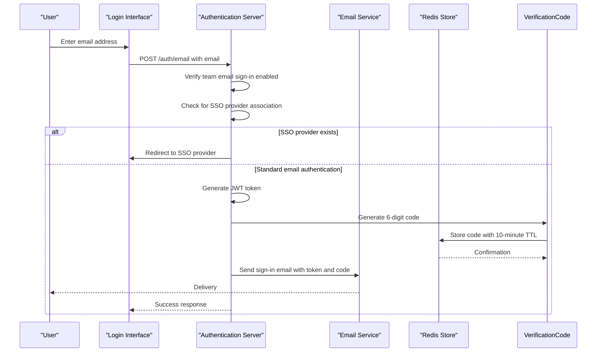
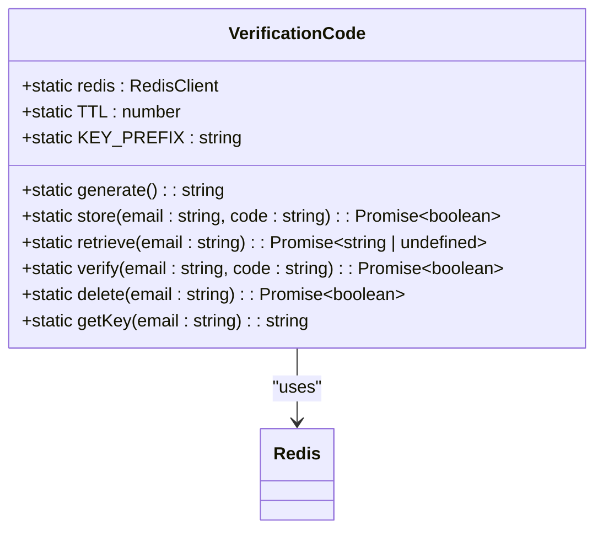
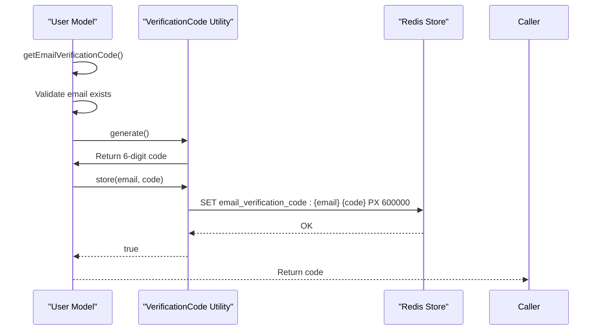
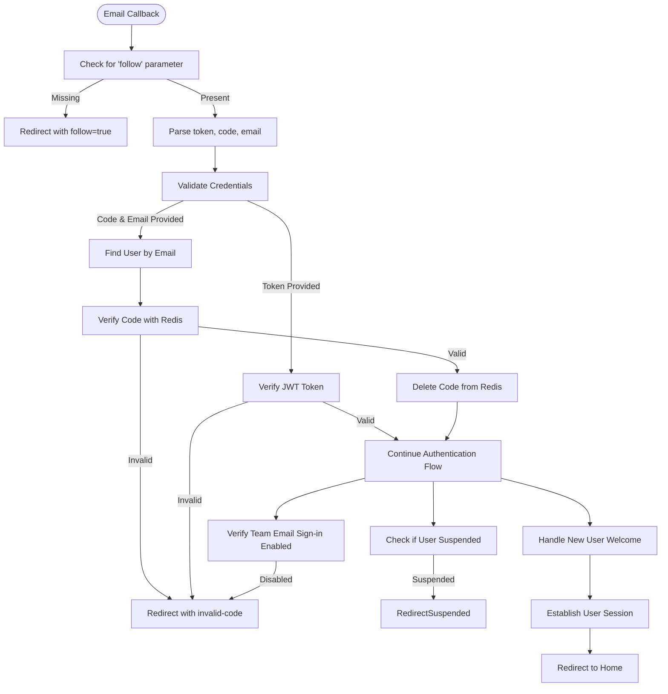

# Email & Password Authentication

<cite>
**Referenced Files in This Document**   
- [User.ts](file://app/models/User.ts)
- [User.ts](file://server/models/User.ts)
- [VerificationCode.ts](file://server/utils/VerificationCode.ts)
- [email.ts](file://plugins/email/server/auth/email.ts)
- [schema.ts](file://plugins/email/server/auth/schema.ts)
- [Login.tsx](file://app/scenes/Login/Login.tsx)
- [AuthenticationProvider.tsx](file://app/scenes/Login/components/AuthenticationProvider.tsx)
- [csrf.ts](file://server/middlewares/csrf.ts)
</cite>

## Table of Contents
1. [Introduction](#introduction)
2. [Two-Factor Email Authentication Flow](#two-factor-email-authentication-flow)
3. [Verification Code Utility](#verification-code-utility)
4. [User Model Authentication Methods](#user-model-authentication-methods)
5. [CSRF Protection Mechanism](#csrf-protection-mechanism)
6. [Email Callback Handler](#email-callback-handler)
7. [Login Interface Options](#login-interface-options)
8. [Security Considerations](#security-considerations)
9. [Conclusion](#conclusion)

## Introduction
The baozi application implements a secure email-based authentication system that allows users to sign in using their email addresses without traditional password storage. This system leverages two-factor authentication through either time-limited JWT tokens or one-time verification codes sent to user email addresses. The approach eliminates the need to store password hashes while maintaining robust security through cryptographic tokens and time-limited verification codes. This documentation details the implementation of this authentication system, focusing on the email and password sub-feature that enables users to access their accounts through secure, passwordless methods.

## Two-Factor Email Authentication Flow
The baozi application implements a two-factor email authentication system that provides users with two options for secure login: magic links containing time-limited JWT tokens or one-time verification codes. When a user enters their email address on the login page, the system initiates the authentication flow by first verifying that email sign-in is enabled for the team. The system then checks if the user's email is associated with any Single Sign-On (SSO) providers. If an SSO provider is detected, the user is automatically redirected to the appropriate SSO sign-in page, preventing potential conflicts between authentication methods.

For users without SSO providers, the system generates both a magic link token and a one-time verification code simultaneously. The magic link token is a JWT that contains the user's ID, IP address, creation timestamp, and type identifier "email-signin". This token has a medium-length expiry and can only be used once for signing in. The one-time verification code is a 6-digit numeric code generated by the VerificationCode utility and stored in Redis with a 10-minute TTL. Both authentication methods are sent to the user's email address in a single email, allowing the user to choose their preferred method.

**Diagram sources**
- [email.ts](file://plugins/email/server/auth/email.ts#L23-L96)
- [VerificationCode.ts](file://server/utils/VerificationCode.ts#L33-L36)

**Section sources**
- [email.ts](file://plugins/email/server/auth/email.ts#L23-L96)
- [schema.ts](file://plugins/email/server/auth/schema.ts#L5-L10)

## Verification Code Utility
The VerificationCode utility is a critical component of the baozi application's email authentication system, responsible for generating and managing 6-digit verification codes stored in Redis with a 10-minute time-to-live (TTL). This utility class provides a secure mechanism for one-time password (OTP) authentication that complements the JWT-based magic link approach. The class implements several key methods: generate(), store(), retrieve(), verify(), and delete(), each designed to handle specific aspects of the verification code lifecycle.

The generate() method creates a random 6-digit code by generating a random integer between 100,000 and 999,999, ensuring that each code has exactly six digits through padding if necessary. This approach provides approximately one million possible combinations, making brute force attacks impractical within the 10-minute validity window. The store() method saves the generated code in Redis using a key pattern "email_verification_code:{email}" where the email is converted to lowercase to ensure case-insensitive lookups. The Redis entry is set with a PX (milliseconds) option specifying a TTL of 600,000 milliseconds (10 minutes), after which the code automatically expires and is removed from the store.

**Diagram sources**
- [VerificationCode.ts](file://server/utils/VerificationCode.ts#L10-L95)

**Section sources**
- [VerificationCode.ts](file://server/utils/VerificationCode.ts#L10-L95)

## User Model Authentication Methods
The User model in the baozi application implements two key methods for email-based authentication: getEmailSigninToken and getEmailVerificationCode. These methods are integral to the passwordless authentication system, providing secure alternatives to traditional password-based login. The getEmailSigninToken method generates a time-limited JWT token specifically for email sign-in purposes. This token contains the user's ID, IP address, creation timestamp, and a type identifier "email-signin". The token is signed with the user's unique jwtSecret, which is randomly generated upon user creation and rotated when the user signs out, ensuring that previously issued tokens are invalidated.

The getEmailVerificationCode method orchestrates the generation and storage of one-time verification codes for email authentication. When called, this method first verifies that the user has a valid email address. It then generates a 6-digit code using the VerificationCode utility's generate method and stores this code in Redis with a 10-minute TTL. The method returns the generated code, which is subsequently included in the sign-in email sent to the user. This implementation ensures that verification codes are securely generated, stored, and validated without exposing sensitive information in the application's database.

**Diagram sources**
- [User.ts](file://server/models/User.ts#L608-L616)
- [User.ts](file://server/models/User.ts#L591-L600)

**Section sources**
- [User.ts](file://server/models/User.ts#L591-L616)

## CSRF Protection Mechanism
The baozi application implements a robust CSRF (Cross-Site Request Forgery) protection mechanism to secure form submissions and prevent unauthorized actions. This protection is implemented through middleware that generates and verifies CSRF tokens for mutating requests while allowing safe methods like GET, HEAD, and OPTIONS to proceed without protection. The system uses a dual-layer approach: attaching CSRF tokens to responses for safe methods and verifying tokens for potentially mutating requests.

The CSRF protection middleware first checks if a valid CSRF token already exists in the user's cookies. If no valid token is found, it generates a new one using a cryptographically secure random token generator. The token is then bundled with a signature using the application's secret key and set as a cookie with httpOnly: false to allow JavaScript access while maintaining security through the sameSite: "lax" policy. For request verification, the middleware determines whether CSRF protection is required by evaluating the request method, authentication transport, and API route scope. Requests using cookie-based authentication for mutating operations are protected, while API routes accessible with read-only scope are exempt from CSRF protection to accommodate programmatic access.

**Section sources**
- [csrf.ts](file://server/middlewares/csrf.ts#L36-L88)

## Email Callback Handler
The email callback handler in the baozi application processes authentication callbacks from both magic link tokens and one-time verification codes, validating the credentials before establishing user sessions. This handler is implemented as a dual-route endpoint that accepts both GET and POST requests to /auth/email.callback, providing flexibility for different client implementations. The handler first checks for the presence of a "follow" parameter, which is used to prevent anti-virus software and email clients from pre-fetching the authentication link and consuming the one-time token before the user clicks on it. If the follow parameter is missing, the handler redirects the client to the same URL with the follow parameter added, ensuring the authentication flow completes only when intentionally initiated by the user.

When processing the callback, the handler evaluates whether a token or code/email combination is provided. For token-based authentication, it validates the JWT using the getUserForEmailSigninToken utility, which verifies the token's signature, expiration, and embedded user information. For code-based authentication, it retrieves the user record and verifies that the provided code matches the one stored in Redis using the VerificationCode utility's verify method. Upon successful validation, the handler deletes the verification code from Redis to prevent reuse and establishes the user session through the signIn utility. The handler also manages post-authentication workflows, such as sending welcome emails to newly invited users and notification emails to inviters when new users accept invitations.

**Diagram sources**
- [email.ts](file://plugins/email/server/auth/email.ts#L99-L197)

**Section sources**
- [email.ts](file://plugins/email/server/auth/email.ts#L99-L197)

## Login Interface Options
The login interface in the baozi application presents users with both link-based and code-based authentication options, providing flexibility in how users access their accounts. The interface dynamically determines the preferred method based on client context, defaulting to one-time password (OTP) entry for Progressive Web App (PWA) installations and when explicitly requested through the forceOTP query parameter. For standard web and desktop clients, the magic link method is presented as the primary option, with the OTP method available as an alternative.

When a user submits their email address, the interface displays a confirmation screen indicating that an authentication method has been sent to their email. If the OTP method is preferred, the interface renders a one-time password input field where users can enter the 6-digit verification code received via email. This input is implemented as a specialized OneTimePasswordInput component that provides a user-friendly interface for code entry. If the magic link method is used, the interface simply instructs the user to check their email for the sign-in link, with an option to return to the login screen if the email is not received.

The interface also handles edge cases such as SSO provider conflicts by automatically redirecting users to their associated SSO provider's sign-in page when their email is linked to an SSO account. This prevents authentication method conflicts and ensures a seamless user experience. For new users who have been invited but not yet signed in, the system triggers a welcome email upon first authentication, and notifies the inviting user if they have subscribed to invitation acceptance notifications.

**Section sources**
- [Login.tsx](file://app/scenes/Login/Login.tsx#L220-L268)
- [AuthenticationProvider.tsx](file://app/scenes/Login/components/AuthenticationProvider.tsx#L41-L70)

## Security Considerations
The baozi application's email-based authentication system incorporates multiple security measures to protect against common attack vectors while maintaining a user-friendly experience. The system implements brute force protection through rate limiting middleware that restricts authentication attempts to ten per hour for initial email requests and five per minute for callback verification. This prevents attackers from systematically guessing email addresses or verification codes. Code guessing prevention is achieved through the use of 6-digit verification codes with 10-minute TTLs, limiting the window of opportunity for brute force attacks to a maximum of 600,000 possible combinations within a short timeframe.

Session fixation attacks are mitigated through the use of time-limited, single-use tokens and the automatic rotation of user JWT secrets upon sign-out. The magic link tokens contain the user's IP address as a claim, preventing token reuse from different locations. Additionally, the system employs CSRF protection for form submissions, using cryptographically signed tokens with lax same-site policies to prevent cross-origin request forgery. The application also handles SSO provider conflicts securely by redirecting users to their designated SSO provider rather than allowing authentication method mixing, which could create security vulnerabilities.

The security model benefits from not storing password hashes, eliminating the risk of password database breaches. Instead, the system relies on cryptographic tokens and time-limited verification codes, with user secrets (jwtSecret) encrypted in the database. The trade-offs of this passwordless approach include dependency on email security and potential accessibility issues if users cannot access their email accounts. However, these are balanced by improved security posture, reduced attack surface, and simplified user experience without the need to remember complex passwords.

**Section sources**
- [email.ts](file://plugins/email/server/auth/email.ts#L25-L26)
- [email.ts](file://plugins/email/server/auth/email.ts#L200-L201)
- [csrf.ts](file://server/middlewares/csrf.ts#L36-L88)
- [User.ts](file://server/models/User.ts#L529-L532)

## Conclusion
The email and password authentication system in the baozi application represents a modern, secure approach to user authentication that eliminates the need for traditional password storage while maintaining robust security controls. By implementing a dual-method system with both time-limited JWT tokens and one-time verification codes, the application provides users with flexible authentication options that balance convenience and security. The integration of CSRF protection, rate limiting, and secure token management demonstrates a comprehensive security strategy that addresses common web application vulnerabilities.

The system's architecture, with clear separation between the frontend interface, authentication logic, and utility components, enables maintainable and extensible code. The use of Redis for temporary code storage ensures high-performance verification while maintaining data isolation from the primary database. For developers, the implementation offers valuable insights into passwordless authentication patterns, secure token management, and the trade-offs between usability and security in modern web applications. As organizations increasingly prioritize security and user experience, this authentication model provides a compelling alternative to traditional password-based systems.