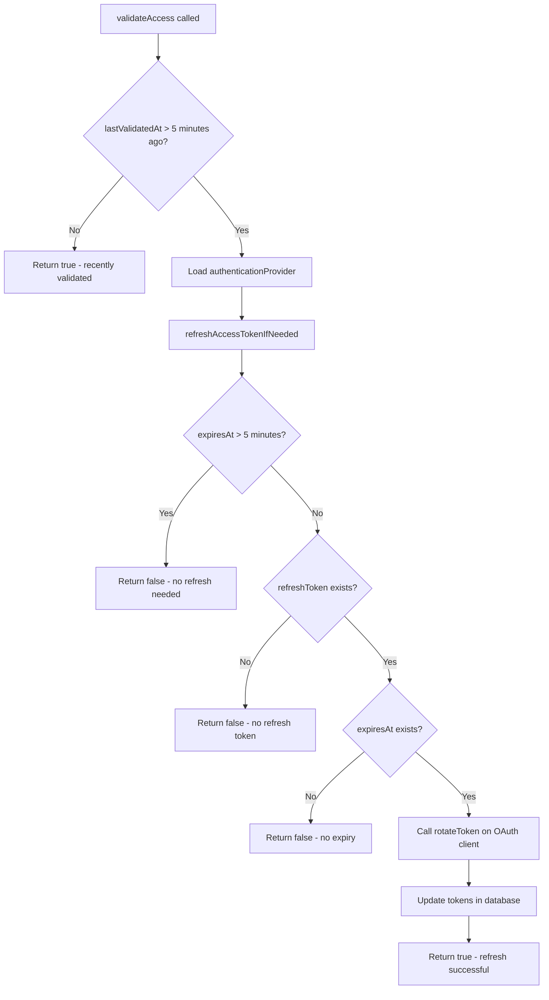
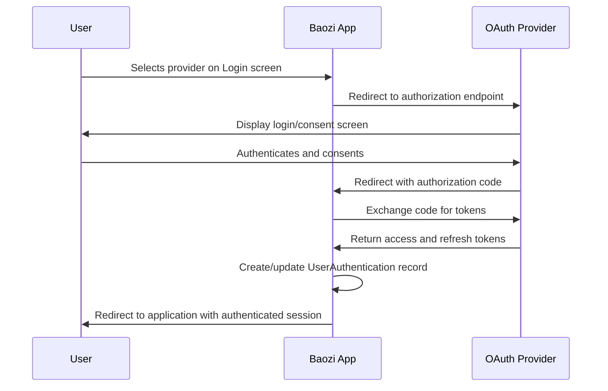
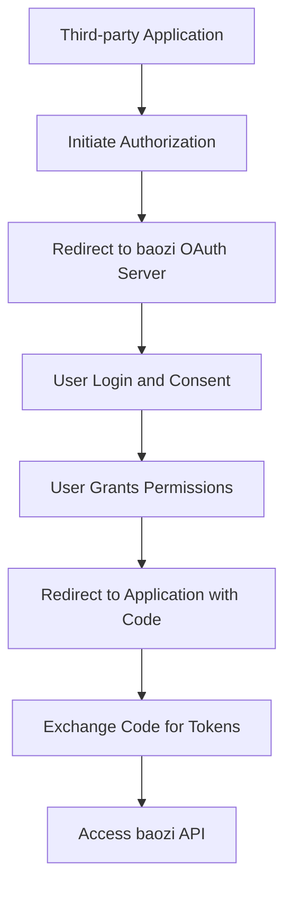

# OAuth Authentication

<cite>
**Referenced Files in This Document**   
- [AuthenticationProvider.ts](file://app/models/AuthenticationProvider.ts)
- [AuthenticationProvider.ts](file://server/models/AuthenticationProvider.ts)
- [UserAuthentication.ts](file://server/models/UserAuthentication.ts)
- [passport.ts](file://server/middlewares/passport.ts)
- [utils/passport.ts](file://server/utils/passport.ts)
- [Login.tsx](file://app/scenes/Login/Login.tsx)
- [OAuthAuthorize.tsx](file://app/scenes/Login/OAuthAuthorize.tsx)
- [google.ts](file://plugins/google/server/google.ts)
- [azure.ts](file://plugins/azure/server/azure.ts)
- [oidc.ts](file://plugins/oidc/server/oidc.ts)
- [OAuthClient.ts](file://server/models/oauth/OAuthClient.ts)
</cite>

## Table of Contents
1. [Introduction](#introduction)
2. [Authentication Provider Model](#authentication-provider-model)
3. [User Authentication Model](#user-authentication-model)
4. [Passport.js Integration](#passportjs-integration)
5. [Authentication Lifecycle](#authentication-lifecycle)
6. [State Management and CSRF Protection](#state-management-and-csrf-protection)
7. [Token Refresh Mechanism](#token-refresh-mechanism)
8. [Security Considerations](#security-considerations)
9. [OAuth Client Management](#oauth-client-management)
10. [Conclusion](#conclusion)

## Introduction
The baozi application implements a robust OAuth 2.0 authentication system that enables users to sign in using third-party identity providers such as GitHub, Google, and OIDC-compliant services. This system is built on Passport.js and follows industry-standard security practices to ensure secure authentication flows. The implementation supports both user authentication and OAuth client applications, allowing for both login integration and third-party app authorization. The architecture is designed to be extensible, with plugin-based provider implementations and a centralized authentication management system.

## Authentication Provider Model

The AuthenticationProvider model serves as the central configuration entity for OAuth identity providers within the baozi application. It exists in both the frontend and backend with slightly different implementations that serve complementary purposes.

On the backend, the AuthenticationProvider model (located in `server/models/AuthenticationProvider.ts`) defines the database schema and business logic for managing authentication providers. Each provider record contains essential fields such as `id`, `name`, `enabled` status, and `providerId`. The model establishes a relationship with the Team model, allowing authentication providers to be scoped to specific teams or workspaces.

A key feature of this model is the `oauthClient` getter method, which dynamically creates an instance of the appropriate OAuth client based on the provider name:

```typescript
get oauthClient() {
  switch (this.name) {
    case "google":
      return new GoogleClient();
    case "azure":
      return new AzureClient();
    case "oidc":
      return new OIDCClient();
    default:
      return undefined;
  }
}
```

This polymorphic approach allows the system to handle different OAuth providers through a consistent interface while accommodating provider-specific configurations and endpoints.

The frontend AuthenticationProvider model (in `app/models/AuthenticationProvider.ts`) serves as a lightweight representation used for UI state management. It contains properties like `displayName`, `name`, `isConnected`, and `isEnabled`, which are used to render authentication options in the login interface.

**Section sources**
- [AuthenticationProvider.ts](file://app/models/AuthenticationProvider.ts)
- [AuthenticationProvider.ts](file://server/models/AuthenticationProvider.ts)

## User Authentication Model

The UserAuthentication model (located in `server/models/UserAuthentication.ts`) represents the persistent record of a user's connection to an external identity provider. This model stores the OAuth tokens and metadata that enable seamless authentication across sessions.

Key properties of the UserAuthentication model include:
- `accessToken`: The OAuth access token, encrypted at rest
- `refreshToken`: The OAuth refresh token, encrypted at rest
- `providerId`: The unique identifier of the user within the external provider
- `scopes`: The permissions granted by the user
- `expiresAt`: The expiration timestamp of the access token
- `lastValidatedAt`: The timestamp of the last successful token validation

The model implements critical security and maintenance functionality through its methods. The `validateAccess` method checks the validity of the stored tokens and refreshes them if necessary:



**Diagram sources**
- [UserAuthentication.ts](file://server/models/UserAuthentication.ts#L90-L202)

The model also includes lifecycle hooks that automatically set the `lastValidatedAt` timestamp when a record is created or when the access token is updated, ensuring that token validation state is always current.

**Section sources**
- [UserAuthentication.ts](file://server/models/UserAuthentication.ts)

## Passport.js Integration

The baozi application leverages Passport.js as the core authentication middleware, with custom implementations for each supported OAuth provider. The integration is orchestrated through the passport middleware located in `server/middlewares/passport.ts`.

The middleware function creates a provider-specific authentication handler that processes the OAuth callback flow:

```typescript
export default function createMiddleware(providerName: string) {
  return function passportMiddleware(ctx: Context) {
    return passport.authorize(
      providerName,
      {
        session: false,
      },
      async (err, user, result: AuthenticationResult) => {
        // Error handling and user sign-in logic
      }
    )(ctx);
  };
}
```

Each OAuth provider is implemented as a plugin that extends a base OAuthClient class. For example, the Google client (in `plugins/google/server/google.ts`) configures the standard Google OAuth endpoints:

```typescript
export default class GoogleClient extends OAuthClient {
  endpoints = {
    authorize: "https://accounts.google.com/o/oauth2/auth",
    token: "https://accounts.google.com/o/oauth2/token",
    userinfo: "https://www.googleapis.com/oauth2/v3/userinfo",
  };

  constructor() {
    invariant(env.GOOGLE_CLIENT_ID, "GOOGLE_CLIENT_ID is required");
    invariant(env.GOOGLE_CLIENT_SECRET, "GOOGLE_CLIENT_SECRET is required");
    super(env.GOOGLE_CLIENT_ID, env.GOOGLE_CLIENT_SECRET);
  }
}
```

The Azure and OIDC clients follow a similar pattern, with provider-specific endpoint configurations and any necessary customizations to the authentication flow. This plugin architecture allows for easy addition of new OAuth providers without modifying the core authentication system.

**Section sources**
- [passport.ts](file://server/middlewares/passport.ts)
- [google.ts](file://plugins/google/server/google.ts)
- [azure.ts](file://plugins/azure/server/azure.ts)
- [oidc.ts](file://plugins/oidc/server/oidc.ts)

## Authentication Lifecycle

The OAuth authentication lifecycle in baozi begins at the Login scene and proceeds through several stages to complete the user sign-in process. The flow is initiated when a user selects an authentication provider from the login interface.

The process begins in the Login component (`app/scenes/Login/Login.tsx`), which renders available authentication providers and handles the initial redirect to the provider's authorization endpoint. When a user selects a provider, they are redirected to the provider's login page to authenticate.

Upon successful authentication, the provider redirects back to the baozi application's callback endpoint with an authorization code. The passport middleware intercepts this callback and exchanges the authorization code for access and refresh tokens by calling the provider's token endpoint.



**Diagram sources**
- [Login.tsx](file://app/scenes/Login/Login.tsx)
- [passport.ts](file://server/middlewares/passport.ts)

The account provisioning process then creates or updates the user's account in the baozi system, linking it to the external identity through the UserAuthentication record. If the user is signing in for the first time, a new account is created; otherwise, the existing account is updated with the latest authentication information.

**Section sources**
- [Login.tsx](file://app/scenes/Login/Login.tsx)

## State Management and CSRF Protection

The baozi authentication system implements robust state management to prevent CSRF attacks and ensure the integrity of the OAuth flow. The state parameter is a critical security component that binds the authentication request to the user's session.

When initiating an OAuth flow, the system generates a cryptographically secure state value and stores it in a secure, HTTP-only cookie. This state value contains information about the original request context, including the host and client type:

```typescript
const state = {
  host: ctx.hostname,
  client: getClientFromContext(ctx),
};
```

During the callback phase, the system validates that the state parameter returned by the OAuth provider matches the expected value. This validation prevents attackers from forging authentication responses or redirecting users to malicious sites.

The state management is implemented in the `parseState` utility function (in `server/utils/passport.ts`), which securely decodes and verifies the state parameter. If the state validation fails, the authentication process is terminated with an OAuthStateMismatchError.

Additionally, the system uses the PKCE (Proof Key for Code Exchange) extension for OAuth 2.0 when supported by the provider. This adds an extra layer of security by requiring a code verifier that is bound to the authorization request, preventing authorization code interception attacks.

**Section sources**
- [utils/passport.ts](file://server/utils/passport.ts)

## Token Refresh Mechanism

To maintain active user sessions without requiring frequent re-authentication, the baozi system implements an automatic token refresh mechanism. This functionality is encapsulated in the `refreshAccessTokenIfNeeded` method of the UserAuthentication model.

The token refresh process follows these steps:
1. Check if the access token will expire within the next 5 minutes
2. Verify that a refresh token is available
3. Ensure an expiration timestamp exists for the token
4. Call the provider's token endpoint to exchange the refresh token for a new access token
5. Update the UserAuthentication record with the new tokens

```typescript
private async refreshAccessTokenIfNeeded(
  authenticationProvider: AuthenticationProvider,
  options: SaveOptions
): Promise<boolean> {
  if (this.expiresAt > addMinutes(Date.now(), 5)) {
    return false;
  }

  if (!this.refreshToken) {
    return false;
  }

  if (!this.expiresAt) {
    return false;
  }

  const client = authenticationProvider.oauthClient;
  if (client) {
    const response = await client.rotateToken(
      this.accessToken,
      this.refreshToken
    );

    if (response.refreshToken) {
      this.refreshToken = response.refreshToken;
    }
    this.accessToken = response.accessToken;
    this.expiresAt = response.expiresAt;
    await this.save(options);
  }

  return true;
}
```

The system intelligently handles provider-specific behaviors, such as Azure's requirement to use the tenant-specific token endpoint when refreshing tokens. This ensures compatibility with various OAuth implementations while maintaining a consistent interface.

**Section sources**
- [UserAuthentication.ts](file://server/models/UserAuthentication.ts#L143-L202)

## Security Considerations

The baozi OAuth implementation incorporates multiple security measures to protect user data and prevent common vulnerabilities. These considerations span the entire authentication lifecycle, from initial login to token management.

State parameter validation is enforced for all OAuth flows to prevent CSRF attacks. The system generates cryptographically secure state values and validates them upon callback, ensuring that authentication responses are tied to legitimate requests.

Token storage follows security best practices by encrypting sensitive data at rest. Both access and refresh tokens are stored in the database with encryption, minimizing the risk of exposure in the event of a data breach.

The system implements proper error handling that avoids leaking sensitive information to clients. Authentication errors are logged server-side with full details but presented to users with generic messages to prevent information disclosure:

```typescript
if (error && error_description) {
  Logger.error(
    "Error from Azure during authentication",
    new Error(String(error_description))
  );
  const description = String(error_description).split("Trace ID")[0];
  return ctx.redirect(`/?notice=auth-error&description=${description}`);
}
```

Additionally, the implementation includes protections against token leakage by using secure cookies and proper HTTP headers. The system also validates token integrity by periodically verifying access tokens with the provider's userinfo endpoint, ensuring that revoked or expired tokens are detected promptly.

**Section sources**
- [passport.ts](file://server/middlewares/passport.ts)
- [UserAuthentication.ts](file://server/models/UserAuthentication.ts)

## OAuth Client Management

In addition to user authentication, the baozi system supports OAuth client applications through the OAuthClient model (in `server/models/oauth/OAuthClient.ts`). This enables third-party developers to create applications that integrate with baozi using the OAuth 2.0 authorization framework.

The OAuthClient model represents a registered application with properties including:
- `name`: The human-readable name of the application
- `description`: A short description of the application
- `developerName` and `developerUrl`: Information about the application developer
- `clientId`: The public identifier of the application
- `clientSecret`: The secret key used to authenticate the application (encrypted at rest)
- `redirectUris`: A list of valid redirect URIs for the application
- `published`: A flag indicating whether the application is available to other workspaces

The system provides a complete management interface for OAuth clients, accessible through the Settings > Applications section. Users can create new applications, rotate client secrets, and manage redirect URIs. The OAuth authorization flow for client applications is handled by the OAuthAuthorize component (`app/scenes/Login/OAuthAuthorize.tsx`), which presents a consent screen to users before granting access to their data.



**Diagram sources**
- [OAuthClient.ts](file://server/models/oauth/OAuthClient.ts)
- [OAuthAuthorize.tsx](file://app/scenes/Login/OAuthAuthorize.tsx)

The implementation follows the OAuth 2.0 authorization code flow with PKCE, providing a secure foundation for third-party integrations while protecting user data and privacy.

**Section sources**
- [OAuthClient.ts](file://server/models/oauth/OAuthClient.ts)
- [OAuthAuthorize.tsx](file://app/scenes/Login/OAuthAuthorize.tsx)

## Conclusion
The OAuth authentication system in the baozi application provides a secure, extensible framework for integrating with third-party identity providers. By leveraging Passport.js and a plugin-based architecture, the system supports multiple OAuth providers while maintaining a consistent interface and robust security posture. The implementation includes comprehensive features such as token refresh, CSRF protection, and OAuth client management, making it suitable for both user authentication and third-party integrations. The separation of concerns between the AuthenticationProvider, UserAuthentication, and OAuthClient models enables flexible configuration and management of authentication flows, while the frontend components provide an intuitive user experience for both login and application authorization scenarios.