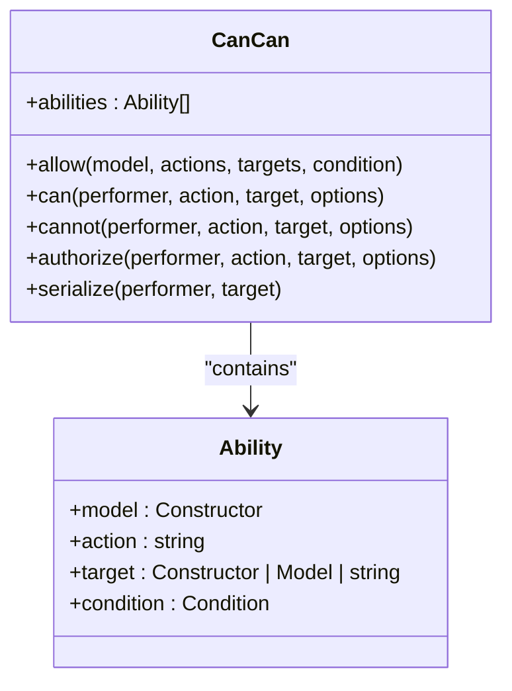
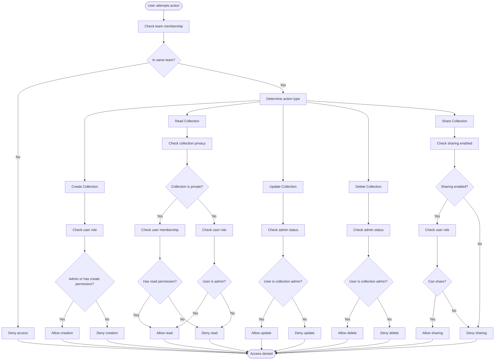
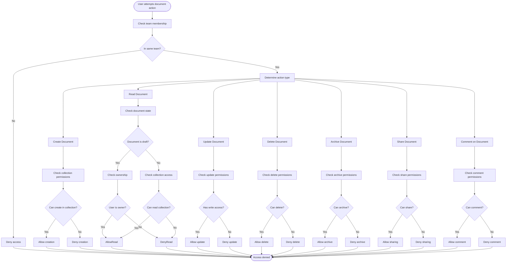
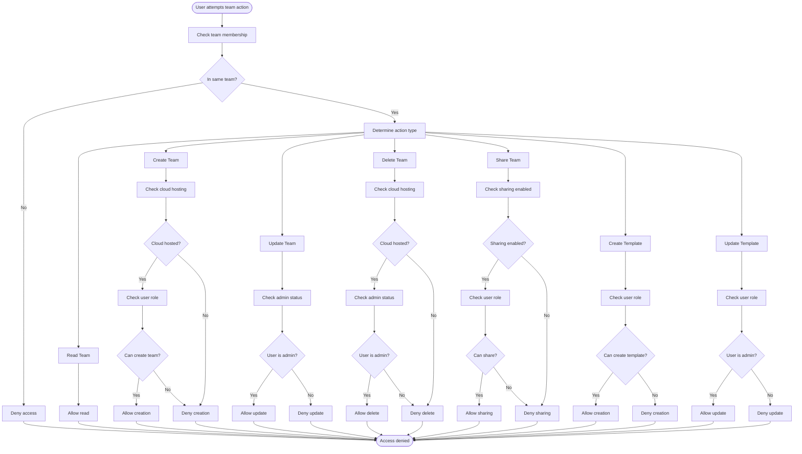
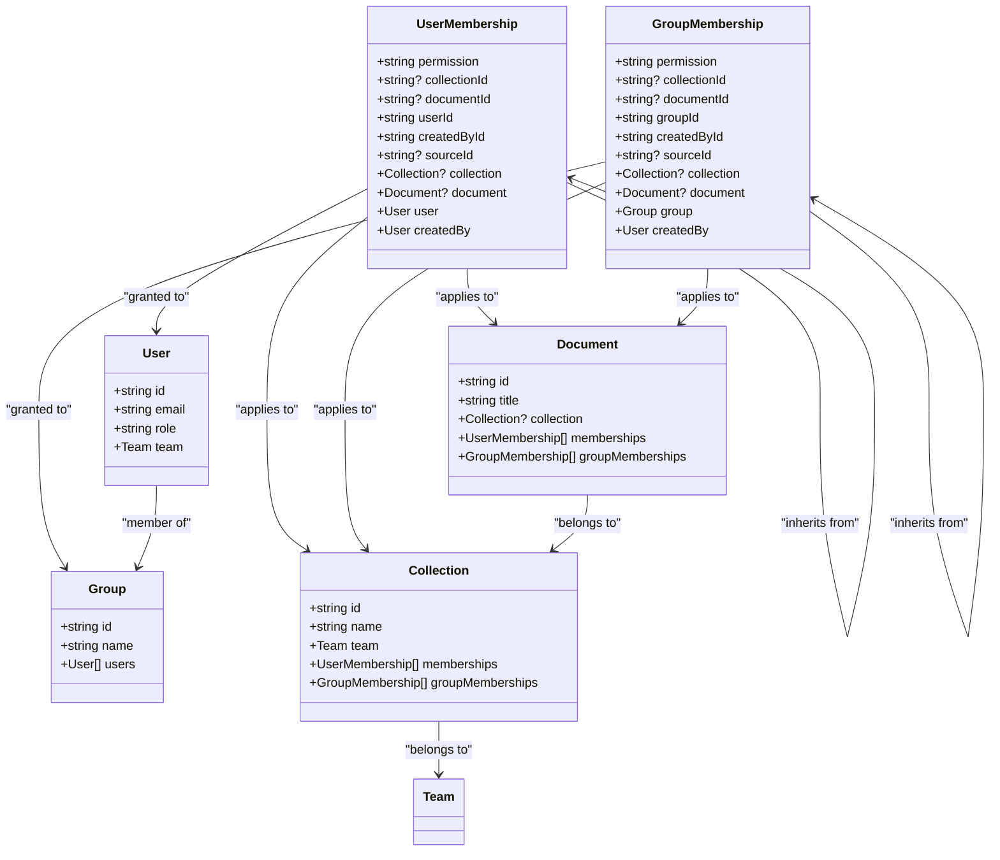
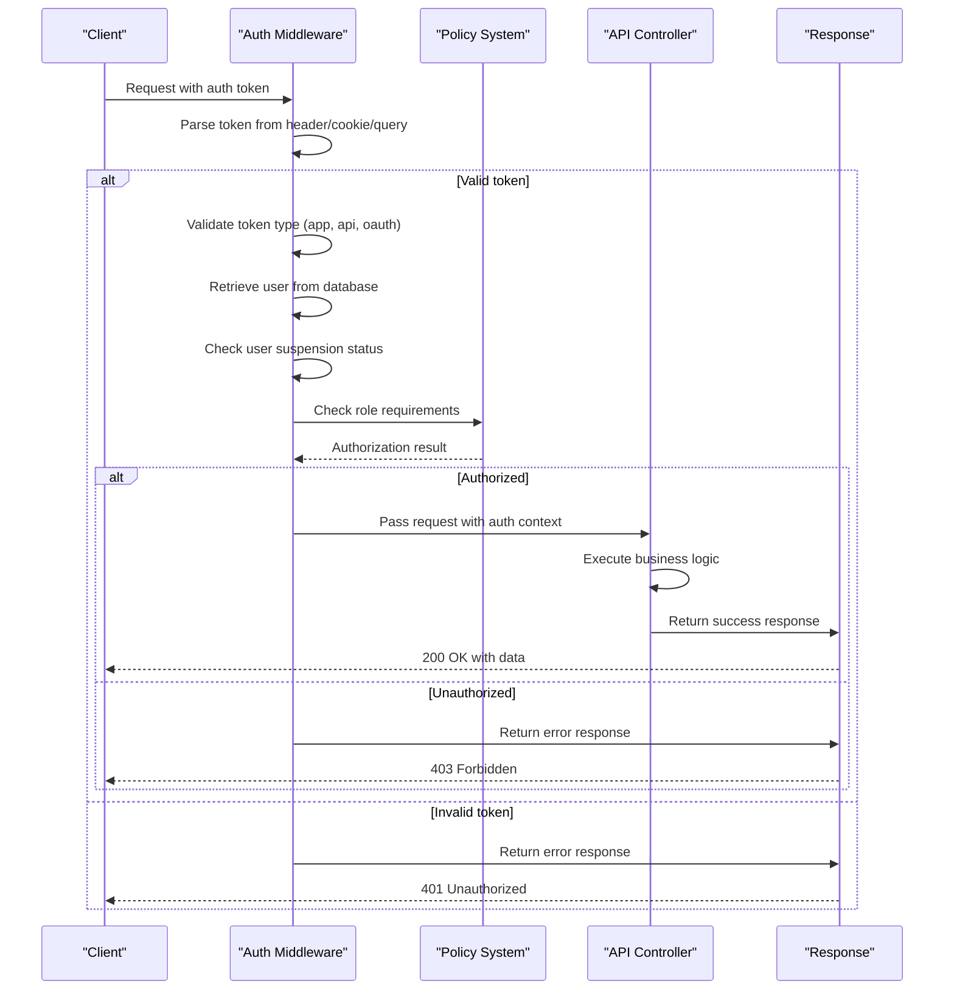
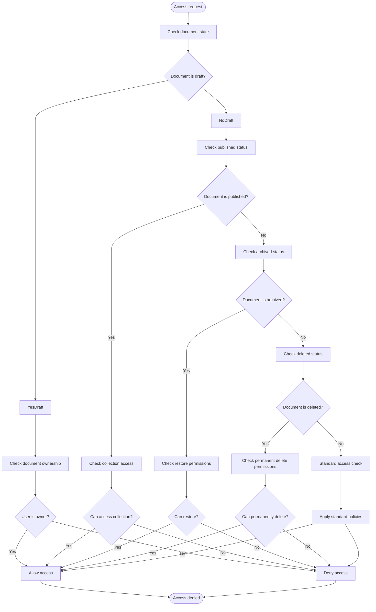

# Authorization Policies

<cite>
**Referenced Files in This Document**   
- [cancan.ts](file://server/policies/cancan.ts)
- [collection.ts](file://server/policies/collection.ts)
- [document.ts](file://server/policies/document.ts)
- [team.ts](file://server/policies/team.ts)
- [utils.ts](file://server/policies/utils.ts)
- [UserMembership.ts](file://server/models/UserMembership.ts)
- [GroupMembership.ts](file://server/models/GroupMembership.ts)
</cite>

## Table of Contents
1. [Introduction](#introduction)
2. [Policy Framework](#policy-framework)
3. [Core Policy Components](#core-policy-components)
4. [Collection Policies](#collection-policies)
5. [Document Policies](#document-policies)
6. [Team Policies](#team-policies)
7. [Membership and Permission Inheritance](#membership-and-permission-inheritance)
8. [Policy Interaction with API Endpoints](#policy-interaction-with-api-endpoints)
9. [Edge Cases and Special Scenarios](#edge-cases-and-special-scenarios)
10. [Creating Custom Policies](#creating-custom-policies)
11. [Conclusion](#conclusion)

## Introduction
The baozi application implements a robust role-based access control system through its policy-based authorization framework. This system governs access to resources based on user roles, team memberships, and specific permissions, ensuring that users can only perform actions they are authorized to do. The framework is built around reusable policy functions that evaluate user capabilities against resource ownership and access levels, providing a flexible and maintainable approach to authorization.

The authorization system is centered in the `server/policies/` directory, where policies are defined as reusable functions that determine whether a user (actor) can perform specific actions on resources (targets). These policies leverage the cancan authorization foundation and interact with the application's data models, particularly UserMembership and GroupMembership, to enforce access control at both collection and document levels.

This document provides a comprehensive overview of the authorization policies, explaining how they are structured, how they interact with the application's data models, and how they are enforced throughout the system. It includes concrete examples from key policy files and explains the relationship between different membership types and permission inheritance.

## Policy Framework

The authorization system in baozi is built on a custom implementation of the cancan pattern, providing a simple yet powerful way to define and check authorization abilities. The core of this framework is the `CanCan` class, which maintains a collection of abilities that define what actions users can perform on various models.



**Diagram sources**
- [cancan.ts](file://server/policies/cancan.ts#L27-L217)

The `CanCan` class provides several key methods for managing authorization:

- `allow`: Defines an authorized ability for a model, action, and target, optionally with a condition function
- `can`: Checks if a performer can perform an action on a target
- `cannot`: The inverse of `can`, checks if a performer cannot perform an action
- `authorize`: A guard method that throws an error if the performer cannot perform the action
- `serialize`: Generates a policy object describing the actions a user may take against a model

The framework uses a declarative approach where policies are defined by calling the `allow` function with the actor model, action(s), target model, and an optional condition function. The condition function is a predicate that returns a boolean indicating whether the ability applies in the current context.

This design allows for highly readable policy definitions that clearly express the authorization logic. For example, a policy might state "allow User to createCollection on Team if the user is a team admin and the team is mutable." This approach makes the authorization rules easy to understand and maintain.

**Section sources**
- [cancan.ts](file://server/policies/cancan.ts#L27-L217)

## Core Policy Components

The authorization system relies on several core components that work together to enforce access control. These components include utility functions, policy definitions, and data models that represent user and group memberships.

The `utils.ts` file in the policies directory provides several helper functions that are used across different policy files:

- `and`: Returns true only if all arguments are truthy
- `or`: Returns the first truthy argument or false
- `isTeamModel`: Checks if an actor belongs to the same team as a model
- `isTeamAdmin`: Checks if an actor is an admin of a model's team
- `isTeamMember`: Checks if an actor is a member of a model's team
- `isTeamMutable`: Checks if a team's models can be modified
- `isCloudHosted`: Checks if the instance is running in a cloud-hosted environment
- `isGroupAdmin`: Checks if an actor is an admin of a group

These utility functions abstract common authorization patterns, making policy definitions more concise and readable. For example, instead of writing complex conditional logic in each policy, developers can use `and` and `or` to combine conditions in a declarative way.

The policy system also relies heavily on two key data models: `UserMembership` and `GroupMembership`. These models represent the permissions granted to users and groups for specific collections or documents. They store the permission level, the user or group ID, and the resource ID, creating a flexible system for managing access control.

```mermaid
erDiagram
USER_MEMBERSHIP {
string id PK
string permission
string index
string? collectionId FK
string? documentId FK
string userId FK
string createdById FK
string? sourceId FK
}
GROUP_MEMBERSHIP {
string id PK
string permission
string index
string? collectionId FK
string? documentId FK
string groupId FK
string createdById FK
string? sourceId FK
}
USER {
string id PK
string email
string name
string role
}
GROUP {
string id PK
string name
}
COLLECTION {
string id PK
string name
string teamId FK
}
DOCUMENT {
string id PK
string title
string collectionId FK
}
USER_MEMBERSHIP ||--o{ USER : "granted to"
USER_MEMBERSHIP ||--o{ COLLECTION : "grants access to"
USER_MEMBERSHIP ||--o{ DOCUMENT : "grants access to"
USER_MEMBERSHIP }o--|| USER_MEMBERSHIP : "inherits from"
GROUP_MEMBERSHIP ||--o{ GROUP : "granted to"
GROUP_MEMBERSHIP ||--o{ COLLECTION : "grants access to"
GROUP_MEMBERSHIP ||--o{ DOCUMENT : "grants access to"
GROUP_MEMBERSHIP }o--|| GROUP_MEMBERSHIP : "inherits from"
USER ||--o{ GROUP : "member of"
COLLECTION ||--o{ TEAM : "belongs to"
DOCUMENT ||--o{ COLLECTION : "belongs to"
```

**Diagram sources**
- [UserMembership.ts](file://server/models/UserMembership.ts#L38-L410)
- [GroupMembership.ts](file://server/models/GroupMembership.ts#L39-L430)

These components work together to create a comprehensive authorization system that can handle complex permission scenarios while remaining maintainable and extensible.

**Section sources**
- [utils.ts](file://server/policies/utils.ts#L7-L137)
- [UserMembership.ts](file://server/models/UserMembership.ts#L38-L410)
- [GroupMembership.ts](file://server/models/GroupMembership.ts#L39-L430)

## Collection Policies

Collection policies define the authorization rules for actions performed on collections, which are top-level organizational units in the baozi application. These policies are implemented in the `collection.ts` file and govern create, read, update, and delete operations on collections.

The collection policies use a combination of user roles, team membership, and specific collection properties to determine authorization. Key policies include:

- `createCollection`: Allows users to create collections based on their role and team settings
- `read`: Controls access to collections, considering privacy settings and user permissions
- `update`: Governs modification of collection properties
- `delete`: Manages collection deletion with appropriate safeguards
- `share`: Controls sharing capabilities for collections



**Diagram sources**
- [collection.ts](file://server/policies/collection.ts#L8-L186)

One of the key aspects of collection policies is the handling of private collections. When a collection is marked as private, access is restricted to users who have explicit membership, regardless of their team membership. This is implemented through the `includesMembership` function, which checks if a user has the appropriate permission level for the collection.

The policies also consider team-level settings, such as whether members can create collections (`memberCollectionCreate`). This allows teams to control how collections are created and who has the ability to do so.

Collection policies are designed to be comprehensive, covering edge cases like ensuring that at least one user or group has admin permissions before removing admin access, preventing teams from losing all administrative control over a collection.

**Section sources**
- [collection.ts](file://server/policies/collection.ts#L8-L186)

## Document Policies

Document policies govern access to individual documents within the baozi application. These policies are more granular than collection policies, as they must handle the hierarchical nature of documents and their relationships to collections and other documents.

The document policies are defined in the `document.ts` file and cover a wide range of actions, including:

- `createDocument`: Creating new documents
- `read`: Reading document content
- `update`: Modifying document content and properties
- `delete`: Deleting documents
- `archive`: Archiving documents
- `pin`: Pinning documents to collections
- `share`: Sharing documents with others
- `comment`: Adding comments to documents



**Diagram sources**
- [document.ts](file://server/policies/document.ts#L8-L331)

Document policies are particularly complex due to the various states a document can be in (draft, published, archived, deleted) and the different ways users can gain access to a document. The policies consider multiple factors when determining authorization:

1. **Document state**: Whether the document is a draft, published, archived, or deleted
2. **Collection permissions**: The user's permissions on the containing collection
3. **Direct document permissions**: Explicit permissions granted to the user for this specific document
4. **Ownership**: Whether the user is the creator of the document
5. **Template status**: Whether the document is a template

For example, the `read` policy allows access if the user can read the document directly, if they can read the collection and the document is not a draft, or if they are the owner of a draft document. This multi-layered approach ensures that users can access documents they should be able to while maintaining appropriate security boundaries.

The policies also handle special cases like document templates, which have their own set of permissions separate from regular documents. Users with the appropriate template permissions can read, update, and manage workspace templates regardless of their permissions on individual documents.

**Section sources**
- [document.ts](file://server/policies/document.ts#L8-L331)

## Team Policies

Team policies define the authorization rules for actions performed at the team level, such as creating teams, updating team settings, and managing team members. These policies are implemented in the `team.ts` file and are crucial for maintaining the integrity and security of team-level operations.

The team policies include:

- `read`: Access to team information
- `createTeam`: Creating new teams
- `update`: Modifying team settings
- `delete`: Deleting teams
- `share`: Sharing team resources
- `createTemplate`: Creating team templates
- `updateTemplate`: Updating team templates



**Diagram sources**
- [team.ts](file://server/policies/team.ts#L12-L60)

Team policies are designed to be restrictive, particularly for sensitive operations like team creation and deletion. For example, the `createTeam` policy only allows team creation in cloud-hosted environments and requires the user to be an admin or have the `memberTeamCreate` permission enabled for the team.

The `update` policy is straightforward, allowing only team admins to modify team settings. This ensures that only authorized users can make changes that affect the entire team.

Team policies also include specific rules for templates, distinguishing between creating templates (available to members and viewers) and updating templates (restricted to admins). This separation allows teams to encourage template creation while maintaining control over template modifications.

The policies consider the hosting environment through the `isCloudHosted` utility function, applying different rules for cloud-hosted versus self-hosted instances. This allows the application to provide appropriate functionality based on the deployment context.

**Section sources**
- [team.ts](file://server/policies/team.ts#L12-L60)

## Membership and Permission Inheritance

The authorization system in baozi relies heavily on the concepts of UserMembership and GroupMembership, which define the permissions granted to users and groups for specific resources. These memberships form the foundation of the permission system, enabling fine-grained access control at both collection and document levels.

UserMembership represents a user's permission to access a specific collection or document. It includes properties such as:

- `permission`: The permission level granted to the user (read, readWrite, admin)
- `collectionId`: The collection the membership applies to
- `documentId`: The document the membership applies to
- `userId`: The user who has been granted access
- `createdById`: The user who created the membership
- `sourceId`: Points to the root membership for inherited permissions

GroupMembership serves a similar purpose but for groups rather than individual users. It allows permissions to be granted to entire groups, simplifying access management for teams with many members.



**Diagram sources**
- [UserMembership.ts](file://server/models/UserMembership.ts#L38-L410)
- [GroupMembership.ts](file://server/models/GroupMembership.ts#L39-L430)

Permission inheritance is a key feature of the system, allowing permissions to be automatically propagated to related resources. For example, when a user is granted access to a collection, they may inherit access to documents within that collection based on the collection's sharing settings.

The inheritance mechanism is implemented through the `sourceId` property, which points to the root membership from which a permission is inherited. This creates a chain of permissions that can be traced back to their origin, enabling the system to efficiently manage and update inherited permissions.

When a membership is created or updated, the system automatically recreates sourced memberships for child documents. This ensures that permission changes are propagated consistently throughout the document hierarchy. The `recreateSourcedMemberships` method handles this process, destroying existing sourced memberships and creating new ones based on the updated permission.

The system also includes safeguards to prevent permission inconsistencies. For example, the `validateLastAdminPermission` method ensures that at least one user or group has admin permissions on a collection before removing admin access from a membership. This prevents scenarios where a collection would have no administrators.

These membership and inheritance mechanisms work together to create a flexible and robust permission system that can handle complex access control requirements while maintaining data integrity and security.

**Section sources**
- [UserMembership.ts](file://server/models/UserMembership.ts#L38-L410)
- [GroupMembership.ts](file://server/models/GroupMembership.ts#L39-L430)

## Policy Interaction with API Endpoints

Authorization policies are enforced throughout the application via middleware that integrates with API endpoints. This ensures that all requests are properly authenticated and authorized before any business logic is executed.

The primary mechanism for policy enforcement is the `auth` middleware defined in `authentication.ts`. This middleware parses authentication tokens from various sources (headers, cookies, query parameters) and validates them to identify the requesting user. It then attaches the user and authentication information to the request context for use by subsequent middleware and route handlers.



**Diagram sources**
- [authentication.ts](file://server/middlewares/authentication.ts#L37-L280)

Once the user is authenticated, the policy system is used to authorize specific actions on resources. This typically happens in one of two ways:

1. **Explicit authorization checks**: Route handlers call the `authorize` function to verify that the user can perform a specific action on a resource. If the user is not authorized, an `AuthorizationError` is thrown.

2. **Implicit authorization through data loading**: Many routes load resources using scoped queries that automatically filter results based on the user's permissions. For example, when loading a document, the query includes the user's ID to ensure that only documents the user has access to are returned.

The policy system integrates with the application's data access layer through scoped queries and model associations. For example, the `withMembership` scope on Collection and Document models includes the user's memberships in the query, allowing policies to check permissions without additional database queries.

This integration ensures that authorization is enforced consistently across the application, whether through explicit checks or implicit filtering. It also provides a good balance between security and performance, minimizing the number of database queries needed to enforce access control.

The middleware also handles different authentication methods, including session-based authentication (app), API keys, and OAuth tokens. Each method is validated appropriately, and the resulting user is used for authorization checks.

**Section sources**
- [authentication.ts](file://server/middlewares/authentication.ts#L37-L280)

## Edge Cases and Special Scenarios

The authorization system in baozi handles several edge cases and special scenarios to ensure robust and secure access control. These include handling shared documents, nested permissions, and various document states that affect authorization.

One key edge case is the handling of draft documents. Drafts have special authorization rules that differ from published documents. Users can read and update their own draft documents even if they don't have general read or write permissions on the containing collection. This allows users to work on documents before sharing them with others.



**Diagram sources**
- [document.ts](file://server/policies/document.ts#L18-L331)

Another important edge case is the handling of nested permissions. When a document is moved from one collection to another, its permissions must be updated to reflect its new context. The system handles this by recalculating user memberships when a document is moved, ensuring that users have appropriate access based on the new collection's settings.

The system also handles the scenario where a collection is made private. When this happens, users who previously had access through team membership lose access unless they are explicitly added to the collection. The policy system enforces this by checking the collection's privacy setting and requiring explicit membership for access.

For shared documents and collections, the system must handle cases where sharing is disabled or revoked. The policies check the sharing status of resources and prevent access through sharing mechanisms when sharing is disabled.

The authorization system also handles the case of template documents, which have their own set of permissions separate from regular documents. Users with template permissions can access and modify templates regardless of their permissions on individual documents.

Finally, the system includes safeguards against permission inconsistencies, such as ensuring that a collection always has at least one admin. When removing admin permissions from a user or group, the system checks that other admins remain to prevent the collection from becoming unmanageable.

These edge cases are handled through careful policy design and comprehensive testing, ensuring that the authorization system remains secure and reliable in all scenarios.

**Section sources**
- [document.ts](file://server/policies/document.ts#L18-L331)
- [collection.ts](file://server/policies/collection.ts#L8-L186)

## Creating Custom Policies

Creating custom policies in the baozi application follows a consistent pattern that leverages the existing cancan framework. Developers can extend the authorization system by defining new policies in the appropriate policy files or creating new policy files for specialized resources.

To create a custom policy, follow these steps:

1. **Identify the resource and actions**: Determine which model (resource) the policy will protect and what actions need to be authorized (e.g., create, read, update, delete).

2. **Choose the appropriate policy file**: Add the policy to an existing policy file (e.g., `document.ts`, `collection.ts`) or create a new policy file for a new resource type.

3. **Define the policy using the `allow` function**: Use the `allow` function to specify the actor model, actions, target model, and condition function.

4. **Implement the condition function**: Write a function that returns true if the actor can perform the action on the target, considering all relevant factors.

Here's an example of how to create a custom policy for a new resource type:

```typescript
import { allow } from "./cancan";
import { and, isTeamAdmin, isTeamModel, isTeamMutable, or } from "./utils";
import { CustomResource, User } from "@server/models";

// Allow team admins to create custom resources
allow(User, "createCustomResource", Team, (actor, team) =>
  and(
    isTeamModel(actor, team),
    isTeamMutable(actor),
    !actor.isGuest,
    !actor.isViewer,
    actor.isAdmin
  )
);

// Allow users with specific permissions to read custom resources
allow(User, "read", CustomResource, (user, resource) => {
  if (!resource || user.teamId !== resource.teamId) {
    return false;
  }
  
  if (user.isAdmin) {
    return true;
  }
  
  // Check if user has explicit membership with read permission
  return includesMembership(resource, [CustomPermission.Read]);
});
```

When creating custom policies, consider the following best practices:

- **Use the utility functions**: Leverage existing utility functions like `and`, `or`, `isTeamAdmin`, etc., to keep policies readable and maintainable.
- **Consider all access paths**: Think about all the ways a user might gain access to a resource, including direct permissions, collection permissions, ownership, and special cases like drafts.
- **Handle edge cases**: Consider document states (draft, archived, deleted), privacy settings, and other factors that might affect authorization.
- **Maintain consistency**: Follow the same patterns and conventions used in existing policies to ensure consistency across the codebase.
- **Test thoroughly**: Write comprehensive tests to verify that the policy behaves correctly in all scenarios.

The policy system is designed to be extensible, allowing developers to add new policies as needed without modifying the core authorization framework. This modular approach makes it easy to adapt the system to new requirements while maintaining security and reliability.

**Section sources**
- [cancan.ts](file://server/policies/cancan.ts#L39-L63)
- [utils.ts](file://server/policies/utils.ts#L7-L137)

## Conclusion

The authorization policies in the baozi application provide a comprehensive and flexible system for managing access control based on user roles, team memberships, and specific permissions. The policy-based framework, built on the cancan pattern, allows for clear and maintainable authorization rules that can handle complex scenarios while remaining accessible to developers.

Key aspects of the system include:

- A declarative approach to defining policies using the `allow` function
- Utility functions that abstract common authorization patterns
- Fine-grained control through UserMembership and GroupMembership models
- Comprehensive handling of edge cases like draft documents and nested permissions
- Integration with API endpoints through middleware
- Support for permission inheritance and propagation

The system strikes a balance between security and usability, ensuring that users can only perform actions they are authorized to do while providing a smooth user experience. By following the patterns and practices outlined in this document, developers can extend and customize the authorization system to meet the evolving needs of the application.

The modular design of the policy system makes it easy to add new policies and adapt to new requirements, ensuring that the authorization framework can grow and evolve with the application. With proper implementation and testing, the system provides a solid foundation for secure and reliable access control in the baozi application.