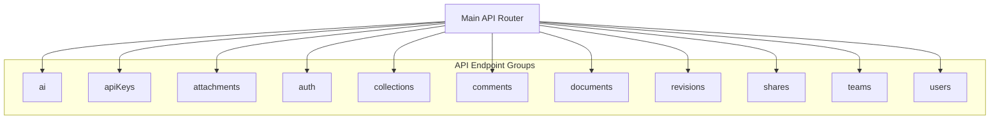
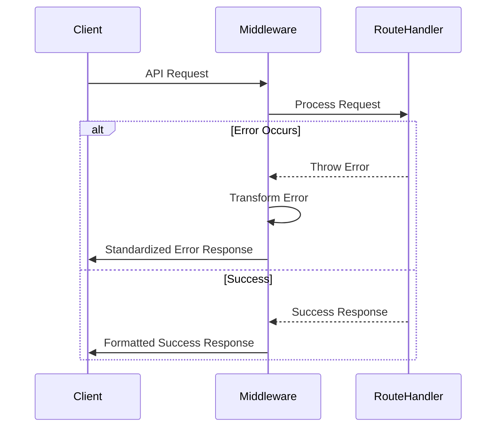
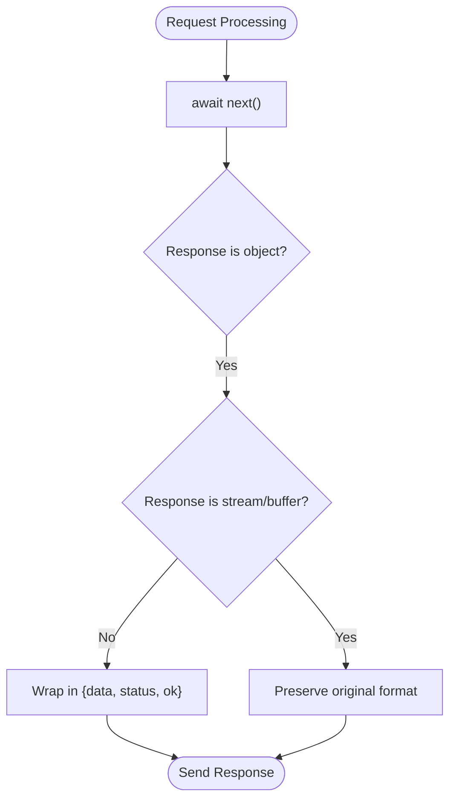
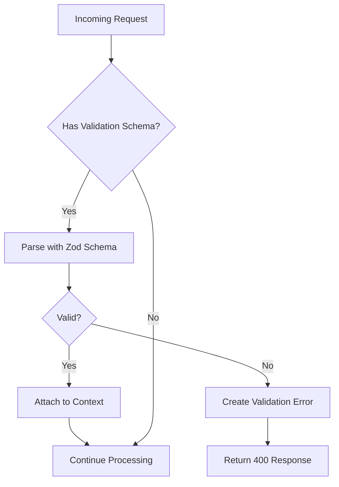
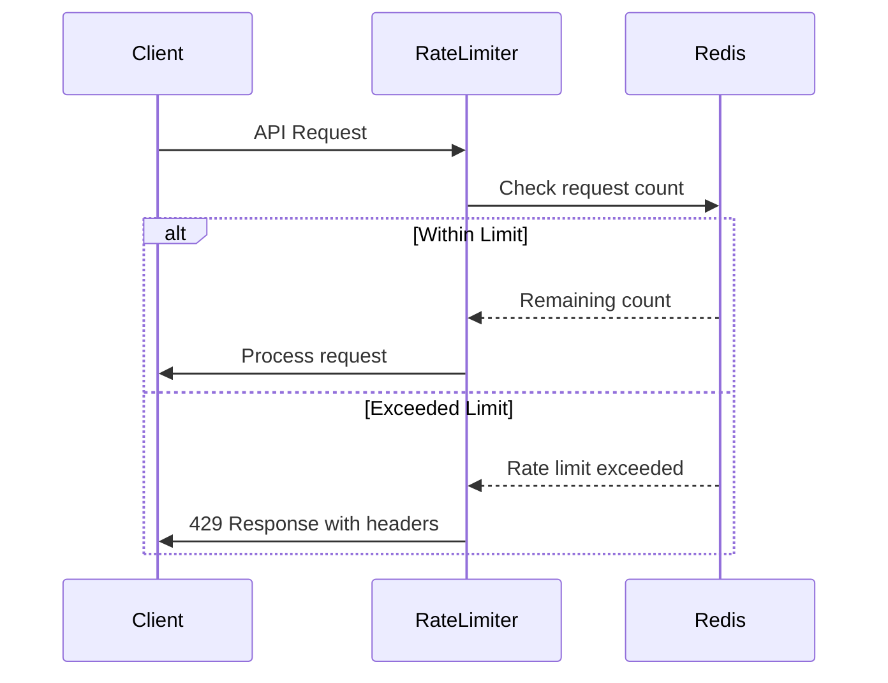
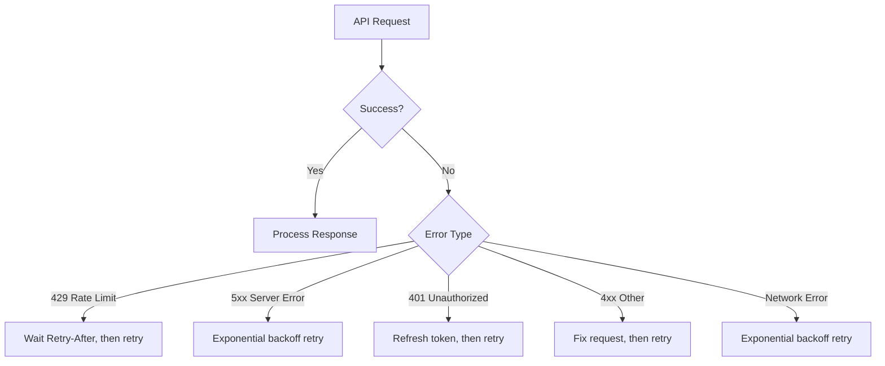

# API Endpoints

<cite>
**Referenced Files in This Document**   
- [apiErrorHandler.ts](file://server/routes/api/middlewares/apiErrorHandler.ts)
- [apiResponse.ts](file://server/routes/api/middlewares/apiResponse.ts)
- [authentication.ts](file://server/middlewares/authentication.ts)
- [validate.ts](file://server/middlewares/validate.ts)
- [validation.ts](file://server/validation.ts)
- [rateLimiter.ts](file://server/middlewares/rateLimiter.ts)
- [csp.ts](file://server/middlewares/csp.ts)
- [index.ts](file://server/routes/api/index.ts)
- [ai.ts](file://server/routes/api/ai/ai.ts)
- [apiKeys.ts](file://server/routes/api/apiKeys/apiKeys.ts)
- [attachments.ts](file://server/routes/api/attachments/attachments.ts)
- [auth.ts](file://server/routes/api/auth/auth.ts)
- [collections.ts](file://server/routes/api/collections/collections.ts)
- [comments.ts](file://server/routes/api/comments/comments.ts)
- [documents.ts](file://server/routes/api/documents/documents.ts)
- [revisions.ts](file://server/routes/api/revisions/revisions.ts)
- [shares.ts](file://server/routes/api/shares/shares.ts)
- [teams.ts](file://server/routes/api/teams/teams.ts)
- [users.ts](file://server/routes/api/users/users.ts)
</cite>

## Table of Contents
1. [Introduction](#introduction)
2. [Endpoint Groups](#endpoint-groups)
3. [Middleware System](#middleware-system)
4. [Request Validation and Serialization](#request-validation-and-serialization)
5. [Common Request/Response Payloads](#common-requestresponse-payloads)
6. [Rate Limiting and Security Policies](#rate-limiting-and-security-policies)
7. [API Versioning and Backward Compatibility](#api-versioning-and-backward-compatibility)
8. [Error Handling and Client Retry Strategies](#error-handling-and-client-retry-strategies)
9. [Frontend API Usage Patterns](#frontend-api-usage-patterns)
10. [Conclusion](#conclusion)

## Introduction

The baozi RESTful API provides a comprehensive interface for interacting with the application's core functionality. The API is organized into logical groups that correspond to different aspects of the system, including AI features, authentication, document management, and user collaboration. This documentation details the available endpoints, their request and response schemas, authentication requirements, and usage patterns.

The API follows REST principles with predictable resource-oriented URLs, proper HTTP verbs, and status codes. All requests and responses are JSON-encoded, and the API employs a consistent error handling and response formatting strategy across all endpoints.

**Section sources**
- [index.ts](file://server/routes/api/index.ts#L1-L140)

## Endpoint Groups

The API is organized into several endpoint groups, each corresponding to a specific domain of functionality. These groups are registered in the main API router and include:

- **ai**: AI-powered features including document analysis and intelligent search
- **apiKeys**: Management of API keys for programmatic access
- **attachments**: Handling of file attachments and uploads
- **auth**: Authentication and session management
- **collections**: Organization of documents into collections
- **comments**: Commenting and discussion features
- **documents**: Core document creation, retrieval, and modification
- **revisions**: Version history and document revisions
- **shares**: Document sharing and public access
- **teams**: Team management and organization
- **users**: User account management
- **collections**: Document collections management
- **comments**: Commenting system
- **documents**: Document operations
- **revisions**: Document versioning
- **views**: Document view tracking
- **searches**: Document search functionality
- **stars**: Document bookmarking
- **subscriptions**: Notification subscriptions
- **suggestions**: Content suggestions
- **transcriptions**: Audio transcription services
- **integrations**: Third-party service integrations
- **notifications**: User notifications
- **oauthAuthentications**: OAuth authentication flows
- **oauthClients**: OAuth client management
- **pins**: Document pinning
- **groups**: User groups management
- **groupMemberships**: Group membership management
- **fileOperations**: File import/export operations
- **urls**: URL shortening and redirection
- **userMemberships**: User-team membership management
- **reactions**: Content reactions
- **relationships**: Document relationships
- **imports**: Data import operations

Each endpoint group is implemented as a separate router module that defines the specific routes for that domain. The main API router combines all these individual routers into a single API interface.

**Diagram sources **
- [index.ts](file://server/routes/api/index.ts#L82-L116)

**Section sources**
- [index.ts](file://server/routes/api/index.ts#L82-L116)

## Middleware System

The API employs a comprehensive middleware system that handles cross-cutting concerns such as error handling, response formatting, authentication, and request validation. The middleware stack is applied globally to all API routes, ensuring consistent behavior across the entire API surface.

### Error Handling with apiErrorHandler.ts

The `apiErrorHandler` middleware provides centralized error handling for the API. It intercepts exceptions thrown during request processing and transforms them into appropriate HTTP responses. The middleware specifically handles several types of errors:

- **Authorization errors**: Converted to standardized authorization error responses
- **Validation errors**: Transformed from Sequelize validation errors to API validation errors with field-specific messages
- **Not found errors**: Converted from file system or database "not found" errors to standardized 404 responses

The error handler ensures that all errors are properly formatted and contain consistent structure, making it easier for clients to interpret and handle different error conditions.

**Diagram sources **
- [apiErrorHandler.ts](file://server/routes/api/middlewares/apiErrorHandler.ts#L1-L47)

### Response Formatting with apiResponse.ts

The `apiResponse` middleware standardizes the format of successful API responses. It automatically wraps JSON response bodies in a consistent envelope that includes status information:

- **status**: The HTTP status code
- **ok**: Boolean indicating success (status < 400)
- **data**: The original response content

This middleware only applies to object responses, preserving the original format for streams, buffers, and other non-object response types. The consistent response format makes it easier for clients to handle API responses uniformly across different endpoints.

**Diagram sources **
- [apiResponse.ts](file://server/routes/api/middlewares/apiResponse.ts#L1-L26)

### Authentication and Authorization

The authentication middleware provides flexible authentication options with support for multiple authentication methods:

- **Bearer tokens** in Authorization header
- **Token parameter** in request body
- **Token query parameter**
- **Cookie-based authentication**

The system supports three authentication types:
- **APP**: JWT-based authentication for regular users
- **API**: API keys for programmatic access
- **OAUTH**: OAuth access tokens for third-party integrations

Authentication can be required, optional, or restricted by user role (admin, member, viewer). The middleware also supports authentication type restrictions and automatically updates user and team activity timestamps on successful authentication.

**Section sources**
- [authentication.ts](file://server/middlewares/authentication.ts#L1-L280)

## Request Validation and Serialization

The API uses Zod schemas for request validation and TypeScript for serialization, ensuring type safety and data integrity throughout the system.

### Zod-Based Request Validation

The `validate` middleware uses Zod schemas to validate incoming requests. Each endpoint can specify a schema that defines the expected structure of the request (query parameters, body, etc.). The middleware:

- Parses and validates the request against the schema
- Transforms the validated data and attaches it to the context
- Returns standardized validation errors for invalid requests

Validation errors include specific information about which field failed validation and why, making it easier for clients to correct their requests.

### Request Validation Utilities

The server provides a comprehensive set of validation utilities in the `validation.ts` file, including assertions for:

- **Presence**: `assertPresent` and `assertNotEmpty`
- **Data types**: `assertEmail`, `assertUrl`, `assertUuid`, `assertBoolean`
- **Value ranges**: `assertIn`, `assertPositiveInteger`
- **Custom formats**: `assertCollectionPermission`, `assertIndexCharacters`

These utilities are used throughout the codebase to ensure data integrity and provide consistent error messages.

**Diagram sources **
- [validate.ts](file://server/middlewares/validate.ts#L1-L24)
- [validation.ts](file://server/validation.ts#L1-L274)

**Section sources**
- [validate.ts](file://server/middlewares/validate.ts#L1-L24)
- [validation.ts](file://server/validation.ts#L1-L274)

## Common Request/Response Payloads

The API uses consistent patterns for common operations across different resource types.

### Document Creation

When creating a new document, the request typically includes:

- **title**: The document title
- **text**: The document content
- **collectionId**: The collection to place the document in
- **parentDocumentId**: Optional parent document for hierarchical organization
- **publish**: Whether to publish the document immediately

The response includes the created document with metadata such as:
- **id**: Unique identifier
- **createdAt** and **updatedAt** timestamps
- **createdById** and **updatedById** user references
- **version**: Document version number
- **url**: Public URL if published

### Collection Management

Collection operations follow a similar pattern with requests containing:
- **name**: Collection name
- **description**: Optional description
- **color**: Visual identifier
- **icon**: Optional icon
- **permission**: Access control settings

### User Authentication

Authentication endpoints use standardized payloads:
- **Login**: Email and password, returning a JWT token
- **Session refresh**: Refresh token, returning a new JWT
- **Password reset**: Email for reset link, or token and new password

**Section sources**
- [documents.ts](file://server/routes/api/documents/documents.ts)
- [collections.ts](file://server/routes/api/collections/collections.ts)
- [auth.ts](file://server/routes/api/auth/auth.ts)

## Rate Limiting and Security Policies

The API implements several security measures to protect against abuse and ensure system stability.

### Rate Limiting

The API employs rate limiting at multiple levels:

- **Default rate limiting**: Applied globally based on IP address
- **Endpoint-specific rate limiting**: Custom limits for specific endpoints
- **Authenticated user limits**: Different limits for authenticated vs. anonymous users

The rate limiter uses Redis to track request counts and provides standard rate limiting headers:
- **RateLimit-Limit**: Total requests allowed in the window
- **RateLimit-Remaining**: Requests remaining in the current window
- **RateLimit-Reset**: When the rate limit window resets
- **Retry-After**: When the client can retry after being rate limited

**Diagram sources **
- [rateLimiter.ts](file://server/middlewares/rateLimiter.ts#L1-L99)

### CORS and Security Headers

The API implements strict security policies:

- **Content Security Policy (CSP)**: Prevents XSS attacks by restricting resource loading
- **CSRF protection**: Required for cookie-based authentication on mutating endpoints
- **CORS**: Configured to allow requests from authorized domains only
- **Security headers**: Various headers to enhance browser security

The CSP policy is dynamically constructed based on environment configuration and enabled features, allowing resources from trusted domains while blocking potentially dangerous content.

**Section sources**
- [rateLimiter.ts](file://server/middlewares/rateLimiter.ts#L1-L99)
- [csp.ts](file://server/middlewares/csp.ts#L1-L65)

## API Versioning and Backward Compatibility

The API follows a backward compatibility strategy to ensure client applications continue to function as the API evolves.

### Versioning Approach

The current implementation uses a simple versioning approach:
- **URL-based versioning**: All endpoints are under the `/api/` prefix
- **No explicit version numbers**: The API is considered version 1 by convention
- **Backward compatibility**: Breaking changes require a new major version

### Backward Compatibility Strategy

The system maintains backward compatibility through:
- **Deprecation period**: Old endpoints remain available with deprecation warnings
- **Feature flags**: New features can be enabled gradually
- **Schema evolution**: Response schemas can be extended but not broken
- **Error code stability**: Standard error codes remain consistent

When breaking changes are necessary, they are introduced with a new version prefix (e.g., `/api/v2/`) while maintaining the old version for a migration period.

**Section sources**
- [index.ts](file://server/routes/api/index.ts)

## Error Handling and Client Retry Strategies

The API provides comprehensive error handling with standardized error responses to help clients handle failures gracefully.

### Error Response Structure

All error responses follow a consistent format:
- **ok**: false
- **status**: HTTP status code
- **error**: Machine-readable error code (snake_case)
- **message**: Human-readable error description
- **data**: Optional additional error-specific data

Common error codes include:
- **not_found**: Resource not found
- **validation_error**: Request validation failed
- **authorization_error**: Insufficient permissions
- **rate_limit_exceeded**: Too many requests
- **server_error**: Internal server error

### Client Retry Strategies

Clients should implement retry strategies for certain error conditions:

- **429 Rate Limit Exceeded**: Retry after the time specified in the Retry-After header
- **5xx Server Errors**: Exponential backoff retry with jitter
- **401 Unauthorized**: Refresh authentication token and retry
- **Network errors**: Retry with increasing delays

The API provides appropriate headers (Retry-After) to guide client retry behavior, particularly for rate limiting scenarios.

**Diagram sources **
- [apiErrorHandler.ts](file://server/routes/api/middlewares/apiErrorHandler.ts#L1-L47)
- [onerror.ts](file://server/onerror.ts#L1-L150)

**Section sources**
- [apiErrorHandler.ts](file://server/routes/api/middlewares/apiErrorHandler.ts#L1-L47)
- [onerror.ts](file://server/onerror.ts#L1-L150)

## Frontend API Usage Patterns

The frontend codebase demonstrates several patterns for interacting with the API effectively.

### API Client Abstraction

The frontend uses an `ApiClient` class that provides:
- **Consistent error handling**: Translates API errors to JavaScript exceptions
- **Authentication management**: Automatically includes authentication tokens
- **Request/response transformation**: Handles serialization and deserialization
- **Retry logic**: Implements intelligent retry strategies

### Store Pattern for State Management

The application uses MobX stores to manage API-derived state:
- **RootStore**: Coordinates all API-related stores
- **Resource-specific stores**: DocumentsStore, CollectionsStore, etc.
- **Synchronization**: Stores keep local state in sync with API data
- **Optimistic updates**: UI updates before API confirmation when appropriate

### Error Handling in Frontend

The frontend implements comprehensive error handling:
- **User-friendly messages**: Translates technical errors to user-understandable text
- **Actionable guidance**: Provides suggestions for resolving common errors
- **Error boundaries**: Prevents crashes from unhandled exceptions
- **Logging**: Reports errors to monitoring systems

**Section sources**
- [ApiClient.ts](file://app/utils/ApiClient.ts#L196-L252)
- [RootStore.ts](file://app/stores/RootStore.ts#L1-L30)

## Conclusion

The baozi RESTful API provides a robust, secure, and well-structured interface for interacting with the application's core functionality. Through its organized endpoint groups, comprehensive middleware system, and consistent patterns, the API enables reliable integration and extension of the platform's capabilities.

Key strengths of the API design include:
- **Consistent error handling** across all endpoints
- **Standardized response formatting** for easier client development
- **Flexible authentication** supporting multiple methods
- **Comprehensive validation** ensuring data integrity
- **Robust security measures** protecting against abuse
- **Clear versioning strategy** ensuring backward compatibility

Developers using the API should leverage the provided patterns and best practices to build reliable integrations that provide excellent user experiences while respecting the system's security and performance constraints.