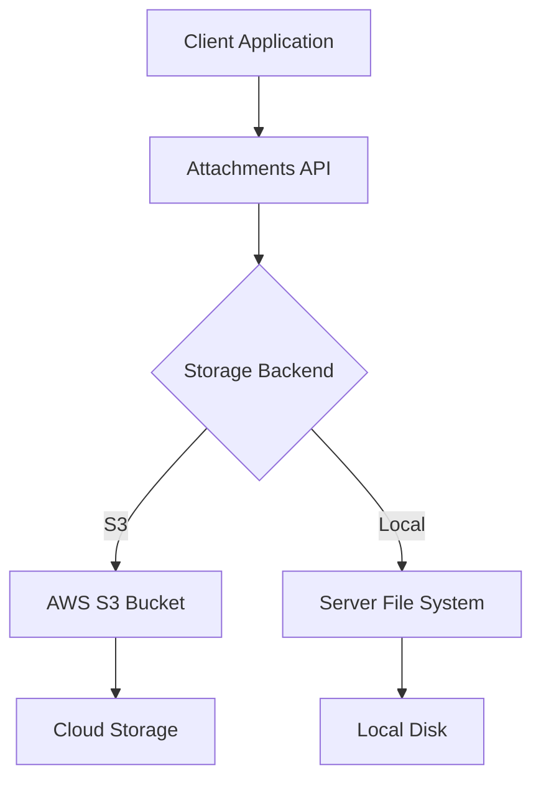
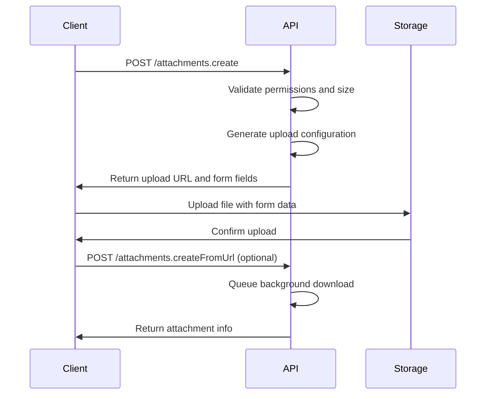
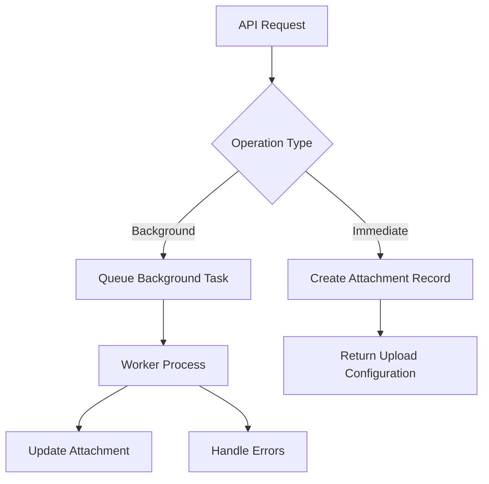

# Attachments API

<cite>
**Referenced Files in This Document**   
- [attachmentCreator.ts](file://server/commands/attachmentCreator.ts)
- [Attachment.ts](file://server/models/Attachment.ts)
- [database.ts](file://server/storage/database.ts)
- [redis.ts](file://server/storage/redis.ts)
- [validations.ts](file://shared/validations.ts)
- [files.ts](file://server/storage/files/index.ts)
- [attachments.ts](file://server/routes/api/attachments/attachments.ts)
- [schema.ts](file://server/routes/api/attachments/schema.ts)
- [LocalStorage.ts](file://server/storage/files/LocalStorage.ts)
- [S3Storage.ts](file://server/storage/files/S3Storage.ts)
- [AttachmentHelper.ts](file://server/models/helpers/AttachmentHelper.ts)
- [env.ts](file://server/env.ts)
</cite>

## Table of Contents
1. [Introduction](#introduction)
2. [API Endpoints](#api-endpoints)
3. [Storage Backends](#storage-backends)
4. [File Validation and Restrictions](#file-validation-and-restrictions)
5. [Multipart Upload Process](#multipart-upload-process)
6. [Attachment Metadata and Zod Validation](#attachment-metadata-and-zod-validation)
7. [Background Processing and Commands](#background-processing-and-commands)
8. [Virus Scanning Integration](#virus-scanning-integration)
9. [Expiration Policies](#expiration-policies)
10. [Troubleshooting](#troubleshooting)
11. [Examples](#examples)

## Introduction
The Attachments API in the baozi application provides comprehensive file management capabilities for document attachments, user avatars, and audio transcriptions. The API supports multiple storage backends, file validation, background processing, and secure access controls. This documentation details the endpoints, storage configurations, validation rules, and integration patterns for managing file attachments within the application.

**Section sources**
- [Attachment.ts](file://server/models/Attachment.ts#L1-L240)
- [attachmentCreator.ts](file://server/commands/attachmentCreator.ts#L1-L96)

## API Endpoints
The Attachments API provides RESTful endpoints for creating, retrieving, and deleting file attachments. All endpoints require authentication and appropriate authorization based on the user's permissions.

### Create Attachment
Creates a new attachment record and returns upload configuration.

**Endpoint**: `POST /api/attachments.create`  
**Authentication**: Required  
**Authorization**: User must have createAttachment permission on team or update permission on document

**Request Body**:
```json
{
  "name": "document.pdf",
  "documentId": "uuid",
  "contentType": "application/pdf",
  "size": 102400,
  "preset": "documentAttachment"
}
```

**Response**:
```json
{
  "data": {
    "uploadUrl": "https://storage.example.com/upload",
    "form": {
      "key": "uploads/user-id/attachment-id/document.pdf",
      "acl": "private",
      "Content-Type": "application/pdf",
      "Cache-Control": "max-age=31557600"
    },
    "attachment": {
      "id": "attachment-id",
      "url": "/api/attachments.redirect?id=attachment-id",
      "name": "document.pdf",
      "size": 102400,
      "contentType": "application/pdf",
      "createdAt": "2023-01-01T00:00:00.000Z"
    }
  }
}
```

### Create Attachment from URL
Creates an attachment by downloading from a remote URL.

**Endpoint**: `POST /api/attachments.createFromUrl`  
**Authentication**: Required  
**Authorization**: User must have createAttachment permission on team or update permission on document

**Request Body**:
```json
{
  "url": "https://example.com/document.pdf",
  "documentId": "uuid",
  "preset": "documentAttachment"
}
```

**Response**:
```json
{
  "data": {
    "attachment": {
      "id": "attachment-id",
      "url": "/api/attachments.redirect?id=attachment-id",
      "name": "document.pdf",
      "size": 102400,
      "contentType": "application/pdf",
      "createdAt": "2023-01-01T00:00:00.000Z"
    }
  }
}
```

### Delete Attachment
Deletes an attachment and its associated file.

**Endpoint**: `POST /api/attachments.delete`  
**Authentication**: Required  
**Authorization**: User must have delete permission on attachment and update permission on associated document (if any)

**Request Body**:
```json
{
  "id": "attachment-id"
}
```

**Response**:
```json
{
  "success": true
}
```

### Attachment Redirect
Retrieves a private attachment through a redirect URL.

**Endpoint**: `GET /api/attachments.redirect`  
**Authentication**: Required  
**Authorization**: User must belong to the same team as the attachment

**Query Parameters**:
- `id`: Attachment ID

**Response**: Redirects to the signed URL for the attachment.

**Section sources**
- [attachments.ts](file://server/routes/api/attachments/attachments.ts#L82-L287)
- [schema.ts](file://server/routes/api/attachments/schema.ts#L1-L46)

## Storage Backends
The baozi application supports two storage backends for file attachments: Amazon S3 and local file system storage. The storage backend is configured through environment variables.

### S3 Storage
The S3 storage backend uses AWS S3 or S3-compatible services for storing file attachments. This is the default storage backend.

**Configuration**:
- `FILE_STORAGE=s3` (default)
- `AWS_ACCESS_KEY_ID`: AWS access key ID
- `AWS_SECRET_ACCESS_KEY`: AWS secret access key
- `AWS_REGION`: AWS region name
- `AWS_S3_UPLOAD_BUCKET_NAME`: S3 bucket name
- `AWS_S3_UPLOAD_BUCKET_URL`: S3 endpoint URL
- `AWS_S3_ACL`: Default ACL for attachments (default: private)

### Local Storage
The local storage backend stores files on the server's file system. This backend is useful for development or self-hosted deployments.

**Configuration**:
- `FILE_STORAGE=local`
- `FILE_STORAGE_LOCAL_ROOT_DIR`: Root directory for storing files (default: /var/lib/outline/data)
- `FILE_STORAGE_UPLOAD_MAX_SIZE`: Maximum upload size in bytes



**Diagram sources**
- [files.ts](file://server/storage/files/index.ts#L4-L5)
- [env.ts](file://server/env.ts#L651-L652)
- [LocalStorage.ts](file://server/storage/files/LocalStorage.ts)
- [S3Storage.ts](file://server/storage/files/S3Storage.ts)

**Section sources**
- [files.ts](file://server/storage/files/index.ts#L4-L5)
- [env.ts](file://server/env.ts#L645-L696)

## File Validation and Restrictions
The Attachments API enforces file validation and size restrictions based on the attachment preset and system configuration.

### File Type Restrictions
Different attachment presets allow different file types:

- **Document Attachment**: All MIME types allowed
- **Avatar**: Only image types (jpg, jpeg, png)
- **Audio Transcription**: Audio files (wav, mp3, flac, etc.)

The allowed MIME types for avatars and audio files are defined in the shared validations:

```typescript
export const AttachmentValidation = {
  avatarContentTypes: ["image/jpg", "image/jpeg", "image/png"],
  audioContentTypes: [
    "audio/wav", "audio/mpeg", "audio/mp3", "audio/flac",
    "audio/ogg", "audio/webm", "audio/x-m4a", "audio/m4a"
  ],
};
```

### Size Limits
The API enforces size limits based on the attachment preset and system configuration:

- **Document Attachments**: Limited by `FILE_STORAGE_UPLOAD_MAX_SIZE` (default: 1MB)
- **Imports**: Limited by `FILE_STORAGE_IMPORT_MAX_SIZE` (default: 1MB)
- **Avatars**: Limited by `FILE_STORAGE_UPLOAD_MAX_SIZE` (default: 1MB)

The size limits are enforced during attachment creation:

```typescript
const maxUploadSize = AttachmentHelper.presetToMaxUploadSize(preset);
if (size > maxUploadSize) {
  throw ValidationError(
    `Sorry, this file is too large – the maximum size is ${bytesToHumanReadable(maxUploadSize)}`
  );
}
```

**Section sources**
- [validations.ts](file://shared/validations.ts#L1-L37)
- [attachments.ts](file://server/routes/api/attachments/attachments.ts#L82-L127)
- [AttachmentHelper.ts](file://server/models/helpers/AttachmentHelper.ts)

## Multipart Upload Process
The Attachments API uses a two-step process for uploading files to ensure reliability and support for large files.

### Step 1: Create Attachment
The client first creates an attachment record by sending metadata to the server. The server responds with upload configuration including the upload URL and form fields.

### Step 2: Upload File
The client uploads the file directly to the storage backend using the provided configuration. For S3, this uses presigned POST requests. For local storage, this uses direct file uploads to the server.



**Diagram sources**
- [attachments.ts](file://server/routes/api/attachments/attachments.ts#L82-L178)
- [S3Storage.ts](file://server/storage/files/S3Storage.ts#L101-L130)
- [LocalStorage.ts](file://server/storage/files/LocalStorage.ts#L48-L52)

**Section sources**
- [attachments.ts](file://server/routes/api/attachments/attachments.ts#L82-L178)
- [S3Storage.ts](file://server/storage/files/S3Storage.ts#L101-L130)
- [LocalStorage.ts](file://server/storage/files/LocalStorage.ts#L48-L52)

## Attachment Metadata and Zod Validation
The Attachments API uses Zod for request validation and defines strict schemas for all endpoints.

### Zod Validation Rules
The API defines Zod schemas for all request bodies:

```typescript
export const AttachmentsCreateSchema = BaseSchema.extend({
  body: z.object({
    name: z.string(),
    documentId: z.string().uuid().optional(),
    size: z.number(),
    contentType: z.string().optional().default("application/octet-stream"),
    preset: z.nativeEnum(AttachmentPreset)
      .default(AttachmentPreset.DocumentAttachment),
  }),
});
```

The validation ensures:
- Name is a string
- Document ID is a valid UUID (if provided)
- Size is a number
- Content type is a string (defaults to application/octet-stream)
- Preset is a valid AttachmentPreset enum value

### Metadata Management
Attachment metadata is stored in the database with the following fields:

- `id`: Unique identifier (UUID)
- `key`: Storage key (path in bucket)
- `contentType`: MIME type
- `size`: File size in bytes
- `acl`: Access control level (private or public-read)
- `lastAccessedAt`: Last access timestamp
- `expiresAt`: Expiration timestamp
- `documentId`: Associated document ID
- `teamId`: Owning team ID
- `userId`: Uploading user ID

The Attachment model provides getters for derived metadata:

```typescript
get name() {
  return path.parse(this.key).base;
}

get isPrivate() {
  return this.acl === "private";
}

get url() {
  return this.isPrivate ? this.redirectUrl : this.canonicalUrl;
}
```

**Section sources**
- [schema.ts](file://server/routes/api/attachments/schema.ts#L1-L46)
- [Attachment.ts](file://server/models/Attachment.ts#L72-L127)

## Background Processing and Commands
The Attachments API uses background processing for operations that may take significant time, such as downloading files from remote URLs.

### attachmentCreator Command
The `attachmentCreator` command handles the creation of attachments from URLs or buffers:

```typescript
export default async function attachmentCreator({
  id,
  name,
  user,
  source,
  preset,
  ctx,
  fetchOptions,
  ...rest
}: Props): Promise<Attachment | undefined> {
  const acl = AttachmentHelper.presetToAcl(preset);
  const key = AttachmentHelper.getKey({
    acl,
    id: randomUUID(),
    name,
    userId: user.id,
  });

  let attachment;

  if ("url" in rest) {
    const { url } = rest;
    const res = await FileStorage.storeFromUrl(url, key, acl, fetchOptions);
    
    if (!res) {
      return;
    }
    attachment = await Attachment.createWithCtx(ctx, {
      id,
      key,
      acl,
      size: res.contentLength,
      contentType: res.contentType,
      teamId: user.teamId,
      userId: user.id,
    });
  } else {
    const { buffer, type } = rest;
    await FileStorage.store({
      body: buffer,
      contentType: type,
      contentLength: buffer.length,
      key,
      acl,
    });

    attachment = await Attachment.createWithCtx(ctx, {
      id,
      key,
      acl,
      size: buffer.length,
      contentType: type,
      teamId: user.teamId,
      userId: user.id,
    });
  }

  return attachment;
}
```

### Background Tasks
The system uses background tasks for file operations:

- `UploadAttachmentFromUrlTask`: Downloads a file from a URL to an existing attachment
- `UploadAttachmentsForImportTask`: Uploads multiple attachments for an import operation
- `CleanupExpiredAttachmentsTask`: Removes expired attachments

These tasks are processed by the worker queue system and provide reliability through retry mechanisms.



**Diagram sources**
- [attachmentCreator.ts](file://server/commands/attachmentCreator.ts#L1-L96)
- [UploadAttachmentFromUrlTask.ts](file://server/queues/tasks/UploadAttachmentFromUrlTask.ts)
- [UploadAttachmentsForImportTask.ts](file://server/queues/tasks/UploadAttachmentsForImportTask.ts)

**Section sources**
- [attachmentCreator.ts](file://server/commands/attachmentCreator.ts#L1-L96)
- [UploadAttachmentFromUrlTask.ts](file://server/queues/tasks/UploadAttachmentFromUrlTask.ts)
- [UploadAttachmentsForImportTask.ts](file://server/queues/tasks/UploadAttachmentsForImportTask.ts)

## Virus Scanning Integration
The documentation mentions virus scanning integration, but the provided code does not contain specific virus scanning implementation details. Based on the architecture, virus scanning would likely be integrated as a background task that runs after file upload completion.

Potential integration points:
- After `storeFromUrl` completes in `attachmentCreator`
- Before finalizing imports in `UploadAttachmentsForImportTask`
- As a separate background task triggered by attachment creation

The system would need to:
1. Queue the attachment for virus scanning
2. Update the attachment status to "scanning"
3. Run the virus scan using an external service or local scanner
4. Update the attachment status to "clean" or "infected"
5. Handle infected files appropriately (quarantine, delete, notify)

**Section sources**
- [attachmentCreator.ts](file://server/commands/attachmentCreator.ts#L1-L96)
- [UploadAttachmentsForImportTask.ts](file://server/queues/tasks/UploadAttachmentsForImportTask.ts)

## Expiration Policies
The Attachments API supports expiration policies for attachments based on their preset type.

### Expiration Configuration
Expiration is configured through the `AttachmentHelper.presetToExpiry` method, which determines the expiration date based on the attachment preset:

- **Document Attachments**: No expiration (null)
- **Avatars**: No expiration (null)
- **Audio Transcriptions**: Expires after a configured period

The expiration date is stored in the `expiresAt` field of the Attachment model and can be used by background tasks to clean up expired attachments.

### Cleanup Process
The `CleanupExpiredAttachmentsTask` background task periodically checks for expired attachments and removes them:

```typescript
// Pseudocode for cleanup task
const expiredAttachments = await Attachment.findAll({
  where: {
    expiresAt: { [Op.lt]: new Date() },
    deletedAt: null
  }
});

for (const attachment of expiredAttachments) {
  await attachment.destroy();
}
```

This ensures that storage space is reclaimed for temporary files like audio transcriptions.

**Section sources**
- [Attachment.ts](file://server/models/Attachment.ts#L68-L69)
- [AttachmentHelper.ts](file://server/models/helpers/AttachmentHelper.ts)

## Troubleshooting
This section addresses common issues with the Attachments API and provides guidance for resolution.

### Upload Failures
Common causes and solutions:

- **400 Bad Request**: Invalid request body or missing required fields
  - Solution: Verify all required fields are present and correctly formatted
- **403 Forbidden**: Insufficient permissions
  - Solution: Ensure the user has the required permissions on the team or document
- **413 Payload Too Large**: File exceeds size limits
  - Solution: Check the file size against the configured limits and reduce file size
- **500 Internal Server Error**: Storage backend issues
  - Solution: Check storage backend configuration and connectivity

### Broken Links
Issues with attachment URLs:

- **404 Not Found**: Attachment record exists but file is missing
  - Solution: Verify the file exists in storage and the key matches
- **403 Forbidden**: Access denied to private attachment
  - Solution: Ensure the user is authenticated and belongs to the correct team
- **Redirect Loop**: Issues with attachment.redirectUrl
  - Solution: Verify the attachment ID is correct and the attachment exists

### Storage Quota Issues
When storage limits are reached:

- **Monitor Usage**: Use `Attachment.getTotalSizeForTeam(teamId)` to monitor team storage usage
- **Increase Limits**: Adjust `FILE_STORAGE_UPLOAD_MAX_SIZE` and related environment variables
- **Clean Up**: Implement regular cleanup of unused attachments and expired files

### Background Processing Issues
Problems with background tasks:

- **Failed Downloads**: Check network connectivity and remote URL accessibility
- **Task Queue Backlog**: Increase worker concurrency or scale worker instances
- **Retry Exhaustion**: Check error logs for specific failure reasons

**Section sources**
- [Attachment.ts](file://server/models/Attachment.ts#L188-L202)
- [attachments.ts](file://server/routes/api/attachments/attachments.ts)
- [UploadAttachmentFromUrlTask.ts](file://server/queues/tasks/UploadAttachmentFromUrlTask.ts)

## Examples
This section provides practical examples of using the Attachments API.

### Uploading a Document
```javascript
import { uploadFile } from 'utils/files';

// Upload a file from an input element
const handleFileUpload = async (event) => {
  const file = event.target.files[0];
  const attachment = await uploadFile(file, {
    documentId: 'document-id',
    preset: 'documentAttachment',
    onProgress: (progress) => {
      console.log(`Upload progress: ${Math.round(progress * 100)}%`);
    }
  });
  console.log('Attachment created:', attachment);
};
```

### Uploading from a URL
```javascript
import { uploadFileFromUrl } from 'utils/files';

// Upload a file from a remote URL
const uploadFromUrl = async () => {
  const attachment = await uploadFileFromUrl('https://example.com/document.pdf', {
    documentId: 'document-id',
    preset: 'documentAttachment'
  });
  console.log('Attachment created:', attachment);
};
```

### Retrieving Attachment URL
```javascript
// Get the URL for an attachment
const getAttachmentUrl = (attachment) => {
  // For private attachments, use the redirect URL
  if (attachment.isPrivate) {
    return attachment.redirectUrl;
  }
  // For public attachments, use the canonical URL
  return attachment.canonicalUrl;
};
```

### Managing File Operations
```javascript
// Delete an attachment
const deleteAttachment = async (attachmentId) => {
  const response = await client.post('/api/attachments.delete', {
    id: attachmentId
  });
  return response.data.success;
};
```

**Section sources**
- [files.ts](file://app/utils/files.ts#L1-L72)
- [Attachment.ts](file://server/models/Attachment.ts#L103-L127)
- [attachments.ts](file://server/routes/api/attachments/attachments.ts#L230-L287)