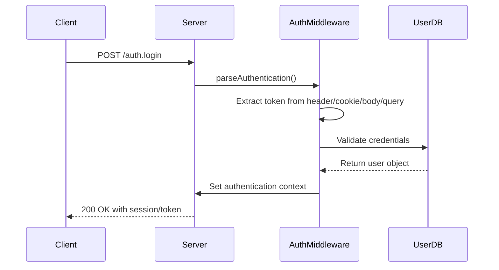
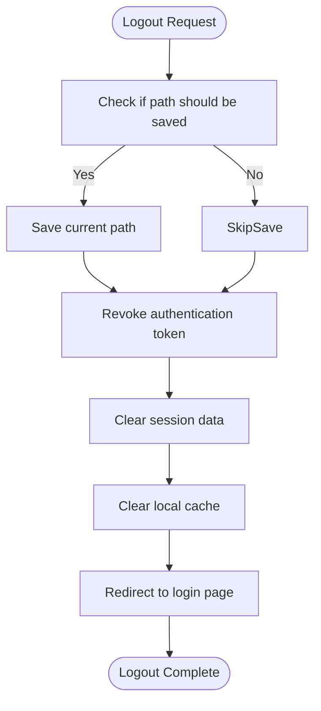
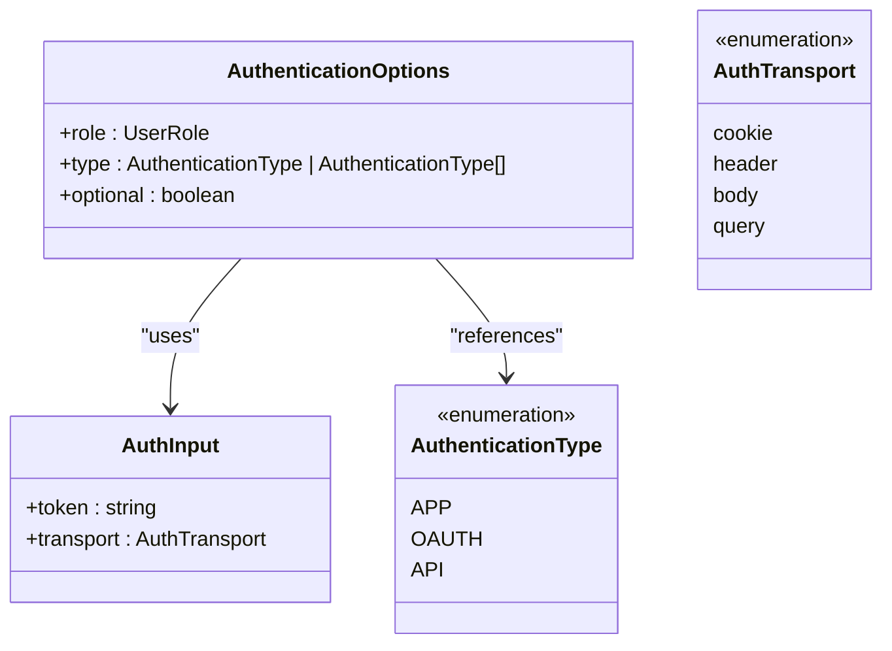
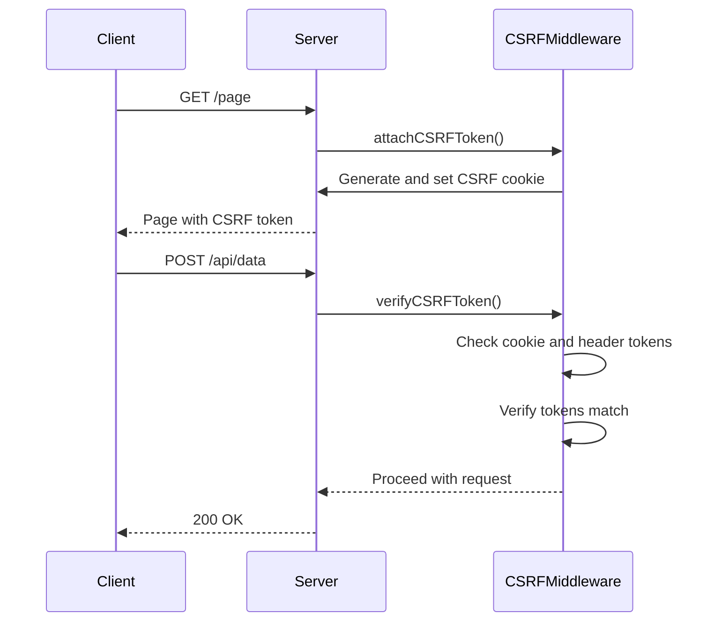
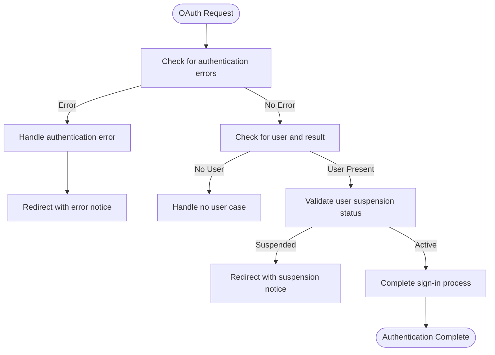
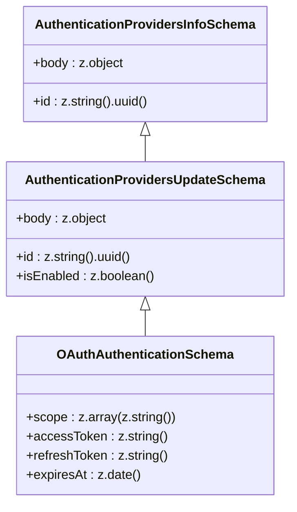
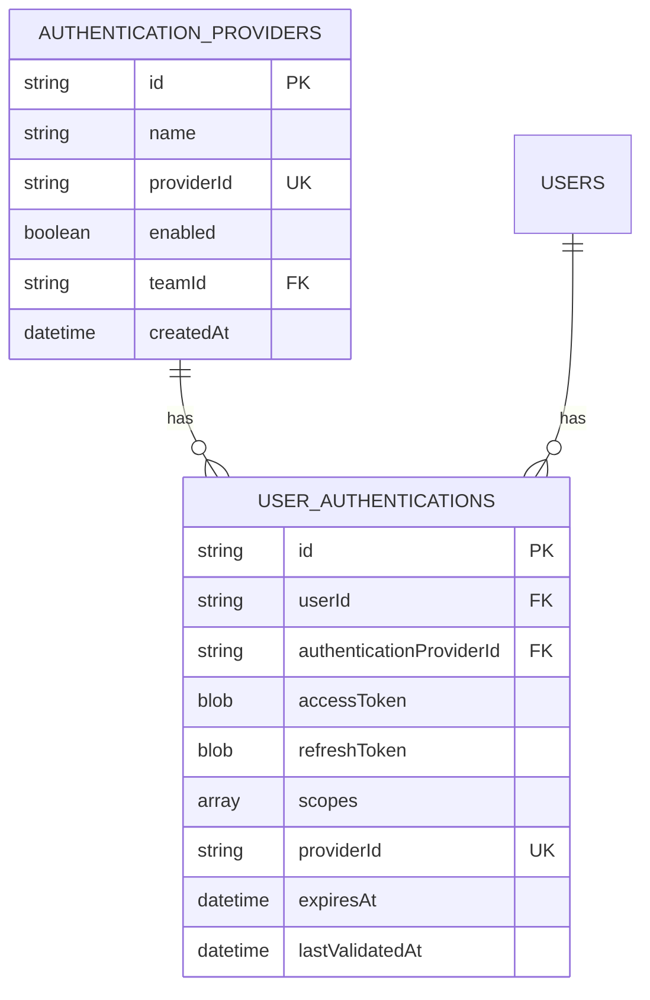
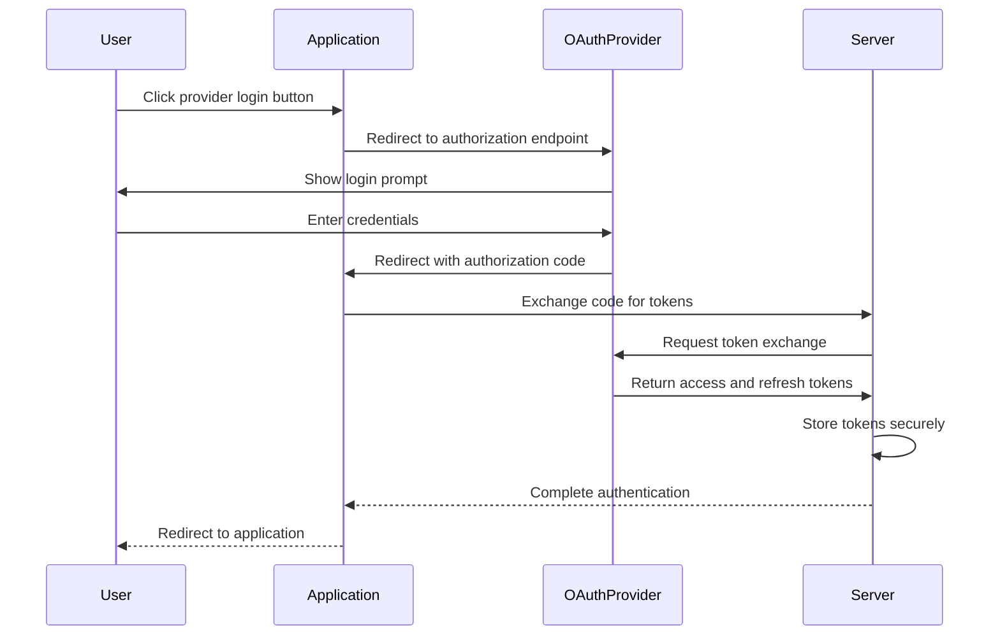
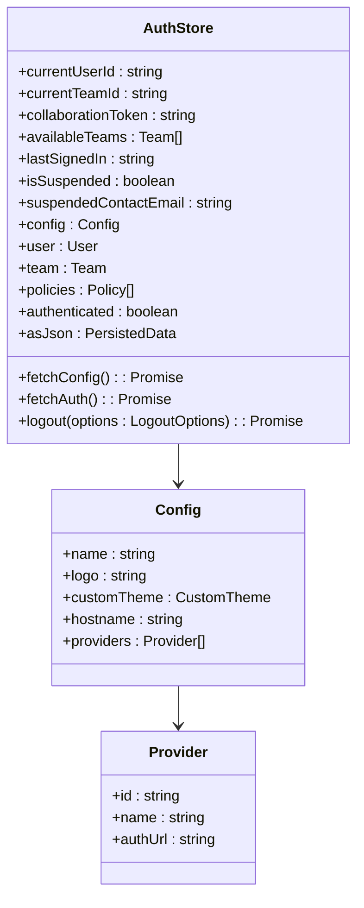

# Authentication API

<cite>
**Referenced Files in This Document**   
- [authentication.ts](file://server/middlewares/authentication.ts)
- [csrf.ts](file://server/middlewares/csrf.ts)
- [passport.ts](file://server/middlewares/passport.ts)
- [UserAuthentication.ts](file://server/models/UserAuthentication.ts)
- [AuthStore.ts](file://app/stores/AuthStore.ts)
- [OAuthAuthentication.ts](file://app/models/oauth/OAuthAuthentication.ts)
- [OAuthClient.ts](file://app/models/oauth/OAuthClient.ts)
- [AuthenticationProvider.ts](file://app/models/AuthenticationProvider.ts)
</cite>

## Table of Contents
1. [Introduction](#introduction)
2. [Authentication Endpoints](#authentication-endpoints)
3. [Middleware Chain](#middleware-chain)
4. [Zod Validation Schemas](#zod-validation-schemas)
5. [OAuth Integration](#oauth-integration)
6. [Security Considerations](#security-considerations)
7. [Frontend Integration](#frontend-integration)
8. [Common Issues](#common-issues)
9. [Conclusion](#conclusion)

## Introduction
The baozi application provides a comprehensive authentication system supporting multiple authentication methods including email/password, OAuth providers (Google, GitHub, Slack), and API keys. This documentation details the authentication endpoints, middleware chain, validation schemas, and integration patterns used throughout the application.

The authentication system is built on a robust foundation of middleware components that handle CSRF protection, session validation, token handling, and role-based access control. The system supports both cookie-based and token-based authentication flows, with comprehensive security measures including password hashing, session expiration, and brute-force protection.

**Section sources**
- [authentication.ts](file://server/middlewares/authentication.ts#L1-L280)
- [AuthStore.ts](file://app/stores/AuthStore.ts#L1-L364)

## Authentication Endpoints

### Login Endpoint
The login endpoint handles authentication requests and returns appropriate tokens based on the authentication method used. The endpoint supports multiple authentication transports including cookies, headers, body, and query parameters.

**Diagram sources**
- [authentication.ts](file://server/middlewares/authentication.ts#L37-L85)

### Logout Endpoint
The logout endpoint invalidates the user's authentication token and clears session data. The endpoint supports optional path saving and token revocation.

**Diagram sources**
- [AuthStore.ts](file://app/stores/AuthStore.ts#L313-L362)

### Session Management Endpoints
The session management endpoints handle session validation, token refresh, and active session tracking. These endpoints ensure that user sessions remain valid and secure throughout their usage.

**Section sources**
- [UserAuthentication.ts](file://server/models/UserAuthentication.ts#L1-L207)
- [authentication.ts](file://server/middlewares/authentication.ts#L145-L279)

## Middleware Chain

### Authentication Middleware
The authentication middleware is responsible for parsing and validating authentication tokens from various sources. It supports multiple authentication types including OAuth, API keys, and application sessions.

**Diagram sources**
- [authentication.ts](file://server/middlewares/authentication.ts#L19-L26)

### CSRF Protection Middleware
The CSRF protection middleware implements a double-submit cookie pattern to prevent cross-site request forgery attacks. It generates and validates CSRF tokens for mutating requests while allowing safe methods to proceed without protection.

**Diagram sources**
- [csrf.ts](file://server/middlewares/csrf.ts#L21-L46)
- [csrf.ts](file://server/middlewares/csrf.ts#L52-L155)

### Passport Middleware
The passport middleware handles OAuth authentication flows, managing the authorization process with external providers and handling authentication results.

**Diagram sources**
- [passport.ts](file://server/middlewares/passport.ts#L12-L100)

**Section sources**
- [csrf.ts](file://server/middlewares/csrf.ts#L1-L156)
- [passport.ts](file://server/middlewares/passport.ts#L1-L101)

## Zod Validation Schemas
The authentication system uses Zod for request validation, ensuring that all incoming requests conform to expected schemas. The validation schemas cover authentication requests, OAuth flows, and session management operations.

**Diagram sources**
- [schema.ts](file://server/routes/api/authenticationProviders/schema.ts#L3-L8)
- [schema.ts](file://server/routes/api/authenticationProviders/schema.ts#L14-L22)

**Section sources**
- [schema.ts](file://server/routes/api/authenticationProviders/schema.ts#L3-L26)

## OAuth Integration

### Supported Providers
The baozi application supports integration with multiple OAuth providers including Google, GitHub, Slack, and Azure. Each provider is configured through the AuthenticationProvider model, which manages provider-specific settings and credentials.

**Diagram sources**
- [UserAuthentication.ts](file://server/models/UserAuthentication.ts#L25-L67)
- [AuthenticationProvider.ts](file://server/models/AuthenticationProvider.ts#L27-L88)

### OAuth Authentication Flow
The OAuth authentication flow follows the standard OAuth 2.0 authorization code grant pattern, with additional security measures including state parameter validation and token binding.

**Diagram sources**
- [passport.ts](file://server/middlewares/passport.ts#L12-L100)
- [UserAuthentication.ts](file://server/models/UserAuthentication.ts#L90-L203)

**Section sources**
- [OAuthAuthentication.ts](file://app/models/oauth/OAuthAuthentication.ts#L8-L36)
- [OAuthClient.ts](file://app/models/oauth/OAuthClient.ts#L10-L89)

## Security Considerations

### Password Hashing and Storage
The application uses industry-standard password hashing algorithms to securely store user credentials. Passwords are hashed using bcrypt with appropriate salt and iteration parameters to prevent brute-force attacks.

### Session Expiration and Management
Sessions are managed with strict expiration policies, including both absolute and sliding expiration windows. The system automatically refreshes expiring tokens when possible and invalidates sessions after periods of inactivity.

### Brute-Force Protection
The authentication system implements rate limiting and account lockout mechanisms to prevent brute-force attacks. Suspicious login attempts are monitored and appropriate actions are taken to protect user accounts.

**Section sources**
- [UserAuthentication.ts](file://server/models/UserAuthentication.ts#L90-L203)
- [authentication.ts](file://server/middlewares/authentication.ts#L158-L244)

## Frontend Integration

### AuthStore Integration
The frontend AuthStore manages authentication state across the application, providing a centralized location for user and team information.

**Diagram sources**
- [AuthStore.ts](file://app/stores/AuthStore.ts#L37-L362)

### Authentication State Management
The AuthStore handles authentication state across multiple tabs and windows, synchronizing state changes through localStorage events. This ensures consistent authentication state throughout the user's browsing session.

**Section sources**
- [AuthStore.ts](file://app/stores/AuthStore.ts#L1-L364)
- [RootStore.ts](file://app/stores/RootStore.ts#L39-L179)

## Common Issues

### Expired Sessions
Expired sessions occur when the authentication token has exceeded its validity period. The system automatically redirects users to the login page when session expiration is detected.

### Invalid Tokens
Invalid tokens may result from tampering, incorrect generation, or transmission errors. The authentication middleware validates token integrity and rejects requests with invalid tokens.

### Provider Misconfiguration
OAuth provider misconfiguration can prevent successful authentication. Common issues include incorrect redirect URIs, invalid client credentials, and insufficient scopes.

**Section sources**
- [authentication.ts](file://server/middlewares/authentication.ts#L178-L184)
- [passport.ts](file://server/middlewares/passport.ts#L20-L63)

## Conclusion
The baozi application provides a comprehensive and secure authentication system that supports multiple authentication methods and integrates seamlessly with frontend components. The system's modular design allows for easy extension and customization while maintaining robust security practices.

The authentication endpoints, middleware chain, and validation schemas work together to provide a reliable and secure authentication experience for users. The integration with OAuth providers and API keys enables flexible authentication options for different use cases.

By following the documented patterns and best practices, developers can effectively integrate with the authentication system and build secure applications on top of the baozi platform.