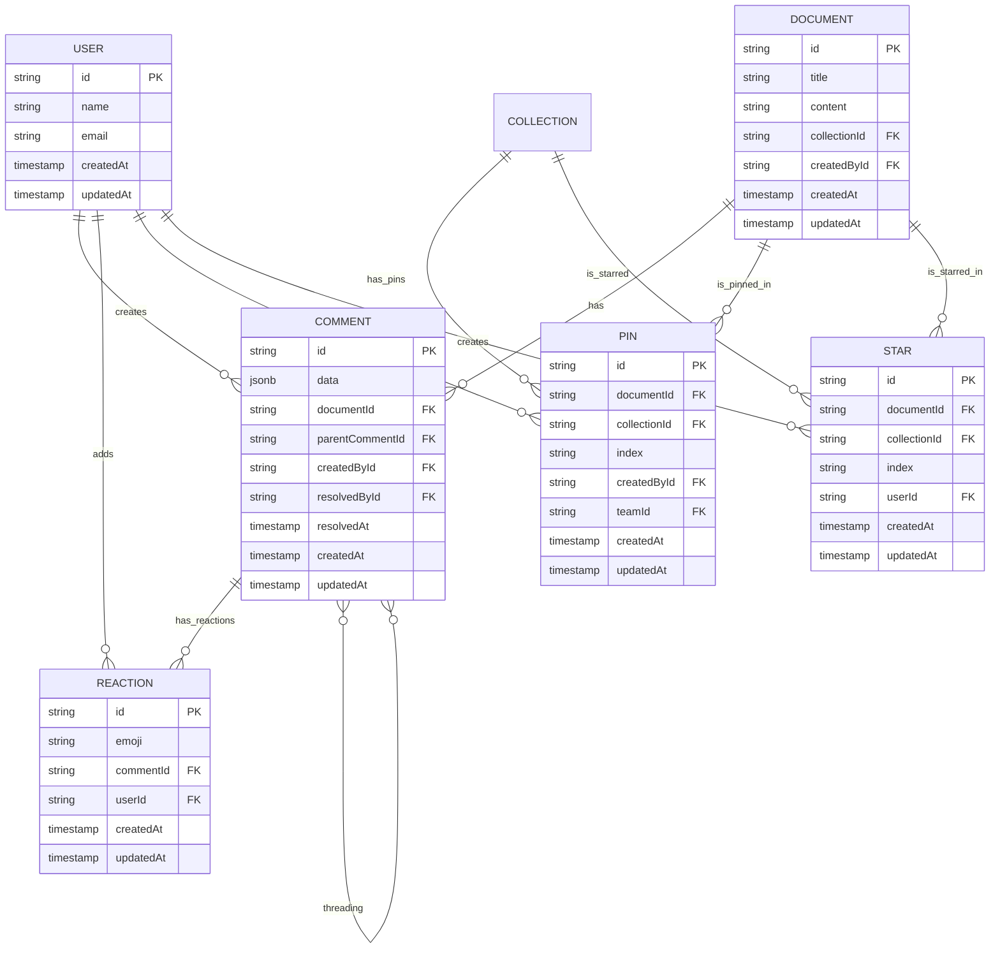
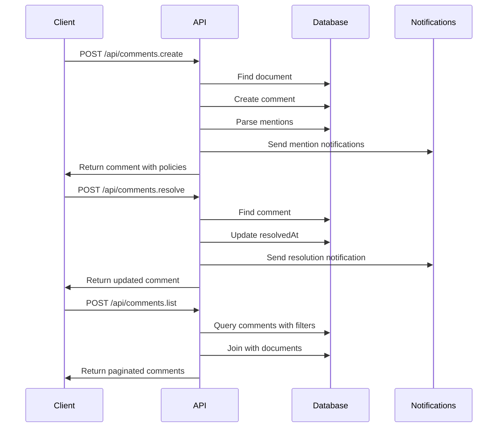
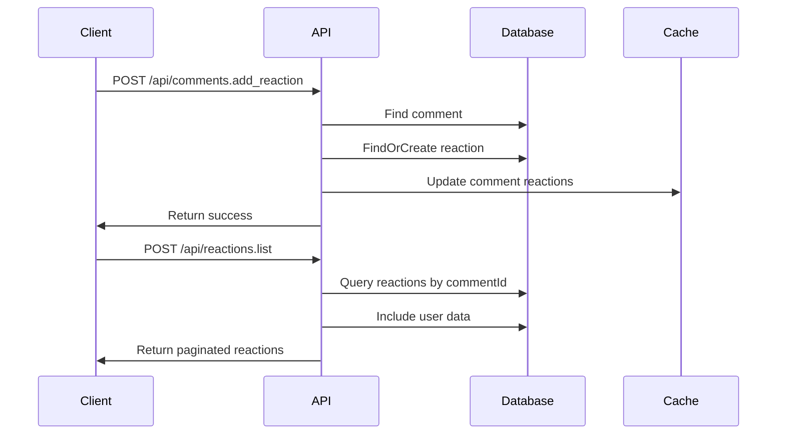
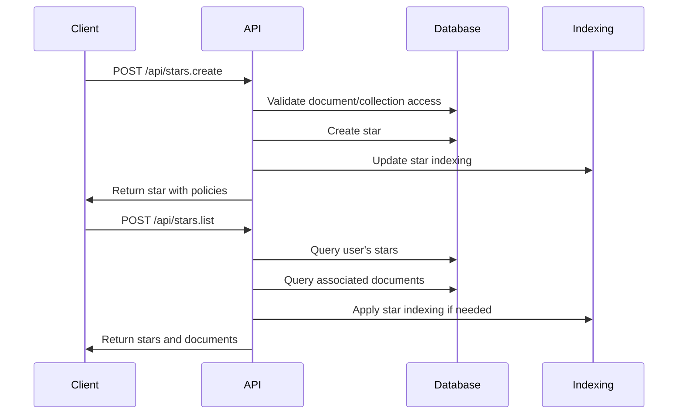
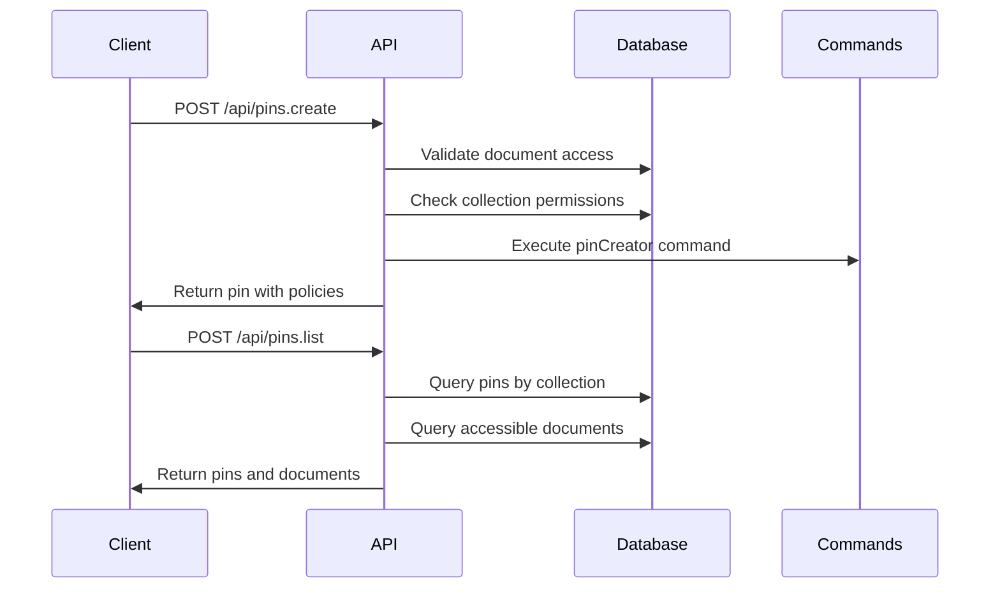
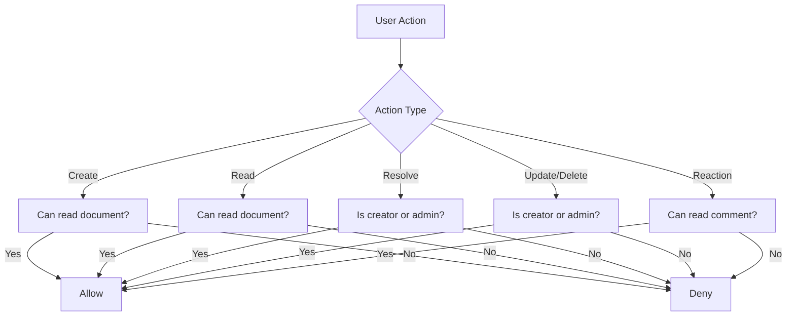

# Collaboration API

<cite>
**Referenced Files in This Document**   
- [Comment.ts](file://server/models/Comment.ts)
- [Reaction.ts](file://server/models/Reaction.ts)
- [Pin.ts](file://server/models/Pin.ts)
- [Star.ts](file://server/models/Star.ts)
- [comments.ts](file://server/routes/api/comments/comments.ts)
- [reactions.ts](file://server/routes/api/reactions/reactions.ts)
- [pins.ts](file://server/routes/api/pins/pins.ts)
- [stars.ts](file://server/routes/api/stars/stars.ts)
- [comment.ts](file://server/presenters/comment.ts)
- [reaction.ts](file://server/presenters/reaction.ts)
- [pin.ts](file://server/presenters/pin.ts)
- [star.ts](file://server/presenters/star.ts)
- [comment.ts](file://server/policies/comment.ts)
- [reaction.ts](file://server/policies/reaction.ts)
- [pins.ts](file://server/policies/pins.ts)
- [star.ts](file://server/policies/star.ts)
</cite>

## Table of Contents
1. [Introduction](#introduction)
2. [Data Models](#data-models)
3. [Comments API](#comments-api)
4. [Reactions API](#reactions-api)
5. [Stars API](#stars-api)
6. [Pins API](#pins-api)
7. [Policy Enforcement](#policy-enforcement)
8. [Notification Integration](#notification-integration)
9. [Troubleshooting Guide](#troubleshooting-guide)

## Introduction
The Collaboration API in the baozi application provides endpoints for managing collaborative features including comments, reactions, stars, and pins. These endpoints enable users to engage with documents through threaded discussions, emoji-based feedback, and bookmarking mechanisms. The API supports document-level collaboration with features like comment resolution, mention handling, and prioritization through pinning and starring. All endpoints enforce team-based access control and integrate with notification systems to keep users informed of collaborative activities.

**Section sources**
- [Comment.ts](file://server/models/Comment.ts)
- [Reaction.ts](file://server/models/Reaction.ts)
- [Pin.ts](file://server/models/Pin.ts)
- [Star.ts](file://server/models/Star.ts)

## Data Models
The collaboration system is built on four core data models that represent different types of user interactions with documents and collections.

### Comment Model
The Comment model represents user discussions on documents. Each comment contains Prosemirror data for rich text content and supports threading through parent-child relationships.

**Properties:**
- `id`: Unique identifier for the comment
- `data`: Prosemirror JSON structure containing the comment content
- `documentId`: Reference to the associated document
- `parentCommentId`: Reference to parent comment for threading
- `createdById`: User who created the comment
- `resolvedAt`: Timestamp when comment was resolved
- `resolvedById`: User who resolved the comment
- `reactions`: Array of emoji reactions with associated user IDs
- `createdAt`: Creation timestamp
- `updatedAt`: Last update timestamp

### Reaction Model
The Reaction model tracks emoji-based feedback on comments. Each reaction is a combination of an emoji and the user who added it.

**Properties:**
- `id`: Unique identifier for the reaction
- `emoji`: The emoji character used as reaction
- `commentId`: Reference to the commented being reacted to
- `userId`: User who added the reaction
- `createdAt`: Creation timestamp
- `updatedAt`: Last update timestamp

### Pin Model
The Pin model represents document prioritization within collections or on the home screen.

**Properties:**
- `id`: Unique identifier for the pin
- `documentId`: Reference to the pinned document
- `collectionId`: Optional reference to collection where document is pinned
- `index`: String used for sorting pins
- `createdById`: User who created the pin
- `teamId`: Reference to the team
- `createdAt`: Creation timestamp
- `updatedAt`: Last update timestamp

### Star Model
The Star model represents document or collection bookmarking for quick access.

**Properties:**
- `id`: Unique identifier for the star
- `documentId`: Optional reference to starred document
- `collectionId`: Optional reference to starred collection
- `index`: String used for sorting stars
- `userId`: User who created the star
- `createdAt`: Creation timestamp
- `updatedAt`: Last update timestamp



**Diagram sources**
- [Comment.ts](file://server/models/Comment.ts#L25-L168)
- [Reaction.ts](file://server/models/Reaction.ts#L28-L164)
- [Pin.ts](file://server/models/Pin.ts#L17-L62)
- [Star.ts](file://server/models/Star.ts#L16-L54)

**Section sources**
- [Comment.ts](file://server/models/Comment.ts#L25-L168)
- [Reaction.ts](file://server/models/Reaction.ts#L28-L164)
- [Pin.ts](file://server/models/Pin.ts#L17-L62)
- [Star.ts](file://server/models/Star.ts#L16-L54)

## Comments API
The Comments API provides endpoints for creating, reading, updating, and deleting comments, as well as managing comment threads and their resolution status.

### Thread Creation
Creates a new comment thread or reply on a document.

**Endpoint:** `POST /api/comments.create`  
**Method:** POST  
**Authentication:** Required  
**Rate Limit:** 10 requests per minute  

**Request Body:**
```json
{
  "documentId": "string",
  "parentCommentId": "string",
  "data": "object",
  "text": "string"
}
```

**Parameters:**
- `documentId`: ID of the document to comment on
- `parentCommentId`: ID of parent comment for replies (optional)
- `data`: Prosemirror JSON structure for comment content
- `text`: Plain text content (optional, converted to Prosemirror data)

**Response:**
```json
{
  "data": {
    "id": "string",
    "data": "object",
    "documentId": "string",
    "parentCommentId": "string",
    "createdBy": "object",
    "createdById": "string",
    "resolvedAt": "string",
    "resolvedBy": "object",
    "resolvedById": "string",
    "createdAt": "string",
    "updatedAt": "string",
    "reactions": "array"
  },
  "policies": "object"
}
```

**Example:**
```bash
curl -X POST https://api.baozi.com/api/comments.create \
  -H "Authorization: Bearer <token>" \
  -H "Content-Type: application/json" \
  -d '{
    "documentId": "doc-123",
    "data": {
      "type": "doc",
      "content": [
        {
          "type": "paragraph",
          "content": [
            {
              "type": "text",
              "text": "This is a new comment thread"
            }
          ]
        }
      ]
    }
  }'
```

### Replies
Creates a reply to an existing comment thread.

**Endpoint:** `POST /api/comments.create`  
**Method:** POST  

**Request Body:**
```json
{
  "documentId": "string",
  "parentCommentId": "string",
  "data": "object"
}
```

The `parentCommentId` parameter specifies the comment thread to reply to. Replies inherit permissions from the parent thread and document.

### Resolution Status
Manages the resolution status of comment threads.

#### Resolve Thread
Marks a comment thread as resolved.

**Endpoint:** `POST /api/comments.resolve`  
**Method:** POST  

**Request Body:**
```json
{
  "id": "string"
}
```

**Response:**
```json
{
  "data": "comment_object",
  "policies": "object"
}
```

#### Unresolve Thread
Reopens a resolved comment thread.

**Endpoint:** `POST /api/comments.unresolve`  
**Method:** POST  

**Request Body:**
```json
{
  "id": "string"
}
```

**Response:**
```json
{
  "data": "comment_object",
  "policies": "object"
}
```

### Mention Handling
The API automatically detects and processes user mentions in comment content.

When a comment is created or updated, the system:
1. Parses the Prosemirror content for user mentions
2. Identifies new mentions not present in the previous version
3. Sends notifications to mentioned users
4. Updates the comment with mention metadata

Mentions are represented in Prosemirror data as:
```json
{
  "type": "mention",
  "attrs": {
    "id": "user-id",
    "label": "username",
    "type": "user"
  }
}
```

### List Comments
Retrieves comments based on various filters.

**Endpoint:** `POST /api/comments.list`  
**Method:** POST  

**Request Body:**
```json
{
  "documentId": "string",
  "parentCommentId": "string",
  "statusFilter": ["resolved", "unresolved"],
  "collectionId": "string",
  "sort": "createdAt",
  "direction": "desc",
  "limit": 25,
  "offset": 0
}
```

**Response:**
```json
{
  "pagination": {
    "limit": 25,
    "offset": 0,
    "total": 10
  },
  "data": ["array_of_comments"],
  "policies": "object"
}
```

### Update Comment
Modifies an existing comment.

**Endpoint:** `POST /api/comments.update`  
**Method:** POST  

**Request Body:**
```json
{
  "id": "string",
  "data": "object"
}
```

When updating a comment, the system detects new mentions and notifies mentioned users.

### Delete Comment
Removes a comment and all its replies.

**Endpoint:** `POST /api/comments.delete`  
**Method:** POST  

**Request Body:**
```json
{
  "id": "string"
}
```

**Response:**
```json
{
  "success": true
}
```



**Diagram sources**
- [comments.ts](file://server/routes/api/comments/comments.ts#L27-L468)
- [comment.ts](file://server/presenters/comment.ts#L11-L43)

**Section sources**
- [comments.ts](file://server/routes/api/comments/comments.ts#L27-L468)
- [comment.ts](file://server/presenters/comment.ts#L11-L43)

## Reactions API
The Reactions API enables users to provide emoji-based feedback on comments.

### Add Reaction
Adds an emoji reaction to a comment.

**Endpoint:** `POST /api/comments.add_reaction`  
**Method:** POST  
**Authentication:** Required  
**Rate Limit:** 25 requests per minute  

**Request Body:**
```json
{
  "id": "string",
  "emoji": "string"
}
```

**Parameters:**
- `id`: ID of the comment to react to
- `emoji`: Emoji character to add as reaction

**Response:**
```json
{
  "success": true
}
```

The reaction is added to both the reactions table and the comment's reactions cache for performance.

### Remove Reaction
Removes an emoji reaction from a comment.

**Endpoint:** `POST /api/comments.remove_reaction`  
**Method:** POST  

**Request Body:**
```json
{
  "id": "string",
  "emoji": "string"
}
```

**Response:**
```json
{
  "success": true
}
```

### List Reactions
Retrieves all reactions for a comment.

**Endpoint:** `POST /api/reactions.list`  
**Method:** POST  

**Request Body:**
```json
{
  "commentId": "string",
  "limit": 25,
  "offset": 0
}
```

**Response:**
```json
{
  "pagination": {
    "limit": 25,
    "offset": 0,
    "total": 5
  },
  "data": [
    {
      "id": "string",
      "emoji": "string",
      "commentId": "string",
      "user": "object",
      "userId": "string",
      "createdAt": "string",
      "updatedAt": "string"
    }
  ]
}
```



**Diagram sources**
- [comments.ts](file://server/routes/api/comments/comments.ts#L382-L468)
- [reactions.ts](file://server/routes/api/reactions/reactions.ts#L14-L66)
- [reaction.ts](file://server/presenters/reaction.ts#L4-L15)

**Section sources**
- [comments.ts](file://server/routes/api/comments/comments.ts#L382-L468)
- [reactions.ts](file://server/routes/api/reactions/reactions.ts#L14-L66)
- [reaction.ts](file://server/presenters/reaction.ts#L4-L15)

## Stars API
The Stars API provides bookmarking functionality for documents and collections.

### Create Star
Creates a star for a document or collection.

**Endpoint:** `POST /api/stars.create`  
**Method:** POST  
**Authentication:** Required  

**Request Body:**
```json
{
  "documentId": "string",
  "collectionId": "string",
  "index": "string"
}
```

**Parameters:**
- `documentId`: ID of document to star (optional)
- `collectionId`: ID of collection to star (optional)
- `index`: String for sorting stars

**Response:**
```json
{
  "data": {
    "id": "string",
    "documentId": "string",
    "collectionId": "string",
    "index": "string",
    "createdAt": "string",
    "updatedAt": "string"
  },
  "policies": "object"
}
```

### List Stars
Retrieves all stars for the authenticated user.

**Endpoint:** `POST /api/stars.list`  
**Method:** POST  

**Request Body:**
```json
{
  "limit": 25,
  "offset": 0
}
```

**Response:**
```json
{
  "pagination": {
    "limit": 25,
    "offset": 0,
    "total": 10
  },
  "data": {
    "stars": ["array_of_stars"],
    "documents": ["array_of_documents"]
  },
  "policies": "object"
}
```

### Update Star
Modifies a star's index for sorting.

**Endpoint:** `POST /api/stars.update`  
**Method:** POST  

**Request Body:**
```json
{
  "id": "string",
  "index": "string"
}
```

**Response:**
```json
{
  "data": "star_object",
  "policies": "object"
}
```

### Delete Star
Removes a star.

**Endpoint:** `POST /api/stars.delete`  
**Method:** POST  

**Request Body:**
```json
{
  "id": "string"
}
```

**Response:**
```json
{
  "success": true
}
```



**Diagram sources**
- [stars.ts](file://server/routes/api/stars/stars.ts#L21-L171)
- [star.ts](file://server/presenters/star.ts#L3-L13)

**Section sources**
- [stars.ts](file://server/routes/api/stars/stars.ts#L21-L171)
- [star.ts](file://server/presenters/star.ts#L3-L13)

## Pins API
The Pins API enables document prioritization within collections or on the home screen.

### Create Pin
Creates a pin for a document.

**Endpoint:** `POST /api/pins.create`  
**Method:** POST  
**Authentication:** Required  

**Request Body:**
```json
{
  "documentId": "string",
  "collectionId": "string",
  "index": "string"
}
```

**Parameters:**
- `documentId`: ID of document to pin
- `collectionId`: ID of collection to pin in (optional, null for home)
- `index`: String for sorting pins

**Response:**
```json
{
  "data": {
    "id": "string",
    "documentId": "string",
    "collectionId": "string",
    "index": "string",
    "createdAt": "string",
    "updatedAt": "string"
  },
  "policies": "object"
}
```

### List Pins
Retrieves pins based on collection.

**Endpoint:** `POST /api/pins.list`  
**Method:** POST  

**Request Body:**
```json
{
  "collectionId": "string",
  "limit": 25,
  "offset": 0
}
```

**Response:**
```json
{
  "pagination": {
    "limit": 25,
    "offset": 0,
    "total": 5
  },
  "data": {
    "pins": ["array_of_pins"],
    "documents": ["array_of_documents"]
  },
  "policies": "object"
}
```

### Update Pin
Modifies a pin's index for sorting.

**Endpoint:** `POST /api/pins.update`  
**Method:** POST  

**Request Body:**
```json
{
  "id": "string",
  "index": "string"
}
```

**Response:**
```json
{
  "data": "pin_object",
  "policies": "object"
}
```

### Delete Pin
Removes a pin.

**Endpoint:** `POST /api/pins.delete`  
**Method:** POST  

**Request Body:**
```json
{
  "id": "string"
}
```

**Response:**
```json
{
  "success": true
}
```



**Diagram sources**
- [pins.ts](file://server/routes/api/pins/pins.ts#L20-L214)
- [pin.ts](file://server/presenters/pin.ts#L3-L13)

**Section sources**
- [pins.ts](file://server/routes/api/pins/pins.ts#L20-L214)
- [pin.ts](file://server/presenters/pin.ts#L3-L13)

## Policy Enforcement
The collaboration features enforce access control through policy files that define permissions for different user roles.

### Comment Policies
Defined in `comment.ts`, these policies control access to comment operations:

- **Create**: Users can create comments on documents they can read
- **Read**: Users can read comments on documents they can read
- **Resolve/Unresolve**: Only comment creators or admins can resolve threads
- **Update/Delete**: Only comment creators or admins can modify comments
- **Reactions**: Users can add/remove reactions to comments they can read



**Diagram sources**
- [comment.ts](file://server/policies/comment.ts#L1-L40)

**Section sources**
- [comment.ts](file://server/policies/comment.ts#L1-L40)

### Reaction Policies
Defined in `reaction.ts`, these policies control reaction access:

- **Delete**: Only the reaction creator can remove their reaction

### Pin Policies
Defined in `pins.ts`, these policies control pin access:

- **Update/Delete**: Only team admins can modify pins

### Star Policies
Defined in `star.ts`, these policies control star access:

- **Read/Update/Delete**: Only the star creator can manage their stars

## Notification Integration
The collaboration system integrates with notification systems to inform users of relevant activities.

### Event Types
The system generates events for collaboration activities:

- `comments.create`: New comment created
- `comments.update`: Comment updated
- `comments.delete`: Comment deleted
- `comments.add_reaction`: Reaction added
- `comments.remove_reaction`: Reaction removed
- `comments.resolve`: Comment thread resolved
- `comments.unresolve`: Comment thread unresolved
- `pins.create`: Document pinned
- `pins.update`: Pin updated
- `pins.delete`: Pin removed
- `stars.create`: Item starred
- `stars.update`: Star updated
- `stars.delete`: Star removed

### Notification Delivery
When collaboration events occur:
1. The system creates notification records in the database
2. Background processors handle notification delivery
3. Users receive notifications via email, webhooks, or in-app alerts
4. Mentioned users are notified when mentioned in comments

### Webhook Integration
The system supports webhook delivery for collaboration events:
- `comments.create`, `comments.update`, `comments.delete`
- `pins.create`, `pins.update`, `pins.delete`
- `stars.create`, `stars.update`, `stars.delete`

Webhooks are delivered to configured endpoints with event details.

## Troubleshooting Guide
This section addresses common issues with the collaboration features.

### Synchronization Issues
**Symptoms:**
- Comments or reactions not appearing immediately
- Inconsistent data between clients

**Solutions:**
1. Check WebSocket connection status
2. Verify database transaction isolation levels
3. Ensure background processors are running
4. Clear client-side caches if necessary

### Permission Errors
**Symptoms:**
- "Forbidden" responses when accessing collaboration features
- Unable to create, update, or delete comments/reactions

**Solutions:**
1. Verify user has appropriate permissions on the document
2. Check team membership and role
3. Ensure document is not archived or deleted
4. Validate authentication token

### Notification Delivery Problems
**Symptoms:**
- Not receiving notifications for comments or mentions
- Delayed notification delivery

**Solutions:**
1. Check notification settings for the user
2. Verify background job processors are running
3. Check email delivery logs
4. Ensure webhook endpoints are accessible
5. Validate user's notification preferences

### Performance Issues
**Symptoms:**
- Slow comment loading
- High latency when adding reactions

**Solutions:**
1. Optimize database queries and indexes
2. Ensure proper caching of frequently accessed data
3. Monitor background job queue length
4. Scale database resources if needed