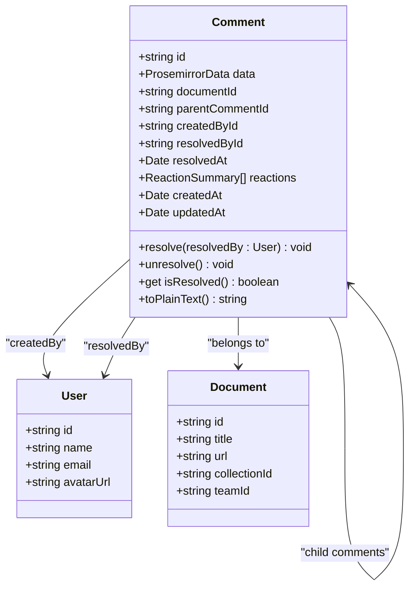
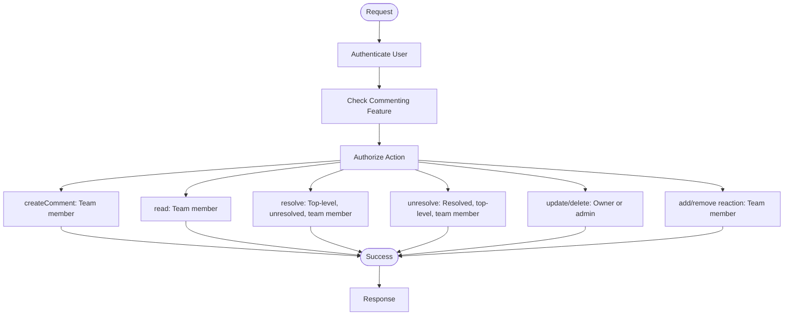
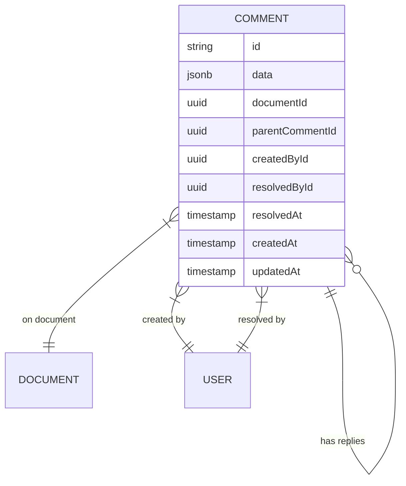
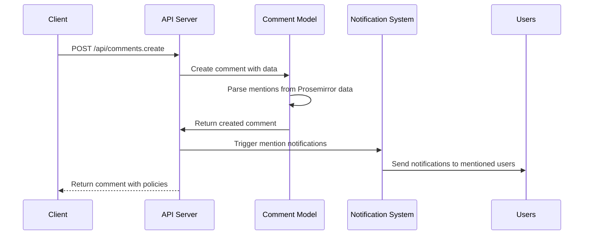
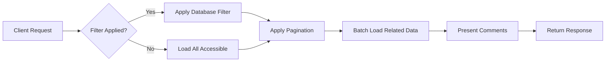

# Comments API

<cite>
**Referenced Files in This Document**   
- [comments.ts](file://server/routes/api/comments/comments.ts)
- [comment.ts](file://server/policies/comment.ts)
- [Comment.ts](file://server/models/Comment.ts)
- [Comment.ts](file://app/models/Comment.ts)
- [comment.ts](file://server/presenters/comment.ts)
</cite>

## Table of Contents
1. [Introduction](#introduction)
2. [API Endpoints](#api-endpoints)
3. [Data Model](#data-model)
4. [Authentication and Authorization](#authentication-and-authorization)
5. [Comment Thread Structure](#comment-thread-structure)
6. [Mentions and Notifications](#mentions-and-notifications)
7. [Performance Considerations](#performance-considerations)
8. [Troubleshooting Guide](#troubleshooting-guide)

## Introduction
The Comments API in the baozi application provides a comprehensive system for managing user comments on documents. This API supports creating, retrieving, updating, and deleting comments, as well as resolving comment threads and managing reactions. The system is designed to support nested comment threads, mention notifications, and proper access control through policy enforcement. This documentation details all available endpoints, request/response schemas, authentication requirements, and integration points.

**Section sources**
- [comments.ts](file://server/routes/api/comments/comments.ts)

## API Endpoints

### POST /api/comments.create
Creates a new comment on a document. Supports both Prosemirror data format and markdown text input. The endpoint handles image attachments and automatically processes mentions.

**Request Schema**
- `documentId` (string): The ID of the document to comment on
- `text` (string, optional): Markdown formatted text
- `data` (object, optional): Prosemirror JSON data
- `parentCommentId` (string, optional): ID of parent comment for replies
- `id` (string, optional): Predefined comment ID

**Response Schema**
```json
{
  "data": {
    "id": "string",
    "data": "object",
    "documentId": "string",
    "parentCommentId": "string",
    "createdBy": "User",
    "createdById": "string",
    "resolvedAt": "string",
    "resolvedBy": "User",
    "resolvedById": "string",
    "createdAt": "string",
    "updatedAt": "string",
    "reactions": "ReactionSummary[]"
  },
  "policies": "Policy[]"
}
```

**Section sources**
- [comments.ts](file://server/routes/api/comments/comments.ts#L27-L68)

### POST /api/comments.info
Retrieves detailed information about a specific comment, including its document context and optional anchor text.

**Request Schema**
- `id` (string): The ID of the comment to retrieve
- `includeAnchorText` (boolean, optional): Whether to include the text being commented on

**Response Schema**
Same as comments.create response with optional `anchorText` field.

**Section sources**
- [comments.ts](file://server/routes/api/comments/comments.ts#L71-L95)

### POST /api/comments.list
Retrieves a list of comments with pagination support. Can filter by document, collection, parent comment, and resolution status.

**Request Schema**
- `documentId` (string, optional): Filter by document
- `collectionId` (string, optional): Filter by collection
- `parentCommentId` (string, optional): Filter by parent comment
- `statusFilter` (array, optional): Filter by resolution status (resolved, unresolved)
- `includeAnchorText` (boolean, optional): Include anchor text
- `sort` (string, optional): Sort field (createdAt, updatedAt)
- `direction` (string, optional): Sort direction (ASC, DESC)

**Response Schema**
```json
{
  "pagination": {
    "page": "number",
    "limit": "number",
    "total": "number"
  },
  "data": "Comment[]",
  "policies": "Policy[]"
}
```

**Section sources**
- [comments.ts](file://server/routes/api/comments/comments.ts#L98-L212)

### POST /api/comments.update
Updates an existing comment's content. Automatically detects new mentions and triggers notifications.

**Request Schema**
- `id` (string): The ID of the comment to update
- `data` (object): Updated Prosemirror data

**Response Schema**
Same as comments.create response.

**Section sources**
- [comments.ts](file://server/routes/api/comments/comments.ts#L215-L276)

### POST /api/comments.delete
Deletes a comment and all its replies. Requires appropriate permissions.

**Request Schema**
- `id` (string): The ID of the comment to delete

**Response Schema**
```json
{
  "success": "boolean"
}
```

**Section sources**
- [comments.ts](file://server/routes/api/comments/comments.ts#L279-L309)

### POST /api/comments.resolve
Marks a top-level comment thread as resolved. Cannot resolve reply comments.

**Request Schema**
- `id` (string): The ID of the comment to resolve

**Response Schema**
Same as comments.create response.

**Section sources**
- [comments.ts](file://server/routes/api/comments/comments.ts#L312-L344)

### POST /api/comments.unresolve
Reopens a resolved comment thread.

**Request Schema**
- `id` (string): The ID of the comment to unresolve

**Response Schema**
Same as comments.create response.

**Section sources**
- [comments.ts](file://server/routes/api/comments/comments.ts#L347-L379)

### POST /api/comments.add_reaction
Adds an emoji reaction to a comment.

**Request Schema**
- `id` (string): The ID of the comment
- `emoji` (string): The emoji to add

**Response Schema**
```json
{
  "success": "boolean"
}
```

**Section sources**
- [comments.ts](file://server/routes/api/comments/comments.ts#L382-L422)

### POST /api/comments.remove_reaction
Removes an emoji reaction from a comment.

**Request Schema**
- `id` (string): The ID of the comment
- `emoji` (string): The emoji to remove

**Response Schema**
Same as add_reaction response.

**Section sources**
- [comments.ts](file://server/routes/api/comments/comments.ts#L425-L464)

## Data Model

### Comment Entity
The Comment model represents a user comment on a document with support for nested replies and rich content.



**Diagram sources**
- [Comment.ts](file://server/models/Comment.ts#L40-L167)
- [Comment.ts](file://app/models/Comment.ts#L13-L278)

## Authentication and Authorization

### Policy Enforcement
The comment policy system enforces access control based on user roles and comment ownership.



**Diagram sources**
- [comment.ts](file://server/policies/comment.ts#L1-L40)

**Section sources**
- [comment.ts](file://server/policies/comment.ts#L1-L40)
- [comments.ts](file://server/routes/api/comments/comments.ts#L29-L31)

## Comment Thread Structure

### Thread Hierarchy
The comment system supports nested threads with a maximum depth of two levels (top-level comments and replies).



**Diagram sources**
- [Comment.ts](file://server/models/Comment.ts#L53-L90)

### Thread Resolution Rules
- Only top-level comments can be resolved
- Resolving a thread resolves all replies
- Replies cannot be individually resolved
- Resolved threads can be reopened by any team member

**Section sources**
- [Comment.ts](file://server/models/Comment.ts#L99-L123)
- [Comment.ts](file://app/models/Comment.ts#L100-L103)

## Mentions and Notifications

### Mention Processing
When comments are created or updated, the system parses mentions and triggers notifications.



**Diagram sources**
- [comments.ts](file://server/routes/api/comments/comments.ts#L241-L266)
- [comment.ts](file://server/policies/comment.ts)

**Section sources**
- [comments.ts](file://server/routes/api/comments/comments.ts#L241-L266)

### Notification Integration
The system integrates with the notification system to alert users when:
- They are mentioned in a comment (@username)
- A comment they created is replied to
- A comment thread they participated in is resolved
- Someone reacts to their comment

**Section sources**
- [comments.ts](file://server/routes/api/comments/comments.ts#L270)
- [Comment.ts](file://app/models/Comment.ts#L136-L153)

## Performance Considerations

### Thread Rendering Optimization
The API provides several features to optimize comment thread rendering:

1. **Pagination**: All list endpoints support pagination to limit response size
2. **Selective Loading**: The `includeAnchorText` parameter allows clients to request anchor text only when needed
3. **Batched Policies**: Authorization policies are batched to minimize database queries
4. **Eager Loading**: Related documents and users are eagerly loaded to prevent N+1 queries



**Section sources**
- [comments.ts](file://server/routes/api/comments/comments.ts#L100-L212)

### Database Query Optimization
The comment system uses several techniques to optimize database performance:

- **Indexing**: Critical fields are indexed for fast lookups
- **Transaction Isolation**: Row-level locking prevents race conditions during updates
- **Batch Operations**: Count and find operations are batched using Promise.all
- **Selective Queries**: Queries only retrieve needed data based on filters

**Section sources**
- [comments.ts](file://server/routes/api/comments/comments.ts#L226-L233)
- [comments.ts](file://server/routes/api/comments/comments.ts#L194-L198)

## Troubleshooting Guide

### Permission Errors
Common causes and solutions:

1. **403 Forbidden when creating comment**
   - Verify the team has commenting enabled
   - Check that the user has read access to the document
   - Ensure the user is a member of the team

2. **Cannot resolve comment**
   - Verify the comment is a top-level thread (no parentCommentId)
   - Check that the comment is currently unresolved
   - Confirm the user has update permission on the document

3. **Cannot update/delete comment**
   - Verify the user is the comment author or a team admin
   - Check that the comment exists and hasn't been deleted

**Section sources**
- [comment.ts](file://server/policies/comment.ts#L27-L32)
- [comments.ts](file://server/routes/api/comments/comments.ts#L238-L239)

### Notification Delivery Failures
Common issues and solutions:

1. **Mentions not triggering notifications**
   - Verify the mention format is correct (@username)
   - Check that the mentioned user exists and is active
   - Ensure the notification system is operational

2. **Duplicate notifications**
   - Verify the system is not processing the same comment update multiple times
   - Check for client-side retry logic that might cause duplicate requests

**Section sources**
- [comments.ts](file://server/routes/api/comments/comments.ts#L241-L266)

### Thread Synchronization Problems
Common issues and solutions:

1. **Missing replies in thread**
   - Verify the parentCommentId is correctly set
   - Check that the reply has the same documentId as the parent
   - Ensure the user has permission to view the reply

2. **Inconsistent resolution state**
   - Verify that resolution updates are properly propagated
   - Check that the resolvedAt timestamp is correctly updated
   - Ensure the cache is properly invalidated after updates

**Section sources**
- [Comment.ts](file://server/models/Comment.ts#L144-L164)
- [Comment.ts](file://app/models/Comment.ts#L100-L103)