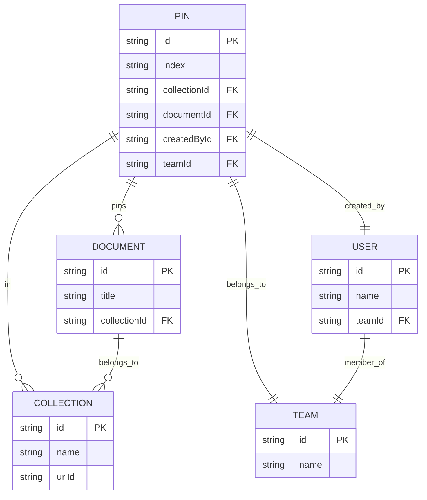
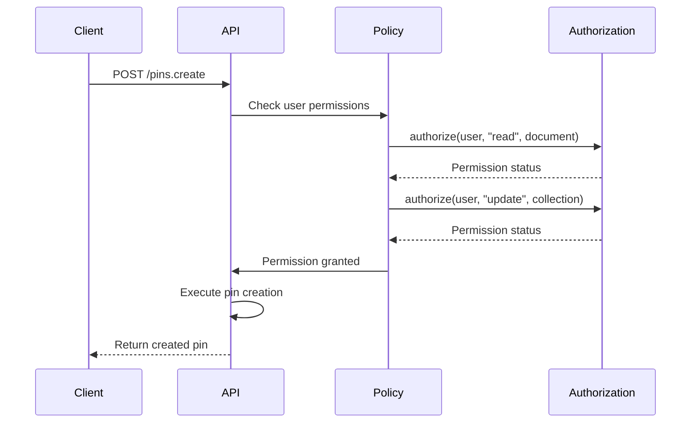
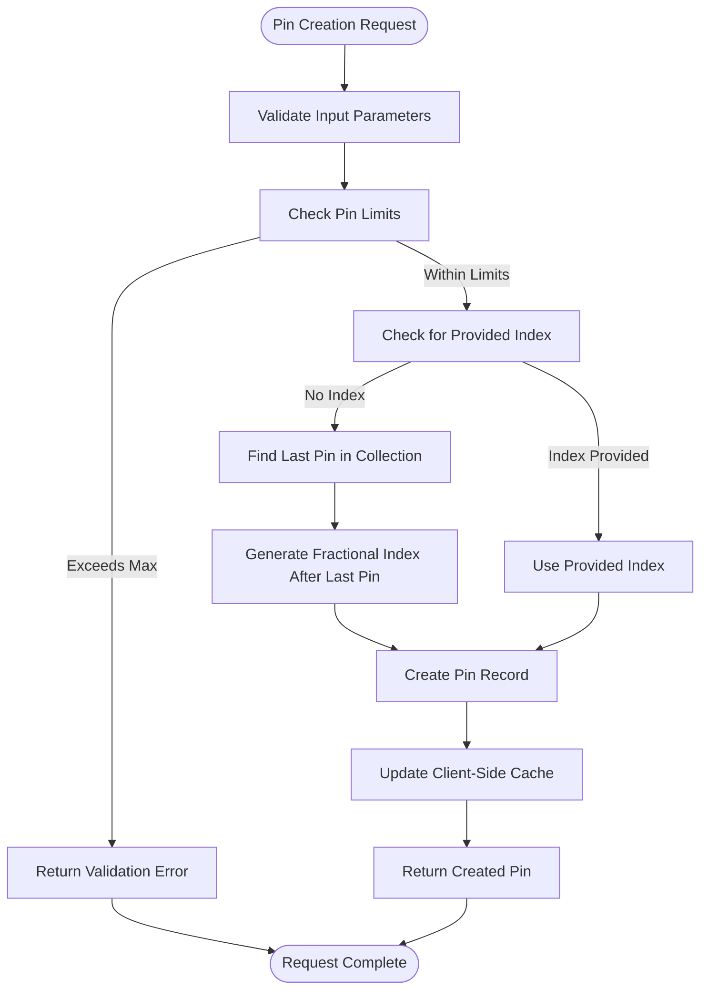
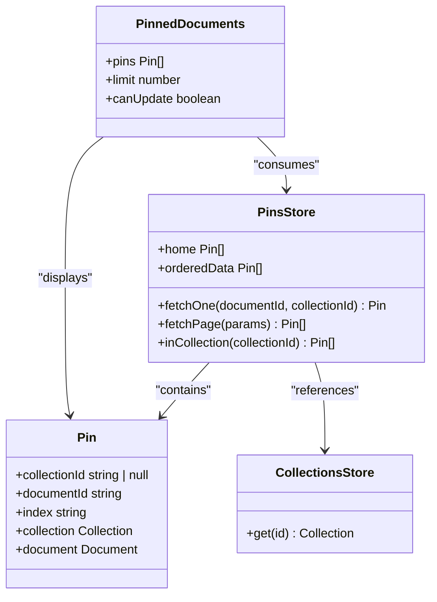

# Pins API

<cite>
**Referenced Files in This Document**   
- [pins.ts](file://server/policies/pins.ts)
- [pins.ts](file://server/routes/api/pins/pins.ts)
- [Pin.ts](file://app/models/Pin.ts)
- [Pin.ts](file://server/models/Pin.ts)
- [pinCreator.ts](file://server/commands/pinCreator.ts)
- [PinnedDocuments.tsx](file://app/components/PinnedDocuments.tsx)
- [CollectionsStore.ts](file://app/stores/CollectionsStore.ts)
</cite>

## Table of Contents
1. [Introduction](#introduction)
2. [Data Model Relationships](#data-model-relationships)
3. [API Endpoints](#api-endpoints)
4. [Authentication and Policy Enforcement](#authentication-and-policy-enforcement)
5. [Pinning Workflow](#pinning-workflow)
6. [Collection Integration](#collection-integration)
7. [Performance Considerations](#performance-considerations)
8. [Troubleshooting Guide](#troubleshooting-guide)

## Introduction
The Pins API in the baozi application enables users to pin documents to collections or the home screen for quick access. This functionality enhances content discoverability and provides users with personalized document organization. The API supports creating, retrieving, updating, and deleting pins through RESTful endpoints. Pins establish a relationship between documents and collections (or home) with configurable sort order, allowing users to curate their workspace efficiently.

**Section sources**
- [pins.ts](file://server/routes/api/pins/pins.ts#L1-L214)

## Data Model Relationships
The pinning system establishes relationships between key entities in the application. The Pin model serves as a junction between documents and collections, maintaining sort order through the index field. Each pin references a document and optionally a collection, with the absence of a collection ID indicating a home pin. The system enforces team-level scoping, ensuring pins are isolated by workspace.



**Diagram sources**
- [Pin.ts](file://server/models/Pin.ts#L16-L58)
- [Document.ts](file://server/models/Document.ts#L94-L1314)
- [Collection.ts](file://server/models/Collection.ts#L87-L1007)

**Section sources**
- [Pin.ts](file://app/models/Pin.ts#L11-L58)
- [Pin.ts](file://server/models/Pin.ts#L16-L58)

## API Endpoints
The Pins API provides comprehensive operations for managing pinned documents through RESTful endpoints. All endpoints require authentication and follow consistent request/response patterns.

### Create Pin (POST /pins.create)
Creates a new pin for a document in a collection or on the home screen.

**Request Schema**
```json
{
  "documentId": "string",
  "collectionId": "string | null",
  "index": "string"
}
```

**Response Schema**
```json
{
  "data": {
    "id": "string",
    "documentId": "string",
    "collectionId": "string | null",
    "index": "string",
    "createdAt": "string",
    "updatedAt": "string"
  },
  "policies": {}
}
```

### Retrieve Pin Information (POST /pins.info)
Fetches information about a specific pin by document and collection.

**Request Schema**
```json
{
  "documentId": "string",
  "collectionId": "string | null"
}
```

**Response Schema**
Returns 204 if no pin exists, otherwise the same structure as create response.

### List Pins (POST /pins.list)
Retrieves all pins for a collection or home screen with pagination support.

**Request Schema**
```json
{
  "collectionId": "string | null",
  "limit": "number",
  "offset": "number"
}
```

**Response Schema**
```json
{
  "pagination": {
    "limit": "number",
    "offset": "number",
    "total": "number"
  },
  "data": {
    "pins": [],
    "documents": []
  },
  "policies": {}
}
```

### Update Pin (POST /pins.update)
Modifies the sort order of an existing pin.

**Request Schema**
```json
{
  "id": "string",
  "index": "string"
}
```

**Response Schema**
Same structure as create response with updated index.

### Delete Pin (POST /pins.delete)
Removes a pin relationship.

**Request Schema**
```json
{
  "id": "string"
}
```

**Response Schema**
```json
{
  "success": "boolean"
}
```

**Section sources**
- [pins.ts](file://server/routes/api/pins/pins.ts#L20-L213)

## Authentication and Policy Enforcement
The pinning system implements role-based access control through policy files that define permission requirements for operations. The policies ensure that users have appropriate permissions on both the target document and destination collection before performing pin operations.



The policy enforcement follows these rules:
- To pin a document to a collection: user must have read access to the document and update access to the collection
- To pin a document to home: user must have pinToHome permission on the document
- To update a pin: user must have pin permission on the document (for collection pins) or update permission on the pin (for home pins)
- To delete a pin: user must have unpin permission on the document (for collection pins) or delete permission on the pin (for home pins)

Team administrators have implicit update and delete permissions on all pins within their team.

**Diagram sources**
- [pins.ts](file://server/policies/pins.ts#L1-L6)

**Section sources**
- [pins.ts](file://server/policies/pins.ts#L1-L6)
- [pins.ts](file://server/routes/api/pins/pins.ts#L33-L44)

## Pinning Workflow
The pin creation process follows a structured workflow that ensures data consistency and proper sorting. When a new pin is created, the system validates constraints, determines the appropriate sort index, and establishes the relationship.



The system enforces a maximum pin limit defined in PinValidation.max. When no index is provided, the system uses fractional indexing to place the new pin at the end of the list. This approach allows for efficient reordering without requiring bulk updates to adjacent items.

**Diagram sources**
- [pinCreator.ts](file://server/commands/pinCreator.ts#L27-L74)
- [Pin.ts](file://app/models/Pin.ts#L35-L57)

**Section sources**
- [pinCreator.ts](file://server/commands/pinCreator.ts#L27-L74)
- [Pin.ts](file://app/models/Pin.ts#L35-L57)

## Collection Integration
Pinned documents are integrated into collection views, appearing at the top of document lists in their specified order. The system maintains bidirectional relationships between pins, collections, and documents, ensuring consistent presentation across the application.

The client-side store (PinsStore) manages pinned document state and provides computed properties for accessing pins by collection. When pins are created or removed, cache keys are updated to reflect the current count, enabling efficient UI updates.



The PinnedDocuments component renders pinned items in collection views, respecting user permissions for update operations. The integration ensures that pinned documents appear consistently across different views and devices through websocket synchronization.

**Diagram sources**
- [PinsStore.ts](file://app/stores/PinsStore.ts#L11-L98)
- [PinnedDocuments.tsx](file://app/components/PinnedDocuments.tsx#L27-L36)
- [CollectionsStore.ts](file://app/stores/CollectionsStore.ts#L187-L192)

**Section sources**
- [PinsStore.ts](file://app/stores/PinsStore.ts#L11-L98)
- [PinnedDocuments.tsx](file://app/components/PinnedDocuments.tsx#L27-L36)
- [CollectionsStore.ts](file://app/stores/CollectionsStore.ts#L187-L192)

## Performance Considerations
The Pins API is optimized for efficient querying and display of pinned documents in collection contexts. The system employs several strategies to maintain performance at scale:

1. **Indexed Queries**: The database queries for pins are optimized with appropriate indexes on collectionId, documentId, and teamId fields, ensuring fast lookups.

2. **Batched Retrieval**: When listing pins, the system retrieves both pin records and associated documents in a single operation, minimizing database round trips.

3. **Fractional Indexing**: The use of fractional indexing for sort order allows for efficient insertion and reordering without requiring bulk updates to adjacent items.

4. **Client-Side Caching**: The application maintains client-side caches of pin counts for each collection, reducing the need for frequent server requests to determine display state.

5. **Pagination Support**: The pins.list endpoint supports pagination, allowing clients to retrieve pins in manageable chunks rather than loading all records at once.

6. **Websocket Synchronization**: Real-time updates are delivered through websockets, ensuring that pin changes are propagated to clients without requiring polling.

For optimal performance when displaying pinned documents in collection views, clients should:
- Cache pin lists locally to minimize API calls
- Use the pins.info endpoint to check pin status before attempting creation
- Implement debouncing for rapid pin operations
- Handle websocket events to update UI state in real-time

**Section sources**
- [pins.ts](file://server/routes/api/pins/pins.ts#L103-L139)
- [Pin.ts](file://app/models/Pin.ts#L35-L57)

## Troubleshooting Guide
This section addresses common issues encountered when working with the Pins API and provides guidance for resolution.

### Permission Errors
When encountering permission errors during pin operations:
1. Verify the user has read access to the target document
2. For collection pins, ensure the user has update permissions on the collection
3. For home pins, confirm the user has pinToHome permission on the document
4. Check that the user is a member of the appropriate team

### Missing Pinned Documents
If pinned documents do not appear in collection views:
1. Verify the pin record exists by calling pins.info with the document and collection IDs
2. Check that the document is not archived or deleted
3. Ensure the user has permission to view the document
4. Confirm the client has received the pin data through pins.list or websocket events

### Synchronization Problems
For issues with pin state across devices:
1. Verify websocket connections are active and receiving events
2. Check that cache keys are being updated properly after pin operations
3. Ensure the client calls pins.list after significant state changes
4. Validate that the fractional indexing is working correctly for sort order

### Rate Limiting and Validation
The system enforces a maximum number of pins per user (defined by PinValidation.max). If pin creation fails with a validation error:
1. Check the current number of pins using pins.list
2. Remove unnecessary pins before creating new ones
3. Consider implementing a UI indicator showing the remaining pin capacity

### Debugging Tips
- Monitor websocket events (pins.create, pins.update, pins.delete) to track real-time changes
- Use the pins.info endpoint to verify pin existence before operations
- Check server logs for authorization failures or database errors
- Validate that transaction boundaries are properly maintained in the API routes

**Section sources**
- [pins.ts](file://server/routes/api/pins/pins.ts#L187-L191)
- [pins.ts](file://server/policies/pins.ts#L1-L6)
- [pinCreator.ts](file://server/commands/pinCreator.ts#L40-L40)