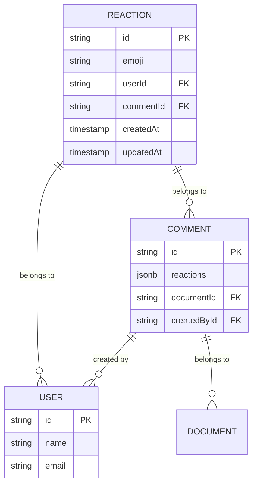
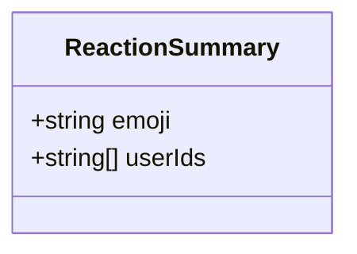
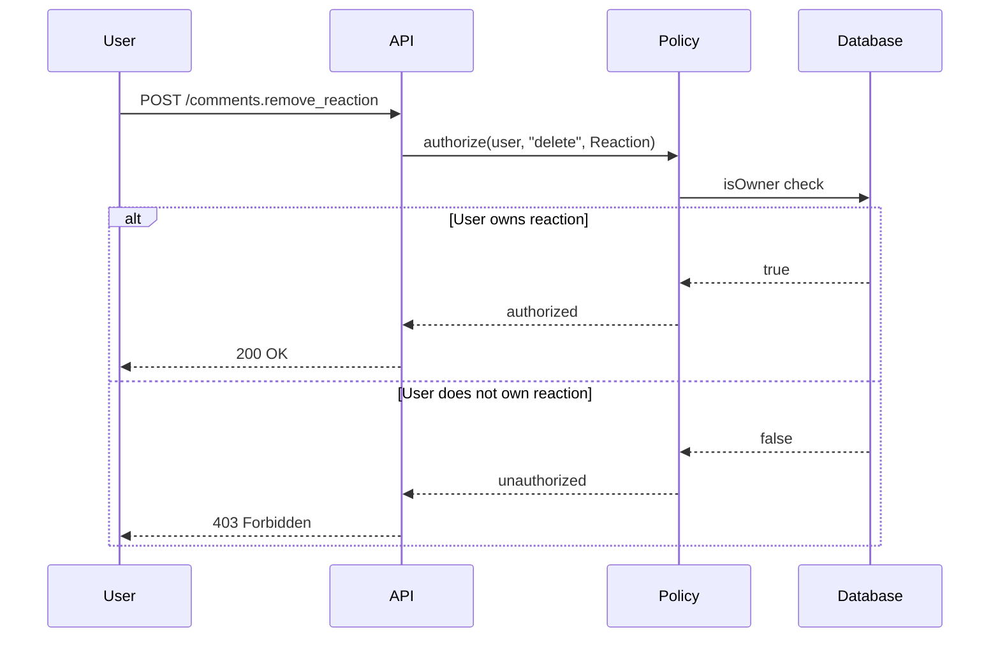
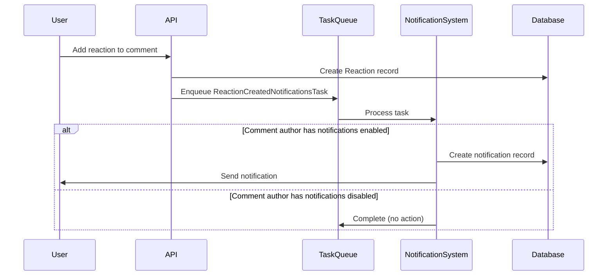
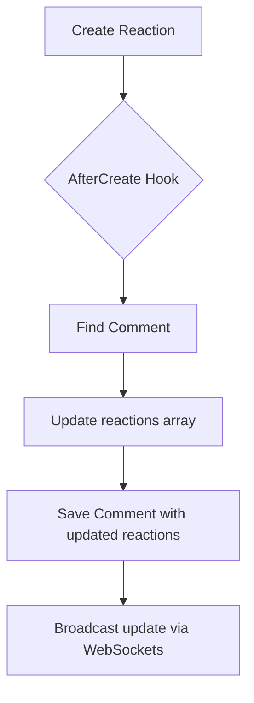

# Reactions API

<cite>
**Referenced Files in This Document**   
- [Reaction.ts](file://server/models/Reaction.ts)
- [reaction.ts](file://server/policies/reaction.ts)
- [reactions.ts](file://server/routes/api/reactions/reactions.ts)
- [Reaction.tsx](file://app/components/Reactions/Reaction.tsx)
- [ReactionList.tsx](file://app/components/Reactions/ReactionList.tsx)
- [Comment.ts](file://app/models/Comment.ts)
- [Comment.ts](file://server/models/Comment.ts)
- [ReactionCreatedNotificationsTask.ts](file://server/queues/tasks/ReactionCreatedNotificationsTask.ts)
- [ReactionRemovedNotificationsTask.ts](file://server/queues/tasks/ReactionRemovedNotificationsTask.ts)
</cite>

## Table of Contents
1. [Introduction](#introduction)
2. [Data Model](#data-model)
3. [API Endpoints](#api-endpoints)
4. [Authentication and Authorization](#authentication-and-authorization)
5. [Notification System](#notification-system)
6. [Performance Considerations](#performance-considerations)
7. [Troubleshooting Guide](#troubleshooting-guide)
8. [Usage Examples](#usage-examples)

## Introduction
The Reactions API in the baozi application enables users to interact with content through emoji-based reactions on comments. This system allows users to express sentiment, agreement, or other feedback on comments within documents. The API supports adding, retrieving, and removing reactions, with real-time updates and notification integration. Reactions are stored as a many-to-many relationship between users and comments, with denormalized data for performance optimization.

**Section sources**
- [Reaction.ts](file://server/models/Reaction.ts#L27-L160)
- [Comment.ts](file://server/models/Comment.ts#L55-L56)

## Data Model

### Reaction Entity
The Reaction model represents a user's emoji reaction to a comment. Each reaction is uniquely identified and associated with a specific user and comment.



**Diagram sources **
- [Reaction.ts](file://server/models/Reaction.ts#L27-L160)
- [Comment.ts](file://server/models/Comment.ts#L24-L164)
- [User.ts](file://server/models/User.ts#L81-L856)

### Reaction Summary Structure
The `ReactionSummary` type is used to represent aggregated reaction data in responses, containing the emoji and associated user IDs without full user objects.



**Diagram sources **
- [types.ts](file://shared/types.ts#L614-L617)

## API Endpoints

### GET /reactions.list
Retrieves all reactions for a specific comment with pagination support.

**Request Parameters**
| Parameter | Type | Required | Description |
|---------|------|----------|-------------|
| commentId | string | Yes | The ID of the comment to retrieve reactions for |
| offset | number | No | Pagination offset (default: 0) |
| limit | number | No | Pagination limit (default: 25) |

**Response Schema**
```json
{
  "pagination": {
    "offset": 0,
    "limit": 25,
    "total": 3
  },
  "data": [
    {
      "id": "reaction-1",
      "emoji": "👍",
      "userId": "user-1",
      "commentId": "comment-1",
      "createdAt": "2023-01-01T00:00:00.000Z",
      "updatedAt": "2023-01-01T00:00:00.000Z",
      "user": {
        "id": "user-1",
        "name": "John Doe",
        "email": "john@example.com",
        "avatarUrl": "https://example.com/avatar.jpg"
      }
    }
  ]
}
```

**Section sources**
- [reactions.ts](file://server/routes/api/reactions/reactions.ts#L14-L65)

### POST /comments.add_reaction
Adds a reaction to a comment. If the user has already reacted with the same emoji, this operation is idempotent.

**Request Schema**
```json
{
  "id": "comment-1",
  "emoji": "❤️"
}
```

**Validation Rules**
- Emoji must be a valid Unicode emoji
- Emoji length must be 50 characters or less
- User must have read access to the comment's document

**Response**
Returns a 200 status code on success with no response body.

**Section sources**
- [schema.ts](file://server/routes/api/comments/schema.ts#L103-L108)
- [Comment.ts](file://app/models/Comment.ts#L136-L153)

### POST /comments.remove_reaction
Removes a user's reaction from a comment.

**Request Schema**
```json
{
  "id": "comment-1",
  "emoji": "👍"
}
```

**Response**
Returns a 200 status code on success with no response body.

**Section sources**
- [Comment.ts](file://app/models/Comment.ts#L164-L181)

## Authentication and Authorization

### Policy Enforcement
The reaction system implements role-based access control through the cancan policy framework. Users can only delete their own reactions.



**Diagram sources **
- [reaction.ts](file://server/policies/reaction.ts#L5)
- [cancan.ts](file://server/policies/cancan.ts#L74-L106)

### Authorization Rules
- **Create**: Users with read access to a comment's document can add reactions
- **Read**: Users with read access to a comment's document can view reactions
- **Delete**: Only the user who created a reaction can remove it (owner policy)

The authorization check verifies both document access and reaction ownership:

```typescript
const comment = await Comment.findByPk(commentId);
const document = await Document.findByPk(comment.documentId);
authorize(user, "readReaction", comment);
authorize(user, "read", document);
```

**Section sources**
- [reactions.ts](file://server/routes/api/reactions/reactions.ts#L30-L31)

## Notification System

### Notification Workflow
When a user adds a reaction to a comment, the system creates a notification for the comment author if they have the appropriate notification preference enabled.



**Diagram sources **
- [ReactionCreatedNotificationsTask.ts](file://server/queues/tasks/ReactionCreatedNotificationsTask.ts#L6-L94)
- [reactions.ts](file://server/routes/api/reactions/reactions.ts#L56-L59)

### Notification Types
The system supports the following notification types for reactions:

| Notification Type | Event Name | Description |
|------------------|-----------|-------------|
| ReactionsCreate | comments.add_reaction | Triggered when a user reacts to a comment |

Notification preferences are user-configurable, allowing users to opt in or out of reaction notifications.

**Section sources**
- [ReactionCreatedNotificationsTask.ts](file://server/queues/tasks/ReactionCreatedNotificationsTask.ts#L6-L94)
- [User.ts](file://server/models/User.ts#L81-L856)

## Performance Considerations

### Denormalized Data Storage
To optimize read performance, reaction data is denormalized and stored directly on the Comment model in a JSONB field:

```typescript
@Column(DataType.JSONB)
reactions: ReactionSummary[] | null;
```

This eliminates the need for expensive JOIN operations when displaying comments with their reactions.

### Cache Synchronization
When reactions are added or removed, the system automatically updates the denormalized data through Sequelize hooks:



**Diagram sources **
- [Reaction.ts](file://server/models/Reaction.ts#L56-L106)
- [Reaction.ts](file://server/models/Reaction.ts#L108-L159)

### Real-time Updates
The system uses WebSockets to push reaction updates to connected clients in real-time, ensuring all users see the latest reaction counts without requiring page refreshes.

**Section sources**
- [Reaction.ts](file://server/models/Reaction.ts#L56-L159)

## Troubleshooting Guide

### Common Issues and Solutions

#### Duplicate Reactions
**Symptom**: Users are able to add the same emoji reaction multiple times.
**Solution**: The system uses the `uniq` function to ensure user IDs are unique within a reaction group. This is handled automatically in the `addReactionToCommentCache` hook.

```typescript
reaction.userIds = uniq([...reaction.userIds, model.userId]);
```

**Section sources**
- [Reaction.ts](file://server/models/Reaction.ts#L87)

#### Permission Errors
**Symptom**: Users receive 403 Forbidden errors when trying to remove reactions.
**Solution**: Verify that the user is the owner of the reaction. The policy enforcement ensures only the reaction creator can delete it.

```typescript
allow(User, "delete", Reaction, isOwner);
```

**Section sources**
- [reaction.ts](file://server/policies/reaction.ts#L5)

#### Synchronization Problems
**Symptom**: Reaction counts are inconsistent between the UI and database.
**Solution**: The system uses database locks during cache updates to prevent race conditions:

```typescript
const lock = transaction
  ? {
      level: transaction.LOCK.UPDATE,
      of: Comment,
    }
  : undefined;
```

**Section sources**
- [Reaction.ts](file://server/models/Reaction.ts#L65-L70)

### Monitoring and Logging
The system includes error handling for reaction data prefetching:

```typescript
try {
  await model.loadReactedUsersData();
} catch (_err) {
  Logger.warn("Could not prefetch reaction data");
}
```

**Section sources**
- [ReactionList.tsx](file://app/components/Reactions/ReactionList.tsx#L45-L46)

## Usage Examples

### Adding Common Reactions
To add a "thumbs up" reaction to a comment:

```javascript
await client.post("/comments.add_reaction", {
  id: "comment-123",
  emoji: "👍"
});
```

To add a "heart" reaction:

```javascript
await client.post("/comments.add_reaction", {
  id: "comment-123",
  emoji: "❤️"
});
```

### Retrieving All Reactions for a Comment
```javascript
const response = await client.post("/reactions.list", {
  commentId: "comment-123",
  limit: 50
});
// Returns paginated list of reactions with user data
```

### Removing a User Reaction
```javascript
await client.post("/comments.remove_reaction", {
  id: "comment-123",
  emoji: "👍"
});
// Removes the thumbs up reaction from the current user
```

**Section sources**
- [Reaction.tsx](file://app/components/Reactions/Reaction.tsx#L107-L115)
- [ReactionList.tsx](file://app/components/Reactions/ReactionList.tsx#L70-L78)