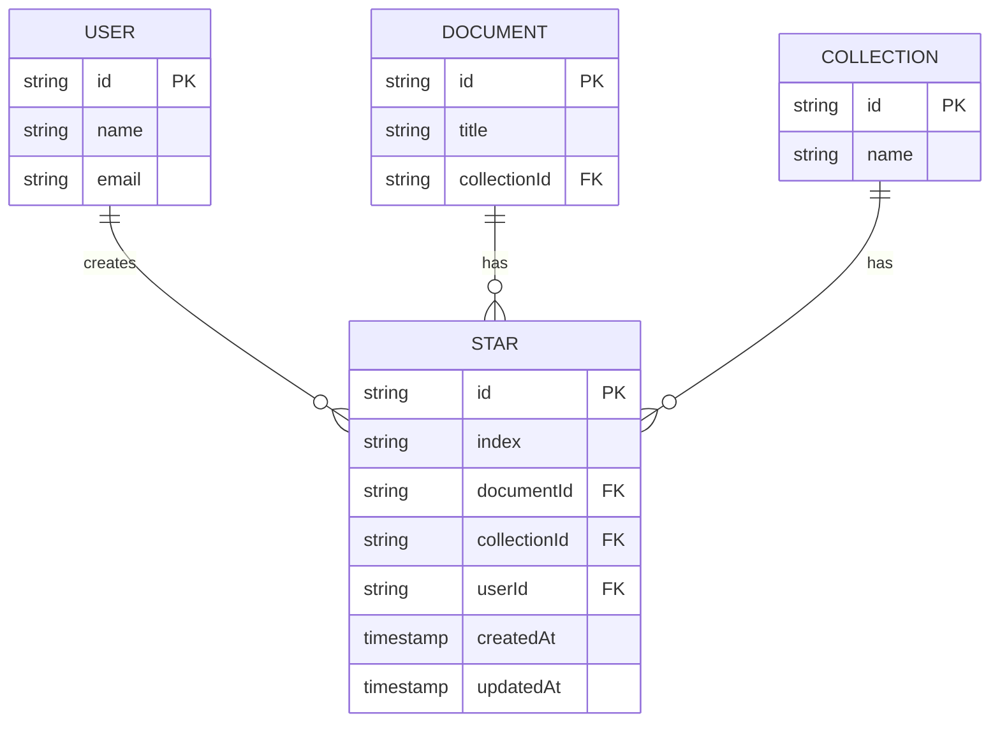
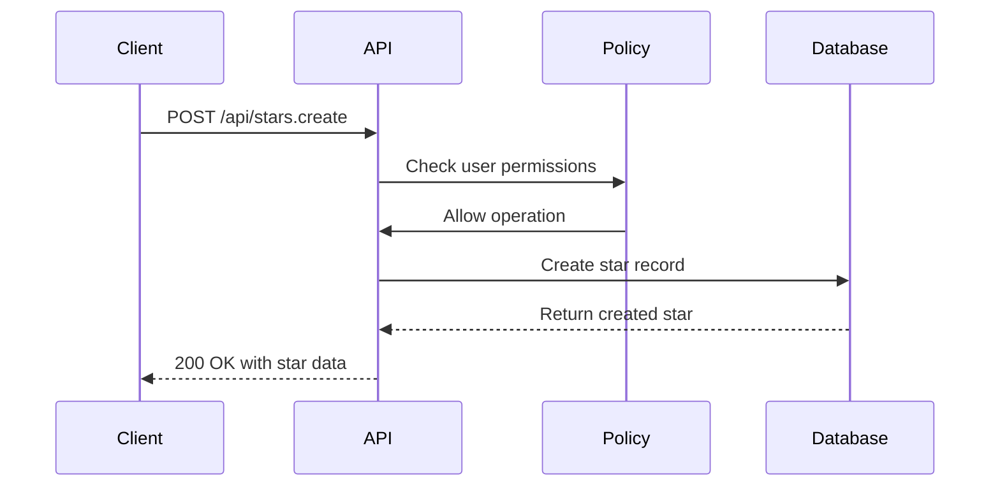
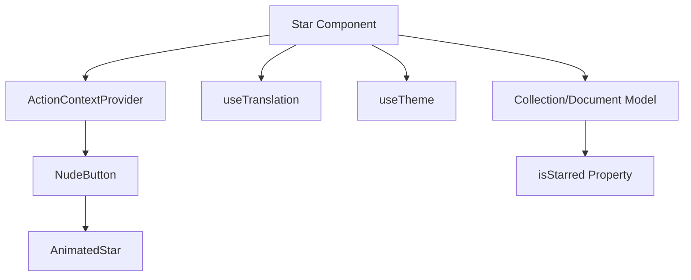
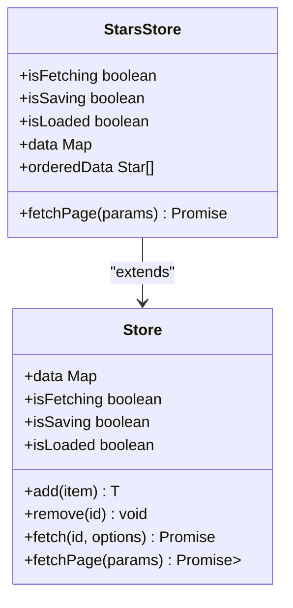

# Stars API

<cite>
**Referenced Files in This Document**   
- [Star.ts](file://app/models/Star.ts)
- [Star.ts](file://server/models/Star.ts)
- [StarsStore.ts](file://app/stores/StarsStore.ts)
- [starCreator.ts](file://server/commands/starCreator.ts)
- [Star.tsx](file://app/components/Star.tsx)
- [pins.ts](file://server/policies/pins.ts)
</cite>

## Table of Contents
1. [Introduction](#introduction)
2. [Data Model](#data-model)
3. [API Endpoints](#api-endpoints)
4. [Authentication and Authorization](#authentication-and-authorization)
5. [UI Integration](#ui-integration)
6. [Performance Considerations](#performance-considerations)
7. [Troubleshooting](#troubleshooting)
8. [Examples](#examples)

## Introduction
The Stars API in the baozi application provides functionality for users to star and unstar documents and collections, creating a personalized list of important content. This documentation covers the complete API for starring operations, including data models, endpoints, authentication requirements, UI integration, and performance considerations.

**Section sources**
- [Star.ts](file://app/models/Star.ts)
- [Star.ts](file://server/models/Star.ts)

## Data Model
The Star model represents a user's starred relationship with either a document or a collection. Each star includes sorting information to maintain user-defined order in the interface.

### Star Model Properties
| Property | Type | Description |
|--------|------|-------------|
| id | string | Unique identifier for the star |
| index | string | Sort order index for the star in the sidebar |
| documentId | string | ID of the starred document (nullable) |
| collectionId | string | ID of the starred collection (nullable) |
| userId | string | ID of the user who created the star |
| createdAt | string | Timestamp when the star was created |
| updatedAt | string | Timestamp when the star was last updated |

### Relationships
- A Star belongs to a User
- A Star optionally belongs to a Document
- A Star optionally belongs to a Collection
- Stars are cascade-deleted when the associated user, document, or collection is deleted



**Diagram sources**
- [Star.ts](file://server/models/Star.ts)
- [Document.ts](file://app/models/Document.ts)
- [Collection.ts](file://app/models/Collection.ts)

**Section sources**
- [Star.ts](file://app/models/Star.ts)
- [Star.ts](file://server/models/Star.ts)

## API Endpoints
The Stars API provides endpoints for creating, retrieving, and deleting stars.

### POST /api/stars.create
Creates a new star for a document or collection.

**Request Parameters**
| Parameter | Type | Required | Description |
|---------|------|----------|-------------|
| documentId | string | Conditional | ID of the document to star |
| collectionId | string | Conditional | ID of the collection to star |
| index | string | Optional | Sort index for the star |

**Request Examples**
```json
// Star a document
{
  "documentId": "doc-123"
}

// Star a collection with specific index
{
  "collectionId": "col-456",
  "index": "a1"
}
```

**Response Schema**
```json
{
  "success": true,
  "data": {
    "id": "star-789",
    "index": "a1",
    "documentId": "doc-123",
    "userId": "user-001",
    "createdAt": "2023-01-15T10:30:00.000Z",
    "updatedAt": "2023-01-15T10:30:00.000Z"
  }
}
```

### POST /api/stars.list
Retrieves a list of the user's starred documents and collections.

**Request Parameters**
| Parameter | Type | Required | Description |
|---------|------|----------|-------------|
| limit | number | Optional | Maximum number of results to return |
| offset | number | Optional | Number of results to skip |
| sort | string | Optional | Field to sort by |
| direction | string | Optional | Sort direction ("ASC" or "DESC") |

**Response Schema**
```json
{
  "success": true,
  "data": {
    "stars": [
      {
        "id": "star-789",
        "index": "a1",
        "documentId": "doc-123",
        "userId": "user-001",
        "createdAt": "2023-01-15T10:30:00.000Z",
        "updatedAt": "2023-01-15T10:30:00.000Z"
      }
    ],
    "documents": [
      {
        "id": "doc-123",
        "title": "Project Plan",
        "collectionId": "col-456"
      }
    ]
  },
  "pagination": {
    "offset": 0,
    "limit": 20,
    "total": 1
  }
}
```

### POST /api/stars.delete
Removes a star (unstar operation).

**Request Parameters**
| Parameter | Type | Required | Description |
|---------|------|----------|-------------|
| id | string | Required | ID of the star to delete |

**Response Schema**
```json
{
  "success": true
}
```

**Section sources**
- [starCreator.ts](file://server/commands/starCreator.ts)
- [StarsStore.ts](file://app/stores/StarsStore.ts)

## Authentication and Authorization
The Stars API uses the same authentication and authorization mechanisms as the rest of the baozi application.

### Authentication Requirements
- All star operations require user authentication
- Authentication is performed via session cookies or API tokens
- The authenticated user's ID is automatically associated with created stars

### Authorization Policy
The authorization policy for stars is implemented in the pins.ts policy file, which also handles pinning operations.



**Diagram sources**
- [pins.ts](file://server/policies/pins.ts)
- [starCreator.ts](file://server/commands/starCreator.ts)

The policy implementation allows users to create, update, and delete their own stars. Team administrators have additional privileges for managing pins, but star operations remain user-specific.

**Section sources**
- [pins.ts](file://server/policies/pins.ts)
- [starCreator.ts](file://server/commands/starCreator.ts)

## UI Integration
The Stars API is integrated into the baozi UI through React components and MobX stores.

### Component Architecture


**Diagram sources**
- [Star.tsx](file://app/components/Star.tsx)
- [Collection.ts](file://app/models/Collection.ts)

### StarsStore
The StarsStore manages the client-side state for starred items using MobX observables.



**Diagram sources**
- [StarsStore.ts](file://app/stores/StarsStore.ts)
- [base/Store.ts](file://app/stores/base/Store.ts)

The StarsStore provides the following key functionality:
- `fetchPage()`: Retrieves a page of starred items from the API
- `orderedData`: Computed property that returns stars sorted by index and update time
- Integration with the RootStore for global state management

**Section sources**
- [StarsStore.ts](file://app/stores/StarsStore.ts)
- [Star.tsx](file://app/components/Star.tsx)

## Performance Considerations
The Stars API includes several performance optimizations for handling large numbers of starred items.

### Indexing Strategy
Database indexes are created on the following fields:
- `userId` for efficient user-specific queries
- `index` for sorting operations
- `documentId` and `collectionId` for relationship lookups
- Composite index on `userId` and `index` for the primary access pattern

### Query Optimization
The API uses fractional indexing to maintain the order of starred items without requiring renumbering of all items when a new star is added. This approach:
- Reduces database write operations
- Enables efficient insertion at any position
- Minimizes locking during concurrent operations

### Client-Side Caching
The StarsStore implements client-side caching with the following features:
- In-memory storage of star data
- Automatic synchronization with the server
- Optimistic updates for improved perceived performance
- Pagination support for large star collections

**Section sources**
- [starCreator.ts](file://server/commands/starCreator.ts)
- [StarsStore.ts](file://app/stores/StarsStore.ts)

## Troubleshooting
This section addresses common issues encountered when using the Stars API.

### Permission Errors
**Symptoms**: 403 Forbidden responses when attempting to star content
**Causes**:
- User not authenticated
- Invalid session or token
- Insufficient permissions (rare, as starring is user-specific)

**Solutions**:
- Ensure the user is logged in
- Refresh the authentication token if expired
- Verify the API endpoint is correct

### Synchronization Problems
**Symptoms**: Star state not updating across devices
**Causes**:
- Network connectivity issues
- WebSocket connection failures
- Cache invalidation problems

**Solutions**:
- Check network connection
- Refresh the page to force a full sync
- Clear local storage if the issue persists

### Performance Issues
**Symptoms**: Slow loading of starred items
**Causes**:
- Large number of starred items
- Network latency
- Database query performance

**Solutions**:
- Implement pagination for large star collections
- Optimize database indexes
- Use client-side caching effectively

**Section sources**
- [starCreator.ts](file://server/commands/starCreator.ts)
- [StarsStore.ts](file://app/stores/StarsStore.ts)

## Examples
This section provides practical examples of using the Stars API.

### Starring a Document
```javascript
// Using the client API
const star = await client.post('/stars.create', {
  documentId: 'doc-123'
});

console.log('Document starred:', star.data.id);
```

### Retrieving Starred Documents
```javascript
// Fetch all starred items
const response = await client.post('/stars.list', {
  limit: 50,
  offset: 0
});

const stars = response.data.stars;
const documents = response.data.documents;

console.log(`Found ${stars.length} starred items`);
```

### Removing a Star
```javascript
// Unstar a document
await client.post('/stars.delete', {
  id: 'star-789'
});

console.log('Document unstarred');
```

### UI Integration Example
```jsx
// Using the Star component in a React component
function DocumentHeader({ document }) {
  return (
    <header>
      <h1>{document.title}</h1>
      <Star document={document} size={16} />
    </header>
  );
}
```

**Section sources**
- [starCreator.ts](file://server/commands/starCreator.ts)
- [StarsStore.ts](file://app/stores/StarsStore.ts)
- [Star.tsx](file://app/components/Star.tsx)