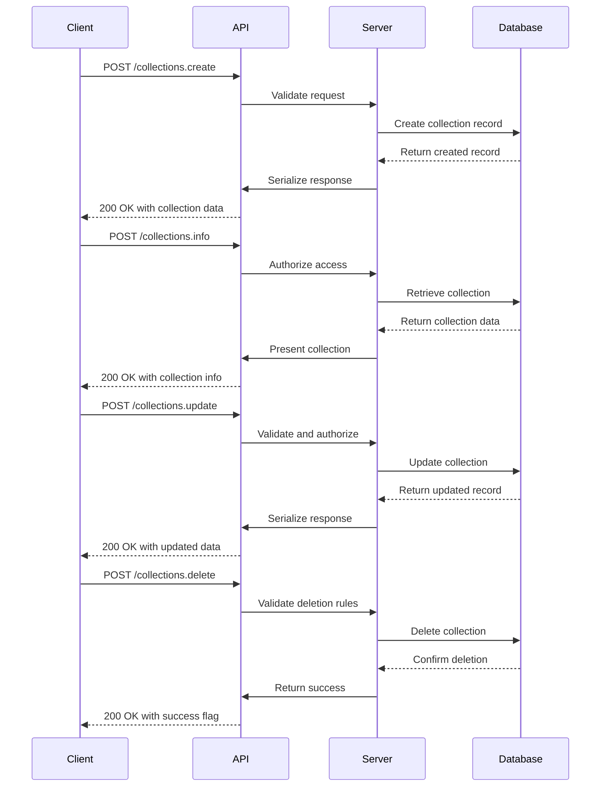
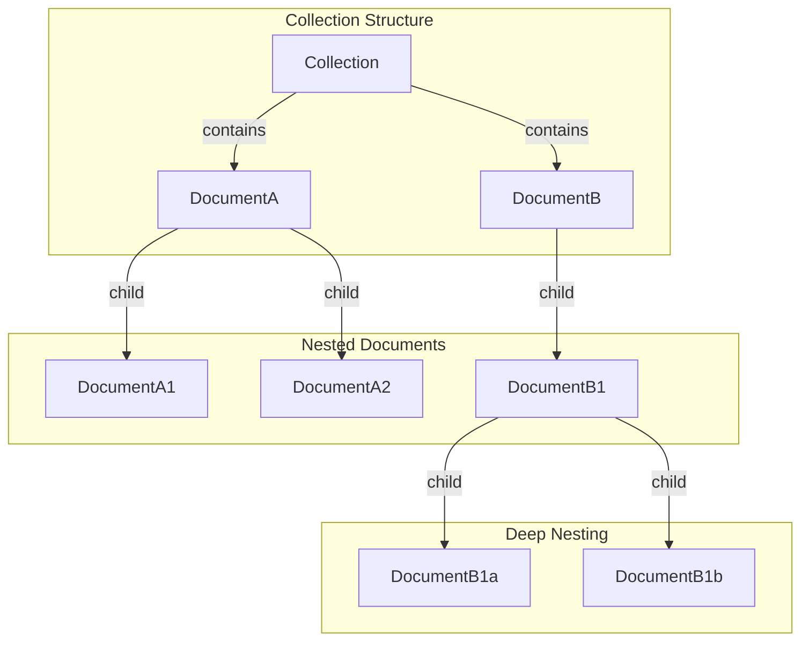
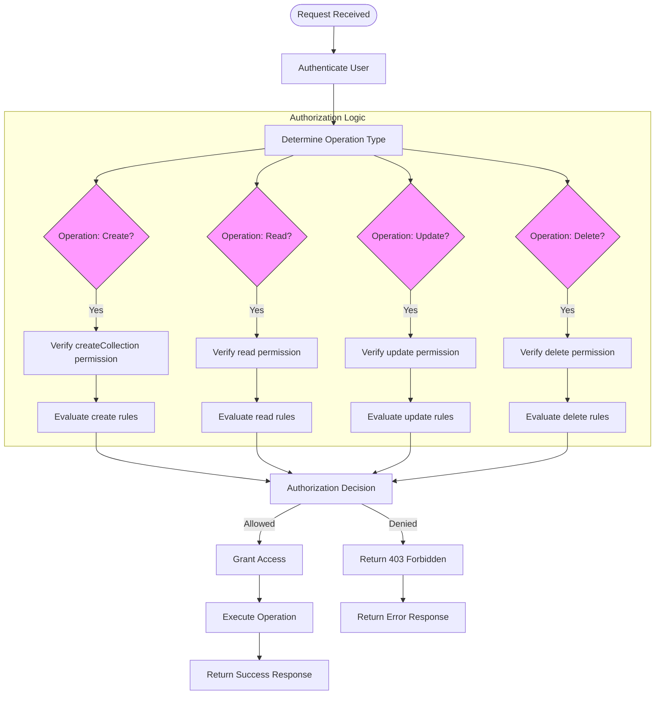

# Collections API

<cite>
**Referenced Files in This Document**   
- [Collection.ts](file://app/models/Collection.ts)
- [Collection.ts](file://server/models/Collection.ts)
- [collections.ts](file://server/routes/api/collections/collections.ts)
- [CollectionsStore.ts](file://app/stores/CollectionsStore.ts)
- [collection.ts](file://server/policies/collection.ts)
</cite>

## Table of Contents
1. [Introduction](#introduction)
2. [CRUD Operations](#crud-operations)
3. [Hierarchical Organization](#hierarchical-organization)
4. [Permission Models](#permission-models)
5. [Metadata Fields](#metadata-fields)
6. [Zod Validation](#zod-validation)
7. [Error Handling](#error-handling)
8. [Policy Enforcement](#policy-enforcement)
9. [Frontend Integration](#frontend-integration)
10. [Troubleshooting](#troubleshooting)

## Introduction
The Collections API in the baozi application provides a comprehensive interface for managing document collections. Collections serve as organizational units that group related documents, support hierarchical structures, and implement granular permission models. This API enables clients to perform all CRUD operations on collections, manage nested document hierarchies, and configure access controls. The system supports both read-only and collaborative permission models, allowing teams to control access at the collection level. Collections also support rich metadata including icons, colors, and descriptions, enhancing the user experience. The API is designed to work seamlessly with frontend components and stores, providing a consistent interface for collection management across the application.

**Section sources**
- [Collection.ts](file://app/models/Collection.ts#L19-L455)
- [Collection.ts](file://server/models/Collection.ts#L87-L1007)

## CRUD Operations
The Collections API supports standard CRUD operations through dedicated endpoints. Collection creation is handled by the `collections.create` endpoint (POST /collections.create), which accepts parameters including name, description, color, icon, permission level, and sharing status. The endpoint returns the created collection with associated policies. Collection retrieval is performed via `collections.info` (POST /collections.info), which returns detailed information about a specific collection. Updates are managed through `collections.update` (POST /collections.update), allowing modification of all collection properties. Deletion is implemented via `collections.delete` (POST /collections.delete), with server-side validation preventing deletion of the last collection in a team. All operations follow RESTful principles and return appropriate HTTP status codes and response bodies.



**Diagram sources**
- [collections.ts](file://server/routes/api/collections/collections.ts#L49-L814)

**Section sources**
- [collections.ts](file://server/routes/api/collections/collections.ts#L49-L814)
- [Collection.ts](file://server/models/Collection.ts#L87-L1007)

## Hierarchical Organization
Collections support hierarchical organization of documents through a tree structure stored in the `documentStructure` field. This JSON-based structure maintains parent-child relationships between documents, enabling nested organization within a collection. The API provides methods to manipulate this hierarchy, including adding documents to specific parent nodes and retrieving document trees. The `getDocumentTree` method returns a document's position within the hierarchy, while `getDocumentParents` retrieves the chain of parent documents. When documents are moved or deleted, the hierarchy is automatically updated to maintain integrity. The frontend `CollectionsStore` synchronizes this structure through the `fetchDocuments` method, which retrieves the document hierarchy for a collection and updates the local store.



**Diagram sources**
- [Collection.ts](file://server/models/Collection.ts#L699-L738)
- [Collection.ts](file://app/models/Collection.ts#L210-L231)

**Section sources**
- [Collection.ts](file://server/models/Collection.ts#L699-L738)
- [Collection.ts](file://app/models/Collection.ts#L210-L231)

## Permission Models
The Collections API implements a flexible permission model with read-only and collaborative access levels. The `permission` field determines the default access level for team members, with options including `read`, `readWrite`, and `admin`. Collections can be private (requiring explicit membership) or public (accessible to all team members). The `sharing` field controls whether a collection can be publicly shared. Permission changes trigger policy updates for all documents within the collection to ensure consistent access control. The authorization logic in `collection.ts` enforces these permissions, checking user roles and memberships before allowing operations. Admin users have full access, while regular members require appropriate permissions for create, update, and delete operations.

```mermaid
classDiagram
class Collection {
+permission : CollectionPermission
+sharing : boolean
+isPrivate() : boolean
}
class UserMembership {
+userId : string
+collectionId : string
+permission : CollectionPermission
}
class GroupMembership {
+groupId : string
+collectionId : string
+permission : CollectionPermission
}
class User {
+isGuest : boolean
+isViewer : boolean
+isAdmin : boolean
}
Collection --> UserMembership : "has many"
Collection --> GroupMembership : "has many"
User --> UserMembership : "belongs to"
Group --> GroupMembership : "belongs to"
note right of Collection
Permission levels :
- null : Private (members only)
- read : Read-only access
- readWrite : Collaborative editing
- admin : Full administrative rights
end note
```

**Diagram sources**
- [collection.ts](file://server/policies/collection.ts#L8-L212)
- [Collection.ts](file://server/models/Collection.ts#L260-L262)

**Section sources**
- [collection.ts](file://server/policies/collection.ts#L8-L212)
- [Collection.ts](file://server/models/Collection.ts#L260-L262)

## Metadata Fields
Collections support rich metadata fields that enhance organization and user experience. The `name` field stores the collection title, while `data` contains the description in Prosemirror format. Visual customization is provided through `icon` (emoji or icon identifier) and `color` (hex color code) fields. The `sort` field defines the sorting behavior for documents within the collection, supporting title-based or manual sorting. Additional metadata includes `commenting` (enabling/disabling comments) and `sourceMetadata` (tracking import sources). These fields are validated on the server side, with constraints on length and format. The frontend `Collection` model provides computed properties like `hasDescription` and `initial` to simplify UI rendering based on these metadata fields.

**Section sources**
- [Collection.ts](file://app/models/Collection.ts#L25-L86)
- [Collection.ts](file://server/models/Collection.ts#L213-L251)

## Zod Validation
The Collections API employs Zod for comprehensive input validation, ensuring data integrity and security. Validation schemas are defined in the routes layer and applied to all incoming requests. The `CollectionsCreateSchema` validates creation parameters, enforcing constraints on name length (maximum 255 characters), description length (maximum 16,384 characters), and icon length (maximum 50 characters). The `CollectionsUpdateSchema` applies similar validation for updates. Color values are validated as hexadecimal strings, while permission values are constrained to valid enum options. Index values are validated for length (maximum 255 characters). These validation rules prevent malformed data from entering the system and provide clear error messages to clients when validation fails.

**Section sources**
- [collections.ts](file://server/routes/api/collections/collections.ts#L44-L45)
- [Collection.ts](file://server/models/Collection.ts#L214-L255)

## Error Handling
The Collections API implements robust error handling for constraint violations and operational failures. Validation errors are returned with descriptive messages when input constraints are violated, such as exceeding name length limits or providing invalid permission values. The `collections.delete` endpoint prevents deletion of the last collection in a team, returning a specific error message. Permission denied errors are returned when users attempt operations they are not authorized to perform. The API uses appropriate HTTP status codes, including 400 for bad requests, 403 for forbidden operations, and 404 for not found resources. Error responses include clear messages to help clients understand and resolve issues. The frontend `CollectionsStore` handles these errors gracefully, providing user feedback through the UI.

**Section sources**
- [Collection.ts](file://server/models/Collection.ts#L388-L397)
- [collection.ts](file://server/policies/collection.ts#L35-L186)

## Policy Enforcement
Collection authorization logic is implemented in the `collection.ts` policy file, which defines fine-grained access controls. The system uses a cancan-style authorization framework with rules for create, read, update, delete, and other operations. Policy checks consider user roles (admin, member, viewer, guest), collection permissions, and membership status. When collection permissions or sharing status change, the system automatically invalidates document policies through the `removePolicies` hook to ensure access controls remain consistent. The `includesMembership` helper function determines if a user has sufficient permissions through direct membership or group membership. These policies are enforced on every API request, providing a secure foundation for collection management.



**Diagram sources**
- [collection.ts](file://server/policies/collection.ts#L8-L212)

**Section sources**
- [collection.ts](file://server/policies/collection.ts#L8-L212)
- [Collection.ts](file://app/models/Collection.ts#L437-L453)

## Frontend Integration
The frontend Collections API is integrated through the `CollectionsStore` and associated components. The `CollectionsStore` manages collection state, providing methods for CRUD operations and computed properties for derived data. It synchronizes with the backend through the `ApiClient` and maintains relationships with other stores like `DocumentsStore` and `PoliciesStore`. The `useCollectionTrees` hook transforms flat collection data into hierarchical navigation trees for UI rendering. Components like `CollectionBreadcrumb` and `CollectionDeleteDialog` consume this data to provide user interfaces for collection management. The store's `fetch` method automatically loads collection documents, ensuring the UI has complete data. This integration pattern ensures consistent state management and efficient data synchronization between the frontend and backend.

```mermaid
classDiagram
class CollectionsStore {
+active : Collection
+orderedData : Collection[]
+fetch(id) : Promise~Collection~
+create(params) : Promise~Collection~
+update(params) : Promise~Collection~
+delete(collection) : Promise~void~
+archive(collection) : Promise~Collection~
+restore(collection) : Promise~Collection~
}
class Collection {
+name : string
+data : ProsemirrorData
+icon : string
+color : string
+permission : CollectionPermission
+sharing : boolean
+documents : NavigationNode[]
+fetchDocuments() : Promise~void~
+updateDocument(doc) : void
+removeDocument(id) : void
+addDocument(doc, parentId) : void
}
class RootStore {
+collections : CollectionsStore
+documents : DocumentsStore
+policies : PoliciesStore
+stars : StarsStore
+subscriptions : SubscriptionsStore
}
CollectionsStore --> Collection : "manages"
RootStore --> CollectionsStore : "contains"
CollectionsStore --> DocumentsStore : "synchronizes"
CollectionsStore --> PoliciesStore : "updates"
CollectionsStore --> StarsStore : "interacts"
CollectionsStore --> SubscriptionsStore : "interacts"
note right of CollectionsStore
Methods :
- fetch() : Retrieves collection and documents
- create() : Creates new collection
- update() : Updates collection properties
- delete() : Deletes collection
- archive() : Archives collection
- restore() : Restores archived collection
end note
```

**Diagram sources**
- [CollectionsStore.ts](file://app/stores/CollectionsStore.ts#L17-L254)
- [Collection.ts](file://app/models/Collection.ts#L19-L455)

**Section sources**
- [CollectionsStore.ts](file://app/stores/CollectionsStore.ts#L17-L254)
- [Collection.ts](file://app/models/Collection.ts#L19-L455)

## Troubleshooting
Common issues with the Collections API include permission denied errors, invalid hierarchy operations, and synchronization problems. Permission denied errors typically occur when users lack sufficient privileges for an operation; verify the user's role and collection membership. Invalid hierarchy operations may result from attempting to create circular references or move documents to invalid parents; ensure the target parent is not a descendant of the document being moved. Synchronization issues between frontend and backend can occur if policy updates are not properly propagated; check that the `removePolicies` hook is functioning correctly. For collection creation failures, verify that required fields are provided and within length constraints. When documents fail to appear in a collection, ensure the `documentStructure` is properly updated and cached.

**Section sources**
- [Collection.ts](file://app/models/Collection.ts#L437-L453)
- [Collection.ts](file://server/models/Collection.ts#L354-L363)
- [CollectionsStore.ts](file://app/stores/CollectionsStore.ts#L136-L148)