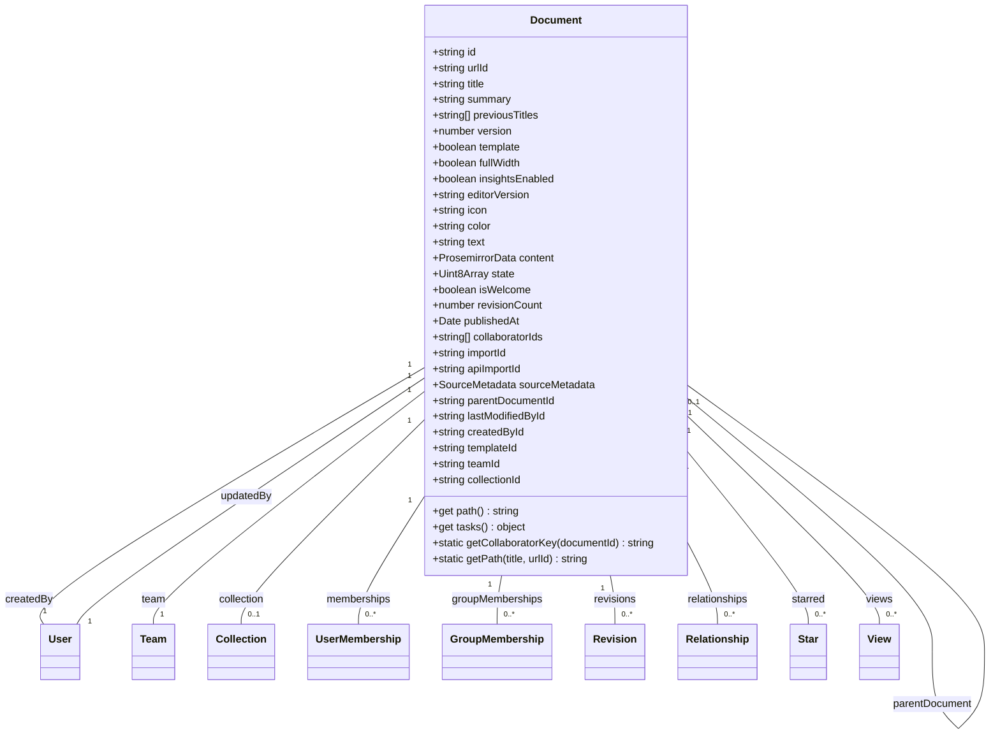
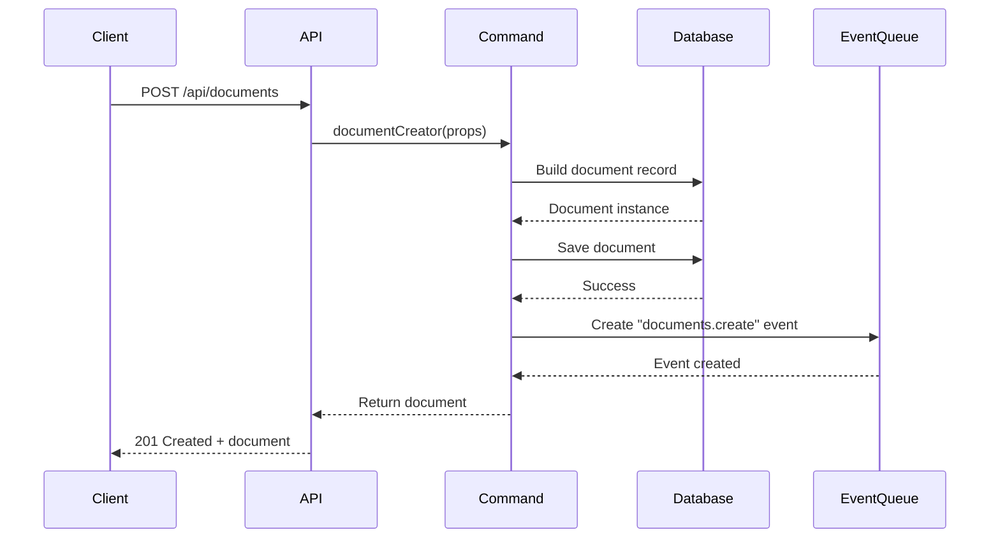
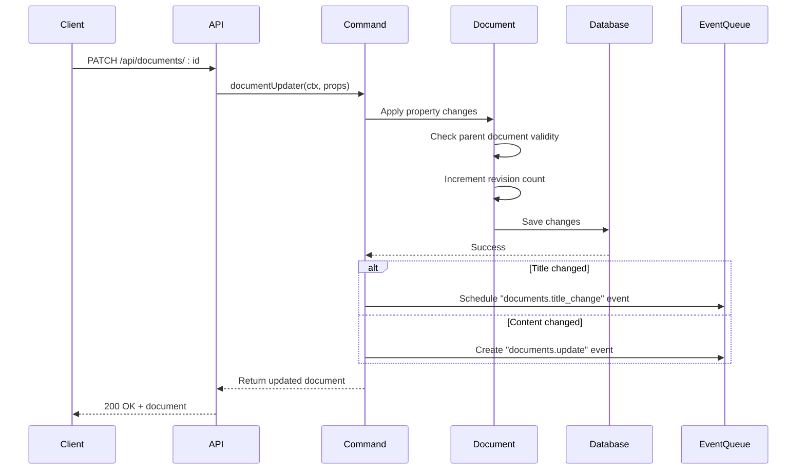
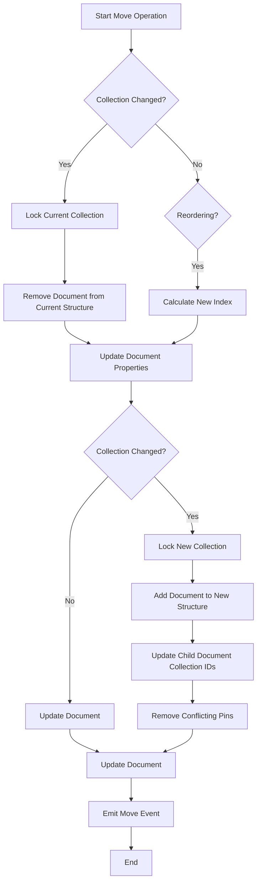
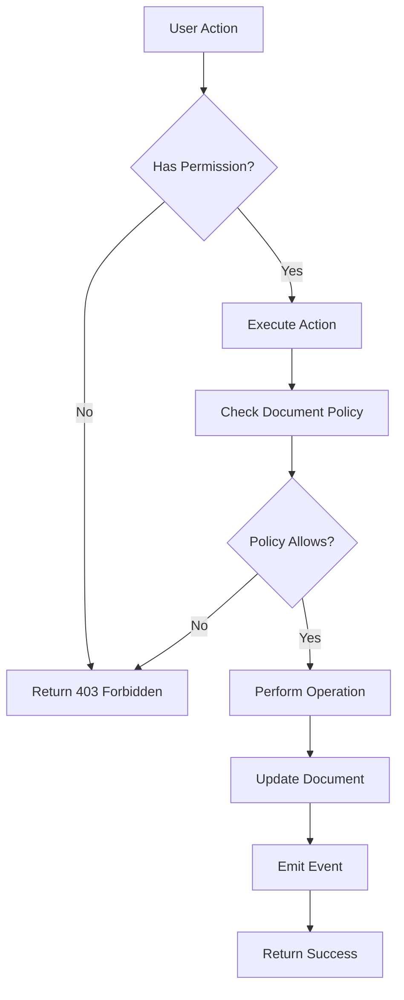

# Documents API

<cite>
**Referenced Files in This Document**   
- [Document.ts](file://server/models/Document.ts)
- [documentCreator.ts](file://server/commands/documentCreator.ts)
- [documentUpdater.ts](file://server/commands/documentUpdater.ts)
- [documentMover.ts](file://server/commands/documentMover.ts)
- [documentDuplicator.ts](file://server/commands/documentDuplicator.ts)
- [documentPermanentDeleter.ts](file://server/commands/documentPermanentDeleter.ts)
- [document.ts](file://server/policies/document.ts)
- [document.ts](file://shared/schema.ts)
- [document.ts](file://server/presenters/document.ts)
</cite>

## Table of Contents
1. [Introduction](#introduction)
2. [Document Model](#document-model)
3. [API Endpoints](#api-endpoints)
4. [Document Creation](#document-creation)
5. [Document Retrieval](#document-retrieval)
6. [Document Update](#document-update)
7. [Document Duplication](#document-duplication)
8. [Document Moving](#document-moving)
9. [Document Deletion](#document-deletion)
10. [Versioning and Revisions](#versioning-and-revisions)
11. [Relationships and Backlinks](#relationships-and-backlinks)
12. [Authorization and Policies](#authorization-and-policies)
13. [Command Pattern Implementation](#command-pattern-implementation)
14. [Content Storage Format](#content-storage-format)
15. [Troubleshooting](#troubleshooting)
16. [Examples](#examples)

## Introduction
The Documents API in the baozi application provides comprehensive functionality for managing documents within collections. This API supports all standard document operations including creation, retrieval, update, duplication, moving, and deletion. Documents are structured with hierarchical relationships through parent-child links and support rich content editing via Prosemirror. The system implements a robust versioning system through revisions and maintains relationships between documents for backlinking functionality. All operations are secured through a policy-based authorization system that enforces access controls at the document level.

**Section sources**
- [Document.ts](file://server/models/Document.ts#L1-L100)

## Document Model
The Document model represents the core entity in the baozi application, storing all document-related data and metadata. Each document has a unique identifier and URL ID for frontend routing. The model includes fields for title, content, icon, color, and various metadata including creation and modification timestamps. Documents can be organized hierarchically through the parentDocumentId relationship, allowing for nested document structures within collections.

The content is stored in Prosemirror JSON format in the content field, with a fallback text field containing Markdown representation. The collaborative editing state is stored in the state field as YJS binary data. Documents maintain revision history through the revisionCount field and track collaborators through the collaboratorIds array. Additional metadata includes template status, full-width display preference, and editor version information.



**Diagram sources**
- [Document.ts](file://server/models/Document.ts#L270-L643)

**Section sources**
- [Document.ts](file://server/models/Document.ts#L270-L643)

## API Endpoints
The Documents API exposes RESTful endpoints for all document operations. These endpoints follow standard HTTP methods and return JSON responses. The API is secured through authentication and authorization policies that verify user permissions for each operation. Endpoints are organized under the /api/documents path and support various query parameters for filtering and pagination.

| Endpoint | Method | Description |
|----------|--------|-------------|
| /api/documents | POST | Create a new document |
| /api/documents/:id | GET | Retrieve a document by ID |
| /api/documents/:id | PATCH | Update document properties |
| /api/documents/:id/duplicate | POST | Duplicate an existing document |
| /api/documents/:id/move | POST | Move a document to a different collection or parent |
| /api/documents/:id | DELETE | Delete a document (soft delete) |
| /api/documents/:id/permanent-delete | POST | Permanently delete a document |
| /api/documents/search | GET | Search for documents |

**Section sources**
- [Document.ts](file://server/models/Document.ts#L1-L50)

## Document Creation
Documents are created through the documentCreator command, which handles all aspects of document initialization. The creation process involves setting default values, generating unique identifiers, and establishing initial relationships. When creating a document from a template, the system applies template-specific logic including variable replacement and inheritance of template properties.

The creation process follows these steps:
1. Validate input parameters and permissions
2. Generate or assign document ID and URL ID
3. Set initial document properties including title, content, and metadata
4. Establish relationships with collection, parent document, and template
5. Save the document to the database
6. Emit creation event for analytics and notifications



**Diagram sources**
- [documentCreator.ts](file://server/commands/documentCreator.ts#L38-L195)
- [Document.ts](file://server/models/Document.ts#L488-L491)

**Section sources**
- [documentCreator.ts](file://server/commands/documentCreator.ts#L38-L195)
- [Document.ts](file://server/models/Document.ts#L488-L491)

## Document Retrieval
Document retrieval is handled through the Document model's findByPk method, which supports multiple ways of identifying documents. Documents can be retrieved by UUID, URL ID (extracted from URL slugs), or other identifiers. The retrieval process includes loading associated data such as the created and updated by users, collection membership, and view information.

The system implements several scopes to optimize data loading:
- **defaultScope**: Includes createdBy and updatedBy users, filters for published documents
- **withCollection**: Includes the associated collection
- **withViews**: Includes view information for a specific user
- **withMembership**: Includes user and group membership information for permission evaluation

When retrieving documents, the system automatically resolves URL IDs to document records and applies appropriate filtering based on user permissions and document status (published, draft, archived).

**Section sources**
- [Document.ts](file://server/models/Document.ts#L693-L767)

## Document Update
Document updates are processed through the documentUpdater command, which handles non-collaborative property changes. This command updates document metadata such as title, icon, color, and display settings. For collaborative text content updates, the documentCollaborativeUpdater command is used instead.

The update process includes:
1. Applying requested changes to document properties
2. Validating changes and checking for infinite loops in parent relationships
3. Updating the lastModifiedById and revisionCount fields
4. Saving changes to the database
5. Emitting update events for analytics and notifications

The system tracks title changes separately, maintaining a history of previous titles in the previousTitles array. This allows for better document history tracking and improved search functionality.



**Diagram sources**
- [documentUpdater.ts](file://server/commands/documentUpdater.ts#L44-L153)
- [Document.ts](file://server/models/Document.ts#L535-L558)

**Section sources**
- [documentUpdater.ts](file://server/commands/documentUpdater.ts#L44-L153)
- [Document.ts](file://server/models/Document.ts#L535-L558)

## Document Duplication
Document duplication is implemented through the documentDuplicator command, which creates copies of existing documents while preserving most content and metadata. The duplication process supports both shallow and recursive copying, allowing users to duplicate individual documents or entire document hierarchies.

When duplicating a document:
1. A new document is created using the documentCreator command
2. Content is copied from the original document with comment marks removed
3. Source metadata is updated to include the original document ID
4. The new document is associated with the same collection (if specified)
5. Child documents are recursively duplicated if requested

The system preserves the original document's structure, formatting, and embedded content while creating a distinct entity that can be independently modified. This functionality is commonly used for creating document templates or branching content variations.

**Section sources**
- [documentDuplicator.ts](file://server/commands/documentDuplicator.ts#L27-L109)
- [documentCreator.ts](file://server/commands/documentCreator.ts#L107-L130)

## Document Moving
Document moving is handled by the documentMover command, which manages changes to a document's location within the collection hierarchy. Moving a document involves updating its collectionId and/or parentDocumentId fields and adjusting the collection's document structure accordingly.

The move operation performs several critical functions:
1. Removes the document from its current collection structure
2. Updates the document's collectionId and parentDocumentId
3. Adds the document to the new collection structure at the specified position
4. Updates all child documents to reflect the new collection ID
5. Removes any collection-specific pins that would create confusing states

The system prevents infinite loops by validating that a document is not moved into one of its own descendants. When moving documents between collections, the operation is performed within a database transaction to ensure data consistency.



**Diagram sources**
- [documentMover.ts](file://server/commands/documentMover.ts#L29-L242)
- [Document.ts](file://server/models/Document.ts#L428-L460)

**Section sources**
- [documentMover.ts](file://server/commands/documentMover.ts#L29-L242)
- [Document.ts](file://server/models/Document.ts#L428-L460)

## Document Deletion
Document deletion in the baozi application follows a two-step process: soft deletion followed by permanent deletion. When a document is deleted, it is marked with a deletedAt timestamp but remains in the database for recovery purposes. After a retention period, documents can be permanently deleted through a separate operation.

The soft deletion process:
1. Sets the deletedAt field to the current timestamp
2. Removes the document from the collection structure
3. Updates associated data like pins and subscriptions
4. Emits a delete event for analytics

Permanent deletion is handled by the documentPermanentDeleter command, which:
1. Validates that the document has already been soft-deleted
2. Identifies and processes associated attachments
3. Checks for references to attachments in other documents
4. Schedules orphaned attachments for deletion
5. Removes the document record from the database

This approach ensures data integrity and provides a recovery window for accidental deletions.

**Section sources**
- [documentPermanentDeleter.ts](file://server/commands/documentPermanentDeleter.ts#L10-L99)
- [Document.ts](file://server/models/Document.ts#L79-L85)

## Versioning and Revisions
The baozi application implements a comprehensive versioning system through document revisions. Each time a document is updated, its revisionCount is incremented, providing a sequential version number. The system automatically creates revision records that capture the document's state at specific points in time.

Key aspects of the versioning system:
- **Revision Count**: A monotonically increasing counter that serves as the document version
- **Revision Records**: Full snapshots of document content, title, and metadata at specific points
- **Automatic Creation**: Revisions are created for significant edits and explicit save operations
- **Restoration**: Documents can be restored to any previous revision

The revision system integrates with the collaborative editing functionality, ensuring that version history accurately reflects the evolution of document content. Users can browse revision history and compare changes between versions.

**Section sources**
- [Document.ts](file://server/models/Document.ts#L365-L368)
- [documentUpdater.ts](file://server/commands/documentUpdater.ts#L98-L100)

## Relationships and Backlinks
Documents maintain relationships with other documents through the Relationship model, enabling backlink functionality. When a document references another document (e.g., through a link or mention), a relationship record is created to track this connection. This allows the system to display backlinks showing which documents link to the current document.

The relationship system supports:
- **Bidirectional linking**: Both forward links and backlinks are tracked
- **Automatic discovery**: Links in document content are parsed to create relationships
- **Hierarchical relationships**: Parent-child document relationships are maintained separately
- **Cross-collection linking**: Documents can link to documents in other collections

Backlinks are displayed in the document interface, helping users navigate related content and understand the document's context within the knowledge base.

**Section sources**
- [Document.ts](file://server/models/Document.ts#L635-L636)
- [Relationship.ts](file://server/models/Relationship.ts#L1-L50)

## Authorization and Policies
Document operations are protected by a comprehensive policy system implemented in the document.ts policy file. The policy system uses a cancan-style authorization framework to determine whether users can perform specific actions on documents.

Key permissions include:
- **read**: View document content
- **update**: Modify document properties and content
- **createDocument**: Create new documents in a collection
- **duplicate**: Copy an existing document
- **move**: Change a document's location
- **delete**: Remove a document (soft delete)
- **permanentDelete**: Permanently remove a document
- **archive**: Archive a document
- **publish/unpublish**: Control document publication status

Permissions are evaluated based on:
- Document membership (direct or through groups)
- Collection permissions
- Document status (template, draft, archived)
- User role within the team
- Specific document policies

The system implements fine-grained access control, allowing different levels of access for team members, viewers, and guests.



**Diagram sources**
- [document.ts](file://server/policies/document.ts#L8-L332)
- [cancan.ts](file://server/policies/cancan.ts#L1-L50)

**Section sources**
- [document.ts](file://server/policies/document.ts#L8-L332)

## Command Pattern Implementation
The document operations in the baozi application follow the command pattern, with dedicated command classes for each major operation. This pattern provides several benefits:
- **Separation of concerns**: Business logic is separated from API controllers
- **Reusability**: Commands can be called from multiple entry points (API, queues, etc.)
- **Testability**: Commands can be unit tested in isolation
- **Consistency**: Standardized input and output interfaces

The key command implementations include:
- **documentCreator**: Handles document creation
- **documentUpdater**: Handles document property updates
- **documentCollaborativeUpdater**: Handles collaborative content updates
- **documentMover**: Handles document relocation
- **documentDuplicator**: Handles document duplication
- **documentPermanentDeleter**: Handles permanent document deletion

Each command follows a consistent pattern: accept parameters and context, perform validation, execute the operation, and return the result. Commands operate within database transactions to ensure data consistency and emit events for analytics and notifications.

**Section sources**
- [documentCreator.ts](file://server/commands/documentCreator.ts#L38-L195)
- [documentUpdater.ts](file://server/commands/documentUpdater.ts#L44-L153)
- [documentMover.ts](file://server/commands/documentMover.ts#L29-L242)

## Content Storage Format
Document content is stored using Prosemirror JSON format in the content field. Prosemirror is a flexible and powerful rich text editor framework that supports structured document content with rich formatting, embedded content, and custom node types.

Key aspects of the content storage format:
- **Prosemirror JSON**: The primary content format, stored in the content field
- **Markdown fallback**: A lossy Markdown representation stored in the text field
- **YJS collaborative state**: Operational transformation state stored in the state field
- **Schema consistency**: Content adheres to a defined Prosemirror schema

The system uses Zod validation schemas to validate document payloads before storage. The shared/schema.ts file defines the validation rules for document content, ensuring data integrity and consistency across the application.

**Section sources**
- [document.ts](file://shared/schema.ts#L1-L73)
- [Document.ts](file://server/models/Document.ts#L344-L356)

## Troubleshooting
Common issues and their solutions:

### Version Conflicts
When multiple users edit a document simultaneously, version conflicts can occur. The system resolves these through operational transformation in the collaborative editing layer. If conflicts cannot be automatically resolved, users are prompted to refresh and retry their changes.

### Invalid Document Moves
Attempts to create infinite loops (moving a document into its own subtree) are prevented by the checkParentDocument hook. The system validates parent relationships before saving changes and throws a validation error if an infinite loop is detected.

### Content Corruption
Content corruption can occur if the Prosemirror JSON becomes invalid. The system includes validation checks and fallback mechanisms:
- Content is validated against the Prosemirror schema
- The text field provides a fallback Markdown representation
- Revision history allows restoration to a previous valid state

### Performance Issues
Large documents with extensive revision history can impact performance. The system implements several optimizations:
- Lazy loading of revisions
- Efficient database queries with appropriate indexing
- Caching of frequently accessed documents
- Background processing for intensive operations

**Section sources**
- [Document.ts](file://server/models/Document.ts#L535-L558)
- [documentMover.ts](file://server/commands/documentMover.ts#L537-L557)

## Examples
### Creating a Document in a Collection
```json
POST /api/documents
{
  "title": "Project Plan",
  "content": {
    "type": "doc",
    "content": [
      {
        "type": "paragraph",
        "content": [
          {
            "type": "text",
            "text": "This is the project plan."
          }
        ]
      }
    ]
  },
  "collectionId": "coll-123",
  "publish": true
}
```

### Updating Document Title and Content
```json
PATCH /api/documents/doc-456
{
  "title": "Updated Project Plan",
  "text": "This is the updated project plan with new milestones."
}
```

### Managing Document Hierarchy
```json
POST /api/documents/doc-456/move
{
  "collectionId": "coll-789",
  "parentDocumentId": "doc-001",
  "index": 2
}
```

**Section sources**
- [documentCreator.ts](file://server/commands/documentCreator.ts#L91-L98)
- [documentUpdater.ts](file://server/commands/documentUpdater.ts#L67-L69)
- [documentMover.ts](file://server/commands/documentMover.ts#L30-L35)