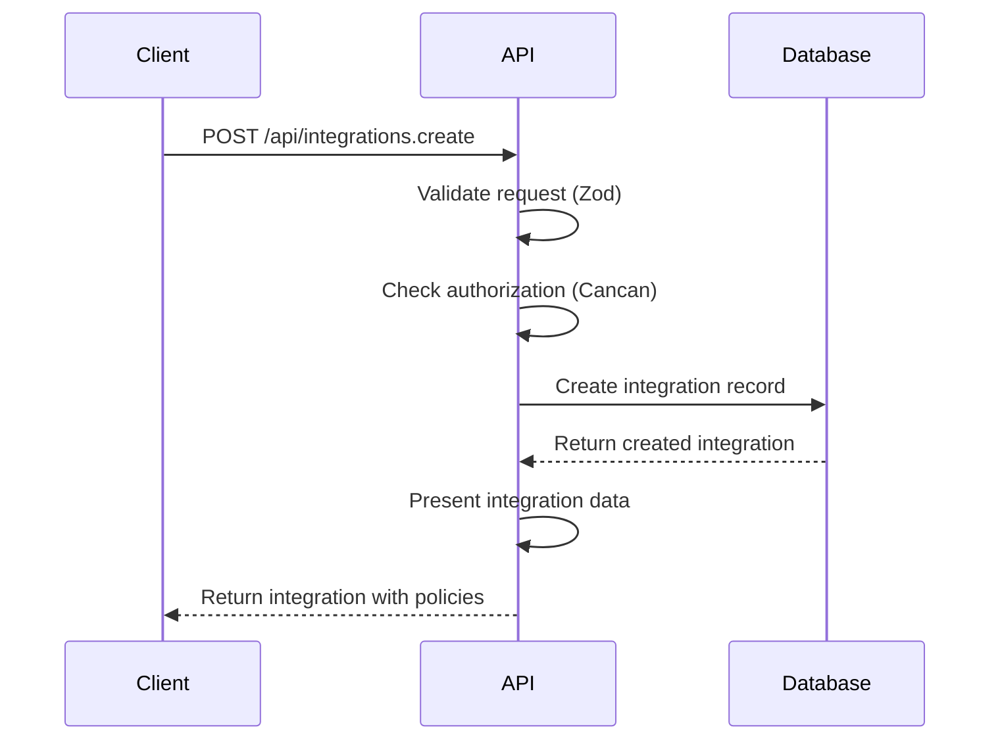
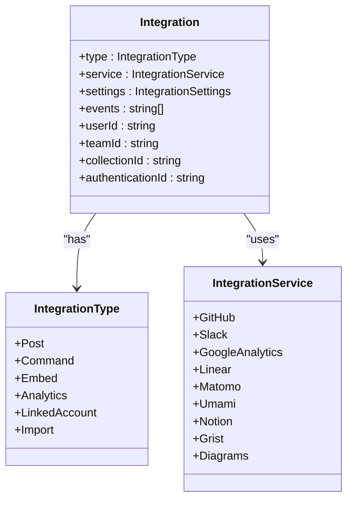
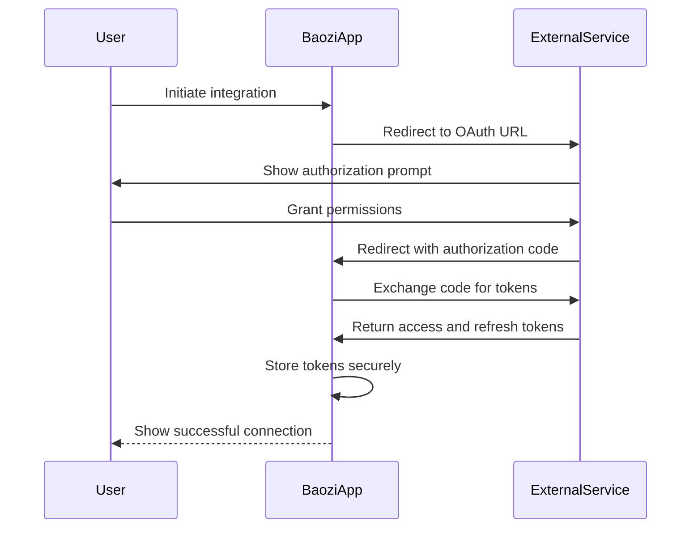
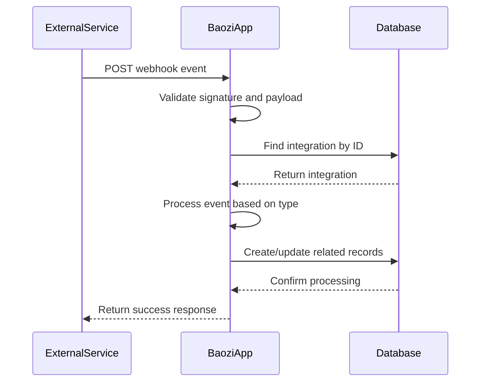
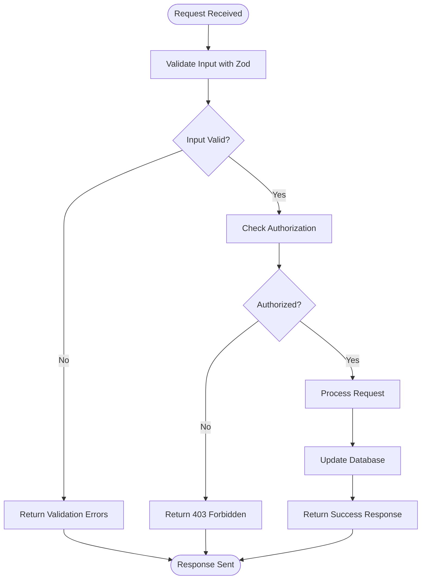
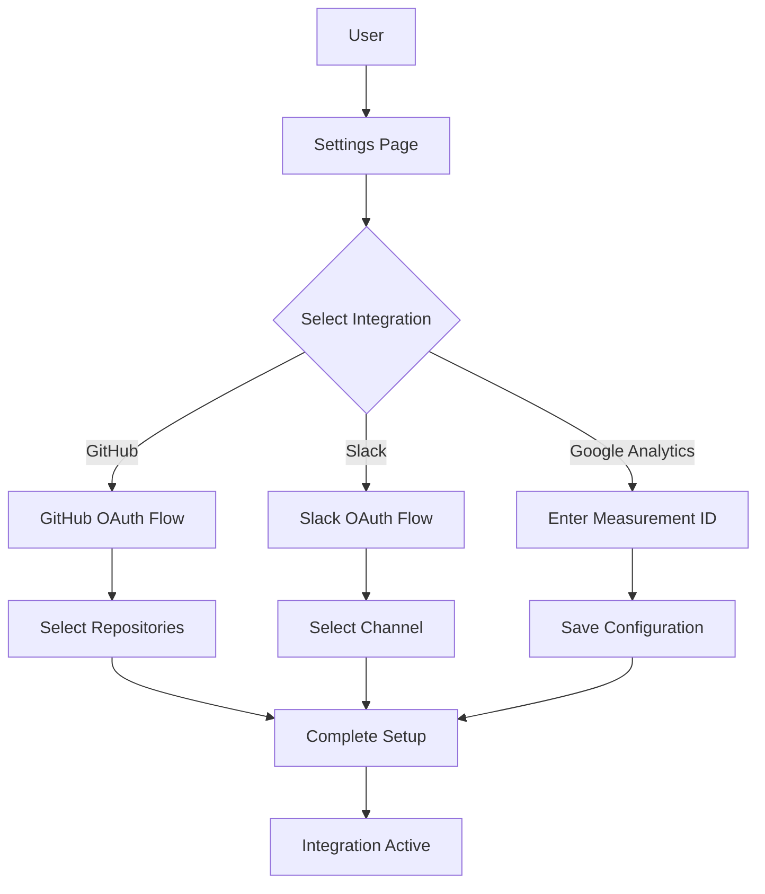
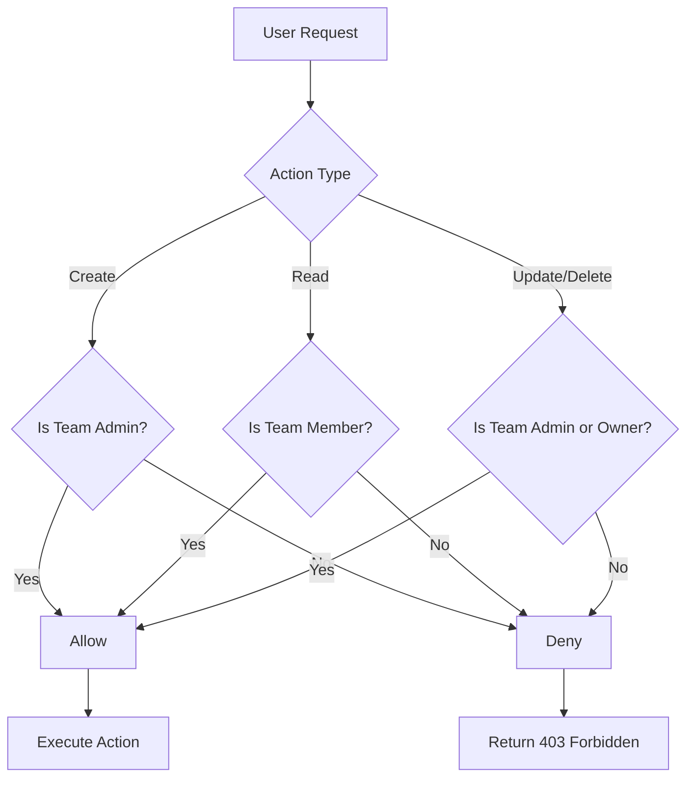
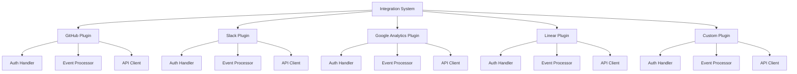
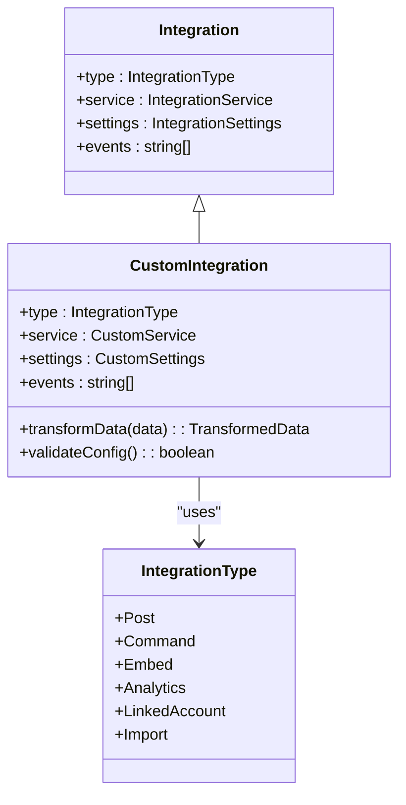
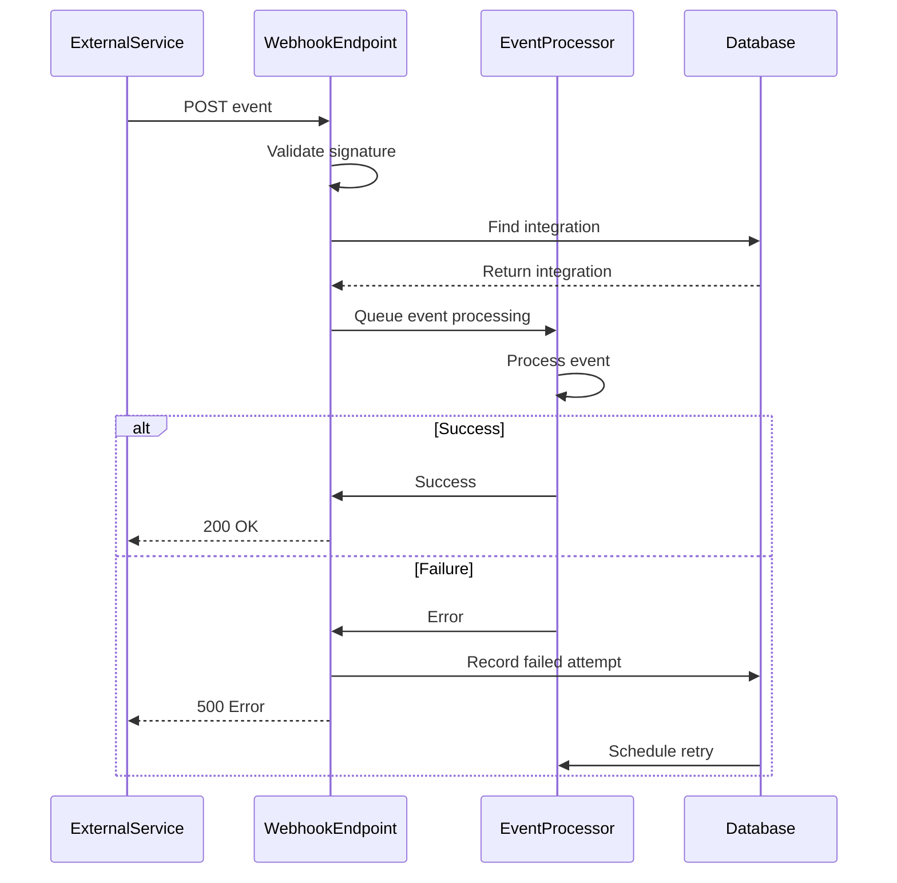

# Integrations API

<cite>
**Referenced Files in This Document**   
- [Integration.ts](file://server/models/Integration.ts)
- [IntegrationAuthentication.ts](file://server/models/IntegrationAuthentication.ts)
- [integrations.ts](file://server/routes/api/integrations/integrations.ts)
- [schema.ts](file://server/routes/api/integrations/schema.ts)
- [integration.ts](file://server/policies/integration.ts)
- [types.ts](file://shared/types.ts)
</cite>

## Table of Contents
1. [Introduction](#introduction)
2. [Integration Management Operations](#integration-management-operations)
3. [Supported Integration Types](#supported-integration-types)
4. [OAuth Flow Handling](#oauth-flow-handling)
5. [Webhook Configuration](#webhook-configuration)
6. [Zod Validation Rules](#zod-validation-rules)
7. [Credential Storage](#credential-storage)
8. [Example Integrations](#example-integrations)
9. [Policy Enforcement](#policy-enforcement)
10. [Plugin System Integration](#plugin-system-integration)
11. [Extension Points](#extension-points)
12. [Webhook Delivery Mechanism](#webhook-delivery-mechanism)
13. [Troubleshooting Guide](#troubleshooting-guide)

## Introduction
The Integrations API in the baozi application provides a comprehensive interface for managing third-party service integrations. This API enables users to create, configure, authenticate, and delete integrations with various external services including GitHub, Slack, Google, Linear, and others. The system supports multiple integration types such as analytics, notifications, issue tracking, and document embedding, with robust OAuth flow handling and secure credential storage.

The integration system is built on a modular architecture that supports both workspace-wide integrations and user-specific linked accounts. Each integration is associated with specific events and configured with service-specific settings. The API follows RESTful principles with clear endpoints for integration management operations, and implements comprehensive policy enforcement to ensure proper authorization.

**Section sources**
- [Integration.ts](file://server/models/Integration.ts#L1-L109)
- [types.ts](file://shared/types.ts#L107-L132)

## Integration Management Operations

The Integrations API provides standard CRUD operations for managing integrations through well-defined endpoints. These operations support creation, retrieval, updating, and deletion of integration configurations.

### List Integrations
Retrieves a paginated list of integrations with filtering and sorting capabilities.

**HTTP Method**: POST  
**URL Pattern**: `/api/integrations.list`  
**Request Schema**: `IntegrationsListSchema`  
**Response**: Paginated list of integrations with policies

### Create Integration
Creates a new integration with specified type, service, and configuration settings.

**HTTP Method**: POST  
**URL Pattern**: `/api/integrations.create`  
**HTTP Method**: POST  
**URL Pattern**: `/api/integrations.create`  
**Request Schema**: `IntegrationsCreateSchema`  
**Response**: Created integration object with policies  
**Authorization**: Requires admin role

### Get Integration Info
Retrieves detailed information about a specific integration.

**HTTP Method**: POST  
**URL Pattern**: `/api/integrations.info`  
**Request Schema**: `IntegrationsInfoSchema`  
**Response**: Integration details with policies

### Update Integration
Modifies an existing integration's configuration and event subscriptions.

**HTTP Method**: POST  
**URL Pattern**: `/api/integrations.update`  
**Request Schema**: `IntegrationsUpdateSchema`  
**Response**: Updated integration object with policies  
**Authorization**: Requires admin role

### Delete Integration
Removes an integration configuration from the system.

**HTTP Method**: POST  
**URL Pattern**: `/api/integrations.delete`  
**Request Schema**: `IntegrationsDeleteSchema`  
**Response**: Success confirmation



**Diagram sources**
- [integrations.ts](file://server/routes/api/integrations/integrations.ts#L68-L91)
- [schema.ts](file://server/routes/api/integrations/schema.ts#L36-L63)

**Section sources**
- [integrations.ts](file://server/routes/api/integrations/integrations.ts#L16-L172)
- [schema.ts](file://server/routes/api/integrations/schema.ts#L10-L116)

## Supported Integration Types

The baozi application supports multiple integration types, each serving a specific purpose in the workflow. These types are defined in the `IntegrationType` enum and determine the integration's behavior and capabilities.

### Integration Types
- **Post**: Sends updates to external systems (e.g., Slack notifications)
- **Command**: Listens for commands from external systems
- **Embed**: Embeds content from external systems into documents
- **Analytics**: Captures analytics data from external services
- **LinkedAccount**: Maps an Outline user to an external service
- **Import**: Imports documents from external systems into Outline

### Supported Services
- **GitHub**: Issue tracking and code repository integration
- **Slack**: Team communication and notifications
- **Google Analytics**: Web analytics tracking
- **Linear**: Issue tracking and project management
- **Matomo**: Open-source web analytics
- **Umami**: Simple website analytics
- **Notion**: Document import and synchronization
- **Grist**: Data collaboration and spreadsheets
- **Diagrams**: Diagram embedding



**Diagram sources**
- [types.ts](file://shared/types.ts#L107-L132)
- [Integration.ts](file://server/models/Integration.ts#L43-L49)

**Section sources**
- [types.ts](file://shared/types.ts#L107-L132)
- [Integration.ts](file://server/models/Integration.ts#L1-L109)

## OAuth Flow Handling

The baozi application implements a secure OAuth flow for authenticating integrations with external services. The system handles token acquisition, refresh, and storage with robust error handling and security measures.

### Authentication Process
1. User initiates integration connection
2. Application redirects to service OAuth authorization endpoint
3. User grants permissions to the application
4. Service redirects back with authorization code
5. Application exchanges code for access and refresh tokens
6. Tokens are securely stored and associated with the integration

### Token Management
The system implements automatic token refresh functionality to maintain active connections. When a token is nearing expiration, the system uses the refresh token to obtain a new access token without requiring user intervention.



**Diagram sources**
- [IntegrationAuthentication.ts](file://server/models/IntegrationAuthentication.ts#L96-L160)
- [integrations.ts](file://server/routes/api/integrations/integrations.ts#L77-L85)

**Section sources**
- [IntegrationAuthentication.ts](file://server/models/IntegrationAuthentication.ts#L1-L165)
- [integrations.ts](file://server/routes/api/integrations/integrations.ts#L77-L85)

## Webhook Configuration

The webhook system enables external services to send events to the baozi application, triggering actions based on external events. Webhooks are configured as part of integration settings and can be customized for specific use cases.

### Webhook Setup
Webhooks are configured during integration creation or update. Each integration can specify the events it should listen for and the target collection where actions should be applied.

### Event Delivery
When an external event occurs, the service sends a POST request to the baozi application's webhook endpoint. The application validates the request, processes the event, and triggers the appropriate actions based on the integration configuration.



**Diagram sources**
- [integrations.ts](file://server/routes/api/integrations/integrations.ts#L130-L134)
- [Integration.ts](file://server/models/Integration.ts#L54-L55)

**Section sources**
- [integrations.ts](file://server/routes/api/integrations/integrations.ts#L130-L134)
- [Integration.ts](file://server/models/Integration.ts#L54-L55)

## Zod Validation Rules

The Integrations API uses Zod for request validation, ensuring that all integration configurations adhere to defined schemas. Validation rules are defined for each integration operation and cover all required fields and data types.

### Schema Definitions
Validation schemas are defined in the `schema.ts` file and include specific rules for each integration type and service. The schemas enforce data integrity and prevent invalid configurations.

### Request Validation
All API endpoints validate incoming requests against their respective schemas. Validation occurs before authorization checks and database operations, providing early feedback on malformed requests.



**Diagram sources**
- [schema.ts](file://server/routes/api/integrations/schema.ts#L10-L116)
- [integrations.ts](file://server/routes/api/integrations/integrations.ts#L20-L21)

**Section sources**
- [schema.ts](file://server/routes/api/integrations/schema.ts#L10-L116)
- [integrations.ts](file://server/routes/api/integrations/integrations.ts#L20-L21)

## Credential Storage

The baozi application implements secure credential storage for integration authentication tokens. All sensitive data is encrypted at rest and protected with additional security measures.

### Encryption
Authentication tokens and refresh tokens are stored in the database as encrypted BLOBs using the `@Encrypted` decorator. This ensures that sensitive credentials cannot be accessed even with direct database access.

### Token Refresh
The system automatically handles token refresh when access tokens are nearing expiration. The refresh process uses row-level locking to prevent race conditions and ensure thread safety.

```mermaid
classDiagram
class IntegrationAuthentication {
+service : IntegrationService
+scopes : string[]
+token : string
+refreshToken : string
+expiresAt : Date
+userId : string
+teamId : string
+isExpiringSoon(thresholdMs) : boolean
+refreshTokenIfNeeded(refreshCallback, thresholdMs) : Promise~string~
}
class Integration {
+type : IntegrationType
+service : IntegrationService
+settings : IntegrationSettings
+events : string[]
+authenticationId : string
}
Integration --> IntegrationAuthentication : "has"
IntegrationAuthentication --> "Encrypted" : "token, refreshToken"
```

**Diagram sources**
- [IntegrationAuthentication.ts](file://server/models/IntegrationAuthentication.ts#L39-L51)
- [Integration.ts](file://server/models/Integration.ts#L83-L88)

**Section sources**
- [IntegrationAuthentication.ts](file://server/models/IntegrationAuthentication.ts#L1-L165)
- [Integration.ts](file://server/models/Integration.ts#L1-L109)

## Example Integrations

This section provides practical examples of configuring common integrations in the baozi application.

### GitHub Issue Tracking
Setting up GitHub integration for issue tracking involves connecting your GitHub account and configuring which repositories to monitor.

**Configuration Steps**:
1. Navigate to Settings > Integrations
2. Click "Connect" on the GitHub integration card
3. Authorize the application with GitHub
4. Select repositories to monitor for issues
5. Configure which events trigger notifications

### Slack Notifications
Configuring Slack notifications allows teams to receive updates about document changes and other events in designated channels.

**Configuration Steps**:
1. Navigate to Settings > Integrations
2. Click "Connect" on the Slack integration card
3. Authorize the application with Slack
4. Select the channel for notifications
5. Choose which events to send (document updates, publishes, etc.)

### Google Analytics
Enabling Google Analytics integration allows tracking of document views and user engagement.

**Configuration Steps**:
1. Navigate to Settings > Integrations
2. Click "Connect" on the Google Analytics integration card
3. Enter your Measurement ID
4. Optionally specify a custom instance URL
5. Save configuration



**Diagram sources**
- [integrations.ts](file://server/routes/api/integrations/integrations.ts#L77-L85)
- [schema.ts](file://server/routes/api/integrations/schema.ts#L45-L61)

**Section sources**
- [integrations.ts](file://server/routes/api/integrations/integrations.ts#L77-L85)
- [schema.ts](file://server/routes/api/integrations/schema.ts#L45-L61)

## Policy Enforcement

The integration system implements comprehensive policy enforcement through the cancan authorization framework. Policies define who can perform various actions on integrations based on user roles and ownership.

### Authorization Rules
- **Create Integration**: Team admins can create workspace-wide integrations
- **Read Integration**: All team members can view integrations
- **Update/Delete Integration**: Team admins and integration owners (for linked accounts) can modify or remove integrations

### Role-Based Access
Access control is enforced based on user roles (Admin, Member, Viewer, Guest) and specific integration types. The policy system ensures that only authorized users can manage integrations.



**Diagram sources**
- [integration.ts](file://server/policies/integration.ts#L13-L31)
- [integrations.ts](file://server/routes/api/integrations/integrations.ts#L77-L78)

**Section sources**
- [integration.ts](file://server/policies/integration.ts#L1-L32)
- [integrations.ts](file://server/routes/api/integrations/integrations.ts#L77-L78)

## Plugin System Integration

The baozi application's integration system is built on a modular plugin architecture that allows for extensibility and customization. Each supported service has a dedicated plugin that handles service-specific logic.

### Plugin Structure
Plugins are organized in the `plugins/` directory and follow a consistent structure:
- **client/**: Frontend components and UI
- **server/**: Backend logic and API handlers
- **shared/**: Shared types and utilities
- **plugin.json**: Plugin metadata and configuration

### Service-Specific Handlers
Each plugin implements service-specific handlers for authentication, event processing, and API communication. The core integration system provides a common interface that plugins extend.



**Diagram sources**
- [plugins/](file://plugins/)
- [Integration.ts](file://server/models/Integration.ts#L1-L109)

**Section sources**
- [plugins/](file://plugins/)
- [Integration.ts](file://server/models/Integration.ts#L1-L109)

## Extension Points

The integration system provides several extension points for custom integrations and enhanced functionality.

### Custom Integration Development
Developers can create custom integrations by implementing the integration interface and registering their service. The system supports both OAuth-based and API-key based authentication methods.

### Event Subscription
Integrations can subscribe to various application events such as document updates, publishes, comments, and user actions. The event system allows for fine-grained control over which events trigger integration actions.

### Data Transformation
Custom integrations can implement data transformation logic to adapt payloads between the baozi application and external services. This allows for custom formatting and enrichment of data.



**Diagram sources**
- [Integration.ts](file://server/models/Integration.ts#L1-L109)
- [types.ts](file://shared/types.ts#L187-L228)

**Section sources**
- [Integration.ts](file://server/models/Integration.ts#L1-L109)
- [types.ts](file://shared/types.ts#L187-L228)

## Webhook Delivery Mechanism

The webhook delivery system ensures reliable event delivery from external services to the baozi application. The mechanism includes retry logic, error handling, and delivery tracking.

### Delivery Process
1. External service sends event to webhook endpoint
2. Application validates request signature and payload
3. Integration is identified from the request
4. Event is processed according to integration configuration
5. Response is sent to acknowledge receipt

### Retry Logic
Failed deliveries are automatically retried with exponential backoff. The system tracks delivery attempts and provides visibility into delivery status.



**Diagram sources**
- [integrations.ts](file://server/routes/api/integrations/integrations.ts#L94-L111)
- [Integration.ts](file://server/models/Integration.ts#L54-L55)

**Section sources**
- [integrations.ts](file://server/routes/api/integrations/integrations.ts#L94-L111)
- [Integration.ts](file://server/models/Integration.ts#L54-L55)

## Troubleshooting Guide

This section provides guidance for resolving common issues with integrations.

### Authentication Failures
**Symptoms**: Integration shows as disconnected or fails to authenticate.

**Solutions**:
1. Reconnect the integration through the settings page
2. Check that the external service account is still active
3. Verify that required permissions are granted
4. Clear browser cache and cookies
5. Check for service outages on the external provider

### Event Delivery Issues
**Symptoms**: Events are not being received or processed.

**Solutions**:
1. Verify webhook URLs are correctly configured in the external service
2. Check integration event subscriptions
3. Review server logs for delivery errors
4. Test webhook delivery with sample payloads
5. Ensure the integration is not rate limited

### Rate Limiting Problems
**Symptoms**: API calls are failing with 429 status codes.

**Solutions**:
1. Implement exponential backoff in client code
2. Cache responses when possible
3. Batch multiple requests
4. Monitor API usage and adjust accordingly
5. Contact service provider for higher rate limits

**Section sources**
- [integrations.ts](file://server/routes/api/integrations/integrations.ts#L147-L169)
- [IntegrationAuthentication.ts](file://server/models/IntegrationAuthentication.ts#L156-L159)