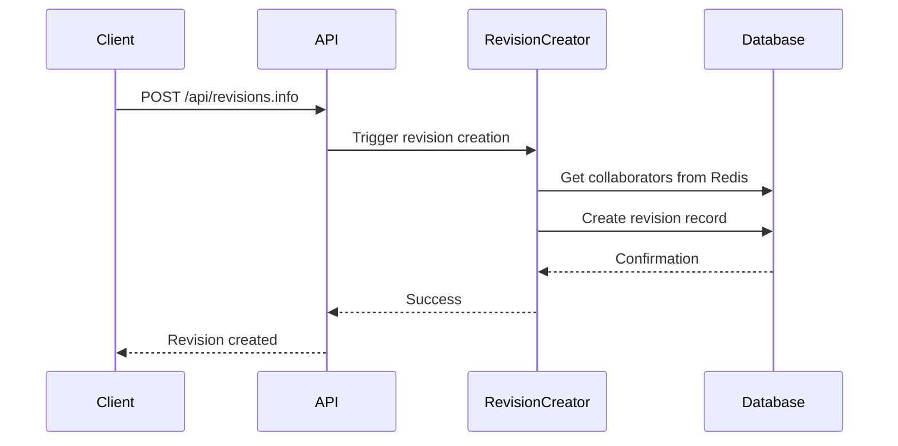
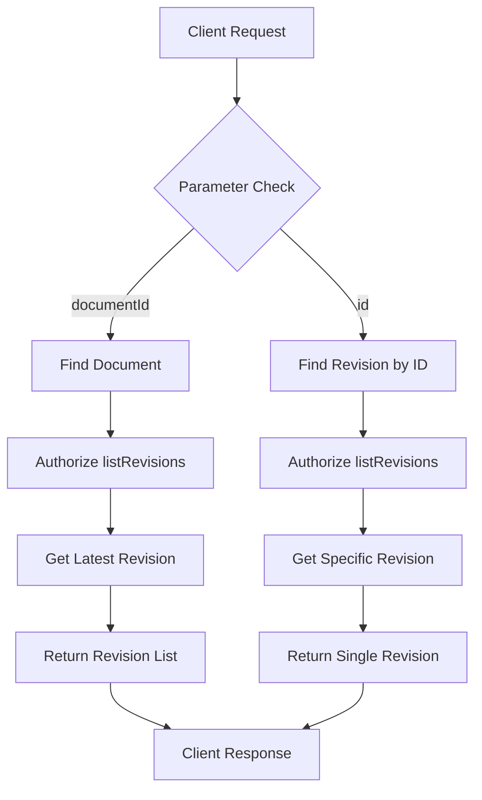
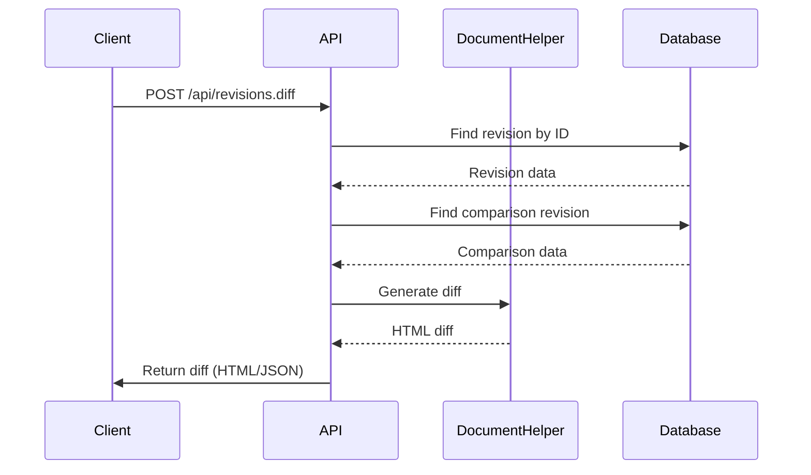
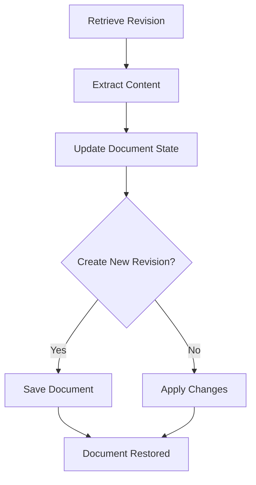
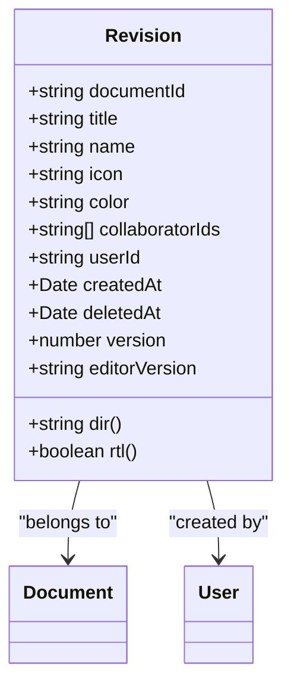
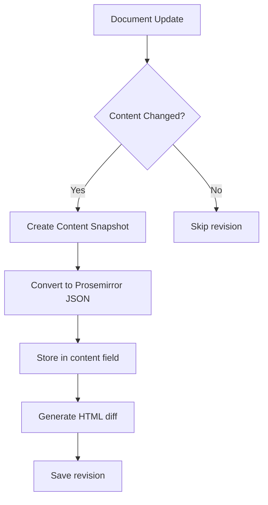
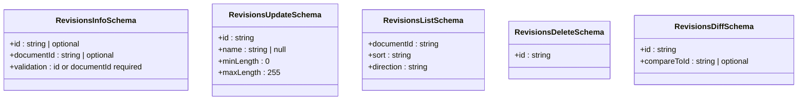
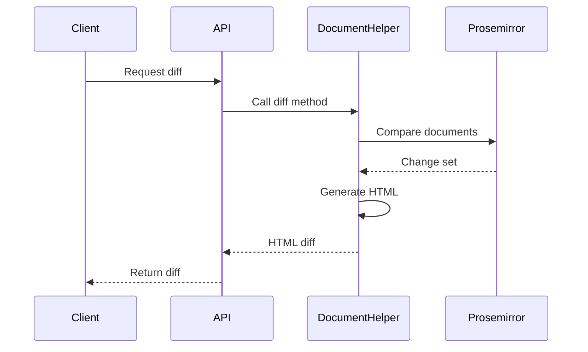
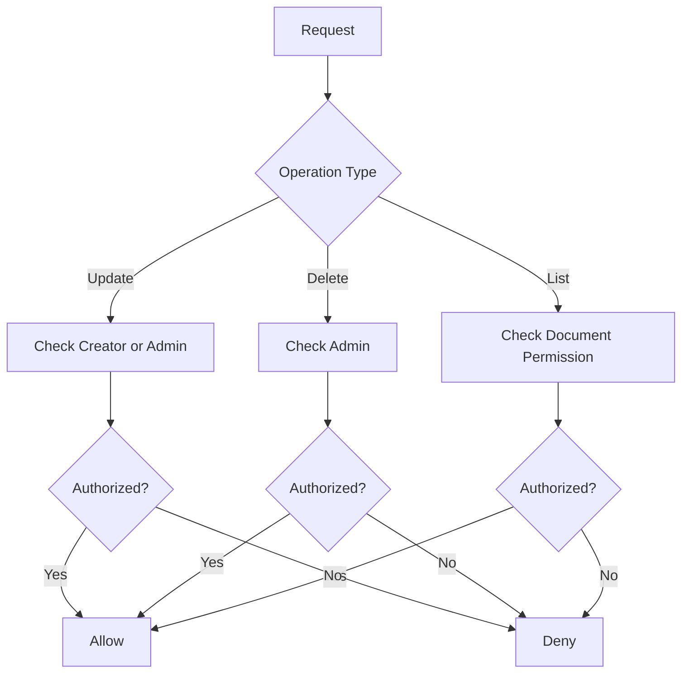
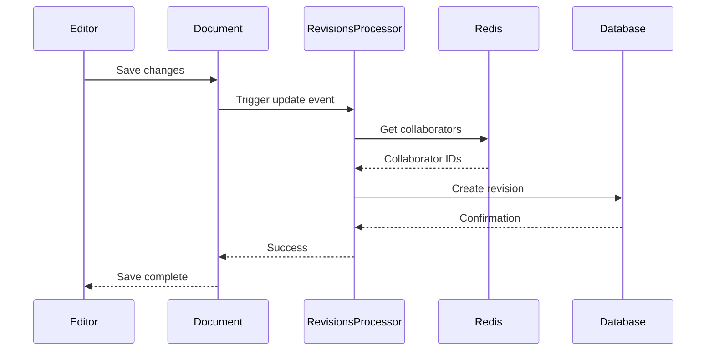

# Revisions API

<cite>
**Referenced Files in This Document**   
- [revisionCreator.ts](file://server/commands/revisionCreator.ts)
- [Revision.ts](file://server/models/Revision.ts)
- [revision.ts](file://server/policies/revision.ts)
- [revisions.ts](file://server/routes/api/revisions/revisions.ts)
- [schema.ts](file://server/routes/api/revisions/schema.ts)
- [revision.ts](file://server/presenters/revision.ts)
</cite>

## Table of Contents
1. [Introduction](#introduction)
2. [Revision Creation](#revision-creation)
3. [Revision Retrieval](#revision-retrieval)
4. [Revision Comparison](#revision-comparison)
5. [Revision Restoration](#revision-restoration)
6. [Revision Metadata](#revision-metadata)
7. [Content Snapshot Mechanism](#content-snapshot-mechanism)
8. [Zod Validation Rules](#zod-validation-rules)
9. [Diff Generation Process](#diff-generation-process)
10. [Authorization Logic](#authorization-logic)
11. [Integration with Document Editing](#integration-with-document-editing)
12. [Troubleshooting](#troubleshooting)

## Introduction
The Revisions API in the baozi application provides comprehensive version history management for documents. This API enables users to create, retrieve, compare, and restore document revisions, maintaining a complete audit trail of content changes. The system automatically generates revisions during document updates and supports manual revision creation for significant milestones. Each revision captures a complete snapshot of the document state, including content, metadata, and authorship information.

**Section sources**
- [revisions.ts](file://server/routes/api/revisions/revisions.ts#L1-L224)

## Revision Creation
Revisions are created through the `revisions.info` endpoint when retrieving the latest revision of a document, or automatically during document updates. The system uses the `revisionCreator` command to generate new revisions, which captures the current document state including title, content, icon, color, and authorship information.

The creation process involves:
1. Retrieving collaborator IDs from Redis since the last revision
2. Building a revision from the current document state
3. Saving the revision to the database within a transaction

Automatic revision generation occurs during document updates, publishing, or when explicitly requested through the API.



**Diagram sources**
- [revisionCreator.ts](file://server/commands/revisionCreator.ts#L6-L32)
- [revisions.ts](file://server/routes/api/revisions/revisions.ts#L21-L66)

**Section sources**
- [revisionCreator.ts](file://server/commands/revisionCreator.ts#L6-L32)
- [Revision.ts](file://server/models/Revision.ts#L193-L213)

## Revision Retrieval
The Revisions API provides endpoints for retrieving revision histories and specific revision details. The `revisions.list` endpoint returns paginated revision histories for a document, while `revisions.info` retrieves specific revision details.

### Endpoints
- **GET /api/revisions.list**: Retrieve paginated revision history
  - Method: POST
  - Parameters: `documentId`, `sort`, `direction`, pagination
  - Response: Paginated list of revisions with policies

- **GET /api/revisions.info**: Retrieve specific revision
  - Method: POST
  - Parameters: `id` or `documentId`
  - Response: Single revision with diff from previous version

The retrieval process includes authorization checks to ensure users have permission to view revision histories. Results are presented with policy information for client-side permission handling.



**Diagram sources**
- [revisions.ts](file://server/routes/api/revisions/revisions.ts#L187-L221)
- [revisions.ts](file://server/routes/api/revisions/revisions.ts#L21-L66)

**Section sources**
- [revisions.ts](file://server/routes/api/revisions/revisions.ts#L187-L221)
- [schema.ts](file://server/routes/api/revisions/schema.ts#L43-L59)

## Revision Comparison
The API provides robust revision comparison capabilities through the `revisions.diff` endpoint. This endpoint generates visual diffs between revisions, highlighting changes in content and formatting.

### Comparison Process
1. Retrieve the target revision by ID
2. Determine the comparison revision (either specified or previous)
3. Generate HTML diff using DocumentHelper
4. Return diff content with appropriate headers

The comparison supports both API responses and direct HTML downloads, with content disposition headers for file downloads.

### Endpoint
- **POST /api/revisions.diff**
  - Parameters: `id` (target revision), `compareToId` (optional comparison revision)
  - Response: HTML diff or JSON response based on Accept header
  - Content-Type: text/html for downloads, application/json for API



**Diagram sources**
- [revisions.ts](file://server/routes/api/revisions/revisions.ts#L128-L185)
- [revision.ts](file://server/presenters/revision.ts#L7-L33)

**Section sources**
- [revisions.ts](file://server/routes/api/revisions/revisions.ts#L128-L185)
- [schema.ts](file://server/routes/api/revisions/schema.ts#L20-L27)

## Revision Restoration
The system supports restoring documents to previous states through the revision data. While there is no direct API endpoint for restoration, the frontend can use revision data to restore document state.

### Restoration Process
1. Retrieve the target revision using `revisions.info`
2. Extract content, title, icon, and color from the revision
3. Update the current document with revision data
4. Save the document to create a new revision

The restoration process maintains the document's revision history, creating a new revision that represents the restored state rather than modifying existing history.



**Section sources**
- [Revision.ts](file://server/models/Revision.ts#L216-L232)
- [Document.ts](file://server/models/Document.ts#L696-L699)

## Revision Metadata
Revisions capture comprehensive metadata about document state and authorship at the time of creation.

### Metadata Fields
- **documentId**: Reference to the associated document
- **title**: Document title at revision time
- **name**: Optional revision name (up to 255 characters)
- **icon**: Document icon/emoji
- **color**: Icon color
- **collaboratorIds**: Array of user IDs who collaborated
- **userId**: ID of the user who created the revision
- **createdAt**: Timestamp of revision creation
- **deletedAt**: Soft delete timestamp
- **version**: Document version number
- **editorVersion**: Editor version at time of revision

The metadata also includes computed properties like direction (rtl/ltr) based on content.



**Diagram sources**
- [Revision.ts](file://server/models/Revision.ts#L23-L232)
- [Revision.ts](file://app/models/Revision.ts#L9-L67)

**Section sources**
- [Revision.ts](file://server/models/Revision.ts#L23-L232)
- [Revision.ts](file://app/models/Revision.ts#L9-L67)

## Content Snapshot Mechanism
The system captures complete content snapshots for each revision using Prosemirror data format.

### Snapshot Components
- **content**: JSON representation of document content
- **data**: Prosemirror data structure
- **text**: Markdown representation (deprecated)
- **html**: HTML diff from previous revision

The snapshot process ensures that all document state is preserved, including formatting, embedded content, and structural elements. Content is stored in JSONB format for efficient querying and retrieval.

### Storage Strategy
- Primary content stored in `content` (JSONB) field
- Legacy text stored in `text` field (deprecated)
- HTML diffs generated on demand
- Content compressed and optimized for storage



**Section sources**
- [Revision.ts](file://server/models/Revision.ts#L82-L85)
- [DocumentHelper.tsx](file://server/models/helpers/DocumentHelper.tsx#L289-L295)

## Zod Validation Rules
The API uses Zod for request validation, ensuring data integrity and security.

### Validation Schemas
- **RevisionsInfoSchema**: Validates retrieval parameters
  - Requires `id` or `documentId`
  - UUID format validation

- **RevisionsUpdateSchema**: Validates revision updates
  - `id`: Required UUID
  - `name`: String 0-255 characters or null

- **RevisionsListSchema**: Validates list requests
  - `documentId`: Required UUID
  - `sort`: Valid revision attribute
  - `direction`: ASC or DESC

- **RevisionsDeleteSchema**: Validates deletion
  - `id`: Required UUID

- **RevisionsDiffSchema**: Validates diff requests
  - `id`: Required UUID
  - `compareToId`: Optional UUID



**Diagram sources**
- [schema.ts](file://server/routes/api/revisions/schema.ts#L7-L70)

**Section sources**
- [schema.ts](file://server/routes/api/revisions/schema.ts#L7-L70)

## Diff Generation Process
The system generates visual diffs between revisions using the DocumentHelper utility.

### Diff Generation Steps
1. Retrieve source and target revisions
2. Compare Prosemirror document structures
3. Generate HTML markup with insert/delete annotations
4. Apply styling for visual differentiation
5. Return diff content

The process supports both inline and side-by-side diff views, with options to include or exclude title changes and styling.

### Technical Implementation
- Uses Prosemirror's diffing capabilities
- Generates semantic HTML with appropriate classes
- Preserves document structure and formatting
- Handles edge cases like empty documents



**Diagram sources**
- [revisions.ts](file://server/routes/api/revisions/revisions.ts#L128-L185)
- [DocumentHelper.tsx](file://server/models/helpers/DocumentHelper.tsx#L551-L564)

**Section sources**
- [revisions.ts](file://server/routes/api/revisions/revisions.ts#L128-L185)
- [DocumentHelper.tsx](file://server/models/helpers/DocumentHelper.tsx#L551-L564)

## Authorization Logic
The system implements granular authorization policies for revision operations.

### Policy Rules
- **Update**: User must be revision creator OR team admin
- **Delete**: User must be team admin
- **List**: User must have listRevisions permission on document
- **Read**: User must have read access to document

The authorization logic is implemented in the `revision.ts` policy file using cancan-style permissions.

### Policy Implementation
```typescript
allow(User, "update", Revision, (actor, revision) =>
  and(
    or(actor.id === revision?.userId, actor.isAdmin),
    isTeamMutable(actor)
  )
);

allow(User, "delete", Revision, (actor) =>
  and(
    actor.isAdmin,
    isTeamMutable(actor)
  )
);
```



**Diagram sources**
- [revision.ts](file://server/policies/revision.ts#L1-L20)

**Section sources**
- [revision.ts](file://server/policies/revision.ts#L1-L20)
- [revisions.ts](file://server/routes/api/revisions/revisions.ts#L78-L94)

## Integration with Document Editing
The revision system is tightly integrated with document editing workflows.

### Automatic Revision Generation
- Triggered by document update events
- Processed by RevisionsProcessor
- Collaborator tracking via Redis
- Duplicate prevention (identical content check)

### Editing Workflow
1. User edits document
2. Changes detected
3. Revision created on save/publish
4. Collaborator IDs captured
5. Revision stored in database

The integration ensures that all significant document changes are captured in the revision history without disrupting the editing experience.



**Section sources**
- [revisionCreator.ts](file://server/commands/revisionCreator.ts#L6-L32)
- [RevisionsProcessor.ts](file://server/queues/processors/RevisionsProcessor.ts#L14-L55)

## Troubleshooting
This section addresses common issues with the revision system.

### Missing Revisions
**Symptoms**: No revisions appearing in history
**Causes**:
- Identical content to previous revision
- Redis collaborator key not set
- Transaction failures
- Event processing delays

**Solutions**:
1. Verify document content actually changed
2. Check Redis connection and keys
3. Review server logs for transaction errors
4. Ensure event queue is processing

### Failed Restorations
**Symptoms**: Unable to restore to previous state
**Causes**:
- Insufficient permissions
- Corrupted revision data
- Document structure changes

**Solutions**:
1. Verify user has edit permissions
2. Check revision data integrity
3. Test with different revision points

### Performance Issues
**Symptoms**: Slow revision loading with large histories
**Causes**:
- Unindexed queries
- Large content payloads
- Inefficient diff generation

**Solutions**:
1. Ensure proper indexing on documentId and createdAt
2. Implement pagination for large histories
3. Optimize diff generation for large documents
4. Consider archiving old revisions

**Section sources**
- [revisionCreator.ts](file://server/commands/revisionCreator.ts#L6-L32)
- [RevisionsProcessor.ts](file://server/queues/processors/RevisionsProcessor.ts#L14-L55)
- [revisions.ts](file://server/routes/api/revisions/revisions.ts#L187-L221)