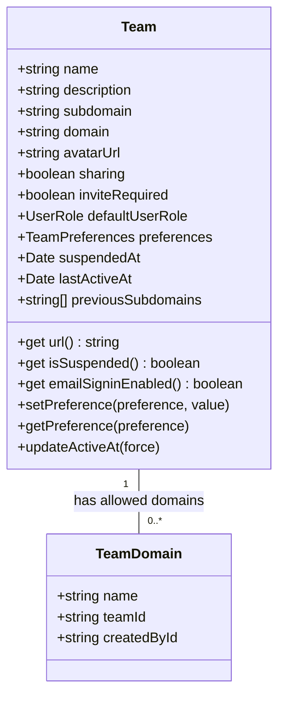
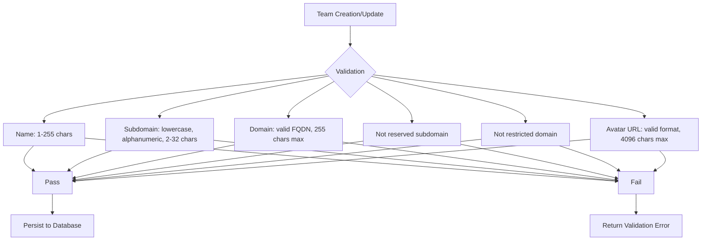
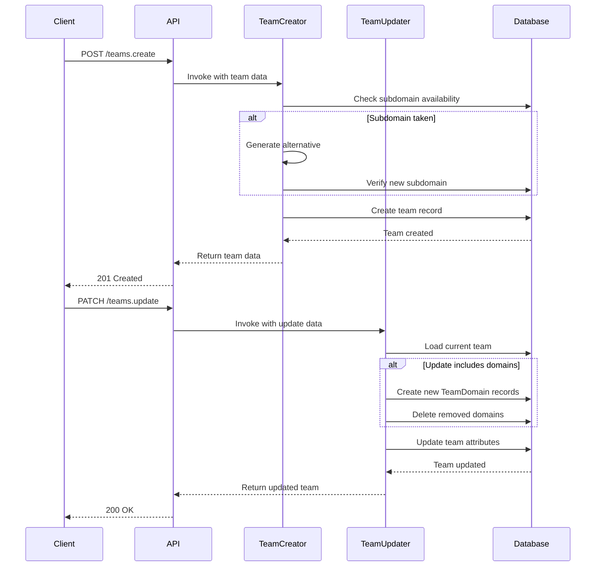
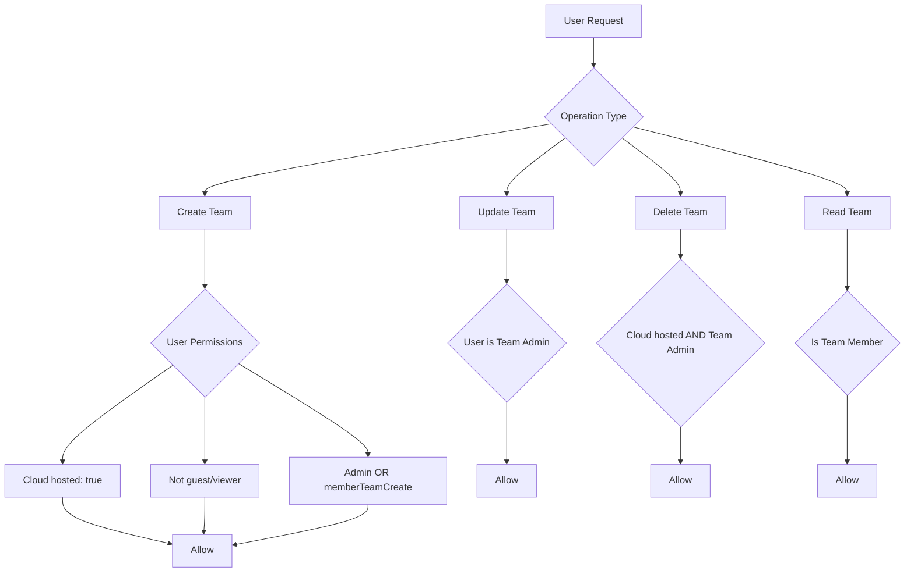

# Teams API

<cite>
**Referenced Files in This Document**   
- [Team.ts](file://server/models/Team.ts)
- [TeamDomain.ts](file://server/models/TeamDomain.ts)
- [teamCreator.ts](file://server/commands/teamCreator.ts)
- [teamUpdater.ts](file://server/commands/teamUpdater.ts)
- [team.ts](file://server/policies/team.ts)
- [validations.ts](file://shared/validations.ts)
</cite>

## Table of Contents
1. [Introduction](#introduction)
2. [Team Management Operations](#team-management-operations)
3. [Team Metadata and Configuration](#team-metadata-and-configuration)
4. [Subscription and Branding Options](#subscription-and-branding-options)
5. [Zod Validation Rules](#zod-validation-rules)
6. [Team Creation and Update Commands](#team-creation-and-update-commands)
7. [Authorization and Policy Enforcement](#authorization-and-policy-enforcement)
8. [Troubleshooting Guide](#troubleshooting-guide)

## Introduction
The Teams API in the baozi application provides comprehensive functionality for managing team resources, including creation, configuration, updates, and deletion. This API enables organizations to manage their workspace settings, team metadata, subscription details, and branding options through well-defined endpoints. The system supports various authentication providers and implements robust policy enforcement to ensure secure access control. This documentation details the complete API surface for team management operations, including request/response schemas, validation rules, and integration patterns.

## Team Management Operations

The Teams API supports standard CRUD operations for team management with specific endpoints for creation, retrieval, update, and deletion. Team creation is handled through the `teamCreator` command which initializes a new team with provided metadata and authentication providers. Team updates are processed through the `teamUpdater` command that handles partial updates to team attributes including preferences and domain configurations. Team deletion follows a two-step process where a confirmation code is first requested and then used to permanently delete the team. All operations are transactional and include appropriate event publishing for system integration.

**Section sources**
- [teamCreator.ts](file://server/commands/teamCreator.ts#L8-L47)
- [teamUpdater.ts](file://server/commands/teamUpdater.ts#L12-L65)
- [Team.ts](file://server/models/Team.ts#L362-L473)

## Team Metadata and Configuration

Team metadata includes essential information such as name, description, subdomain, custom domain, logo (avatarUrl), and various configuration settings. The team name has a maximum length of 255 characters and must be between 1 and 255 characters. The subdomain must be lowercase, alphanumeric with dashes, and between 2 and 32 characters for cloud-hosted instances (extended to 255 for self-hosted). Custom domains can be configured for branded access, with validation to prevent conflicts with existing share domains. The avatarUrl supports external image URLs and automatically handles attachment cleanup when updated. Additional configuration includes default collection assignment, sharing permissions, invitation requirements, and default user roles.

**Diagram sources**
- [Team.ts](file://server/models/Team.ts#L73-L473)
- [TeamDomain.ts](file://server/models/TeamDomain.ts#L22-L76)

**Section sources**
- [Team.ts](file://server/models/Team.ts#L73-L196)
- [TeamDomain.ts](file://server/models/TeamDomain.ts#L28-L36)

## Subscription and Branding Options

The Teams API supports various subscription-related features and branding options through team preferences. Branding options include public branding using the team logo across the application, custom themes, and table of contents positioning. Subscription management is handled through team-level preferences that control feature availability based on the team's subscription tier. Key preferences include seamless edit mode, viewer export capabilities, member invitation permissions, API key creation rights, and account deletion permissions. The system also supports AI-related preferences for model selection based on context length, enabling optimized performance and cost management. These preferences are stored as JSONB in the database and accessed through getter and setter methods that provide default values when preferences are not explicitly set.

**Section sources**
- [Team.ts](file://server/models/Team.ts#L180-L182)
- [validations.ts](file://shared/validations.ts#L109-L127)
- [types.ts](file://shared/types.ts#L283-L318)

## Zod Validation Rules

The Teams API implements comprehensive validation rules through Zod schemas to ensure data integrity and security. Team name validation requires a minimum of 1 character and maximum of 255 characters. Subdomain validation enforces lowercase alphanumeric characters with dashes, with length constraints of 2-32 characters for cloud instances and 2-255 for self-hosted. Domain validation requires a valid FQDN with a maximum length of 255 characters. The system prevents the use of reserved subdomains and restricted domains (such as email provider domains in cloud-hosted environments). Avatar URLs are validated for proper formatting with a maximum length of 4096 characters. Description fields are limited to 1000 characters. These validation rules are implemented as Sequelize model decorators and are enforced at both the application and database levels.

**Diagram sources**
- [Team.ts](file://server/models/Team.ts#L73-L118)
- [TeamDomain.ts](file://server/models/TeamDomain.ts#L28-L36)
- [validations.ts](file://shared/validations.ts#L109-L127)

**Section sources**
- [Team.ts](file://server/models/Team.ts#L73-L136)
- [TeamDomain.ts](file://server/models/TeamDomain.ts#L28-L36)
- [validations.ts](file://shared/validations.ts#L109-L127)

## Team Creation and Update Commands

The team creation process is managed by the `teamCreator` command which handles the initialization of new teams with appropriate defaults and conflict resolution. When creating a team, the system first validates the requested subdomain and automatically generates an available subdomain if the requested one is already in use. The command processes avatar URLs, ensuring only valid HTTP/HTTPS URLs are stored. Team creation includes setting default preferences, such as enabling member invitations, and establishing the initial last active timestamp. The `teamUpdater` command handles team modifications, supporting partial updates to team attributes. It specifically manages domain configurations by creating new TeamDomain records for added domains and removing records for deleted domains. The updater also processes preference updates, applying them through the team's setPreference method. Both commands operate within database transactions to ensure data consistency.

**Diagram sources**
- [teamCreator.ts](file://server/commands/teamCreator.ts#L25-L47)
- [teamUpdater.ts](file://server/commands/teamUpdater.ts#L12-L65)
- [Team.ts](file://server/models/Team.ts#L362-L473)

**Section sources**
- [teamCreator.ts](file://server/commands/teamCreator.ts#L25-L47)
- [teamUpdater.ts](file://server/commands/teamUpdater.ts#L12-L65)

## Authorization and Policy Enforcement

Team operations are protected by a comprehensive policy enforcement system that determines user permissions based on their role and team membership. The authorization logic is implemented in the `team.ts` policy file using a cancan-style permission system. Admin users have full CRUD access to teams, while regular members have limited permissions based on team settings. The `createTeam` permission is granted to non-guest users in cloud-hosted environments when either the user is an admin or the team's `memberTeamCreate` flag is enabled. Team update and delete operations require admin privileges. The system also enforces domain conflict policies by checking for existing shares on a domain before allowing it to be set as a team's custom domain. Authentication providers are integrated to support SSO and other identity federation scenarios, with policies ensuring that only authorized users can modify authentication configurations.

**Diagram sources**
- [team.ts](file://server/policies/team.ts#L12-L61)
- [Team.ts](file://server/models/Team.ts#L325-L340)

**Section sources**
- [team.ts](file://server/policies/team.ts#L12-L61)
- [Team.ts](file://server/models/Team.ts#L325-L340)

## Troubleshooting Guide

Common issues in team management typically fall into three categories: domain conflicts, permission errors, and subscription issues. Domain conflicts occur when attempting to set a custom domain that is already used by a share link; this is prevented by the `checkDomain` hook that queries the Share model before allowing domain updates. Permission errors usually stem from insufficient user privileges, particularly when non-admin users attempt to update or delete teams; verify the user's role and check the team's `memberTeamCreate` setting for creation issues. Subscription-related problems often involve feature availability based on team preferences; ensure the appropriate preferences are set for the desired functionality. When troubleshooting avatar updates, verify the URL uses HTTP/HTTPS protocol as non-compliant URLs are automatically rejected. For subdomain issues, check for reserved words and ensure the subdomain meets length and character requirements. All validation errors return descriptive messages to aid in troubleshooting.

**Section sources**
- [Team.ts](file://server/models/Team.ts#L375-L394)
- [TeamDomain.ts](file://server/models/TeamDomain.ts#L62-L76)
- [teamCreator.ts](file://server/commands/teamCreator.ts#L50-L83)