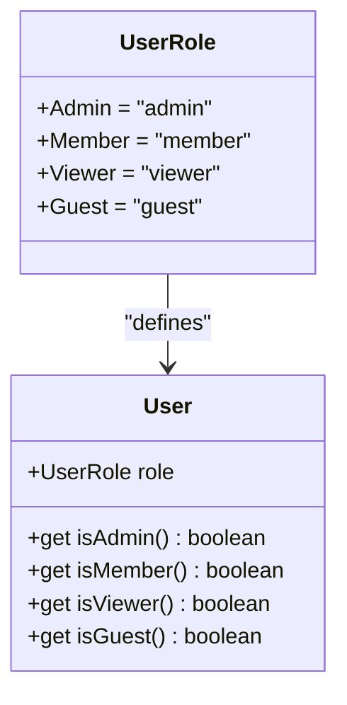
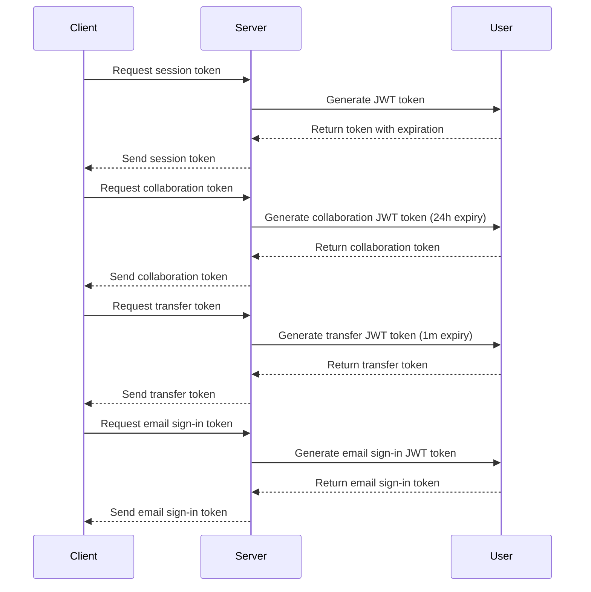
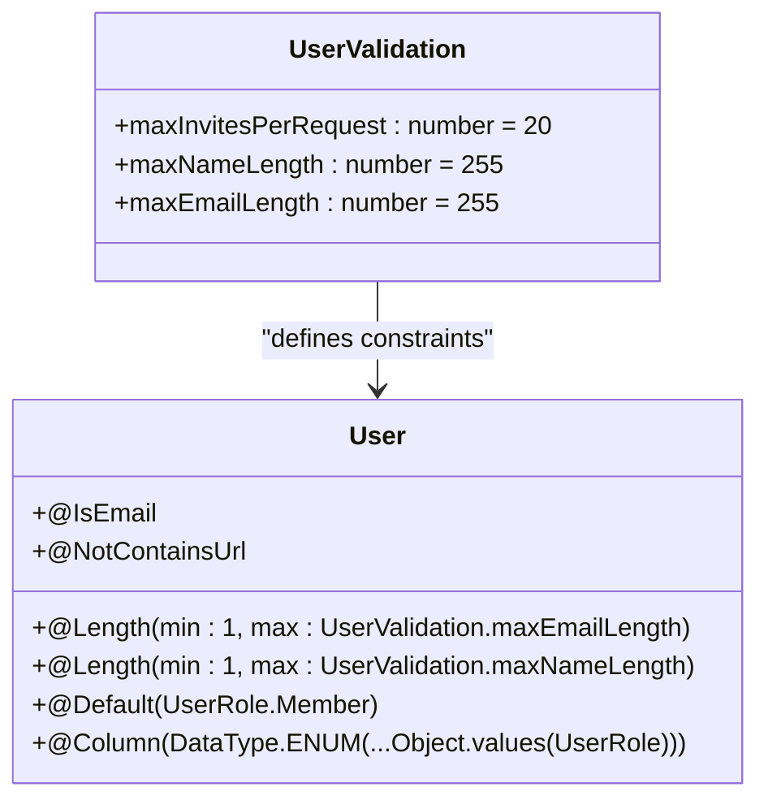
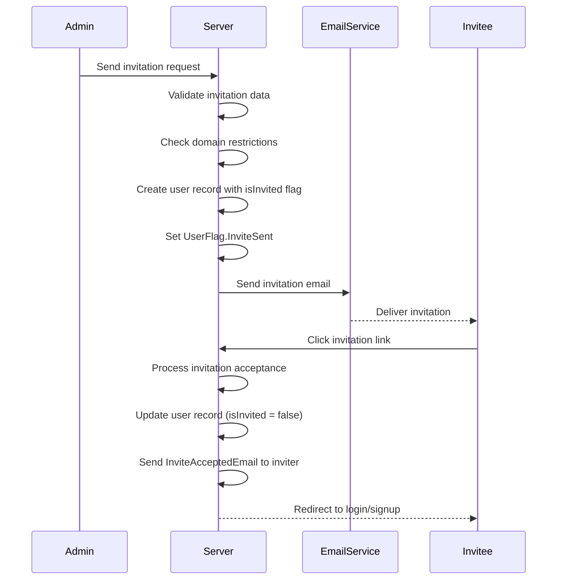
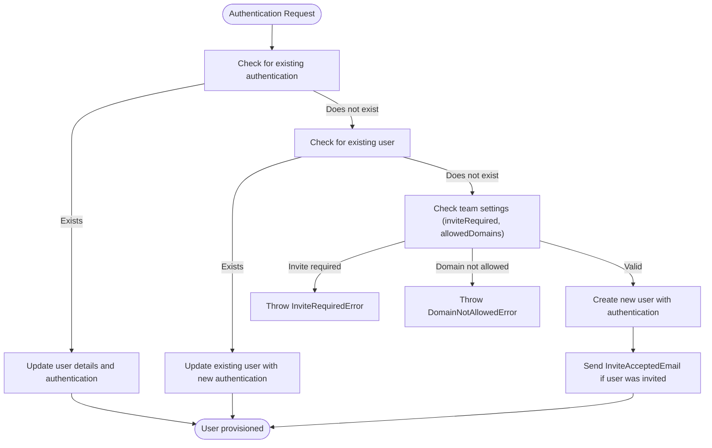
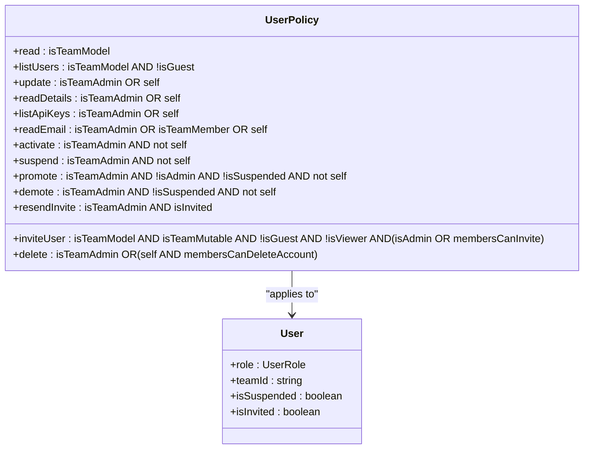

# Users API

<cite>
**Referenced Files in This Document**   
- [User.ts](file://server/models/User.ts)
- [user.ts](file://server/policies/user.ts)
- [userInviter.ts](file://server/commands/userInviter.ts)
- [userProvisioner.ts](file://server/commands/userProvisioner.ts)
- [validations.ts](file://shared/validations.ts)
</cite>

## Table of Contents
1. [User Management Overview](#user-management-overview)
2. [User Metadata and Profile](#user-metadata-and-profile)
3. [Role Management](#role-management)
4. [Session Information](#session-information)
5. [Zod Validation and Constraints](#zod-validation-and-constraints)
6. [User Invitation Process](#user-invitation-process)
7. [User Provisioning](#user-provisioning)
8. [Policy Enforcement](#policy-enforcement)
9. [Command Implementations](#command-implementations)
10. [Troubleshooting Guide](#troubleshooting-guide)

## User Management Overview

The Users API in the baozi application provides comprehensive user management operations including user retrieval, profile updates, invitations, and deactivation. The API endpoints follow RESTful conventions with appropriate HTTP methods and URL patterns. User operations are secured through authentication and authorization policies, ensuring that only authorized users can perform specific actions on user resources.

**Section sources**
- [User.ts](file://server/models/User.ts#L132-L152)
- [user.ts](file://server/policies/user.ts#L13-L21)

## User Metadata and Profile

User metadata includes essential information such as name, avatar, preferences, timezone, and other profile details. The User model defines these properties with appropriate validation and access controls.

```mermaid
classDiagram
class User {
+string email
+string name
+UserRole role
+string avatarUrl
+string timezone
+keyof typeof locales language
+UserPreferences | null preferences
+NotificationSettings notificationSettings
+Date | null lastActiveAt
+Date | null suspendedAt
+{ [key in UserFlag]? : number } | null flags
+get isSuspended() boolean
+get isInvited() boolean
+get isAdmin() boolean
+get isMember() boolean
+get isViewer() boolean
+get isGuest() boolean
+get color() string
+get defaultCollectionPermission() CollectionPermission
+get defaultDocumentPermission() DocumentPermission
+setNotificationEventType(type : NotificationEventType, value : boolean) void
+subscribedToEventType(type : NotificationEventType) boolean
+setFlag(flag : UserFlag, value : boolean) { [key in UserFlag]? : number }
+getFlag(flag : UserFlag) number
+incrementFlag(flag : UserFlag, value : number) { [key in UserFlag]? : number }
+setPreference(preference : UserPreference, value : boolean) UserPreferences
+getPreference(preference : UserPreference) boolean
+groups(options : FindOptions<Group>) Promise<Group[]>
+groupIds(options : FindOptions<Group>) Promise<string[]>
+collectionIds(options : FindOptions<Collection>) Promise<string[]>
+updateActiveAt(ctx : Context, force : boolean) Promise<void>
+updateSignedIn(ctx : Context | APIContext) Promise<void>
+rotateJwtSecret(options : SaveOptions) Promise<void>
+getJwtToken(expiresAt? : Date) string
+getCollaborationToken() string
+getTransferToken() string
+getEmailSigninToken(ctx : Context) string
+getEmailVerificationCode() Promise<string>
+getEmailUpdateToken(email : string) string
+availableTeams() Promise<Team[]>
}
```

**Diagram sources **
- [User.ts](file://server/models/User.ts#L132-L152)

**Section sources**
- [User.ts](file://server/models/User.ts#L132-L152)

## Role Management

The baozi application implements a role-based access control system with four distinct user roles: Admin, Member, Viewer, and Guest. Each role has specific permissions and capabilities within the system.



**Diagram sources **
- [User.ts](file://server/models/User.ts#L150-L152)
- [validations.ts](file://shared/validations.ts#L129-L138)

**Section sources**
- [User.ts](file://server/models/User.ts#L150-L152)
- [validations.ts](file://shared/validations.ts#L129-L138)

## Session Information

The Users API manages various types of session tokens for different purposes, including regular sessions, collaboration sessions, transfer sessions, and email sign-in sessions. These tokens are JWT-based and have specific expiration times and usage patterns.



**Diagram sources **
- [User.ts](file://server/models/User.ts#L541-L583)

**Section sources**
- [User.ts](file://server/models/User.ts#L541-L583)

## Zod Validation and Constraints

The Users API implements comprehensive validation rules for user data using Zod schemas. These validations ensure data integrity and enforce constraints on email addresses, usernames, and other user properties.



**Diagram sources **
- [User.ts](file://server/models/User.ts#L132-L148)
- [validations.ts](file://shared/validations.ts#L129-L138)

**Section sources**
- [User.ts](file://server/models/User.ts#L132-L148)
- [validations.ts](file://shared/validations.ts#L129-L138)

## User Invitation Process

The user invitation process allows team members to invite new users to join their workspace. The process involves creating invitation records, sending invitation emails, and tracking invitation status through user flags.



**Diagram sources **
- [userInviter.ts](file://server/commands/userInviter.ts#L22-L120)
- [User.ts](file://server/models/User.ts#L74-L79)

**Section sources**
- [userInviter.ts](file://server/commands/userInviter.ts#L22-L120)
- [User.ts](file://server/models/User.ts#L74-L79)

## User Provisioning

User provisioning handles the creation and management of user accounts, particularly in the context of authentication providers. The process ensures that users are properly provisioned based on their authentication method and team settings.



**Diagram sources **
- [userProvisioner.ts](file://server/commands/userProvisioner.ts#L52-L239)

**Section sources**
- [userProvisioner.ts](file://server/commands/userProvisioner.ts#L52-L239)

## Policy Enforcement

The Users API enforces authorization policies through the cancan system, which defines what actions users can perform on user resources based on their role and relationship to the target user.



**Diagram sources **
- [user.ts](file://server/policies/user.ts#L13-L89)

**Section sources**
- [user.ts](file://server/policies/user.ts#L13-L89)

## Command Implementations

The Users API implements user management operations through command patterns, specifically the userInviter and userProvisioner commands. These commands encapsulate the business logic for user invitations and provisioning.

```mermaid
classDiagram
class userInviter {
+Props : { invites : Invite[] }
+Invite : { name : string, email : string, role : UserRole }
+return : { sent : Invite[], unsent : Invite[], users : User[] }
+filter and normalize invites
+check domain restrictions
+filter existing users
+create user records
+send invitation emails
}
class userProvisioner {
+Props : { name, email, role, language, avatarUrl, teamId, authentication }
+return : { user : User, isNewUser : boolean, authentication : UserAuthentication | null }
+handle existing authentication
+handle existing user
+create new user
+send InviteAcceptedEmail
}
class User {
+createWithCtx()
}
userInviter --> User : "creates"
userProvisioner --> User : "creates/updates"
```

**Diagram sources **
- [userInviter.ts](file://server/commands/userInviter.ts#L22-L120)
- [userProvisioner.ts](file://server/commands/userProvisioner.ts#L52-L239)

**Section sources**
- [userInviter.ts](file://server/commands/userInviter.ts#L22-L120)
- [userProvisioner.ts](file://server/commands/userProvisioner.ts#L52-L239)

## Troubleshooting Guide

This section addresses common issues encountered with user management operations and provides guidance for resolution.

### Invitation Delivery Issues

When invitations fail to deliver, check the following:

1. **Domain restrictions**: Verify that the recipient's email domain is allowed by the team's domain restrictions.
2. **Email configuration**: Ensure that the SMTP configuration is correct and email delivery is enabled.
3. **Rate limiting**: Check if there are any rate limits on email sending that might be exceeded.
4. **User existence**: Confirm that the user doesn't already exist in the system, as invitations won't be sent to existing users.

### Profile Update Failures

Profile update failures can occur due to:

1. **Validation errors**: Ensure that the name and email meet the length and format requirements.
2. **Permission issues**: Verify that the user has the necessary permissions to update their profile or that an admin is performing the update.
3. **Suspended accounts**: Profile updates may be restricted for suspended users.

### Session Synchronization Problems

Session synchronization issues may arise from:

1. **Token expiration**: Ensure that session tokens are being refreshed appropriately before expiration.
2. **JWT secret rotation**: When a user's JWT secret is rotated, all previous tokens become invalid.
3. **Cross-domain issues**: Transfer tokens are required when moving sessions between subdomains or domains.
4. **Caching problems**: Clear browser caches and cookies if session issues persist across devices.

**Section sources**
- [userInviter.ts](file://server/commands/userInviter.ts#L49-L55)
- [userProvisioner.ts](file://server/commands/userProvisioner.ts#L208-L210)
- [User.ts](file://server/models/User.ts#L529-L532)