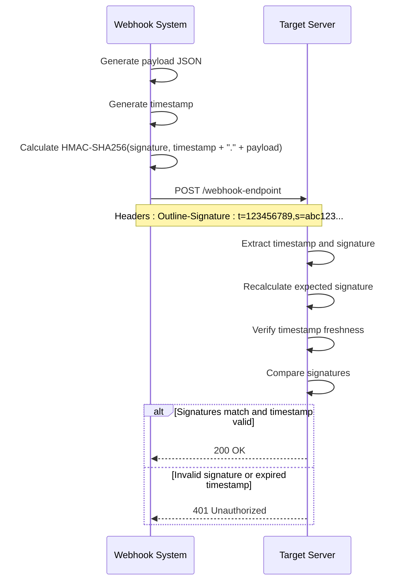
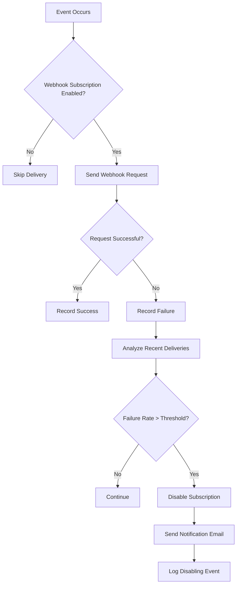
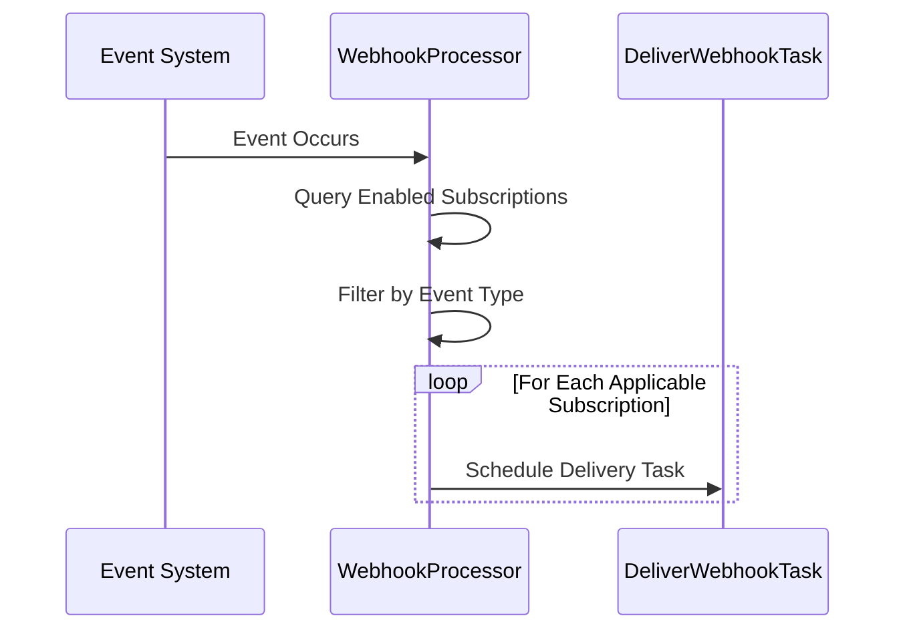

# Webhooks API

<cite>
**Referenced Files in This Document**   
- [WebhookSubscription.ts](file://server/models/WebhookSubscription.ts)
- [WebhookDelivery.ts](file://server/models/WebhookDelivery.ts)
- [schema.ts](file://plugins/webhooks/server/api/schema.ts)
- [webhookSubscriptions.ts](file://plugins/webhooks/server/api/webhookSubscriptions.ts)
- [WebhookProcessor.ts](file://plugins/webhooks/server/processors/WebhookProcessor.ts)
- [DeliverWebhookTask.ts](file://plugins/webhooks/server/tasks/DeliverWebhookTask.ts)
- [webhook.ts](file://plugins/webhooks/server/presenters/webhook.ts)
- [webhookSubscription.ts](file://plugins/webhooks/server/presenters/webhookSubscription.ts)
</cite>

## Table of Contents
1. [Introduction](#introduction)
2. [Webhook Subscription Management](#webhook-subscription-management)
3. [Event Types and Payload Structure](#event-types-and-payload-structure)
4. [Signature Verification](#signature-verification)
5. [Zod Validation Rules](#zod-validation-rules)
6. [Retry Strategy and Delivery Failure Handling](#retry-strategy-and-delivery-failure-handling)
7. [Background Job Processing](#background-job-processing)
8. [Security Model](#security-model)
9. [Troubleshooting Guide](#troubleshooting-guide)

## Introduction
The Webhooks API in the baozi application enables real-time event notifications by delivering HTTP POST requests to configured endpoints whenever specific events occur within the system. This documentation details the complete API for managing webhook subscriptions, including creation, configuration, testing, and deletion operations. It covers the supported event types, payload structure, security mechanisms, and error handling strategies. The system is designed to provide reliable event delivery with robust security features including signature verification and secret management.

## Webhook Subscription Management
The Webhooks API provides endpoints for creating, updating, listing, and deleting webhook subscriptions. All operations require administrative privileges and support both API and application authentication types.

### Creation
To create a new webhook subscription, send a POST request to the `webhookSubscriptions.create` endpoint with the required parameters in the request body. The subscription is automatically enabled upon creation.

**HTTP Method**: POST  
**Endpoint**: `webhookSubscriptions.create`  
**Authentication**: Required (Admin role)  
**Request Schema**:
```json
{
  "name": "string",
  "url": "string (URL)",
  "secret": "string (optional)",
  "events": ["string"]
}
```

The `events` array specifies which events will trigger webhook deliveries. A value of `["*"]` subscribes to all events. The system enforces a limit of 10 webhook subscriptions per team, validated through the `checkLimit` hook in the WebhookSubscription model.

**Section sources**
- [schema.ts](file://plugins/webhooks/server/api/schema.ts#L3-L14)
- [webhookSubscriptions.ts](file://plugins/webhooks/server/api/webhookSubscriptions.ts#L42-L69)
- [WebhookSubscription.ts](file://server/models/WebhookSubscription.ts#L91-L99)

### Configuration
Webhook subscriptions can be updated by sending a POST request to the `webhookSubscriptions.update` endpoint. The update operation requires the subscription ID and supports modifying the name, URL, secret, and event types.

**HTTP Method**: POST  
**Endpoint**: `webhookSubscriptions.update`  
**Authentication**: Required (Admin role)  
**Request Schema**:
```json
{
  "id": "string (UUID)",
  "name": "string",
  "url": "string (URL)",
  "secret": "string (optional)",
  "events": ["string"]
}
```

The update operation maintains the enabled state of the subscription and updates the `updatedAt` timestamp. The same validation rules apply as during creation, including the team-level subscription limit.

**Section sources**
- [schema.ts](file://plugins/webhooks/server/api/schema.ts#L16-L28)
- [webhookSubscriptions.ts](file://plugins/webhooks/server/api/webhookSubscriptions.ts#L101-L133)

### Listing
Administrators can retrieve a paginated list of all webhook subscriptions for their team by calling the `webhookSubscriptions.list` endpoint.

**HTTP Method**: POST  
**Endpoint**: `webhookSubscriptions.list`  
**Authentication**: Required (Admin role)  
**Response Structure**:
```json
{
  "pagination": {
    "page": "number",
    "limit": "number",
    "offset": "number",
    "total": "number"
  },
  "data": [
    {
      "id": "string",
      "name": "string",
      "url": "string",
      "secret": "string",
      "events": ["string"],
      "enabled": "boolean",
      "createdAt": "datetime",
      "updatedAt": "datetime"
    }
  ]
}
```

Subscriptions are returned in descending order by creation date.

**Section sources**
- [webhookSubscriptions.ts](file://plugins/webhooks/server/api/webhookSubscriptions.ts#L17-L39)

### Deletion
Webhook subscriptions can be removed by sending a POST request to the `webhookSubscriptions.delete` endpoint with the subscription ID.

**HTTP Method**: POST  
**Endpoint**: `webhookSubscriptions.delete`  
**Authentication**: Required (Admin role)  
**Request Schema**:
```json
{
  "id": "string (UUID)"
}
```

The deletion operation permanently removes the subscription from the system. This action cannot be undone.

**Section sources**
- [schema.ts](file://plugins/webhooks/server/api/schema.ts#L30-L38)
- [webhookSubscriptions.ts](file://plugins/webhooks/server/api/webhookSubscriptions.ts#L72-L98)

## Event Types and Payload Structure
The webhook system supports a comprehensive set of events across various entities in the application. Events are categorized by their source entity and action type.

### Supported Event Types
The following event types are supported by the webhook system:

- **Document Events**: `documents.create`, `documents.publish`, `documents.unpublish`, `documents.delete`, `documents.archive`, `documents.unarchive`, `documents.restore`, `documents.move`, `documents.update`, `documents.title_change`
- **Collection Events**: `collections.create`, `collections.update`, `collections.delete`, `collections.move`, `collections.permission_changed`, `collections.archive`, `collections.restore`
- **User Events**: `users.create`, `users.signin`, `users.signout`, `users.update`, `users.suspend`, `users.activate`, `users.delete`, `users.invite`, `users.promote`, `users.demote`
- **Comment Events**: `comments.create`, `comments.update`, `comments.delete`
- **Revision Events**: `revisions.create`
- **File Operation Events**: `fileOperations.create`, `fileOperations.update`, `fileOperations.delete`
- **Team Events**: `teams.update`
- **Pin Events**: `pins.create`, `pins.update`, `pins.delete`
- **Star Events**: `stars.create`, `stars.update`, `stars.delete`
- **Share Events**: `shares.create`, `shares.update`, `shares.revoke`
- **Webhook Subscription Events**: `webhookSubscriptions.create`, `webhookSubscriptions.delete`, `webhookSubscriptions.update`
- **View Events**: `views.create`
- **Group Events**: `groups.create`, `groups.update`, `groups.delete`
- **Integration Events**: `integrations.create`, `integrations.update`, `integrations.delete`

### Payload Structure
All webhook deliveries follow a consistent payload structure that includes event metadata and the relevant entity data.

```json
{
  "id": "string",
  "actorId": "string",
  "webhookSubscriptionId": "string",
  "event": "string",
  "payload": {
    "id": "string",
    "model": {
      "id": "string",
      "name": "string",
      "url": "string",
      "events": ["string"],
      "enabled": "boolean",
      "createdAt": "datetime",
      "updatedAt": "datetime"
    }
  },
  "createdAt": "datetime"
}
```

The `payload` object contains the `id` of the affected entity and its `model` data. For document-related events, the payload includes the document content with `includeData: true` and `includeText: true` options. The `actorId` field identifies the user who triggered the event.

**Section sources**
- [DeliverWebhookTask.ts](file://plugins/webhooks/server/tasks/DeliverWebhookTask.ts#L104-L248)
- [webhook.ts](file://plugins/webhooks/server/presenters/webhook.ts#L16-L37)
- [server/types.ts](file://server/types.ts#L490-L519)

## Signature Verification
The webhook system provides signature verification to ensure the authenticity and integrity of delivered payloads. This security feature allows receiving applications to verify that webhook requests originate from the baozi application.

### Signature Generation
The signature is generated using HMAC-SHA256 algorithm with the webhook's secret as the key. The signature includes a timestamp to prevent replay attacks.

**Signature Format**:
```
t={timestamp},s={signature}
```

The signature is calculated over the concatenation of the timestamp, a period, and the JSON payload string: `${signTimestamp}.${payload}`.

The signature is included in the HTTP request header as `Outline-Signature`.

### Verification Process
To verify a webhook delivery:
1. Extract the timestamp and signature from the `Outline-Signature` header
2. Calculate the expected signature using the stored webhook secret
3. Compare the calculated signature with the received signature
4. Validate that the timestamp is within an acceptable time window (typically 5 minutes)

The `signature` method in the WebhookSubscription model handles the signature generation process. If no secret is configured for a subscription, no signature header is included in the delivery.



**Diagram sources**
- [WebhookSubscription.ts](file://server/models/WebhookSubscription.ts#L151-L163)
- [DeliverWebhookTask.ts](file://plugins/webhooks/server/tasks/DeliverWebhookTask.ts#L713-L716)

**Section sources**
- [WebhookSubscription.ts](file://server/models/WebhookSubscription.ts#L144-L163)

## Zod Validation Rules
The webhook API uses Zod for request validation, ensuring that incoming data conforms to the expected schema before processing.

### Request Validation Schemas
The following Zod schemas are defined for webhook operations:

**Create Schema**:
```typescript
const WebhookSubscriptionsCreateSchema = z.object({
  body: z.object({
    name: z.string(),
    url: z.string().url(),
    secret: z.string().optional(),
    events: z.array(z.string()),
  }),
});
```

**Update Schema**:
```typescript
const WebhookSubscriptionsUpdateSchema = z.object({
  body: z.object({
    id: z.string().uuid(),
    name: z.string(),
    url: z.string().url(),
    secret: z.string().optional(),
    events: z.array(z.string()),
  }),
});
```

**Delete Schema**:
```typescript
const WebhookSubscriptionsDeleteSchema = z.object({
  body: z.object({
    id: z.string().uuid(),
  }),
});
```

These schemas are applied as middleware in the webhookSubscriptions router, automatically validating incoming requests and returning appropriate error responses for invalid data.

**Section sources**
- [schema.ts](file://plugins/webhooks/server/api/schema.ts#L3-L38)

## Retry Strategy and Delivery Failure Handling
The webhook system implements a sophisticated retry strategy and failure handling mechanism to ensure reliable event delivery.

### Delivery Process
When an event occurs, the WebhookProcessor identifies all active subscriptions that match the event type and schedules a DeliverWebhookTask for each applicable subscription. The delivery task attempts to send the webhook payload to the configured URL with a 5-second timeout.

### Failure Analysis and Subscription Disabling
The system monitors delivery success rates and automatically disables webhook subscriptions that exhibit persistent delivery failures. This prevents the system from continuously attempting to deliver to unreachable endpoints.

The failure analysis considers:
- **Time Window**: Configurable period (default: 3600 seconds) for analyzing delivery attempts
- **Failure Rate Threshold**: Configurable percentage (default: 50%) of failed deliveries within the time window
- **Minimum Deliveries**: Minimum number of delivery attempts (10) required before analysis

When a subscription's failure rate exceeds the threshold within the time window, the system:
1. Disables the subscription
2. Sends a notification email to the subscription creator
3. Logs the disabling event with detailed failure metrics



**Diagram sources**
- [DeliverWebhookTask.ts](file://plugins/webhooks/server/tasks/DeliverWebhookTask.ts#L763-L841)

**Section sources**
- [DeliverWebhookTask.ts](file://plugins/webhooks/server/tasks/DeliverWebhookTask.ts#L763-L841)

## Background Job Processing
The webhook system uses a background job processing architecture to ensure reliable and asynchronous event delivery.

### WebhookProcessor
The WebhookProcessor is responsible for receiving events from the system and identifying applicable webhook subscriptions. It runs as a background job and processes all events (`applicableEvents: ["*"]`).

**Processing Flow**:
1. Receive event from the system
2. Query for all enabled webhook subscriptions in the event's team
3. Filter subscriptions based on event type using the `validForEvent` method
4. Schedule a DeliverWebhookTask for each applicable subscription



**Diagram sources**
- [WebhookProcessor.ts](file://plugins/webhooks/server/processors/WebhookProcessor.ts#L6-L34)

**Section sources**
- [WebhookProcessor.ts](file://plugins/webhooks/server/processors/WebhookProcessor.ts#L6-L34)

### DeliverWebhookTask
The DeliverWebhookTask handles the actual HTTP request to deliver the webhook payload to the configured endpoint. It manages the delivery lifecycle, including request execution, response handling, and failure analysis.

**Key Responsibilities**:
- Construct the webhook payload using the appropriate presenter
- Add signature header if a secret is configured
- Execute HTTP POST request with 5-second timeout
- Record delivery status and response details
- Trigger failure analysis for unsuccessful deliveries

The task uses the `presentWebhook` function to format the payload and includes comprehensive logging for monitoring and debugging.

**Section sources**
- [DeliverWebhookTask.ts](file://plugins/webhooks/server/tasks/DeliverWebhookTask.ts#L81-L842)

## Security Model
The webhook system implements multiple security measures to protect against unauthorized access and ensure data integrity.

### Secret Management
Webhook secrets are stored securely in the database using encryption. The `@Encrypted` decorator ensures that secret values are encrypted at rest.

- Secrets are stored in a BLOB column with encryption
- The `rotateSecret` method allows administrators to generate new secrets
- Secrets are never exposed in list operations or through the API
- Empty secrets are handled by setting the field to undefined

### IP Allowlisting
While not explicitly implemented in the provided code, the system's architecture supports IP allowlisting through the use of the `ip` field in event data. This field captures the originating IP address of the request that triggered the event, which could be used in conjunction with external IP filtering mechanisms.

### Authentication and Authorization
All webhook management operations require administrative privileges:
- Creation, update, and deletion require Admin role
- Listing is restricted to Admin role
- Authentication can be performed via API key or application session
- Authorization is enforced using the `authorize` function with appropriate policies

The system also includes rate limiting through the `rateLimiter` middleware to prevent abuse.

**Section sources**
- [WebhookSubscription.ts](file://server/models/WebhookSubscription.ts#L67-L70)
- [webhookSubscriptions.ts](file://plugins/webhooks/server/api/webhookSubscriptions.ts#L44-L47)
- [WebhookSubscription.ts](file://server/models/WebhookSubscription.ts#L107-L109)

## Troubleshooting Guide
This section provides guidance for diagnosing and resolving common issues with webhook subscriptions and deliveries.

### Delivery Failures
**Symptoms**: Webhook deliveries showing "failed" status in delivery records.

**Common Causes**:
- Target server is unreachable or timing out
- SSL/TLS certificate issues
- Target server returning non-2xx status codes
- Network connectivity issues

**Resolution Steps**:
1. Verify the target URL is accessible from the internet
2. Check server logs for connection errors
3. Test the endpoint with a tool like curl or Postman
4. Ensure the server can handle the expected payload size
5. Verify SSL certificates are valid and trusted

### Signature Verification Errors
**Symptoms**: Receiving applications reject webhook deliveries due to signature verification failures.

**Common Causes**:
- Clock skew between systems
- Incorrect secret configuration
- Payload modification during transit
- Using the wrong hashing algorithm

**Resolution Steps**:
1. Verify the secret matches between baozi and the receiving application
2. Check system clocks are synchronized (NTP)
3. Ensure the signature calculation uses HMAC-SHA256
4. Verify the signature base string format: `${timestamp}.${payload}`
5. Check for any middleware that might modify the request body

### Rate Limiting Issues
**Symptoms**: Webhook creation or update requests being rejected.

**Common Causes**:
- Exceeding the team limit of 10 webhook subscriptions
- API rate limits on management endpoints

**Resolution Steps**:
1. Check the current number of active webhook subscriptions
2. Delete unused subscriptions to free up capacity
3. Implement retry logic with exponential backoff for API calls
4. Contact support if the limit needs to be increased

### High Failure Rate and Automatic Disabling
**Symptoms**: Webhook subscription was automatically disabled due to delivery failures.

**Resolution Steps**:
1. Check the delivery failure analysis logs for details
2. Fix the underlying issue with the target endpoint
3. Manually re-enable the subscription through the API or UI
4. Monitor delivery success after re-enabling

The system sends a notification email to the subscription creator when a subscription is disabled due to high failure rates, providing details about the failure analysis.

**Section sources**
- [DeliverWebhookTask.ts](file://plugins/webhooks/server/tasks/DeliverWebhookTask.ts#L824-L839)
- [WebhookSubscription.ts](file://server/models/WebhookSubscription.ts#L116-L120)