# Authentication Flow

<cite>
**Referenced Files in This Document**   
- [authentication.ts](file://server/middlewares/authentication.ts)
- [AuthenticationProvider.ts](file://app/models/AuthenticationProvider.ts)
- [AuthenticationProvider.ts](file://server/models/AuthenticationProvider.ts)
- [UserAuthentication.ts](file://server/models/UserAuthentication.ts)
- [jwt.ts](file://server/utils/jwt.ts)
</cite>

## Table of Contents
1. [Introduction](#introduction)
2. [Authentication Middleware](#authentication-middleware)
3. [Core Authentication Models](#core-authentication-models)
4. [Session-Based Authentication](#session-based-authentication)
5. [OAuth Integration](#oauth-integration)
6. [API Key Authentication](#api-key-authentication)
7. [Token Validation and Expiration](#token-validation-and-expiration)
8. [Security Considerations](#security-considerations)
9. [Authentication Request/Response Flows](#authentication-requestresponse-flows)
10. [Multi-Provider Authentication and Account Linking](#multi-provider-authentication-and-account-linking)

## Introduction
The baozi authentication system implements a comprehensive security framework supporting multiple authentication methods including session-based authentication, OAuth integration, and API key authentication. The system is built on a robust middleware architecture that validates and processes authentication tokens, manages user sessions, and enforces role-based access control. This documentation provides a detailed analysis of the authentication flow, covering the core models, middleware implementation, token management, and security mechanisms that ensure secure access to the application.

## Authentication Middleware

The authentication middleware is the central component responsible for processing and validating authentication requests across the application. It supports multiple authentication types and provides a flexible configuration for route protection.

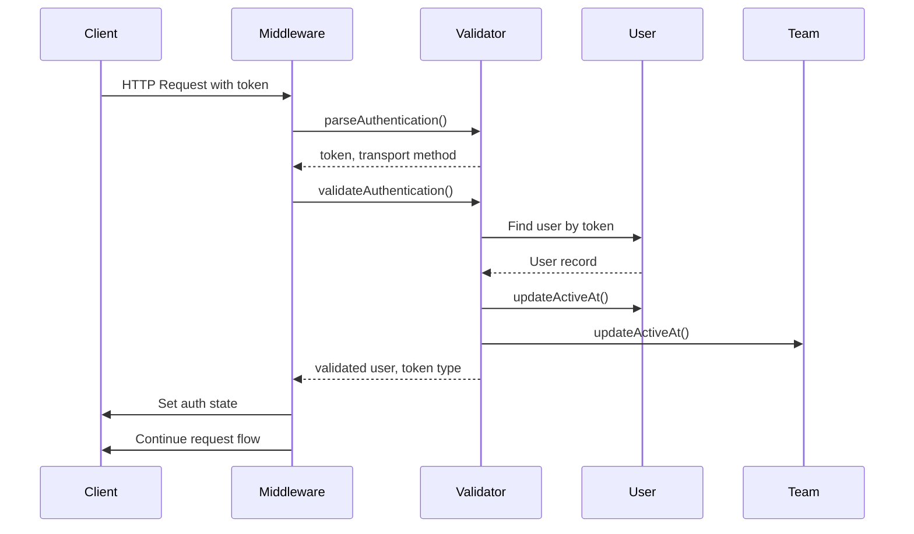

**Diagram sources**
- [authentication.ts](file://server/middlewares/authentication.ts#L36-L85)
- [authentication.ts](file://server/middlewares/authentication.ts#L144-L278)

**Section sources**
- [authentication.ts](file://server/middlewares/authentication.ts#L18-L25)
- [authentication.ts](file://server/middlewares/authentication.ts#L36-L85)

## Core Authentication Models

The authentication system is built around two core models: AuthenticationProvider and UserAuthentication. These models store the authentication data and manage the relationship between users and their authentication methods.

### AuthenticationProvider Model

The AuthenticationProvider model represents an authentication provider such as Google, Azure, or OIDC. It stores configuration details and manages the OAuth client for the provider.

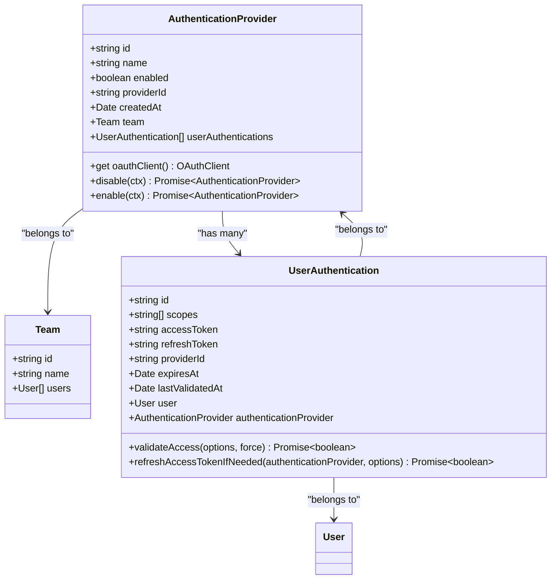

**Diagram sources**
- [AuthenticationProvider.ts](file://server/models/AuthenticationProvider.ts#L27-L140)
- [UserAuthentication.ts](file://server/models/UserAuthentication.ts#L24-L203)

### UserAuthentication Model

The UserAuthentication model stores the user's authentication details for a specific provider, including access tokens, refresh tokens, and expiration information.

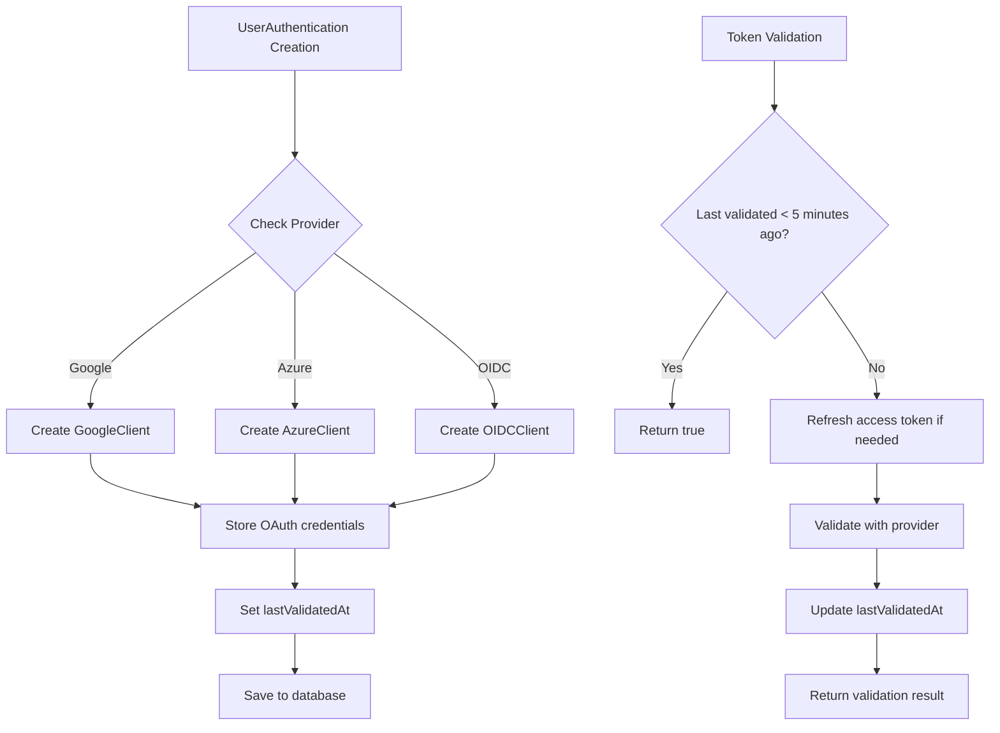

**Diagram sources**
- [UserAuthentication.ts](file://server/models/UserAuthentication.ts#L24-L203)

**Section sources**
- [AuthenticationProvider.ts](file://app/models/AuthenticationProvider.ts#L4-L22)
- [AuthenticationProvider.ts](file://server/models/AuthenticationProvider.ts#L27-L140)
- [UserAuthentication.ts](file://server/models/UserAuthentication.ts#L24-L203)

## Session-Based Authentication

Session-based authentication uses JWT tokens stored in cookies to maintain user sessions. The system generates session tokens that are validated on each request.

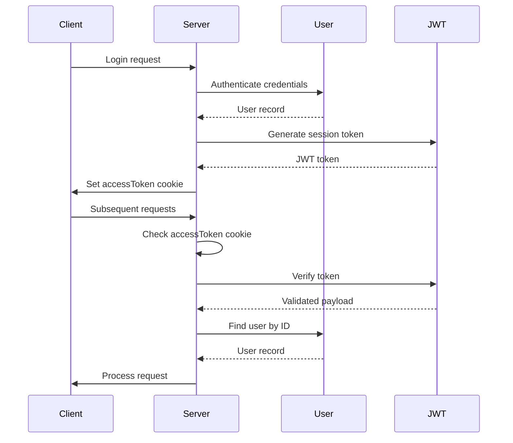

The session token contains the user ID and an optional expiration time. The token is signed with a user-specific secret to prevent tampering.

**Section sources**
- [jwt.ts](file://server/utils/jwt.ts#L27-L75)
- [authentication.ts](file://server/middlewares/authentication.ts#L245-L278)

## OAuth Integration

The OAuth integration allows users to authenticate using third-party providers such as Google, Azure, or custom OIDC providers. The system follows the OAuth 2.0 authorization code flow.

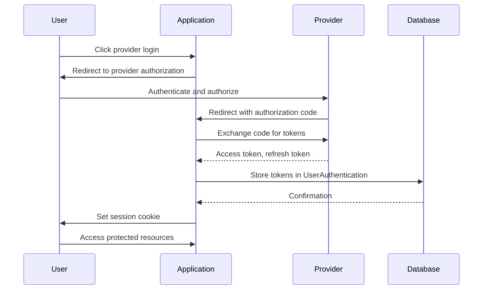

The OAuth flow is implemented through provider-specific clients that handle the token exchange and user information retrieval. Each provider has its own client implementation that extends a base OAuthClient class.

**Section sources**
- [AuthenticationProvider.ts](file://server/models/AuthenticationProvider.ts#L97-L108)
- [UserAuthentication.ts](file://server/models/UserAuthentication.ts#L143-L202)

## API Key Authentication

API key authentication provides a mechanism for programmatic access to the API. API keys are generated by users and can be scoped to specific permissions.

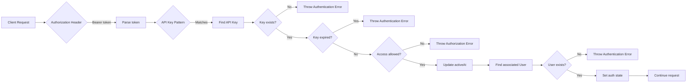

API keys are validated against the request path to ensure they have appropriate permissions. The system supports scoping API keys to specific operations (read, write, create).

**Section sources**
- [authentication.ts](file://server/middlewares/authentication.ts#L201-L244)
- [ApiKey.ts](file://server/models/ApiKey.ts#L172-L178)

## Token Validation and Expiration

The authentication system implements comprehensive token validation and expiration handling to ensure security and proper session management.

### Token Expiration Mechanisms

```mermaid
classDiagram
class TokenTypes {
<<enumeration>>
Session
Transfer
EmailSignin
Collaboration
}
class TokenValidation {
+getJWTPayload(token) JWT~JwtPayload~
+getUserForJWT(token, allowedTypes) Promise~User~
+getUserForEmailSigninToken(ctx, token) Promise~User~
+getDetailsForEmailUpdateToken(token, options) Promise~{user : User, email : string}~
}
class TokenExpiration {
+Session : No expiration or configurable
+Transfer : 1 minute expiration
+EmailSignin : 10 minutes expiration
+Collaboration : 24 hours expiration
}
TokenTypes --> TokenValidation : "used by"
TokenValidation --> TokenExpiration : "implements"
```

The system uses different token types with varying expiration policies:
- **Session tokens**: Can be long-lived or have configurable expiration
- **Transfer tokens**: Short-lived (1 minute) for cross-domain authentication
- **Email signin tokens**: Medium-lived (10 minutes) for email-based login
- **Collaboration tokens**: 24-hour lifespan for real-time collaboration

### Token Refresh Flow

For OAuth-based authentication, the system automatically refreshes access tokens when they approach expiration:

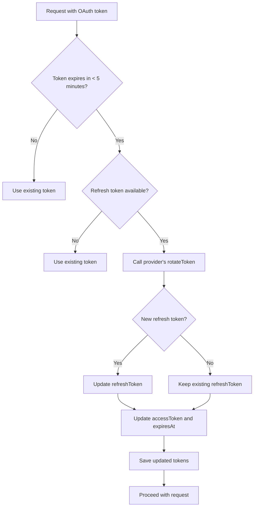

**Section sources**
- [jwt.ts](file://server/utils/jwt.ts#L8-L141)
- [UserAuthentication.ts](file://server/models/UserAuthentication.ts#L90-L134)

## Security Considerations

The authentication system implements multiple security measures to protect against common vulnerabilities.

### CSRF Protection

The system includes CSRF protection through token validation and request verification. The authentication middleware validates the origin of requests and ensures tokens are used appropriately.

### Password Hashing

While the system primarily uses OAuth and token-based authentication, password hashing is implemented for email-based authentication flows. User secrets are encrypted at rest using strong encryption algorithms.

### Secure Cookie Policies

The system implements secure cookie policies for session management:
- Cookies are marked as HttpOnly to prevent JavaScript access
- Secure flag is set to ensure transmission over HTTPS only
- SameSite attribute is configured to prevent CSRF attacks

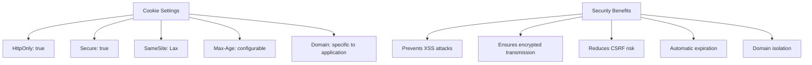

**Section sources**
- [authentication.ts](file://server/middlewares/authentication.ts#L130-L136)
- [User.ts](file://server/models/User.ts#L155-L157)

## Authentication Request/Response Flows

The system handles authentication through standardized request/response patterns for different authentication methods.

### Standard Authentication Flow

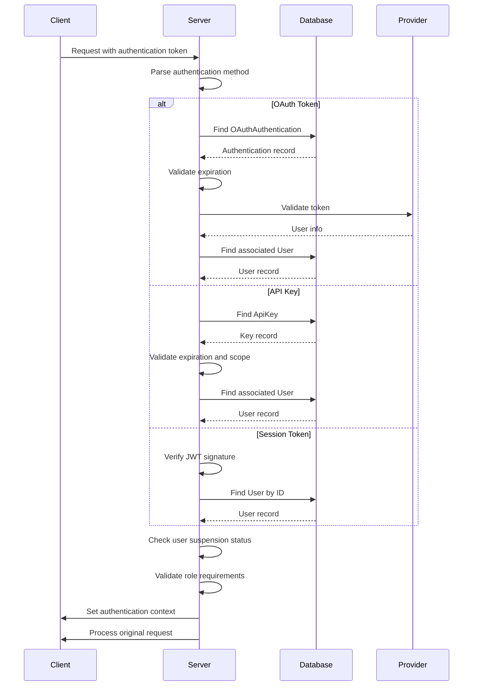

### Error Handling Flow

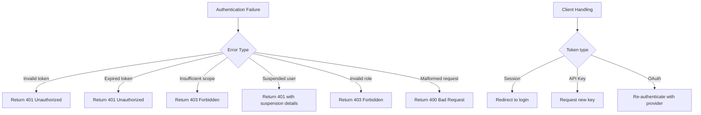

**Section sources**
- [authentication.ts](file://server/middlewares/authentication.ts#L144-L278)
- [errors.ts](file://server/errors.ts#L14-L16)

## Multi-Provider Authentication and Account Linking

The system supports multi-provider authentication, allowing users to link multiple authentication providers to a single account.

### Account Linking Flow

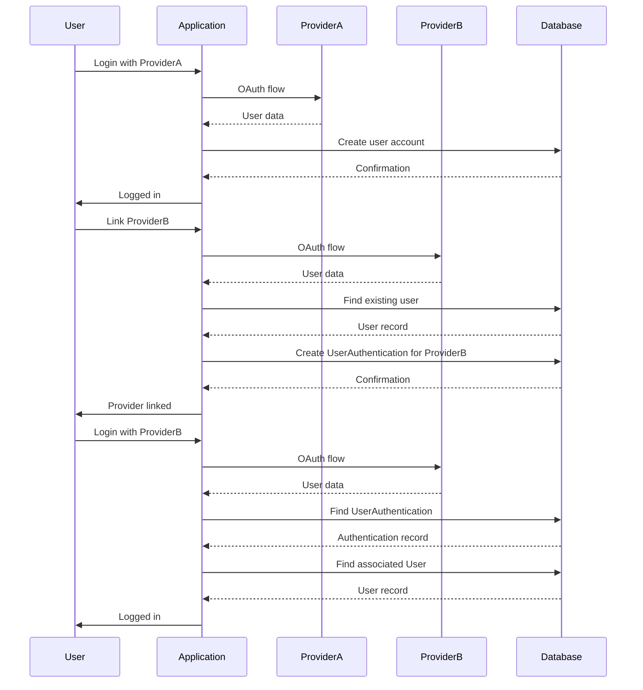

The UserAuthentication model allows a single user to have multiple authentication records, each linked to a different provider. This enables seamless switching between authentication methods while maintaining a unified user experience.

**Section sources**
- [UserAuthentication.ts](file://server/models/UserAuthentication.ts#L52-L66)
- [AuthenticationProvider.ts](file://server/models/AuthenticationProvider.ts#L87-L88)