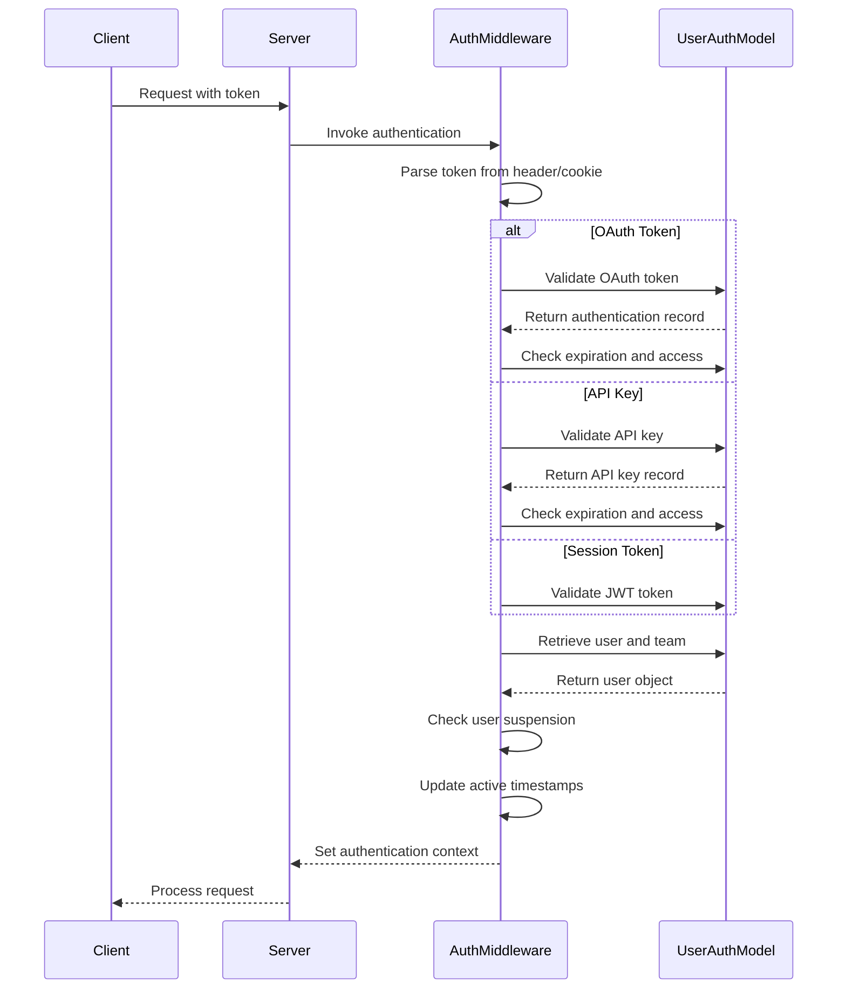
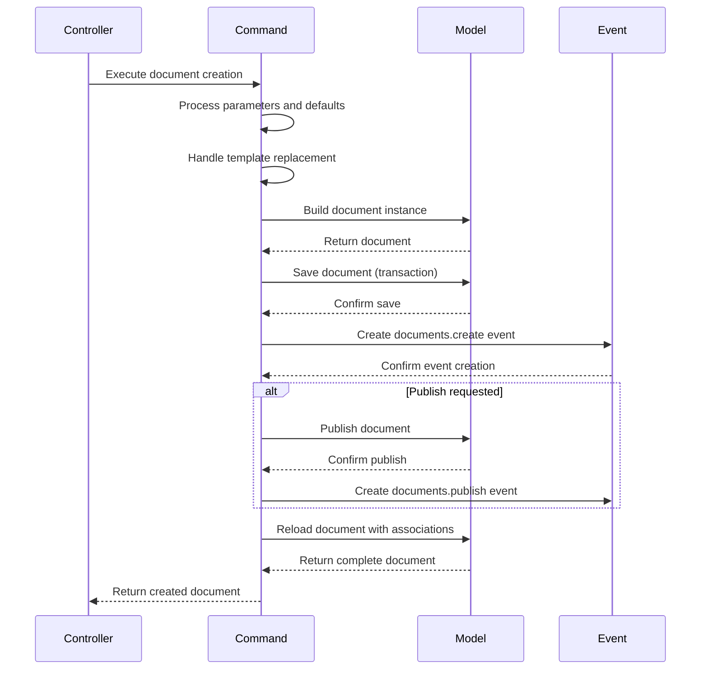
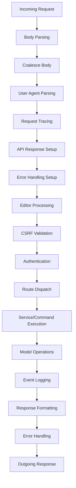

# Backend Architecture

<cite>
**Referenced Files in This Document**   
- [api/index.ts](file://server/routes/api/index.ts)
- [User.ts](file://server/models/User.ts)
- [Document.ts](file://server/models/Document.ts)
- [authentication.ts](file://server/middlewares/authentication.ts)
- [collaboration.ts](file://server/services/collaboration.ts)
- [documentCreator.ts](file://server/commands/documentCreator.ts)
</cite>

## Table of Contents
1. [RESTful API Architecture](#restful-api-architecture)
2. [ORM Models and Database Schema](#orm-models-and-database-schema)
3. [Authentication Flow](#authentication-flow)
4. [Service Layer and Business Logic](#service-layer-and-business-logic)
5. [Command Pattern Implementation](#command-pattern-implementation)
6. [Middleware System](#middleware-system)
7. [HTTP Request Processing Flow](#http-request-processing-flow)
8. [Error Handling and Validation](#error-handling-and-validation)
9. [Security Considerations](#security-considerations)

## RESTful API Architecture

The baozi Koa server implements a RESTful API architecture with endpoints organized in the `routes/api/` directory following resource-based patterns. The API routes are structured around core resources such as users, documents, collections, teams, and authentication. Each resource has its own route file that defines the HTTP endpoints for CRUD operations and other resource-specific actions.

The API is built on the Koa framework and uses koa-router for route management. The main API entry point at `routes/api/index.ts` imports and registers all individual route modules, creating a comprehensive API surface. The routing system supports standard HTTP methods (GET, POST, PUT, DELETE) with predictable URL patterns that follow REST conventions.

API endpoints are organized by resource type, with routes grouped in separate files for maintainability. For example, document-related endpoints are in `routes/api/documents.ts`, user-related endpoints in `routes/api/users.ts`, and authentication endpoints in `routes/api/auth.ts`. This modular approach allows for clear separation of concerns and makes the API easier to navigate and extend.

The API also supports plugin overrides, allowing plugin routes to be registered before core routes to enable customization and extension of the API behavior. This design supports a flexible architecture where core functionality can be extended or modified through the plugin system.

**Section sources**
- [api/index.ts](file://server/routes/api/index.ts#L1-L137)

## ORM Models and Database Schema

The application uses Sequelize with TypeScript to define ORM models in the `models/` directory that represent the database schema and encapsulate business logic. Each model corresponds to a database table and defines the structure, relationships, and validation rules for that entity.

The models are implemented as TypeScript classes decorated with Sequelize decorators that define table properties, columns, associations, and scopes. For example, the User model defines fields such as email, name, role, and preferences, along with relationships to teams, authentications, and other entities. The Document model includes fields for title, content, versioning, and hierarchical relationships through parentDocumentId.

Models implement business logic through instance methods, getters, and lifecycle hooks. The User model includes methods like `updateActiveAt()` and `getJwtToken()`, while the Document model has methods for managing document structure and relationships. Lifecycle hooks (e.g., `@BeforeCreate`, `@BeforeUpdate`) are used to enforce business rules and maintain data integrity automatically.

The models also define scopes that provide convenient ways to query data with specific conditions. For example, the User model has a `withAuthentications` scope that includes associated authentication providers, and the Document model has a `withMembership` scope that includes user and group memberships for permission calculations.

**Section sources**
- [User.ts](file://server/models/User.ts#L1-L799)
- [Document.ts](file://server/models/Document.ts#L1-L799)

## Authentication Flow

The authentication system is implemented in `middlewares/authentication.ts` and supports multiple authentication methods through the UserAuthentication model. The system handles three primary authentication types: application sessions (cookie-based), API keys, and OAuth access tokens.

The authentication middleware parses credentials from various sources including the Authorization header (for Bearer tokens), request body, query parameters, and cookies. For OAuth and API key authentication, the middleware validates the token format, checks expiration, verifies access permissions for the requested resource, and updates the token's last active timestamp.

When using application session authentication, the middleware validates JWT tokens and retrieves the associated user. The system also handles user suspension checks, preventing access for suspended users or users on suspended teams. Role-based authorization is enforced through the `role` option in the authentication middleware, ensuring users have the required permissions to access protected routes.

The UserAuthentication model manages OAuth authentication tokens, storing access tokens, refresh tokens, and expiration times. The authentication flow integrates with external providers through passport.js strategies defined in the passport middleware, allowing users to sign in with various third-party services.

**Diagram sources**
- [authentication.ts](file://server/middlewares/authentication.ts#L1-L279)
- [User.ts](file://server/models/User.ts#L1-L799)

## Service Layer and Business Logic

The service layer in the `services/` directory encapsulates business logic and coordinates between different components of the application. Services provide a higher-level interface for complex operations that involve multiple models or external systems.

The collaboration service (`services/collaboration.ts`) manages real-time document editing through WebSockets, handling connections, authentication, and state synchronization between clients. It integrates with the Hocuspocus server for collaborative editing functionality, managing document state persistence and connection limits.

Other services handle specific domains such as admin operations, cron jobs, web functionality, websockets, and worker processes. The service layer abstracts complex business logic from the API routes, promoting separation of concerns and making the code more maintainable and testable.

Services coordinate between models, commands, and external systems to fulfill business requirements. For example, when publishing a document, the service layer might coordinate between the Document model, Collection model, and Event logging system to ensure all aspects of the operation are handled correctly.

**Section sources**
- [collaboration.ts](file://server/services/collaboration.ts#L1-L108)

## Command Pattern Implementation

The command pattern is used in the `commands/` directory for complex operations that involve multiple steps or require transactional integrity. Commands encapsulate specific business operations and provide a consistent interface for executing them.

Each command is implemented as a function that accepts parameters and returns a promise with the result. Commands handle their own error handling and transaction management, ensuring that operations are atomic and consistent. For example, the `documentCreator` command handles the creation of new documents, including setting default values, processing templates, saving to the database, and creating audit events.

Commands promote reusability by providing a single entry point for complex operations that might be needed from multiple places in the application. They also make testing easier by isolating business logic in well-defined units that can be tested independently.

The command pattern also supports separation of concerns by moving complex business logic out of controllers and models, keeping those components focused on their primary responsibilities. This results in a cleaner architecture where commands handle "what" needs to be done, while controllers handle "when" it should be done.

**Diagram sources**
- [documentCreator.ts](file://server/commands/documentCreator.ts#L1-L196)

## Middleware System

The middleware system provides cross-cutting concerns such as authentication, validation, error handling, and request processing. Middlewares are organized in the `middlewares/` directory and are applied globally to all API routes.

Key middleware components include:
- `authentication.ts`: Handles user authentication and authorization
- `coaleseBody.ts`: Normalizes request body data
- `requestTracer.ts`: Adds request tracing for monitoring and debugging
- `apiResponse.ts`: Standardizes API response formatting
- `apiErrorHandler.ts`: Centralized error handling and response
- `editor.ts`: Handles editor-specific request processing
- `verifyCSRFToken.ts`: Protects against CSRF attacks
- `rateLimiter.ts`: Prevents abuse through rate limiting

The middleware pipeline processes requests in a specific order, with each middleware potentially modifying the request or response context. The system uses Koa's middleware composition to create a clean, modular architecture where each middleware has a single responsibility.

Middlewares work together to provide a robust foundation for the API, handling concerns like security, performance, and reliability. The system also supports custom middleware through the plugin architecture, allowing extensions to add their own middleware to the request processing pipeline.

**Section sources**
- [authentication.ts](file://server/middlewares/authentication.ts#L1-L279)

## HTTP Request Processing Flow

The HTTP request processing flow in the baozi Koa server follows a structured pipeline from incoming request to response. When a request arrives, it passes through a series of middleware functions that process and enrich the request before it reaches the route handler.

The flow begins with body parsing middleware that processes JSON, multipart, and URL-encoded data. This is followed by the coalesceBody middleware that normalizes request data, and the userAgent middleware that parses client information. The requestTracer middleware adds tracing information for monitoring.

Next, the apiResponse middleware sets up the response formatting, followed by the apiErrorHandler middleware that catches and handles errors. The editor middleware processes editor-specific requests, and the verifyCSRFToken middleware validates CSRF protection.

The authentication middleware then authenticates the user and establishes the request context, which includes the authenticated user, transaction, and IP address. After authentication, the request reaches the router which dispatches it to the appropriate route handler based on the URL and HTTP method.

Route handlers typically call service methods or commands to perform business logic, which in turn interact with models to read or modify data. The response flows back through the middleware pipeline, with the response formatting and error handling middleware ensuring consistent output.

**Diagram sources**
- [api/index.ts](file://server/routes/api/index.ts#L1-L137)

## Error Handling and Validation

The error handling system provides consistent error responses and proper HTTP status codes for different error conditions. Errors are categorized into types such as ValidationError, AuthenticationError, AuthorizationError, and UserSuspendedError, each with appropriate status codes and response formats.

Validation occurs at multiple levels: middleware validates request structure and authentication, models validate data integrity through Sequelize validators, and business logic validates operational constraints. The validation.ts file contains shared validation rules that can be reused across the application.

Error handling is centralized in the apiErrorHandler middleware, which catches exceptions and formats them into standardized API responses. The system distinguishes between client errors (4xx) and server errors (5xx), providing appropriate information without exposing sensitive details.

The validation system uses Sequelize's built-in validators along with custom validators defined in the validators directory. These include length checks, format validations, and business rule validations that ensure data integrity at the model level.

**Section sources**
- [errors.ts](file://server/errors.ts)
- [validation.ts](file://server/validation.ts)
- [authentication.ts](file://server/middlewares/authentication.ts#L1-L279)

## Security Considerations

The application implements multiple security measures to protect user data and prevent common web vulnerabilities. Authentication is secured through JWT tokens with rotating secrets, API keys with expiration, and OAuth access tokens with scope limitations.

CSRF protection is implemented through the csrf middleware, which validates tokens for state-changing requests. Rate limiting prevents abuse through the rateLimiter middleware, which limits requests per IP address and user.

Input validation and sanitization prevent injection attacks, with Sequelize handling SQL injection protection and custom validators ensuring data integrity. The application also implements proper authorization checks through policies that verify user permissions before allowing access to resources.

Security headers are set through the csp middleware, implementing Content Security Policy to prevent XSS attacks. The application follows the principle of least privilege, with role-based access control limiting user capabilities based on their assigned role.

Session management includes automatic token rotation and expiration, with mechanisms to detect and prevent session fixation attacks. User suspension and team suspension states are properly enforced throughout the system to prevent access by unauthorized users.

**Section sources**
- [authentication.ts](file://server/middlewares/authentication.ts#L1-L279)
- [csrf.ts](file://server/middlewares/csrf.ts)
- [csp.ts](file://server/middlewares/csp.ts)
- [rateLimiter.ts](file://server/middlewares/rateLimiter.ts)
- [policies/](file://server/policies/)