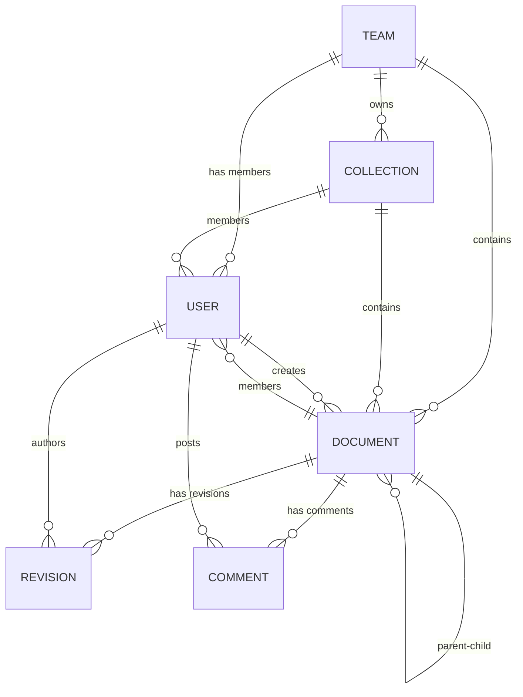
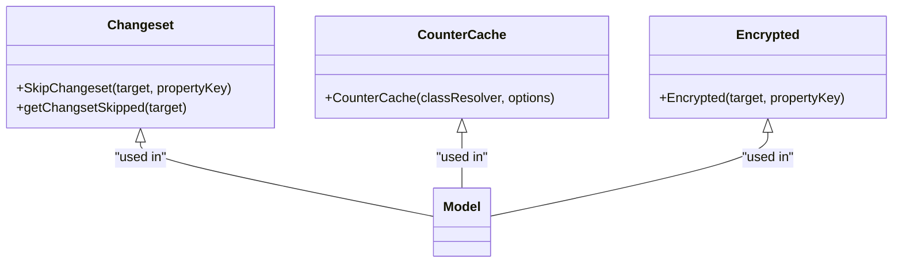
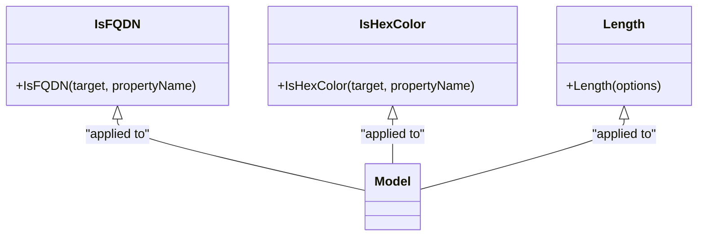

# ORM Models

<cite>
**Referenced Files in This Document**   
- [Model.ts](file://server/models/base/Model.ts)
- [ParanoidModel.ts](file://server/models/base/ParanoidModel.ts)
- [ArchivableModel.ts](file://server/models/base/ArchivableModel.ts)
- [Changeset.ts](file://server/models/decorators/Changeset.ts)
- [CounterCache.ts](file://server/models/decorators/CounterCache.ts)
- [Encrypted.ts](file://server/models/decorators/Encrypted.ts)
- [IsFQDN.ts](file://server/models/validators/IsFQDN.ts)
- [IsHexColor.ts](file://server/models/validators/IsHexColor.ts)
- [Length.ts](file://server/models/validators/Length.ts)
- [Team.ts](file://server/models/Team.ts)
- [User.ts](file://server/models/User.ts)
- [Collection.ts](file://server/models/Collection.ts)
- [Document.ts](file://server/models/Document.ts)
- [Revision.ts](file://server/models/Revision.ts)
- [Comment.ts](file://server/models/Comment.ts)
</cite>

## Table of Contents
1. [Introduction](#introduction)
2. [Base Model Classes](#base-model-classes)
3. [Entity Relationships](#entity-relationships)
4. [Decorators System](#decorators-system)
5. [Validation System](#validation-system)
6. [Database Schema Details](#database-schema-details)
7. [Data Lifecycle and Soft-Delete Patterns](#data-lifecycle-and-soft-delete-patterns)
8. [Data Access Patterns and Query Optimizations](#data-access-patterns-and-query-optimizations)
9. [Data Integrity and Transaction Management](#data-integrity-and-transaction-management)
10. [Conclusion](#conclusion)

## Introduction
This document provides comprehensive documentation for the baozi Sequelize ORM models, detailing the entity relationships between core models including User, Team, Collection, Document, Revision, and Comment. The documentation covers the base classes that provide common functionality, the decorators system used for model enhancements, the validation system with custom validators, database schema details, data lifecycle patterns, and common data access patterns. The models are designed to support a collaborative document management system with features like soft deletes, archival, and real-time collaboration.

## Base Model Classes

The ORM architecture is built upon a hierarchy of base model classes that provide common functionality across all entities. The foundation is the `Model` class which extends Sequelize's base model and adds event tracking capabilities. The `ParanoidModel` extends `Model` by adding soft-delete functionality through a `deletedAt` timestamp. The `ArchivableModel` further extends `ParanoidModel` by adding archival capabilities with an `archivedAt` timestamp. These base classes ensure consistent behavior across all models, including automatic event logging for create, update, and delete operations, and provide methods to check if a model has been deleted or archived.

**Section sources**
- [Model.ts](file://server/models/base/Model.ts#L1-L449)
- [ParanoidModel.ts](file://server/models/base/ParanoidModel.ts#L1-L22)
- [ArchivableModel.ts](file://server/models/base/ArchivableModel.ts#L1-L25)

## Entity Relationships

The core entities in the system are interconnected through well-defined relationships that support the collaborative document management functionality. The `Team` model serves as the top-level container, with `User` models belonging to a team. `Collection` models are owned by a team and contain `Document` models. Documents can have parent-child relationships with other documents, forming hierarchical structures. `Revision` models track changes to documents over time, while `Comment` models allow for discussions on specific documents. The relationships are implemented using Sequelize's association methods, including `HasMany`, `BelongsTo`, and `BelongsToMany`, with appropriate foreign key constraints.

**Diagram sources**
- [Team.ts](file://server/models/Team.ts#L1-L477)
- [User.ts](file://server/models/User.ts#L1-L800)
- [Collection.ts](file://server/models/Collection.ts#L1-L1011)
- [Document.ts](file://server/models/Document.ts#L1-L1318)
- [Revision.ts](file://server/models/Revision.ts#L1-L236)
- [Comment.ts](file://server/models/Comment.ts#L1-L168)

## Decorators System

The models utilize a decorators system to enhance functionality and maintain clean code organization. The `Changeset` decorator is used to exclude specific properties from being included in change tracking, which is useful for virtual or blob fields. The `CounterCache` decorator implements caching for relationship counts, improving performance by avoiding expensive database queries. The `Encrypted` decorator provides transparent encryption and decryption of sensitive data at the database level, ensuring that fields like JWT secrets are stored securely. These decorators are applied at the property level and leverage TypeScript's decorator syntax to modify the behavior of model properties.

**Diagram sources**
- [Changeset.ts](file://server/models/decorators/Changeset.ts#L1-L24)
- [CounterCache.ts](file://server/models/decorators/CounterCache.ts#L1-L84)
- [Encrypted.ts](file://server/models/decorators/Encrypted.ts#L1-L76)

## Validation System

The validation system is implemented using custom validators that are applied as decorators to model properties. The `IsFQDN` validator ensures that string values are fully qualified domain names, which is used for team domains. The `IsHexColor` validator checks that string values are valid hexadecimal color codes, used for collection and document icons. The `Length` validator enforces size constraints on string properties, with special handling for Unicode characters. These validators are integrated with Sequelize's validation system and provide clear error messages when validation fails. The validation rules are defined at the model level and are automatically applied during model creation and updates.

**Diagram sources**
- [IsFQDN.ts](file://server/models/validators/IsFQDN.ts#L1-L18)
- [IsHexColor.ts](file://server/models/validators/IsHexColor.ts#L1-L18)
- [Length.ts](file://server/models/validators/Length.ts#L1-L28)

## Database Schema Details

The database schema is designed with primary keys, foreign keys, indexes, and constraints to ensure data integrity and optimal query performance. Each model has a UUID primary key, and foreign keys are used to establish relationships between entities. Indexes are strategically placed on frequently queried fields such as `teamId`, `collectionId`, and `documentId` to improve query performance. Unique constraints are applied to fields like `urlId` and `subdomain` to prevent duplicates. The schema also includes soft-delete and archival fields (`deletedAt` and `archivedAt`) that allow for data recovery and historical tracking without permanent deletion.

**Section sources**
- [Team.ts](file://server/models/Team.ts#L1-L477)
- [User.ts](file://server/models/User.ts#L1-L800)
- [Collection.ts](file://server/models/Collection.ts#L1-L1011)
- [Document.ts](file://server/models/Document.ts#L1-L1318)

## Data Lifecycle and Soft-Delete Patterns

The data lifecycle is managed through a combination of soft-delete and archival patterns. When a model is deleted, the `deletedAt` timestamp is set rather than removing the record from the database, allowing for potential recovery. Similarly, when a collection or document is archived, the `archivedAt` timestamp is set, making it invisible to most queries while preserving the data. These patterns are implemented through the base model classes and are automatically handled by the ORM. The lifecycle is further enhanced by event tracking, which records create, update, and delete operations for audit purposes. This approach ensures data integrity while providing flexibility for data recovery and historical analysis.

**Section sources**
- [Model.ts](file://server/models/base/Model.ts#L1-L449)
- [ParanoidModel.ts](file://server/models/base/ParanoidModel.ts#L1-L22)
- [ArchivableModel.ts](file://server/models/base/ArchivableModel.ts#L1-L25)

## Data Access Patterns and Query Optimizations

The models implement several data access patterns and query optimizations to improve performance and reduce database load. The `CounterCache` decorator caches relationship counts, eliminating the need for expensive COUNT queries. Scopes are used to define common query patterns, such as loading a document with its collection membership or user permissions. The `findByPk` method is overridden in several models to support querying by both UUID and URL ID, providing flexibility in API endpoints. Transaction management is used to ensure data consistency during complex operations, and hooks are leveraged to maintain data integrity across related models. These patterns ensure efficient data access while maintaining the integrity of the application's data.

**Section sources**
- [CounterCache.ts](file://server/models/decorators/CounterCache.ts#L1-L84)
- [Collection.ts](file://server/models/Collection.ts#L1-L1011)
- [Document.ts](file://server/models/Document.ts#L1-L1318)

## Data Integrity and Transaction Management

Data integrity is maintained through a combination of database constraints, application-level validation, and transaction management. Foreign key constraints ensure referential integrity between related models, while unique constraints prevent duplicate entries. Application-level validation is performed using custom validators that check data format and business rules. Transactions are used to group related operations, ensuring that either all changes are committed or none are, maintaining consistency across multiple models. The event system also contributes to data integrity by providing an audit trail of all changes. This multi-layered approach ensures that the data remains consistent and reliable throughout the application's lifecycle.

**Section sources**
- [Model.ts](file://server/models/base/Model.ts#L1-L449)
- [Team.ts](file://server/models/Team.ts#L1-L477)
- [User.ts](file://server/models/User.ts#L1-L800)

## Conclusion

The baozi Sequelize ORM models provide a robust foundation for a collaborative document management system. The hierarchical base model classes, comprehensive entity relationships, decorators system, and validation framework work together to create a maintainable and scalable architecture. The implementation of soft-delete and archival patterns, combined with efficient data access patterns and strong data integrity controls, ensures that the system can handle complex workflows while maintaining data consistency. This documentation provides a comprehensive overview of the models, serving as a reference for developers working with the codebase.