# Service Layer

<cite>
**Referenced Files in This Document**   
- [web.ts](file://server/services/web.ts)
- [collaboration.ts](file://server/services/collaboration.ts)
- [worker.ts](file://server/services/worker.ts)
- [cron.ts](file://server/services/cron.ts)
- [documentCreator.ts](file://server/commands/documentCreator.ts)
- [queue.ts](file://server/queues/queue.ts)
- [NotificationsProcessor.ts](file://server/queues/processors/NotificationsProcessor.ts)
- [ExportDocumentTreeTask.ts](file://server/queues/tasks/ExportDocumentTreeTask.ts)
- [CleanupExpiredAttachmentsTask.ts](file://server/queues/tasks/CleanupExpiredAttachmentsTask.ts)
- [commands/](file://server/commands/)
- [queues/processors/](file://server/queues/processors/)
- [queues/tasks/](file://server/queues/tasks/)
</cite>

## Table of Contents
1. [Introduction](#introduction)
2. [Project Structure](#project-structure)
3. [Core Components](#core-components)
4. [Architecture Overview](#architecture-overview)
5. [Detailed Component Analysis](#detailed-component-analysis)
6. [Dependency Analysis](#dependency-analysis)
7. [Performance Considerations](#performance-considerations)
8. [Troubleshooting Guide](#troubleshooting-guide)
9. [Conclusion](#conclusion)

## Introduction
This document provides comprehensive architectural documentation for the baozi service layer. It describes the modular service architecture consisting of web, collaboration, worker, and cron services. The document explains the responsibilities of each service, their interaction patterns, and key implementation details including the command pattern for business operations, background job processing with Bull queues, real-time collaboration via WebSockets, and scheduled task execution. The analysis covers scalability, error handling, monitoring, and service coordination for common operations.

## Project Structure
The baozi service layer is organized into a modular architecture with distinct services handling specific responsibilities. The core services are located in the `server/services/` directory, with supporting components in `server/commands/`, `server/queues/`, and `server/collaboration/`. This structure enables separation of concerns while maintaining cohesive integration through well-defined interfaces and event-driven communication.

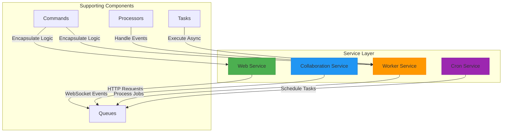

**Diagram sources**
- [web.ts](file://server/services/web.ts)
- [collaboration.ts](file://server/services/collaboration.ts)
- [worker.ts](file://server/services/worker.ts)
- [cron.ts](file://server/services/cron.ts)

**Section sources**
- [server/services/](file://server/services/)
- [server/commands/](file://server/commands/)
- [server/queues/](file://server/queues/)

## Core Components
The baozi service layer consists of four primary services: web, collaboration, worker, and cron. Each service has distinct responsibilities and operates as an independent process while sharing the same codebase and database. The web service handles HTTP requests and serves the application, the collaboration service manages real-time document editing through WebSockets, the worker service processes background jobs, and the cron service executes scheduled tasks. These services communicate through a shared Redis-backed queue system, enabling asynchronous processing and decoupled architecture.

**Section sources**
- [web.ts](file://server/services/web.ts)
- [collaboration.ts](file://server/services/collaboration.ts)
- [worker.ts](file://server/services/worker.ts)
- [cron.ts](file://server/services/cron.ts)

## Architecture Overview
The baozi service layer implements a microservices-inspired architecture with four specialized services that can be scaled independently based on workload requirements. The architecture follows a command-query responsibility segregation (CQRS) pattern where the web service handles synchronous requests while background processing is delegated to worker services through message queues. All services share access to the same database and Redis instances, ensuring data consistency while enabling horizontal scaling of stateless services.

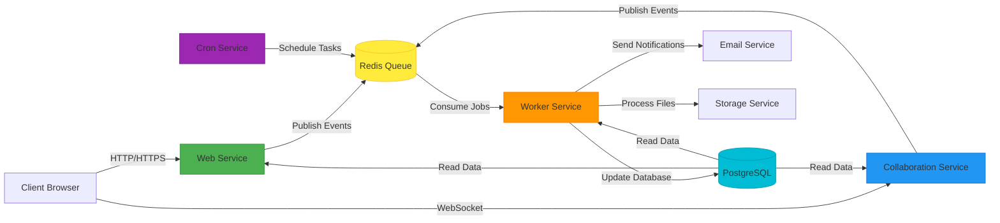

**Diagram sources**
- [web.ts](file://server/services/web.ts)
- [collaboration.ts](file://server/services/collaboration.ts)
- [worker.ts](file://server/services/worker.ts)
- [cron.ts](file://server/services/cron.ts)
- [queue.ts](file://server/queues/queue.ts)

## Detailed Component Analysis

### Web Service Analysis
The web service is responsible for handling HTTP requests, serving the application, and providing API endpoints. It is implemented as a Koa application that routes requests to appropriate handlers. The service includes middleware for security (CSP, CSRF protection), compression, and SSL enforcement. It serves static assets and mounts API, authentication, and OAuth routes. The web service also generates and attaches CSRF tokens to sessions for non-API requests.

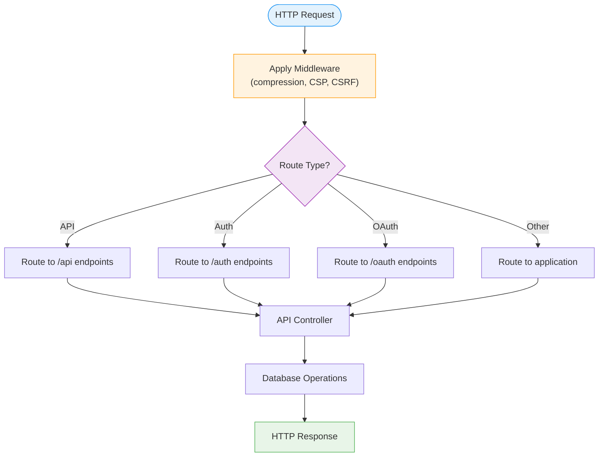

**Diagram sources**
- [web.ts](file://server/services/web.ts)

**Section sources**
- [web.ts](file://server/services/web.ts)

### Collaboration Service Analysis
The collaboration service manages real-time document editing through WebSocket connections using the Hocuspocus server. It handles document synchronization, presence tracking, and collaborative editing state. The service implements authentication, connection limiting, and persistence extensions to ensure secure and reliable real-time collaboration. WebSocket connections are upgraded from HTTP requests on the "/collaboration" path, with document ID extracted from the URL for routing to the appropriate document state.

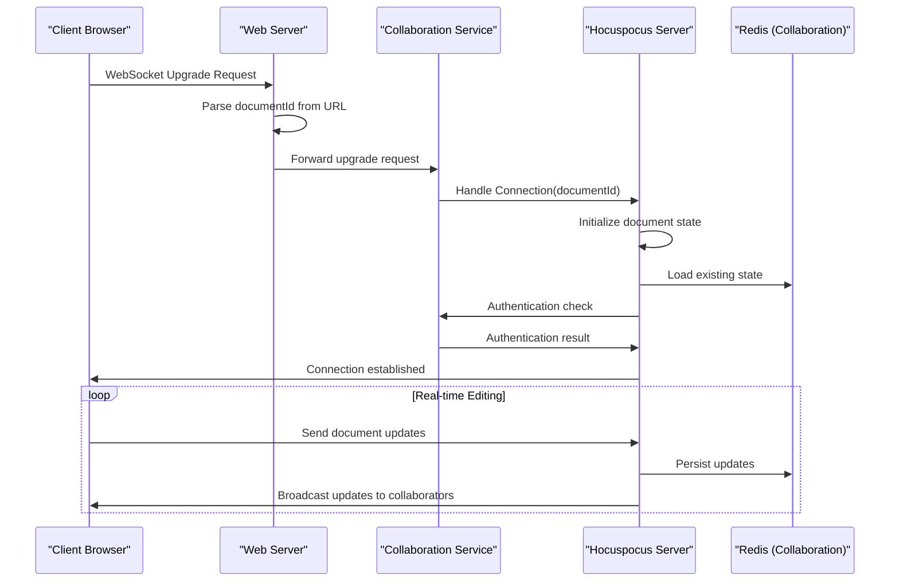

**Diagram sources**
- [collaboration.ts](file://server/services/collaboration.ts)
- [collaboration/](file://server/collaboration/)

**Section sources**
- [collaboration.ts](file://server/services/collaboration.ts)
- [collaboration/](file://server/collaboration/)

### Worker Service Analysis
The worker service processes background jobs using Bull queues with Redis as the message broker. It handles three types of queues: global event queue for system events, processor event queue for event-specific processing, and task queue for asynchronous tasks. The worker service implements comprehensive error handling, retry mechanisms, and monitoring through health checks. Each job is processed with distributed tracing and metrics collection for observability.

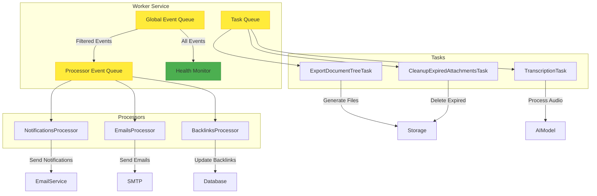

**Diagram sources**
- [worker.ts](file://server/services/worker.ts)
- [queues/](file://server/queues/)
- [queues/processors/](file://server/queues/processors/)
- [queues/tasks/](file://server/queues/tasks/)

**Section sources**
- [worker.ts](file://server/services/worker.ts)
- [queues/](file://server/queues/)
- [queues/processors/](file://server/queues/processors/)
- [queues/tasks/](file://server/queues/tasks/)

### Cron Service Analysis
The cron service executes scheduled tasks at predefined intervals (minute, hourly, daily). It scans the registered tasks and schedules those matching the current interval. The service uses setInterval to trigger task execution at the appropriate frequency. Tasks are scheduled through the Bull queue system, ensuring they are processed by available worker services. The cron service provides a scalable mechanism for periodic maintenance, cleanup, and reporting operations.

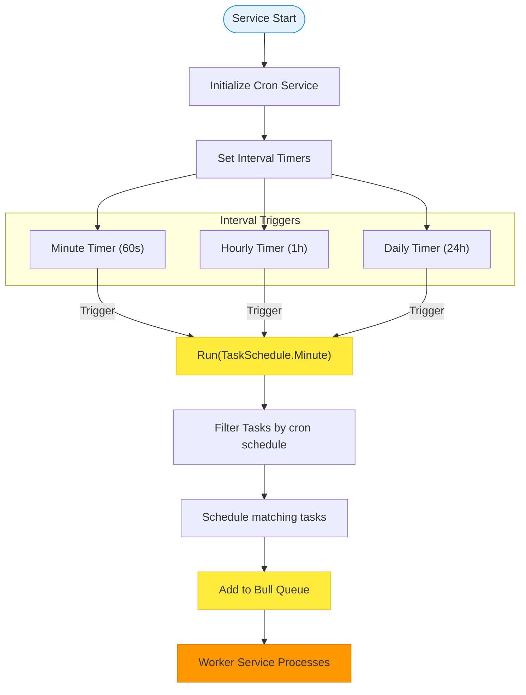

**Diagram sources**
- [cron.ts](file://server/services/cron.ts)
- [queues/tasks/](file://server/queues/tasks/)

**Section sources**
- [cron.ts](file://server/services/cron.ts)
- [queues/tasks/](file://server/queues/tasks/)

### Command Pattern Implementation
The command pattern is implemented in the `commands/` directory to encapsulate complex business operations. Each command is a standalone module that accepts parameters and executes a specific business operation with proper error handling and transaction management. Commands are used across services to ensure consistent business logic execution. The pattern promotes reusability, testability, and separation of concerns by isolating business logic from service-specific concerns.

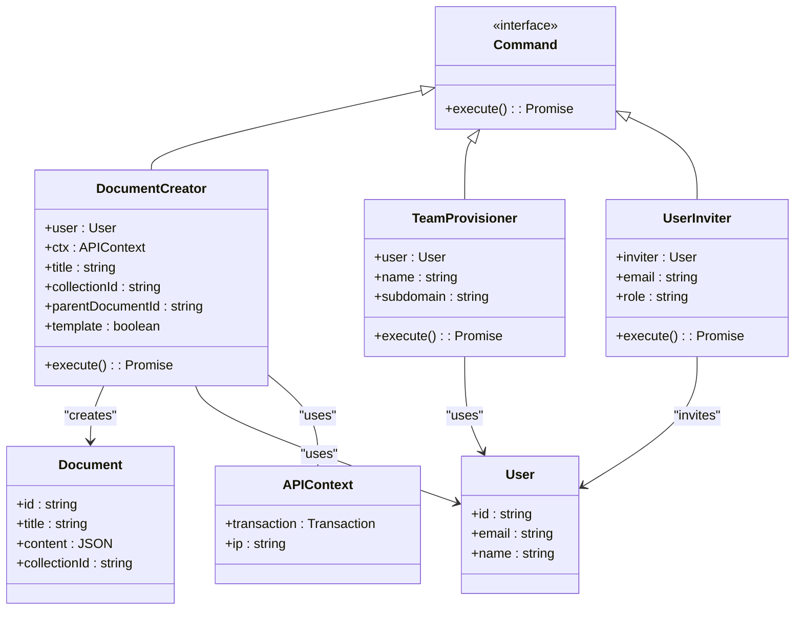

**Diagram sources**
- [commands/documentCreator.ts](file://server/commands/documentCreator.ts)
- [commands/teamProvisioner.ts](file://server/commands/teamProvisioner.ts)
- [commands/userInviter.ts](file://server/commands/userInviter.ts)

**Section sources**
- [commands/](file://server/commands/)

### Background Job Processing System
The background job processing system uses Bull queues with Redis as the message broker to handle asynchronous tasks and event processing. The system consists of three main queues: global event queue for incoming events, processor event queue for filtered events, and task queue for scheduled and on-demand tasks. Each queue has configurable concurrency and retry policies. The system includes health monitoring to track queue metrics and ensure reliable processing.

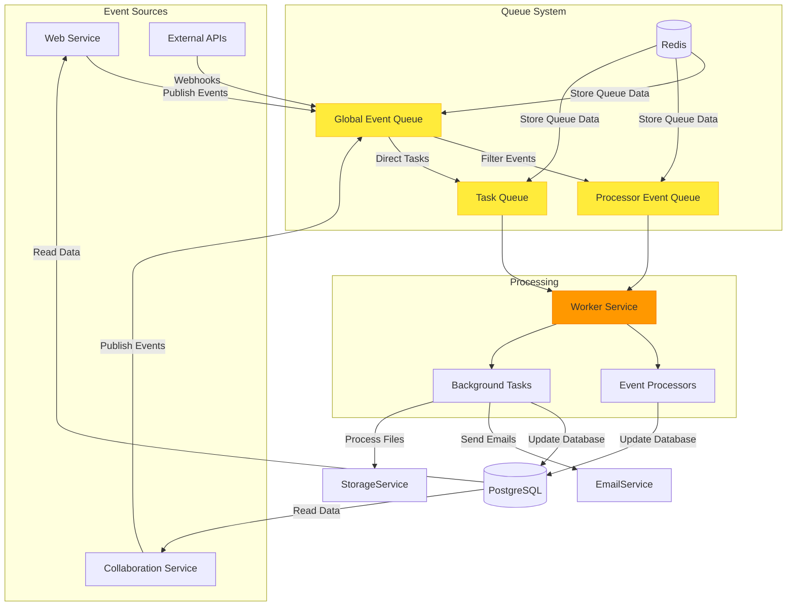

**Diagram sources**
- [worker.ts](file://server/services/worker.ts)
- [queues/](file://server/queues/)
- [queues/processors/](file://server/queues/processors/)
- [queues/tasks/](file://server/queues/tasks/)

**Section sources**
- [worker.ts](file://server/services/worker.ts)
- [queues/](file://server/queues/)
- [queues/processors/](file://server/queues/processors/)
- [queues/tasks/](file://server/queues/tasks/)

### Real-time Collaboration Service
The real-time collaboration service enables multiple users to edit documents simultaneously with low latency. It uses WebSockets to establish persistent connections between clients and the server. The service leverages the Hocuspocus framework for Operational Transformation (OT) to resolve concurrent edits and maintain document consistency. The architecture includes extensions for authentication, connection limiting, persistence, and metrics collection to ensure secure and reliable collaboration.

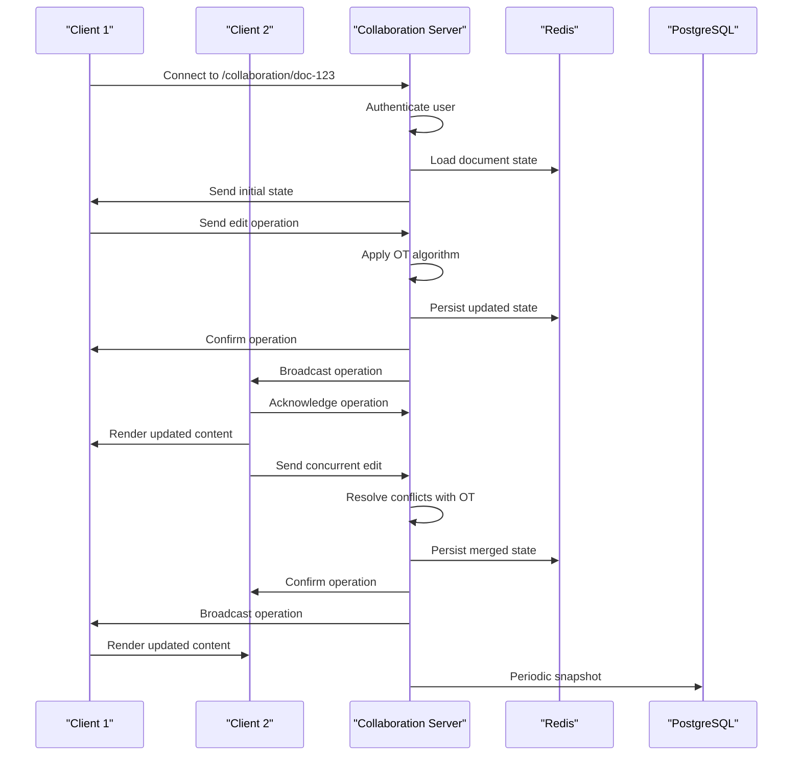

**Diagram sources**
- [collaboration.ts](file://server/services/collaboration.ts)
- [collaboration/](file://server/collaboration/)

**Section sources**
- [collaboration.ts](file://server/services/collaboration.ts)
- [collaboration/](file://server/collaboration/)

### Service Coordination Examples
The baozi service layer demonstrates effective service coordination for common operations such as document creation and team provisioning. When a document is created, the web service validates input and delegates to the documentCreator command. Upon successful creation, an event is published to the global queue, triggering notifications, revision tracking, and other side effects through the worker service. Similarly, team provisioning involves coordinated actions across multiple services with proper error handling and rollback mechanisms.

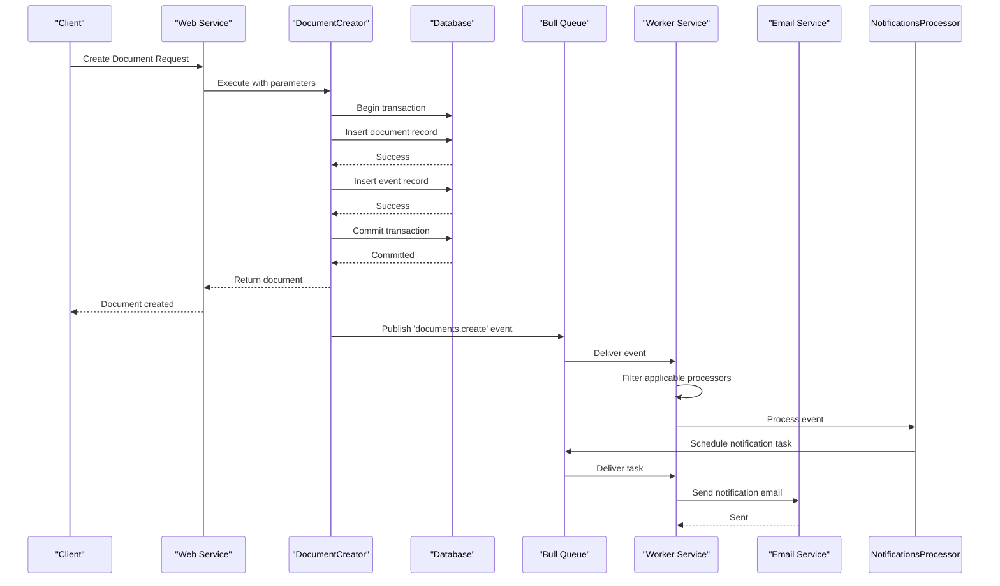

**Diagram sources**
- [documentCreator.ts](file://server/commands/documentCreator.ts)
- [worker.ts](file://server/services/worker.ts)
- [NotificationsProcessor.ts](file://server/queues/processors/NotificationsProcessor.ts)

**Section sources**
- [commands/documentCreator.ts](file://server/commands/documentCreator.ts)
- [worker.ts](file://server/services/worker.ts)
- [queues/processors/NotificationsProcessor.ts](file://server/queues/processors/NotificationsProcessor.ts)

## Dependency Analysis
The baozi service layer components have well-defined dependencies that enable loose coupling and independent scaling. The web, collaboration, worker, and cron services share dependencies on the database, Redis, and common utilities, but communicate primarily through message queues rather than direct service-to-service calls. This architecture minimizes tight coupling while ensuring reliable communication through the durable Redis-backed queue system.

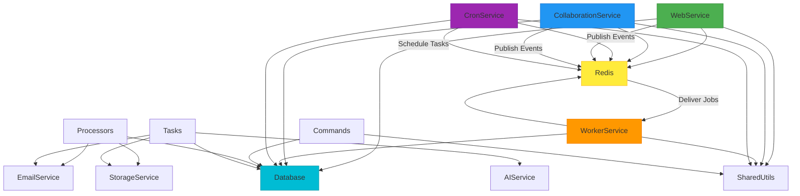

**Diagram sources**
- [web.ts](file://server/services/web.ts)
- [collaboration.ts](file://server/services/collaboration.ts)
- [worker.ts](file://server/services/worker.ts)
- [cron.ts](file://server/services/cron.ts)
- [commands/](file://server/commands/)
- [queues/](file://server/queues/)

**Section sources**
- [server/services/](file://server/services/)
- [server/commands/](file://server/commands/)
- [server/queues/](file://server/queues/)

## Performance Considerations
The baozi service layer incorporates several performance optimizations to handle high loads efficiently. The web service uses compression middleware to reduce response sizes and implements connection monitoring to track active connections. The worker service supports configurable concurrency levels for different queue types, allowing resource allocation based on workload characteristics. Redis is used extensively for caching, session storage, and queue persistence, providing low-latency data access. The architecture supports horizontal scaling of stateless services (web, worker) to handle increased load.

**Section sources**
- [web.ts](file://server/services/web.ts)
- [worker.ts](file://server/services/worker.ts)
- [queue.ts](file://server/queues/queue.ts)

## Troubleshooting Guide
The baozi service layer includes comprehensive monitoring and error handling mechanisms to facilitate troubleshooting. Each service logs key operations and errors with structured logging that includes contextual information. The worker service implements retry mechanisms with exponential backoff for transient failures. Health monitors track queue metrics and system performance. Distributed tracing provides visibility into request flows across services. When troubleshooting issues, examine service logs, queue metrics, and database performance metrics to identify bottlenecks or failures.

**Section sources**
- [logging/](file://server/logging/)
- [worker.ts](file://server/services/worker.ts)
- [HealthMonitor.ts](file://server/queues/HealthMonitor.ts)
- [tracer.ts](file://server/logging/tracer.ts)

## Conclusion
The baozi service layer implements a robust, scalable architecture with well-defined separation of concerns between web, collaboration, worker, and cron services. The modular design enables independent scaling and maintenance of each component while maintaining cohesive integration through message queues and shared data stores. The command pattern ensures consistent business logic execution, while the background job processing system handles asynchronous operations reliably. The real-time collaboration service provides seamless multi-user editing capabilities, and the cron service enables scheduled maintenance tasks. This architecture balances performance, reliability, and maintainability, providing a solid foundation for the baozi application.