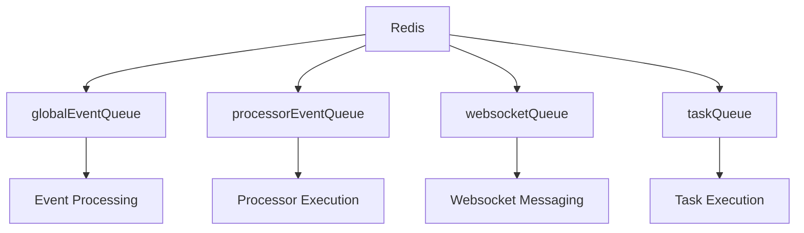
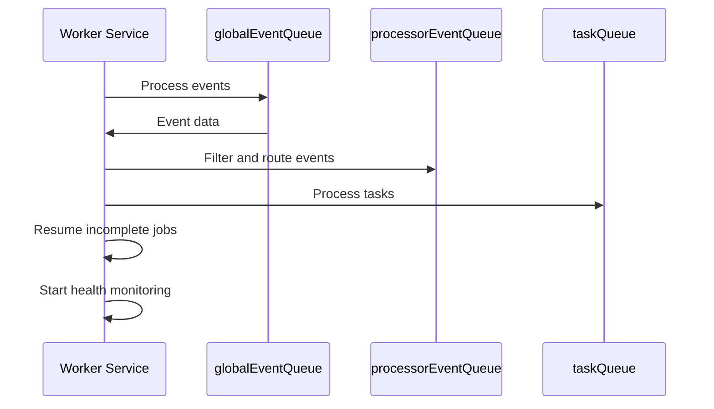
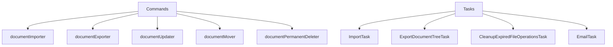
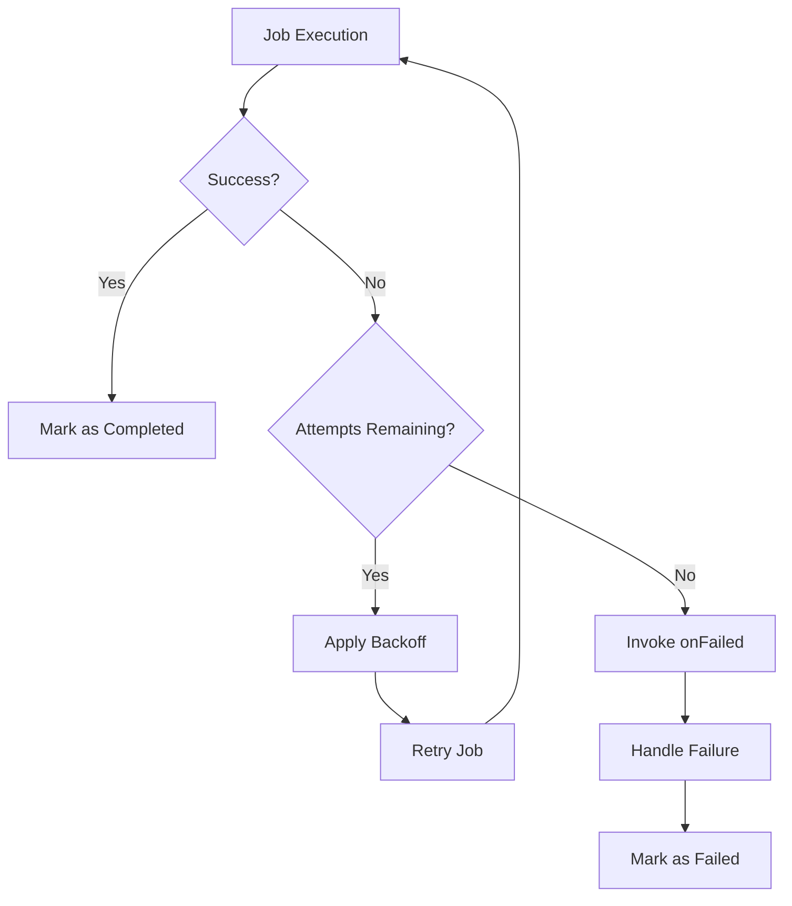
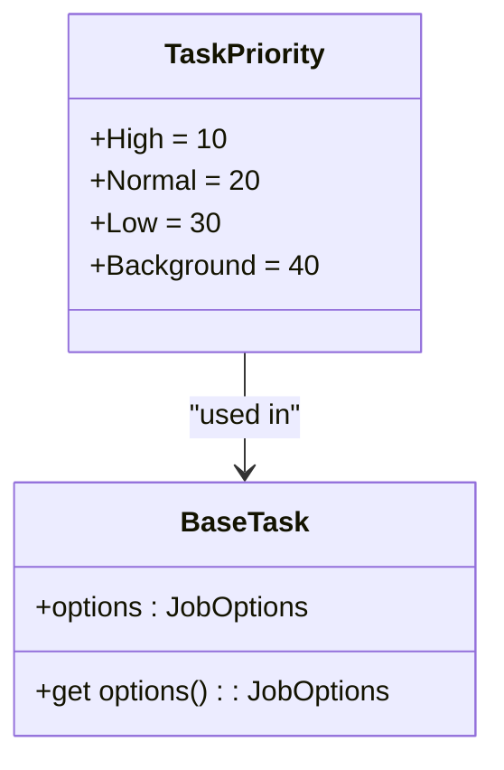
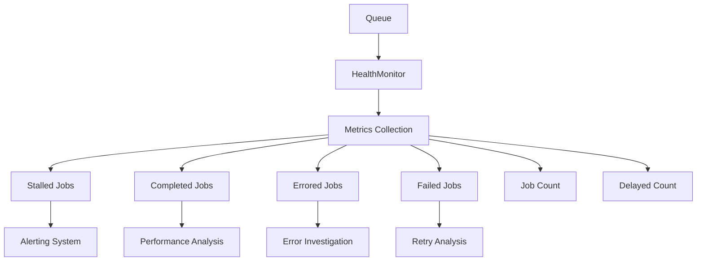
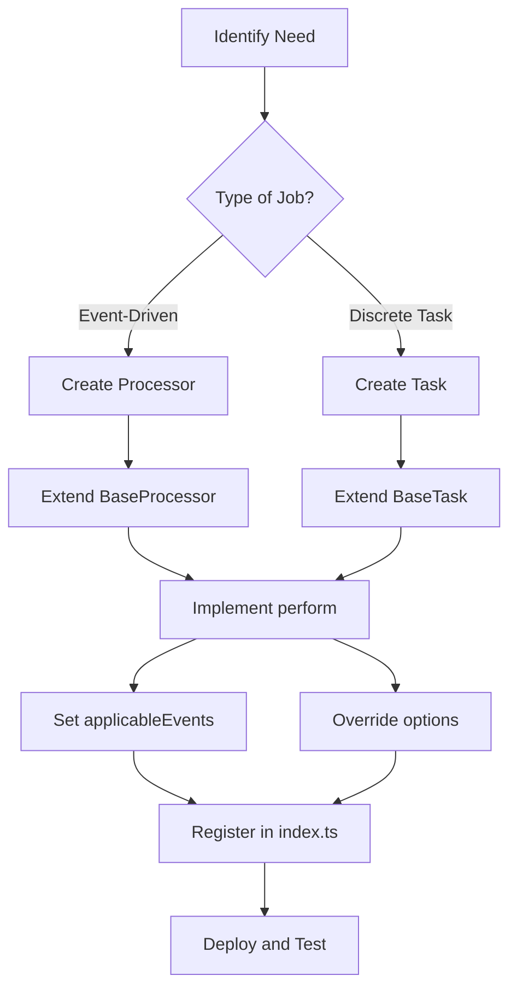
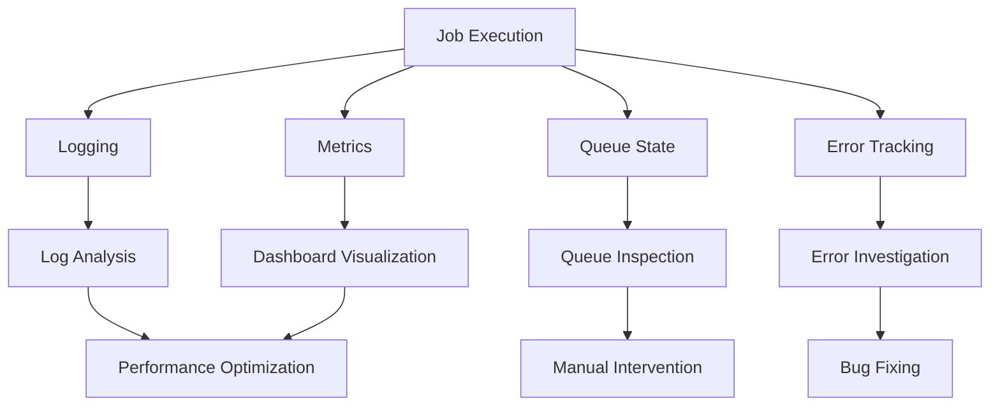

# Background Jobs & Queues

<cite>
**Referenced Files in This Document**   
- [worker.ts](file://server/services/worker.ts)
- [queue.ts](file://server/queues/queue.ts)
- [index.ts](file://server/queues/index.ts)
- [BaseProcessor.ts](file://server/queues/processors/BaseProcessor.ts)
- [ImportsProcessor.ts](file://server/queues/processors/ImportsProcessor.ts)
- [BaseTask.ts](file://server/queues/tasks/BaseTask.ts)
- [ImportTask.ts](file://server/queues/tasks/ImportTask.ts)
- [ExportDocumentTreeTask.ts](file://server/queues/tasks/ExportDocumentTreeTask.ts)
- [CleanupExpiredFileOperationsTask.ts](file://server/queues/tasks/CleanupExpiredFileOperationsTask.ts)
</cite>

## Table of Contents
1. [Introduction](#introduction)
2. [Queue Architecture](#queue-architecture)
3. [Worker Service](#worker-service)
4. [Job Types and Commands](#job-types-and-commands)
5. [Processors](#processors)
6. [Error Handling and Retry Mechanisms](#error-handling-and-retry-mechanisms)
7. [Job Prioritization and Concurrency Control](#job-prioritization-and-concurrency-control)
8. [Monitoring and Health Checks](#monitoring-and-health-checks)
9. [Creating New Background Jobs](#creating-new-background-jobs)
10. [Monitoring Job Execution](#monitoring-job-execution)

## Introduction

The baozi application implements a robust asynchronous processing system using Bull for Redis-based job queuing. This system handles various background operations such as document import, export, cleanup tasks, and event processing. The architecture separates concerns between different types of jobs, with dedicated queues for global events, processor events, websockets, and general tasks. This document provides comprehensive coverage of the background job system, explaining both conceptual foundations for beginners and technical details for experienced developers.

## Queue Architecture

The baozi application utilizes Bull, a Redis-based queue system, to manage background jobs. The architecture consists of four primary queues that handle different categories of asynchronous operations:



**Diagram sources**
- [index.ts](file://server/queues/index.ts#L3-L29)
- [queue.ts](file://server/queues/queue.ts#L9-L67)

Each queue is created with specific configuration options that define retry behavior and backoff strategies. The `globalEventQueue` handles incoming events from the application, while the `processorEventQueue` processes events that require specific handling by registered processors. The `websocketQueue` manages websocket-related operations, and the `taskQueue` handles discrete background tasks such as imports, exports, and cleanup operations.

**Section sources**
- [index.ts](file://server/queues/index.ts#L3-L29)
- [queue.ts](file://server/queues/queue.ts#L9-L67)

## Worker Service

The worker service in `server/services/worker.ts` is responsible for processing jobs from the various queues. It initializes three main processing streams: one for global events, one for processor events, and one for tasks. The worker service also handles the resumption of incomplete transcription jobs on startup, ensuring that interrupted operations can be recovered.



**Diagram sources**
- [worker.ts](file://server/services/worker.ts#L0-L246)

The worker service processes jobs concurrently based on environment configuration variables (`WORKER_CONCURRENCY_EVENTS` and `WORKER_CONCURRENCY_TASKS`). It uses tracing and logging to monitor job execution and implements error handling to ensure failed jobs are properly reported and processed according to their retry policies.

**Section sources**
- [worker.ts](file://server/services/worker.ts#L0-L246)

## Job Types and Commands

The baozi application implements various job types in the `server/commands/` directory for operations such as document import, export, and cleanup. These commands are invoked by background jobs to perform specific actions asynchronously. The `server/queues/tasks/` directory contains implementations for different task types, including:

- **Import tasks**: Handle document import operations from various formats
- **Export tasks**: Manage document export to different formats (HTML, Markdown, JSON)
- **Cleanup tasks**: Perform periodic cleanup of expired or unnecessary data
- **Notification tasks**: Handle sending emails and other notifications



**Diagram sources**
- [commands](file://server/commands/)
- [tasks](file://server/queues/tasks/)

Each task type extends the `BaseTask` class, which provides common functionality for scheduling and executing background jobs. Tasks are designed to be stateless and idempotent, allowing them to be retried safely in case of failures.

**Section sources**
- [commands](file://server/commands/)
- [tasks](file://server/queues/tasks/)

## Processors

Processors in the `server/queues/processors/` directory handle specific categories of events and operations. Each processor extends the `BaseProcessor` class and implements the `perform` method to define its behavior. Processors are registered in the worker service and are invoked when relevant events occur.

The `ImportsProcessor` is a key example of a processor implementation, handling the import lifecycle from creation to completion. It processes events related to imports, including `imports.create`, `imports.processed`, and `imports.delete`. The processor coordinates the creation of collections and documents from imported data, managing the mapping of external IDs to internal IDs and updating references to attachments and mentions.

```mermaid
classDiagram
class BaseProcessor {
+static applicableEvents : string[]
+perform(event : Event) : Promise~void~
+onFailed(event : Event) : Promise~void~
}
class ImportsProcessor {
-canProcess(importModel : Import) : boolean
-buildTasksInput(importModel : Import, transaction : Transaction) : Promise~ImportTaskInput~
-scheduleTask(importTask : ImportTask) : Promise~void~
-onCreation(importModel : Import, transaction : Transaction) : Promise~void~
-onProcessed(importModel : Import, transaction : Transaction) : Promise~void~
-onDeletion(importModel : Import, event : ImportEvent, transaction : Transaction) : Promise~void~
-createCollectionsAndDocuments(importModel : Import, transaction : Transaction) : Promise~{collections : Collection[]}~
-updateMentionsAndAttachments(content : ProsemirrorDoc, attachments : Attachment[], idMap : Record~string, string~, importInput : Record~string, ImportInput~any~[number]~, actorId : string, teamId : string) : Promise~ProsemirrorDoc~
-getInternalId(externalId : string, idMap : Record~string, string~, teamId? : string) : Promise~string~
}
BaseProcessor <|-- ImportsProcessor
```

**Diagram sources**
- [BaseProcessor.ts](file://server/queues/processors/BaseProcessor.ts#L0-L18)
- [ImportsProcessor.ts](file://server/queues/processors/ImportsProcessor.ts#L0-L630)

Processors are designed to be modular and extensible, allowing new event types to be handled by implementing additional processor classes. They use database transactions to ensure data consistency and implement error handling to manage failures gracefully.

**Section sources**
- [BaseProcessor.ts](file://server/queues/processors/BaseProcessor.ts#L0-L18)
- [ImportsProcessor.ts](file://server/queues/processors/ImportsProcessor.ts#L0-L630)

## Error Handling and Retry Mechanisms

The baozi application implements comprehensive error handling and retry mechanisms for failed jobs. Each queue is configured with a default retry strategy that uses exponential backoff, allowing jobs to be retried multiple times before being marked as failed. The retry configuration is defined in the queue creation process, with five attempts and exponential backoff delays.

When a job fails, the system captures the error and logs it for debugging purposes. If all retry attempts are exhausted, the `onFailed` method of the corresponding task or processor is invoked to handle the final failure state. This method can perform cleanup operations, update status fields, or trigger notifications to alert administrators of the failure.



**Diagram sources**
- [BaseTask.ts](file://server/queues/tasks/BaseTask.ts#L0-L72)
- [BaseProcessor.ts](file://server/queues/processors/BaseProcessor.ts#L0-L18)

The error handling system is designed to be resilient, ensuring that transient failures do not result in permanent data loss or inconsistent states. For example, the `ImportTask` class implements transactional processing, rolling back database changes if an error occurs during import processing.

**Section sources**
- [BaseTask.ts](file://server/queues/tasks/BaseTask.ts#L0-L72)
- [BaseProcessor.ts](file://server/queues/processors/BaseProcessor.ts#L0-L18)

## Job Prioritization and Concurrency Control

The baozi application implements job prioritization through the `TaskPriority` enum, which defines different priority levels for background tasks. Tasks can be assigned high, normal, low, or background priority, allowing critical operations to be processed before less important ones. This prioritization is implemented using Bull's built-in priority system, which ensures that higher-priority jobs are processed first.

Concurrency is controlled through environment variables that define the maximum number of concurrent jobs for events and tasks. The worker service processes jobs in parallel based on these configuration values, allowing the system to handle multiple operations simultaneously while preventing resource exhaustion.



**Diagram sources**
- [BaseTask.ts](file://server/queues/tasks/BaseTask.ts#L0-L72)

The system also implements rate limiting for certain operations through the use of cron schedules and delayed job execution. For example, cleanup tasks are scheduled to run hourly or daily, preventing them from consuming excessive resources during peak usage periods.

**Section sources**
- [BaseTask.ts](file://server/queues/tasks/BaseTask.ts#L0-L72)

## Monitoring and Health Checks

The baozi application includes a health monitoring system implemented in `server/queues/HealthMonitor.ts`. This system tracks the status of all queues and provides metrics for job counts, completion rates, and error rates. The health monitor is started for each queue when the worker service initializes, ensuring that the system can detect and respond to issues proactively.

Metrics are collected using the application's metrics system, with counters for stalled, completed, errored, and failed jobs. These metrics are used to monitor queue health and identify potential performance bottlenecks. The system also tracks the number of jobs in each queue and the number of delayed jobs, providing visibility into queue backlogs.



**Diagram sources**
- [HealthMonitor.ts](file://server/queues/HealthMonitor.ts)
- [queue.ts](file://server/queues/queue.ts#L9-L67)

The monitoring system is designed to provide real-time visibility into queue performance, allowing administrators to identify and address issues before they impact users. It integrates with the application's logging system to provide detailed information about job execution and failures.

**Section sources**
- [HealthMonitor.ts](file://server/queues/HealthMonitor.ts)
- [queue.ts](file://server/queues/queue.ts#L9-L67)

## Creating New Background Jobs

To create a new background job in the baozi application, developers should follow these steps:

1. Create a new task class in `server/queues/tasks/` that extends `BaseTask`
2. Implement the `perform` method to define the job's behavior
3. Optionally override the `options` getter to customize job priority and retry behavior
4. Optionally implement the `onFailed` method to handle final failure states
5. Register the task in the `index.ts` file in the tasks directory

For event-driven processors, developers should:

1. Create a new processor class in `server/queues/processors/` that extends `BaseProcessor`
2. Define the `applicableEvents` static property to specify which events the processor should handle
3. Implement the `perform` method to define the processor's behavior
4. Register the processor in the `index.ts` file in the processors directory



**Diagram sources**
- [BaseTask.ts](file://server/queues/tasks/BaseTask.ts#L0-L72)
- [BaseProcessor.ts](file://server/queues/processors/BaseProcessor.ts#L0-L18)

When creating new jobs, developers should consider the job's impact on system resources and configure appropriate priority and concurrency settings. They should also implement comprehensive error handling to ensure the job can recover from failures gracefully.

**Section sources**
- [BaseTask.ts](file://server/queues/tasks/BaseTask.ts#L0-L72)
- [BaseProcessor.ts](file://server/queues/processors/BaseProcessor.ts#L0-L18)

## Monitoring Job Execution

Monitoring job execution in the baozi application involves several key practices:

1. **Log Analysis**: The system logs detailed information about job execution, including start and completion times, error messages, and performance metrics. These logs can be analyzed to identify patterns and troubleshoot issues.

2. **Metrics Dashboard**: The health monitoring system provides real-time metrics on job execution, including counts of completed, failed, and stalled jobs. These metrics can be visualized in a dashboard to provide an overview of system health.

3. **Queue Inspection**: Developers can inspect the state of queues using Redis tools or the Bull dashboard to view pending jobs, delayed jobs, and failed jobs. This allows for direct intervention when necessary.

4. **Error Tracking**: The system integrates with error tracking tools to capture and analyze job failures. This provides detailed stack traces and context information for debugging.



**Diagram sources**
- [worker.ts](file://server/services/worker.ts#L0-L246)
- [queue.ts](file://server/queues/queue.ts#L9-L67)

Effective monitoring requires regular review of job execution patterns and proactive identification of potential issues. Developers should establish alerting rules for critical metrics such as high failure rates or queue backlogs to ensure timely response to problems.

**Section sources**
- [worker.ts](file://server/services/worker.ts#L0-L246)
- [queue.ts](file://server/queues/queue.ts#L9-L67)