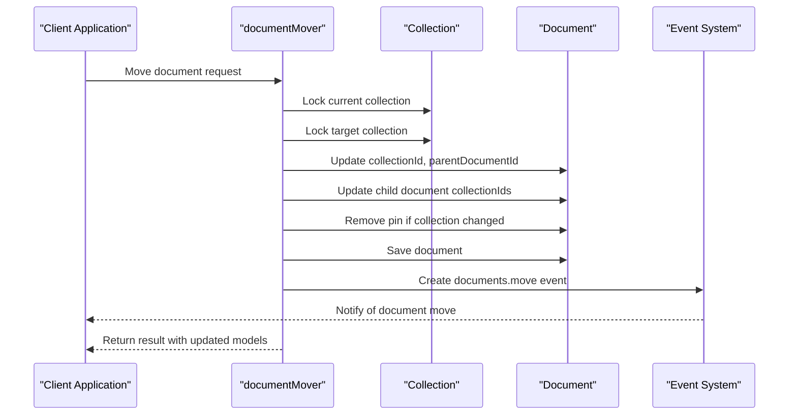
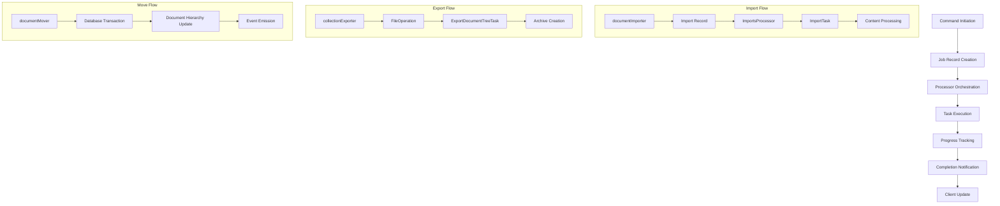

# Document Operations Jobs

<cite>
**Referenced Files in This Document**   
- [documentImporter.ts](file://server/commands/documentImporter.ts)
- [collectionExporter.ts](file://server/commands/collectionExporter.ts)
- [documentMover.ts](file://server/commands/documentMover.ts)
- [ImportsProcessor.ts](file://server/queues/processors/ImportsProcessor.ts)
- [ImportTask.ts](file://server/queues/tasks/ImportTask.ts)
- [ExportDocumentTreeTask.ts](file://server/queues/tasks/ExportDocumentTreeTask.ts)
- [Import.ts](file://server/models/Import.ts)
- [ImportTask.ts](file://server/models/ImportTask.ts)
- [FileOperation.ts](file://server/models/FileOperation.ts)
</cite>

## Table of Contents
1. [Introduction](#introduction)
2. [Document Import Operations](#document-import-operations)
3. [Document Export Operations](#document-export-operations)
4. [Document Move Operations](#document-move-operations)
5. [Job Processing Architecture](#job-processing-architecture)
6. [Error Handling and Retry Mechanisms](#error-handling-and-retry-mechanisms)
7. [Relationships with File Operations and Notifications](#relationships-with-file-operations-and-notifications)
8. [Common Issues and Troubleshooting](#common-issues-and-troubleshooting)
9. [Extending Document Operation Jobs](#extending-document-operation-jobs)
10. [Conclusion](#conclusion)

## Introduction
The baozi application implements a robust document operations system that handles import, export, and move operations through a command-processor-task architecture. These operations are initiated by commands in the server/commands/ directory and processed by corresponding processors and tasks in the background queue system. The architecture separates concerns between command execution, job scheduling, and task processing, enabling asynchronous handling of potentially long-running operations while maintaining data consistency and providing progress tracking. This document details the implementation of these document operations, focusing on the workflow from command initiation through processor execution to task completion, including error handling, retry mechanisms, and integration with file operations and notifications.

## Document Import Operations

The document import functionality in baozi is implemented through a multi-layered architecture that begins with the `documentImporter.ts` command and progresses through processors and tasks. The import process starts when a user uploads a document file, triggering the `documentImporter` command which performs initial processing of the document content. This command converts various file formats to Markdown using the `DocumentConverter`, extracts metadata such as title and icon from the content, and performs validation to ensure the document size is within acceptable limits. The command returns processed document data including text content, ProseMirror state, title, and icon, which is then used to create an import job.

The import job creation is managed through the `ImportsProcessor` class, which handles the lifecycle of import operations. When an import is initiated, the processor creates `ImportTask` instances to handle the actual import work. Each import is represented by an `Import` model that tracks the import state (Created, InProgress, Completed, or Errored), service type, and input configuration. The `ImportTask` model extends this by storing task-specific data including input parameters, output results, and error information. The processor orchestrates the creation of multiple import tasks, typically processing a fixed number of pages per task as defined by the `PagePerImportTask` constant.

**Section sources**
- [documentImporter.ts](file://server/commands/documentImporter.ts#L21-L102)
- [ImportsProcessor.ts](file://server/queues/processors/ImportsProcessor.ts#L41-L629)
- [Import.ts](file://server/models/Import.ts#L1-L91)
- [ImportTask.ts](file://server/models/ImportTask.ts#L1-L62)

## Document Export Operations

Document export operations in baozi are initiated through the `collectionExporter.ts` command, which creates export jobs for document trees in various formats. The export process begins when a user requests to export a collection or document tree, triggering the `collectionExporter` command. This command creates a `FileOperation` record with type `Export` and state `Creating`, storing metadata about the export including format (MarkdownZip, HTMLZip, JSON), collection context, and user information. The command generates a unique storage key for the export file using the team ID and a random UUID, ensuring isolation between different teams' exports.

The actual export processing is handled by the `ExportDocumentTreeTask` class, which extends the base `ExportTask`. This task processes the document tree by recursively traversing the collection structure and adding each document to a ZIP archive. The task supports multiple export formats, converting document content to either Markdown or HTML based on the requested format. During export, the task handles internal links by replacing document URLs with relative paths within the archive, ensuring that links remain functional when the exported content is viewed offline. Attachments are included in the export when the `includeAttachments` option is enabled, with attachment references in the document content replaced by relative paths to the corresponding files in the archive.

**Section sources**
- [collectionExporter.ts](file://server/commands/collectionExporter.ts#L31-L69)
- [ExportDocumentTreeTask.ts](file://server/queues/tasks/ExportDocumentTreeTask.ts#L14-L230)
- [FileOperation.ts](file://server/models/FileOperation.ts#L1-L169)

## Document Move Operations

Document move operations in baozi are handled by the `documentMover.ts` command, which manages the relocation of documents between collections and within document hierarchies. The move operation is initiated when a user requests to move a document, providing parameters such as the target collection ID, parent document ID, and position index. The `documentMover` command performs comprehensive validation and updates the document's metadata accordingly, handling both simple reordering within the same collection and complex moves between collections.

When moving a document between collections, the command updates not only the moved document but also all of its child documents to maintain the hierarchical structure. This is achieved by first identifying all child document IDs using the `findAllChildDocumentIds` method, then updating their collection IDs in a single database operation for efficiency. If a document is moved to the drafts section (indicated by a null collection ID), the command updates the document's published status and adjusts the parent relationships of its children. The command also handles special cases such as template documents, which have different movement rules, and automatically removes collection pins when a document is moved to prevent inconsistent states.

**Diagram sources **
- [documentMover.ts](file://server/commands/documentMover.ts#L28-L242)

**Section sources**
- [documentMover.ts](file://server/commands/documentMover.ts#L28-L242)

## Job Processing Architecture

The job processing architecture in baozi follows a command-processor-task pattern that enables asynchronous execution of document operations. Commands in the server/commands/ directory serve as the entry points for operations, performing initial validation and creating corresponding job records in the database. These job records are then processed by background workers that execute tasks defined in the server/queues/tasks/ directory. The architecture uses Bull for job queuing, with processors in server/queues/processors/ handling job orchestration and state management.

For import operations, the architecture follows a specific workflow: the `documentImporter` command processes the initial document upload and creates an `Import` record, which triggers the `ImportsProcessor` to create multiple `ImportTask` instances. Each `ImportTask` processes a subset of the imported content, with the processor coordinating the completion of all tasks before finalizing the import. Export operations follow a similar pattern, with the `collectionExporter` command creating a `FileOperation` record that is processed by the `ExportDocumentTreeTask`. The architecture supports various import formats through specialized task implementations such as `ImportJSONTask` and `ImportMarkdownZipTask`, allowing the system to handle different import sources while maintaining a consistent processing interface.

**Diagram sources **
- [documentImporter.ts](file://server/commands/documentImporter.ts#L21-L102)
- [collectionExporter.ts](file://server/commands/collectionExporter.ts#L31-L69)
- [documentMover.ts](file://server/commands/documentMover.ts#L28-L242)
- [ImportsProcessor.ts](file://server/queues/processors/ImportsProcessor.ts#L41-L629)
- [ImportTask.ts](file://server/queues/tasks/ImportTask.ts#L105-L555)
- [ExportDocumentTreeTask.ts](file://server/queues/tasks/ExportDocumentTreeTask.ts#L14-L230)

## Error Handling and Retry Mechanisms

The baozi application implements comprehensive error handling and retry mechanisms for document operations to ensure reliability and data consistency. For import operations, the `ImportsProcessor` includes a `perform` method that wraps the entire import process in a database transaction, ensuring atomicity. If an error occurs during import processing, the transaction is rolled back, preventing partial data import. The processor also implements error capture in the `onFailed` method, which updates the import record's state to `Errored` and stores the error message for diagnostic purposes.

Import tasks have built-in retry logic through the Bull queue configuration, with the `options` property defining retry attempts and priority. The `ImportTask` base class implements error handling in its `perform` method, catching exceptions and updating the associated `FileOperation` record with the error state before re-throwing the error to trigger retry. For export operations, the `ExportDocumentTreeTask` includes error handling for attachment processing, continuing the export even if individual attachments fail to load by replacing failed attachments with empty content. The system also includes timeout handling through the `FILE_STORAGE_IMPORT_TIMEOUT` environment variable, which configures the maximum time allowed for attachment fetching during imports.

**Section sources**
- [ImportsProcessor.ts](file://server/queues/processors/ImportsProcessor.ts#L41-L629)
- [ImportTask.ts](file://server/queues/tasks/ImportTask.ts#L105-L555)
- [ExportDocumentTreeTask.ts](file://server/queues/tasks/ExportDocumentTreeTask.ts#L14-L230)

## Relationships with File Operations and Notifications

Document operations in baozi are closely integrated with file operations and notification systems to provide a cohesive user experience. The `FileOperation` model serves as the central record for both import and export operations, tracking the state, format, storage location, and progress of file-based operations. For imports, the `FileOperation` record stores the uploaded file handle and processing state, while for exports it tracks the generated archive location and download URL. The model includes hooks for automatic file cleanup when operations are deleted or expire, ensuring efficient storage management.

Notifications are integrated throughout the document operations workflow. The `documentMover` command creates a `documents.move` event upon successful completion, which triggers notifications to relevant users. Import and export operations update their associated `FileOperation` records, which in turn emit `fileOperations.update` events to notify clients of progress changes. The system also includes error notifications, with failed operations updating their records to include error messages that are then displayed to users. This integration ensures that users receive timely feedback about the status of their document operations, whether they are successful, in progress, or have encountered errors.

**Section sources**
- [FileOperation.ts](file://server/models/FileOperation.ts#L1-L169)
- [documentMover.ts](file://server/commands/documentMover.ts#L28-L242)
- [ImportTask.ts](file://server/queues/tasks/ImportTask.ts#L105-L555)

## Common Issues and Troubleshooting

Several common issues can arise during document operations in baozi, particularly with large imports, timeout handling, and progress tracking. Large imports may fail due to memory constraints or timeout limits, especially when processing documents with many attachments or complex hierarchies. To address this, the system implements batch processing through the `PagePerImportTask` constant, limiting the number of pages processed per task to prevent out-of-memory errors. For timeout issues, the system configures the `FILE_STORAGE_IMPORT_TIMEOUT` environment variable to control attachment fetching duration, with failed attachments handled gracefully by replacing them with empty content.

Progress tracking challenges can occur when operations take longer than expected, potentially leading to user confusion. The system addresses this through regular `fileOperations.update` events that provide real-time feedback on operation progress. For import operations that fail due to unique constraint violations, the system logs detailed error information including conflicting fields, which can be used for troubleshooting. When documents fail to import due to size limitations, the system provides clear error messages indicating the maximum allowed size, helping users understand the constraints. For export operations, issues with internal link resolution can occur when document URLs change after export; this is mitigated by using relative paths within the archive and updating links during the export process.

**Section sources**
- [ImportTask.ts](file://server/queues/tasks/ImportTask.ts#L105-L555)
- [ExportDocumentTreeTask.ts](file://server/queues/tasks/ExportDocumentTreeTask.ts#L14-L230)
- [documentImporter.ts](file://server/commands/documentImporter.ts#L21-L102)

## Extending Document Operation Jobs

The document operation system in baozi is designed to be extensible, allowing for the addition of new import formats and storage backends. New import formats can be implemented by creating specialized task classes that extend the `ImportTask` base class and implement the abstract `parseData` method. For example, a new `ImportPDFTask` could be created to handle PDF imports by implementing PDF-specific parsing logic while reusing the existing import infrastructure for data persistence and error handling. The system's use of TypeScript generics and interfaces ensures type safety while allowing for format-specific extensions.

Storage backends can be extended by modifying the `FileStorage` interface and implementing new storage adapters. The current system uses a pluggable storage architecture that supports different storage providers through the `FileStorage` class, which abstracts the underlying storage mechanism. New storage backends can be integrated by implementing the required methods for file operations including upload, download, and deletion. The system also supports custom import processors through the abstract `ImportsProcessor` class, allowing for service-specific processing logic while maintaining a consistent interface. This extensibility enables the integration of new document sources and storage solutions without modifying the core document operations architecture.

**Section sources**
- [ImportTask.ts](file://server/queues/tasks/ImportTask.ts#L105-L555)
- [ImportsProcessor.ts](file://server/queues/processors/ImportsProcessor.ts#L41-L629)

## Conclusion
The document operations system in baozi provides a robust framework for handling import, export, and move operations through a well-structured command-processor-task architecture. By separating concerns between command execution, job orchestration, and task processing, the system achieves both reliability and scalability. The integration with file operations and notifications ensures a cohesive user experience, while comprehensive error handling and retry mechanisms maintain data integrity. The extensible design allows for the addition of new formats and storage backends, making the system adaptable to evolving requirements. This architecture effectively balances the need for responsive user interfaces with the demands of potentially long-running document operations, providing a reliable foundation for document management in the baozi application.