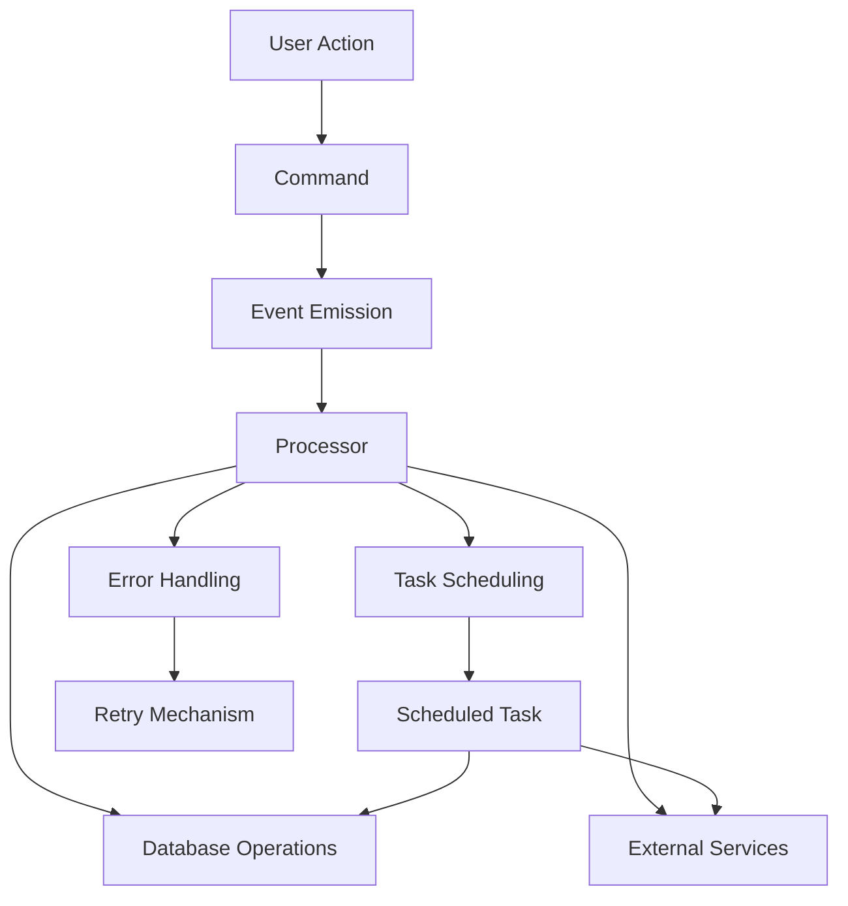
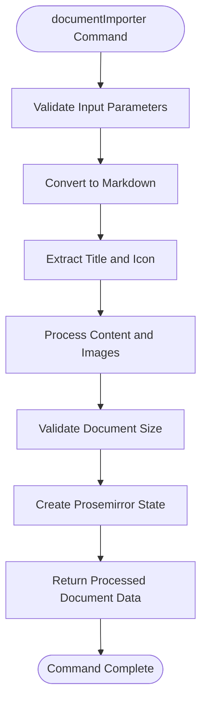
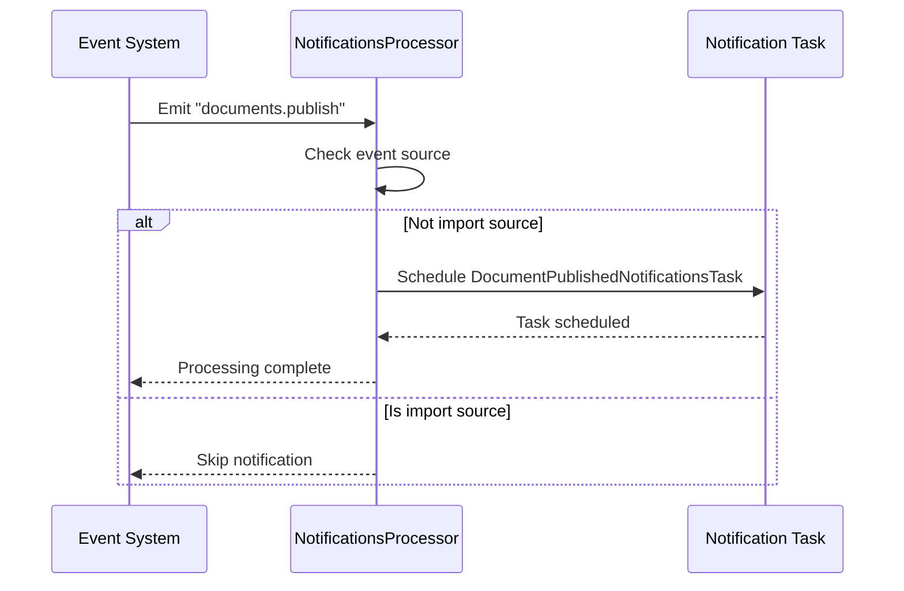
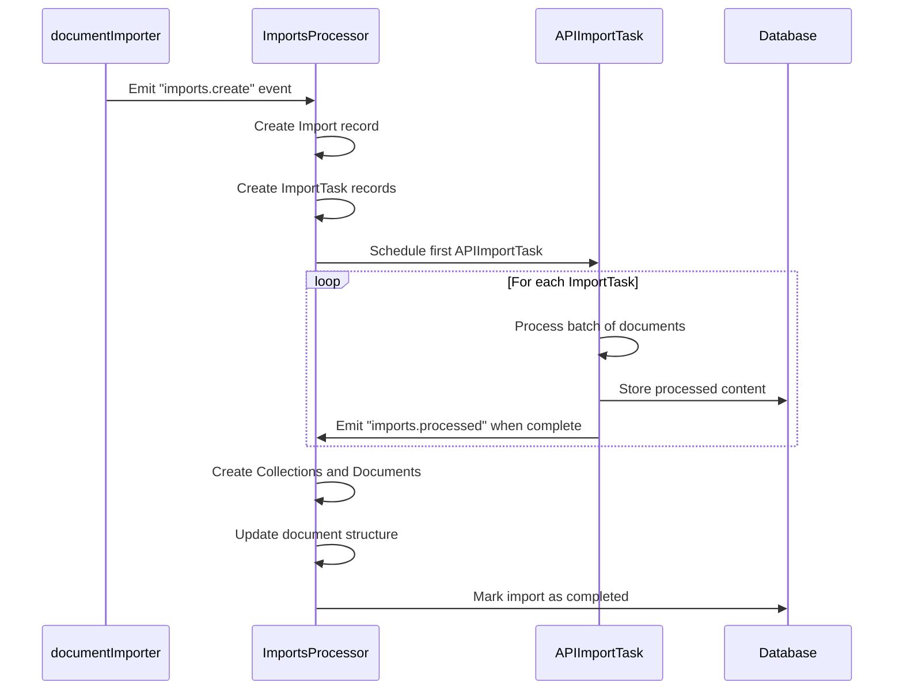
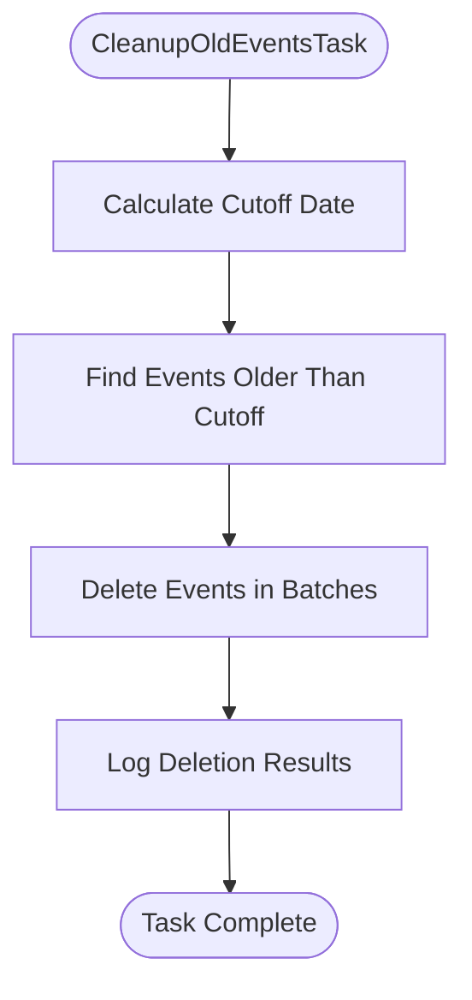
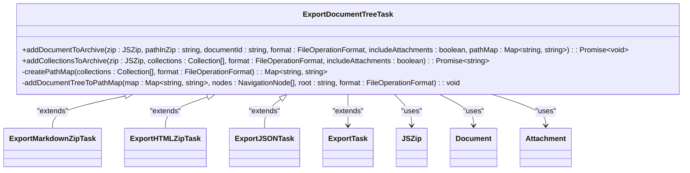
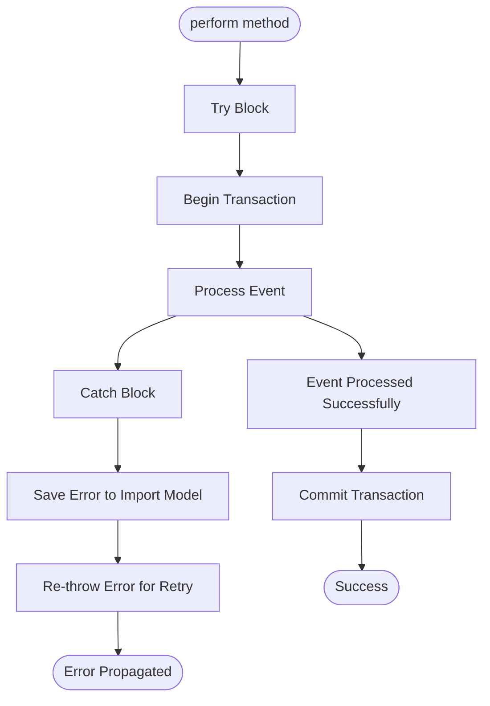

# Job Types

<cite>
**Referenced Files in This Document**   
- [documentImporter.ts](file://server/commands/documentImporter.ts)
- [ImportsProcessor.ts](file://server/queues/processors/ImportsProcessor.ts)
- [BacklinksProcessor.ts](file://server/queues/processors/BacklinksProcessor.ts)
- [RevisionsProcessor.ts](file://server/queues/processors/RevisionsProcessor.ts)
- [NotificationsProcessor.ts](file://server/queues/processors/NotificationsProcessor.ts)
- [CleanupOldEventsTask.ts](file://server/queues/tasks/CleanupOldEventsTask.ts)
- [ExportDocumentTreeTask.ts](file://server/queues/tasks/ExportDocumentTreeTask.ts)
- [Import.ts](file://server/models/Import.ts)
- [ImportTask.ts](file://server/models/ImportTask.ts)
- [NotionImportsProcessor.ts](file://plugins/notion/server/processors/NotionImportsProcessor.ts)
- [NotionAPIImportTask.ts](file://plugins/notion/server/tasks/NotionAPIImportTask.ts)
</cite>

## Table of Contents
1. [Introduction](#introduction)
2. [Job Architecture Overview](#job-architecture-overview)
3. [Command-Based Job Creation](#command-based-job-creation)
4. [Processor-Based Job Handling](#processor-based-job-handling)
5. [Document Import Workflow](#document-import-workflow)
6. [Scheduled Tasks](#scheduled-tasks)
7. [Error Handling and Retry Mechanisms](#error-handling-and-retry-mechanisms)
8. [Creating New Job Types](#creating-new-job-types)
9. [Conclusion](#conclusion)

## Introduction

The baozi application implements a comprehensive background job system for handling asynchronous operations such as document imports, exports, user management, and team provisioning. This system follows a clear separation between job creators (commands) and job handlers (processors), with specialized components for different job categories. The architecture is designed to handle both immediate operations and scheduled tasks, providing robust error handling and retry mechanisms.

The job system is organized into three main directories:
- `server/commands/`: Contains job creation logic
- `server/queues/processors/`: Contains job processing logic
- `server/queues/tasks/`: Contains scheduled task implementations

This document provides a detailed analysis of the job types implementation, focusing on the relationship between commands and processors, specific job workflows, and patterns for creating new job types.

**Section sources**
- [documentImporter.ts](file://server/commands/documentImporter.ts#L1-L108)
- [ImportsProcessor.ts](file://server/queues/processors/ImportsProcessor.ts#L1-L631)

## Job Architecture Overview

The baozi job system follows a producer-consumer pattern where commands create jobs and processors handle them. The architecture is built on top of a message queue system that ensures reliable job processing with proper error handling and retry mechanisms.



**Diagram sources**
- [documentImporter.ts](file://server/commands/documentImporter.ts#L1-L108)
- [ImportsProcessor.ts](file://server/queues/processors/ImportsProcessor.ts#L1-L631)
- [CleanupOldEventsTask.ts](file://server/queues/tasks/CleanupOldEventsTask.ts#L1-L61)

The system uses events as the primary mechanism for job coordination. When a command executes, it often emits an event that triggers the appropriate processor. Processors are registered to handle specific event types and contain the business logic for processing those events.

**Section sources**
- [documentImporter.ts](file://server/commands/documentImporter.ts#L1-L108)
- [ImportsProcessor.ts](file://server/queues/processors/ImportsProcessor.ts#L1-L631)

## Command-Based Job Creation

Commands in the baozi application are responsible for creating jobs by processing user requests and initiating background operations. These commands are typically called from API endpoints and are responsible for validating input, preparing data, and triggering the appropriate background processes.

The `documentImporter` command is a prime example of job creation logic. It handles the import of documents from various formats and prepares them for processing:



**Diagram sources**
- [documentImporter.ts](file://server/commands/documentImporter.ts#L21-L102)

The command processes the imported document by:
1. Converting the content to Markdown format using DocumentConverter
2. Extracting metadata such as title and icon from the filename and content
3. Processing images and replacing them with attachment references
4. Validating the document size against system limits
5. Creating a Prosemirror state representation of the document

This command doesn't directly create a database record but prepares the data that will be used by subsequent import processes. The actual import job is triggered by other components that use this processed data.

**Section sources**
- [documentImporter.ts](file://server/commands/documentImporter.ts#L1-L108)

## Processor-Based Job Handling

Processors in the baozi application handle specific categories of jobs by responding to events and executing the appropriate business logic. Each processor is designed to handle a specific set of event types and contains the implementation details for processing those events.

### ImportsProcessor

The `ImportsProcessor` is an abstract base class that handles import-related jobs. It provides a framework for processing imports from various sources:

```mermaid
classDiagram
class ImportsProcessor {
+static applicableEvents : string[]
+perform(event : ImportEvent) : Promise~void~
+onFailed(event : ImportEvent) : Promise~void~
-onCreation(importModel : Import, transaction : Transaction) : Promise~void~
-onProcessed(importModel : Import, transaction : Transaction) : Promise~void~
-onDeletion(importModel : Import, event : ImportEvent, transaction : Transaction) : Promise~void~
-createCollectionsAndDocuments(importModel : Import, transaction : Transaction) : Promise~{collections : Collection[]}~
-updateMentionsAndAttachments(content : ProsemirrorDoc, attachments : Attachment[], idMap : Record~string, string~, importInput : Record~string, ImportInput~any~[number]~, actorId : string, teamId : string) : Promise~ProsemirrorDoc~
-getInternalId(externalId : string, idMap : Record~string, string~, teamId? : string) : Promise~string~
#canProcess(importModel : Import) : boolean
#buildTasksInput(importModel : Import, transaction : Transaction) : Promise~ImportTaskInput~
#scheduleTask(importTask : ImportTask) : Promise~void~
}
ImportsProcessor <|-- NotionImportsProcessor : "extends"
ImportsProcessor --> BaseProcessor : "extends"
ImportsProcessor --> Import : "uses"
ImportsProcessor --> ImportTask : "uses"
ImportsProcessor --> Collection : "uses"
ImportsProcessor --> Document : "uses"
```

**Diagram sources**
- [ImportsProcessor.ts](file://server/queues/processors/ImportsProcessor.ts#L41-L629)
- [Import.ts](file://server/models/Import.ts#L23-L87)
- [ImportTask.ts](file://server/models/ImportTask.ts#L30-L58)

The processor handles three main event types:
- `imports.create`: Initializes the import process by creating import tasks
- `imports.processed`: Handles the completion of import tasks by creating collections and documents
- `imports.delete`: Cleans up resources when an import is deleted

### Specialized Processors

The system includes several specialized processors for different job categories:

#### BacklinksProcessor
Handles the creation and maintenance of document backlinks when documents are published, updated, or deleted.

#### RevisionsProcessor
Manages document revision creation when documents are published or updated, ensuring version history is maintained.

#### NotificationsProcessor
Coordinates notification delivery for various events such as document publishing, comments, and revisions.



**Diagram sources**
- [BacklinksProcessor.ts](file://server/queues/processors/BacklinksProcessor.ts#L7-L124)
- [RevisionsProcessor.ts](file://server/queues/processors/RevisionsProcessor.ts#L7-L56)
- [NotificationsProcessor.ts](file://server/queues/processors/NotificationsProcessor.ts#L23-L129)

**Section sources**
- [ImportsProcessor.ts](file://server/queues/processors/ImportsProcessor.ts#L1-L631)
- [BacklinksProcessor.ts](file://server/queues/processors/BacklinksProcessor.ts#L1-L126)
- [RevisionsProcessor.ts](file://server/queues/processors/RevisionsProcessor.ts#L1-L58)
- [NotificationsProcessor.ts](file://server/queues/processors/NotificationsProcessor.ts#L1-L131)

## Document Import Workflow

The document import workflow in baozi demonstrates the complete job processing pipeline from creation to completion. This workflow involves multiple components working together to import documents from external sources like Notion.

### Workflow Overview



**Diagram sources**
- [documentImporter.ts](file://server/commands/documentImporter.ts#L1-L108)
- [ImportsProcessor.ts](file://server/queues/processors/ImportsProcessor.ts#L1-L631)
- [NotionAPIImportTask.ts](file://plugins/notion/server/tasks/NotionAPIImportTask.ts#L22-L194)

### Implementation Details

The import workflow begins with the creation of an `Import` model record that contains metadata about the import operation. This record includes:
- The source service (e.g., Notion, Google Docs)
- Authentication information
- Configuration settings
- The list of documents to import

The `ImportsProcessor` then creates multiple `ImportTask` records, each responsible for processing a batch of documents. This batching approach ensures that large imports can be processed efficiently without overwhelming system resources.

Each `ImportTask` is handled by a specialized task implementation (e.g., `NotionAPIImportTask`) that communicates with the external service API to retrieve document content. The processed content is stored temporarily until all tasks are complete.

Once all tasks are finished, the `imports.processed` event triggers the final phase where collections and documents are created in the database. During this phase:
1. Collections are created from root pages
2. Documents are created with proper hierarchy
3. Mentions and attachments are updated to use internal references
4. Document structure is updated to reflect the hierarchy

The workflow includes error handling at multiple levels, allowing partial imports to succeed even if some documents fail to import.

**Section sources**
- [ImportsProcessor.ts](file://server/queues/processors/ImportsProcessor.ts#L1-L631)
- [Import.ts](file://server/models/Import.ts#L23-L87)
- [ImportTask.ts](file://server/models/ImportTask.ts#L30-L58)
- [NotionImportsProcessor.ts](file://plugins/notion/server/processors/NotionImportsProcessor.ts#L8-L70)
- [NotionAPIImportTask.ts](file://plugins/notion/server/tasks/NotionAPIImportTask.ts#L22-L194)

## Scheduled Tasks

The baozi application includes a system of scheduled tasks for performing periodic maintenance and background operations. These tasks are implemented as classes that extend `BaseTask` and are automatically scheduled based on their configuration.

### CleanupOldEventsTask

The `CleanupOldEventsTask` is responsible for removing old event records to manage database size:



**Diagram sources**
- [CleanupOldEventsTask.ts](file://server/queues/tasks/CleanupOldEventsTask.ts#L11-L59)

The task runs hourly and removes events older than 365 days. It processes events in batches to avoid long-running transactions and includes safeguards to prevent excessive deletions in a single run.

### ExportDocumentTreeTask

The `ExportDocumentTreeTask` handles the export of document collections to various formats:



**Diagram sources**
- [ExportDocumentTreeTask.ts](file://server/queues/tasks/ExportDocumentTreeTask.ts#L14-L230)
- [ExportMarkdownZipTask.ts](file://server/queues/tasks/ExportMarkdownZipTask.ts)
- [ExportHTMLZipTask.ts](file://server/queues/tasks/ExportHTMLZipTask.ts)
- [ExportJSONTask.ts](file://server/queues/tasks/ExportJSONTask.ts)

This abstract base class provides common functionality for exporting document trees, with concrete implementations for different export formats. The task handles:
- Converting documents to the requested format
- Including attachments in the export
- Preserving document hierarchy in the file structure
- Creating proper internal links between documents

Scheduled tasks are configured with specific options including:
- Execution frequency (cron schedule)
- Retry attempts
- Priority level
- Rate limiting

**Section sources**
- [CleanupOldEventsTask.ts](file://server/queues/tasks/CleanupOldEventsTask.ts#L1-L61)
- [ExportDocumentTreeTask.ts](file://server/queues/tasks/ExportDocumentTreeTask.ts#L1-L232)

## Error Handling and Retry Mechanisms

The baozi job system implements comprehensive error handling and retry mechanisms to ensure reliable processing of background jobs.

### Error Handling in ImportsProcessor

The `ImportsProcessor` includes multiple layers of error handling:



**Diagram sources**
- [ImportsProcessor.ts](file://server/queues/processors/ImportsProcessor.ts#L56-L96)

When an error occurs during import processing:
1. The error is caught in the main try-catch block
2. The error message is saved to the Import model (truncated to 255 characters)
3. The original error is re-thrown to trigger the retry mechanism

The processor also handles specific error types like `UniqueConstraintError` by logging additional context without preventing the retry.

### Retry Configuration

Tasks are configured with retry options through the `options` getter:

```typescript
public get options() {
  return {
    attempts: 1,
    priority: TaskPriority.Background,
  };
}
```

The system uses exponential backoff for retries, with delays increasing between attempts. Failed jobs are moved to a failed queue where they can be inspected and manually retried if necessary.

### Idempotency Considerations

The job system is designed to be idempotent, meaning that jobs can be safely retried without causing unintended side effects. This is achieved through:
- Database transactions to ensure atomic operations
- Unique constraints to prevent duplicate records
- State checks to avoid reprocessing completed jobs
- Idempotent operations that can be safely repeated

For example, the `RevisionsProcessor` checks if a document revision already exists before creating a new one:

```typescript
if (previous && isEqual(document.content, previous.content) && document.title === previous.title) {
  return;
}
```

This prevents the creation of duplicate revisions when the same update is processed multiple times.

**Section sources**
- [ImportsProcessor.ts](file://server/queues/processors/ImportsProcessor.ts#L85-L96)
- [RevisionsProcessor.ts](file://server/queues/processors/RevisionsProcessor.ts#L32-L38)

## Creating New Job Types

Creating new job types in the baozi application follows established patterns that ensure consistency and reliability.

### New Command Pattern

To create a new command for job creation:

1. Create a new file in `server/commands/`
2. Implement a function that validates input and prepares data
3. Emit appropriate events to trigger processing
4. Use `traceFunction` decorator for monitoring

```typescript
async function newCommand({
  // parameters
}: Props): Promise<Result> {
  // validation logic
  // data preparation
  // event emission
  return result;
}

export default traceFunction({
  spanName: "newCommand",
})(newCommand);
```

### New Processor Pattern

To create a new processor:

1. Extend `BaseProcessor`
2. Define `applicableEvents` static property
3. Implement `perform` method with event handling
4. Use database transactions for data modifications

```typescript
export default class NewProcessor extends BaseProcessor {
  static applicableEvents: Event["name"][] = ["event.type"];

  async perform(event: EventType) {
    // processing logic
  }
}
```

### New Task Pattern

To create a new scheduled task:

1. Extend `BaseTask<Props>`
2. Set `static cron` property for scheduling
3. Implement `perform` method with task logic
4. Define `options` getter for task configuration

```typescript
export default class NewTask extends BaseTask<Props> {
  static cron = TaskSchedule.Daily;

  public async perform() {
    // task logic
  }

  public get options() {
    return {
      attempts: 3,
      priority: TaskPriority.Background,
    };
  }
}
```

When creating new job types, consider the following best practices:
- Use transactions for database operations
- Implement proper error handling and logging
- Ensure idempotency for retry safety
- Use appropriate priority levels
- Include monitoring and tracing
- Validate input data thoroughly
- Handle edge cases and failure scenarios

**Section sources**
- [documentImporter.ts](file://server/commands/documentImporter.ts#L1-L108)
- [ImportsProcessor.ts](file://server/queues/processors/ImportsProcessor.ts#L1-L631)
- [CleanupOldEventsTask.ts](file://server/queues/tasks/CleanupOldEventsTask.ts#L1-L61)

## Conclusion

The baozi application's job system provides a robust framework for handling background operations with clear separation between job creation (commands) and job processing (processors). The architecture supports both immediate operations and scheduled tasks, with comprehensive error handling and retry mechanisms.

Key aspects of the job system include:
- A producer-consumer pattern using events for coordination
- Abstract base classes that provide common functionality
- Transactional processing for data consistency
- Idempotent operations for safe retries
- Comprehensive logging and monitoring
- Configurable scheduling and prioritization

The system is designed to be extensible, making it straightforward to add new job types following established patterns. By adhering to these patterns, developers can create reliable background operations that integrate seamlessly with the existing architecture.