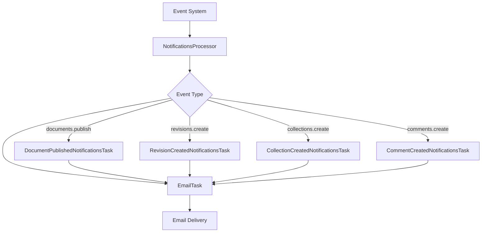
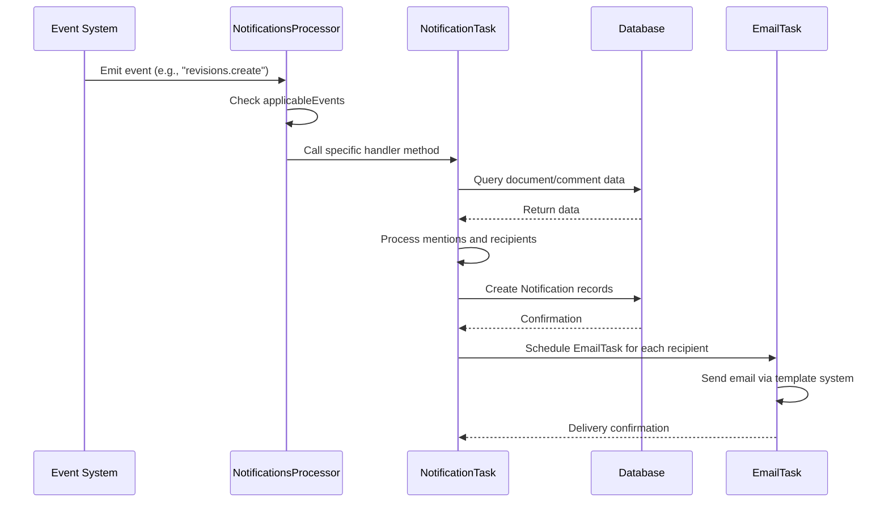
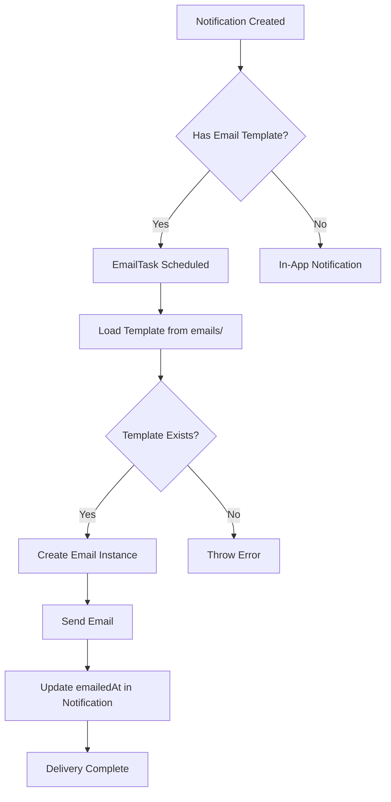
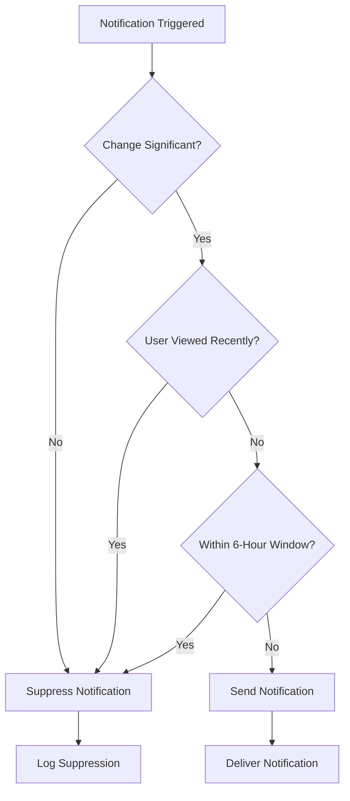

# Notification Jobs

<cite>
**Referenced Files in This Document**   
- [NotificationsProcessor.ts](file://server/queues/processors/NotificationsProcessor.ts)
- [EmailTask.ts](file://server/queues/tasks/EmailTask.ts)
- [CommentCreatedNotificationsTask.ts](file://server/queues/tasks/CommentCreatedNotificationsTask.ts)
- [DocumentPublishedNotificationsTask.ts](file://server/queues/tasks/DocumentPublishedNotificationsTask.ts)
- [RevisionCreatedNotificationsTask.ts](file://server/queues/tasks/RevisionCreatedNotificationsTask.ts)
- [CollectionCreatedNotificationsTask.ts](file://server/queues/tasks/CollectionCreatedNotificationsTask.ts)
- [Notification.ts](file://server/models/Notification.ts)
- [NotificationHelper.ts](file://server/models/helpers/NotificationHelper.ts)
</cite>

## Table of Contents
1. [Introduction](#introduction)
2. [Notification Processing Architecture](#notification-processing-architecture)
3. [Core Components](#core-components)
4. [Event-to-Notification Flow](#event-to-notification-flow)
5. [Notification Delivery Mechanism](#notification-delivery-mechanism)
6. [Specific Notification Tasks](#specific-notification-tasks)
7. [Spam Prevention and Delivery Optimization](#spam-prevention-and-delivery-optimization)
8. [Creating New Notification Types](#creating-new-notification-types)
9. [Troubleshooting Common Issues](#troubleshooting-common-issues)
10. [Conclusion](#conclusion)

## Introduction
The baozi application implements a robust notification system that informs users of system events and collaborative activities through background jobs. This document details the architecture and implementation of notification delivery jobs, focusing on how events trigger notifications, how notifications are processed, and how they are delivered to users. The system is designed to be scalable, reliable, and efficient, ensuring timely delivery while preventing notification spam.

**Section sources**
- [NotificationsProcessor.ts](file://server/queues/processors/NotificationsProcessor.ts#L25-L36)

## Notification Processing Architecture

**Diagram sources**
- [NotificationsProcessor.ts](file://server/queues/processors/NotificationsProcessor.ts#L24-L129)
- [EmailTask.ts](file://server/queues/tasks/EmailTask.ts#L9-L21)

**Section sources**
- [NotificationsProcessor.ts](file://server/queues/processors/NotificationsProcessor.ts#L23-L129)
- [EmailTask.ts](file://server/queues/tasks/EmailTask.ts#L8-L21)

## Core Components

The notification system consists of several key components that work together to deliver notifications efficiently. The NotificationsProcessor acts as the central coordinator, receiving events from the system and dispatching appropriate notification tasks. Each notification task is responsible for a specific type of event and handles the creation of notification records in the database. The EmailTask component is responsible for delivering notifications via email using the application's email templating system.

**Section sources**
- [NotificationsProcessor.ts](file://server/queues/processors/NotificationsProcessor.ts#L23-L129)
- [EmailTask.ts](file://server/queues/tasks/EmailTask.ts#L8-L21)

## Event-to-Notification Flow

**Diagram sources**
- [NotificationsProcessor.ts](file://server/queues/processors/NotificationsProcessor.ts#L38-L61)
- [RevisionCreatedNotificationsTask.ts](file://server/queues/tasks/RevisionCreatedNotificationsTask.ts#L22-L230)

**Section sources**
- [NotificationsProcessor.ts](file://server/queues/processors/NotificationsProcessor.ts#L38-L61)
- [RevisionCreatedNotificationsTask.ts](file://server/queues/tasks/RevisionCreatedNotificationsTask.ts#L22-L230)

## Notification Delivery Mechanism

**Diagram sources**
- [EmailTask.ts](file://server/queues/tasks/EmailTask.ts#L9-L21)
- [Notification.ts](file://server/models/Notification.ts#L110-L112)

**Section sources**
- [EmailTask.ts](file://server/queues/tasks/EmailTask.ts#L8-L21)
- [Notification.ts](file://server/models/Notification.ts#L1-L292)

## Specific Notification Tasks

### CommentCreatedNotificationsTask
Handles notifications when users create comments on documents. This task processes mentions in the comment content, creates notifications for mentioned users and groups, and sends notifications to subscribers of the document. It also automatically creates a subscription for the comment author to receive future updates on the document.

**Section sources**
- [CommentCreatedNotificationsTask.ts](file://server/queues/tasks/CommentCreatedNotificationsTask.ts#L23-L176)

### DocumentPublishedNotificationsTask
Manages notifications when documents are published. This task sends notifications to users mentioned in the document content and to all team members for collections visible to the entire team. It also creates subscriptions for users who are mentioned in the document.

**Section sources**
- [DocumentPublishedNotificationsTask.ts](file://server/queues/tasks/DocumentPublishedNotificationsTask.ts#L10-L131)

### RevisionCreatedNotificationsTask
Handles notifications for document updates. This task includes sophisticated spam prevention by checking if the content changes exceed a threshold and whether recipients have already viewed the updated document. It suppresses notifications when changes are minor or when users have already seen the update.

**Section sources**
- [RevisionCreatedNotificationsTask.ts](file://server/queues/tasks/RevisionCreatedNotificationsTask.ts#L22-L230)

### CollectionCreatedNotificationsTask
Manages notifications when new collections are created. This task only sends notifications for collections that are visible to the entire team (non-private collections) and filters out suspended users. It ensures that team members are informed of new organizational structures.

**Section sources**
- [CollectionCreatedNotificationsTask.ts](file://server/queues/tasks/CollectionCreatedNotificationsTask.ts#L7-L43)

## Spam Prevention and Delivery Optimization

**Diagram sources**
- [RevisionCreatedNotificationsTask.ts](file://server/queues/tasks/RevisionCreatedNotificationsTask.ts#L38-L43)
- [RevisionCreatedNotificationsTask.ts](file://server/queues/tasks/RevisionCreatedNotificationsTask.ts#L170-L223)

**Section sources**
- [RevisionCreatedNotificationsTask.ts](file://server/queues/tasks/RevisionCreatedNotificationsTask.ts#L37-L44)
- [RevisionCreatedNotificationsTask.ts](file://server/queues/tasks/RevisionCreatedNotificationsTask.ts#L170-L223)
- [NotificationHelper.ts](file://server/models/helpers/NotificationHelper.ts#L117-L152)

## Creating New Notification Types

To create new notification types, developers should follow the established pattern in the codebase. First, define the notification event type in the shared types. Then, create a new task class that extends BaseTask and implements the perform method to handle the specific event. The task should query relevant data, determine recipients using the NotificationHelper, create Notification records, and schedule delivery via EmailTask if appropriate. Finally, register the new event type in the NotificationsProcessor's applicableEvents array and implement the corresponding handler method.

**Section sources**
- [NotificationsProcessor.ts](file://server/queues/processors/NotificationsProcessor.ts#L25-L36)
- [BaseTask.ts](file://server/queues/tasks/BaseTask.ts)
- [NotificationHelper.ts](file://server/models/helpers/NotificationHelper.ts#L21-L244)

## Troubleshooting Common Issues

### Notification Spam Prevention
The system implements multiple layers of spam prevention:
- Content change threshold checking for document updates
- Time-based suppression (6-hour window between notifications)
- View-based suppression (if user has viewed the document since update)
- Filtering of suspended users and users without email addresses
- Deduplication of recipients to prevent multiple notifications

### Delivery Failures
Common causes of delivery failures include:
- Missing email templates (results in Error from EmailTask)
- Invalid recipient email addresses
- Database connectivity issues during notification creation
- Rate limiting by email providers
- Network connectivity issues

Monitoring the queue processing logs and implementing proper error handling in the EmailTask can help identify and resolve delivery issues.

### Ensuring Timely Delivery
The system ensures timely delivery through:
- Background job processing with appropriate prioritization
- Efficient database queries with proper indexing
- Connection pooling for database access
- Error handling and retry mechanisms for failed deliveries
- Monitoring of queue processing performance

**Section sources**
- [RevisionCreatedNotificationsTask.ts](file://server/queues/tasks/RevisionCreatedNotificationsTask.ts#L170-L223)
- [EmailTask.ts](file://server/queues/tasks/EmailTask.ts#L12-L15)
- [Notification.ts](file://server/models/Notification.ts#L110-L112)

## Conclusion
The notification system in the baozi application provides a comprehensive solution for informing users of system events and collaborative activities. By leveraging a processor-task pattern, the system efficiently handles various event types while maintaining clean separation of concerns. The implementation includes sophisticated spam prevention mechanisms and reliable delivery through email and in-app notifications. The modular design allows for easy extension with new notification types while maintaining system performance and reliability.