# System Maintenance Jobs

<cite>
**Referenced Files in This Document**   
- [CleanupOldEventsTask.ts](file://server/queues/tasks/CleanupOldEventsTask.ts)
- [CleanupExpiredAttachmentsTask.ts](file://server/queues/tasks/CleanupExpiredAttachmentsTask.ts)
- [CleanupOAuthAuthorizationCodeTask.ts](file://server/queues/tasks/CleanupOAuthAuthorizationCodeTask.ts)
- [EmptyTrashTask.ts](file://server/queues/tasks/EmptyTrashTask.ts)
- [ApiKeyCleanupProcessor.ts](file://server/queues/processors/ApiKeyCleanupProcessor.ts)
- [BacklinksProcessor.ts](file://server/queues/processors/BacklinksProcessor.ts)
- [RevisionsProcessor.ts](file://server/queues/processors/RevisionsProcessor.ts)
- [BaseTask.ts](file://server/queues/tasks/BaseTask.ts)
- [BaseProcessor.ts](file://server/queues/processors/BaseProcessor.ts)
- [queue.ts](file://server/queues/queue.ts)
- [Attachment.ts](file://server/models/Attachment.ts)
- [Event.ts](file://server/models/Event.ts)
- [OAuthAuthorizationCode.ts](file://server/models/oauth/OAuthAuthorizationCode.ts)
- [Document.ts](file://server/models/Document.ts)
- [Revision.ts](file://server/models/Revision.ts)
- [documentPermanentDeleter.ts](file://server/commands/documentPermanentDeleter.ts)
- [revisionCreator.ts](file://server/commands/revisionCreator.ts)
</cite>

## Table of Contents
1. [Introduction](#introduction)
2. [Scheduled Cleanup Tasks](#scheduled-cleanup-tasks)
3. [Permanent Deletion Operations](#permanent-deletion-operations)
4. [Maintenance Processors](#maintenance-processors)
5. [Task Scheduling and Execution](#task-scheduling-and-execution)
6. [Performance and Monitoring Considerations](#performance-and-monitoring-considerations)
7. [Configuration and Deployment Guidance](#configuration-and-deployment-guidance)
8. [Conclusion](#conclusion)

## Introduction
The baozi application implements a comprehensive system maintenance framework to ensure optimal performance, data integrity, and storage efficiency. This system consists of scheduled cleanup tasks and event-driven processors that handle various maintenance operations across the application. The maintenance jobs are designed to automatically purge stale data, enforce retention policies, and maintain referential integrity throughout the system. These operations are critical for preventing database bloat, ensuring compliance with data retention requirements, and maintaining system responsiveness as data volumes grow.

The maintenance architecture is built on a robust queuing system that processes tasks asynchronously, preventing long-running operations from impacting user-facing functionality. Scheduled tasks run at predefined intervals to clean up expired records, while processors respond to specific events to maintain data consistency. This document details the implementation of these maintenance components, their relationships, and best practices for configuration and monitoring.

## Scheduled Cleanup Tasks

The baozi application implements several scheduled cleanup tasks that run automatically to remove expired or stale data from the system. These tasks are designed to prevent database growth, maintain performance, and comply with data retention policies.

### CleanupOldEventsTask
The `CleanupOldEventsTask` is responsible for purging event records that exceed the configured retention period. This task runs hourly and removes events older than 365 days, with a maximum of 100,000 events processed per execution to prevent database locking and performance degradation. The task processes events in batches of 1,000 to minimize memory usage and transaction overhead. After deletion, it logs the total number of events removed for monitoring purposes.

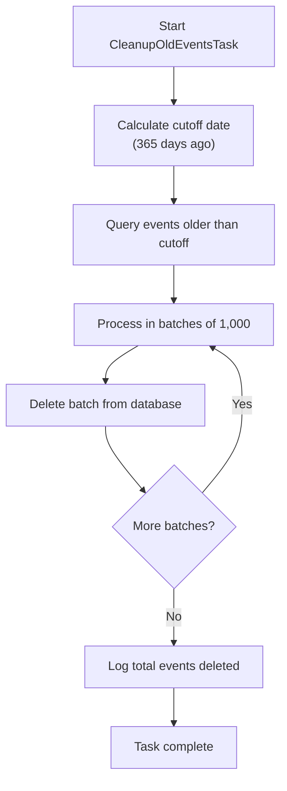

**Diagram sources**
- [server/queues/tasks/CleanupOldEventsTask.ts](file://server/queues/tasks/CleanupOldEventsTask.ts#L11-L59)

**Section sources**
- [server/queues/tasks/CleanupOldEventsTask.ts](file://server/queues/tasks/CleanupOldEventsTask.ts#L11-L59)

### CleanupExpiredAttachmentsTask
The `CleanupExpiredAttachmentsTask` removes file attachments that have reached their expiration date. This task runs hourly and processes attachments in batches limited by the provided `limit` parameter. It identifies expired attachments by comparing their `expiresAt` timestamp with the current date, then destroys each attachment record. The destruction process automatically triggers the removal of the corresponding file from storage through Sequelize hooks. The task logs both the start of the cleanup operation and the total number of attachments removed.

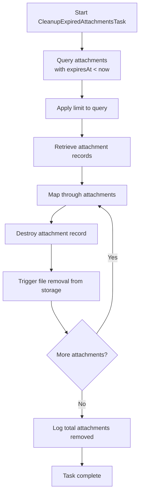

**Diagram sources**
- [server/queues/tasks/CleanupExpiredAttachmentsTask.ts](file://server/queues/tasks/CleanupExpiredAttachmentsTask.ts#L9-L32)
- [server/models/Attachment.ts](file://server/models/Attachment.ts#L161-L164)

**Section sources**
- [server/queues/tasks/CleanupExpiredAttachmentsTask.ts](file://server/queues/tasks/CleanupExpiredAttachmentsTask.ts#L9-L32)

### CleanupOAuthAuthorizationCodeTask
The `CleanupOAuthAuthorizationCodeTask` clears expired OAuth authorization codes to maintain security and reduce database clutter. This task runs daily and removes authorization codes that are older than one month. It uses the `destroy` method with a where clause to efficiently remove multiple records in a single database operation. The task logs both the initiation of the cleanup process and the total count of expired codes deleted, providing visibility into the security hygiene operations.

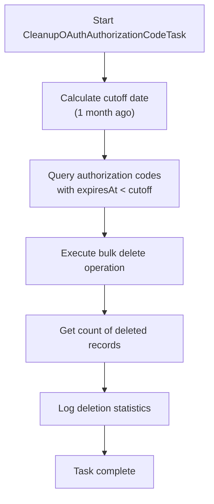

**Diagram sources**
- [server/queues/tasks/CleanupOAuthAuthorizationCodeTask.ts](file://server/queues/tasks/CleanupOAuthAuthorizationCodeTask.ts#L8-L32)
- [server/models/oauth/OAuthAuthorizationCode.ts](file://server/models/oauth/OAuthAuthorizationCode.ts#L62-L63)

**Section sources**
- [server/queues/tasks/CleanupOAuthAuthorizationCodeTask.ts](file://server/queues/tasks/CleanupOAuthAuthorizationCodeTask.ts#L8-L32)

## Permanent Deletion Operations

The baozi application implements a two-phase deletion process for documents, where items are first soft-deleted (moved to trash) and later permanently removed according to retention policies. The permanent deletion operations ensure that all related data is properly cleaned up.

### EmptyTrashTask
The `EmptyTrashTask` handles the permanent deletion of documents that have been soft-deleted and reside in the trash. This task processes a batch of document IDs, verifies that they are in a soft-deleted state, and then delegates to the `documentPermanentDeleter` command for comprehensive cleanup. The task ensures data integrity by confirming the soft-delete status before proceeding with permanent removal.

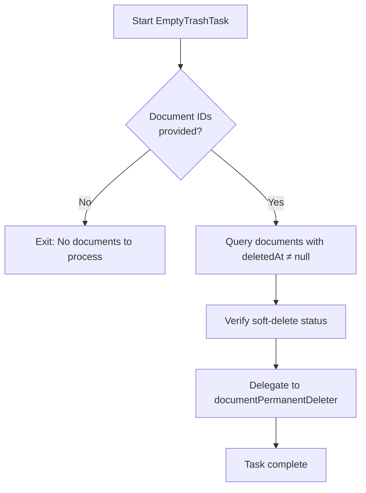

**Diagram sources**
- [server/queues/tasks/EmptyTrashTask.ts](file://server/queues/tasks/EmptyTrashTask.ts#L9-L28)
- [server/commands/documentPermanentDeleter.ts](file://server/commands/documentPermanentDeleter.ts#L10-L101)

**Section sources**
- [server/queues/tasks/EmptyTrashTask.ts](file://server/queues/tasks/EmptyTrashTask.ts#L9-L28)

### Document Permanent Deletion Process
The permanent deletion process, implemented in `documentPermanentDeleter`, ensures comprehensive cleanup of all related data when a document is permanently removed. The process first identifies attachments referenced in the document content or originally uploaded to the document. For each attachment, it checks if the attachment is referenced in any other documents before scheduling its deletion. This prevents accidental removal of attachments that are still in use elsewhere. The process also updates parent document relationships by nullifying parent references and finally destroys the document records from the database.

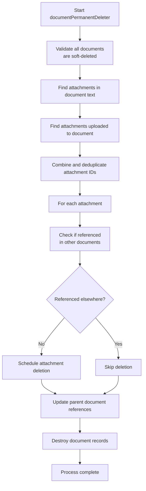

**Diagram sources**
- [server/commands/documentPermanentDeleter.ts](file://server/commands/documentPermanentDeleter.ts#L10-L101)
- [server/models/Document.ts](file://server/models/Document.ts#L1154-L1183)
- [server/queues/tasks/DeleteAttachmentTask.ts](file://server/queues/tasks/DeleteAttachmentTask.ts)

**Section sources**
- [server/commands/documentPermanentDeleter.ts](file://server/commands/documentPermanentDeleter.ts#L10-L101)

## Maintenance Processors

Maintenance processors in the baozi application respond to specific events to maintain data integrity and consistency across related entities. These processors run asynchronously in response to system events, ensuring that maintenance operations do not block user-facing functionality.

### ApiKeyCleanupProcessor
The `ApiKeyCleanupProcessor` monitors team update events and automatically cleans up API keys when team security policies change. Specifically, when a team disables the "members can create API keys" preference, the processor identifies all non-admin users in the team and deletes their API keys. This ensures that security policy changes take immediate effect across the system. The processor queries for non-admin user IDs and performs a bulk deletion of their API keys, logging the cleanup operation for audit purposes.

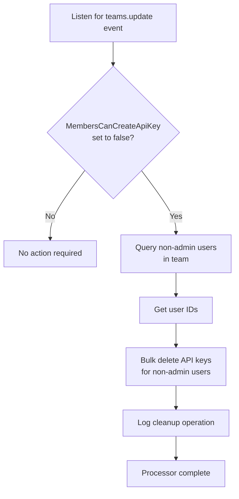

**Diagram sources**
- [server/queues/processors/ApiKeyCleanupProcessor.ts](file://server/queues/processors/ApiKeyCleanupProcessor.ts#L7-L42)

**Section sources**
- [server/queues/processors/ApiKeyCleanupProcessor.ts](file://server/queues/processors/ApiKeyCleanupProcessor.ts#L7-L42)

### BacklinksProcessor
The `BacklinksProcessor` maintains document reference integrity by automatically creating and updating backlinks when documents are published, updated, or deleted. When a document is published or updated, the processor parses document IDs from the content and creates backlink relationships to those documents. It also removes backlinks that no longer exist in the updated content. When a document is deleted, the processor removes all backlinks to and from that document. This ensures that document references remain accurate and up-to-date.

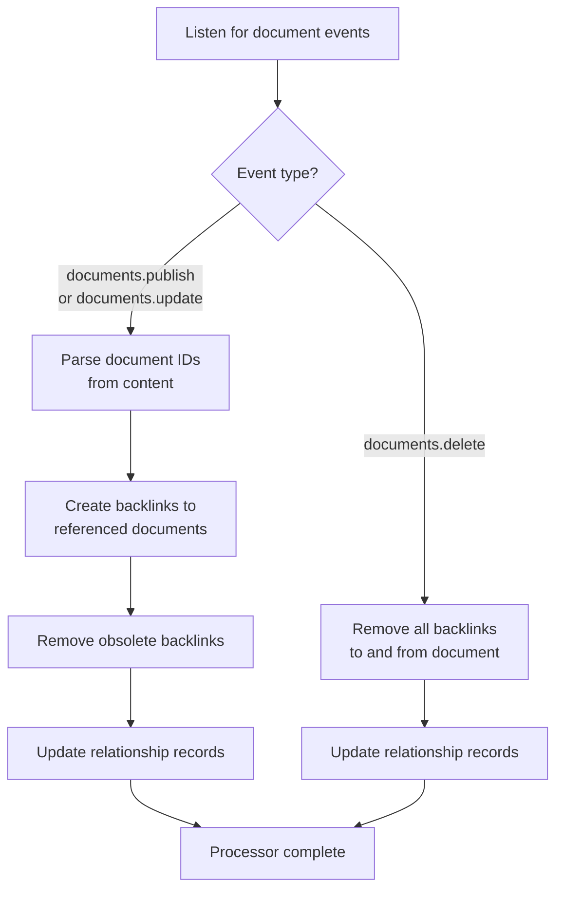

**Diagram sources**
- [server/queues/processors/BacklinksProcessor.ts](file://server/queues/processors/BacklinksProcessor.ts#L7-L124)
- [server/models/Relationship.ts](file://server/models/Relationship.ts)

**Section sources**
- [server/queues/processors/BacklinksProcessor.ts](file://server/queues/processors/BacklinksProcessor.ts#L7-L124)

### RevisionsProcessor
The `RevisionsProcessor` manages document version history by creating revision records when documents are published or updated. The processor listens for document update events and compares the current document state with the latest revision to avoid creating duplicate revisions when content is unchanged. When a new revision is needed, it schedules a `DocumentUpdateTextTask` and creates a new revision record through the `revisionCreator` command. This ensures that document history is maintained efficiently without redundant entries.

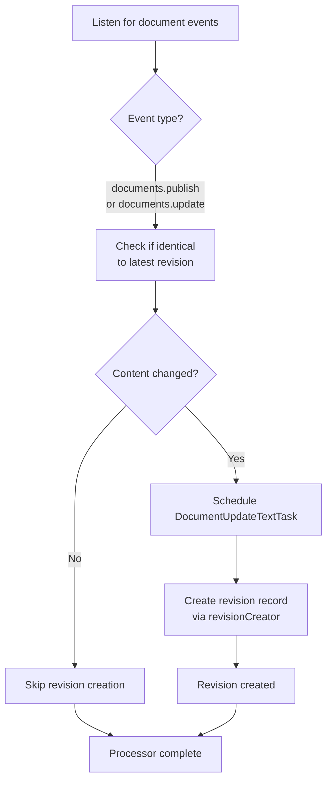

**Diagram sources**
- [server/queues/processors/RevisionsProcessor.ts](file://server/queues/processors/RevisionsProcessor.ts#L7-L56)
- [server/commands/revisionCreator.ts](file://server/commands/revisionCreator.ts#L7-L34)
- [server/models/Revision.ts](file://server/models/Revision.ts#L156-L169)

**Section sources**
- [server/queues/processors/RevisionsProcessor.ts](file://server/queues/processors/RevisionsProcessor.ts#L7-L56)

## Task Scheduling and Execution

The maintenance tasks in the baozi application are managed through a robust queuing system that ensures reliable execution and proper scheduling. The system is built on Bull, a Redis-based queue implementation that provides durability and scalability for background job processing.

### Task Base Class and Configuration
All maintenance tasks extend the `BaseTask` class, which provides common functionality for job scheduling, execution, and error handling. Tasks can be configured with priority levels (Background, Low, Normal, High) and retry strategies. The base class implements exponential backoff for failed jobs, with an initial delay of 60 seconds that increases with each retry attempt. Tasks can be scheduled to run automatically based on cron expressions defined in the `cron` static property.

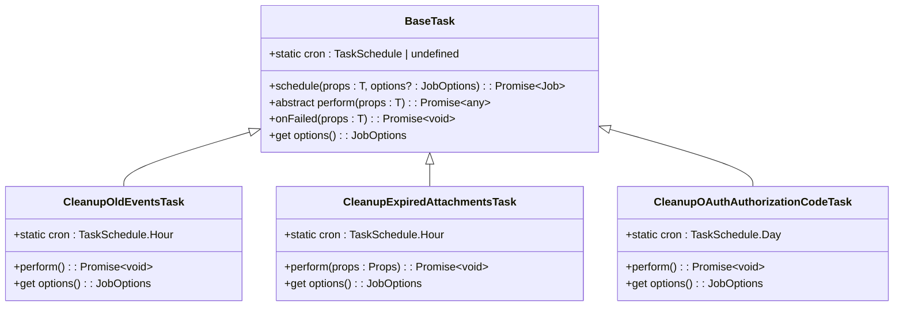

**Diagram sources**
- [server/queues/tasks/BaseTask.ts](file://server/queues/tasks/BaseTask.ts#L17-L73)
- [server/queues/index.ts](file://server/queues/index.ts#L24-L31)
- [server/queues/queue.ts](file://server/queues/queue.ts#L10-L69)

**Section sources**
- [server/queues/tasks/BaseTask.ts](file://server/queues/tasks/BaseTask.ts#L17-L73)

### Processor Base Class and Event Handling
Maintenance processors extend the `BaseProcessor` class, which defines the interface for event-driven processing. Processors specify which events they handle through the `applicableEvents` static property. The base processor class provides a consistent interface for error handling when processing fails after all retry attempts. Processors are triggered by events published to the event system, ensuring loose coupling between event producers and consumers.

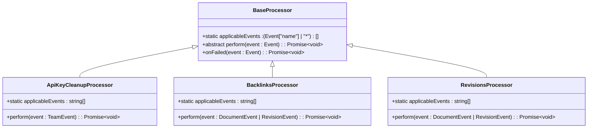

**Diagram sources**
- [server/queues/processors/BaseProcessor.ts](file://server/queues/processors/BaseProcessor.ts#L3-L19)
- [server/queues/index.ts](file://server/queues/index.ts#L12-L18)

**Section sources**
- [server/queues/processors/BaseProcessor.ts](file://server/queues/processors/BaseProcessor.ts#L3-L19)

## Performance and Monitoring Considerations

The maintenance system in the baozi application is designed with performance and monitoring in mind to ensure that cleanup operations do not negatively impact system availability or responsiveness.

### Batch Processing and Rate Limiting
Maintenance tasks implement batch processing to prevent database locking and excessive memory usage. The `CleanupOldEventsTask` processes events in batches of 1,000 with a maximum limit of 100,000 events per execution, preventing long-running transactions that could block other operations. The `CleanupExpiredAttachmentsTask` uses a configurable limit parameter to control the number of attachments processed in a single execution. This batch processing approach allows the system to handle large volumes of data while maintaining acceptable performance characteristics.

### Error Handling and Retry Mechanisms
All maintenance tasks and processors include comprehensive error handling to ensure reliability. The base task implementation includes exponential backoff retry logic with a maximum of 5 attempts before permanent failure. Failed jobs are logged through the system's monitoring infrastructure, allowing administrators to identify and address recurring issues. The queuing system ensures that failed jobs do not block the processing of subsequent tasks, maintaining overall system throughput.

### Monitoring and Metrics
The maintenance system integrates with the application's monitoring infrastructure to provide visibility into job execution and system health. The queue implementation emits metrics for job completion, failure, and stalling, which are collected and reported through the system's metrics framework. Cleanup operations log their progress and results, providing an audit trail for maintenance activities. These monitoring capabilities enable administrators to verify that maintenance jobs are running as expected and to identify potential issues before they impact system performance.

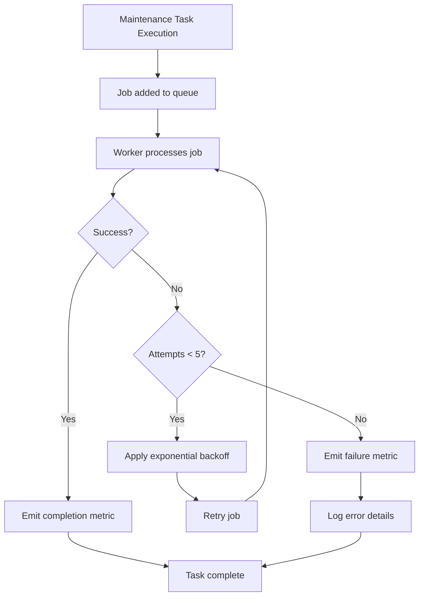

**Diagram sources**
- [server/queues/queue.ts](file://server/queues/queue.ts#L43-L54)
- [server/queues/tasks/BaseTask.ts](file://server/queues/tasks/BaseTask.ts#L54-L57)
- [server/logging/Metrics.ts](file://server/logging/Metrics.ts)

**Section sources**
- [server/queues/queue.ts](file://server/queues/queue.ts#L43-L54)

## Configuration and Deployment Guidance

Proper configuration of maintenance jobs is essential for balancing system performance, storage efficiency, and data retention requirements. The following guidance provides recommendations for configuring maintenance operations based on deployment scale and requirements.

### Frequency Configuration
The frequency of maintenance tasks should be aligned with system usage patterns and data retention policies:
- **CleanupOldEventsTask**: Hourly execution is appropriate for most deployments, as event volumes can grow quickly. High-traffic systems may consider increasing frequency to every 30 minutes.
- **CleanupExpiredAttachmentsTask**: Hourly execution balances timely cleanup with system load. Systems with frequent file uploads may benefit from more frequent execution.
- **CleanupOAuthAuthorizationCodeTask**: Daily execution is sufficient given the one-month retention period for authorization codes.

### Threshold and Batch Size Tuning
Batch sizes and processing limits should be tuned based on available system resources:
- **CleanupOldEventsTask**: The 100,000 event limit and 1,000 record batch size are optimized for typical database performance. Larger deployments may increase the batch size to 5,000-10,000 if database performance allows.
- **CleanupExpiredAttachmentsTask**: The limit parameter should be set based on expected attachment volumes and storage constraints. A limit of 100-500 is recommended for most deployments.

### Monitoring and Alerting
Implement monitoring and alerting for maintenance operations:
- Monitor queue lengths to detect processing backlogs
- Track job completion times to identify performance degradation
- Set alerts for repeated job failures
- Monitor storage usage trends to validate cleanup effectiveness

### Scaling Considerations
For large-scale deployments:
- Consider running maintenance workers on dedicated instances to prevent resource contention
- Implement staggered execution of multiple cleanup tasks to distribute system load
- Monitor database performance during maintenance windows and adjust schedules as needed
- Consider sharding maintenance operations by team or organization for multi-tenant deployments

## Conclusion
The system maintenance jobs in the baozi application provide a comprehensive framework for ensuring data integrity, performance, and storage efficiency. Through a combination of scheduled cleanup tasks and event-driven processors, the system automatically manages data lifecycle, enforces retention policies, and maintains referential integrity. The architecture leverages asynchronous processing to prevent user-facing performance impacts while providing robust error handling and monitoring capabilities. By following the configuration guidance and monitoring best practices outlined in this document, administrators can ensure that maintenance operations effectively support system health and performance at any scale.