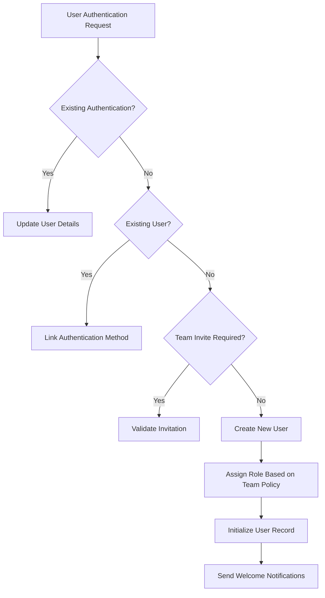
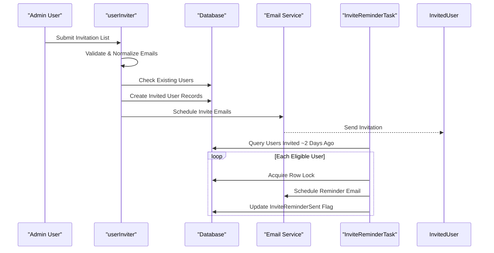

# User and Team Operations Jobs

<cite>
**Referenced Files in This Document**   
- [userProvisioner.ts](file://server/commands/userProvisioner.ts)
- [teamProvisioner.ts](file://server/commands/teamProvisioner.ts)
- [userInviter.ts](file://server/commands/userInviter.ts)
- [InviteReminderTask.ts](file://server/queues/tasks/InviteReminderTask.ts)
- [UserDeletedProcessor.ts](file://server/queues/processors/UserDeletedProcessor.ts)
- [UserDemotedProcessor.ts](file://server/queues/processors/UserDemotedProcessor.ts)
- [UserSuspendedProcessor.ts](file://server/queues/processors/UserSuspendedProcessor.ts)
</cite>

## Table of Contents
1. [Introduction](#introduction)
2. [User and Team Provisioning](#user-and-team-provisioning)
3. [User Invitation Workflows](#user-invitation-workflows)
4. [User Lifecycle Processors](#user-lifecycle-processors)
5. [Job Execution and Scheduling](#job-execution-and-scheduling)
6. [Common Issues and Error Handling](#common-issues-and-error-handling)
7. [Extending User and Team Operations](#extending-user-and-team-operations)
8. [Conclusion](#conclusion)

## Introduction
The baozi application implements a robust system for managing user and team operations through background jobs and command processors. This document details the architecture and implementation of user provisioning, team creation, invitation workflows, and user lifecycle management. The system leverages a command-processor pattern where user and team actions trigger asynchronous jobs for database initialization, notifications, and cleanup operations. These operations ensure data consistency, improve performance, and provide a seamless experience during user onboarding and lifecycle changes.

## User and Team Provisioning

The user and team provisioning system handles the creation and setup of users and teams when they first authenticate with the application. The `userProvisioner.ts` and `teamProvisioner.ts` files implement this functionality through well-defined command patterns that manage database initialization and default configuration.

The `userProvisioner` function orchestrates user creation by first checking for existing authentication records or invited users. If a matching user exists (such as an invited user without authentication), it updates their details and associates the new authentication method. For entirely new users, it performs domain validation and creates the user with appropriate role assignment based on team settings. The provisioning process includes transactional safety to ensure data consistency during user creation.

Similarly, the `teamProvisioner` handles team setup operations, creating new teams when necessary or associating authentication providers with existing teams. It validates domain permissions and handles both cloud-hosted and self-hosted deployment scenarios. When creating new teams, it delegates to the `teamCreator` command to initialize team-specific configurations and authentication providers.



**Diagram sources**
- [userProvisioner.ts](file://server/commands/userProvisioner.ts#L53-L240)
- [teamProvisioner.ts](file://server/commands/teamProvisioner.ts#L44-L134)

**Section sources**
- [userProvisioner.ts](file://server/commands/userProvisioner.ts#L1-L241)
- [teamProvisioner.ts](file://server/commands/teamProvisioner.ts#L1-L135)

## User Invitation Workflows

The user invitation system manages the process of inviting new users to teams through the `userInviter.ts` command and follow-up reminders via the `InviteReminderTask.ts`. This workflow ensures that invited users receive proper notifications and have mechanisms for re-engagement if they don't immediately activate their accounts.

The `userInviter` function processes a batch of invitations, performing several validation and normalization steps. It filters out invalid email addresses, normalizes emails to lowercase, removes duplicates, and checks for existing users to prevent redundant invitations. For valid invitations, it creates user records with the "invited" status and sends invitation emails through the email scheduling system. The function also handles role assignment logic, ensuring that only authorized users can invite others as administrators.

The `InviteReminderTask` is a scheduled background job that runs daily to identify users who were invited approximately two days prior but have not yet accepted their invitations. It sends reminder emails to these users while tracking that reminders have been sent using user flags to prevent duplicate notifications. The task uses database transactions with row-level locking to prevent race conditions when multiple instances might process the same user.



**Diagram sources**
- [userInviter.ts](file://server/commands/userInviter.ts#L23-L122)
- [InviteReminderTask.ts](file://server/queues/tasks/InviteReminderTask.ts#L11-L67)

**Section sources**
- [userInviter.ts](file://server/commands/userInviter.ts#L1-L122)
- [InviteReminderTask.ts](file://server/queues/tasks/InviteReminderTask.ts#L1-L68)

## User Lifecycle Processors

The user lifecycle management system handles post-status-change operations through specialized processors that respond to user state changes. These processors ensure proper cleanup, notification, and synchronization when users are deleted, demoted, or suspended.

The `UserDeletedProcessor` handles the cleanup operations when a user is deleted from the system. It listens for "users.delete" events and performs a comprehensive cleanup of related records within a database transaction. This includes removing group memberships, authentication methods, subscriptions, API keys, and other user-specific data. The processor ensures referential integrity by systematically removing dependent records while maintaining transactional consistency.

The `UserSuspendedProcessor` specifically handles user suspension by removing OAuth authentications for the suspended user. This security measure prevents suspended users from accessing the system through external authentication providers. The processor listens for "users.suspend" events and immediately revokes OAuth access by deleting the corresponding authentication records.

The `UserDemotedProcessor` takes a different approach by delegating cleanup tasks to a background job. Instead of performing cleanup synchronously, it schedules a `CleanupDemotedUserTask` to run asynchronously. This design choice prevents potential performance issues during user management operations and ensures that cleanup occurs reliably even if the initial request times out.

```mermaid
classDiagram
class UserDeletedProcessor {
+applicableEvents : string[]
+perform(event : UserEvent) : Promise~void~
}
class UserDemotedProcessor {
+applicableEvents : string[]
+perform(event : UserEvent) : Promise~void~
}
class UserSuspendedProcessor {
+applicableEvents : string[]
+perform(event : UserEvent) : Promise~void~
}
class BaseProcessor {
<<abstract>>
+perform(event : Event) : Promise~void~
}
UserDeletedProcessor --|> BaseProcessor
UserDemotedProcessor --|> BaseProcessor
UserSuspendedProcessor --|> BaseProcessor
class CleanupDemotedUserTask {
+schedule(props : {userId : string}) : Promise~void~
}
UserDemotedProcessor --> CleanupDemotedUserTask : "schedules"
UserDeletedProcessor --> "Database Models" : "deletes from"
UserSuspendedProcessor --> "OAuthAuthentication" : "removes"
```

**Diagram sources**
- [UserDeletedProcessor.ts](file://server/queues/processors/UserDeletedProcessor.ts#L14-L64)
- [UserDemotedProcessor.ts](file://server/queues/processors/UserDemotedProcessor.ts#L5-L11)
- [UserSuspendedProcessor.ts](file://server/queues/processors/UserSuspendedProcessor.ts#L5-L14)

**Section sources**
- [UserDeletedProcessor.ts](file://server/queues/processors/UserDeletedProcessor.ts#L1-L65)
- [UserDemotedProcessor.ts](file://server/queues/processors/UserDemotedProcessor.ts#L1-L12)
- [UserSuspendedProcessor.ts](file://server/queues/processors/UserSuspendedProcessor.ts#L1-L15)

## Job Execution and Scheduling

The job system in baozi follows a consistent pattern for executing and scheduling background operations. Tasks and processors are designed to be idempotent and resilient to failures, with appropriate error handling and retry mechanisms.

Scheduled tasks like `InviteReminderTask` use cron-style scheduling with the `TaskSchedule.Day` frequency, ensuring daily execution. These tasks query for specific conditions (such as users invited approximately two days ago) and process them in batches. The system uses database transactions with row-level locking to prevent race conditions when multiple workers might process the same records.

Event-driven processors respond to specific event types defined in their `applicableEvents` static property. When an event is published to the system, the event bus routes it to all processors that list the event name in their applicable events array. This pub-sub pattern allows multiple processors to respond to the same event type if needed, enabling extensible event handling.

All database operations within jobs are wrapped in transactions to ensure atomicity. When processing multiple records, the system typically processes them sequentially within individual transactions rather than a single large transaction, balancing performance with data consistency. Error handling is implemented to rollback transactions on failure and allow the job queue to retry failed jobs according to their configured retry policies.

## Common Issues and Error Handling

The user and team operations system addresses several common issues through careful design and error handling strategies.

Race conditions during user deletion are mitigated through the use of database transactions and row-level locking. When multiple operations might affect the same user record, the system acquires locks to ensure that cleanup operations occur in a controlled manner. The `UserDeletedProcessor` wraps all deletion operations in a single transaction to prevent partial cleanup states.

Failed provisioning scenarios are handled through comprehensive validation and error types. The system distinguishes between different failure modes such as `DomainNotAllowedError`, `InviteRequiredError`, and `InvalidAuthenticationError`, allowing clients to present appropriate error messages. Provisioning operations use transactions with rollback capabilities to ensure that partially created users are cleaned up if an error occurs.

For suspended accounts, the system implements immediate revocation of OAuth access while preserving other user data for potential reactivation. This approach balances security requirements with the need to maintain historical data and audit trails. The `UserSuspendedProcessor` specifically targets OAuth authentications while leaving other user information intact.

Email delivery issues are addressed through asynchronous scheduling rather than synchronous sending. By scheduling emails as background tasks, the system can retry failed deliveries and prevent user-facing operations from being blocked by email service latency or outages.

## Extending User and Team Operations

New user and team operation jobs can be created following the established patterns in the codebase. To implement a new operation, developers should consider whether it should be a command, a scheduled task, or an event processor based on its trigger mechanism and execution requirements.

For operations triggered by user actions, create a new command in the `server/commands` directory following the same pattern as `userProvisioner.ts`. Commands should accept a context and properties object, perform validation, and return a well-defined result type. They should use transactions for database operations and throw standardized error types.

For scheduled maintenance tasks, create a new class in `server/queues/tasks` that extends `BaseTask`. Set the appropriate cron schedule and implement the `perform` method to execute the desired operations. Ensure that the task is idempotent and can be safely retried.

For event-driven operations, create a new processor in `server/queues/processors` that extends `BaseProcessor`. Define the applicable events in the static `applicableEvents` array and implement the `perform` method to handle the event. Processors should be lightweight and delegate complex operations to background tasks when appropriate.

All new operations should include appropriate logging, error handling, and monitoring to ensure reliability and maintainability within the system.

## Conclusion

The user and team operations jobs in the baozi application provide a comprehensive system for managing user lifecycle events, provisioning, and invitations. By leveraging a consistent command-processor pattern with proper transaction handling and error management, the system ensures data integrity while providing a responsive user experience. The separation of concerns between immediate operations and background processing allows for scalable and maintainable code that can be extended following established patterns.