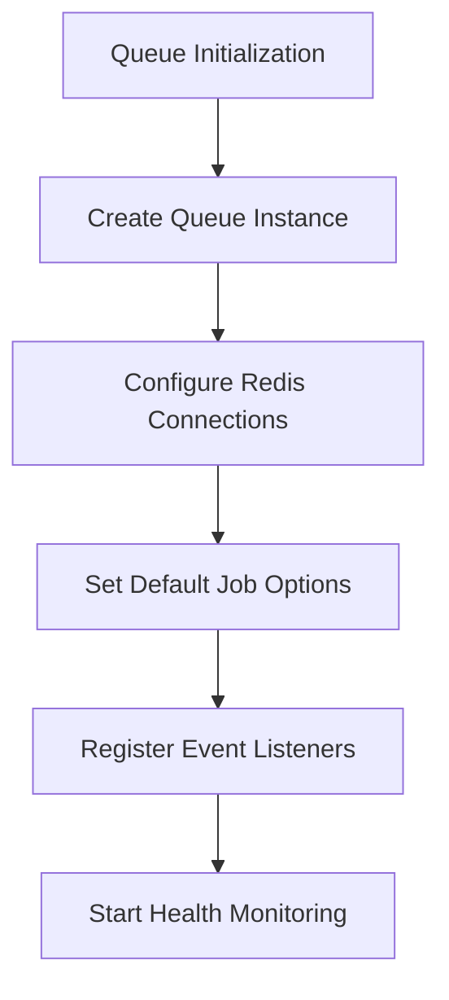
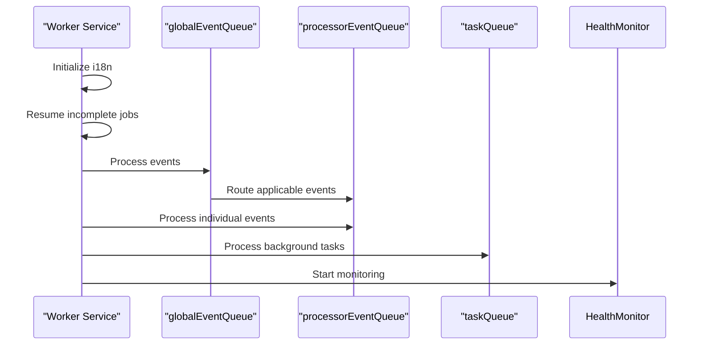
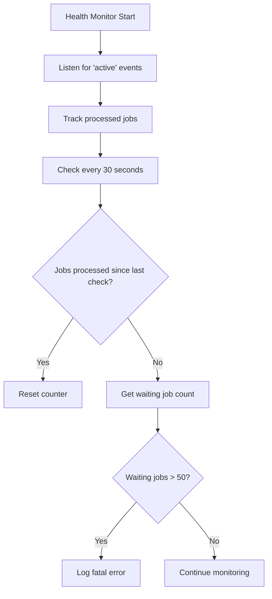
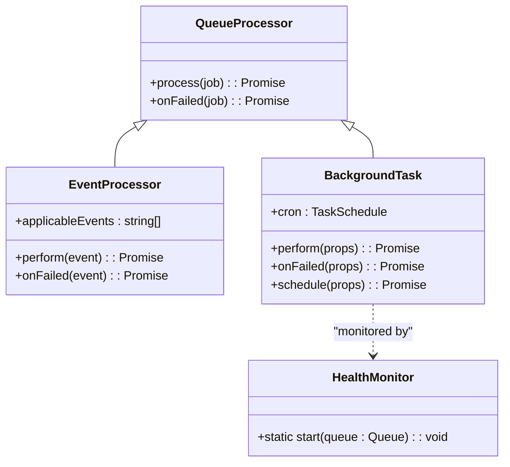
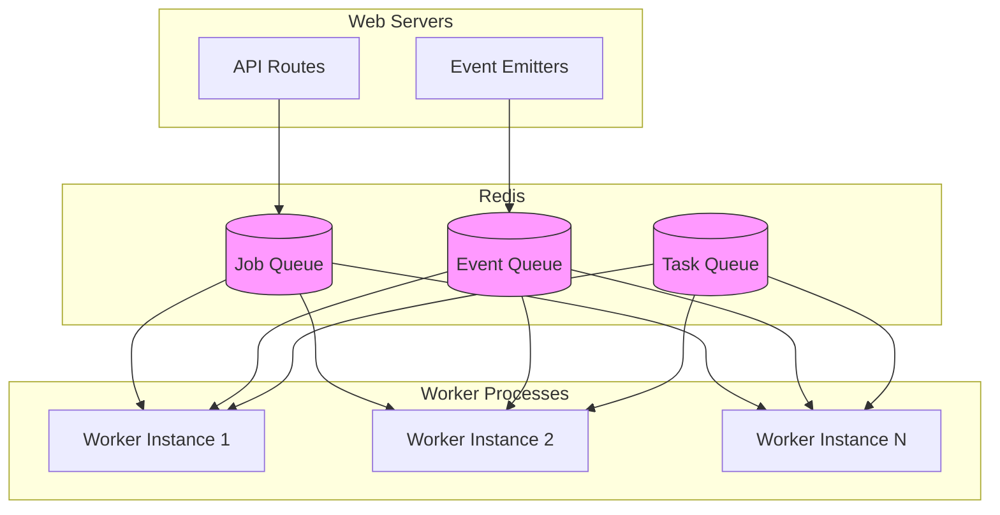
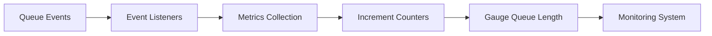

# Queue Architecture

<cite>
**Referenced Files in This Document**   
- [index.ts](file://server/queues/index.ts)
- [queue.ts](file://server/queues/queue.ts)
- [worker.ts](file://server/services/worker.ts)
- [HealthMonitor.ts](file://server/queues/HealthMonitor.ts)
</cite>

## Table of Contents
1. [Introduction](#introduction)
2. [Queue Initialization and Configuration](#queue-initialization-and-configuration)
3. [Worker Service Implementation](#worker-service-implementation)
4. [Health Monitoring System](#health-monitoring-system)
5. [Job Creation and Processing](#job-creation-and-processing)
6. [System Context and Architecture](#system-context-and-architecture)
7. [Scalability and Failure Recovery](#scalability-and-failure-recovery)
8. [Monitoring and Metrics](#monitoring-and-metrics)
9. [Technology Stack Integration](#technology-stack-integration)
10. [Separation of Concerns](#separation-of-concerns)

## Introduction
The baozi application implements a robust queue architecture using Bull for Redis-based job queuing. This system enables asynchronous processing of various tasks and events, ensuring optimal performance and reliability. The architecture separates job producers (API routes) from consumers (worker service), allowing for scalable and maintainable code organization. This document details the high-level design, implementation, and operational aspects of the queue system.

## Queue Initialization and Configuration
The queue system is initialized through the `createQueue` function in `server/queues/queue.ts`, which configures Bull queues with Redis as the backing store. The configuration includes default job options such as exponential backoff strategies and automatic removal of completed or failed jobs. Each queue is created with a specific name and tailored options to suit its purpose, including retry attempts and delay settings. The Redis connections are efficiently managed by reusing existing client connections from the application's Redis configuration.

**Diagram sources**
- [queue.ts](file://server/queues/queue.ts#L10-L68)

**Section sources**
- [queue.ts](file://server/queues/queue.ts#L10-L68)

## Worker Service Implementation
The worker service, implemented in `server/services/worker.ts`, connects to Redis and processes jobs from multiple queues. It initializes three primary queues: `globalEventQueue` for global events, `processorEventQueue` for event processors, and `taskQueue` for background tasks. The worker service processes jobs with configurable concurrency levels based on environment variables. Upon startup, it resumes any incomplete transcription jobs that were interrupted by server restarts, ensuring job continuity and reliability.

**Diagram sources**
- [worker.ts](file://server/services/worker.ts#L80-L245)

**Section sources**
- [worker.ts](file://server/services/worker.ts#L80-L245)

## Health Monitoring System
The HealthMonitor class in `server/queues/HealthMonitor.ts` provides critical monitoring capabilities for the queue system. It tracks job processing activity and detects stalled queues by monitoring the number of waiting jobs. If a queue stops processing jobs and accumulates more than 50 waiting jobs, the system logs a fatal error. This proactive monitoring ensures that queue processing issues are detected promptly, allowing for timely intervention and system stability.

**Diagram sources**
- [HealthMonitor.ts](file://server/queues/HealthMonitor.ts#L6-L39)

**Section sources**
- [HealthMonitor.ts](file://server/queues/HealthMonitor.ts#L6-L39)

## Job Creation and Processing
The queue system implements a sophisticated job processing pipeline with multiple stages. The `globalEventQueue` acts as the entry point for events, which are then routed to specific processors in the `processorEventQueue` based on their type. Tasks are processed independently in the `taskQueue` with their own concurrency settings. Each job processor and task class follows a consistent pattern with `perform` methods for execution and `onFailed` methods for error handling after maximum retry attempts.

**Diagram sources**
- [worker.ts](file://server/services/worker.ts#L80-L245)
- [HealthMonitor.ts](file://server/queues/HealthMonitor.ts#L6-L39)

**Section sources**
- [worker.ts](file://server/services/worker.ts#L80-L245)
- [HealthMonitor.ts](file://server/queues/HealthMonitor.ts#L6-L39)

## System Context and Architecture
The queue architecture forms a critical component of the baozi application's distributed system. Web servers produce jobs and events that are stored in Redis, while dedicated worker processes consume and process these jobs. This separation allows web servers to respond quickly to user requests while background processing occurs asynchronously. The architecture supports multiple worker instances for horizontal scaling and high availability.

**Diagram sources**
- [index.ts](file://server/queues/index.ts#L4-L30)
- [worker.ts](file://server/services/worker.ts#L80-L245)

**Section sources**
- [index.ts](file://server/queues/index.ts#L4-L30)
- [worker.ts](file://server/services/worker.ts#L80-L245)

## Scalability and Failure Recovery
The queue system is designed with scalability and fault tolerance in mind. Multiple worker instances can connect to the same Redis queues, enabling horizontal scaling to handle increased load. The system implements exponential backoff for job retries, preventing overwhelming external services during temporary failures. Jobs are automatically removed upon completion or failure, preventing queue bloat. The health monitoring system ensures that stalled queues are detected and addressed promptly, maintaining system reliability.

**Section sources**
- [queue.ts](file://server/queues/queue.ts#L10-L68)
- [worker.ts](file://server/services/worker.ts#L80-L245)

## Monitoring and Metrics
The queue system integrates comprehensive monitoring and metrics collection. The `createQueue` function registers listeners for various queue events such as "completed", "failed", "error", and "stalled", incrementing corresponding metrics in the application's monitoring system. Queue length and delayed job counts are periodically measured and reported as gauges, providing visibility into queue health and performance. These metrics enable proactive system management and performance optimization.

**Diagram sources**
- [queue.ts](file://server/queues/queue.ts#L43-L54)

**Section sources**
- [queue.ts](file://server/queues/queue.ts#L43-L54)

## Technology Stack Integration
The queue architecture integrates Bull, Redis, and the Koa application framework seamlessly. Bull provides the job queuing functionality with Redis as the persistent storage backend. The integration reuses existing Redis connections from the application's configuration, optimizing resource usage. The system is initialized as part of the Koa application's service layer, ensuring proper startup and shutdown sequencing. Environment variables control key aspects such as worker concurrency and retry behavior, allowing for flexible configuration across different deployment environments.

**Section sources**
- [queue.ts](file://server/queues/queue.ts#L10-L68)
- [worker.ts](file://server/services/worker.ts#L80-L245)

## Separation of Concerns
The architecture clearly separates job producers from consumers. API routes and other application components act as job producers, adding jobs to queues without concern for how or when they will be processed. Worker services act as consumers, processing jobs independently of the web request lifecycle. This separation enables responsive user interfaces, reliable background processing, and independent scaling of web and worker tiers. The pattern promotes maintainability by isolating business logic related to asynchronous processing.

**Section sources**
- [index.ts](file://server/queues/index.ts#L4-L30)
- [worker.ts](file://server/services/worker.ts#L80-L245)