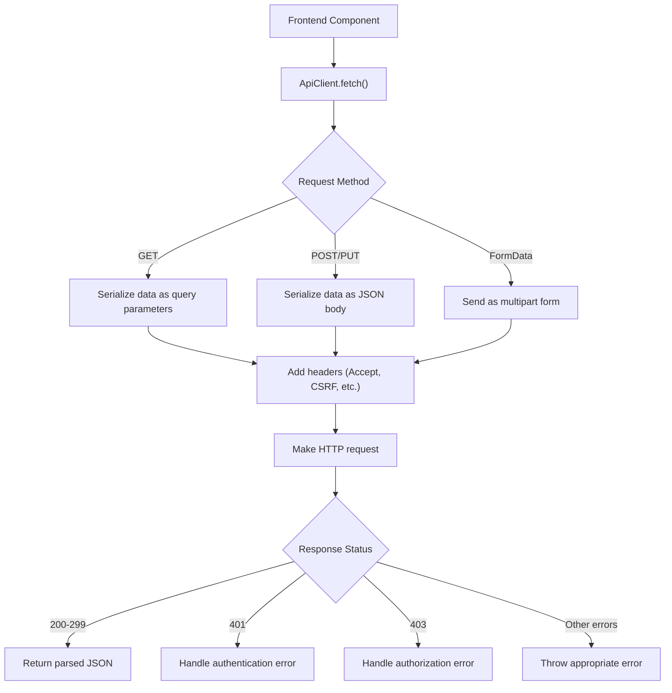
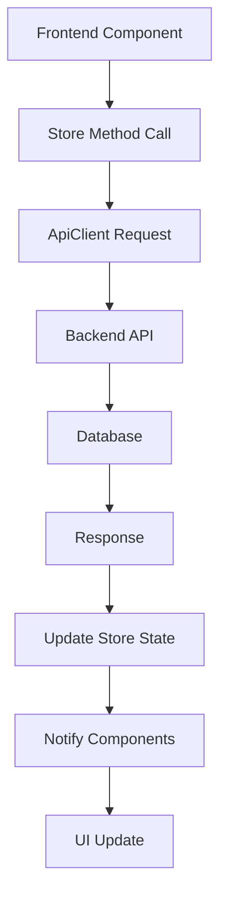
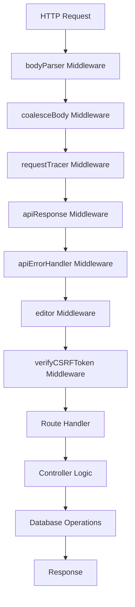
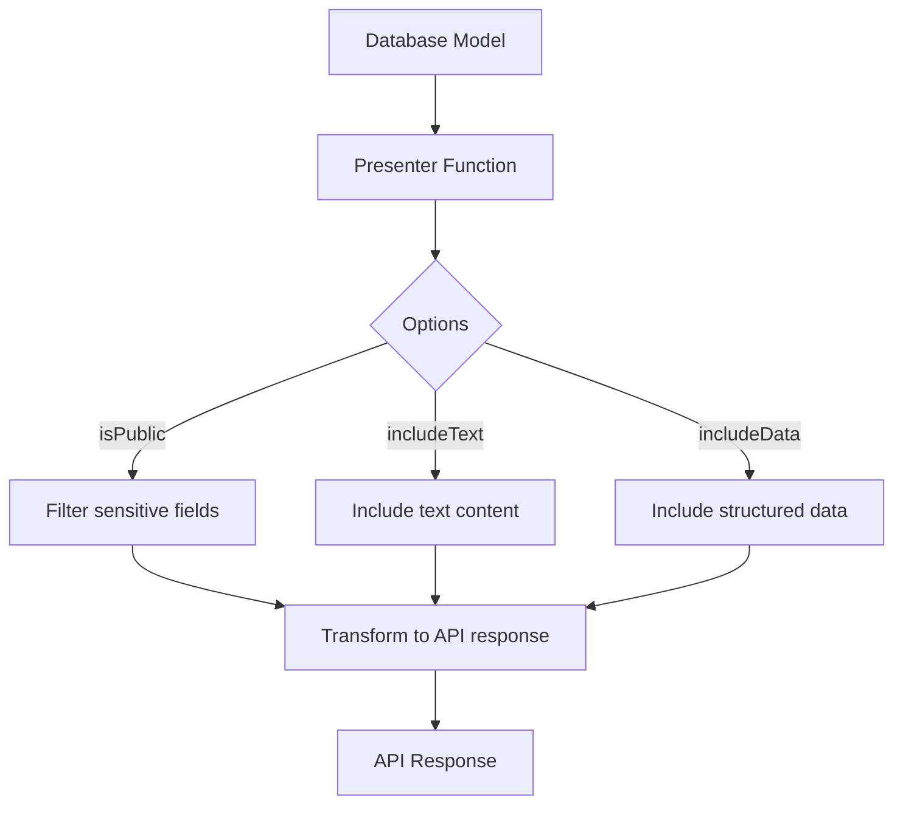
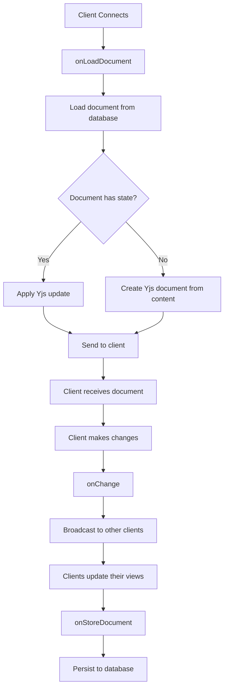
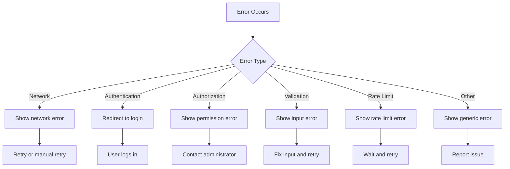
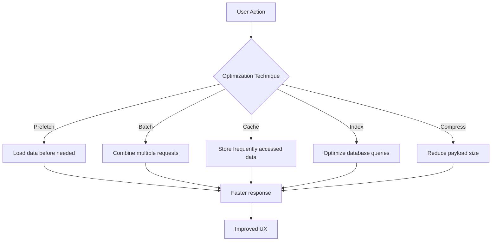
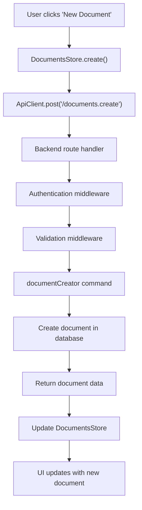
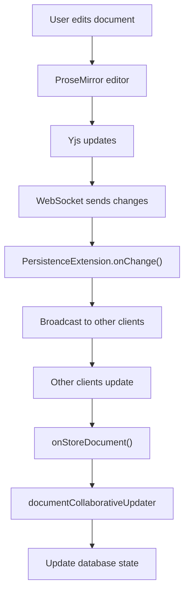
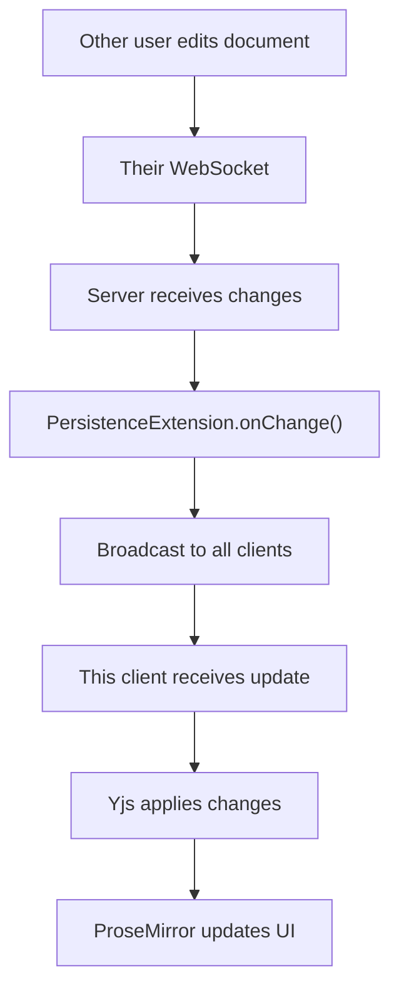

# Data Flow Between Layers

<cite>
**Referenced Files in This Document**   
- [ApiClient.ts](file://app/utils/ApiClient.ts)
- [index.ts](file://server/routes/api/index.ts)
- [DocumentsStore.ts](file://app/stores/DocumentsStore.ts)
- [authentication.ts](file://server/middlewares/authentication.ts)
- [document.ts](file://server/presenters/document.ts)
- [PersistenceExtension.ts](file://server/collaboration/PersistenceExtension.ts)
</cite>

## Table of Contents
1. [Introduction](#introduction)
2. [API Client Implementation](#api-client-implementation)
3. [Frontend Data Flow](#frontend-data-flow)
4. [Backend Request Processing](#backend-request-processing)
5. [Data Transformation with Presenters](#data-transformation-with-presenters)
6. [Real-time Synchronization](#real-time-synchronization)
7. [Error Handling and Data Consistency](#error-handling-and-data-consistency)
8. [Performance Optimization](#performance-optimization)
9. [Practical Data Flow Examples](#practical-data-flow-examples)
10. [Conclusion](#conclusion)

## Introduction
This document provides a comprehensive overview of the data flow between layers in the baozi application. It explains the complete request-response cycle from user interaction in the frontend to data persistence in the backend database. The document covers the API client implementation, frontend stores, backend middleware, data transformation using presenters, and real-time synchronization using WebSockets and Yjs for collaborative editing. The goal is to provide both conceptual understanding for beginners and technical details for experienced developers.

## API Client Implementation
The API client implementation in `app/utils/ApiClient.ts` is responsible for serializing requests and deserializing responses between the frontend and backend. It handles various aspects of HTTP communication including authentication, error handling, and request retry logic.

The `ApiClient` class provides methods for making HTTP requests to the backend API. It automatically adds necessary headers such as Accept, Content-Type, and CSRF tokens for mutating requests. The client also handles different response types, including JSON responses and file downloads.

**Diagram sources**
- [ApiClient.ts](file://app/utils/ApiClient.ts#L39-L280)

**Section sources**
- [ApiClient.ts](file://app/utils/ApiClient.ts#L1-L284)

## Frontend Data Flow
The frontend data flow in baozi is managed through stores that use the API client to make requests to server endpoints. The stores are responsible for maintaining the application state and providing a clean interface for components to interact with data.

The `DocumentsStore` is a key component in the frontend data flow, managing document-related data and providing methods for various document operations. It uses MobX observables to track state changes and provides computed properties for derived data.

**Diagram sources**
- [DocumentsStore.ts](file://app/stores/DocumentsStore.ts#L47-L752)
- [ApiClient.ts](file://app/utils/ApiClient.ts#L39-L280)

**Section sources**
- [DocumentsStore.ts](file://app/stores/DocumentsStore.ts#L1-L754)

## Backend Request Processing
The backend request processing pipeline in baozi consists of several middleware layers that handle authentication, validation, and request routing. The API routes are defined in `server/routes/api/index.ts` and are processed through a series of middleware functions.

The request processing pipeline begins with body parsing and request tracing, followed by API response formatting and error handling. The CSRF token verification is performed for mutating requests to prevent cross-site request forgery attacks.

**Diagram sources**
- [index.ts](file://server/routes/api/index.ts#L1-L138)

**Section sources**
- [index.ts](file://server/routes/api/index.ts#L1-L138)

## Data Transformation with Presenters
Data transformation between layers is handled using presenters that convert database models to API responses. The presenters ensure that only the appropriate data is exposed to the frontend and that sensitive information is properly filtered.

The `presentDocument` function in `server/presenters/document.ts` is responsible for transforming document models to API responses. It includes various options for controlling the output, such as whether to include text content or public fields only.

**Diagram sources**
- [document.ts](file://server/presenters/document.ts#L36-L113)

**Section sources**
- [document.ts](file://server/presenters/document.ts#L1-L113)

## Real-time Synchronization
Real-time data synchronization in baozi is implemented using WebSockets and Yjs for collaborative editing. The `PersistenceExtension` class in `server/collaboration/PersistenceExtension.ts` handles the synchronization of document state between clients and the backend.

The synchronization process involves loading the document state from the database when a client connects, broadcasting changes to all connected clients, and persisting the final state back to the database when the last client disconnects.

**Diagram sources**
- [PersistenceExtension.ts](file://server/collaboration/PersistenceExtension.ts#L16-L123)

**Section sources**
- [PersistenceExtension.ts](file://server/collaboration/PersistenceExtension.ts#L1-L125)

## Error Handling and Data Consistency
The baozi application implements comprehensive error handling and data consistency mechanisms to ensure reliable operation. The API client handles various error types and provides appropriate feedback to the user.

The backend middleware handles authentication and authorization errors, ensuring that only authorized users can access protected resources. Database transactions are used to maintain data consistency during complex operations.

**Diagram sources**
- [ApiClient.ts](file://app/utils/ApiClient.ts#L39-L280)
- [authentication.ts](file://server/middlewares/authentication.ts#L36-L85)

**Section sources**
- [ApiClient.ts](file://app/utils/ApiClient.ts#L1-L284)
- [authentication.ts](file://server/middlewares/authentication.ts#L1-L280)

## Performance Optimization
The baozi application includes several performance optimization techniques to ensure responsive user experience. These include request batching, data prefetching, and efficient data serialization.

The API client implements request retry logic with exponential backoff to handle temporary network issues. The backend uses database indexing and query optimization to ensure fast data retrieval.

**Diagram sources**
- [ApiClient.ts](file://app/utils/ApiClient.ts#L39-L280)
- [index.ts](file://server/routes/api/index.ts#L1-L138)

**Section sources**
- [ApiClient.ts](file://app/utils/ApiClient.ts#L1-L284)
- [index.ts](file://server/routes/api/index.ts#L1-L138)

## Practical Data Flow Examples
This section provides practical examples of common data flows in the baozi application, illustrating how data moves through the system from user interaction to persistence.

### Creating a Document
The process of creating a document involves several steps from the frontend to the backend:

**Diagram sources**
- [DocumentsStore.ts](file://app/stores/DocumentsStore.ts#L47-L752)
- [ApiClient.ts](file://app/utils/ApiClient.ts#L39-L280)
- [index.ts](file://server/routes/api/index.ts#L1-L138)

### Editing Content
The process of editing document content involves real-time synchronization between clients:

**Diagram sources**
- [PersistenceExtension.ts](file://server/collaboration/PersistenceExtension.ts#L16-L123)
- [document.ts](file://server/presenters/document.ts#L36-L113)

### Receiving Real-time Updates
The process of receiving real-time updates from other collaborators:

**Diagram sources**
- [PersistenceExtension.ts](file://server/collaboration/PersistenceExtension.ts#L16-L123)

## Conclusion
The data flow between layers in the baozi application is designed to provide a seamless and responsive user experience while maintaining data consistency and security. The API client implementation handles communication between the frontend and backend, with comprehensive error handling and retry logic. The frontend stores manage application state and provide a clean interface for components to interact with data. The backend request processing pipeline includes authentication, validation, and error handling middleware to ensure secure and reliable operation. Data transformation using presenters ensures that only appropriate data is exposed to the frontend. Real-time synchronization using WebSockets and Yjs enables collaborative editing with immediate updates across all connected clients. The system includes various performance optimizations to ensure responsive operation even with large documents and multiple collaborators.