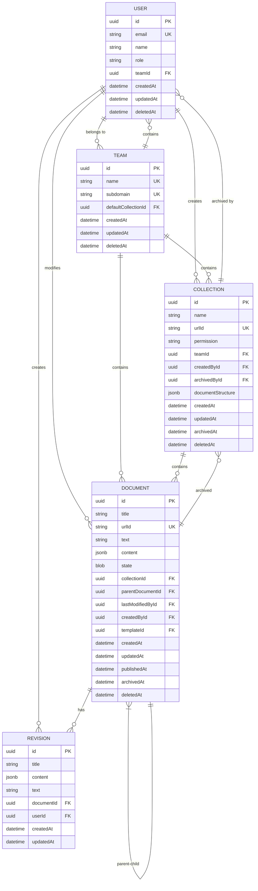

# Database Schema Design

<cite>
**Referenced Files in This Document**   
- [Collection.ts](file://server/models/Collection.ts)
- [Document.ts](file://server/models/Document.ts)
- [Revision.ts](file://server/models/Revision.ts)
- [User.ts](file://server/models/User.ts)
- [Team.ts](file://server/models/Team.ts)
- [ParanoidModel.ts](file://server/models/base/ParanoidModel.ts)
- [20160619080644-initial.js](file://server/migrations/20160619080644-initial.js)
- [20160622043741-add-parent-document.js](file://server/migrations/20160622043741-add-parent-document.js)
- [20160812145029-document-atlas-soft-delete.js](file://server/migrations/20160812145029-document-atlas-soft-delete.js)
- [20170603185012-add-collection-documentStructure-migration.js](file://server/migrations/20170603185012-add-collection-documentStructure-migration.js)
</cite>

## Table of Contents
1. [Entity Relationship Diagram](#entity-relationship-diagram)
2. [Core Models](#core-models)
3. [Migration Strategy](#migration-strategy)
4. [Soft-Delete Pattern](#soft-delete-pattern)
5. [Indexing Strategy](#indexing-strategy)
6. [Hierarchical Relationships](#hierarchical-relationships)
7. [Query Examples](#query-examples)
8. [Extending the Schema](#extending-the-schema)

## Entity Relationship Diagram

The baozi application's data model centers around five core entities: User, Team, Collection, Document, and Revision. These entities are interconnected through various relationships that support the application's collaborative document management features.



**Diagram sources**
- [Collection.ts](file://server/models/Collection.ts#L87-L1007)
- [Document.ts](file://server/models/Document.ts#L94-L1314)
- [Revision.ts](file://server/models/Revision.ts#L23-L232)
- [User.ts](file://server/models/User.ts#L81-L856)
- [Team.ts](file://server/models/Team.ts#L54-L473)

## Core Models

### User Model
The User model represents individuals within the system and serves as the foundation for authentication and authorization.

**Attributes:**
- `id`: Unique identifier (UUID)
- `email`: User's email address (unique)
- `name`: Display name
- `role`: UserRole (Admin, Member, Viewer, Guest)
- `jwtSecret`: Encrypted secret for JWT token generation
- `lastActiveAt`: Timestamp of last activity
- `suspendedAt`: Timestamp when account was suspended
- `preferences`: JSONB storing user preferences
- `notificationSettings`: JSONB storing notification preferences
- `language`: Preferred language code
- `timezone`: User's timezone
- `avatarUrl`: URL to user's avatar
- `teamId`: Foreign key to Team
- `suspendedById`: Foreign key to User who suspended the account
- `invitedById`: Foreign key to User who invited this user

**Relationships:**
- Belongs to one Team
- Can suspend other Users (self-referential)
- Can invite other Users (self-referential)
- Has many Authentications (SSO providers)
- Has many Collections through UserMembership
- Has many Documents through UserMembership
- Creates many Collections
- Modifies many Documents
- Creates many Revisions

**Constraints:**
- Email must be unique within a team
- Role must be one of the defined UserRole enum values
- Email validation with maximum length constraint

**Section sources**
- [User.ts](file://server/models/User.ts#L81-L856)

### Team Model
The Team model represents an organization or workspace that contains users, collections, and documents.

**Attributes:**
- `id`: Unique identifier (UUID)
- `name`: Team name
- `description`: Optional description
- `subdomain`: Unique subdomain for the team (cloud-hosted only)
- `domain`: Custom domain for the team
- `defaultCollectionId`: ID of the default collection
- `sharing`: Boolean indicating if sharing is enabled
- `inviteRequired`: Boolean indicating if invites are required
- `guestSignin`: Boolean indicating if guest signin is enabled
- `documentEmbeds`: Boolean indicating if document embeds are enabled
- `memberCollectionCreate`: Boolean indicating if members can create collections
- `memberTeamCreate`: Boolean indicating if members can create teams
- `defaultUserRole`: Default role for new members
- `approximateTotalAttachmentsSize`: Approximate size of all attachments
- `preferences`: JSONB storing team preferences
- `suspendedAt`: Timestamp when team was suspended
- `lastActiveAt`: Timestamp of last team activity
- `previousSubdomains`: Array of previous subdomains

**Relationships:**
- Has many Users
- Has many Collections
- Has many Documents
- Has many AuthenticationProviders
- Has many TeamDomains (allowed domains)

**Constraints:**
- Name must be unique
- Subdomain must be unique and follow naming conventions
- Domain must be a valid FQDN and unique
- Subdomain cannot be a reserved word

**Section sources**
- [Team.ts](file://server/models/Team.ts#L54-L473)

### Collection Model
The Collection model represents a container for organizing documents, similar to a folder or workspace.

**Attributes:**
- `id`: Unique identifier (UUID)
- `name`: Collection name
- `urlId`: 10-character unique identifier for URLs
- `description`: Deprecated description field (replaced by content)
- `content`: JSONB storing Prosemirror data for the collection description
- `icon`: Emoji or icon for the collection
- `color`: Color for the icon and highlights
- `index`: Sort index for ordering collections
- `permission`: CollectionPermission (null for private, Read/ReadWrite for public)
- `maintainerApprovalRequired`: Boolean indicating if maintainer approval is required
- `documentStructure`: JSONB storing the hierarchical structure of documents
- `sharing`: Boolean indicating if public sharing is enabled
- `sort`: JSONB storing sort configuration (field and direction)
- `archivedAt`: Timestamp when collection was archived
- `commenting`: Boolean indicating if commenting is enabled
- `sourceMetadata`: JSONB storing source metadata for imported collections
- `teamId`: Foreign key to Team
- `createdById`: Foreign key to User who created the collection
- `archivedById`: Foreign key to User who archived the collection
- `importId`: Foreign key to FileOperation for imports
- `apiImportId`: Foreign key to Import for API imports

**Relationships:**
- Belongs to one Team
- Belongs to one User (creator)
- Belongs to one User (archiver)
- Has many Documents
- Has many UserMemberships
- Has many GroupMemberships
- Belongs to many Users through UserMembership
- Belongs to many Groups through GroupMembership

**Constraints:**
- urlId must be exactly 10 characters
- Name length limited to CollectionValidation.maxNameLength
- Index length limited to ValidateIndex.maxLength
- Permission must be a valid CollectionPermission value
- Sort field must be "title" or "index"
- Sort direction must be "asc" or "desc"

**Section sources**
- [Collection.ts](file://server/models/Collection.ts#L87-L1007)

### Document Model
The Document model represents the core content unit in the system, storing both content and metadata.

**Attributes:**
- `id`: Unique identifier (UUID)
- `title`: Document title
- `urlId`: 10-character unique identifier for URLs
- `summary`: Document summary
- `previousTitles`: Array of previous titles
- `version`: Document version number
- `template`: Boolean indicating if document is a template
- `fullWidth`: Boolean indicating if document uses full width layout
- `insightsEnabled`: Boolean indicating if insights are enabled
- `editorVersion`: Version of the editor used
- `icon`: Emoji or icon for the document
- `color`: Color for the icon
- `text`: Deprecated text field (replaced by content)
- `content`: JSONB storing Prosemirror data
- `state`: BLOB storing YJS collaborative state
- `isWelcome`: Boolean indicating if document is part of onboarding
- `revisionCount`: Number of revisions
- `publishedAt`: Timestamp when document was published
- `collaboratorIds`: Array of user IDs who have edited the document
- `collectionId`: Foreign key to Collection
- `parentDocumentId`: Foreign key to parent Document
- `lastModifiedById`: Foreign key to User who last modified the document
- `createdById`: Foreign key to User who created the document
- `templateId`: Foreign key to template Document
- `teamId`: Foreign key to Team
- `importId`: Foreign key to FileOperation for imports
- `apiImportId`: Foreign key to Import for API imports
- `sourceMetadata`: JSONB storing source metadata for imported documents

**Relationships:**
- Belongs to one Team
- Belongs to one Collection
- Belongs to one User (last modified by)
- Belongs to one User (created by)
- Belongs to one Document (template)
- Belongs to one Document (parent)
- Has many UserMemberships
- Has many GroupMemberships
- Has many Revisions
- Has many Relationships
- Has many Stars
- Has many Views

**Constraints:**
- urlId must be exactly 10 characters
- Title length limited to DocumentValidation.maxTitleLength
- Summary length limited to DocumentValidation.maxSummaryLength
- State length limited to DocumentValidation.maxStateLength
- Version must be a small integer
- Editor version length limited to 255 characters
- Icon length limited to 50 characters
- Color must be a valid hex color

**Section sources**
- [Document.ts](file://server/models/Document.ts#L94-L1314)

### Revision Model
The Revision model captures historical versions of documents, enabling version control and rollback functionality.

**Attributes:**
- `id`: Unique identifier (UUID)
- `version`: Revision version number
- `editorVersion`: Editor version at time of revision
- `title`: Document title at time of revision
- `name`: Optional name for the revision
- `text`: Deprecated text field (replaced by content)
- `content`: JSONB storing Prosemirror data at time of revision
- `icon`: Icon at time of revision
- `color`: Color at time of revision
- `documentId`: Foreign key to Document
- `userId`: Foreign key to User who created the revision
- `collaboratorIds`: Array of user IDs who collaborated on this revision
- `createdAt`: Timestamp when revision was created
- `updatedAt`: Timestamp when revision was updated

**Relationships:**
- Belongs to one Document
- Belongs to one User

**Constraints:**
- Version must be a small integer
- Editor version length limited to 255 characters
- Title length limited to DocumentValidation.maxTitleLength
- Name length limited to RevisionValidation.maxNameLength
- Icon length limited to 50 characters
- Color must be a valid hex color

**Section sources**
- [Revision.ts](file://server/models/Revision.ts#L23-L232)

## Migration Strategy

The baozi application uses Sequelize migrations to manage schema evolution over time. Migrations are stored in the `server/migrations/` directory and are executed in chronological order based on their timestamped filenames.

### Initial Schema
The foundation of the database schema was established in the initial migration:

```javascript
// 20160619080644-initial.js
module.exports = {
  up: async (queryInterface, Sequelize) => {
    await queryInterface.createTable("teams", { /* columns */ });
    await queryInterface.createTable("users", { /* columns */ });
    await queryInterface.createTable("collections", { /* columns */ });
    await queryInterface.createTable("documents", { /* columns */ });
    // Additional tables...
  },

  down: async (queryInterface, Sequelize) => {
    await queryInterface.dropTable("revisions");
    await queryInterface.dropTable("views");
    // Drop tables in reverse order...
  }
};
```

**Section sources**
- [20160619080644-initial.js](file://server/migrations/20160619080644-initial.js)

### Key Migration Milestones

#### Document Hierarchy (2016-06-22)
The ability to organize documents hierarchically was introduced by adding a parent-child relationship:

```javascript
// 20160622043741-add-parent-document.js
module.exports = {
  up: async (queryInterface, Sequelize) => {
    await queryInterface.addColumn("documents", "parentDocumentId", {
      type: Sequelize.UUID,
      references: {
        model: "documents",
        key: "id",
      },
      onUpdate: "CASCADE",
      onDelete: "SET NULL",
    });

    await queryInterface.addIndex("documents", ["parentDocumentId"]);
  },
  // down migration...
};
```

This migration enabled the creation of document trees, allowing users to organize content in a nested structure.

**Section sources**
- [20160622043741-add-parent-document.js](file://server/migrations/20160622043741-add-parent-document.js)

#### Soft Delete Implementation (2016-08-12)
The soft-delete pattern was implemented to allow for data recovery and maintain referential integrity:

```javascript
// 20160812145029-document-atlas-soft-delete.js
module.exports = {
  up: async (queryInterface, Sequelize) => {
    await queryInterface.addColumn("documents", "deletedAt", {
      type: Sequelize.DATE,
      allowNull: true,
    });

    await queryInterface.addIndex("documents", ["deletedAt"]);
  },
  // down migration...
};
```

This migration added the `deletedAt` column to the documents table, which is used in conjunction with Sequelize's paranoid mode to implement soft deletion.

**Section sources**
- [20160812145029-document-atlas-soft-delete.js](file://server/migrations/20160812145029-document-atlas-soft-delete.js)

#### Collection Document Structure (2017-06-03)
To support complex collection hierarchies, a JSONB column was added to store the document structure:

```javascript
// 20170603185012-add-collection-documentStructure-migration.js
module.exports = {
  up: async (queryInterface, Sequelize) => {
    await queryInterface.addColumn("collections", "documentStructure", {
      type: Sequelize.JSONB,
      defaultValue: [],
    });
  },
  // down migration...
};
```

This migration introduced the `documentStructure` column, which stores the hierarchical arrangement of documents within a collection as a JSON array of navigation nodes.

**Section sources**
- [20170603185012-add-collection-documentStructure-migration.js](file://server/migrations/20170603185012-add-collection-documentStructure-migration.js)

### Migration Best Practices

1. **Atomic Operations**: Each migration performs a single logical change to the schema, making it easier to understand and potentially roll back.

2. **Idempotent Down Migrations**: The `down` functions are designed to completely reverse the changes made by the `up` function, ensuring that the database can be restored to its previous state.

3. **Index Management**: Indexes are added alongside column creation to ensure optimal query performance from the moment new columns are available.

4. **Foreign Key Constraints**: Proper foreign key constraints with appropriate `ON UPDATE` and `ON DELETE` behaviors are established to maintain referential integrity.

5. **Data Migration**: When schema changes require data transformation, migrations include the necessary data migration logic within the same transaction.

6. **Testing**: Migrations are tested in development and staging environments before deployment to production.

## Soft-Delete Pattern

The baozi application implements a comprehensive soft-delete pattern across its models to prevent accidental data loss and enable recovery of deleted content.

### Implementation

The soft-delete functionality is primarily implemented through the `ParanoidModel` base class and the `deletedAt` column:

```typescript
// server/models/base/ParanoidModel.ts
class ParanoidModel extends IdModel {
  @DeletedAt
  deletedAt: Date | null;

  get isDeleted() {
    return !!this.deletedAt;
  }
}
```

Models that need soft-delete capability extend `ParanoidModel` instead of `IdModel`. When a model instance is deleted, Sequelize automatically sets the `deletedAt` timestamp rather than removing the row from the database.

**Section sources**
- [ParanoidModel.ts](file://server/models/base/ParanoidModel.ts#L3-L11)

### Model-Specific Soft-Delete Behavior

#### Collection Soft-Delete
When a Collection is deleted, all documents within that collection are also soft-deleted:

```typescript
@BeforeDestroy
static async deleteDocuments(model: Collection, ctx: APIContext["context"]) {
  await Document.update(
    {
      lastModifiedById: ctx.auth.user.id,
      deletedAt: new Date(),
    },
    {
      transaction: ctx.transaction,
      where: {
        teamId: model.teamId,
        collectionId: model.id,
        archivedAt: {
          [Op.is]: null,
        },
      },
    }
  );
}
```

This ensures that when a collection is removed, its documents are not orphaned but are instead moved to the trash along with the collection.

**Section sources**
- [Collection.ts](file://server/models/Collection.ts#L87-L1007)

#### Document Soft-Delete
Documents implement a cascading soft-delete pattern where deleting a parent document also deletes its children:

```typescript
deleteDocument = async function (document: Document, options?: FindOptions) {
  await this.removeDocumentInStructure(document, options);

  // Helper to destroy all child documents for a document
  const loopChildren = async (
    documentId: string,
    opts?: FindOptions<Document>
  ) => {
    const childDocuments = await Document.findAll({
      where: {
        parentDocumentId: documentId,
      },
    });

    for (const child of childDocuments) {
      await loopChildren(child.id, opts);
      await child.destroy(opts);
    }
  };

  await loopChildren(document.id, options);
  await document.destroy(options);
};
```

This recursive deletion ensures that document hierarchies are properly cleaned up when a parent document is deleted.

**Section sources**
- [Document.ts](file://server/models/Document.ts#L94-L1314)

### Benefits of Soft-Delete

1. **Data Recovery**: Users can restore accidentally deleted content from the trash.
2. **Audit Trail**: The `deletedAt` timestamp provides an audit trail of when content was removed.
3. **Referential Integrity**: Foreign key relationships remain intact, preventing orphaned records.
4. **Event Tracking**: Deletion events can be tracked and reported in activity streams.
5. **Compliance**: Meets data retention requirements by allowing for temporary storage of deleted content.

### Limitations and Considerations

1. **Storage Overhead**: Soft-deleted records continue to consume database storage until permanently removed.
2. **Query Performance**: Queries must filter out soft-deleted records, potentially impacting performance.
3. **Index Bloat**: Indexes continue to include soft-deleted records, increasing index size.
4. **Unique Constraints**: Unique constraints must consider the `deletedAt` status to allow reuse of values from deleted records.

## Indexing Strategy

The baozi application employs a comprehensive indexing strategy to optimize query performance across its core operations.

### Primary Indexes

Each model has a primary key index on the `id` column, which is a UUID. This provides O(1) lookup performance for direct record access.

### Secondary Indexes

#### Collection Indexes
```typescript
@Unique
@Column
urlId: string;

@Length({
  max: ValidateIndex.maxLength,
  msg: `index must be ${ValidateIndex.maxLength} characters or less`,
})
@Column
index: string | null;
```

The `urlId` column has a unique index to ensure URL uniqueness and enable fast lookups by URL. The `index` column is indexed for sorting collections.

**Section sources**
- [Collection.ts](file://server/models/Collection.ts#L87-L1007)

#### Document Indexes
```typescript
@Unique
@Column
urlId: string;

@ForeignKey(() => Document)
@Column(DataType.UUID)
parentDocumentId: string | null;

@ForeignKey(() => Collection)
@Column(DataType.UUID)
collectionId?: string | null;

@ForeignKey(() => User)
@Column(DataType.UUID)
lastModifiedById: string;

@ForeignKey(() => User)
@Column(DataType.UUID)
createdById: string;

@IsDate
@Column
publishedAt: Date | null;

@IsDate
@Column
archivedAt: Date | null;
```

Documents are indexed on `urlId` for URL-based lookups, `parentDocumentId` for hierarchical queries, `collectionId` for collection membership, `lastModifiedById` and `createdById` for user-based queries, and `publishedAt` and `archivedAt` for status filtering.

**Section sources**
- [Document.ts](file://server/models/Document.ts#L94-L1314)

#### User Indexes
```typescript
@IsEmail
@Column
email: string | null;

@ForeignKey(() => Team)
@Column(DataType.UUID)
teamId: string;

@IsDate
@Column
lastActiveAt: Date | null;

@IsDate
@Column
suspendedAt: Date | null;
```

Users are indexed on `email` for authentication, `teamId` for team membership, `lastActiveAt` for activity tracking, and `suspendedAt` for status filtering.

**Section sources**
- [User.ts](file://server/models/User.ts#L81-L856)

#### Composite Indexes
The application uses composite indexes for common query patterns:

```javascript
// 20160626063409-add-indexes.js
await queryInterface.addIndex("documents", ["collectionId", "publishedAt"]);
await queryInterface.addIndex("documents", ["teamId", "createdAt"]);
await queryInterface.addIndex("collections", ["teamId", "index"]);
```

These composite indexes optimize queries that filter by multiple columns simultaneously, such as finding all published documents in a collection or all collections in a team ordered by index.

**Section sources**
- [20160626063409-add-indexes.js](file://server/migrations/20160626063409-add-indexes.js)

### Indexing Best Practices

1. **Query-Driven Indexing**: Indexes are created based on actual query patterns rather than theoretical usage.
2. **Selective Indexing**: Only columns frequently used in WHERE, JOIN, ORDER BY, and GROUP BY clauses are indexed.
3. **Composite Index Order**: Columns in composite indexes are ordered from most selective to least selective.
4. **Index Maintenance**: Unused or redundant indexes are periodically reviewed and removed.
5. **Performance Monitoring**: Query performance is monitored to identify missing indexes or problematic queries.

## Hierarchical Relationships

The baozi application implements sophisticated hierarchical relationships to support content organization and navigation.

### Document Trees

Documents can be organized into hierarchical trees through the parent-child relationship:

```typescript
@BelongsTo(() => Document, "parentDocumentId")
parentDocument: Document | null;

@ForeignKey(() => Document)
@Column(DataType.UUID)
parentDocumentId: string | null;
```

This relationship enables the creation of document hierarchies where documents can have child documents, forming a tree structure. The application provides methods to navigate and manipulate these hierarchies:

```typescript
getDocumentTree = (documentId: string): NavigationNode | null => {
  if (!this.documentStructure) {
    return null;
  }

  let result!: NavigationNode | undefined;

  const loopChildren = (documents: NavigationNode[]) => {
    if (result) {
      return;
    }

    documents.forEach((document) => {
      if (result) {
        return;
      }

      if (document.id === documentId) {
        result = document;
      } else {
        loopChildren(document.children);
      }
    });
  };

  loopChildren(this.documentStructure);

  if (!result) {
    return null;
  }

  return {
    ...result,
    children: sortNavigationNodes(result.children, this.sort),
  };
};
```

This method recursively searches the document structure to find a specific document and its subtree, enabling features like table of contents and breadcrumb navigation.

**Section sources**
- [Collection.ts](file://server/models/Collection.ts#L87-L1007)

### Collection Structures

Collections maintain their own hierarchical structure of documents through the `documentStructure` JSONB column:

```typescript
@Default(null)
@Column(DataType.JSONB)
documentStructure: NavigationNode[] | null;
```

The `documentStructure` stores an array of `NavigationNode` objects that represent the hierarchical arrangement of documents within the collection. Each `NavigationNode` contains:

- `id`: Document ID
- `title`: Document title
- `url`: Document URL
- `icon`: Document icon
- `color`: Icon color
- `children`: Array of child navigation nodes
- `isDraft`: Boolean indicating if document is a draft

This structure enables manual sorting of documents within a collection and supports nested organization of content.

### Implementation Details

The hierarchical relationships are maintained through several mechanisms:

1. **Database Constraints**: Foreign key constraints ensure referential integrity between parent and child documents.

2. **Application Logic**: The `checkParentDocument` hook prevents infinite loops by ensuring a document cannot be its own parent or nested within itself:

```typescript
@BeforeUpdate
static async checkParentDocument(model: Document, options: SaveOptions) {
  if (
    model.previous("parentDocumentId") === model.parentDocumentId ||
    !model.parentDocumentId
  ) {
    return;
  }

  if (model.parentDocumentId === model.id) {
    throw ValidationError(
      "infinite loop detected, cannot nest a document inside itself"
    );
  }

  const childDocumentIds = await model.findAllChildDocumentIds(
    undefined,
    options
  );
  if (childDocumentIds.includes(model.parentDocumentId)) {
    throw ValidationError(
      "infinite loop detected, cannot nest a document inside itself"
    );
  }
}
```

3. **Recursive Operations**: Methods like `deleteDocument` and `findAllChildDocumentIds` use recursion to traverse the document tree and perform operations on entire subtrees.

4. **Caching**: The document structure is cached in Redis to improve performance for frequently accessed collections:

```typescript
@AfterSave
static async cacheDocumentStructure(
  model: Collection,
  options: SaveOptions<Collection>
) {
  if (model.changed("documentStructure")) {
    const setData = () =>
      CacheHelper.setData(
        CacheHelper.getCollectionDocumentsKey(model.id),
        model.documentStructure,
        60
      );

    if (options.transaction) {
      return (options.transaction.parent || options.transaction).afterCommit(
        setData
      );
    }

    await setData();
  }
}
```

**Section sources**
- [Collection.ts](file://server/models/Collection.ts#L87-L1007)

## Query Examples

This section provides practical examples of common queries using the Sequelize ORM.

### Finding a Document by URL
```typescript
// Find a document by its URL ID
const document = await Document.findByPk(urlId, {
  include: [
    {
      model: User,
      as: "createdBy",
      paranoid: false,
    },
    {
      model: User,
      as: "updatedBy",
      paranoid: false,
    },
    {
      model: Collection,
      as: "collection",
    },
  ],
});
```

This query uses the `findByPk` method with a custom implementation that supports lookup by URL ID in addition to the primary key. The `include` option specifies related models to eager load.

**Section sources**
- [Document.ts](file://server/models/Document.ts#L94-L1314)

### Finding All Documents in a Collection
```typescript
// Find all published documents in a collection
const documents = await Document.findAll({
  where: {
    collectionId: collectionId,
    publishedAt: {
      [Op.ne]: null,
    },
  },
  include: [
    {
      model: User,
      as: "createdBy",
      paranoid: false,
    },
    {
      model: User,
      as: "updatedBy",
      paranoid: false,
    },
  ],
  order: [
    // Using LC_COLLATE:"C" because we need byte order to drive the sorting
    Sequelize.literal('"document"."index" collate "C"'),
    ["title", "ASC"],
  ],
});
```

This query retrieves all published documents in a specific collection, ordered by index and title. The `LC_COLLATE:"C"` ensures byte-order sorting for the index field.

**Section sources**
- [Document.ts](file://server/models/Document.ts#L94-L1314)

### Finding a User's Accessible Collections
```typescript
// Find all collections a user has access to
const collectionIds = await user.collectionIds();
const collections = await Collection.findAll({
  where: {
    id: collectionIds,
  },
  order: [
    // Using LC_COLLATE:"C" because we need byte order to drive the sorting
    Sequelize.literal('"collection"."index" collate "C"'),
    ["updatedAt", "DESC"],
  ],
});
```

This query uses the `collectionIds` method on the User model to determine which collections the user can access, considering both direct membership and group membership.

**Section sources**
- [User.ts](file://server/models/User.ts#L81-L856)

### Finding Document Revisions
```typescript
// Find the latest revision for a document
const latestRevision = await Revision.findOne({
  where: {
    documentId: documentId,
  },
  order: [["createdAt", "DESC"]],
  include: [
    {
      model: User,
      as: "user",
      paranoid: false,
    },
  ],
});

// Find the revision before a specific revision
const previousRevision = await revision.before();
```

These queries demonstrate how to access document revision history, including finding the most recent revision and navigating the revision timeline.

**Section sources**
- [Revision.ts](file://server/models/Revision.ts#L23-L232)

### Creating a New Document
```typescript
// Create a new document in a collection
const document = await Document.create({
  title: "New Document",
  collectionId: collectionId,
  parentDocumentId: parentDocumentId,
  createdById: userId,
  lastModifiedById: userId,
  teamId: teamId,
}, {
  hooks: true,
});

// Add the document to the collection structure
await collection.addDocumentToStructure(document, 0);
```

This example shows how to create a new document and add it to the collection's document structure, triggering the appropriate hooks and updates.

**Section sources**
- [Document.ts](file://server/models/Document.ts#L94-L1314)

## Extending the Schema

The baozi application's schema is designed to be extensible, allowing for the addition of new fields and functionality.

### Adding Custom Fields

To add a new field to an existing model, follow these steps:

1. **Create a Migration**
```javascript
// 20251104000000-add-custom-field-to-documents.js
module.exports = {
  up: async (queryInterface, Sequelize) => {
    await queryInterface.addColumn("documents", "customField", {
      type: Sequelize.STRING,
      allowNull: true,
    });

    await queryInterface.addIndex("documents", ["customField"]);
  },

  down: async (queryInterface, Sequelize) => {
    await queryInterface.removeIndex("documents", ["customField"]);
    await queryInterface.removeColumn("documents", "customField");
  }
};
```

2. **Update the Model**
```typescript
// In Document.ts
@Column
customField: string | null;
```

3. **Update Validation**
```typescript
// In validators/CustomFieldValidator.ts
import { Validator } from "sequelize-typescript";

export default class CustomFieldValidator extends Validator<string | null> {
  validate(value: string | null) {
    if (value && value.length > 255) {
      throw new Error("Custom field must be 255 characters or less");
    }
  }
}
```

4. **Update the Model with Validation**
```typescript
import CustomFieldValidator from "./validators/CustomFieldValidator";

@CustomFieldValidator
@Column
customField: string | null;
```

### Adding New Models

To add a completely new model to the system:

1. **Create the Model File**
```typescript
// server/models/CustomModel.ts
import {
  Table,
  Column,
  ForeignKey,
  BelongsTo,
  DataType,
} from "sequelize-typescript";
import { InferAttributes, InferCreationAttributes } from "sequelize";
import ParanoidModel from "./base/ParanoidModel";
import Document from "./Document";
import User from "./User";

@Table({ tableName: "custom_models", modelName: "customModel" })
class CustomModel extends ParanoidModel<
  InferAttributes<CustomModel>,
  Partial<InferCreationAttributes<CustomModel>>
> {
  @Column(DataType.TEXT)
  content: string;

  @ForeignKey(() => Document)
  @Column(DataType.UUID)
  documentId: string;

  @BelongsTo(() => Document, "documentId")
  document: Document;

  @ForeignKey(() => User)
  @Column(DataType.UUID)
  createdById: string;

  @BelongsTo(() => User, "createdById")
  createdBy: User;
}

export default CustomModel;
```

2. **Create a Migration**
```javascript
// 20251104000001-create-custom-models.js
module.exports = {
  up: async (queryInterface, Sequelize) => {
    await queryInterface.createTable("custom_models", {
      id: {
        type: Sequelize.UUID,
        defaultValue: Sequelize.UUIDV4,
        primaryKey: true,
      },
      content: {
        type: Sequelize.TEXT,
        allowNull: false,
      },
      documentId: {
        type: Sequelize.UUID,
        references: {
          model: "documents",
          key: "id",
        },
        onUpdate: "CASCADE",
        onDelete: "CASCADE",
      },
      createdById: {
        type: Sequelize.UUID,
        references: {
          model: "users",
          key: "id",
        },
        onUpdate: "CASCADE",
        onDelete: "SET NULL",
      },
      createdAt: {
        type: Sequelize.DATE,
        allowNull: false,
      },
      updatedAt: {
        type: Sequelize.DATE,
        allowNull: false,
      },
      deletedAt: {
        type: Sequelize.DATE,
        allowNull: true,
      },
    });

    await queryInterface.addIndex("custom_models", ["documentId"]);
    await queryInterface.addIndex("custom_models", ["createdById"]);
  },

  down: async (queryInterface, Sequelize) => {
    await queryInterface.dropTable("custom_models");
  }
};
```

3. **Register the Model**
```typescript
// server/models/index.ts
import CustomModel from "./CustomModel";

// Add to the list of models
const models = [
  // existing models...
  CustomModel,
];

export default models;
```

### Best Practices for Schema Extension

1. **Use Appropriate Data Types**: Choose the most specific data type for your field (e.g., use `DataType.ENUM` for fields with a fixed set of values).

2. **Add Indexes Judiciously**: Only add indexes for fields that will be frequently queried.

3. **Consider Performance Impact**: Large text fields or JSONB columns can impact query performance and should be used carefully.

4. **Maintain Referential Integrity**: Use foreign key constraints with appropriate `ON UPDATE` and `ON DELETE` behaviors.

5. **Follow Naming Conventions**: Use consistent naming conventions for columns and indexes.

6. **Document Changes**: Add comments to your code explaining the purpose of new fields or models.

7. **Test Thoroughly**: Test your changes with realistic data volumes to ensure performance is acceptable.

By following these patterns and best practices, you can extend the baozi application's schema to support new features while maintaining data integrity and performance.