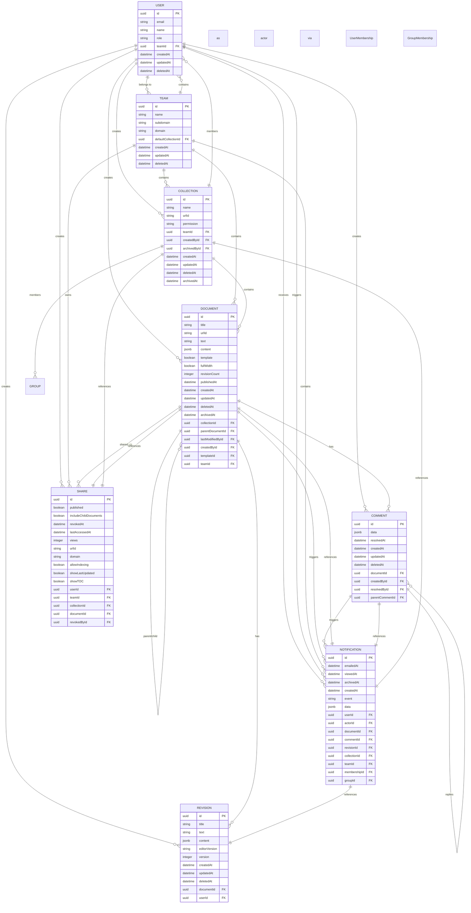
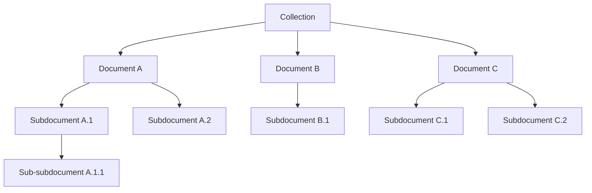
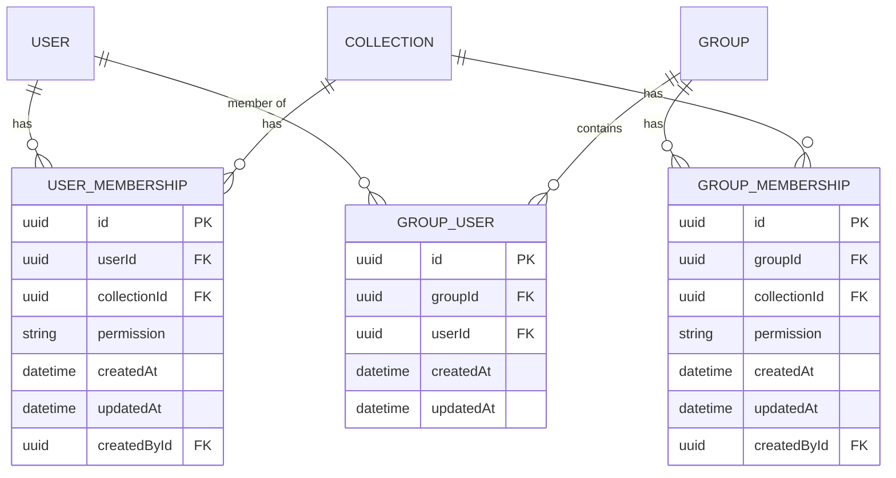
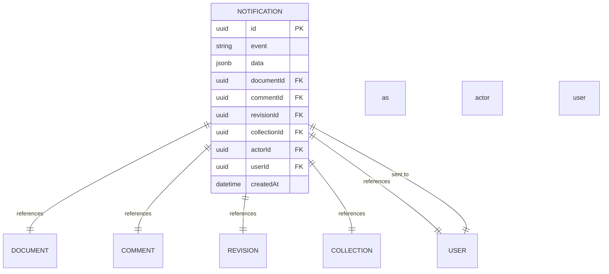

# Entity Relationship Diagram

<cite>
**Referenced Files in This Document**   
- [Collection.ts](file://server/models/Collection.ts)
- [Document.ts](file://server/models/Document.ts)
- [User.ts](file://server/models/User.ts)
- [Team.ts](file://server/models/Team.ts)
- [Comment.ts](file://server/models/Comment.ts)
- [Share.ts](file://server/models/Share.ts)
- [Notification.ts](file://server/models/Notification.ts)
- [Revision.ts](file://server/models/Revision.ts)
</cite>

## Table of Contents
1. [Introduction](#introduction)
2. [Core Entities Overview](#core-entities-overview)
3. [Entity Relationships](#entity-relationships)
4. [Hierarchical Document Structure](#hierarchical-document-structure)
5. [Many-to-Many Relationships](#many-to-many-relationships)
6. [Soft-Delete Pattern](#soft-delete-pattern)
7. [Polymorphic Associations](#polymorphic-associations)
8. [Data Access Patterns and Optimization](#data-access-patterns-and-optimization)
9. [Sample Data Scenarios](#sample-data-scenarios)

## Introduction
This document provides comprehensive data model documentation for the baozi application's core entities. It details the entity relationships between User, Team, Collection, Document, Revision, Comment, Share, and Notification, explaining foreign key constraints, cascading behaviors, and referential integrity rules implemented in Sequelize models. The document also covers hierarchical structures, many-to-many relationships, soft-delete patterns, polymorphic associations, and data access optimization strategies.

**Section sources**
- [Collection.ts](file://server/models/Collection.ts)
- [Document.ts](file://server/models/Document.ts)
- [User.ts](file://server/models/User.ts)

## Core Entities Overview
The baozi application's data model consists of several core entities that form the foundation of the system. These entities include User, Team, Collection, Document, Revision, Comment, Share, and Notification. Each entity has specific attributes and relationships that define its role within the application.

The User entity represents individuals who interact with the system, while the Team entity groups users together for collaborative work. Collections organize Documents, which are the primary content units. Revisions track changes to documents over time, Comments enable discussion on content, Shares provide external access to resources, and Notifications inform users of relevant events.

**Section sources**
- [User.ts](file://server/models/User.ts)
- [Team.ts](file://server/models/Team.ts)
- [Collection.ts](file://server/models/Collection.ts)
- [Document.ts](file://server/models/Document.ts)

## Entity Relationships
The baozi application implements a comprehensive set of relationships between its core entities, ensuring data integrity and enabling complex functionality. These relationships are defined using Sequelize associations with appropriate foreign key constraints and cascading behaviors.

**Diagram sources**
- [User.ts](file://server/models/User.ts)
- [Team.ts](file://server/models/Team.ts)
- [Collection.ts](file://server/models/Collection.ts)
- [Document.ts](file://server/models/Document.ts)
- [Revision.ts](file://server/models/Revision.ts)
- [Comment.ts](file://server/models/Comment.ts)
- [Share.ts](file://server/models/Share.ts)
- [Notification.ts](file://server/models/Notification.ts)

## Hierarchical Document Structure
The baozi application implements a hierarchical structure for documents within collections, allowing for organized content organization and navigation. This structure is maintained through parent-child relationships between documents and is represented in the Collection model's documentStructure field.

Documents can be nested within other documents, creating a tree-like hierarchy. The parentDocumentId foreign key in the Document model establishes this relationship, linking child documents to their parent. This enables features like document outlining, nested navigation, and inheritance of permissions and properties.

The Collection model maintains a documentStructure field of type NavigationNode[] | null, which stores the hierarchical arrangement of documents. This structure is updated automatically when documents are created, moved, or deleted, ensuring consistency between the database records and the visual representation in the user interface.

**Diagram sources**
- [Collection.ts](file://server/models/Collection.ts#L270-L271)
- [Document.ts](file://server/models/Document.ts#L581-L586)

## Many-to-Many Relationships
The baozi application implements several many-to-many relationships to support complex collaboration scenarios. These relationships are established through junction tables that connect entities without creating direct dependencies.

The User-Collection relationship is managed through the UserMembership model, allowing users to have specific permissions within collections. Similarly, the Group-Collection relationship is handled by the GroupMembership model, enabling group-based access control. The User-Document relationship also uses UserMembership, extending the permission system to individual documents.

These many-to-many relationships support flexible access control, allowing users to be members of multiple collections and collections to have multiple members. The junction tables include additional fields like permission levels, creation timestamps, and creator references, providing rich context for each relationship.

**Diagram sources**
- [Collection.ts](file://server/models/Collection.ts#L527-L531)
- [Document.ts](file://server/models/Document.ts#L619-L624)
- [User.ts](file://server/models/User.ts#L247-L248)

## Soft-Delete Pattern
The baozi application implements a soft-delete pattern using the deletedAt field across multiple entities, including User, Team, Collection, Document, Comment, and Revision. This approach preserves data integrity while allowing for record recovery and maintaining referential integrity in related records.

When an entity is deleted, the deletedAt timestamp is set to the current time instead of removing the record from the database. This enables features like trash recovery, audit logging, and historical data preservation. The soft-delete pattern is implemented consistently across the application using the ParanoidModel base class, which automatically handles the deletedAt field and modifies queries to exclude soft-deleted records by default.

The soft-delete implementation includes cascading behaviors to maintain data consistency. For example, when a Collection is deleted, all associated Documents are also soft-deleted. Similarly, when a Document is deleted, its Revisions and Comments are soft-deleted. This ensures that related data remains intact and can be restored if the parent entity is recovered.

**Section sources**
- [Collection.ts](file://server/models/Collection.ts#L302-L305)
- [Document.ts](file://server/models/Document.ts#L270-L273)
- [User.ts](file://server/models/User.ts#L160-L162)

## Polymorphic Associations
The baozi application implements polymorphic associations through the Notification entity, which can reference multiple entity types including Document, Comment, Revision, Collection, and User. This design allows a single notification system to handle events from various sources without requiring separate notification tables for each entity type.

The Notification model includes multiple foreign key fields (documentId, commentId, revisionId, collectionId, actorId) that can reference different entity types. This polymorphic design enables the system to generate notifications for diverse events such as document updates, comment creations, and collection permission changes while maintaining a unified notification infrastructure.

The polymorphic association is further enhanced by the event field, which specifies the type of notification (e.g., "document.publish", "comment.create"), and the data field, which stores additional context-specific information as JSON. This flexible structure supports extensibility, allowing new notification types to be added without schema changes.

**Diagram sources**
- [Notification.ts](file://server/models/Notification.ts#L132-L185)

## Data Access Patterns and Optimization
The baozi application employs several data access patterns and optimization strategies to ensure efficient querying and maintain performance at scale. These strategies include strategic indexing, query optimization, and caching mechanisms.

The application uses database indexes on frequently queried fields such as urlId, teamId, collectionId, and createdAt to accelerate lookups. Composite indexes are implemented for common query patterns, such as finding documents by collection and publication status. The models also define Sequelize scopes that pre-configure common query patterns with appropriate includes and filters.

For hierarchical data access, the application implements caching strategies to reduce database load. The Collection model caches its documentStructure in Redis, reducing the need to query and reconstruct the hierarchy for each request. The application also uses transaction-aware caching to ensure data consistency during updates.

Query optimization is achieved through selective field loading, where only necessary attributes are retrieved from the database. The models define default scopes that exclude large fields like documentStructure by default, with explicit inclusion when needed. This reduces network overhead and memory usage for common operations.

**Section sources**
- [Collection.ts](file://server/models/Collection.ts#L88-L197)
- [Document.ts](file://server/models/Document.ts#L95-L264)
- [User.ts](file://server/models/User.ts#L82-L126)

## Sample Data Scenarios
The following scenarios illustrate how records are created and related across tables in the baozi application:

1. **User Creation and Team Assignment**: When a new user is created, they are assigned to a team through the teamId foreign key. The User model's beforeCreate hook generates a random JWT secret for authentication.

2. **Collection Creation with Membership**: When a collection is created, a UserMembership record is automatically created for the creator with admin permissions. This establishes the initial ownership and access control for the collection.

3. **Document Hierarchy Formation**: When a document is created within a collection, it is automatically added to the collection's documentStructure. If the document has a parentDocumentId, it is nested within the parent in the hierarchy.

4. **Revision Creation on Document Update**: When a document is updated, a new Revision record is created automatically, capturing the previous state of the document. The revisionCount on the document is incremented to reflect the change.

5. **Notification Generation on Content Changes**: When significant events occur (e.g., document publication, comment creation), corresponding Notification records are created for relevant users, establishing the polymorphic relationship with the triggering entity.

These scenarios demonstrate the integrated nature of the data model, where operations on one entity often trigger cascading effects across related entities, maintaining data consistency and enabling rich application functionality.

**Section sources**
- [Collection.ts](file://server/models/Collection.ts#L444-L461)
- [Document.ts](file://server/models/Document.ts#L487-L533)
- [Revision.ts](file://server/models/Revision.ts#L201-L213)
- [Notification.ts](file://server/models/Notification.ts#L198-L221)