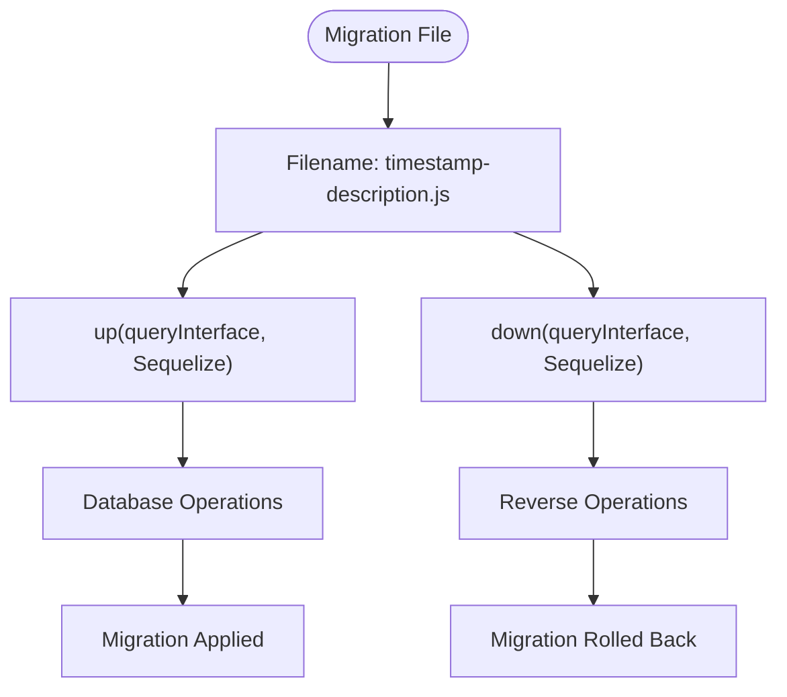
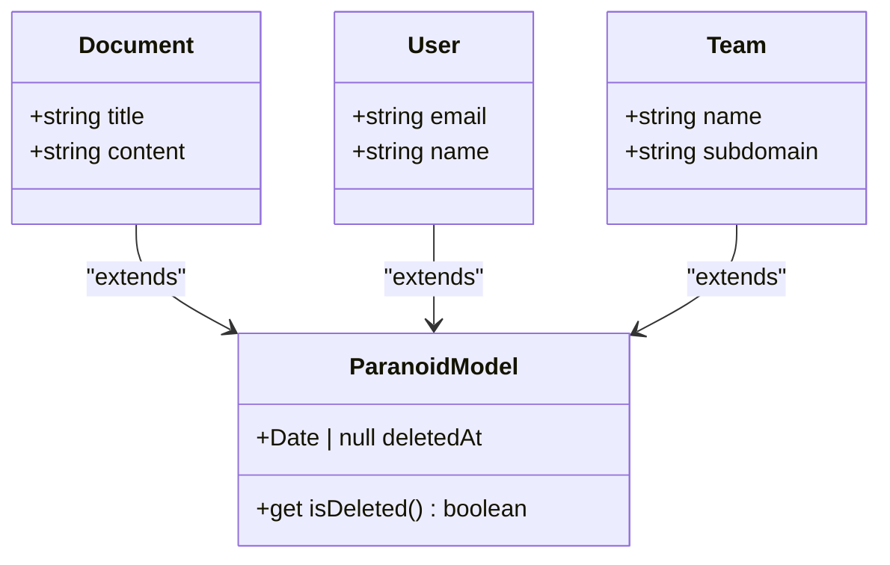
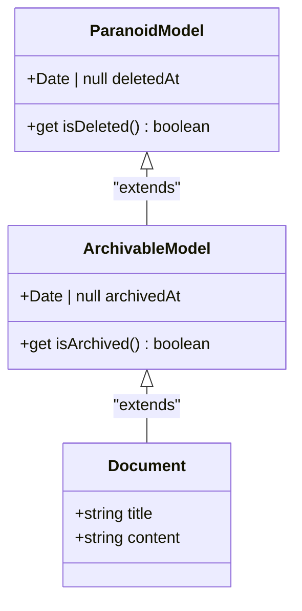
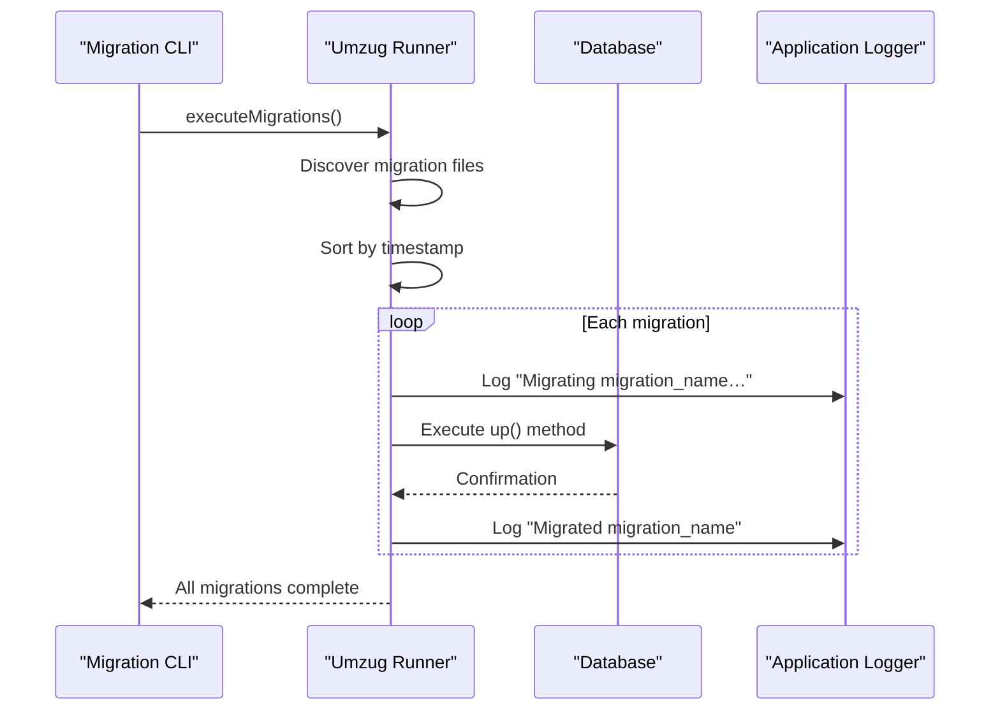
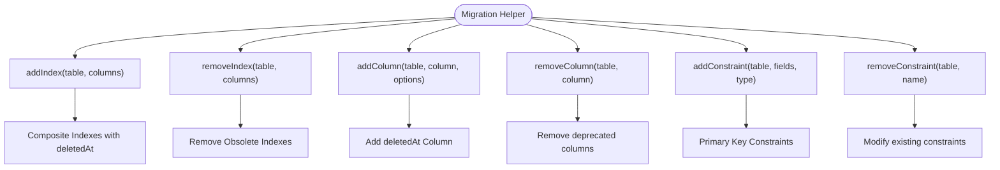
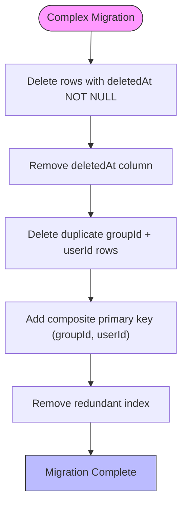
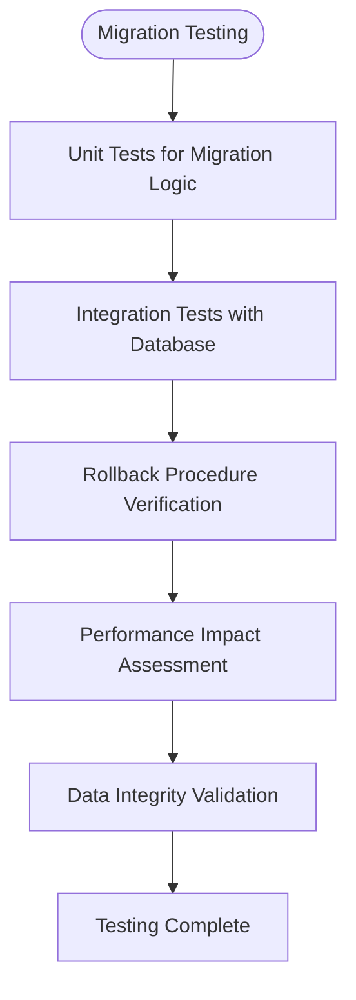
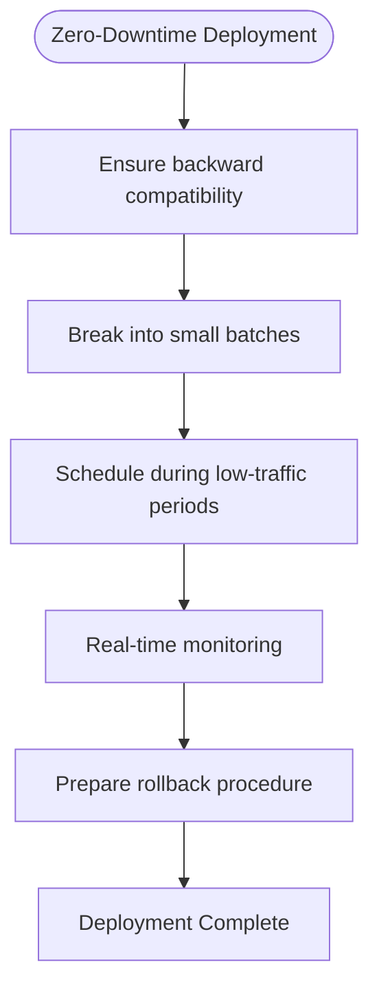
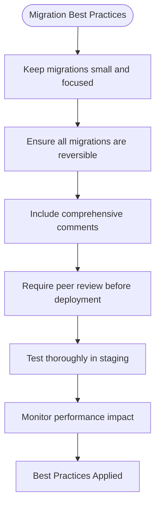

# Migration Strategy

<cite>
**Referenced Files in This Document**   
- [20160812145029-document-atlas-soft-delete.js](file://server/migrations/20160812145029-document-atlas-soft-delete.js)
- [20190404035736-add-archive.js](file://server/migrations/20190404035736-add-archive.js)
- [20160814083127-paranoia-indeces.js](file://server/migrations/20160814083127-paranoia-indeces.js)
- [20180707220121-more-soft-delete.js](file://server/migrations/20180707220121-more-soft-delete.js)
- [20231001032754-file-operation-paranoid.js](file://server/migrations/20231001032754-file-operation-paranoid.js)
- [20240806080954-group-users-paranoid.js](file://server/migrations/20240806080954-group-users-paranoid.js)
- [20240810080954-group-users-remove-deleted-at.js](file://server/migrations/20240810080954-group-users-remove-deleted-at.js)
- [20240912222438-add-unaccent-extension.js](file://server/migrations/20240912222438-add-unaccent-extension.js)
- [ParanoidModel.ts](file://server/models/base/ParanoidModel.ts)
- [ArchivableModel.ts](file://server/models/base/ArchivableModel.ts)
- [database.ts](file://server/storage/database.ts)
</cite>

## Table of Contents
1. [Introduction](#introduction)
2. [Migration File Structure](#migration-file-structure)
3. [Soft-Delete Implementation](#soft-delete-implementation)
4. [Archiving Functionality](#archiving-functionality)
5. [Migration Execution Process](#migration-execution-process)
6. [Migration Helpers and Common Operations](#migration-helpers-and-common-operations)
7. [Complex Migration Examples](#complex-migration-examples)
8. [Testing Strategy](#testing-strategy)
9. [Zero-Downtime Deployment Considerations](#zero-downtime-deployment-considerations)
10. [Best Practices](#best-practices)

## Introduction
The baozi application employs a robust database migration strategy using Sequelize migrations to manage schema evolution. The migration system is located in the `server/migrations/` directory and provides a structured approach to database schema changes, ensuring version control and consistency across environments. This documentation details the implementation of soft-delete patterns through `ParanoidModel` and archiving functionality via `ArchivableModel`, along with the complete migration lifecycle from development to production deployment.

**Section sources**
- [database.ts](file://server/storage/database.ts#L130-L184)

## Migration File Structure
Migration files in the baozi application follow a standardized structure with `up()` and `down()` methods that enable reversible schema changes. Each migration file is named with a timestamp prefix (e.g., `20160812145029-document-atlas-soft-delete.js`) to ensure proper ordering during execution. The `up()` method contains the logic to apply the migration, while the `down()` method provides the rollback procedure. This structure allows for safe deployment and easy rollback in case of issues.

**Diagram sources**
- [20160812145029-document-atlas-soft-delete.js](file://server/migrations/20160812145029-document-atlas-soft-delete.js#L1-L17)

**Section sources**
- [20160812145029-document-atlas-soft-delete.js](file://server/migrations/20160812145029-document-atlas-soft-delete.js#L1-L17)

## Soft-Delete Implementation
The baozi application implements soft-delete functionality through the `ParanoidModel` base class, which adds a `deletedAt` timestamp column to track deletion status without permanently removing records. This pattern is applied across multiple models including documents, users, and teams. The `ParanoidModel` class provides an `isDeleted` getter that returns true when `deletedAt` is set, enabling logical deletion while preserving data integrity.

**Diagram sources**
- [ParanoidModel.ts](file://server/models/base/ParanoidModel.ts#L1-L21)
- [20180707220121-more-soft-delete.js](file://server/migrations/20180707220121-more-soft-delete.js#L1-L17)

**Section sources**
- [ParanoidModel.ts](file://server/models/base/ParanoidModel.ts#L1-L21)
- [20180707220121-more-soft-delete.js](file://server/migrations/20180707220121-more-soft-delete.js#L1-L17)

## Archiving Functionality
Archiving in the baozi application is implemented through the `ArchivableModel` class, which extends `ParanoidModel` and adds an `archivedAt` timestamp column. This allows for a distinct archival state separate from deletion, enabling users to temporarily hide content while preserving it for potential restoration. The `ArchivableModel` provides an `isArchived` getter that returns true when `archivedAt` is set, facilitating conditional logic based on archival status.

**Diagram sources**
- [ArchivableModel.ts](file://server/models/base/ArchivableModel.ts#L1-L24)
- [20190404035736-add-archive.js](file://server/migrations/20190404035736-add-archive.js#L1-L12)

**Section sources**
- [ArchivableModel.ts](file://server/models/base/ArchivableModel.ts#L1-L24)
- [20190404035736-add-archive.js](file://server/migrations/20190404035736-add-archive.js#L1-L12)

## Migration Execution Process
The migration execution process in the baozi application is managed through the Umzug library, which provides a robust framework for running Sequelize migrations. The `createMigrationRunner` function in `database.ts` configures the migration runner with the appropriate glob pattern to locate migration files in the `server/migrations/` directory. Migrations are executed in order based on their timestamp prefixes, ensuring proper dependency resolution.

**Diagram sources**
- [database.ts](file://server/storage/database.ts#L130-L184)

**Section sources**
- [database.ts](file://server/storage/database.ts#L130-L184)

## Migration Helpers and Common Operations
The baozi application provides several migration helpers for common database operations such as adding indexes, modifying columns, and managing constraints. The `20160814083127-paranoia-indeces.js` migration demonstrates the use of index management helpers, where old indexes are removed and new composite indexes are created that include the `deletedAt` column for improved query performance on soft-deleted records.

**Diagram sources**
- [20160814083127-paranoia-indeces.js](file://server/migrations/20160814083127-paranoia-indeces.js#L1-L52)

**Section sources**
- [20160814083127-paranoia-indeces.js](file://server/migrations/20160814083127-paranoia-indeces.js#L1-L52)

## Complex Migration Examples
The baozi application includes several complex migration examples that demonstrate advanced database schema evolution techniques. The `20240810080954-group-users-remove-deleted-at.js` migration illustrates a sophisticated schema refactor where the `deletedAt` column is removed from the `group_users` table and replaced with a composite primary key of `groupId` and `userId`. This migration includes data cleanup steps to remove duplicate rows before applying the constraint.

**Diagram sources**
- [20240806080954-group-users-paranoid.js](file://server/migrations/20240806080954-group-users-paranoid.js#L1-L15)
- [20240810080954-group-users-remove-deleted-at.js](file://server/migrations/20240810080954-group-users-remove-deleted-at.js#L1-L40)

**Section sources**
- [20240806080954-group-users-paranoid.js](file://server/migrations/20240806080954-group-users-paranoid.js#L1-L15)
- [20240810080954-group-users-remove-deleted-at.js](file://server/migrations/20240810080954-group-users-remove-deleted-at.js#L1-L40)

## Testing Strategy
The testing strategy for migrations in the baozi application includes both automated tests and manual verification procedures. Migration scripts are tested in isolated environments that mirror production conditions, with rollback verification to ensure that the `down()` methods correctly revert all changes. The test suite includes specific test cases for data integrity, constraint validation, and performance impact assessment.

**Section sources**
- [20230827234031-migrate-emoji-in-revision-title.ts](file://server/scripts/20230827234031-migrate-emoji-in-revision-title.ts#L32-L62)

## Zero-Downtime Deployment Considerations
The baozi application employs several strategies to ensure zero-downtime deployments during database migrations. Migrations are designed to be backward compatible, allowing old and new application versions to coexist during deployment windows. Long-running migrations are broken into smaller batches, and critical operations are scheduled during low-traffic periods to minimize impact on user experience.

**Section sources**
- [20240912222438-add-unaccent-extension.js](file://server/migrations/20240912222438-add-unaccent-extension.js#L1-L16)

## Best Practices
The baozi application follows several best practices for writing effective and safe database migrations. Migrations are kept small and focused on single changes, making them easier to understand and test. All migrations are designed to be reversible, with careful consideration given to data preservation during rollback. Migration files include comprehensive comments explaining the purpose and impact of each change, and team members are encouraged to review migrations before deployment.

**Section sources**
- [20231001032754-file-operation-paranoid.js](file://server/migrations/20231001032754-file-operation-paranoid.js#L1-L15)
- [20240810080954-group-users-remove-deleted-at.js](file://server/migrations/20240810080954-group-users-remove-deleted-at.js#L1-L40)