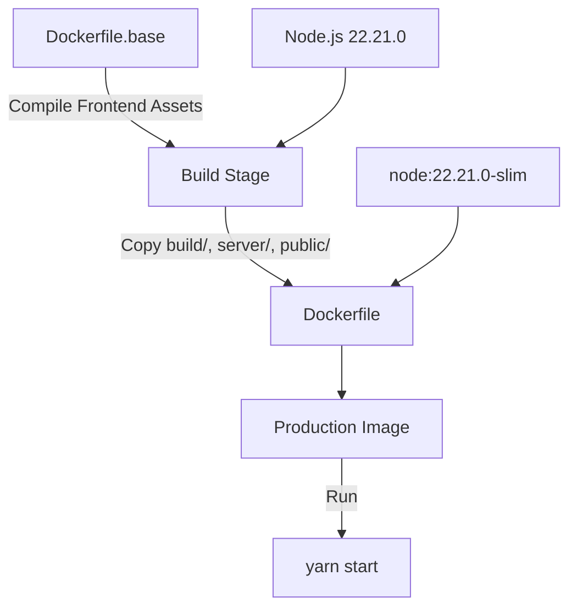
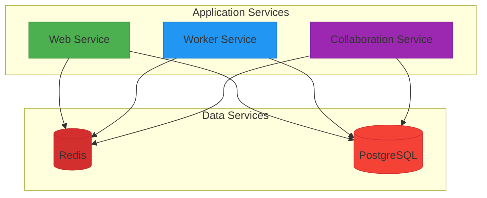
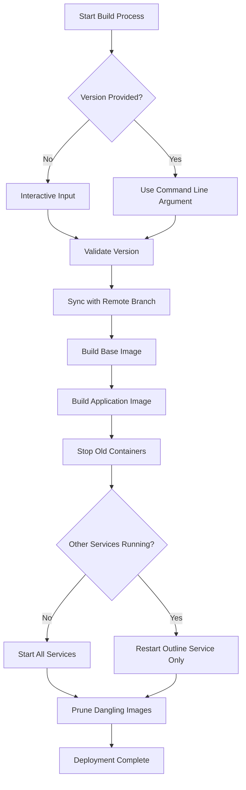
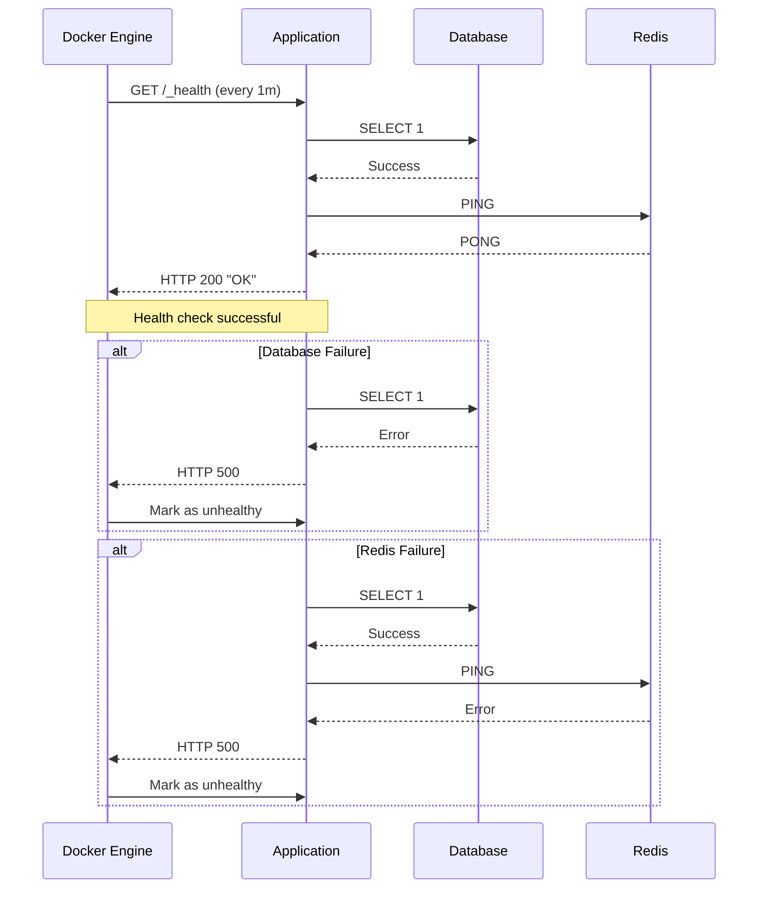

# Docker Configuration

<cite>
**Referenced Files in This Document**   
- [Dockerfile](file://Dockerfile)
- [Dockerfile.base](file://Dockerfile.base)
- [docker-compose.yml](file://docker-compose.yml)
- [house-docker-compose/build_docker_and_release.sh](file://house-docker-compose/build_docker_and_release.sh)
- [server/env.ts](file://server/env.ts)
- [server/index.ts](file://server/index.ts)
</cite>

## Table of Contents
1. [Multi-Stage Build Process](#multi-stage-build-process)
2. [Service Orchestration with Docker Compose](#service-orchestration-with-docker-compose)
3. [Automated Build and Release Workflow](#automated-build-and-release-workflow)
4. [Container Security and Resource Allocation](#container-security-and-resource-allocation)
5. [Health Checks and Monitoring Integration](#health-checks-and-monitoring-integration)
6. [Performance Tuning and Scaling Considerations](#performance-tuning-and-scaling-considerations)
7. [Customization for Deployment Environments](#customization-for-deployment-environments)
8. [External Service Integration](#external-service-integration)

## Multi-Stage Build Process

The Docker configuration for the baozi application implements a multi-stage build process to optimize image size and build efficiency. The process begins with the base image defined in Dockerfile.base, which handles frontend asset compilation and dependency installation. This stage uses Node.js 22.21.0 to install dependencies, apply patches, and compile the application using `yarn build`. The build process generates optimized frontend assets that are then used in the final production image.

The second stage, defined in Dockerfile, creates the runtime image based on node:22.21.0-slim. This stage copies compiled assets, server code, and necessary dependencies from the base image while ensuring proper file ownership through the nodejs user (UID 1001). The final image includes only production dependencies, significantly reducing the attack surface and image size. Build-time arguments such as BUILD_TIME and BUILD_GIT_HASH are injected to provide traceability and version information.

**Diagram sources**
- [Dockerfile](file://Dockerfile)
- [Dockerfile.base](file://Dockerfile.base)

**Section sources**
- [Dockerfile](file://Dockerfile)
- [Dockerfile.base](file://Dockerfile.base)

## Service Orchestration with Docker Compose

The docker-compose.yml file defines the service orchestration for the baozi application, coordinating multiple containers to create a complete deployment environment. The core services include Redis for caching and session storage, and PostgreSQL for persistent data storage. Both services are configured with specific user mappings (redis:redis and postgres:postgres) and exposed on localhost with restricted network binding.

The orchestration supports additional services that can be integrated as needed, including collaboration services, worker processes, and web interfaces. Environment variables in the PostgreSQL service configure the database with a predefined user, password, and database name for initial setup. The current configuration focuses on the essential data storage components, with other application services expected to be defined in separate compose files or through runtime configuration.

**Diagram sources**
- [docker-compose.yml](file://docker-compose.yml)

**Section sources**
- [docker-compose.yml](file://docker-compose.yml)

## Automated Build and Release Workflow

The automated build and release workflow is managed by the build_docker_and_release.sh script in the house-docker-compose directory. This script implements a comprehensive deployment process that begins with synchronizing the local repository to match the remote branch state, ensuring consistent builds. The workflow accepts version arguments either as command-line parameters or through interactive input, supporting different deployment targets such as staging, production, or specific version numbers.

The build process follows a two-step approach: first creating a base image with compiled assets and dependencies, then building the application image that inherits from this base. This separation allows for efficient caching and faster subsequent builds. After successful image creation, the script automatically stops and removes any running containers using the previous image version, ensuring a clean deployment. The workflow also handles service restarts through docker compose, either starting all services if none are running or selectively restarting only the outline service to minimize disruption.

**Diagram sources**
- [house-docker-compose/build_docker_and_release.sh](file://house-docker-compose/build_docker_and_release.sh)

**Section sources**
- [house-docker-compose/build_docker_and_release.sh](file://house-docker-compose/build_docker_and_release.sh)

## Container Security and Resource Allocation

The Docker configuration implements several security measures to protect the baozi application in containerized environments. A non-root user (nodejs with UID 1001) is created and used to run the application, following the principle of least privilege. This reduces the potential impact of security vulnerabilities by preventing the application from having root-level access within the container.

Resource allocation is managed through environment variables and Docker configurations. The WEB_CONCURRENCY environment variable controls the number of processes spawned, with a recommended guideline of dividing the server's available memory by 512MB for estimation. The container exposes port 3000 for application access and includes a health check mechanism that verifies service availability by checking the /_health endpoint. File storage is configured with specific permissions (1777) on the data directory to ensure proper access while maintaining security boundaries.

**Section sources**
- [Dockerfile](file://Dockerfile)
- [server/env.ts](file://server/env.ts)

## Health Checks and Monitoring Integration

Health checks are implemented through Docker's HEALTHCHECK instruction, which periodically verifies the application's availability by accessing the /_health endpoint. This endpoint performs connectivity tests to both the database and Redis services, returning a 500 status code if either dependency fails. The health check runs every minute and uses wget to fetch the endpoint response, validating that it contains "OK" before considering the service healthy.

Monitoring integration is facilitated through environment variables that expose build information (BUILD_TIME and BUILD_GIT_HASH) to the application. These values are injected during the build process and can be accessed through the environment configuration. The application also supports telemetry reporting when enabled, which sends anonymized usage statistics to maintainers. For production deployments, the FORCE_HTTPS environment variable ensures automatic redirection to secure connections, enhancing overall security posture.

**Diagram sources**
- [Dockerfile](file://Dockerfile)
- [server/index.ts](file://server/index.ts)

**Section sources**
- [Dockerfile](file://Dockerfile)
- [server/index.ts](file://server/index.ts)

## Performance Tuning and Scaling Considerations

Performance tuning for the containerized baozi application involves several configuration options that can be adjusted based on deployment requirements. The REQUEST_TIMEOUT environment variable controls how long a request can be processed before timing out, defaulting to 10 seconds but configurable based on expected workload patterns. Database connection pooling is managed through DATABASE_CONNECTION_POOL_MAX, allowing optimization of database resource usage under high concurrency.

For scaling considerations, the application supports horizontal scaling of specific services through dedicated Redis instances. The REDIS_COLLABORATION_URL environment variable enables distributed collaboration services across multiple instances, while the SERVICES environment variable allows selective enabling of specific functionality (web, worker, collaboration, etc.) on different containers. This service segregation enables targeted scaling of resource-intensive components based on usage patterns.

**Section sources**
- [server/env.ts](file://server/env.ts)

## Customization for Deployment Environments

The Docker configuration supports customization for different deployment environments through environment variables and build arguments. The VERSION_ARG parameter in the build script allows specifying different tags for staging, production, or version-specific deployments. Environment-specific configurations are managed through the environment system, which loads variables from .env files based on the NODE_ENV setting.

The CDN_URL environment variable enables integration with content delivery networks, rewriting asset paths to use the specified CDN hostname while keeping the origin server configured through the URL variable. For development environments, the configuration supports local SSL certificate generation through the install-local-ssl script, facilitating secure local development. The deployment process can be customized through the COMPOSE_DIR and APP_PATH variables, allowing flexibility in directory structure and deployment locations.

**Section sources**
- [house-docker-compose/build_docker_and_release.sh](file://house-docker-compose/build_docker_and_release.sh)
- [server/env.ts](file://server/env.ts)

## External Service Integration

External service integration is facilitated through configurable environment variables that connect the baozi application to various third-party services. File storage can be configured to use either local storage or AWS S3, with options for bucket names, ACL settings, and upload size limits. The FILE_STORAGE environment variable controls this selection, defaulting to "s3" but configurable for local deployments.

The application integrates with monitoring and analytics services through plugin architecture, supporting platforms like Google Analytics, Matomo, and Umami. These integrations are configured through environment variables and can be enabled or disabled based on deployment requirements. Authentication providers including OIDC, GitHub, and Slack are supported through dedicated plugins, allowing integration with existing identity management systems. The deployment system itself integrates with external monitoring through the auto_deploy/hook_server.py script, which listens for deployment triggers and coordinates the build process.

**Section sources**
- [server/env.ts](file://server/env.ts)
- [auto_deploy/hook_server.py](file://auto_deploy/hook_server.py)