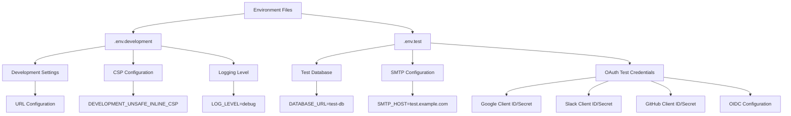
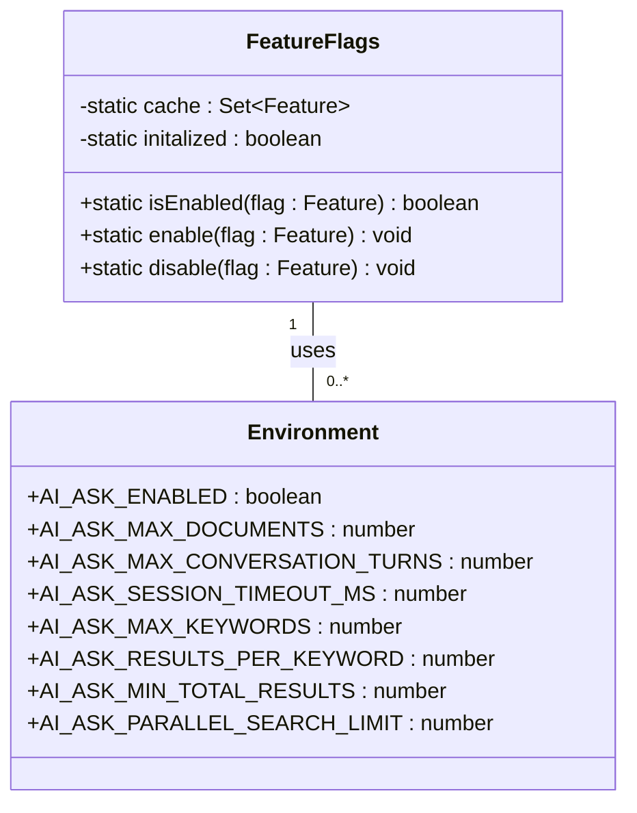

# Environment Variables

<cite>
**Referenced Files in This Document**   
- [.env.development](file://.env.development)
- [.env.test](file://.env.test)
- [server/env.ts](file://server/env.ts)
- [app/utils/FeatureFlags.ts](file://app/utils/FeatureFlags.ts)
</cite>

## Table of Contents
1. [Introduction](#introduction)
2. [Configuration Categories](#configuration-categories)
3. [Development and Test Environment Variables](#development-and-test-environment-variables)
4. [Environment Variable Validation and Type Safety](#environment-variable-validation-and-type-safety)
5. [Database Configuration](#database-configuration)
6. [Redis Settings](#redis-settings)
7. [Authentication Providers](#authentication-providers)
8. [Storage Backends](#storage-backends)
9. [Third-Party Service Integrations](#third-party-service-integrations)
10. [AI Model Configuration](#ai-model-configuration)
11. [Audio Transcription Settings](#audio-transcription-settings)
12. [Feature Flags and Environment Variables](#feature-flags-and-environment-variables)
13. [Environment-Specific Configuration](#environment-specific-configuration)
14. [Security and Sensitive Variables](#security-and-sensitive-variables)
15. [Common Configuration Errors and Troubleshooting](#common-configuration-errors-and-troubleshooting)

## Introduction
The baozi application uses environment variables as its primary configuration mechanism, allowing flexible deployment across different environments while maintaining security and separation of concerns. The configuration system is centered around the `server/env.ts` file, which defines a comprehensive Environment class that validates, types, and processes all environment variables. This document provides a detailed overview of the environment variable system, covering configuration categories, validation mechanisms, and best practices for managing configuration across development, test, and production environments.

**Section sources**
- [server/env.ts](file://server/env.ts#L28-L997)

## Configuration Categories
The baozi application's environment variables are organized into logical categories that correspond to different aspects of the system's functionality. These categories include database connection settings, Redis configuration, authentication providers, storage backends, third-party service integrations, AI model configuration, and audio transcription settings. Each category serves a specific purpose in the application's architecture and can be configured independently, allowing for granular control over the system's behavior. The configuration system supports both direct environment variable assignment and component-specific configuration options, providing flexibility for different deployment scenarios.

## Development and Test Environment Variables
The `.env.development` and `.env.test` files contain environment-specific configuration values that enable appropriate settings for their respective environments. The development environment includes variables like `DEVELOPMENT_UNSAFE_INLINE_CSP` for enabling React dev tools and `LOG_LEVEL=debug` for increased logging verbosity. The test environment configures a dedicated database URL, SMTP settings for email testing, and various OAuth provider credentials with test values. These environment files also include configuration for third-party services like Google, Slack, GitHub, and OIDC providers, all using test credentials that are safe for use in non-production environments.

**Diagram sources**
- [.env.development](file://.env.development#L1-L24)
- [.env.test](file://.env.test#L1-L32)

## Environment Variable Validation and Type Safety
The baozi application implements a robust validation and type safety system for environment variables through the Environment class in `server/env.ts`. This class uses decorators from the class-validator library to enforce type constraints, required values, and value ranges. Each environment variable is annotated with validation decorators such as `@IsNotEmpty`, `@IsUrl`, `@IsNumber`, and `@IsIn`, which automatically validate the variable's value at startup. The system also includes custom validation decorators like `@CannotUseWith` and `@CannotUseWithout` to enforce mutual exclusion and dependency rules between variables. Type conversion methods like `toOptionalString`, `toOptionalNumber`, and `toBoolean` ensure consistent data types regardless of how values are provided in the environment.

**Section sources**
- [server/env.ts](file://server/env.ts#L28-L997)

## Database Configuration
Database configuration in the baozi application supports both direct URL specification and component-based configuration. The primary variable `DATABASE_URL` accepts a full PostgreSQL connection URL, while alternative variables like `DATABASE_HOST`, `DATABASE_PORT`, `DATABASE_NAME`, `DATABASE_USER`, and `DATABASE_PASSWORD` allow for individual component configuration. These approaches are mutually exclusive, enforced by the `@CannotUseWithAny` decorator. Additional database settings include `DATABASE_SCHEMA` for specifying an optional schema, `DATABASE_CONNECTION_POOL_URL` for connection pooling, and `DATABASE_CONNECTION_POOL_MIN`/`DATABASE_CONNECTION_POOL_MAX` for configuring the connection pool size. The `PGSSLMODE` variable controls SSL connection behavior with values like "disable", "allow", "require", "prefer", "verify-ca", and "verify-full".

**Section sources**
- [server/env.ts](file://server/env.ts#L78-L179)
- [server/config/database.js](file://server/config/database.js#L1-L23)

## Redis Settings
Redis configuration in the baozi application is managed through several environment variables that support both standard and collaboration-specific use cases. The `REDIS_URL` variable is required and specifies the connection URL for the primary Redis instance used by the application. For horizontally scaling the collaboration service, an optional `REDIS_COLLABORATION_URL` can be configured to use a separate Redis instance. The Redis configuration system includes validation to ensure the URL is provided and supports base64-encoded configuration for advanced use cases. The application uses Redis for various purposes including session storage, caching, and real-time collaboration, with separate client instances managed by the RedisAdapter class.

**Section sources**
- [server/env.ts](file://server/env.ts#L186-L193)
- [server/storage/redis.ts](file://server/storage/redis.ts#L1-L123)

## Authentication Providers
The baozi application supports multiple authentication providers through environment variable configuration. OAuth providers like Google, Slack, GitHub, and generic OIDC are configured with client ID and secret pairs. For Google authentication, the `GOOGLE_CLIENT_ID` and `GOOGLE_CLIENT_SECRET` variables are used. Slack authentication uses `SLACK_CLIENT_ID` and `SLACK_CLIENT_SECRET`. GitHub configuration includes `GITHUB_CLIENT_ID`, `GITHUB_CLIENT_SECRET`, and `GITHUB_APP_NAME`. OIDC providers are configured with `OIDC_CLIENT_ID`, `OIDC_CLIENT_SECRET`, `OIDC_AUTH_URI`, `OIDC_TOKEN_URI`, and `OIDC_USERINFO_URI`. These variables are validated for presence and proper formatting, with mutual dependency constraints ensuring that both client ID and secret are provided when either is specified.

**Section sources**
- [.env.test](file://.env.test#L10-L24)
- [server/env.ts](file://server/env.ts#L465-L468)
- [plugins/oidc/server/env.ts](file://plugins/oidc/server/env.ts#L1-L40)

## Storage Backends
The baozi application supports multiple storage backends for file attachments and imports, configurable through environment variables. The primary variable `FILE_STORAGE` determines which storage system to use, with valid values of "local" or "s3". When using local storage, `FILE_STORAGE_LOCAL_ROOT_DIR` specifies the root directory path, defaulting to "/var/lib/outline/data". For S3 storage, configuration includes `AWS_ACCESS_KEY_ID`, `AWS_SECRET_ACCESS_KEY`, `AWS_REGION`, `AWS_S3_UPLOAD_BUCKET_NAME`, and related variables. The system also includes variables for controlling upload sizes: `FILE_STORAGE_UPLOAD_MAX_SIZE` for regular attachments, `FILE_STORAGE_IMPORT_MAX_SIZE` for imports, and `MAXIMUM_EXPORT_SIZE` for exports. The `AWS_S3_FORCE_PATH_STYLE` variable controls URL formatting for S3-compatible storage providers.

**Section sources**
- [server/env.ts](file://server/env.ts#L652-L669)
- [server/storage/files/index.ts](file://server/storage/files/index.ts#L1-L8)

## Third-Party Service Integrations
The baozi application integrates with various third-party services through dedicated environment variables. Email services are configured with SMTP settings including `SMTP_HOST`, `SMTP_PORT`, `SMTP_USERNAME`, `SMTP_PASSWORD`, `SMTP_FROM_EMAIL`, and `SMTP_REPLY_EMAIL`. Alternatively, well-known services can be specified with `SMTP_SERVICE`. Analytics services are configured with `GOOGLE_ANALYTICS_ID` for Google Analytics and `SENTRY_DSN` for error tracking. Other integrations include `DROPBOX_APP_KEY` for Dropbox file embedding, `IFRAMELY_API_KEY` for content embedding, and `DD_API_KEY` for DataDog metrics. These variables are validated for proper formatting and often include default values or fallback mechanisms for development environments.

**Section sources**
- [server/env.ts](file://server/env.ts#L362-L519)
- [server/emails/mailer.tsx](file://server/emails/mailer.tsx#L202-L261)

## AI Model Configuration
AI model configuration in the baozi application is managed through a hierarchy of environment variables that allow for both global and workspace-specific settings. The primary variables include `LLM_API_KEY` for the API authentication key, `LLM_API_BASE_URL` for the API endpoint, and `LLM_MODEL_NAME` for the default model. Specialized models are configured with `LLM_MODEL_NAME_AI_SEARCH` for AI search functionality and `LLM_MODEL_NAME_VISION` for vision capabilities. These variables can be overridden at the workspace level through admin settings, providing flexibility for different use cases. The system includes validation to ensure required API credentials are present and properly formatted.

**Section sources**
- [.env.development](file://.env.development#L17-L21)
- [server/env.ts](file://server/env.ts#L722-L744)
- [server/routes/api/ai/ai.ts](file://server/routes/api/ai/ai.ts#L1-L59)

## Audio Transcription Settings
The baozi application includes configuration for audio transcription services through several environment variables. The `TRANSCRIPTION_ENDPOINT` variable specifies the URL of the transcription service, defaulting to "http://v.netis.com.cn:13000/transcribe". The `TRANSCRIPTION_DELETE_AUDIO_AFTER` variable controls whether audio files are deleted after successful transcription, defaulting to false. Additional settings include `TRANSCRIPTION_JOB_TIMEOUT` for job timeout duration, `TRANSCRIPTION_CLEANUP_DAYS` for retention period of transcription jobs, and `TRANSCRIPTION_MAX_CONCURRENT_PER_USER` for limiting concurrent jobs per user. The `ALLOWED_PRIVATE_IP_ADDRESSES` variable allows configuration of private IP addresses that can be accessed, which is useful for connecting to transcription services on private networks.

**Section sources**
- [server/env.ts](file://server/env.ts#L784-L799)
- [TRANSCRIPTION_FIX.md](file://TRANSCRIPTION_FIX.md#L108-L140)

## Feature Flags and Environment Variables
The baozi application combines environment variables with feature flags to control functionality availability. The `FeatureFlags` class in `app/utils/FeatureFlags.ts` manages client-side feature flags, while environment variables control server-side features. Some environment variables are marked with the `@Public` decorator, making them available to the client-side application. The AI Ask feature is controlled by the `AI_ASK_ENABLED` environment variable, which defaults to true. Other AI-related variables like `AI_ASK_MAX_DOCUMENTS`, `AI_ASK_MAX_CONVERSATION_TURNS`, and `AI_ASK_SESSION_TIMEOUT_MS` control specific aspects of the AI functionality. Feature flags and environment variables work together to enable gradual rollout of features and environment-specific behavior.

**Diagram sources**
- [app/utils/FeatureFlags.ts](file://app/utils/FeatureFlags.ts#L1-L49)
- [server/env.ts](file://server/env.ts#L798-L834)

## Environment-Specific Configuration
The baozi application distinguishes between development, test, and production environments through the `ENVIRONMENT` variable, which must be one of "development", "production", "staging", or "test". Each environment has specific configuration defaults and behaviors. Development mode enables debug logging, allows unsafe CSP directives for development tools, and may enable features that are disabled in production. The test environment uses a dedicated database and test credentials for all third-party services. Production environments enforce stricter security settings, including HTTPS redirection by default and more restrictive CSP policies. The configuration system includes getter methods like `isDevelopment`, `isTest`, and `isProduction` to simplify environment detection in code.

**Section sources**
- [server/env.ts](file://server/env.ts#L58-L60)
- [server/env.ts](file://server/env.ts#L931-L947)

## Security and Sensitive Variables
The baozi application implements several security measures for handling sensitive environment variables. The `SECRET_KEY` variable is critical for data encryption and must be 32-64 characters long, validated using the `@IsByteLength` decorator. This key should never be changed in production as it would prevent user login. The `UTILS_SECRET` variable protects cron utility endpoints. Sensitive variables like database passwords, API keys, and OAuth secrets are never exposed to the client-side application. Variables marked with the `@Public` decorator are explicitly intended for client-side use and are listed in the `public` getter method. The system includes validation to ensure that sensitive variables are present and properly formatted, with descriptive error messages to aid in troubleshooting configuration issues.

**Section sources**
- [server/env.ts](file://server/env.ts#L65-L69)
- [server/env.ts](file://server/env.ts#L74-L76)
- [server/utils/decorators/Public.ts](file://server/utils/decorators/Public.ts#L1-L37)

## Common Configuration Errors and Troubleshooting
Common configuration errors in the baozi application typically involve missing required variables, invalid values, or conflicting settings. The environment validation system provides descriptive error messages at startup, listing all validation failures. Common issues include missing `SECRET_KEY`, incorrect database URL formatting, and mismatched OAuth credentials. For database connectivity issues, checking the `PGSSLMODE` setting and ensuring proper SSL configuration is important. Email configuration problems often stem from incorrect SMTP settings or missing credentials. When troubleshooting, verifying that environment variables are properly loaded and checking the application logs for validation error messages is recommended. Restarting the server after configuration changes ensures that new values are properly loaded.

**Section sources**
- [server/env.ts](file://server/env.ts#L32-L43)
- [server/storage/database.ts](file://server/storage/database.ts#L87-L128)