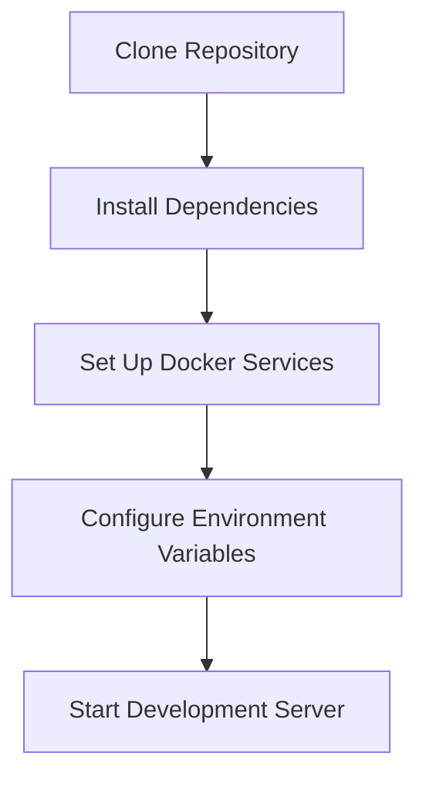
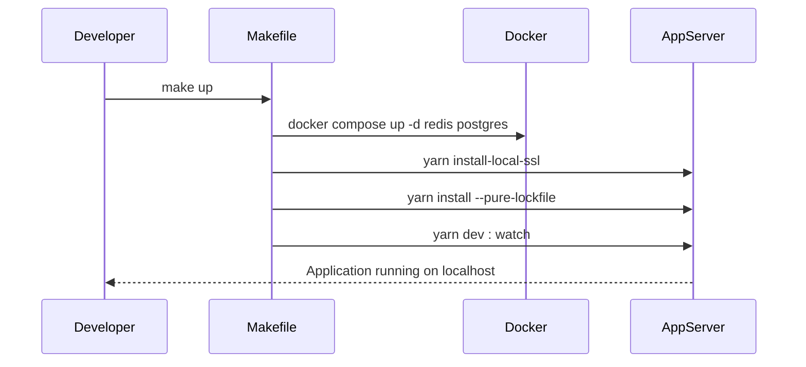
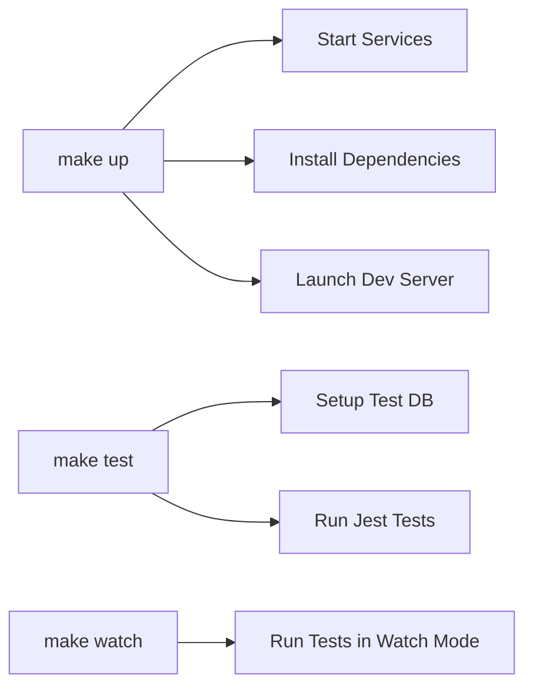
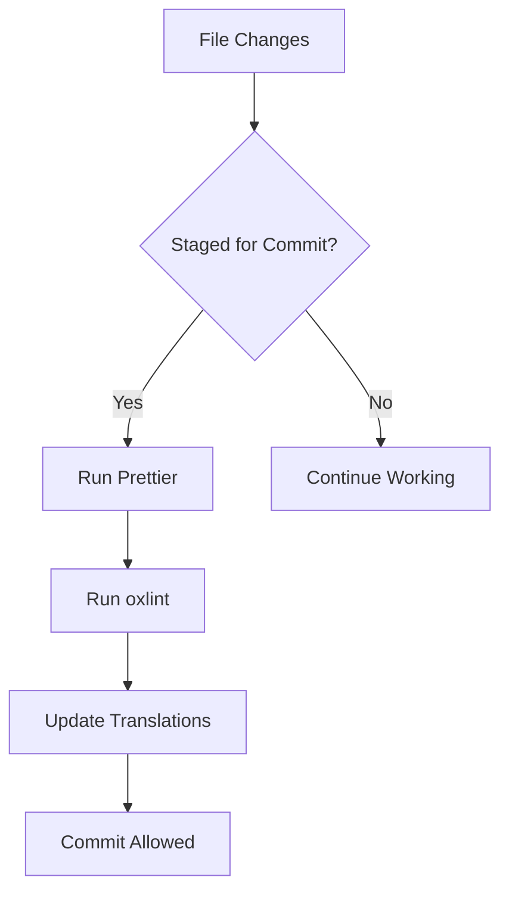
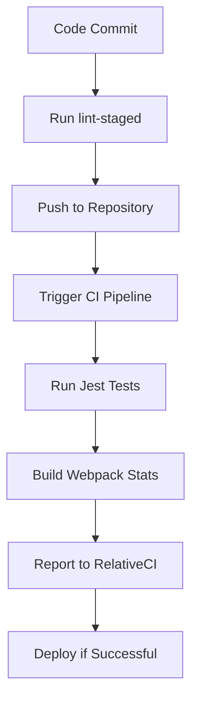

# Developer Onboarding Guide

<cite>
**Referenced Files in This Document**   
- [README.md](file://README.md)
- [Makefile](file://Makefile)
- [package.json](file://package.json)
- [relativeci.config.js](file://relativeci.config.js)
- [lint-staged.config.mjs](file://lint-staged.config.mjs)
</cite>

## Table of Contents
1. [Introduction](#introduction)
2. [Development Environment Setup](#development-environment-setup)
3. [Running the Application Locally](#running-the-application-locally)
4. [Development Workflow with Makefile](#development-workflow-with-makefile)
5. [Code Quality Tools](#code-quality-tools)
6. [Continuous Integration and Testing](#continuous-integration-and-testing)
7. [Contribution Guidelines and Code Review Process](#contribution-guidelines-and-code-review-process)
8. [Advanced Development Techniques](#advanced-development-techniques)
9. [Troubleshooting Tips](#troubleshooting-tips)

## Introduction
This guide provides comprehensive instructions for new developers contributing to the baozi application. It covers setting up the development environment, running the application locally, understanding the development workflow, and following contribution guidelines. The documentation is designed to help both beginners and experienced developers get started quickly and efficiently.

**Section sources**
- [README.md](file://README.md#L1-L107)

## Development Environment Setup

To set up the development environment for the baozi application, follow these steps:

1. Ensure you have Node.js version 20.12 or higher installed.
2. Install Docker and Docker Compose for managing services like Redis and PostgreSQL.
3. Clone the repository and navigate to the project directory.
4. Install dependencies using Yarn by running `yarn install --pure-lockfile`.

The application uses TypeScript, React, and Node.js, with a focus on collaborative knowledge base functionality. The setup process is streamlined through the use of Docker for database and caching services.

**Diagram sources**
- [README.md](file://README.md#L20-L29)
- [Makefile](file://Makefile#L1-L6)

**Section sources**
- [README.md](file://README.md#L20-L29)
- [Makefile](file://Makefile#L1-L6)
- [package.json](file://package.json#L43-L45)

## Running the Application Locally

To run the application locally, use the `make up` command, which starts Redis and PostgreSQL containers, installs local SSL certificates, and launches the development server with hot reloading. The command sequence is defined in the Makefile and ensures all necessary services are running.

For production builds, use `make build` to create optimized assets. The application can be started in production mode using `yarn start`, which runs the compiled server code.

**Diagram sources**
- [Makefile](file://Makefile#L1-L6)
- [package.json](file://package.json#L13-L15)

**Section sources**
- [Makefile](file://Makefile#L1-L6)
- [package.json](file://package.json#L13-L15)

## Development Workflow with Makefile

The Makefile provides several commands for common development tasks:

- `make up`: Starts the development environment with all required services.
- `make build`: Builds the application for production deployment.
- `make test`: Runs all tests after setting up the test database.
- `make watch`: Runs tests in watch mode for continuous feedback.
- `make destroy`: Stops and removes all Docker containers.

These commands streamline the development process by encapsulating complex operations into simple, memorable commands.

**Diagram sources**
- [Makefile](file://Makefile#L1-L29)

**Section sources**
- [Makefile](file://Makefile#L1-L29)

## Code Quality Tools

The project uses ESLint (via oxlint), Prettier, and lint-staged to maintain code quality. These tools are configured to run automatically during development and before commits.

- **ESLint (oxlint)**: Enforces coding standards and catches potential errors. Run with `yarn lint`.
- **Prettier**: Automatically formats code according to project standards. Run with `yarn format`.
- **lint-staged**: Runs Prettier and oxlint on staged files before commits, ensuring consistent code quality.

The lint-staged configuration also updates translation files automatically when JavaScript or TypeScript files change.

**Diagram sources**
- [lint-staged.config.mjs](file://lint-staged.config.mjs#L1-L17)
- [package.json](file://package.json#L16-L19)

**Section sources**
- [lint-staged.config.mjs](file://lint-staged.config.mjs#L1-L17)
- [package.json](file://package.json#L16-L19)

## Continuous Integration and Testing

Continuous integration is configured using RelativeCI, which monitors webpack build statistics to track bundle size changes. The configuration is defined in relativeci.config.js and points to the webpack stats file generated during builds.

Testing is done using Jest, with separate configurations for frontend, backend, and shared code. Tests should be written for all API endpoints and authentication-related functionality. The test suite can be run with `make test` or individually with `yarn test:app`, `yarn test:server`, etc.

**Diagram sources**
- [relativeci.config.js](file://relativeci.config.js#L1-L8)
- [package.json](file://package.json#L31-L35)

**Section sources**
- [relativeci.config.js](file://relativeci.config.js#L1-L8)
- [package.json](file://package.json#L31-L35)

## Contribution Guidelines and Code Review Process

Contributors are encouraged to discuss proposed changes with the core team before submitting pull requests. This can be done through GitHub issues or discussions. The process includes:

1. Create or comment on an existing issue to discuss the proposed change.
2. Fork the repository and create a feature branch.
3. Implement changes following coding standards.
4. Write tests for new functionality.
5. Submit a pull request with a clear description of changes.

Critical areas like API endpoints and authentication must be thoroughly tested. The team prioritizes performance improvements, developer happiness, and documentation alongside bug fixes and new features.

**Section sources**
- [README.md](file://README.md#L30-L43)

## Advanced Development Techniques

Experienced developers can leverage several advanced techniques:

- **Debugging**: Enable detailed logging with `DEBUG=*` or specific categories like `DEBUG=database`. Use `LOG_LEVEL=debug` or `LOG_LEVEL=silly` for verbose output.
- **Migrations**: Use Sequelize CLI commands like `yarn db:create-migration`, `yarn db:migrate`, and `yarn db:rollback` to manage database schema changes.
- **Performance Profiling**: Monitor webpack bundle sizes through RelativeCI and optimize critical paths.

For debugging specific components, use Jest's watch mode with `yarn test path/to/file.test.ts --watch` to get immediate feedback during development.

**Section sources**
- [README.md](file://README.md#L49-L98)

## Troubleshooting Tips

Common issues and their solutions:

- **Database connection errors**: Ensure Docker containers are running with `docker compose up -d redis postgres`.
- **SSL certificate issues**: Run `yarn install-local-ssl` to set up local certificates.
- **Dependency conflicts**: Use `yarn yarn-deduplicate` to resolve package duplication issues.
- **Test failures**: Ensure test database is properly set up with `make test` before running individual tests.

When encountering unexpected behavior, check the console logs for category-prefixed messages that can help identify the source of the problem.

**Section sources**
- [README.md](file://README.md#L49-L54)
- [Makefile](file://Makefile#L10-L15)