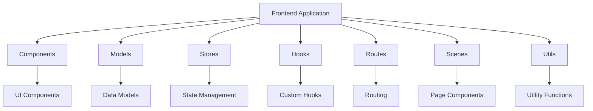
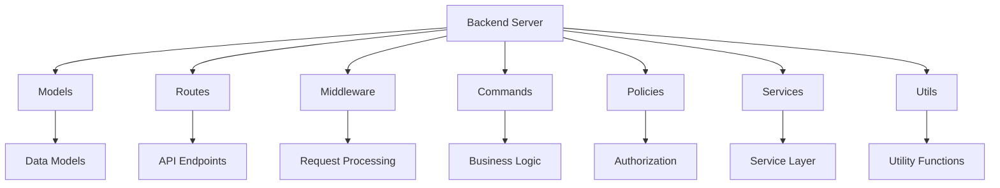
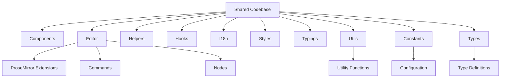
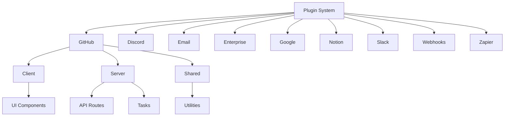
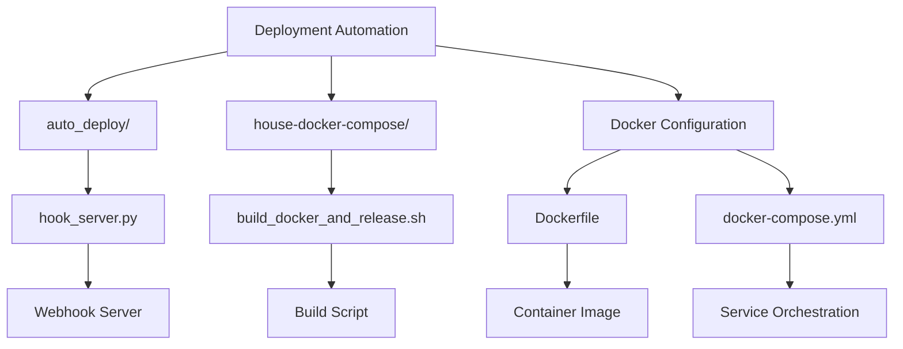
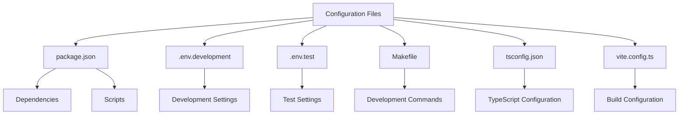

# Directory Structure Breakdown

<cite>
**Referenced Files in This Document**   
- [app/index.tsx](file://app/index.tsx)
- [server/index.ts](file://server/index.ts)
- [shared/env.ts](file://shared/env.ts)
- [package.json](file://package.json)
- [Dockerfile](file://Dockerfile)
- [docker-compose.yml](file://docker-compose.yml)
- [app/models/Document.ts](file://app/models/Document.ts)
- [server/models/Document.ts](file://server/models/Document.ts)
- [app/stores/DocumentsStore.ts](file://app/stores/DocumentsStore.ts)
- [plugins/github/plugin.json](file://plugins/github/plugin.json)
- [plugins/github/client/index.tsx](file://plugins/github/client/index.tsx)
- [plugins/github/server/index.ts](file://plugins/github/server/index.ts)
- [plugins/github/shared/GitHubUtils.ts](file://plugins/github/shared/GitHubUtils.ts)
- [.env.development](file://.env.development)
- [.env.test](file://.env.test)
</cite>

## Table of Contents
1. [Introduction](#introduction)
2. [Top-Level Directory Overview](#top-level-directory-overview)
3. [Frontend Application Structure (app/)](#frontend-application-structure-app)
4. [Backend Server Structure (server/)](#backend-server-structure-server)
5. [Shared Codebase (shared/)](#shared-codebase-shared)
6. [Plugin System Architecture (plugins/)](#plugin-system-architecture-plugins)
7. [Dependency Management and Patches (patches/)](#dependency-management-and-patches-patches)
8. [Deployment Automation (auto_deploy/ and house-docker-compose/)](#deployment-automation-auto_deploy-and-house-docker-compose)
9. [Configuration and Environment Files](#configuration-and-environment-files)
10. [Conclusion](#conclusion)

## Introduction
The baozi repository follows a well-organized, modular architecture that separates concerns between frontend, backend, shared components, and extensible plugin systems. This structure enables efficient development workflows, clear separation of responsibilities, and easy extensibility. The repository is designed to support a collaborative knowledge base application with React for the frontend, Koa for the backend, and a sophisticated plugin system that allows for both client and server-side extensions. This document provides a comprehensive breakdown of the directory structure, explaining the purpose and role of each component in the overall architecture.

## Top-Level Directory Overview
The repository's top-level directories are organized to maintain clear separation between different aspects of the application. The primary directories include `app/` for the frontend React application, `server/` for the backend Koa server, `shared/` for code shared between frontend and backend, `plugins/` for the extensible plugin system, `patches/` for dependency patches, `auto_deploy/` for deployment automation, and `house-docker-compose/` for Docker configuration. This organization follows a microservices-inspired pattern where each major component has its own dedicated space, making it easier for developers to navigate and contribute to specific parts of the codebase. The structure supports both monolithic development patterns and modular extension through plugins, providing flexibility for different development and deployment scenarios.

**Section sources**
- [app/index.tsx](file://app/index.tsx)
- [server/index.ts](file://server/index.ts)
- [shared/env.ts](file://shared/env.ts)

## Frontend Application Structure (app/)
The `app/` directory contains the complete frontend React application, organized into a well-structured component-based architecture. It houses several key subdirectories that define the frontend's organization: `components/` for reusable UI components, `models/` for data models, `stores/` for MobX state management, `hooks/` for custom React hooks, `routes/` for routing configuration, `scenes/` for page-level components, and `utils/` for utility functions. The application follows a modern React pattern with MobX for state management, enabling reactive updates across the UI. The `app/models/Document.ts` file defines the frontend Document model with observable properties and computed values, while `app/stores/DocumentsStore.ts` manages the collection of documents and provides methods for fetching, searching, and manipulating document data. The frontend is bootstrapped through `app/index.tsx`, which initializes the React application with necessary providers for state management, routing, and analytics.

**Diagram sources**
- [app/index.tsx](file://app/index.tsx)
- [app/models/Document.ts](file://app/models/Document.ts)
- [app/stores/DocumentsStore.ts](file://app/stores/DocumentsStore.ts)

**Section sources**
- [app/index.tsx](file://app/index.tsx)
- [app/models/Document.ts](file://app/models/Document.ts)
- [app/stores/DocumentsStore.ts](file://app/stores/DocumentsStore.ts)

## Backend Server Structure (server/)
The `server/` directory contains the backend Koa server implementation, organized into a modular structure that separates concerns between different aspects of server functionality. Key subdirectories include `models/` for Sequelize data models, `routes/` for API endpoints, `middlewares/` for request processing middleware, `commands/` for business logic operations, `policies/` for authorization logic, `services/` for service layer implementations, and `utils/` for utility functions. The backend follows a service-oriented architecture where business logic is encapsulated in commands and services, while policies handle authorization rules. The `server/models/Document.ts` file defines the backend Document model with database schema, validations, and hooks, complementing the frontend model with server-specific logic. The server is initialized through `server/index.ts`, which sets up the Koa application, configures middleware, and starts the HTTP server. The structure supports multiple services (web, API, collaboration) running within the same process, with proper error handling and shutdown procedures.

**Diagram sources**
- [server/index.ts](file://server/index.ts)
- [server/models/Document.ts](file://server/models/Document.ts)

**Section sources**
- [server/index.ts](file://server/index.ts)
- [server/models/Document.ts](file://server/models/Document.ts)

## Shared Codebase (shared/)
The `shared/` directory contains code that is used by both the frontend and backend, promoting code reuse and consistency across the application. This includes shared data models, types, utilities, and the collaborative editor implementation. The directory contains subdirectories for `components/`, `editor/`, `helpers/`, `hooks/`, `i18n/`, `styles/`, `typings/`, and `utils/`, mirroring some of the frontend structure but containing code that can be safely used on both client and server. The `shared/env.ts` file provides a unified way to access environment variables, abstracting the differences between browser and Node.js environments. The `shared/editor/` directory contains the core implementation of the collaborative editor, including ProseMirror extensions, commands, and node definitions that power the rich text editing experience. This shared structure ensures that critical functionality like text processing, internationalization, and type definitions remain consistent between client and server, reducing bugs and maintenance overhead.

**Diagram sources**
- [shared/env.ts](file://shared/env.ts)

**Section sources**
- [shared/env.ts](file://shared/env.ts)

## Plugin System Architecture (plugins/)
The `plugins/` directory implements an extensible plugin system that allows for both client and server components to be added to the application. Each plugin is organized as a self-contained directory with `client/`, `server/`, and optionally `shared/` subdirectories, following a consistent structure across all plugins. The plugin system is designed to be modular, with each plugin having its own `plugin.json` manifest file that defines metadata like ID, name, priority, and description. Plugins can extend both the frontend and backend functionality, with client components adding UI elements and server components adding API routes, tasks, and integration points. The GitHub plugin serves as an example, with `plugins/github/client/index.tsx` registering settings UI components and `plugins/github/server/index.ts` registering API routes and webhook tasks. The shared directory within plugins allows for code reuse between client and server components of the same plugin. This architecture enables third-party integrations and custom functionality to be added without modifying the core application code.

**Diagram sources**
- [plugins/github/plugin.json](file://plugins/github/plugin.json)
- [plugins/github/client/index.tsx](file://plugins/github/client/index.tsx)
- [plugins/github/server/index.ts](file://plugins/github/server/index.ts)
- [plugins/github/shared/GitHubUtils.ts](file://plugins/github/shared/GitHubUtils.ts)

**Section sources**
- [plugins/github/plugin.json](file://plugins/github/plugin.json)
- [plugins/github/client/index.tsx](file://plugins/github/client/index.tsx)
- [plugins/github/server/index.ts](file://plugins/github/server/index.ts)
- [plugins/github/shared/GitHubUtils.ts](file://plugins/github/shared/GitHubUtils.ts)

## Dependency Management and Patches (patches/)
The `patches/` directory contains dependency patches that modify third-party packages to fix bugs or add functionality that cannot be achieved through configuration. This approach allows the application to benefit from community-maintained packages while addressing specific needs of the baozi application. The directory contains patch files for packages like `@benrbray/prosemirror-math` and `y-prosemirror`, which are likely related to the collaborative editing functionality. These patches are applied automatically during the installation process through the `postinstall` script in `package.json` that calls `patch-package`. This system enables the team to maintain fixes for upstream packages without forking entire repositories, making it easier to stay up-to-date with security patches and new features from the original packages. The use of patches indicates a pragmatic approach to dependency management, where the team contributes fixes back to the community while maintaining the ability to apply temporary solutions when necessary.

**Section sources**
- [package.json](file://package.json)

## Deployment Automation (auto_deploy/ and house-docker-compose/)
The repository includes two directories dedicated to deployment automation: `auto_deploy/` and `house-docker-compose/`. The `auto_deploy/` directory contains a Python script `hook_server.py` that likely serves as a webhook receiver for automated deployment pipelines, enabling continuous integration and deployment workflows. The `house-docker-compose/` directory contains a shell script `build_docker_and_release.sh` that automates the Docker image building and release process. These automation scripts work in conjunction with other deployment artifacts like `Dockerfile` and `docker-compose.yml` to create a streamlined deployment process. The `Dockerfile` defines a multi-stage build process that creates a production-ready container image, while `docker-compose.yml` provides a simple way to run the application with its dependencies (PostgreSQL and Redis) during development. This deployment infrastructure enables consistent environments across development, testing, and production, reducing the "it works on my machine" problem and facilitating easier scaling and maintenance.

**Diagram sources**
- [auto_deploy/hook_server.py](file://auto_deploy/hook_server.py)
- [house-docker-compose/build_docker_and_release.sh](file://house-docker-compose/build_docker_and_release.sh)
- [Dockerfile](file://Dockerfile)
- [docker-compose.yml](file://docker-compose.yml)

**Section sources**
- [auto_deploy/hook_server.py](file://auto_deploy/hook_server.py)
- [house-docker-compose/build_docker_and_release.sh](file://house-docker-compose/build_docker_and_release.sh)
- [Dockerfile](file://Dockerfile)
- [docker-compose.yml](file://docker-compose.yml)

## Configuration and Environment Files
The repository includes several configuration files that define the application's behavior and dependencies. The `package.json` file lists all npm dependencies and defines scripts for building, testing, and running the application. Environment-specific configuration is handled through `.env` files like `.env.development` and `.env.test`, which contain settings for different environments. The `package.json` scripts include commands for building the application (`build`), running in development mode (`dev`), running tests (`test`), and managing database migrations (`db:migrate`). The configuration follows security best practices by not including sensitive credentials in version control, instead relying on environment variables that are set separately in different deployment environments. The `Makefile` provides additional convenience commands for common development tasks, further streamlining the development workflow. This comprehensive configuration system enables consistent development, testing, and production environments while maintaining security and flexibility.

**Diagram sources**
- [package.json](file://package.json)
- [.env.development](file://.env.development)
- [.env.test](file://.env.test)

**Section sources**
- [package.json](file://package.json)
- [.env.development](file://.env.development)
- [.env.test](file://.env.test)

## Conclusion
The baozi repository demonstrates a well-architected, modern web application with a clear separation of concerns between frontend, backend, shared components, and extensible plugins. The directory structure supports efficient development workflows by organizing code into logical modules that are easy to navigate and understand. The frontend React application in the `app/` directory follows modern patterns with component-based architecture and MobX state management, while the backend Koa server in the `server/` directory implements a service-oriented architecture with proper separation of models, routes, and business logic. The `shared/` directory promotes code reuse and consistency across client and server, particularly for the collaborative editor functionality. The plugin system in the `plugins/` directory enables extensibility without modifying core application code, supporting a growing ecosystem of integrations. Deployment automation through `auto_deploy/` and `house-docker-compose/` ensures consistent environments across development and production, while configuration files provide flexibility and security. This comprehensive structure enables the development team to maintain a high-quality, scalable application that can evolve to meet changing requirements.