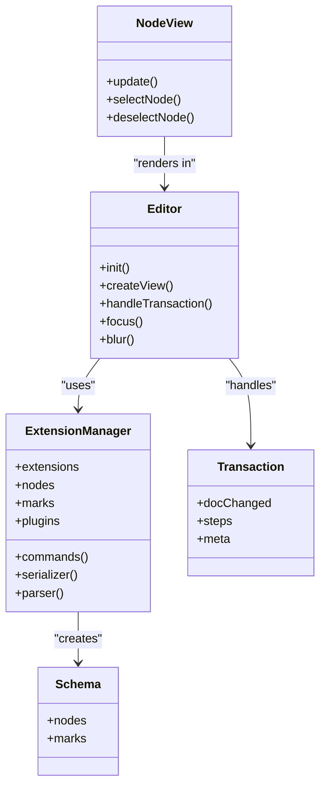
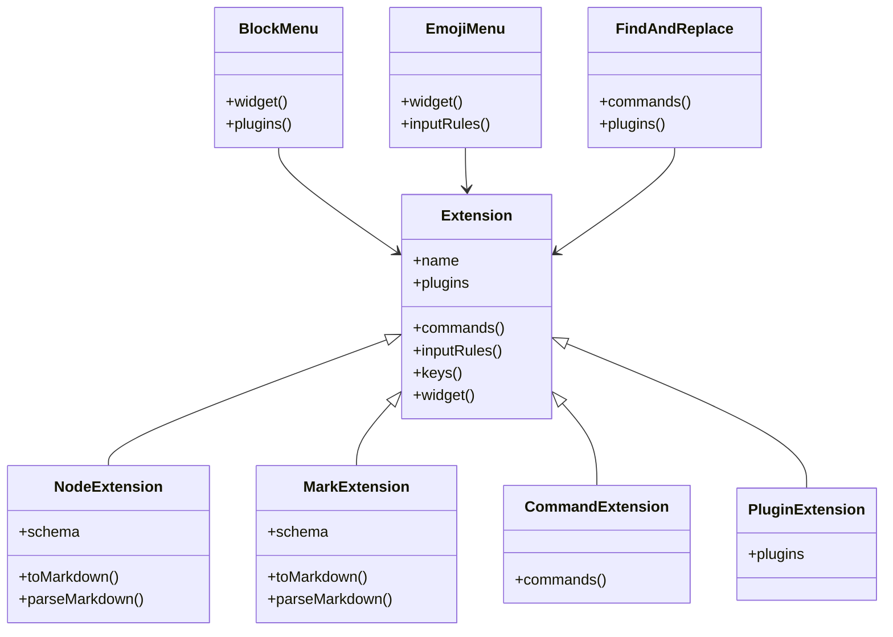
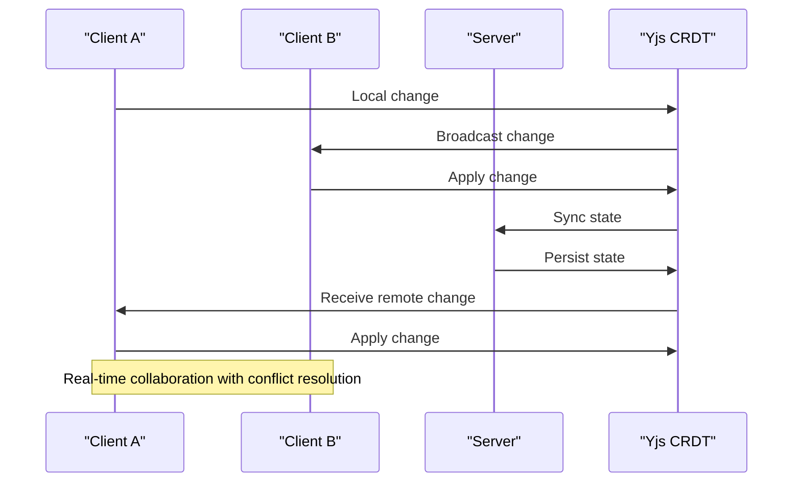

# Editor Architecture

<cite>
**Referenced Files in This Document**   
- [version.ts](file://shared/editor/version.ts)
- [nodes/index.ts](file://shared/editor/nodes/index.ts)
- [lib/ExtensionManager.ts](file://shared/editor/lib/ExtensionManager.ts)
- [lib/Extension.ts](file://shared/editor/lib/Extension.ts)
- [utils/ProsemirrorHelper.ts](file://shared/utils/ProsemirrorHelper.ts)
- [app/editor/index.tsx](file://app/editor/index.tsx)
- [app/editor/extensions/Multiplayer.ts](file://app/editor/extensions/Multiplayer.ts)
- [server/models/helpers/ProsemirrorHelper.tsx](file://server/models/helpers/ProsemirrorHelper.tsx)
- [server/commands/documentCollaborativeUpdater.ts](file://server/commands/documentCollaborativeUpdater.ts)
- [server/collaboration/PersistenceExtension.ts](file://server/collaboration/PersistenceExtension.ts)
</cite>

## Table of Contents
1. [Introduction](#introduction)
2. [Core Architecture](#core-architecture)
3. [Prosemirror Integration](#prosemirror-integration)
4. [Editor Implementation](#editor-implementation)
5. [Extension System](#extension-system)
6. [Collaborative Editing](#collaborative-editing)
7. [Performance and Optimization](#performance-and-optimization)
8. [Customization Examples](#customization-examples)

## Introduction
The baozi rich text editor is a sophisticated document editing system built on Prosemirror, providing a foundation for extensible and collaborative document editing. This architecture document explains the core components, integration patterns, and extension mechanisms that power the editor. The system is designed to handle rich text content with a focus on extensibility, real-time collaboration, and performance optimization. Key concepts include nodes, marks, commands, extensions, and transactions, which form the building blocks of the editor's functionality.

## Core Architecture
The baozi editor architecture is divided into shared and frontend-specific components, with a clear separation between the core editor implementation and UI features. The shared/editor/ directory contains the foundation of the editor, defining nodes, marks, and commands that are used across both frontend and backend. The app/editor/ directory contains frontend-specific extensions that add UI features and user interactions. The editor version is defined in shared/editor/version.ts as "16.0.0", indicating a stable and mature implementation. The architecture supports both basic and rich editing capabilities through extension sets like basicExtensions and richExtensions, which can be composed to create different editor configurations.

**Section sources**
- [version.ts](file://shared/editor/version.ts#L1-L3)
- [nodes/index.ts](file://shared/editor/nodes/index.ts#L1-L127)

## Prosemirror Integration
The baozi editor is built on Prosemirror, a toolkit for building rich text editors. Prosemirror provides the foundation for the extensible document editor, handling document state, transactions, and rendering. The editor uses Prosemirror's schema system to define document structure through nodes and marks, which represent different types of content and formatting. The ExtensionManager class in shared/editor/lib/ExtensionManager.ts orchestrates the integration, managing extensions, plugins, and the editor schema. Prosemirror's transaction system enables efficient document updates, with each user interaction resulting in a transaction that modifies the document state. The integration also includes support for Markdown parsing and serialization, allowing seamless conversion between Prosemirror JSON and Markdown formats.

**Diagram sources **
- [app/editor/index.tsx](file://app/editor/index.tsx#L0-L945)
- [lib/ExtensionManager.ts](file://shared/editor/lib/ExtensionManager.ts#L14-L276)

## Editor Implementation
The core editor implementation is defined in shared/editor/, with nodes, marks, and commands shared between frontend and backend. The nodes/index.ts file exports various node types such as Doc, Paragraph, Heading, and Table, which represent structural elements in the document. Marks like Bold, Italic, and Link provide text formatting capabilities. The ExtensionManager class manages these components, creating a cohesive editor schema. The implementation includes utility functions for document manipulation, such as isEmptyData for checking empty documents and getHeadings for extracting document structure. The editor also supports advanced features like code highlighting, math expressions, and embedded content through specialized nodes and marks. The shared implementation ensures consistency across different parts of the application while allowing for frontend-specific enhancements.

**Section sources**
- [nodes/index.ts](file://shared/editor/nodes/index.ts#L1-L127)
- [lib/ExtensionManager.ts](file://shared/editor/lib/ExtensionManager.ts#L14-L276)
- [utils/ProsemirrorHelper.ts](file://shared/utils/ProsemirrorHelper.ts#L48-L541)

## Extension System
The baozi editor features a flexible extension system that allows adding new functionality like block menus, emoji support, and find-and-replace. Extensions are implemented as classes that extend the base Extension class, providing hooks for plugins, commands, input rules, and keymaps. The extension system is organized into categories such as nodes, marks, commands, and plugins, each with specific responsibilities. Frontend-specific extensions in app/editor/extensions/ add UI features and user interactions, including BlockMenu, EmojiMenu, and FindAndReplace. The system supports dynamic extension loading, allowing different editor configurations based on context. Extensions can be composed to create rich editing experiences, with the ExtensionManager handling dependency resolution and initialization. This modular approach enables easy customization and feature addition without modifying core editor code.

**Diagram sources **
- [lib/Extension.ts](file://shared/editor/lib/Extension.ts#L10-L101)
- [app/editor/extensions/BlockMenu.tsx](file://app/editor/extensions/BlockMenu.tsx#L1-L50)
- [app/editor/extensions/EmojiMenu.tsx](file://app/editor/extensions/EmojiMenu.tsx#L1-L50)
- [app/editor/extensions/FindAndReplace.tsx](file://app/editor/extensions/FindAndReplace.tsx#L1-L50)

## Collaborative Editing
The baozi editor integrates with Yjs for real-time collaborative editing, enabling multiple users to edit the same document simultaneously. The Multiplayer extension in app/editor/extensions/Multiplayer.ts implements the collaboration features, using Yjs's CRDT (Conflict-Free Replicated Data Type) to synchronize document state across clients. The server-side documentCollaborativeUpdater command in server/commands/documentCollaborativeUpdater.ts handles persistence of collaborative changes, ensuring data consistency. The PersistenceExtension in server/collaboration/PersistenceExtension.ts manages the conversion between Prosemirror documents and Yjs state, handling both existing and new documents. The collaboration system includes features like user awareness, showing cursors and selections of other users, and conflict resolution through operational transformation. This enables seamless real-time collaboration with minimal latency and data loss.

**Diagram sources **
- [app/editor/extensions/Multiplayer.ts](file://app/editor/extensions/Multiplayer.ts#L22-L121)
- [server/commands/documentCollaborativeUpdater.ts](file://server/commands/documentCollaborativeUpdater.ts#L0-L83)
- [server/collaboration/PersistenceExtension.ts](file://server/collaboration/PersistenceExtension.ts#L41-L89)

## Performance and Optimization
The baozi editor implements several performance optimizations to ensure smooth editing experience even with large documents. The ProsemirrorHelper class in shared/utils/ProsemirrorHelper.ts includes methods like trim and isEmpty for efficient document manipulation. The editor uses React's observer pattern to minimize re-renders, with NodeViewRenderer managing component updates. The extension system is designed for lazy loading, reducing initial load time. For collaborative editing, the system implements connection throttling and idle disconnection to reduce server load. The document state is optimized for storage and transmission, with efficient serialization between Prosemirror JSON and Yjs binary format. These optimizations ensure responsive editing, fast collaboration sync, and minimal resource usage.

**Section sources**
- [utils/ProsemirrorHelper.ts](file://shared/utils/ProsemirrorHelper.ts#L48-L541)
- [app/editor/index.tsx](file://app/editor/index.tsx#L0-L945)
- [server/models/helpers/ProsemirrorHelper.tsx](file://server/models/helpers/ProsemirrorHelper.tsx#L50-L655)

## Customization Examples
Customizing the baozi editor involves creating new extensions or modifying existing ones. To add a new block type, create a Node extension with a schema definition and register it with the ExtensionManager. For new text formatting, implement a Mark extension with toMarkdown and parseMarkdown methods. Commands can be added by extending the commands method in an Extension class, making them available through the editor's command system. Input rules enable automatic formatting during typing, while keymaps provide keyboard shortcuts. The widget system allows adding UI components like toolbars and menus. For collaborative features, extend the Multiplayer extension or create new Yjs-based functionality. These customization points enable adding features like custom block menus, enhanced emoji support, or advanced find-and-replace functionality.

**Section sources**
- [lib/Extension.ts](file://shared/editor/lib/Extension.ts#L10-L101)
- [nodes/index.ts](file://shared/editor/nodes/index.ts#L1-L127)
- [app/editor/extensions/Multiplayer.ts](file://app/editor/extensions/Multiplayer.ts#L22-L121)