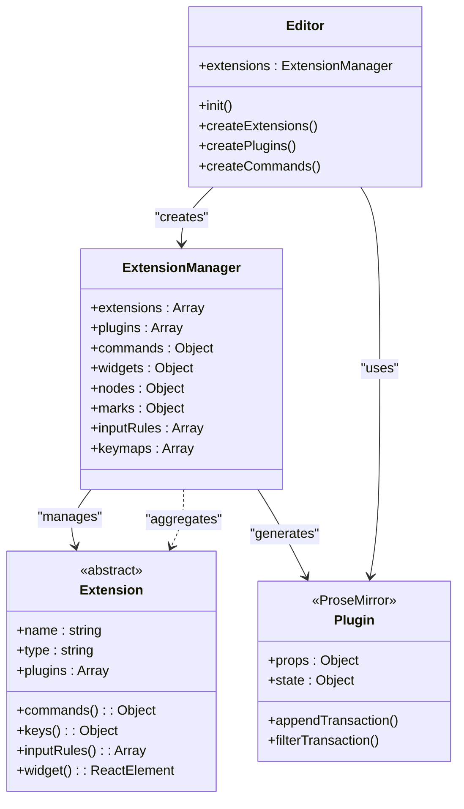
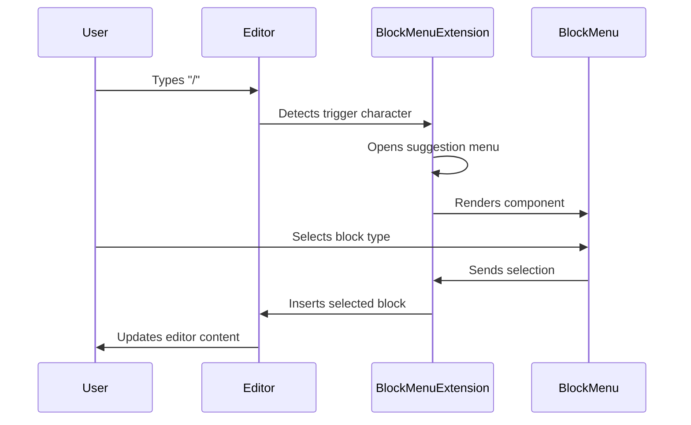
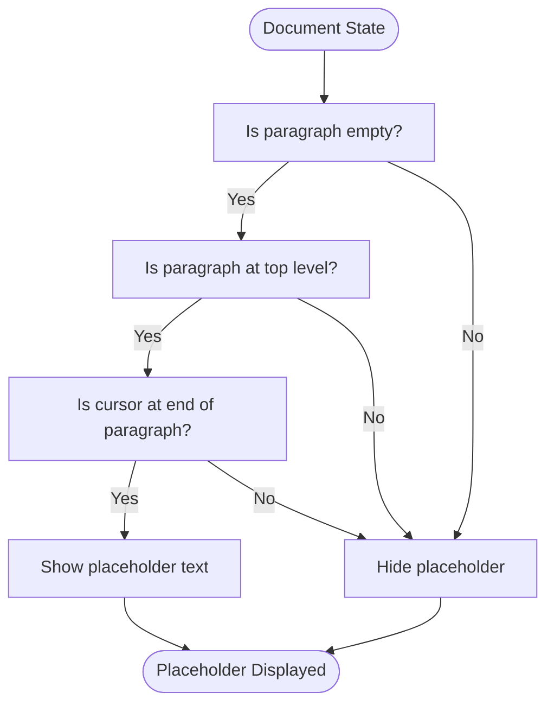
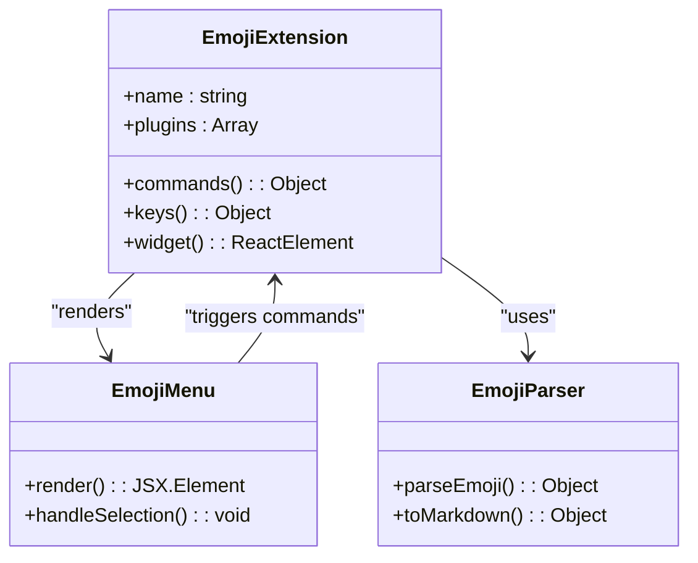

# Extensions & Plugins

<cite>
**Referenced Files in This Document**   
- [ExtensionManager.ts](file://shared/editor/lib/ExtensionManager.ts)
- [History.ts](file://shared/editor/extensions/History.ts)
- [Math.ts](file://shared/editor/extensions/Math.ts)
- [CodeHighlighting.ts](file://shared/editor/extensions/CodeHighlighting.ts)
- [BlockMenu.tsx](file://app/editor/extensions/BlockMenu.tsx)
- [FindAndReplace.tsx](file://app/editor/extensions/FindAndReplace.tsx)
- [SelectionToolbar.tsx](file://app/editor/extensions/SelectionToolbar.tsx)
- [PlaceholderPlugin.ts](file://shared/editor/plugins/PlaceholderPlugin.ts)
- [UploadPlugin.ts](file://shared/editor/plugins/UploadPlugin.ts)
- [TableLayoutPlugin.ts](file://shared/editor/plugins/TableLayoutPlugin.ts)
- [Editor.tsx](file://app/editor/index.tsx)
</cite>

## Table of Contents
1. [Introduction](#introduction)
2. [Extension System Architecture](#extension-system-architecture)
3. [Shared Extensions](#shared-extensions)
4. [Frontend Extensions](#frontend-extensions)
5. [Plugins](#plugins)
6. [Relationship Between Extensions, Plugins, and Commands](#relationship-between-extensions-plugins-and-commands)
7. [Implementing New Extensions](#implementing-new-extensions)
8. [Common Issues](#common-issues)
9. [When to Use Extensions vs Plugins](#when-to-use-extensions-vs-plugins)
10. [Conclusion](#conclusion)

## Introduction
The baozi editor utilizes a modular extension and plugin system to provide extensible functionality while maintaining a clean core architecture. This system allows for both shared capabilities across different environments and frontend-specific user interactions. The architecture is built on ProseMirror, leveraging its plugin system while adding an abstraction layer through the ExtensionManager. This document provides a comprehensive overview of the extension system, detailing the core components, their relationships, and practical implementation guidance.

## Extension System Architecture

The extension system in the baozi editor is centered around the `ExtensionManager` class, which serves as the orchestrator for all editor functionality. This manager collects and organizes extensions, then exposes their capabilities to the ProseMirror editor instance. The architecture follows a layered approach where extensions provide high-level functionality while being compiled down to ProseMirror's native constructs like plugins, node views, and commands.



**Diagram sources**
- [ExtensionManager.ts](file://shared/editor/lib/ExtensionManager.ts)
- [Editor.tsx](file://app/editor/index.tsx)

**Section sources**
- [ExtensionManager.ts](file://shared/editor/lib/ExtensionManager.ts)
- [Editor.tsx](file://app/editor/index.tsx)

## Shared Extensions

Shared extensions provide core editing capabilities that are available across different environments. These extensions are located in `shared/editor/extensions/` and include functionality like history management, mathematical expressions, and code highlighting.

### History Extension
The History extension provides undo and redo functionality through ProseMirror's history plugin. It registers the necessary commands and keybindings, allowing users to navigate through their editing history. The extension integrates with ProseMirror's input rules to support undo on backspace, enhancing the user experience.

**Section sources**
- [History.ts](file://shared/editor/extensions/History.ts)

### Math Extension
The Math extension enables rendering of mathematical expressions using KaTeX. It creates a ProseMirror plugin that manages the state of math node views and handles the dynamic loading of KaTeX styles. The extension supports both inline and block math expressions, providing a seamless experience for technical documentation.

**Section sources**
- [Math.ts](file://shared/editor/extensions/Math.ts)

### CodeHighlighting Extension
The CodeHighlighting extension provides syntax highlighting for code blocks. It uses the refractor library to parse code and generate appropriate decorations. The extension implements lazy loading of language grammars, improving initial load performance. It also supports line numbers and handles remote transactions appropriately in collaborative editing scenarios.

**Section sources**
- [CodeHighlighting.ts](file://shared/editor/extensions/CodeHighlighting.ts)

## Frontend Extensions

Frontend-specific extensions enhance user interaction within the editor interface. These extensions are located in `app/editor/extensions/` and include components like block menus, find and replace functionality, and selection toolbars.

### BlockMenu Extension
The BlockMenu extension provides a contextual menu for inserting different block types. It extends the Suggestion extension to trigger on the "/" character and displays a floating menu with available block options. The extension also integrates with the PlaceholderPlugin to show helpful text when the cursor is in an empty paragraph.



**Diagram sources**
- [BlockMenu.tsx](file://app/editor/extensions/BlockMenu.tsx)

**Section sources**
- [BlockMenu.tsx](file://app/editor/extensions/BlockMenu.tsx)

### FindAndReplace Extension
The FindAndReplace extension provides comprehensive text search and replacement functionality. It highlights all matching results in the document and allows navigation between them. The extension supports case-sensitive searches, regular expressions, and can replace individual or all occurrences. The UI is rendered as a widget that appears when the find and replace functionality is activated.

**Section sources**
- [FindAndReplace.tsx](file://app/editor/extensions/FindAndReplace.tsx)

### SelectionToolbar Extension
The SelectionToolbar extension displays a floating toolbar when text is selected, providing quick access to formatting options. This enhances the user experience by making common formatting actions readily available without requiring navigation to a separate toolbar.

**Section sources**
- [SelectionToolbar.tsx](file://app/editor/extensions/SelectionToolbar.tsx)

## Plugins

Plugins in the baozi editor modify editor behavior at a lower level than extensions. They are typically implemented as ProseMirror plugins and handle specific interactions like file uploads, table layout changes, and placeholder text.

### PlaceholderPlugin
The PlaceholderPlugin displays placeholder text in empty paragraphs under specific conditions. It uses ProseMirror decorations to show the placeholder text and manages its visibility based on the document state. The plugin can be configured with multiple conditions and corresponding placeholder texts.



**Diagram sources**
- [PlaceholderPlugin.ts](file://shared/editor/plugins/PlaceholderPlugin.ts)

**Section sources**
- [PlaceholderPlugin.ts](file://shared/editor/plugins/PlaceholderPlugin.ts)

### UploadPlugin
The UploadPlugin handles file uploads through paste and drag-and-drop operations. It intercepts paste and drop events, processes the files, and inserts them into the document using the insertFiles command. The plugin also handles remote images in pasted content, uploading them to the server and updating the image sources.

**Section sources**
- [UploadPlugin.ts](file://shared/editor/plugins/UploadPlugin.ts)

### TableLayoutPlugin
The TableLayoutPlugin monitors changes to table layout attributes and automatically adjusts cell widths accordingly. When a table's layout changes, the plugin removes width constraints from cells in the last column, ensuring the table adapts to the new layout. This maintains visual consistency when users switch between different table formats.

**Section sources**
- [TableLayoutPlugin.ts](file://shared/editor/plugins/TableLayoutPlugin.ts)

## Relationship Between Extensions, Plugins, and Commands

The baozi editor's architecture establishes a clear relationship between extensions, plugins, and commands. Extensions serve as the primary interface for adding functionality, while plugins provide lower-level behavior modification, and commands expose actionable operations.

```mermaid
erDiagram
EXTENSION ||--o{ PLUGIN : "contains"
EXTENSION ||--o{ COMMAND : "exposes"
EXTENSION ||--o{ INPUT_RULE : "defines"
EXTENSION ||--o{ KEYMAP : "registers"
EXTENSION ||--o{ NODE : "defines"
EXTENSION ||--o{ MARK : "defines"
EXTENSION ||--o{ WIDGET : "renders"
class EXTENSION {
name: string
type: string
plugins: Plugin[]
commands: Command[]
inputRules: InputRule[]
keys: Keymap[]
nodes: NodeSpec[]
marks: MarkSpec[]
widget: Function
}
class PLUGIN {
props: Object
state: Object
appendTransaction: Function
filterTransaction: Function
}
class COMMAND {
name: string
execute: Function
isActive: Function
isEnabled: Function
}
```

**Diagram sources**
- [ExtensionManager.ts](file://shared/editor/lib/ExtensionManager.ts)
- [History.ts](file://shared/editor/extensions/History.ts)

**Section sources**
- [ExtensionManager.ts](file://shared/editor/lib/ExtensionManager.ts)

## Implementing New Extensions

Creating new extensions in the baozi editor follows a consistent pattern. Extensions are classes that extend the base Extension class and implement specific methods based on the desired functionality.

### Example: Emoji Extension
To implement an emoji extension, you would create a class that defines the necessary components:



The extension would register input rules for emoji shortcuts (e.g., ":smile:"), provide commands for inserting emojis, and render a widget for the emoji picker menu. It would also define the necessary node and mark specifications for representing emojis in the document.

### Example: Collaborative Editing Extension
For collaborative editing, an extension would integrate with the multiplayer system, handling presence indicators, conflict resolution, and real-time updates. It would use ProseMirror's collaborative editing capabilities while providing a user-friendly interface for seeing other collaborators' cursors and selections.

**Section sources**
- [Multiplayer.ts](file://app/editor/extensions/Multiplayer.ts)
- [Suggestion.ts](file://app/editor/extensions/Suggestion.ts)

## Common Issues

### Extension Conflicts
Extension conflicts can occur when multiple extensions try to handle the same input or modify the same document elements. To mitigate this, the ExtensionManager processes extensions in a defined order and provides mechanisms for extensions to check if they should yield to others. For example, the Suggestion extension checks if another suggestion is already active before opening.

### Performance Impacts
Multiple plugins can impact editor performance, particularly those that process the entire document on each change. The CodeHighlighting extension addresses this by caching results and only reprocessing blocks that have changed. Similarly, the FindAndReplace extension debounces searches to prevent excessive processing during rapid typing.

**Section sources**
- [CodeHighlighting.ts](file://shared/editor/extensions/CodeHighlighting.ts)
- [FindAndReplace.tsx](file://app/editor/extensions/FindAndReplace.tsx)

## When to Use Extensions vs Plugins

### Use Extensions When:
- Adding new node or mark types to the editor
- Creating user-facing features like menus or toolbars
- Implementing commands that users can invoke
- Adding input rules for text expansion
- Registering keybindings for user actions
- Creating reusable components that can be shared across different editor instances

### Use Plugins When:
- Modifying editor behavior at a low level
- Handling specific events like paste or drop
- Implementing document-wide validation or transformation
- Managing complex state that affects multiple parts of the editor
- Performing operations that need to run on every transaction
- Implementing collaborative editing features

The general guideline is to use extensions for higher-level functionality that can be composed and shared, while using plugins for lower-level, specific behaviors that directly interact with ProseMirror's transaction system.

**Section sources**
- [ExtensionManager.ts](file://shared/editor/lib/ExtensionManager.ts)

## Conclusion
The baozi editor's extension and plugin system provides a robust foundation for building rich editing experiences. By leveraging the ExtensionManager to coordinate functionality, the system maintains a clean separation between core editor capabilities and added features. Shared extensions ensure consistent behavior across environments, while frontend extensions enhance user interaction. The clear distinction between extensions and plugins allows developers to choose the appropriate level of abstraction for their use case, whether adding simple commands or implementing complex document transformations.