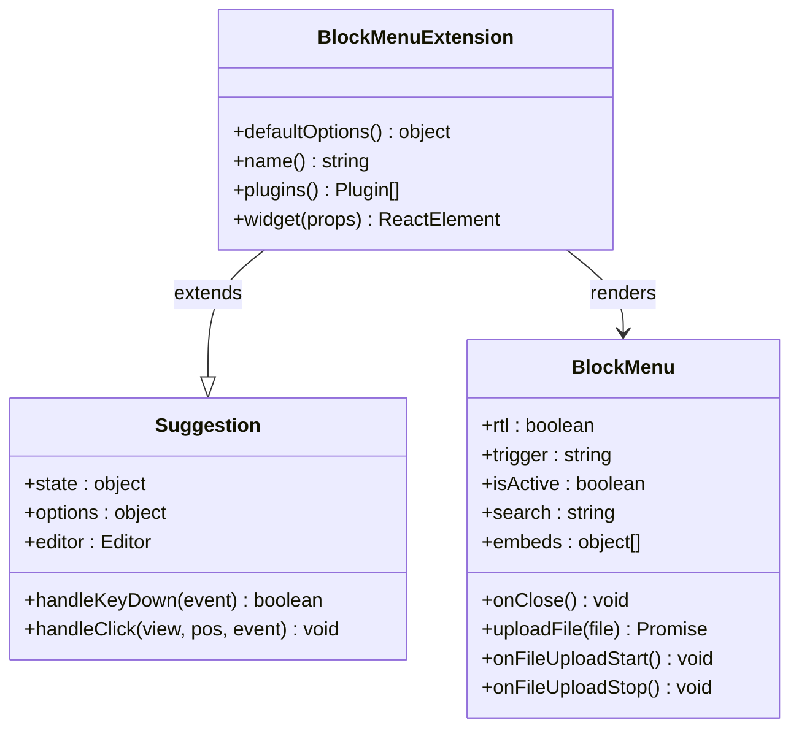
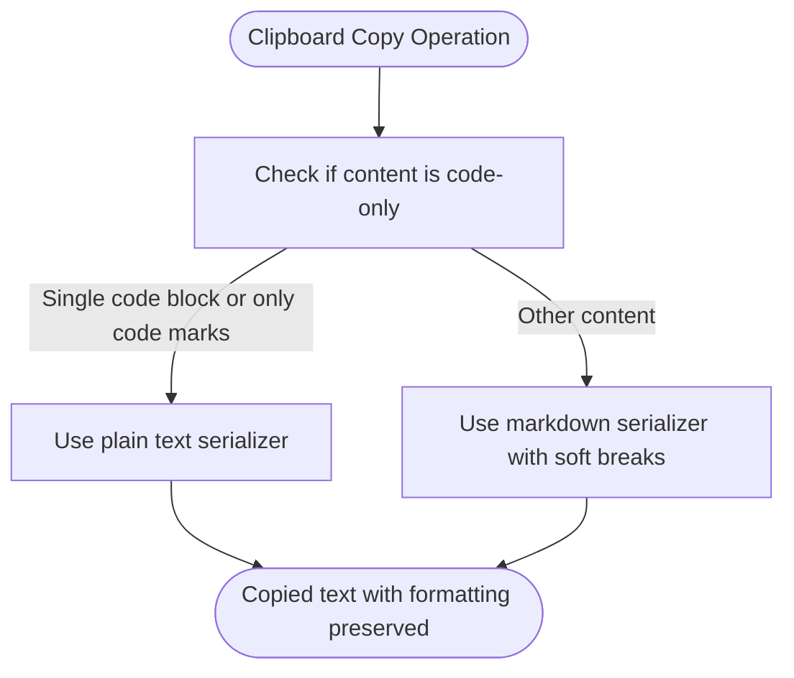
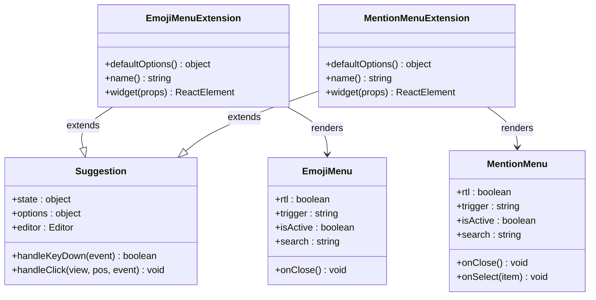
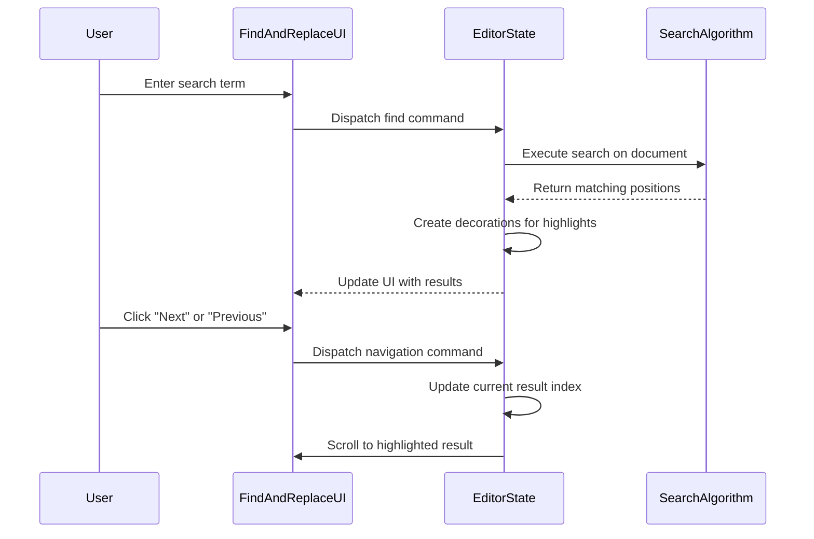
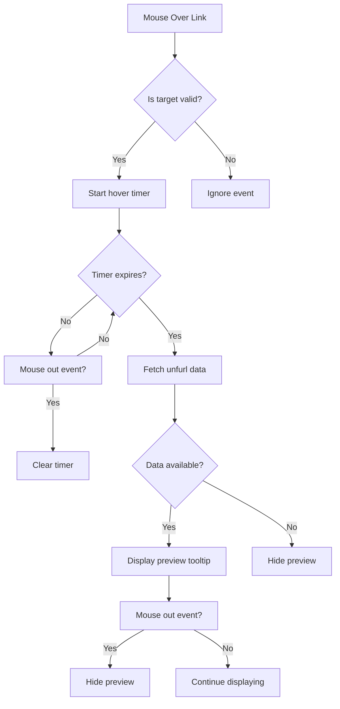
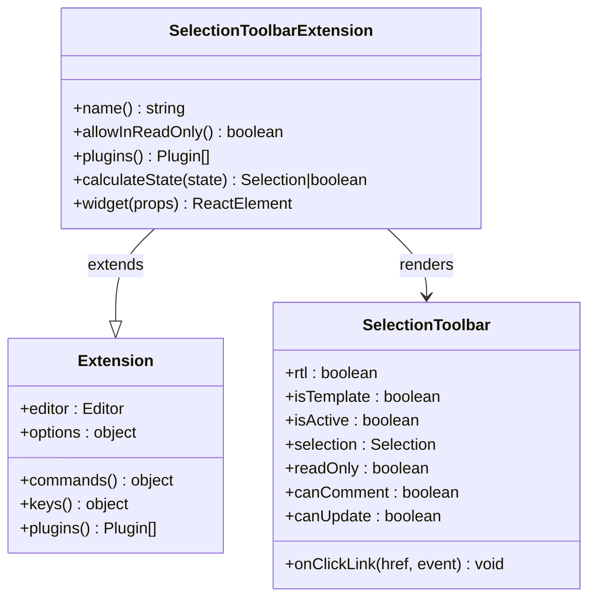
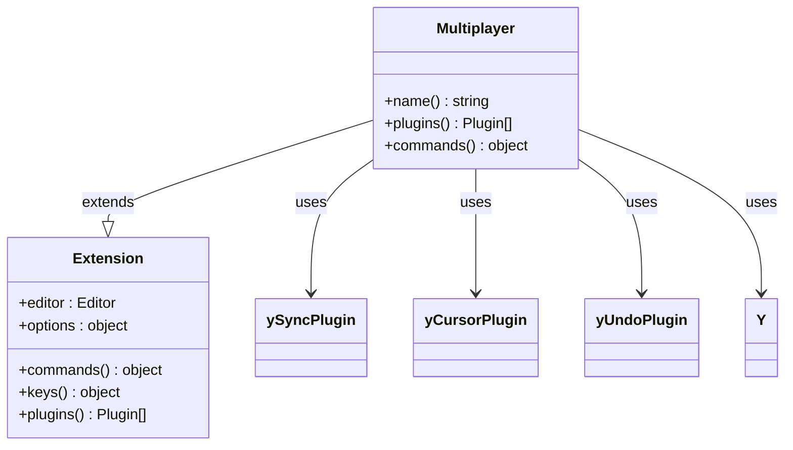
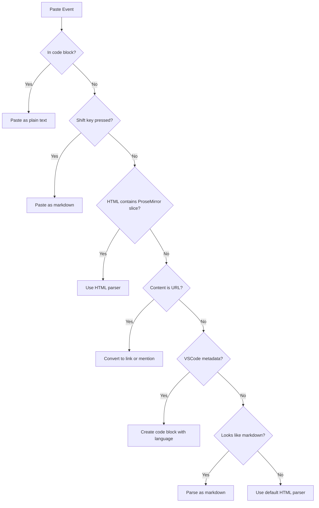
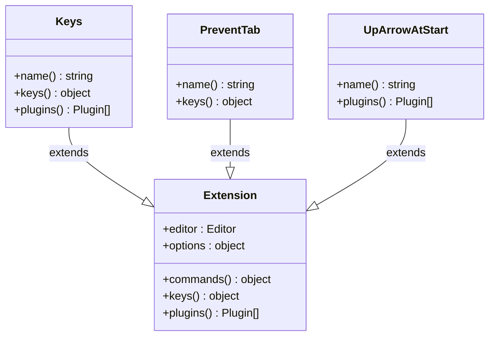

# Frontend Extensions

<cite>
**Referenced Files in This Document**   
- [BlockMenu.tsx](file://app/editor/extensions/BlockMenu.tsx)
- [ClipboardTextSerializer.ts](file://app/editor/extensions/ClipboardTextSerializer.ts)
- [EmojiMenu.tsx](file://app/editor/extensions/EmojiMenu.tsx)
- [FindAndReplace.tsx](file://app/editor/extensions/FindAndReplace.tsx)
- [HoverPreviews.tsx](file://app/editor/extensions/HoverPreviews.tsx)
- [SelectionToolbar.tsx](file://app/editor/extensions/SelectionToolbar.tsx)
- [Multiplayer.ts](file://app/editor/extensions/Multiplayer.ts)
- [PasteHandler.tsx](file://app/editor/extensions/PasteHandler.tsx)
- [Keys.ts](file://app/editor/extensions/Keys.ts)
- [PreventTab.ts](file://app/editor/extensions/PreventTab.ts)
- [UpArrowAtStart.ts](file://app/editor/extensions/UpArrowAtStart.ts)
- [BlockMenu.tsx](file://app/editor/components/BlockMenu.tsx)
- [EmojiMenu.tsx](file://app/editor/components/EmojiMenu.tsx)
- [MentionMenu.tsx](file://app/editor/components/MentionMenu.tsx)
- [FindAndReplace.tsx](file://app/editor/components/FindAndReplace.tsx)
- [SelectionToolbar.tsx](file://app/editor/components/SelectionToolbar.tsx)
- [HoverPreview.tsx](file://app/components/HoverPreview/HoverPreview.tsx)
</cite>

## Table of Contents
1. [Introduction](#introduction)
2. [BlockMenu Extension](#blockmenu-extension)
3. [ClipboardTextSerializer Extension](#clipboardtextserializer-extension)
4. [EmojiMenu and MentionMenu Extensions](#emojimenu-and-mentionmenu-extensions)
5. [FindAndReplace Extension](#findandreplace-extension)
6. [HoverPreviews Extension](#hoverpreviews-extension)
7. [SelectionToolbar Extension](#selectiontoolbar-extension)
8. [Multiplayer Extension](#multiplayer-extension)
9. [PasteHandler Extension](#pastehandler-extension)
10. [Keyboard-Focused Extensions](#keyboard-focused-extensions)
11. [Common Issues and Best Practices](#common-issues-and-best-practices)
12. [Conclusion](#conclusion)

## Introduction
The Baozi editor implements a comprehensive set of frontend extensions that enhance user interaction, improve content creation workflows, and enable real-time collaboration. These extensions are built on the ProseMirror framework and integrate with React components to provide a rich, interactive editing experience. This document details the implementation and functionality of key frontend extensions including BlockMenu for block-level formatting, ClipboardTextSerializer for clipboard operations, EmojiMenu and MentionMenu for rich content insertion, FindAndReplace for text search functionality, HoverPreviews for content preview on hover, SelectionToolbar for context-aware formatting options, Multiplayer for real-time collaboration, PasteHandler for intelligent content pasting, and keyboard-focused extensions like Keys, PreventTab, and UpArrowAtStart.

**Section sources**
- [BlockMenu.tsx](file://app/editor/extensions/BlockMenu.tsx#L1-L128)
- [ClipboardTextSerializer.ts](file://app/editor/extensions/ClipboardTextSerializer.ts#L1-L53)

## BlockMenu Extension
The BlockMenu extension provides a contextual menu for block-level formatting and content insertion. It extends the Suggestion class and is triggered by the "/" character. The extension creates a decorative widget in the form of a plus icon that appears at the beginning of empty paragraphs, allowing users to insert various content blocks such as headings, lists, code blocks, and embedded content. The menu is implemented as a React component that renders suggestions based on the current query, with filtering and categorization of available block types. The extension handles positioning and visibility through ProseMirror decorations and integrates with the editor's upload capabilities for file attachments.

**Diagram sources**
- [BlockMenu.tsx](file://app/editor/extensions/BlockMenu.tsx#L12-L128)
- [BlockMenu.tsx](file://app/editor/components/BlockMenu.tsx#L1-L42)

**Section sources**
- [BlockMenu.tsx](file://app/editor/extensions/BlockMenu.tsx#L1-L128)
- [BlockMenu.tsx](file://app/editor/components/BlockMenu.tsx#L1-L42)

## ClipboardTextSerializer Extension
The ClipboardTextSerializer extension enhances clipboard operations by allowing users to copy text with markdown formatting preserved. It implements a ProseMirror plugin that overrides the default clipboardTextSerializer behavior. The extension intelligently determines whether to use plain text or markdown serialization based on content type. For code-only content (single code blocks or text with only code marks), it uses plain text serialization. For all other content, it uses markdown serialization with soft breaks. This ensures that when users copy formatted text, the formatting is preserved in a way that's both readable and functional when pasted elsewhere.

**Diagram sources**
- [ClipboardTextSerializer.ts](file://app/editor/extensions/ClipboardTextSerializer.ts#L1-L53)

**Section sources**
- [ClipboardTextSerializer.ts](file://app/editor/extensions/ClipboardTextSerializer.ts#L1-L53)

## EmojiMenu and MentionMenu Extensions
The EmojiMenu and MentionMenu extensions provide rich content insertion capabilities through suggestion menus triggered by specific characters. The EmojiMenu is activated by the ":" character and includes special handling for languages that use colons in standard punctuation, requiring additional text after the colon to trigger the menu. The MentionMenu is triggered by the "@" character and allows users to mention users, groups, documents, and collections. Both extensions extend the Suggestion class and render React components that display filtered results based on the current search query. The MentionMenu integrates with the application's stores to fetch and display relevant entities, and includes functionality to notify users when they are mentioned in documents they have access to.

**Diagram sources**
- [EmojiMenu.tsx](file://app/editor/extensions/EmojiMenu.tsx#L1-L44)
- [MentionMenu.tsx](file://app/editor/extensions/MentionMenu.tsx#L1-L32)
- [EmojiMenu.tsx](file://app/editor/components/EmojiMenu.tsx#L1-L71)
- [MentionMenu.tsx](file://app/editor/components/MentionMenu.tsx#L1-L317)

**Section sources**
- [EmojiMenu.tsx](file://app/editor/extensions/EmojiMenu.tsx#L1-L44)
- [MentionMenu.tsx](file://app/editor/extensions/MentionMenu.tsx#L1-L32)
- [EmojiMenu.tsx](file://app/editor/components/EmojiMenu.tsx#L1-L71)
- [MentionMenu.tsx](file://app/editor/components/MentionMenu.tsx#L1-L317)

## FindAndReplace Extension
The FindAndReplace extension provides comprehensive text search and replacement functionality within the editor. It implements a ProseMirror plugin with a dedicated plugin key for state management. The extension supports case-sensitive searching, regular expressions, and diacritic-insensitive matching by combining deburred and original text for search operations. It highlights all matching results in the document and allows users to navigate between them. The extension also provides a UI component that displays the current match index and total results, with options to replace individual matches or all matches at once. The implementation handles document changes by re-running searches to ensure results remain accurate.

**Diagram sources**
- [FindAndReplace.tsx](file://app/editor/extensions/FindAndReplace.tsx#L1-L387)
- [FindAndReplace.tsx](file://app/editor/components/FindAndReplace.tsx#L1-L526)

**Section sources**
- [FindAndReplace.tsx](file://app/editor/extensions/FindAndReplace.tsx#L1-L387)
- [FindAndReplace.tsx](file://app/editor/components/FindAndReplace.tsx#L1-L526)

## HoverPreviews Extension
The HoverPreviews extension enables content preview when users hover over links in the editor. It implements a ProseMirror plugin that listens for mouseover and mouseout events on elements with the "use-hover-preview" class. When a user hovers over a link, the extension fetches metadata about the linked content (such as document or web page information) and displays a preview tooltip. The extension includes a delay to prevent accidental triggers and manages the loading state of fetched data. It integrates with the application's stores to fetch unfurl data for links and handles both internal document links and external URLs by transforming relative URLs to absolute ones using the application's base URL.

**Diagram sources**
- [HoverPreviews.tsx](file://app/editor/extensions/HoverPreviews.tsx#L1-L118)
- [HoverPreview.tsx](file://app/components/HoverPreview/HoverPreview.tsx#L1-L30)

**Section sources**
- [HoverPreviews.tsx](file://app/editor/extensions/HoverPreviews.tsx#L1-L118)
- [HoverPreview.tsx](file://app/components/HoverPreview/HoverPreview.tsx#L1-L30)

## SelectionToolbar Extension
The SelectionToolbar extension provides context-aware formatting options based on the current selection in the editor. It implements a ProseMirror plugin that listens for view updates and calculates the appropriate toolbar state based on the selection type and content. The toolbar appears when users select text or specific nodes like images, links, or code blocks. It displays different sets of formatting options depending on the selection context, such as link editing for selected links, image formatting for selected images, or table operations for table selections. The extension integrates with various menu item generators to provide relevant actions and handles special cases like AI-powered text editing, which allows users to submit prompts for AI-generated content modifications.

**Diagram sources**
- [SelectionToolbar.tsx](file://app/editor/extensions/SelectionToolbar.tsx#L1-L117)
- [SelectionToolbar.tsx](file://app/editor/components/SelectionToolbar.tsx#L1-L572)

**Section sources**
- [SelectionToolbar.tsx](file://app/editor/extensions/SelectionToolbar.tsx#L1-L117)
- [SelectionToolbar.tsx](file://app/editor/components/SelectionToolbar.tsx#L1-L572)

## Multiplayer Extension
The Multiplayer extension enables real-time collaborative editing by integrating Yjs with ProseMirror. It implements a ProseMirror plugin that synchronizes document state across multiple clients using Yjs's shared types and awareness features. The extension handles user awareness by tracking cursor positions and selection states of all connected users, with configurable opacity and timeout for remote selections. It includes functionality to map user IDs to client IDs only after a user makes a change, preventing storage of mappings for inactive clients. The extension also provides undo/redo functionality through y-prosemirror's undo plugin and handles remote transactions to prevent unnecessary scroll adjustments during collaborative editing.

**Diagram sources**
- [Multiplayer.ts](file://app/editor/extensions/Multiplayer.ts#L1-L123)

**Section sources**
- [Multiplayer.ts](file://app/editor/extensions/Multiplayer.ts#L1-L123)

## PasteHandler Extension
The PasteHandler extension provides intelligent content pasting with context-aware transformations. It implements a ProseMirror plugin that intercepts paste events and applies various transformations based on the clipboard content and context. The extension handles special cases like pasting from Dropbox Paper by normalizing HTML, and intelligently processes URLs by converting them to document mentions when possible. It supports pasting code from VSCode with language detection, and handles iframe content by extracting the source URL. For lists of links, it displays a paste menu allowing users to choose between creating embeds, mentions, or mention lists. The extension uses decorations to temporarily mark pasted content while the user makes decisions about how to handle it.

**Diagram sources**
- [PasteHandler.tsx](file://app/editor/extensions/PasteHandler.tsx#L1-L644)

**Section sources**
- [PasteHandler.tsx](file://app/editor/extensions/PasteHandler.tsx#L1-L644)

## Keyboard-Focused Extensions
The keyboard-focused extensions enhance the editor's keyboard navigation and shortcut functionality. The Keys extension implements various keyboard shortcuts including Mod-Escape and Shift-Escape to cancel editing, Mod-s to save, and Mod-Enter to save and exit. It also provides block movement shortcuts (Mod-Alt-ArrowUp/Down) to move blocks up and down in the document. The PreventTab extension prevents the Tab key from escaping the editor bounds by intercepting Tab and Shift-Tab events. The UpArrowAtStart extension detects when the cursor is at the very beginning of the document and calls a callback function, enabling custom behavior when users press the up arrow at the start of the document. These extensions work together to provide a seamless keyboard-driven editing experience.

**Diagram sources**
- [Keys.ts](file://app/editor/extensions/Keys.ts#L1-L193)
- [PreventTab.ts](file://app/editor/extensions/PreventTab.ts#L1-L17)
- [UpArrowAtStart.ts](file://app/editor/extensions/UpArrowAtStart.ts#L1-L48)

**Section sources**
- [Keys.ts](file://app/editor/extensions/Keys.ts#L1-L193)
- [PreventTab.ts](file://app/editor/extensions/PreventTab.ts#L1-L17)
- [UpArrowAtStart.ts](file://app/editor/extensions/UpArrowAtStart.ts#L1-L48)

## Common Issues and Best Practices
Several common issues arise when implementing frontend extensions in the Baozi editor. Menu positioning conflicts can occur when multiple floating elements compete for space, which is addressed through careful z-index management and positioning logic. Performance bottlenecks during collaborative editing are mitigated by optimizing the awareness state filter and selection builder functions to minimize unnecessary re-renders. Accessibility challenges are addressed by ensuring keyboard navigation works seamlessly with all extensions and providing appropriate ARIA labels for interactive elements.

When deciding whether to implement new features as frontend extensions versus shared extensions, consider the following guidelines: use frontend extensions for UI-specific functionality that doesn't need to be replicated on the server, such as visual menus, tooltips, and client-side interactions. Use shared extensions for core editing functionality that should work consistently across different environments, such as collaborative editing, document synchronization, and content validation. Frontend extensions should focus on enhancing the user experience without introducing business logic that could create inconsistencies between clients.

**Section sources**
- [BlockMenu.tsx](file://app/editor/extensions/BlockMenu.tsx#L1-L128)
- [ClipboardTextSerializer.ts](file://app/editor/extensions/ClipboardTextSerializer.ts#L1-L53)
- [EmojiMenu.tsx](file://app/editor/extensions/EmojiMenu.tsx#L1-L44)
- [FindAndReplace.tsx](file://app/editor/extensions/FindAndReplace.tsx#L1-L387)
- [HoverPreviews.tsx](file://app/editor/extensions/HoverPreviews.tsx#L1-L118)
- [SelectionToolbar.tsx](file://app/editor/extensions/SelectionToolbar.tsx#L1-L117)
- [Multiplayer.ts](file://app/editor/extensions/Multiplayer.ts#L1-L123)
- [PasteHandler.tsx](file://app/editor/extensions/PasteHandler.tsx#L1-L644)
- [Keys.ts](file://app/editor/extensions/Keys.ts#L1-L193)
- [PreventTab.ts](file://app/editor/extensions/PreventTab.ts#L1-L17)
- [UpArrowAtStart.ts](file://app/editor/extensions/UpArrowAtStart.ts#L1-L48)

## Conclusion
The frontend extensions in the Baozi editor work together to create a powerful, user-friendly editing experience. By leveraging the ProseMirror framework and React components, these extensions provide rich functionality for content creation, formatting, collaboration, and navigation. The modular architecture allows for easy extension and customization, while the integration with application stores and services enables seamless interaction with the broader system. Understanding the implementation details and interaction patterns of these extensions is essential for maintaining and enhancing the editor's capabilities.