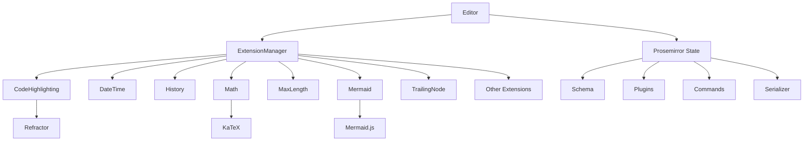
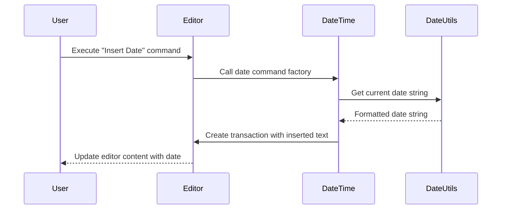
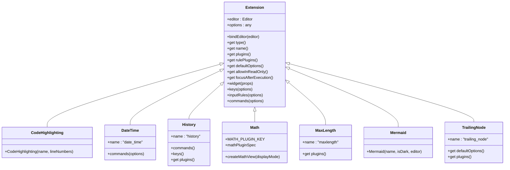

# Shared Extensions

<cite>
**Referenced Files in This Document**   
- [CodeHighlighting.ts](file://shared/editor/extensions/CodeHighlighting.ts)
- [DateTime.ts](file://shared/editor/extensions/DateTime.ts)
- [History.ts](file://shared/editor/extensions/History.ts)
- [Math.ts](file://shared/editor/extensions/Math.ts)
- [MaxLength.ts](file://shared/editor/extensions/MaxLength.ts)
- [Mermaid.ts](file://shared/editor/extensions/Mermaid.ts)
- [TrailingNode.ts](file://shared/editor/extensions/TrailingNode.ts)
- [Extension.ts](file://shared/editor/lib/Extension.ts)
- [ExtensionManager.ts](file://shared/editor/lib/ExtensionManager.ts)
</cite>

## Table of Contents
1. [Introduction](#introduction)
2. [Core Architecture](#core-architecture)
3. [CodeHighlighting Extension](#codehighlighting-extension)
4. [DateTime Extension](#datetime-extension)
5. [History Extension](#history-extension)
6. [Math Extension](#math-extension)
7. [MaxLength Extension](#maxlength-extension)
8. [Mermaid Extension](#mermaid-extension)
9. [TrailingNode Extension](#trailingnode-extension)
10. [Extension Integration Patterns](#extension-integration-patterns)
11. [Performance Considerations](#performance-considerations)
12. [Troubleshooting Guide](#troubleshooting-guide)

## Introduction
The baozi editor utilizes a modular extension system built on Prosemirror to provide rich functionality across both client and server contexts. These shared extensions are designed to enhance the editing experience with features ranging from syntax highlighting to mathematical equation rendering. Each extension follows a consistent pattern of integration with the Prosemirror state management system, allowing for seamless collaboration and real-time updates. This document provides a comprehensive analysis of the seven core shared extensions: CodeHighlighting, DateTime, History, Math, MaxLength, Mermaid, and TrailingNode, detailing their implementation, configuration, and interaction patterns within the editor ecosystem.

## Core Architecture
The shared extensions in the baozi editor are managed through a centralized ExtensionManager that orchestrates the integration of various Prosemirror plugins, nodes, marks, and commands. This architecture enables a consistent approach to editor functionality while maintaining separation of concerns between different features.



**Diagram sources**
- [ExtensionManager.ts](file://shared/editor/lib/ExtensionManager.ts)
- [CodeHighlighting.ts](file://shared/editor/extensions/CodeHighlighting.ts)
- [Math.ts](file://shared/editor/extensions/Math.ts)
- [Mermaid.ts](file://shared/editor/extensions/Mermaid.ts)

**Section sources**
- [ExtensionManager.ts](file://shared/editor/lib/ExtensionManager.ts)
- [Extension.ts](file://shared/editor/lib/Extension.ts)

## CodeHighlighting Extension
The CodeHighlighting extension provides syntax highlighting for code blocks within the editor using the Refractor library, which is a tree-shakable version of Prism.js. This extension implements a Prosemirror plugin that dynamically loads language grammars and applies decorations to code text based on syntax rules.

The extension uses a caching mechanism to store rendered decorations and avoid redundant processing. It intelligently determines when to re-highlight code blocks based on document changes, paste operations, or remote transactions in collaborative editing scenarios. For performance optimization, syntax highlighting is deferred using requestAnimationFrame during initial rendering to prevent blocking the main thread.

Configuration options include:
- **name**: The node name to apply highlighting to (typically "code_block")
- **lineNumbers**: Optional boolean to include line number decorations

The extension handles language loading asynchronously, maintaining a registry of pending language imports and resolving them when needed. This ensures that only the required language grammars are loaded, reducing initial bundle size.

**Section sources**
- [CodeHighlighting.ts](file://shared/editor/extensions/CodeHighlighting.ts)

## DateTime Extension
The DateTime extension enables insertion of current date and time values through editor commands. This extension implements three distinct commands: date, time, and datetime, each inserting the corresponding timestamp in the user's local format.

The implementation leverages shared utility functions from the editor's date utilities to format timestamps according to the user's locale preferences. When used in template contexts, the extension inserts placeholder tokens ({date}, {time}, {datetime}) instead of actual values, allowing for dynamic content generation.

The commands are implemented as Prosemirror command factories that insert text at the current cursor position. The extension does not require any configuration options and integrates seamlessly with the editor's command system.



**Diagram sources**
- [DateTime.ts](file://shared/editor/extensions/DateTime.ts)
- [date.ts](file://shared/utils/date.ts)

**Section sources**
- [DateTime.ts](file://shared/editor/extensions/DateTime.ts)

## History Extension
The History extension provides undo and redo functionality using Prosemirror's built-in history plugin. This extension wraps the standard history plugin and adds keyboard shortcuts for common undo/redo operations.

The implementation includes:
- Integration with Prosemirror's history plugin for state management
- Keyboard bindings for undo (Mod-z) and redo (Mod-y, Shift-Mod-z)
- Input rule for undo on backspace after automatic replacements
- Commands exposed through the editor's command system

The extension follows the standard Prosemirror pattern of using a plugin to manage document history, storing previous states and enabling navigation between them. It works in conjunction with other input rules and collaborative editing features to provide a seamless editing experience.

**Section sources**
- [History.ts](file://shared/editor/extensions/History.ts)

## Math Extension
The Math extension enables LaTeX equation rendering using the prosemirror-math library in conjunction with KaTeX. This extension implements a Prosemirror plugin that renders mathematical expressions in both inline and block formats.

The implementation creates a plugin with a custom state management system that tracks active math node views and cursor position. It uses KaTeX for rendering equations with support for custom macros. The extension dynamically imports KaTeX styles to ensure proper rendering without requiring global CSS imports.

Key features include:
- Support for both inline and block mathematical expressions
- Dynamic loading of KaTeX CSS
- Theme-aware rendering (light/dark mode)
- Customizable KaTeX options including macros

The extension integrates with the editor's node view system, creating MathView instances for each math node. These views handle the rendering lifecycle and update equations when content changes.

**Section sources**
- [Math.ts](file://shared/editor/extensions/Math.ts)

## MaxLength Extension
The MaxLength extension enforces character limits on editor content through a Prosemirror plugin with a filterTransaction handler. This extension prevents transactions that would exceed the configured maximum length.

The implementation is straightforward, using Prosemirror's transaction filtering mechanism to reject changes that would make the document exceed the specified length. The length is calculated using the nodeSize property of the Prosemirror document, which accounts for all nodes and their content.

Configuration options:
- **maxLength**: The maximum allowed document size

The extension does not provide visual feedback about length limits; this must be handled by the editor UI. It works at the transaction level, preventing oversized content from being applied to the document state.

**Section sources**
- [MaxLength.ts](file://shared/editor/extensions/MaxLength.ts)

## Mermaid Extension
The Mermaid extension enables diagram rendering within code blocks using the Mermaid.js library. This extension implements a sophisticated plugin that converts Mermaid syntax into interactive SVG diagrams.

The implementation features:
- A caching system to store rendered diagrams and avoid redundant processing
- Dynamic loading of the Mermaid.js library
- Theme-aware rendering with dark/light mode support
- Interactive diagram handling with click-to-expand functionality
- Error handling for invalid Mermaid syntax

The extension uses a custom renderer class that manages the lifecycle of diagram rendering. Diagrams are rendered off-screen when necessary to satisfy Mermaid.js requirements. The extension also handles keyboard navigation between code blocks and diagrams.

Configuration options:
- **name**: The node name to apply Mermaid rendering to
- **isDark**: Boolean indicating current editor theme
- **editor**: Reference to the editor instance

The extension integrates with the editor's lightbox system, allowing users to click on diagrams to view them in a larger format.

```mermaid
flowchart TD
A[Code Block with Mermaid Syntax] --> B{Language is "mermaidjs"?}
B --> |Yes| C[Create MermaidRenderer]
C --> D[Check Cache for Rendered SVG]
D --> |Cached| E[Use Cached SVG]
D --> |Not Cached| F[Render Diagram with Mermaid.js]
F --> G[Store SVG in Cache]
G --> H[Apply SVG as Widget Decoration]
H --> I[Display Interactive Diagram]
B --> |No| J[Display as Regular Code Block]
```

**Diagram sources**
- [Mermaid.ts](file://shared/editor/extensions/Mermaid.ts)

**Section sources**
- [Mermaid.ts](file://shared/editor/extensions/Mermaid.ts)

## TrailingNode Extension
The TrailingNode extension ensures that the editor always ends with a specific node type, typically a paragraph, to maintain document structure and provide a clear insertion point. This extension implements a Prosemirror plugin that monitors document changes and automatically inserts a trailing node when needed.

The implementation uses a plugin state to track whether a trailing node should be inserted. It checks the last node type in the document and compares it against a list of disallowed node types (configured in notAfter option). When the document ends with an allowed node type, the plugin dispatches a transaction to insert the configured trailing node.

Configuration options:
- **node**: The node type to insert (default: "paragraph")
- **notAfter**: Array of node types after which a trailing node should not be added (default: ["paragraph", "heading"])

The extension uses Prosemirror's view update mechanism to detect when the document structure requires a trailing node and applies the necessary changes transparently to the user.

**Section sources**
- [TrailingNode.ts](file://shared/editor/extensions/TrailingNode.ts)

## Extension Integration Patterns
The shared extensions follow a consistent integration pattern with the Prosemirror editor through the ExtensionManager. Each extension class extends a base Extension class that provides common functionality and interfaces with the editor's plugin system.

The ExtensionManager collects extensions and exposes them through various properties:
- **plugins**: Prosemirror plugins from extensions
- **nodes**: Node specifications for the schema
- **marks**: Mark specifications for the schema
- **commands**: Editor commands
- **widgets**: React components to render in the editor context

Extensions integrate with the editor through several key methods:
- **plugins()**: Returns Prosemirror plugins that modify editor behavior
- **commands()**: Exposes commands through the editor's command system
- **keys()**: Defines keyboard shortcuts
- **inputRules()**: Defines automatic text replacements
- **widget()**: Returns React components for rendering in the editor

This pattern enables a modular architecture where extensions can be combined and configured without tight coupling between components.



**Diagram sources**
- [Extension.ts](file://shared/editor/lib/Extension.ts)
- [CodeHighlighting.ts](file://shared/editor/extensions/CodeHighlighting.ts)
- [DateTime.ts](file://shared/editor/extensions/DateTime.ts)
- [History.ts](file://shared/editor/extensions/History.ts)
- [Math.ts](file://shared/editor/extensions/Math.ts)
- [MaxLength.ts](file://shared/editor/extensions/MaxLength.ts)
- [Mermaid.ts](file://shared/editor/extensions/Mermaid.ts)
- [TrailingNode.ts](file://shared/editor/extensions/TrailingNode.ts)

**Section sources**
- [Extension.ts](file://shared/editor/lib/Extension.ts)
- [ExtensionManager.ts](file://shared/editor/lib/ExtensionManager.ts)

## Performance Considerations
Several extensions in the baozi editor implement performance optimizations to handle large documents and complex rendering scenarios:

The CodeHighlighting extension defers initial highlighting using requestAnimationFrame to prevent blocking the main thread during editor initialization. It also implements a caching system that stores decorations for unchanged code blocks, reducing redundant processing during document updates.

The Mermaid extension uses a sophisticated caching mechanism with a fixed-size Map to store rendered SVGs, preventing memory leaks with numerous diagrams. Diagrams are rendered off-screen when necessary to satisfy Mermaid.js requirements, and rendering is debounced to avoid excessive processing during rapid edits.

For collaborative editing scenarios, extensions check for remote transactions to optimize update cycles. The CodeHighlighting extension, for example, avoids unnecessary re-processing when changes originate from other collaborators.

When dealing with large documents, consider the following best practices:
- Limit the use of resource-intensive extensions like Mermaid and CodeHighlighting
- Implement virtualized rendering for long documents
- Use debounced updates for extensions that perform expensive operations
- Monitor memory usage when multiple complex extensions are active

**Section sources**
- [CodeHighlighting.ts](file://shared/editor/extensions/CodeHighlighting.ts)
- [Mermaid.ts](file://shared/editor/extensions/Mermaid.ts)

## Troubleshooting Guide
Common issues with shared extensions and their solutions:

**CodeHighlighting not working**
- Ensure the language grammar is properly loaded
- Check browser console for errors loading language modules
- Verify the code block language attribute matches supported languages
- Confirm the extension is properly registered in the editor configuration

**Math equations not rendering**
- Check that KaTeX CSS is properly loaded
- Verify LaTeX syntax is correct
- Ensure the math node type is correctly configured in the schema
- Confirm the Math extension is included in the editor's extension list

**Mermaid diagrams not displaying**
- Verify the code block has language "mermaidjs"
- Check browser console for Mermaid.js loading errors
- Ensure sufficient time for dynamic library loading
- Confirm internet connectivity if loading Mermaid.js from CDN

**History/undo not functioning**
- Verify the History extension is properly registered
- Check for conflicting keyboard shortcuts
- Ensure the editor is not in read-only mode
- Confirm the history plugin is correctly integrated with the editor state

**MaxLength not enforcing limits**
- Verify the maxLength option is properly configured
- Check that the extension is included in the editor configuration
- Ensure no other extensions are modifying transactions after the MaxLength filter

**TrailingNode not adding paragraphs**
- Verify the document doesn't end with a disallowed node type
- Check that the extension is properly configured with the correct node type
- Confirm the editor view is updating correctly after document changes

**Section sources**
- [CodeHighlighting.ts](file://shared/editor/extensions/CodeHighlighting.ts)
- [Math.ts](file://shared/editor/extensions/Math.ts)
- [Mermaid.ts](file://shared/editor/extensions/Mermaid.ts)
- [History.ts](file://shared/editor/extensions/History.ts)
- [MaxLength.ts](file://shared/editor/extensions/MaxLength.ts)
- [TrailingNode.ts](file://shared/editor/extensions/TrailingNode.ts)