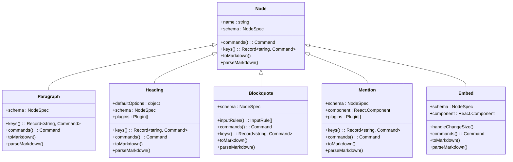
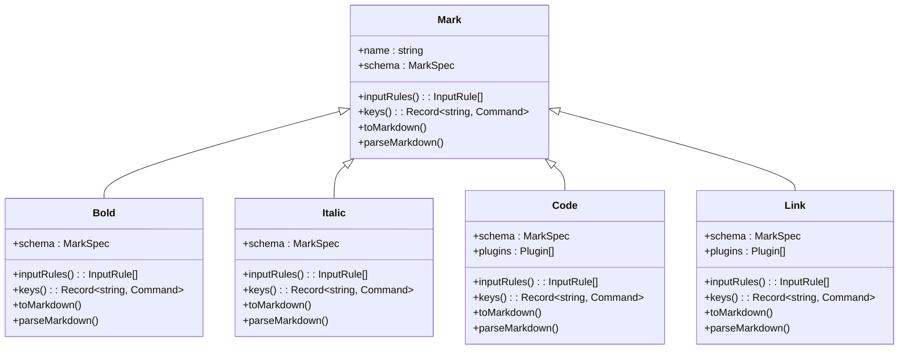
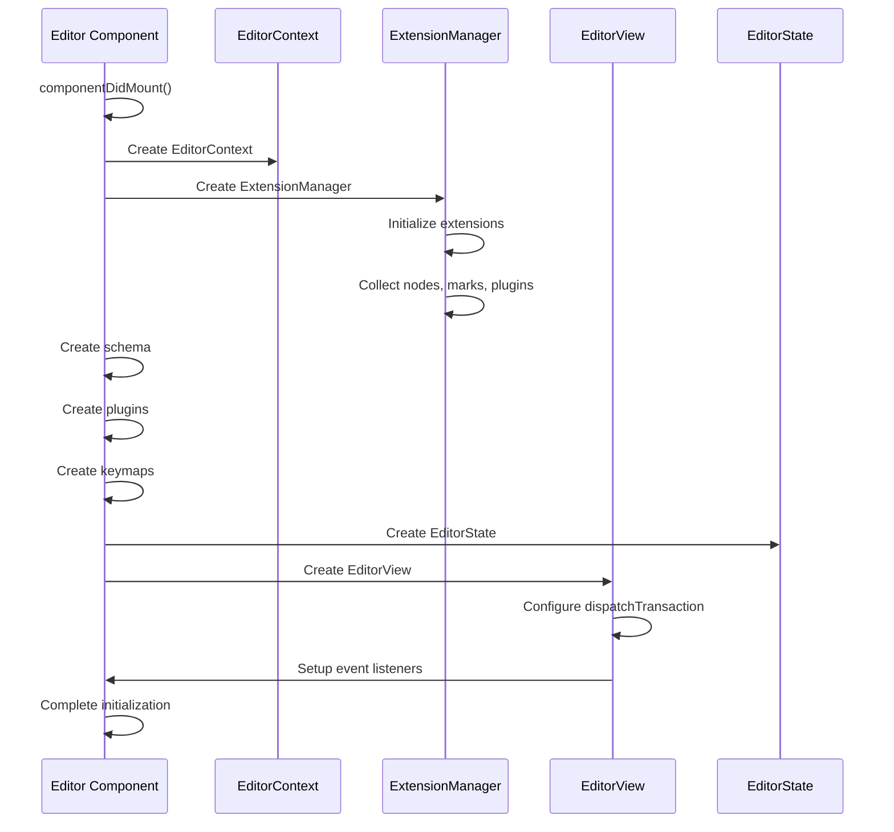

# Prosemirror Integration

<cite>
**Referenced Files in This Document**   
- [Paragraph.ts](file://shared/editor/nodes/Paragraph.ts)
- [Heading.ts](file://shared/editor/nodes/Heading.ts)
- [Blockquote.ts](file://shared/editor/nodes/Blockquote.ts)
- [Mention.tsx](file://shared/editor/nodes/Mention.tsx)
- [Embed.tsx](file://shared/editor/nodes/Embed.tsx)
- [Bold.ts](file://shared/editor/marks/Bold.ts)
- [Italic.ts](file://shared/editor/marks/Italic.ts)
- [Code.ts](file://shared/editor/marks/Code.ts)
- [Link.tsx](file://shared/editor/marks/Link.tsx)
- [findParentNode.ts](file://shared/editor/queries/findParentNode.ts)
- [getMarkRange.ts](file://shared/editor/queries/getMarkRange.ts)
- [isMarkActive.ts](file://shared/editor/queries/isMarkActive.ts)
- [EditorContext.tsx](file://app/editor/components/EditorContext.tsx)
- [index.tsx](file://app/editor/index.tsx)
</cite>

## Table of Contents
1. [Introduction](#introduction)
2. [Core Node Implementations](#core-node-implementations)
3. [Mark Implementations](#mark-implementations)
4. [Query Utilities](#query-utilities)
5. [Editor Context and Initialization](#editor-context-and-initialization)
6. [Extending the Prosemirror Schema](#extending-the-prosemirror-schema)
7. [Performance Considerations](#performance-considerations)
8. [Troubleshooting Common Issues](#troubleshooting-common-issues)

## Introduction
The baozi editor leverages Prosemirror as its foundational framework for rich text editing, providing a robust and extensible document model based on nodes and marks. This architecture enables structured content representation and manipulation, supporting both basic text formatting and complex document structures. The implementation follows a modular design pattern where core functionality is encapsulated in specialized classes that extend base Node and Mark components. This approach facilitates maintainability and extensibility while ensuring consistent behavior across different content types. The editor's architecture integrates seamlessly with React components, allowing for rich interactive experiences within the document.

**Section sources**
- [Paragraph.ts](file://shared/editor/nodes/Paragraph.ts#L1-L68)
- [Heading.ts](file://shared/editor/nodes/Heading.ts#L1-L251)
- [Blockquote.ts](file://shared/editor/nodes/Blockquote.ts#L1-L60)

## Core Node Implementations

The baozi editor implements a comprehensive set of node types that form the building blocks of document content. Each node type extends the base Node class and defines its specific behavior through schema definitions, commands, and rendering logic. The Paragraph node serves as the fundamental text container, supporting inline content and implementing specialized behavior for empty paragraphs by rendering them as hard breaks to preserve newline integrity between sessions. This ensures consistent document appearance across reloads, adhering to the editor's persistence requirements.

The Heading node provides hierarchical document structure with support for multiple levels (1-4) and additional features like collapsible sections and anchor links. It implements sophisticated keyboard handling for seamless navigation between heading levels and supports both input rules and key bindings for efficient content creation. The node includes built-in functionality for copying heading links, enhancing document navigation and sharing capabilities. Blockquote nodes enable quoted content presentation with dedicated styling and keyboard shortcuts for quick application.

Custom nodes like Mention and Embed extend the editor's functionality to support rich interactive content. The Mention node facilitates user, document, and collection references with type-specific rendering and navigation behavior. It ensures unique identification through UUID generation and supports various mention types including users, groups, documents, collections, issues, pull requests, and URLs. The Embed node enables integration of external content through iframe rendering or fallback link presentation, supporting a wide range of embeddable services.



**Diagram sources **
- [Paragraph.ts](file://shared/editor/nodes/Paragraph.ts#L1-L68)
- [Heading.ts](file://shared/editor/nodes/Heading.ts#L1-L251)
- [Blockquote.ts](file://shared/editor/nodes/Blockquote.ts#L1-L60)
- [Mention.tsx](file://shared/editor/nodes/Mention.tsx#L1-L354)
- [Embed.tsx](file://shared/editor/nodes/Embed.tsx#L1-L163)

**Section sources**
- [Paragraph.ts](file://shared/editor/nodes/Paragraph.ts#L1-L68)
- [Heading.ts](file://shared/editor/nodes/Heading.ts#L1-L251)
- [Blockquote.ts](file://shared/editor/nodes/Blockquote.ts#L1-L60)
- [Mention.tsx](file://shared/editor/nodes/Mention.tsx#L1-L354)
- [Embed.tsx](file://shared/editor/nodes/Embed.tsx#L1-L163)

## Mark Implementations

Text styling in the baozi editor is implemented through mark components that extend the base Mark class. These marks provide visual formatting while maintaining the semantic structure of the document. The Bold mark supports multiple input methods including keyboard shortcuts (Mod-b, Mod-B), markdown syntax (**text**), and DOM parsing from various HTML elements (b, strong) and CSS styles (font-weight). It includes sophisticated parsing logic to handle edge cases like Google Docs' normal-weight bold text, ensuring accurate content representation during paste operations.

The Italic mark follows a similar pattern with support for both underscore (_) and asterisk (*) markdown syntax, providing flexibility in content creation. Keyboard shortcuts (Mod-i, Mod-I) enable quick application, while comprehensive DOM parsing handles various HTML representations (i, em) and CSS styles. The Code mark implements inline code formatting with specialized behavior for backtick handling, including automatic wrapping of text between backticks and triple-click selection of entire code segments. It integrates with codemark plugins to enhance cursor behavior within code blocks.

The Link mark provides comprehensive hyperlink functionality with support for both markdown syntax and direct DOM parsing. It implements sophisticated click handling that differentiates between editing and read-only contexts, ensuring appropriate behavior in each mode. The mark includes automatic URL detection during typing, converting plain text URLs into clickable links without requiring manual formatting. It also supports title attributes and implements security best practices through noreferrer and nofollow rel attributes.



**Diagram sources **
- [Bold.ts](file://shared/editor/marks/Bold.ts#L1-L59)
- [Italic.ts](file://shared/editor/marks/Italic.ts#L1-L54)
- [Code.ts](file://shared/editor/marks/Code.ts#L1-L235)
- [Link.tsx](file://shared/editor/marks/Link.tsx#L1-L360)

**Section sources**
- [Bold.ts](file://shared/editor/marks/Bold.ts#L1-L59)
- [Italic.ts](file://shared/editor/marks/Italic.ts#L1-L54)
- [Code.ts](file://shared/editor/marks/Code.ts#L1-L235)
- [Link.tsx](file://shared/editor/marks/Link.tsx#L1-L360)

## Query Utilities

The baozi editor provides a comprehensive set of query utilities that enable efficient document content analysis and manipulation. These utilities are implemented as standalone functions that operate on Prosemirror's document model, providing reusable functionality across different components. The findParentNode utility locates the closest parent node matching a specified predicate, enabling context-aware operations based on document structure. This is particularly useful for determining the current editing context, such as identifying list items or blockquotes.

The getMarkRange function determines the boundaries of a specific mark within the document, returning precise position information that enables targeted operations. This utility is essential for implementing features like mark toggling and range-based formatting. The isMarkActive query checks whether a specific mark is active in the current selection, supporting both exact and inclusive matching modes. This flexibility allows for sophisticated UI state management, such as toolbar button highlighting.

Additional query utilities include findChildren for locating child nodes matching specific criteria, getCurrentBlock for identifying the current text block, and various context detection functions like isInCode and isInHeading. These utilities form the foundation for many editor features, including keyboard navigation, context menus, and formatting tools. They are designed to be composable and efficient, minimizing document traversal while providing accurate results.

```mermaid
classDiagram
class QueryUtilities {
+findParentNode(predicate) : Function
+findParentNodeClosestToPos($pos, predicate) : ContentNodeWithPos
+getMarkRange($pos, type) : MarkRange
+getMarksBetween(from, to, state) : Mark[]
+isMarkActive(type, attrs, options) : Function
+isNodeActive(type, attrs, options) : Function
+findChildren(node, predicate, descend) : ProsemirrorNode[]
+getCurrentBlock($pos) : ContentNodeWithPos
}
QueryUtilities : ContentNodeWithPos {
pos : number
start : number
depth : number
node : Node
}
QueryUtilities : MarkRange {
from : number
to : number
mark : Mark
}
```

**Diagram sources **
- [findParentNode.ts](file://shared/editor/queries/findParentNode.ts#L1-L45)
- [getMarkRange.ts](file://shared/editor/queries/getMarkRange.ts#L1-L41)
- [isMarkActive.ts](file://shared/editor/queries/isMarkActive.ts#L1-L52)

**Section sources**
- [findParentNode.ts](file://shared/editor/queries/findParentNode.ts#L1-L45)
- [getMarkRange.ts](file://shared/editor/queries/getMarkRange.ts#L1-L41)
- [isMarkActive.ts](file://shared/editor/queries/isMarkActive.ts#L1-L52)

## Editor Context and Initialization

The editor context and initialization process in the baozi editor follows a structured approach that ensures proper setup and integration with the React component lifecycle. The EditorContext provides a React context for accessing the editor instance throughout the component tree, enabling child components to interact with the editor without prop drilling. This context is implemented using React's createContext and useContext hooks, following modern React patterns for state management.

The initialization process begins in the componentDidMount lifecycle method, where the editor creates its core components including the schema, plugins, and view. The ExtensionManager orchestrates the integration of various editor extensions, handling the composition of nodes, marks, commands, and plugins. The editor's state is created with a comprehensive plugin configuration that includes keymaps, input rules, and specialized plugins for features like drop cursors and gap cursors.

During initialization, the editor processes both the initial content and any provided value prop, supporting both markdown strings and Prosemirror JSON objects as input formats. The view is configured with appropriate event handlers for focus, blur, and transaction dispatching, ensuring proper integration with the surrounding application. The editor also sets up mutation observers for anchor scrolling and theme change listeners for dynamic styling updates.



**Diagram sources **
- [EditorContext.tsx](file://app/editor/components/EditorContext.tsx#L1-L9)
- [index.tsx](file://app/editor/index.tsx#L1-L800)

**Section sources**
- [EditorContext.tsx](file://app/editor/components/EditorContext.tsx#L1-L9)
- [index.tsx](file://app/editor/index.tsx#L1-L800)

## Extending the Prosemirror Schema

Extending the Prosemirror schema in the baozi editor follows a well-defined pattern that promotes consistency and maintainability. New node types are created by extending the base Node class and implementing the required properties and methods. The schema property defines the node's structure, including content model, attributes, and parsing rules. The name property specifies the node type identifier, which must be unique within the schema. Input rules and key bindings are defined through the inputRules and keys methods, enabling natural content creation workflows.

Custom marks follow a similar pattern, extending the Mark class and defining their schema, input rules, and keyboard shortcuts. The schema specifies parsing behavior from various sources including DOM elements, CSS styles, and markdown syntax. The toMarkdown method controls serialization output, ensuring consistent formatting across different export scenarios. Extensions can also provide additional functionality through plugins, which can modify editor behavior or add new features.

When creating new node types, developers should consider the content model, parsing requirements, and user interaction patterns. Block nodes typically have a content property specifying their child nodes, while inline nodes set the inline property to true. Attributes allow for storing additional data, with validation rules ensuring data integrity. The component property enables React component integration for custom rendering, while the plugins property supports advanced behavior through Prosemirror plugins.

## Performance Considerations

Performance optimization for large documents in the baozi editor focuses on efficient transaction handling and minimal re-renders. The editor implements batched updates to minimize the number of transactions, reducing the overhead of state changes and view updates. Transaction handling is optimized through careful selection of affected ranges, ensuring that only necessary portions of the document are processed. The editor also implements throttling for frequent operations like typing and formatting to prevent excessive transaction dispatching.

Memory usage is optimized through efficient data structures and garbage collection patterns. The editor avoids unnecessary object creation during transactions and ensures proper cleanup of temporary objects. For large documents, the editor implements virtualization techniques for rendering, only processing visible content and deferring non-essential operations. The extension system is designed to minimize initialization overhead, with lazy loading of non-essential components.

Transaction performance is further enhanced through selective event handling and optimized query operations. The editor caches frequently accessed information and minimizes document traversal during common operations. For collaborative editing scenarios, the editor implements operational transformation principles to ensure efficient conflict resolution and minimal network overhead. These performance considerations ensure smooth editing experiences even with complex, large-scale documents.

## Troubleshooting Common Issues

Common Prosemirror issues in the baozi editor typically fall into schema conflicts and transaction errors categories. Schema conflicts often occur when multiple extensions attempt to define nodes or marks with the same name, or when attribute definitions are inconsistent. These issues can be resolved by ensuring unique naming conventions and consistent attribute definitions across extensions. The ExtensionManager provides validation mechanisms to detect and report schema conflicts during initialization.

Transaction errors commonly arise from invalid document modifications or incorrect transaction sequencing. These can be mitigated by validating transaction operations before dispatching and implementing proper error handling around transaction calls. The editor's dispatchTransaction method includes comprehensive error checking and recovery mechanisms to handle invalid transactions gracefully. Debugging transaction issues often involves examining the transaction steps and their impact on the document structure.

Other common issues include problems with node views not updating correctly, which can be resolved by ensuring proper implementation of the update method and handling of editable state changes. Focus management issues can be addressed by implementing proper focus and blur handlers that coordinate between the editor view and React component lifecycle. Performance issues with large documents can be mitigated through optimized query operations and selective transaction handling.