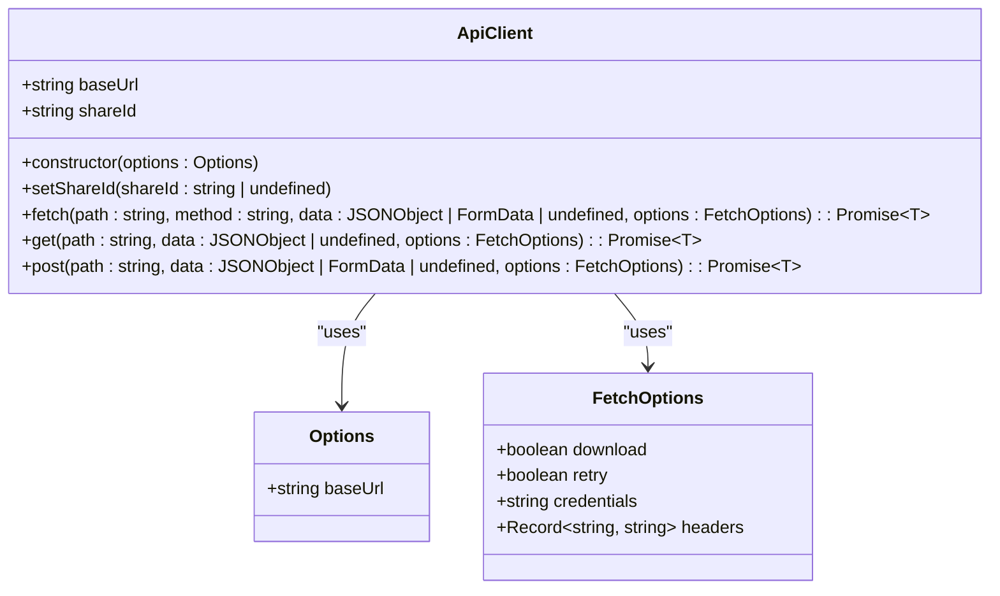
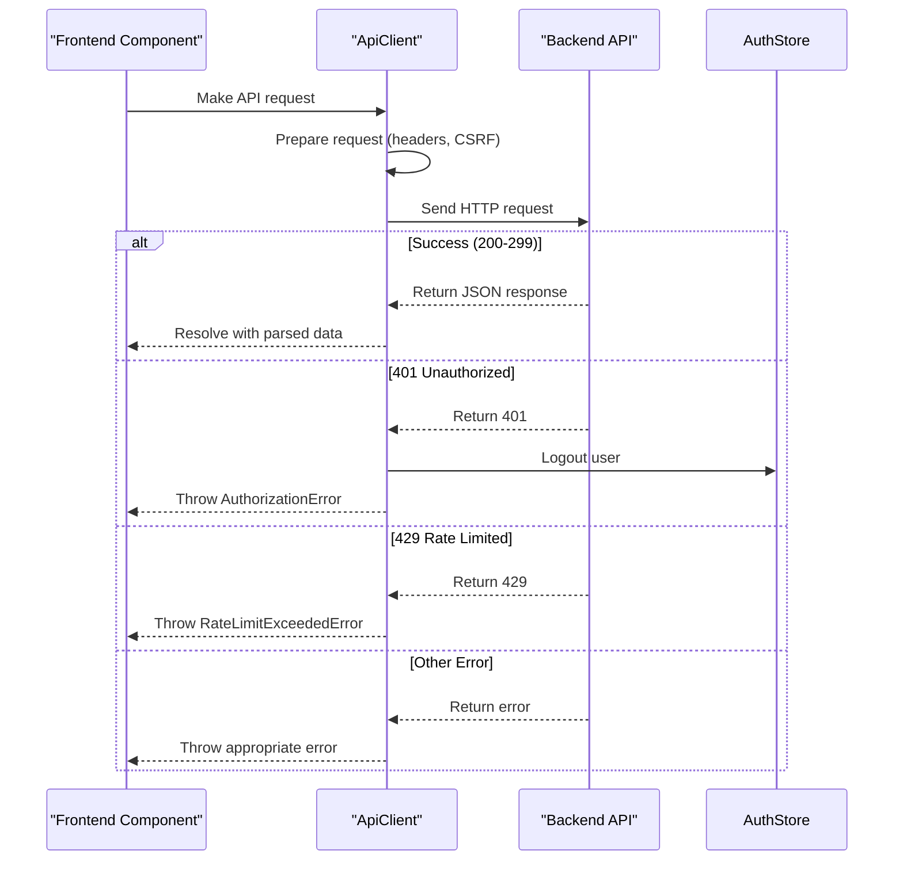
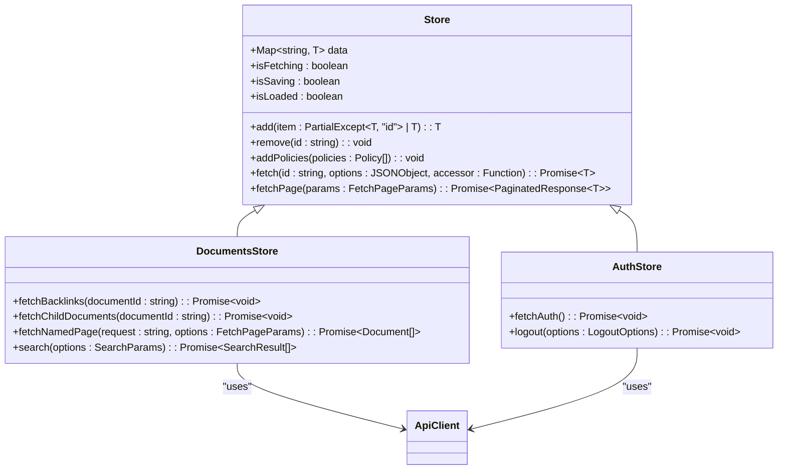
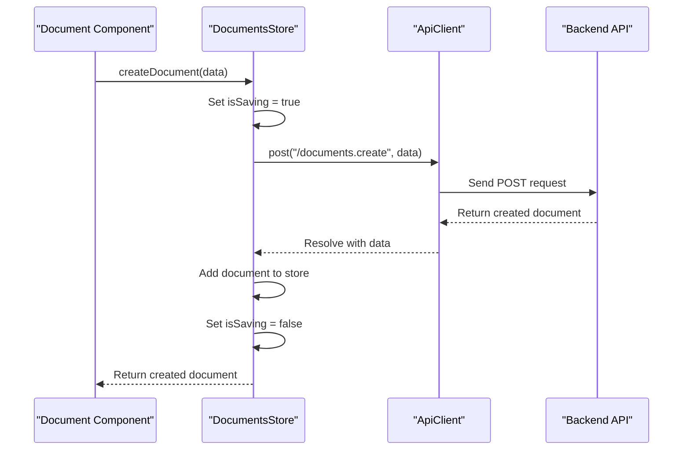

# API Clients

<cite>
**Referenced Files in This Document**   
- [ApiClient.ts](file://app/utils/ApiClient.ts)
- [DocumentsStore.ts](file://app/stores/DocumentsStore.ts)
- [AuthStore.ts](file://app/stores/AuthStore.ts)
</cite>

## Table of Contents
1. [Introduction](#introduction)
2. [ApiClient Implementation](#apiclient-implementation)
3. [Request Lifecycle and Interception](#request-lifecycle-and-interception)
4. [Error Handling and Authentication](#error-handling-and-authentication)
5. [Integration with State Management](#integration-with-state-management)
6. [Making API Calls from Stores](#making-api-calls-from-stores)
7. [Request Configuration and Options](#request-configuration-and-options)
8. [Common Issues and Troubleshooting](#common-issues-and-troubleshooting)
9. [Extending the ApiClient](#extending-the-apiclient)

## Introduction
The ApiClient utility in the baozi application serves as the central communication layer between the frontend and backend API endpoints. It provides a robust, type-safe interface for making HTTP requests with built-in support for authentication, error handling, request retry mechanisms, and seamless integration with the application's state management system. This document provides a comprehensive overview of the ApiClient implementation, its integration with stores, and best practices for making API calls within the application.

**Section sources**
- [ApiClient.ts](file://app/utils/ApiClient.ts#L1-L284)

## ApiClient Implementation
The ApiClient class is implemented as a singleton instance that handles all HTTP communication in the application. It is configured with a base URL of "/api" by default and provides methods for common HTTP operations such as GET and POST requests. The client automatically manages authentication tokens, CSRF protection, and request headers, ensuring secure and consistent communication with the backend.

The implementation uses the fetch API with retry capabilities through the fetch-retry library, providing resilience against transient network failures. It supports both JSON and FormData payloads, automatically setting the appropriate Content-Type headers based on the request data type. The client also handles file downloads by intercepting responses with the download option enabled and triggering browser downloads.

**Diagram sources**
- [ApiClient.ts](file://app/utils/ApiClient.ts#L39-L280)

**Section sources**
- [ApiClient.ts](file://app/utils/ApiClient.ts#L1-L284)

## Request Lifecycle and Interception
The ApiClient implements a comprehensive request lifecycle that includes request preparation, execution, and response handling. Before each request, the client processes the request data based on the HTTP method. For GET requests, query parameters are appended to the URL, while POST and PUT requests have their data stringified to JSON unless they are FormData objects.

The client automatically adds essential headers to every request, including Accept, cache-control, x-editor-version, and x-api-version. For mutating requests (POST, PUT, PATCH, DELETE), the client includes a CSRF token from cookies to prevent cross-site request forgery attacks. This token is only added when the request requires authentication and the user has the necessary permissions.

During request execution, the client measures performance timing and logs request details for debugging purposes. It handles different response types appropriately: successful responses with JSON content are parsed automatically, while 204 No Content responses return undefined. The client also supports file downloads by converting blob responses to downloadable files using the download utility.

**Section sources**
- [ApiClient.ts](file://app/utils/ApiClient.ts#L53-L170)

## Error Handling and Authentication
The ApiClient implements comprehensive error handling for various HTTP error scenarios. When a request fails, the client throws specific error types based on the HTTP status code, making it easier for calling code to handle different error conditions appropriately. Network errors and offline status are detected and handled separately from server-side errors.

Authentication is seamlessly integrated into the request flow. When a 401 Unauthorized response is received, the client automatically logs out the current user by calling the auth store's logout method, except when the request was made in the context of a shared document. This ensures users are redirected to the login page when their session expires.

The client also handles other authentication-related errors such as 403 Forbidden responses, which may indicate a suspended user account or CSRF token issues. In these cases, the client logs the user out and throws appropriate authorization errors. Rate limiting (429 Too Many Requests) is handled by throwing a RateLimitExceededError, while validation errors (422 Unprocessable Entity) result in UnprocessableEntityError exceptions.

**Diagram sources**
- [ApiClient.ts](file://app/utils/ApiClient.ts#L172-L267)

**Section sources**
- [ApiClient.ts](file://app/utils/ApiClient.ts#L171-L268)
- [AuthStore.ts](file://app/stores/AuthStore.ts#L298-L350)

## Integration with State Management
The ApiClient is tightly integrated with the application's state management system through MobX stores. When API responses contain data and policies, the calling store methods automatically update the local state by adding the received data to the store and processing any associated policies. This ensures that the UI remains synchronized with the server state without requiring additional manual state updates.

The integration pattern follows a consistent approach across all stores: API calls are made using the shared client instance, and upon successful response, the store's add method is called to update the local state. This pattern is implemented in the base Store class and inherited by all specific stores, ensuring consistency in state management across the application.

**Diagram sources**
- [DocumentsStore.ts](file://app/stores/DocumentsStore.ts#L47-L752)
- [AuthStore.ts](file://app/stores/AuthStore.ts#L37-L362)

**Section sources**
- [DocumentsStore.ts](file://app/stores/DocumentsStore.ts#L47-L752)
- [AuthStore.ts](file://app/stores/AuthStore.ts#L37-L362)

## Making API Calls from Stores
Stores in the application use the ApiClient to perform CRUD operations on models by implementing specific methods that encapsulate the API interaction logic. For example, the DocumentsStore provides methods for creating, updating, and deleting documents, as well as searching and fetching document data.

When making a POST request to create a document, the store calls the client's post method with the appropriate endpoint and data payload. Upon success, the response data is automatically added to the store's data collection, ensuring the UI reflects the updated state. Similarly, GET requests for fetching document data are handled by the fetch method, which retrieves the data and updates the local store.

The integration between stores and the ApiClient follows a consistent pattern where API calls are wrapped in MobX actions to ensure proper state management. Error handling is typically delegated to the ApiClient, while success handling focuses on updating the local state with the received data.

**Diagram sources**
- [DocumentsStore.ts](file://app/stores/DocumentsStore.ts#L47-L752)

**Section sources**
- [DocumentsStore.ts](file://app/stores/DocumentsStore.ts#L47-L752)

## Request Configuration and Options
The ApiClient supports various configuration options to customize request behavior. These options include the ability to disable retry mechanisms, specify credentials mode, add custom headers, and enable file download handling. The options are passed as an optional parameter to the fetch, get, and post methods.

The retry functionality is enabled by default for all requests except those explicitly marked with retry: false. This provides resilience against transient network issues while allowing specific requests to bypass retry logic when appropriate. The credentials option controls how cookies are handled in cross-origin requests, with "same-origin" being the default setting.

Custom headers can be added to requests through the headers option, allowing for the inclusion of additional metadata or authentication tokens when needed. The download option enables file download functionality, automatically triggering a browser download when a successful response is received.

**Section sources**
- [ApiClient.ts](file://app/utils/ApiClient.ts#L31-L36)

## Common Issues and Troubleshooting
Several common issues may arise when working with the ApiClient, and understanding their causes and solutions is essential for effective troubleshooting. One common issue is handling 401 Unauthorized responses, which typically indicate an expired or invalid authentication token. The client automatically handles this by logging out the user, but developers should ensure their components respond appropriately to authorization errors.

Network failures and offline status are handled by the client, which throws specific NetworkError or OfflineError exceptions. Applications should catch these errors and provide appropriate user feedback, such as displaying an offline indicator or retry button. Rate limiting issues (429 Too Many Requests) should be handled by implementing exponential backoff strategies in calling code when appropriate.

Concurrent requests to the same resource may cause conflicts, particularly when multiple tabs or devices are used simultaneously. The application's state management system helps mitigate this by synchronizing state changes across tabs through localStorage events, but developers should still consider implementing optimistic updates and conflict resolution strategies when necessary.

**Section sources**
- [ApiClient.ts](file://app/utils/ApiClient.ts#L148-L153)
- [ApiClient.ts](file://app/utils/ApiClient.ts#L253-L258)

## Extending the ApiClient
While the ApiClient provides a comprehensive set of features for most use cases, there may be situations where additional functionality is needed. The client can be extended by adding new methods or modifying existing behavior through inheritance or composition. However, in most cases, it's recommended to implement additional functionality in specific stores rather than modifying the core client.

For custom API endpoints not covered by existing store methods, developers can create new methods in the appropriate store class that use the shared client instance. This maintains the separation of concerns and ensures that API interactions remain organized within their respective domain contexts. When implementing new functionality, it's important to follow the existing patterns for error handling, state management, and user feedback.

**Section sources**
- [ApiClient.ts](file://app/utils/ApiClient.ts#L270-L281)
- [DocumentsStore.ts](file://app/stores/DocumentsStore.ts#L47-L752)