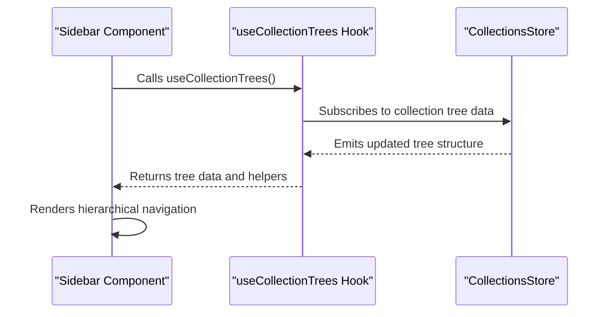
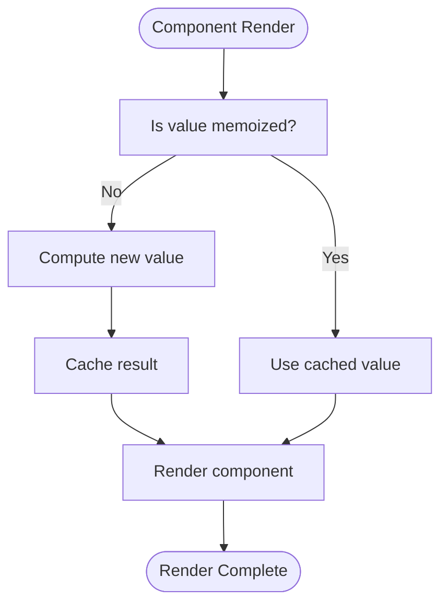

# Component Architecture

<cite>
**Referenced Files in This Document**   
- [Editor.tsx](file://app/components/Editor.tsx)
- [Sidebar.tsx](file://app/components/Sidebar/Sidebar.tsx)
- [CommandBar.tsx](file://app/components/CommandBar/CommandBar.tsx)
- [Theme.tsx](file://app/components/Theme.tsx)
- [useCommandBarActions.ts](file://app/hooks/useCommandBarActions.ts)
- [useBuildTheme.ts](file://app/hooks/useBuildTheme.ts)
- [Button.tsx](file://app/components/Button.tsx)
- [Input.tsx](file://app/components/Input.tsx)
- [Modal.tsx](file://app/components/Modal.tsx)
</cite>

## Table of Contents
1. [Component Organization](#component-organization)
2. [Primitive and Composite Components](#primitive-and-composite-components)
3. [Component Composition Patterns](#component-composition-patterns)
4. [React Hooks for Stateful Logic](#react-hooks-for-stateful-logic)
5. [Styling and Theme Integration](#styling-and-theme-integration)
6. [Accessibility and Responsive Design](#accessibility-and-responsive-design)
7. [Performance Optimization](#performance-optimization)
8. [Common Component Patterns](#common-component-patterns)

## Component Organization

The React component system in the baozi application is organized within the `app/components/` directory, structured by feature domains such as collections, documents, sharing, and navigation. This modular organization enables maintainability and scalability by grouping related UI elements. Key feature-based directories include `Collection/`, `Document/`, `Sharing/`, and `Sidebar/`, each encapsulating components specific to their domain. Additionally, primitive UI elements like `Button`, `Input`, and `Modal` are stored in the root of the components directory or within `primitives/`, promoting reuse across the application. This clear separation of concerns allows developers to locate and modify functionality efficiently.

**Section sources**
- [app/components/](file://app/components/)

## Primitive and Composite Components

The component library distinguishes between primitive and composite components. Primitive components such as `Button.tsx`, `Input.tsx`, and `Modal.tsx` serve as foundational building blocks with minimal internal logic, designed for broad reuse. These components are styled using Styled Components and accept standard props for accessibility and customization.

In contrast, composite components like `Sidebar` and `Editor` integrate multiple primitives and business logic to deliver complex functionality. The `Sidebar` component, located in `app/components/Sidebar/`, manages document hierarchy navigation through collapsible sections and drag-and-drop interactions. The `Editor` component (`app/components/Editor.tsx`) wraps a Prosemirror-based editor, providing rich text editing capabilities with support for embeddings, file uploads, and comment integration. These composites abstract complexity while exposing necessary configuration through props.

**Section sources**
- [app/components/Button.tsx](file://app/components/Button.tsx)
- [app/components/Input.tsx](file://app/components/Input.tsx)
- [app/components/Modal.tsx](file://app/components/Modal.tsx)
- [app/components/Editor.tsx](file://app/components/Editor.tsx)
- [app/components/Sidebar/Sidebar.tsx](file://app/components/Sidebar/Sidebar.tsx)

## Component Composition Patterns

The application employs several composition patterns to enhance flexibility and reusability. The `Sidebar` component uses a compound pattern, exposing subcomponents like `SidebarButton` and `ToggleButton` to allow structured customization. It also implements controlled behavior through MobX state management via the `ui` store, synchronizing its collapsed state across the application.

The `CommandBar` component demonstrates a render props-like pattern through React hooks, where `useCommandBarActions` dynamically registers actions based on context. This enables different parts of the app to contribute to the global command palette without direct coupling. Additionally, higher-order components such as `observer` from MobX React are used throughout to enable automatic re-rendering on state changes, reducing boilerplate and improving performance.

**Section sources**
- [app/components/CommandBar/CommandBar.tsx](file://app/components/CommandBar/CommandBar.tsx)
- [app/components/Sidebar/Sidebar.tsx](file://app/components/Sidebar/Sidebar.tsx)

## React Hooks for Stateful Logic

Custom React hooks encapsulate reusable stateful logic across components. The `useCommandBarActions` hook (`app/hooks/useCommandBarActions.ts`) integrates with the KBar command palette system, allowing components to register actions dynamically. It processes both legacy and v2 action formats, flattens them, and registers them with KBar, ensuring the command bar reflects current context.

Similarly, the `useBuildTheme` hook constructs a theme object based on user and team preferences, which is then provided via `styled-components` ThemeProvider. The `useCollectionTrees` hook manages the hierarchical state of collections in the sidebar, enabling efficient rendering of nested structures. These hooks promote separation of concerns by isolating logic from presentation, making components easier to test and maintain.

**Diagram sources**
- [app/hooks/useCollectionTrees.ts](file://app/hooks/useCollectionTrees.ts)
- [app/components/Sidebar/Sidebar.tsx](file://app/components/Sidebar/Sidebar.tsx)

**Section sources**
- [app/hooks/useCommandBarActions.ts](file://app/hooks/useCommandBarActions.ts)
- [app/hooks/useBuildTheme.ts](file://app/hooks/useBuildTheme.ts)

## Styling and Theme Integration

Styling is implemented using Styled Components, with a theme system centralized in `Theme.tsx`. The `Theme` component wraps the application, providing a theme object derived from `useBuildTheme` that includes color schemes, spacing, and typography. This theme is accessible to all styled components via the `useTheme` hook.

The theme supports both light and dark modes, with dynamic updates triggered by user preferences. Global styles are injected through `GlobalStyles`, ensuring consistent base styling. Component-specific styles are co-located with their implementation, using CSS-in-JS for dynamic styling based on props. Breakpoints from `styled-components-breakpoint` enable responsive design, with media queries defined inline for clarity.

**Section sources**
- [app/components/Theme.tsx](file://app/components/Theme.tsx)
- [app/hooks/useBuildTheme.ts](file://app/hooks/useBuildTheme.ts)

## Accessibility and Responsive Design

The component system prioritizes accessibility through semantic HTML, ARIA attributes, and keyboard navigation support. Components like `Sidebar` and `CommandBar` are fully navigable via keyboard, with focus management handled through React refs and event listeners. Screen reader accessibility is enhanced with dynamic `aria-label` attributes and live regions where appropriate.

Responsive design is achieved through a mobile-first approach, with conditional rendering based on screen size via the `useMobile` hook. The `Sidebar` collapses into a mobile drawer when needed, and layout adjustments are made using breakpoint utilities. Pointer event handling distinguishes between touch and mouse interactions, ensuring optimal UX across devices.

**Section sources**
- [app/components/Sidebar/Sidebar.tsx](file://app/components/Sidebar/Sidebar.tsx)
- [app/components/CommandBar/CommandBar.tsx](file://app/components/CommandBar/CommandBar.tsx)
- [app/hooks/useMobile.ts](file://app/hooks/useMobile.ts)

## Performance Optimization

Performance is optimized through several techniques. Memoization via `React.useMemo` and `React.useCallback` prevents unnecessary recalculations and re-renders, particularly in components like `Editor` that handle frequent state updates. The `Editor` component uses `lazyWithRetry` to lazy-load the Prosemirror editor bundle, reducing initial load time.

The `Sidebar` implements virtualization principles by only rendering visible collection and document nodes, with expandable sections that load children on demand. MobX observer pattern ensures components only re-render when their observed data changes, minimizing wasted renders. Additionally, event listeners are properly cleaned up in `useEffect` cleanup functions to prevent memory leaks.

**Diagram sources**
- [app/components/Editor.tsx](file://app/components/Editor.tsx)
- [app/components/Sidebar/Sidebar.tsx](file://app/components/Sidebar/Sidebar.tsx)

**Section sources**
- [app/components/Editor.tsx](file://app/components/Editor.tsx)
- [app/utils/lazyWithRetry.ts](file://app/utils/lazyWithRetry.ts)

## Common Component Patterns

The codebase employs several established React patterns. Controlled components are used throughout, with state managed in MobX stores and passed down via props. Uncontrolled components are limited to scenarios where internal state is acceptable, such as form inputs with immediate validation.

Render props are used sparingly, with hooks preferred for logic reuse. However, components like `NotificationsPopover` use render props to provide flexible content injection. Compound components are evident in the `Sidebar` structure, where `SidebarButton` and `ToggleButton` are tightly coupled to the parent `Sidebar` context. This pattern enables rich, structured UIs while maintaining a clean API surface.

**Section sources**
- [app/components/Sidebar/Sidebar.tsx](file://app/components/Sidebar/Sidebar.tsx)
- [app/components/Notifications/NotificationsPopover.tsx](file://app/components/Notifications/NotificationsPopover.tsx)
- [app/components/AccountMenu.tsx](file://app/components/AccountMenu.tsx)