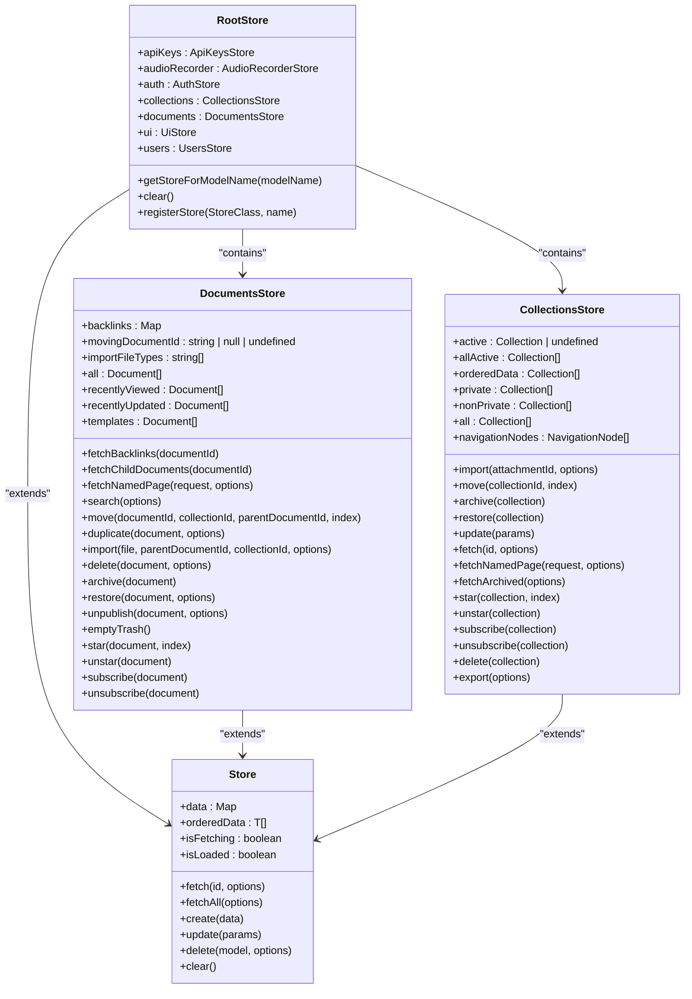
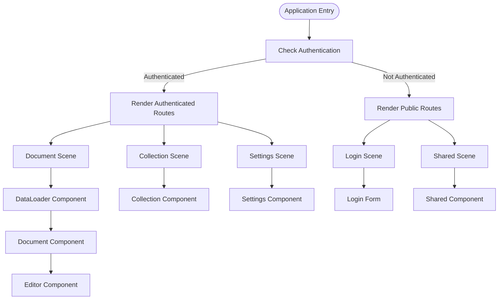
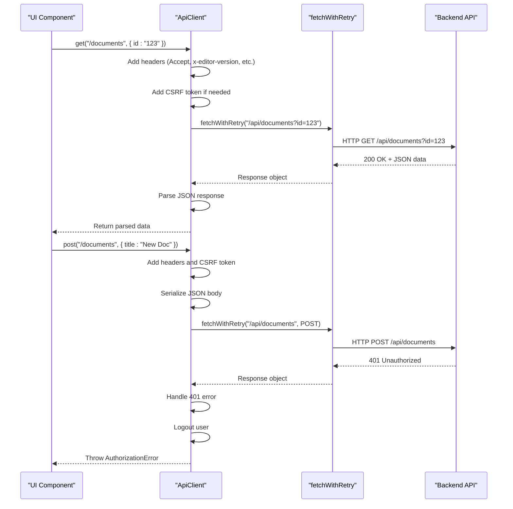
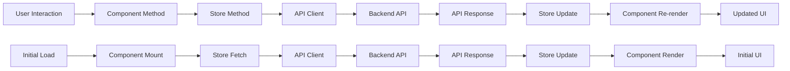

# Frontend Architecture

<cite>
**Referenced Files in This Document**   
- [ApiClient.ts](file://app/utils/ApiClient.ts)
- [RootStore.ts](file://app/stores/RootStore.ts)
- [index.ts](file://app/stores/index.ts)
- [DocumentsStore.ts](file://app/stores/DocumentsStore.ts)
- [CollectionsStore.ts](file://app/stores/CollectionsStore.ts)
- [index.tsx](file://app/routes/index.tsx)
- [authenticated.tsx](file://app/routes/authenticated.tsx)
- [Editor.tsx](file://app/components/Editor.tsx)
- [index.tsx](file://app/editor/index.tsx)
- [Document/index.tsx](file://app/scenes/Document/index.tsx)
</cite>

## Table of Contents
1. [Introduction](#introduction)
2. [Component-Based Architecture](#component-based-architecture)
3. [State Management with MobX](#state-management-with-mobx)
4. [Routing and Navigation System](#routing-and-navigation-system)
5. [API Client Implementation](#api-client-implementation)
6. [Editor Architecture](#editor-architecture)
7. [Data Flow Overview](#data-flow-overview)
8. [Common Patterns and Examples](#common-patterns-and-examples)
9. [Performance Optimization](#performance-optimization)
10. [Conclusion](#conclusion)

## Introduction
The baozi React application implements a modern frontend architecture built on React with a comprehensive ecosystem of reusable components, robust state management, and efficient data handling. This document provides a detailed overview of the application's frontend architecture, focusing on its component-based design, MobX-powered state management, React Router-based navigation, API client implementation, and the sophisticated Prosemirror-based editor system. The architecture is designed to support collaborative editing, real-time updates, and a rich user experience while maintaining code organization and scalability.

## Component-Based Architecture
The baozi application follows a component-based architecture with a rich ecosystem of UI components organized in the components/ directory. The application's component structure is organized into several categories including primitive components, complex UI elements, and specialized components for specific features. The architecture promotes reusability and consistency across the application through a well-defined component hierarchy and composition patterns.

The component system includes primitive components such as Button, Input, and Badge that serve as building blocks for more complex UI elements. These primitives are designed with consistent styling and behavior, ensuring a cohesive user experience. The application also features composite components like DocumentCard, CollectionBreadcrumb, and DocumentExplorer that combine multiple primitives to create feature-specific UI elements.

Specialized components are organized in dedicated directories such as Sharing/, Sidebar/, and CommandBar/, each containing components specific to their respective features. The architecture supports both functional and class-based components, with a preference for functional components with hooks for state management and side effects.

**Section sources**
- [app/components/](file://app/components/)
- [app/components/Editor.tsx](file://app/components/Editor.tsx)

## State Management with MobX
The baozi application implements a comprehensive state management system using MobX, with stores organized in the stores/ directory that manage application state and coordinate API calls. The state management architecture is centered around the RootStore, which serves as the container for all individual stores and provides a unified interface for accessing application state.

The RootStore initializes and registers all individual stores, including model stores like DocumentsStore, CollectionsStore, and UsersStore, as well as non-model stores like UiStore, DialogsStore, and AudioRecorderStore. Each store is responsible for managing the state of a specific domain, providing methods for fetching, updating, and manipulating data.



**Diagram sources **
- [RootStore.ts](file://app/stores/RootStore.ts)
- [DocumentsStore.ts](file://app/stores/DocumentsStore.ts)
- [CollectionsStore.ts](file://app/stores/CollectionsStore.ts)

**Section sources**
- [RootStore.ts](file://app/stores/RootStore.ts)
- [index.ts](file://app/stores/index.ts)
- [DocumentsStore.ts](file://app/stores/DocumentsStore.ts)
- [CollectionsStore.ts](file://app/stores/CollectionsStore.ts)

## Routing and Navigation System
The baozi application implements a routing and navigation system using React Router with routes defined in the routes/ directory and scenes representing major application views. The routing architecture is designed to handle both authenticated and unauthenticated user flows, with a clear separation between public and private routes.

The main routing configuration is defined in routes/index.tsx, which sets up the primary route structure for the application. The system uses React Router's Switch and Route components to define the application's navigation flow, with lazy loading implemented for improved performance. The routing system supports dynamic routes with parameters, such as document slugs and share IDs, allowing for deep linking and bookmarkable URLs.

Scenes, located in the scenes/ directory, represent major application views and are responsible for orchestrating the rendering of components and handling route-specific logic. Each scene typically corresponds to a specific page or view in the application, such as the Document scene, Collection scene, or Settings scene. Scenes often use data loaders to fetch required data before rendering, ensuring that components receive the necessary data to render correctly.



**Diagram sources **
- [index.tsx](file://app/routes/index.tsx)
- [authenticated.tsx](file://app/routes/authenticated.tsx)
- [Document/index.tsx](file://app/scenes/Document/index.tsx)

**Section sources**
- [index.tsx](file://app/routes/index.tsx)
- [authenticated.tsx](file://app/routes/authenticated.tsx)

## API Client Implementation
The baozi application implements a robust API client in utils/ApiClient.ts that handles communication with the backend. The API client is designed to abstract the complexities of HTTP requests, error handling, and authentication, providing a clean and consistent interface for making API calls throughout the application.

The ApiClient class encapsulates the logic for making HTTP requests, including GET, POST, PUT, and DELETE operations. It handles request serialization, response parsing, error handling, and authentication token management. The client automatically includes necessary headers such as CSRF tokens for mutating requests and handles common HTTP status codes with appropriate error types.

The API client implements retry logic for failed requests, improving reliability in unstable network conditions. It also supports file downloads by handling blob responses and triggering browser downloads. Error handling is comprehensive, with specific error types for different failure scenarios such as network errors, authorization errors, rate limiting, and validation errors.



**Diagram sources **
- [ApiClient.ts](file://app/utils/ApiClient.ts)

**Section sources**
- [ApiClient.ts](file://app/utils/ApiClient.ts)

## Editor Architecture
The baozi application features a sophisticated editor architecture built on Prosemirror, with extensions and collaborative editing features. The editor system is implemented in the editor/ directory and provides a rich text editing experience with support for collaborative editing, real-time updates, and a wide range of formatting options.

The editor is implemented as a React component that wraps the Prosemirror editor, providing a bridge between the React component model and the Prosemirror document model. The editor supports a plugin architecture through extensions, which can add new node types, marks, commands, and input rules. Extensions are organized in the editor/extensions/ directory and include features such as block menus, emoji support, find and replace, hover previews, and collaborative editing.

The editor architecture supports both markdown and Prosemirror JSON as input and output formats, allowing for seamless integration with the application's data model. It includes a comprehensive set of commands for manipulating the document, including formatting, insertion, deletion, and structural changes. The editor also supports custom node views, allowing for the rendering of complex content such as embedded media, code blocks, and interactive elements.

Collaborative editing is implemented through the Multiplayer extension, which handles real-time synchronization of document changes between multiple users. The extension integrates with the application's websocket system to receive and broadcast document updates, ensuring that all users see the same content in real-time.

```mermaid
classDiagram
class Editor {
+id : string
+userId : string
+value : string | ProsemirrorData
+defaultValue : string | object
+placeholder : string
+extensions : Extension[]
+autoFocus : boolean
+readOnly : boolean
+canUpdate : boolean
+canComment : boolean
+dictionary : Dictionary
+dir : "rtl" | "ltr"
+grow : boolean
+template : boolean
+maxLength : number
+scrollTo : string
+uploadFile : (file : File) => Promise<string>
+onInit : () => void
+onDestroy : () => void
+onBlur : () => void
+onFocus : () => void
+onSave : (options : { done : boolean }) => void
+onCancel : () => void
+onChange : (value : () => any) => void
+onClickCommentMark : (commentId : string) => void
+onCreateCommentMark : (commentId : string, userId : string) => void
+onDeleteCommentMark : (commentId : string) => void
+onFileUploadStart : () => void
+onFileUploadStop : () => void
+onCreateLink : (params : Properties<Document>) => Promise<string>
+onClickLink : (href : string, event) => void
+onKeyDown : (event : React.KeyboardEvent<HTMLDivElement>) => void
+embeds : EmbedDescriptor[]
+userPreferences : UserPreferences | null
+embedsDisabled : boolean
+className : string
+style : React.CSSProperties
+editorStyle : React.CSSProperties
+componentDidMount()
+componentDidUpdate(prevProps)
+componentWillUnmount()
+init()
+createExtensions()
+createPlugins()
+createRulePlugins()
+createKeymaps()
+createInputRules()
+createNodeViews()
+createCommands()
+createWidgets()
+createNodes()
+createMarks()
+createSchema()
+createSerializer()
+createParser()
+createPasteParser()
+createView()
+scrollToAnchor(hash)
+value(asString, trim)
+calculateDir()
+focusAtStart()
+focusAtEnd()
+focus()
+blur()
+insertFiles(event, files)
+isEmpty()
+getHeadings()
+getImages()
+getLightboxImages()
+getTasks()
+getComments()
+removeComment(commentId)
+updateComment(commentId, attrs)
+updateActiveLightboxImage(activeImage)
+getPlainText()
}
class ExtensionManager {
+extensions : Extension[]
+plugins : Plugin[]
+rulePlugins : PluginSimple[]
+keymaps : Plugin[]
+inputRules : InputRule[]
+widgets : { [name : string] : (props : WidgetProps) => React.ReactElement }
+nodes : { [name : string] : NodeSpec }
+marks : { [name : string] : MarkSpec }
+commands : Record<string, CommandFactory>
+serializer : MarkdownSerializer
+parser : MarkdownParser
+constructor(extensions, editor)
+plugins()
+rulePlugins()
+keymaps(options)
+inputRules(options)
+widgets()
+nodes()
+marks()
+serializer()
+parser(options)
}
class Extension {
+name : string
+component : React.ComponentType<any>
+nodes : NodeSpec[]
+marks : MarkSpec[]
+plugins : Plugin[]
+rulePlugins : PluginSimple[]
+keymaps : Plugin[]
+inputRules : InputRule[]
+widgets : { [name : string] : (props : WidgetProps) => React.ReactElement }
+commands : Record<string, CommandFactory>
+serializer : (nodes, marks) => MarkdownSerializer
+parser : (schema, plugins, rules) => MarkdownParser
+options : Record<string, any>
}
Editor --> ExtensionManager : "uses"
ExtensionManager --> Extension : "contains"
Extension --> Node : "extends"
Extension --> Mark : "extends"
Extension --> ReactNode : "extends"
```

**Diagram sources **
- [index.tsx](file://app/editor/index.tsx)
- [Editor.tsx](file://app/components/Editor.tsx)

**Section sources**
- [index.tsx](file://app/editor/index.tsx)
- [Editor.tsx](file://app/components/Editor.tsx)

## Data Flow Overview
The baozi application follows a unidirectional data flow pattern, where data moves from the API through stores to components in a predictable and traceable manner. The data flow begins with API calls made by components or stores, which retrieve data from the backend and store it in the appropriate MobX store. Components then subscribe to the store data they need, automatically re-rendering when the data changes.

When a user interacts with the application, the flow reverses: user actions trigger methods in components, which call methods in stores to update the local state and make API calls to persist changes to the backend. The stores then update their state based on the API response, triggering re-renders in subscribed components.

This pattern ensures that the application state is centralized in the stores, making it easier to debug and maintain. It also enables features like optimistic updates, where the UI is updated immediately based on the expected outcome of an operation, with the actual API response used to confirm or revert the change.



**Diagram sources **
- [ApiClient.ts](file://app/utils/ApiClient.ts)
- [RootStore.ts](file://app/stores/RootStore.ts)
- [DocumentsStore.ts](file://app/stores/DocumentsStore.ts)

## Common Patterns and Examples
The baozi application implements several common patterns for handling forms, data loading, and user interactions. These patterns are designed to be reusable and consistent across the application, promoting maintainability and developer productivity.

For form handling, the application typically uses controlled components with state managed in the component or a store. Form validation is implemented using a combination of client-side validation and server-side validation, with error messages displayed to the user. The application also supports asynchronous form submission, with loading states and error handling.

Data loading patterns include the use of data loaders in scenes to fetch required data before rendering, ensuring that components receive the necessary data to render correctly. The application also implements lazy loading for non-critical data and components, improving initial load performance.

User interaction patterns include the use of event handlers for common actions such as clicks, key presses, and form submissions. The application also implements debouncing and throttling for expensive operations, improving performance and responsiveness.

```mermaid
flowchart TD
A[Form Handling] --> B[Controlled Components]
A --> C[State Management]
A --> D[Validation]
A --> E[Async Submission]
A --> F[Loading States]
A --> G[Error Handling]
H[Data Loading] --> I[Data Loaders]
H --> J[Scene-level Fetching]
H --> K[Lazy Loading]
H --> L[Error Boundaries]
H --> M[Loading Indicators]
N[User Interactions] --> O[Event Handlers]
N --> P[Debouncing]
N --> Q[Throttling]
N --> R[Optimistic Updates]
N --> S[Undo/Redo]
N --> T[Keyboard Shortcuts]
```



**Diagram sources **
- [Document/index.tsx](file://app/scenes/Document/index.tsx)
- [Editor.tsx](file://app/components/Editor.tsx)

## Performance Optimization
The baozi application implements several performance optimization techniques to ensure a smooth and responsive user experience. These optimizations include code splitting, lazy loading, memoization, and efficient state management.

Code splitting is implemented using dynamic imports and React's lazy function, allowing the application to load only the code needed for the current view. This reduces initial load time and improves perceived performance.

Lazy loading is used for non-critical components and data, ensuring that resources are only loaded when needed. This includes lazy loading of the editor component, which is only loaded when a user opens a document for editing.

Memoization is implemented using React's useMemo and useCallback hooks, as well as MobX's computed properties, to avoid unnecessary recalculations and re-renders. This is particularly important for complex components and calculations that depend on large datasets.

The application also implements efficient state management practices, such as using MobX's observable and computed properties to minimize re-renders and ensure that components only update when their specific data dependencies change.

## Conclusion
The baozi React application implements a robust and scalable frontend architecture that combines React's component model with MobX's reactive state management, React Router's navigation system, and a sophisticated Prosemirror-based editor. The architecture is designed to support collaborative editing, real-time updates, and a rich user experience while maintaining code organization and scalability. By following established patterns for component design, state management, routing, and data handling, the application provides a solid foundation for future development and feature expansion.