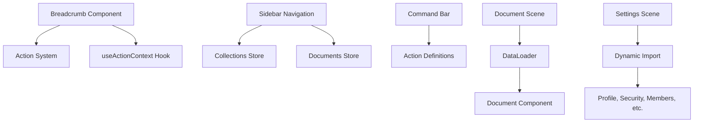

# Routing & Navigation

<cite>
**Referenced Files in This Document**   
- [routes/index.tsx](file://app/routes/index.tsx)
- [routes/authenticated.tsx](file://app/routes/authenticated.tsx)
- [scenes/Document/index.tsx](file://app/scenes/Document/index.tsx)
- [scenes/Settings/Profile.tsx](file://app/scenes/Settings/Profile.tsx)
- [components/Breadcrumb.tsx](file://app/components/Breadcrumb.tsx)
</cite>

## Table of Contents
1. [Routing Configuration](#routing-configuration)
2. [Scene-Based Architecture](#scene-based-architecture)
3. [Navigation Patterns](#navigation-patterns)
4. [Integration with State Management](#integration-with-state-management)
5. [Navigation Components](#navigation-components)
6. [Authentication-Aware Routing](#authentication-aware-routing)

## Routing Configuration

The routing configuration in `routes/index.tsx` defines the application's URL structure and route hierarchy using React Router. The configuration is split into authenticated and unauthenticated routes, with the root component determining which set of routes to render based on the presence of `ROOT_SHARE_ID`. For authenticated users, the `AuthenticatedRoutes` component in `authenticated.tsx` handles the main application routes, including document, collection, search, and settings paths. The routing system uses lazy loading for performance optimization and includes redirects for legacy URL patterns. Route parameters are extracted using helper functions from `routeHelpers.ts`, such as `matchDocumentSlug`, which enables dynamic document routing based on URL slugs.

**Section sources**
- [routes/index.tsx](file://app/routes/index.tsx#L1-L71)
- [routes/authenticated.tsx](file://app/routes/authenticated.tsx#L1-L122)

## Scene-Based Architecture

The baozi application implements a scene-based architecture where major views are organized as scenes in the `scenes/` directory. Each scene represents a distinct application view with its own components and logic. The Document scene handles document viewing and editing, while the Settings scene manages user and team preferences. Scenes are lazily loaded to improve initial load performance. The Document scene, for example, uses a DataLoader component to fetch document data before rendering the Document component, ensuring data is available before display. The Settings scene is divided into multiple sub-scenes (Profile, Security, Members, etc.) that are dynamically loaded based on the route parameter.

**Section sources**
- [scenes/Document/index.tsx](file://app/scenes/Document/index.tsx#L1-L77)
- [scenes/Settings/Profile.tsx](file://app/scenes/Settings/Profile.tsx#L1-L118)

## Navigation Patterns

The application implements multiple navigation patterns using React Router's Link component for declarative navigation and programmatic navigation through useHistory. The Document scene uses useHistory to track the last visited path and manage sidebar context state. Navigation between documents preserves context by passing state through the location object. The routing system supports complex URL patterns with optional parameters, such as revisionId in document history views. Redirects are used extensively to maintain URL consistency and handle legacy routes. The application also implements deep linking for shared documents, allowing direct access to specific content through shareable URLs.

**Section sources**
- [scenes/Document/index.tsx](file://app/scenes/Document/index.tsx#L2-L28)
- [routes/authenticated.tsx](file://app/routes/authenticated.tsx#L78-L102)

## Integration with State Management

Routing is tightly integrated with the application's state management system, which uses MobX for reactive state updates. The Document scene loads data based on route parameters by passing match, history, and location props to the DataLoader component. The Settings scene uses route parameters to determine which settings panel to display, with the settingsPath helper function generating appropriate URLs. The useCurrentTeam and usePolicy hooks in `authenticated.tsx` ensure that route accessibility is determined by the user's permissions and team context. The application also uses location state to pass additional context between routes, such as sidebar context preferences.

**Section sources**
- [routes/authenticated.tsx](file://app/routes/authenticated.tsx#L11-L12)
- [scenes/Document/index.tsx](file://app/scenes/Document/index.tsx#L5-L6)

## Navigation Components

The application implements several navigation components to provide multiple pathways through the interface. The Breadcrumb component displays hierarchical navigation with support for dynamic action menus and truncation when too many items would overflow. Sidebar navigation provides primary access to collections and documents, while the command bar offers quick access to common actions. The Breadcrumb component uses action definitions from the actions system to generate navigable items, allowing for context-sensitive navigation based on user permissions and application state. These components work together to create a cohesive navigation experience across different views.

**Diagram sources**
- [components/Breadcrumb.tsx](file://app/components/Breadcrumb.tsx#L1-L128)
- [scenes/Document/index.tsx](file://app/scenes/Document/index.tsx#L1-L77)
- [scenes/Settings/Profile.tsx](file://app/scenes/Settings/Profile.tsx#L1-L118)

**Section sources**
- [components/Breadcrumb.tsx](file://app/components/Breadcrumb.tsx#L1-L128)

## Authentication-Aware Routing

The routing system implements authentication-aware navigation that redirects unauthenticated users and handles protected routes. The root Routes component in `index.tsx` conditionally renders either the login flow or the authenticated routes based on the user's authentication state. The Authenticated component wraps the main application routes, ensuring only authenticated users can access them. Unauthenticated users are redirected to the login page, while authenticated users are directed to the appropriate application view. The system also handles special cases like shared document access, where users can view specific content without full authentication. Protected routes are enforced through the usePolicy hook, which checks user permissions before rendering sensitive content.

**Section sources**
- [routes/index.tsx](file://app/routes/index.tsx#L30-L67)
- [routes/authenticated.tsx](file://app/routes/authenticated.tsx#L53-L122)