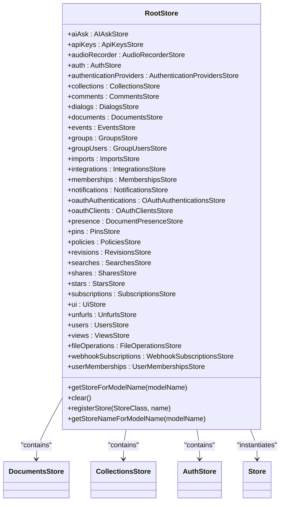
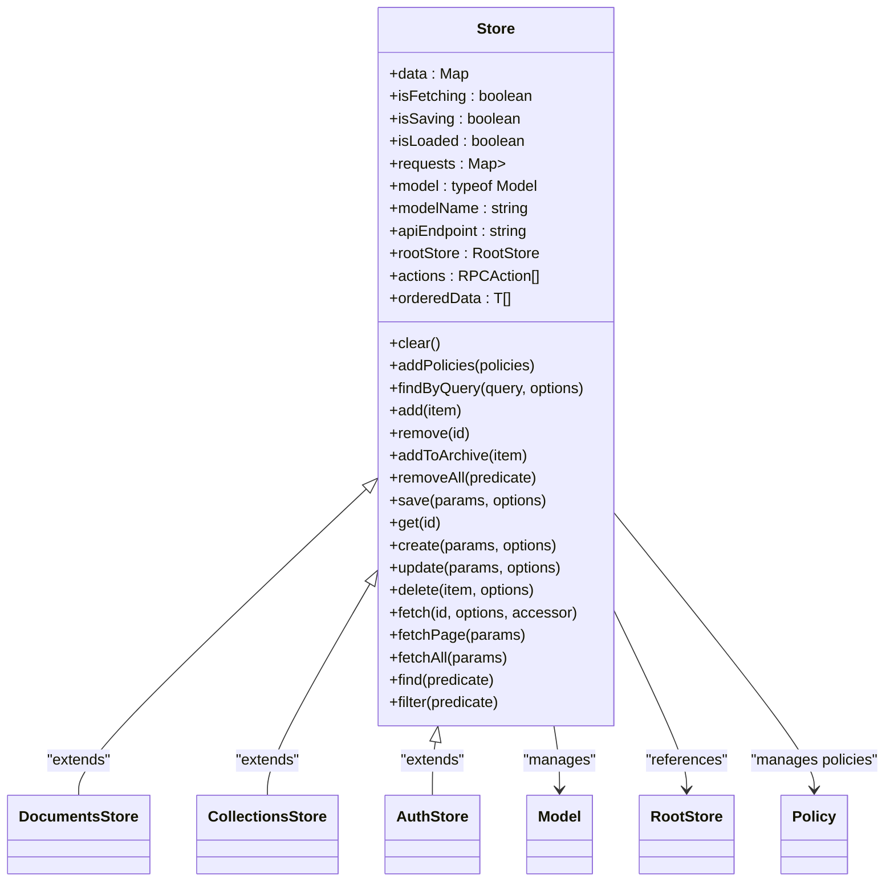
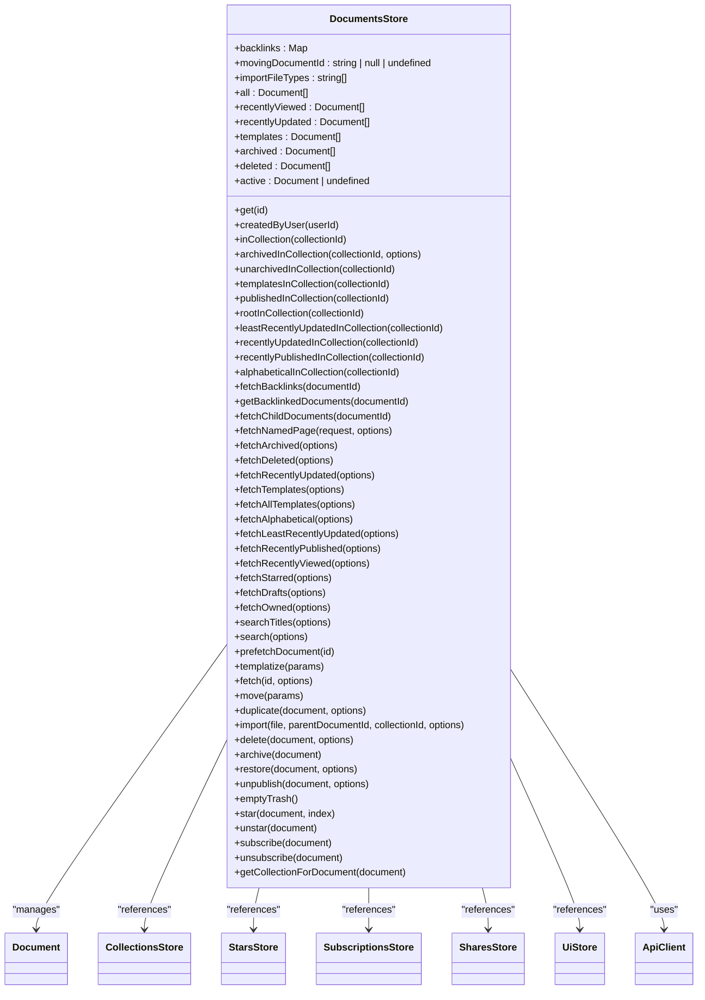
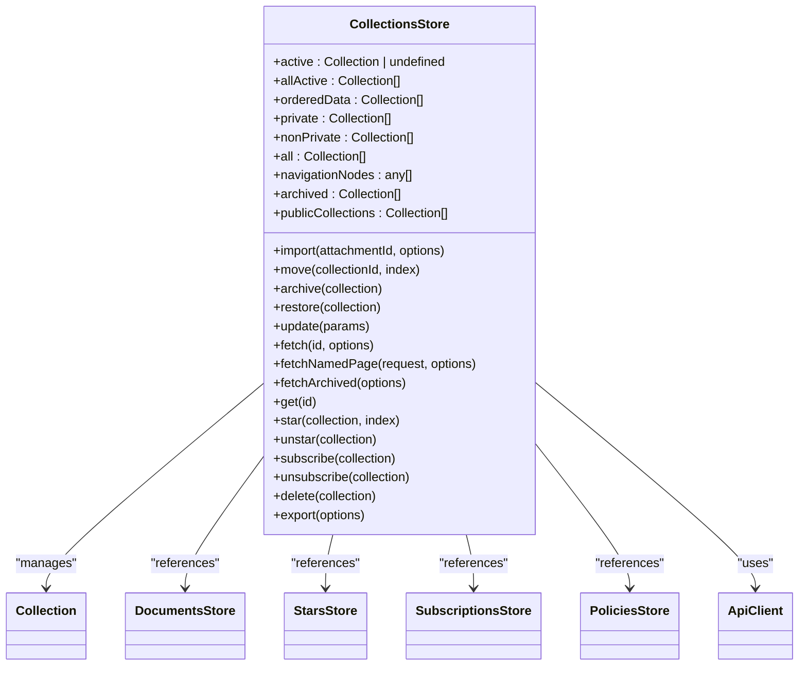
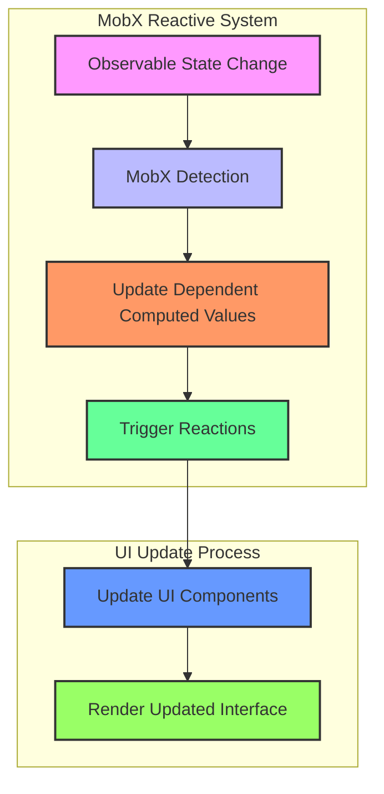
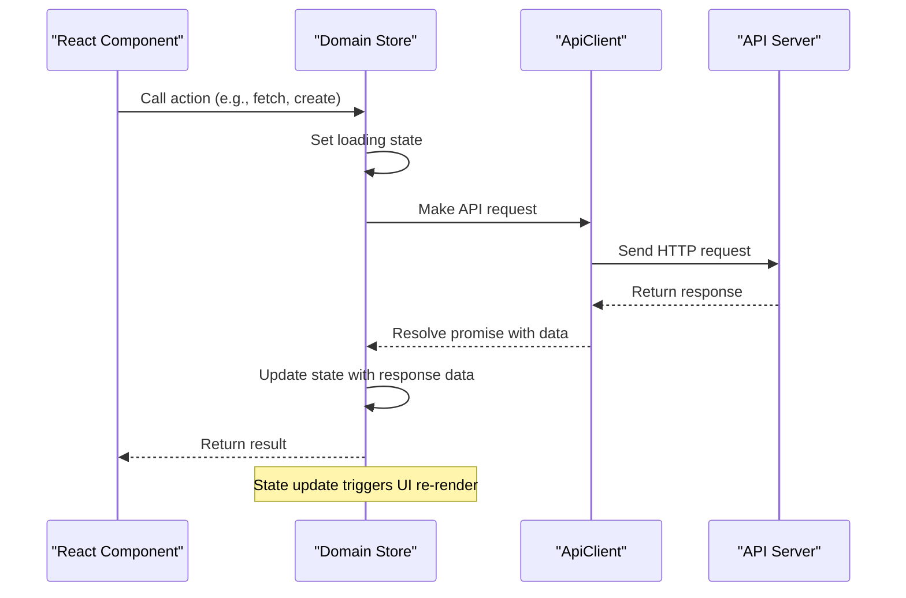
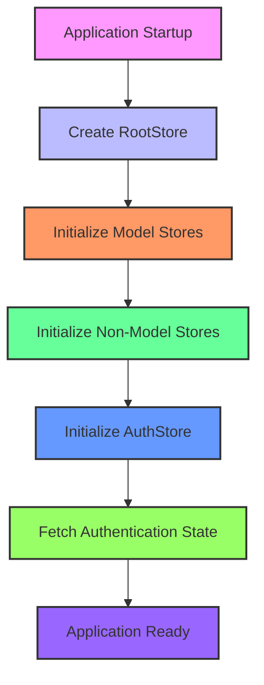
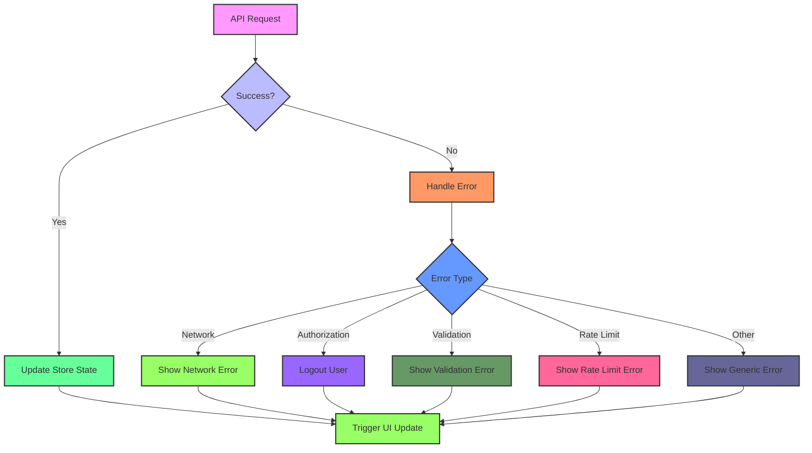
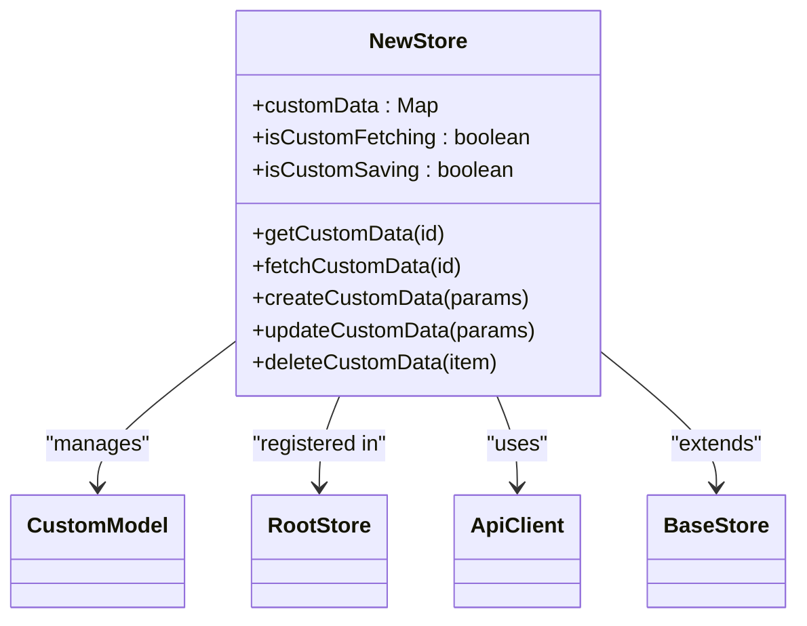
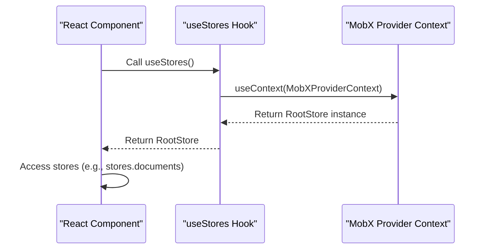

# State Management

<cite>
**Referenced Files in This Document**   
- [RootStore.ts](file://app/stores/RootStore.ts)
- [DocumentsStore.ts](file://app/stores/DocumentsStore.ts)
- [CollectionsStore.ts](file://app/stores/CollectionsStore.ts)
- [AuthStore.ts](file://app/stores/AuthStore.ts)
- [Store.ts](file://app/stores/base/Store.ts)
- [ApiClient.ts](file://app/utils/ApiClient.ts)
- [useStores.ts](file://app/hooks/useStores.ts)
</cite>

## Table of Contents
1. [Introduction](#introduction)
2. [RootStore Architecture](#rootstore-architecture)
3. [Base Store Implementation](#base-store-implementation)
4. [Domain-Specific Stores](#domain-specific-stores)
5. [Reactive Programming with MobX](#reactive-programming-with-mobx)
6. [API Integration](#api-integration)
7. [Store Initialization and Lifecycle](#store-initialization-and-lifecycle)
8. [Error Handling and Memory Management](#error-handling-and-memory-management)
9. [Creating and Extending Stores](#creating-and-extending-stores)
10. [Accessing Stores in Components](#accessing-stores-in-components)

## Introduction
The baozi application implements a comprehensive state management system using MobX, centered around a RootStore that orchestrates all domain-specific stores. This system provides centralized state management for the application's various domains including documents, collections, authentication, and user interface state. The architecture follows a hierarchical pattern where the RootStore instantiates and manages individual stores that extend a common base Store class, providing consistent functionality for data fetching, creation, updating, and deletion operations across all model types.

**Section sources**
- [RootStore.ts](file://app/stores/RootStore.ts#L40-L181)
- [Store.ts](file://app/stores/base/Store.ts#L49-L488)

## RootStore Architecture
The RootStore serves as the central orchestrator of the application's state management system, instantiating and managing all domain-specific stores. It provides a unified interface to access different stores through type-safe properties, ensuring consistent state management across the application. The RootStore is responsible for initializing all stores during application startup and provides utility methods for store management and data clearing.

**Diagram sources**
- [RootStore.ts](file://app/stores/RootStore.ts#L40-L181)

**Section sources**
- [RootStore.ts](file://app/stores/RootStore.ts#L40-L181)

## Base Store Implementation
The base Store class provides a common foundation for all domain-specific stores, implementing core functionality for data management operations. It extends MobX's observable capabilities to provide a consistent interface for fetching, creating, updating, and deleting model instances across all stores. The base Store handles common concerns such as request deduplication, loading states, and error handling, ensuring a uniform experience across different store implementations.

**Diagram sources**
- [Store.ts](file://app/stores/base/Store.ts#L49-L488)

**Section sources**
- [Store.ts](file://app/stores/base/Store.ts#L49-L488)

## Domain-Specific Stores
Domain-specific stores implement functionality tailored to their respective domains while inheriting common behavior from the base Store class. Each store provides domain-specific methods and computed properties that encapsulate business logic and data relationships. The DocumentsStore and CollectionsStore serve as prime examples of this pattern, implementing specialized functionality for document and collection management respectively.

### DocumentsStore
The DocumentsStore manages the application's document lifecycle, providing methods for creating, updating, and deleting documents. It implements computed properties for accessing documents in various states (active, archived, deleted) and relationships (by collection, by user). The store also handles document-specific operations such as moving, duplicating, importing, and managing document backlinks.

**Diagram sources**
- [DocumentsStore.ts](file://app/stores/DocumentsStore.ts#L48-L754)

**Section sources**
- [DocumentsStore.ts](file://app/stores/DocumentsStore.ts#L48-L754)

### CollectionsStore
The CollectionsStore manages hierarchical collection data and provides methods for organizing documents within collections. It implements computed properties for accessing collections in various states (active, private, non-private) and relationships (by navigation, by status). The store handles collection-specific operations such as moving, archiving, restoring, and managing collection permissions.

**Diagram sources**
- [CollectionsStore.ts](file://app/stores/CollectionsStore.ts#L18-L256)

**Section sources**
- [CollectionsStore.ts](file://app/stores/CollectionsStore.ts#L18-L256)

## Reactive Programming with MobX
The state management system leverages MobX's reactive programming patterns to enable automatic UI updates when state changes. The implementation uses MobX decorators to define observable properties, actions, and computed values, creating a responsive and efficient state management system.

### Observable Properties
Observable properties are used to track state changes in the application. When an observable property changes, MobX automatically updates any computed values or reactions that depend on it. This pattern is used throughout the store implementations to track loading states, saving states, and data collections.

### Actions
Actions are methods that modify observable state. They are marked with the @action decorator to ensure that state changes are batched and optimized for performance. Actions are used for all state-modifying operations, including data fetching, creation, updating, and deletion.

### Computed Values
Computed values are derived from observable state and are automatically updated when their dependencies change. They are used extensively in the store implementations to provide convenient access to filtered and sorted data collections, such as recently viewed documents or alphabetically sorted collections.

**Diagram sources**
- [DocumentsStore.ts](file://app/stores/DocumentsStore.ts#L49-L236)
- [CollectionsStore.ts](file://app/stores/CollectionsStore.ts#L28-L85)
- [AuthStore.ts](file://app/stores/AuthStore.ts#L43-L78)

**Section sources**
- [DocumentsStore.ts](file://app/stores/DocumentsStore.ts#L49-L236)
- [CollectionsStore.ts](file://app/stores/CollectionsStore.ts#L28-L85)
- [AuthStore.ts](file://app/stores/AuthStore.ts#L43-L78)

## API Integration
The state management system integrates with the application's API through the ApiClient utility, which handles HTTP requests and response processing. The integration follows a consistent pattern across all stores, with API endpoints constructed from the store's model name and action type.

### ApiClient Implementation
The ApiClient provides a wrapper around the fetch API with retry functionality, error handling, and request/response processing. It handles authentication, CSRF protection, and response parsing, providing a consistent interface for API communication across the application.

**Diagram sources**
- [ApiClient.ts](file://app/utils/ApiClient.ts#L40-L284)
- [Store.ts](file://app/stores/base/Store.ts#L279-L399)

**Section sources**
- [ApiClient.ts](file://app/utils/ApiClient.ts#L40-L284)
- [Store.ts](file://app/stores/base/Store.ts#L279-L399)

## Store Initialization and Lifecycle
The store initialization process follows a specific sequence to ensure proper dependency resolution and state consistency. The RootStore is responsible for instantiating all stores during application startup, with special consideration given to the AuthStore which depends on other stores being initialized first.

### Initialization Sequence
The initialization sequence ensures that stores are created in the correct order, with model stores created before non-model stores. The AuthStore is initialized last as it depends on other stores for its functionality.

### Data Clearing
The RootStore provides a clear() method that removes data from all stores except for persistent stores (auth, ui, audioRecorder, aiAsk). This method is used when the user logs out or when the application needs to reset its state.

**Diagram sources**
- [RootStore.ts](file://app/stores/RootStore.ts#L76-L116)
- [AuthStore.ts](file://app/stores/AuthStore.ts#L85-L127)

**Section sources**
- [RootStore.ts](file://app/stores/RootStore.ts#L76-L116)
- [AuthStore.ts](file://app/stores/AuthStore.ts#L85-L127)

## Error Handling and Memory Management
The state management system implements comprehensive error handling and memory management practices to ensure application stability and performance.

### Error Handling
Error handling is implemented at multiple levels, from the ApiClient which handles network and HTTP errors, to individual stores which handle domain-specific errors. The system uses MobX's runInAction to ensure that state updates are properly batched even when errors occur.

### Memory Management
Memory management is handled through proper disposal of reactions and cleanup of store state. The system uses MobX's autorun for persistent state synchronization and ensures that reactions are properly disposed when components unmount.

**Diagram sources**
- [ApiClient.ts](file://app/utils/ApiClient.ts#L148-L268)
- [Store.ts](file://app/stores/base/Store.ts#L368-L395)

**Section sources**
- [ApiClient.ts](file://app/utils/ApiClient.ts#L148-L268)
- [Store.ts](file://app/stores/base/Store.ts#L368-L395)

## Creating and Extending Stores
Creating new stores follows a consistent pattern that ensures integration with the existing state management system. New stores should extend the base Store class and implement domain-specific functionality as needed.

### Store Creation Guidelines
When creating a new store, follow these guidelines:
1. Extend the base Store class with the appropriate model type
2. Implement domain-specific computed properties for data access
3. Implement domain-specific actions for business logic
4. Register the store in the RootStore constructor
5. Ensure proper error handling and loading state management

### Store Extension Patterns
Existing stores can be extended by adding new computed properties or actions as needed. When extending stores, consider the impact on performance and memory usage, and ensure that new functionality follows the existing patterns.

**Section sources**
- [Store.ts](file://app/stores/base/Store.ts#L49-L488)
- [RootStore.ts](file://app/stores/RootStore.ts#L76-L116)

## Accessing Stores in Components
Stores are accessed in React components through the useStores hook, which provides access to the RootStore and all domain-specific stores. This pattern ensures that components can access the state they need while maintaining proper dependency injection and testing capabilities.

### useStores Hook
The useStores hook leverages React's useContext to access the RootStore from the MobX provider context. It returns the RootStore instance, allowing components to access any domain-specific store as needed.

**Diagram sources**
- [useStores.ts](file://app/hooks/useStores.ts#L10-L12)

**Section sources**
- [useStores.ts](file://app/hooks/useStores.ts#L1-L13)